= chapter 1: SDN overview
:doctype: book
:toc: right
:toclevels: 3
:source-highlighter: pygments
:pygments-style: manni
:data-uri:
:pygments-linenums-mode: table

== what is SDN - the history

=== Network device evolution

Since the early 1990 network device manufacturers have made a lot of innovation
in order to increase router speeds. They started from a router node in which
everything was computed into the central CPU to reach a situation where the
central CPU is used less and lesser due to a distributed architecture in which
lots of action are done in the so-called "line cards”.

//image:ch1-extracted-media/word/media/image1.svg[image]
ifndef::word[image:../diagrams/ch1-extracted-media/word/media/image1.png[image]]
ifdef::word[image:../diagrams/ch1-extracted-media/word/media/image1.emf[image]]

These progresses have been made thanks to the use of proprietary TCAM (Ternary
Content-Addressable Memory) and ASICs (Application-Specific Integrated Circuit)
which have been designed to perform table look up and data packets forwarding at
high speed.

In early 2000, the Virtualization for x86 computers support has led to lots of
innovation into systems domain. Compute virtualization and High-Speed network
devices evolution have enabled the **Cloud** creation.

Later, It appears it was not convenient to manage several isolated network
devices each having their own configuration language. The following needs have
emerged:

* Single point of configuration
* Configuration protocol standardization
* Network feature support on x86 servers
* Extensibility and ability to scale
* Good performance

And these desires called for the cloud and SDN technology development.

=== Early age of SDN

In Stanford University (US - CA), Clean Slate Research Projects program was
initiated in 2006 in order to think about how to improve the Internet network
architecture. "ETHANE" project was part of this program. Its purpose was to "
Design network where connectivity is governed by high-level, global policy".
This project is generally known as the first implementation of SDN.

In 2008, a white paper was proposed by ACM (Association for Computing
Machinery) to design a new protocol (OpenFlow) that can program network devices
from a network controller.

In 2011, ONF (Open Networking Foundation) was created to promote SDN
Architecture and OpenFlow protocols.

=== SDN startups acquired by major networks or virtualization vendors

First companies focusing on SDN were founded around 2010. (Most of them have
now been acquired by main networks or virtualization solution vendors.)
In 2007, Martin Casado, who was working on Ethane project founded Nicira to
provide solutions for network virtualization with SDN concept. Nicira was
aquired by vMware in 2012 to develop VMWare NSX. In 2016, VMWare also bought
PLUMGrid, a SDN startup founded in 2013.
In 2010, BigSwitch networks, which was proposing an SDN solution, was founded.
In early 2020, BigSwitch was acquired by Arista Networks.
In 2012, Cisco created Insieme Networks, a spin-off start-up company working
on SDN. In 2013, Cisco took back control of Insieme in order to develop its own
SDN solution called ACI (Application Centric Infrastructure).
In early 2012, Contrail Systems Inc was created and aquired at the end of
the year by Juniper Networks.
In 2013, Alcatel Lucent created Nuage Networks, a spin-off start-up company
working on SDN, which is now an affiliate of Nokia.

The road of SDN development and its history is never straighforward and looks
more nuanced than a single storyline might suggest. It's actually far more
complex to be described in a short section. This diagram from <<sdn-history>>
shows developments in programmable networking over the past 20 years, and their
chronological relationship to advances in network virtualization.

//image:../diagrams/sdn-history.png[sdn-history]
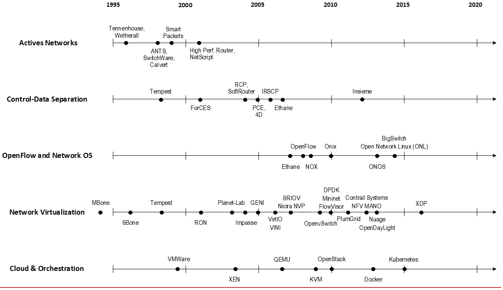

== SDN definition

=== What is SDN?

The concept of `SDN`, and the term itself, are both very broad and often
confusing.  There is no real accurate definition of SDN, and vendors usually
take it very differently. Initially it was used to in Stanford’s OpenFlow
project, and later it has been extended to include a much wider area of
technologies. Discussion about each vendor's exact SDN definition is beyond the
scope of this book. But we generally consider that a SDN solution has to
provide one to several of following characteristics:

* A network control and configuration plane split from the network dataplane.
* A centralized configuration and control plane (SDN controller)
* A simplified network node
* Network programmability to provide network automation
* Automatic provisioning (ZTP zero touch provisioning) of network nodes
* Virtualization support and openness

////
//laurent:
SDN (*Software Define Networking*) is a network architecture model in which the
network dataplane function has been physically splitted from configuration and
control plane function.
////

According to <<onf-sdn-definition>>, *Software-Defined Networking (SDN)* is:

> The physical separation of the network control plane from the forwarding plane,
> and where a control plane controls several devices

.SDN layer^<<onf-sdn-definition>>^
//jpg is too small after converted to word
//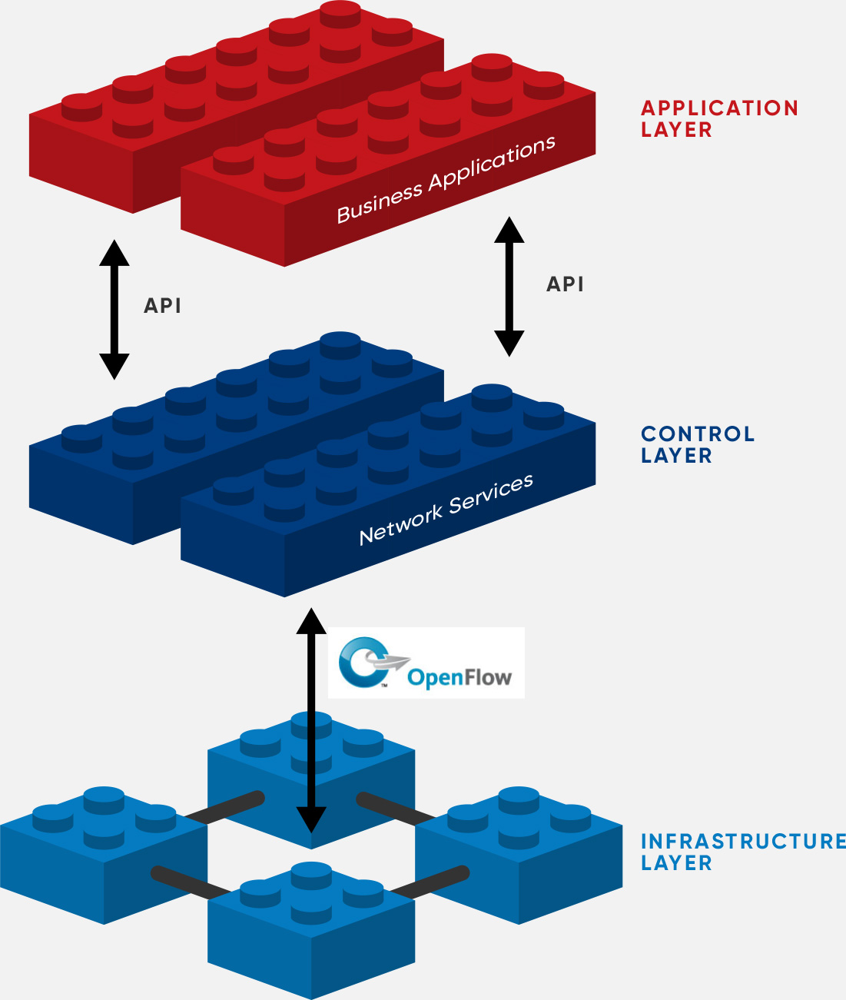
//seems size does not help when converting to word
//image:../diagrams/sdn-architecture-img.png[image]
image:../diagrams/sdn-architecture-img2.png[image]

////
//ping:
Infrastructure layer:: this layer is composed of all networking equipments, e.g.
routers, switches, firewalls, etc. these devices build "underlay network" which
carries all the network traffic, which are no much different from what we've
seen in any tradtional network in terms of forwarding behavior, except that
their control plane is now located in a centralized plane - the control layer.

Control layer:: is where all "intelligence" located and where "SDN controllers"
would reside. a SDN controller have a "global view" of the network as a whole,
and based on the information it has, it calculates the disired reachability
information on behalf of all individual network devices in the infrastructure
layer. It then gives configurations and instructions (e.g. flow table, routing
table, etc) to the network devices regarding how to do the forwarding, using the
"South bound" interfaces supported by the network devices.

Application layer:: is where all kinds of applications are located. each network
vendors are coming up with their set of SDN applications so this is the most
"open" area. application layer leverages the so-called "northbound interface"
provided by control layer, which hides the complicated, and trival details about
how to interact with the network devices. we'll talk about the north bound and
south bound interfaces in the coming sections.
////

In this diagram, you can see that SDN allows simple high-level policies in the
"application layer" to modify the network, because the device level dependency
is eliminated to some extent. The network administrator can operate the
different vendor-specific devices in the "infrastructure layer" from a single
software console - the "control layer". The "controller" in control layer is
designed with such a way that it can view the whole network globally.  This
controller design helps a lot to introduce functionalities or programs, since
the applications just needs to talk to the centralized controller, without
the need to know all details communicating with each individual device. These
details are hidden by the controller from the applications.

Several expectations are behind this new model:

- *Openness*: Communication between controller and network device uses
  standardized protocols like REST, OpenFlow, XMPP, NetConf, gRPC and etc. This
  eliminates traditional vendor lock-in, giving you freedom of choice in
  networking.

- *Cost reduction*: Due to the openness model, users can pick any low-cost
  vendor for their infrastructure (hardware).

- *Automation*: The controller layer has a global view of whole network. With
  the APIs exposed by the control layer, automation of applications becomes
  much easiler.

////
ch1 QUESTION: hard to explain why?
- *features rich*: with the ability of the SDN Controller to reprogram each
  controlled device using flow tables
////

NOTE: in this diagram, "openflow" is marked as the protocol between control
layer and infrastructure layer. This is just an example showing the use of
standard communication protocols. As of today more choices of communication
protocols are available and standardized in the SDN industry, which will be
covered later in this chapter.

=== Traditional Network Planes and SDN layer

.Traditional network device planes
Traditionally, a typical network device (E.g. router) has following planes:

.traditional network device planes
//image:ch1-extracted-media/word/media/image3.svg[image]
ifndef::word[image:../diagrams/ch1-extracted-media/word/media/image3.png[image]]
ifdef::word[image:../diagrams/ch1-extracted-media/word/media/image3.emf[image]]

- *Configuration* (and management) *plane*: This is used for network node configuration
  and supervision. Examples of widely use protocols are CLI (Command Line
  Interface), SNMP (Simple Network Management Protocol) and NetConf.
- *Control plane*: This is used by network nodes to make packet forwarding decision. In
  traditional networks there have been a wide range of various different network
  control protocols running in the networks. Common examples are OSPF, ISIS,
  BGP, LDP, RSVP-TE, etc.
- *Forwarding* (or data) *plane*: This plane is responsible to perform
  data packet processing and forwarding. 
  This forwarding plane is made of
  proprietary protocols and is specific to each network equipment vendor.

////
NOTE: strickly speaking, "CLI" by itself is NOT a real protocol, nor is it ever
"standardized" - it may never be. it is a tool to provide user the ability to
interact with each individual device, and in this sense we call it a protocol.
////

Configuration and Control planes are located in the device's main processor
card, often called the "routing engine", or "routing switching engine". The
forwarding plane is located in the device's packet forwarding card, often
called "line card". 

//TODO: add MX picture?

.SDN layer

SDN architecture typically has 3 layers:

.SDN architecture
//image:ch1-extracted-media/word/media/image4.svg[image]
ifndef::word[image:../diagrams/ch1-extracted-media/word/media/image4.png[image]]
ifdef::word[image:../diagrams/ch1-extracted-media/word/media/image4.emf[image]]

- *Application Layer*: This layer contains all the application provided by the
  SDN solution. Generally a Web GUI dashboard is the first application provided
  to SDN users. Other common applications are Network infrastructure
  interconnection interfaces allowing the SDN solution to be plugged to a Cloud
  Infrastructure or a Container orchestrator.

- *Control Layer*: This layer containing the SDN controller. This is the most
  intelligent part of a SDN solution and has the global view of the whole
  network. The SDN controller is made up of:
  ** the SDN engine, which contains SDN Control Logic and databases to store
     the state and configuration of the network.
  ** "Southbound" interfaces, which are used to communicate with the SDN
     network nodes. Some of the most commonly used southbound interface
     protocols are OpenFlow, XMPP and OVSDB.
  ** "Northbound" interfaces, which are used to expose services provided by the
     infrastructure layer "upwards" to the SDN applications. The most commonly
     used northbound interface protocol is HTTP/REST.

- *Infrastructure Layer*: This layer consists of the SDN network nodes. This is the work
  load of a SDN solution. SDN network nodes can be either physical or virtual
  nodes. Typically, on each SDN node, the following components exists:
  ** A SDN agent: which is handling the communication between each SDN network
     node and the SDN controller.
  ** A flow/routing table built by the SDN Agent.
  ** A forwarding plane engine

=== the primary changes between SDN and traditional networking

In a traditional infrastructure, the route calculation is made on each
individual router. Each router needs to run one or several routing protocols,
through which it exchanges routes with the rest routers in the network, and
eventually, based on the route information learned, each router assumes it gains
enough knowledge about the network in order to make the forwarding decision.
From the network perspective, the control plane is distributed in each
individual router, and the end to end routing path is the result of all
decisions made by the control plane located on each router. 

The control plane on one router may look like this:

.Component in a traditional router
//image:ch1-extracted-media/word/media/image5.svg[image]
ifndef::word[image:../diagrams/ch1-extracted-media/word/media/image5.png[image]]
ifdef::word[image:../diagrams/ch1-extracted-media/word/media/image5.emf[image]]

In reality, for example, a simplified Juniper MX control plane typical looks
like this:

//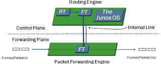
//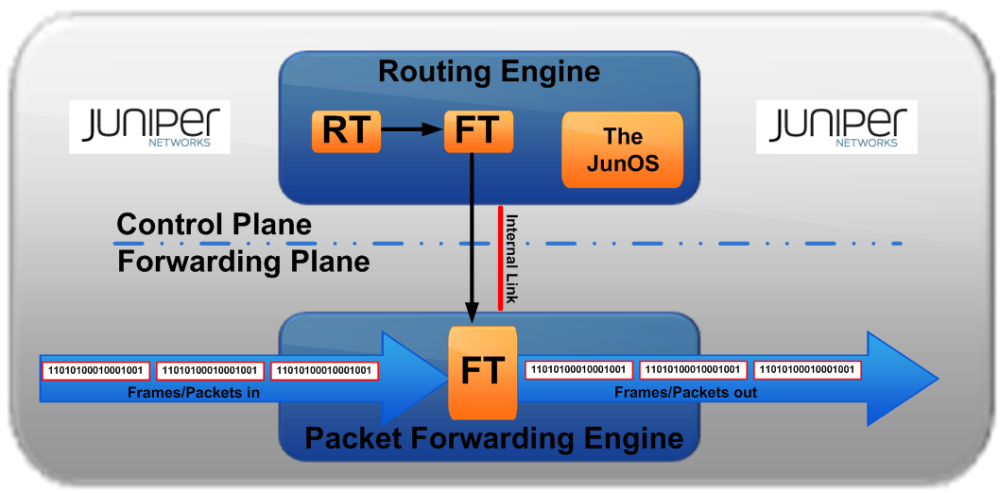
//image:../diagrams/mx-control-data-plane.png[image]
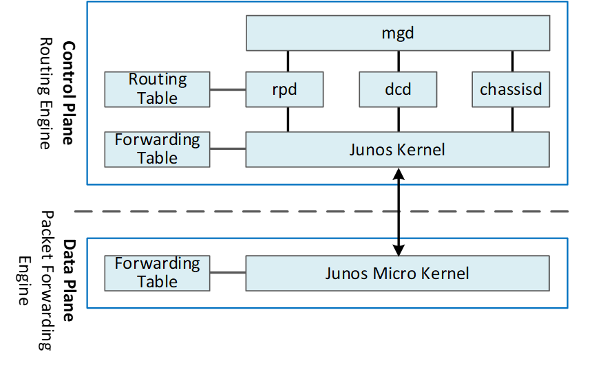

//even though traditional networks are very robust, 
Running a control plane on each router make it very hard to manage, because each
individual network device needs to be carefully configured. It requires
extensive, vendor-specific experiences and skills to configure the device.  The
high number of configuration points often make it very challenging to build a
robust network.  Flexibility is also a recurring hurdle for traditional networks
since most routers run proprietary hardware and software. 

//Traditional network nodes require expensive components because they are implementing high end routing protocols.

In contrast, in SDN networking, Control and Configuration functions are gathered
into a "SDN controller" which is controlling Network devices.  The new
architecture intends to provide a completely new way to configure the network.
This new Cloud infrastructure brings:

- simplified routers, without complex control plane in each router.
- a centralized control plane, which is a single configuration point

Let's compare the two architectures:

.Comparison between tradition network devices and SDN devices
//image:ch1-extracted-media/word/media/image2.svg[image]
ifndef::word[image:../diagrams/ch1-extracted-media/word/media/image2.png[image]]
ifdef::word[image:../diagrams/ch1-extracted-media/word/media/image2.emf[image]]

////
?
- the ability to distribute at a higher scale network elements, at least in
  each Cloud compute, and not only at the network infrastructure level.

In order to get a single configuration point, a centralized network controller
is proposed by the SDN Architecture. In order to be able to simplify network
nodes, the smartest part has been moved onto a controller.
////

This SDN infrastructure uses a centralized configuration and control point.
route calculation is done centrally in the controller and distributed into each
SDN network node. Well the idea looks good and simple, it requires a few
fundamental protocols and infrastructures to be implemented before this model
can work:

* a southbound network protocol: This is needed to allow routing information
  being exchanged between the SDN controller and each controlled element. 
* A "underlay" network: This is a network infrastructure which allows the
  communication between SDN controller & SDN network nodes, and also the
  communication between SDN nodes themselves.

This underlay network infrastructure is playing the same role that the local
switch fabric is doing inside a standalone router between the control processor
card and lines cards. Based on it, an "overlay" network can be built by the
controller, which basically hides underlay network infrastructure details from
the applications so they will focus on the high level service implementations.
we'll talk more about "underlay" and "overlay" in the next section.

This model also makes the controller the weakest point in the whole
model. Think of what will happen if this SDN controller, serving as the "brain",
stops working. Everything will be frozen and nothing works as expected, or even
worse, some part of the infrastructure continues to run but in an unexpected
way, which will very likely trigger bigger issues to other part of the network.

Lots of efforts are done by each SDN solution supplier to solve this weakness.
A common and efficient practice is to use clustered architecture to build a
highly resilient controller cluster. e.g 3 SDN controllers can load balance
and/or backup each other. On failure of one or two, the other one can still make
the whole cluster survive, giving the operator longer maintenence windows to fix
the problem.

//TODO: a 3 controller diagram will be better, opertional

//* highly scalable: using distributed compute and storage architectures

=== Underlay vs overlay

.underlay network
In SDN architecture, each network node is connected to a physical network
infrastructure. This physical network which is providing basic connectivity
between network nodes is called the "underlay" network infrastructure. Sometimes
it is also called "fabric", and typically it's a plane L3 IP network.

.overlay network
Very often, the underlay needs to separate between different administrative
domains (often called "tenants"), switch within the same L2 broadcast domain,
route between L2 broadcast domains, provide IP separation via VRFs, and etc.
This is implemented in the form of "overlay" networks. The overlay network is a
logical network that runs on top of the underlay network. The overlay is formed
of tunnels to carry the traffic across the L3 fabric. 

.why do we need overlay networks?
Today the industry is movingg in the direction of building L3 data centers
and L3 infrastructures, mostly due to the rich features coming from L3
technologies, e.g, ECMP load balancing, flooding control, etc. But the L2
traffic does not disappear and most likely it never will. There are always the
desire that a group of network users need to reside in the same L2 network -
typically a VLAN. However, In today's virtualization environment, a user's VM
can be spawned in any compute located anywhere in the L3 cluster. Even if 2 VMs
are spawned in the same server, there is often a need to move them around
between different servers without changing their networking attributes. These
requirements to make a VM always belonging to the "same VLAN" calls for an
overlay model over the L3 network. In other words, we need a new mechanism to
allow us to tunnel L2 Ethernet domains with different encapsulations over an L3
network.

For example, let's assume in a SDN node "node1" we were running VM11 and VM12,
they were both serving same sales department and so they were located in same
VLAN.  Because of some administrative requirement, VM12 needs to be moved to
another physical SDN node2 which, may be physically located in another rack
that is a few router "hops" away. Now we need to ensure not only data packet
from VM11 in SDN node1 to be able to reach VM12 in SDN node2, but also they are
talking to each other as if they are still in the same VLAN, exactly the same
way as before just as if VM12 has never moved. This ability to make the "local"
(in same VLAN) traffic to traverse transparently across underlay network
infrastructure calls for a packet encapsulation, or "tunneling" mechanism in
SDN networks.

.overlay tunnels and encapsulations
//image:ch1-extracted-media/word/media/image7.svg[image]
ifndef::word[image:../diagrams/ch1-extracted-media/word/media/image7.png[image]]
ifdef::word[image:../diagrams/ch1-extracted-media/word/media/image7.emf[image]]

//TODO: correct diagram: IP node 1 => VM11, VM12; IP node 2=> VM21, VM22

Indeed, without such an encapsulation mechanism, traditional segmentation
solutions (VLAN, VRF) would have to be provided by the physical infrastructure
and implemented up to each SDN node, in order to provide an isolated
transportation channel for each customer network connected to the SDN
infrastructure.

Encapsulation protocols used in SDN networks have to provide at least the
following capabilities:

* The ability to build several different network connectivity between 2 SDN
  network nodes. This is called network segmentation.
* The ability to carry transparently Ethernet frames and IP packets
* The ability to be carried over an IP connectivity

Today, several encapsulation protocols are used into SDN networks:

* VxLAN
* MPLS over GRE
* MPLS over UDP
* NVGRE
* Geneve
* STT

//image:ch1-extracted-media/word/media/image8.svg[image]
ifndef::word[image:../diagrams/ch1-extracted-media/word/media/image8.png[image]]
ifdef::word[image:../diagrams/ch1-extracted-media/word/media/image8.emf[image]]

//NVGRE: ethernet over GRE
//Geneve: ethernet over UDP, introduce TLV
//STT: Stateless Transport Tunneling, MAC in TCP
These encapsulation protocols are providing Overlay connectivity which is
required between customers workloads connected to the SDN infrastructure.
TIP: in VxLAN, specifically, Each SDN node is call a VTEP (Virtual Tunnel End
Point) as it is starting and terminating the overlay tunnels.

=== interfaces between layers

In the section "Traditional Network Planes and SDN layer", we've mentioned
"southbound" and "northbound" interfaces, Now we'll elaborated on these
concepts of "southbound" and "northbound" interface and some available choices
in today's industry.

.southbound interface 

The "southbound" interface resides between the controller in "control layer" and
network devices in "infrastructure layer". Basically what it does is to provide
a means of communication between the 2 layers. Based on the demands and needs, a
SDN Controller will dynamically changes the configuration or routing information
of network devices. For example, a new VM will advertise a new subnet or host
routes when it is spawned in a server, this advertisement will be delivered to
SDN controller via a southbound protocol. Accordingly, SDN controller collects
all routing updates from the whole SDN cluster through the southbound
interfaces, and decides the most current and best route entries, then, it may
"reflect" these information to all other network devices or VMs. This ensures
all devices having the most uptodate routing information in real time. Among
others, examples of the most well-known southbound interfaces in the industry
are `openflow`, `OVSDB`, `gRPC` and `XMPP`. Among them, `openflow`
and `OVSDB` perhaps are the most well-known south bound interfaces. We'll
briefly introduce them.

.openflow

Openflow is a protocol that sends flow information into the virtual switch so
the switch can forward the packets between the different ports.  Flows are
defined based on different criteria such as traffic between a source MAC
address and a destination MAC address, source and destination IP addresses, TCP
ports, VLANs, tunnels, and so on.

OpenFlow is one of the most widely deployed southbound standard from open source
community. It first made its appearance in 2008 by Martin Casado at Stanford
University. The appearance of OpenFlow was one of the main factors which gave
birth to Software Defined Networking.

OpenFlow provides various information for the Controller. It generates the
event-based messages in case of port or link changes. The protocol generates a
flow based statistic for the forwarding network device and passes it to the
controller. 

OpenFlow also provides a rich set of protocol specifications for effective
communication at the controller and switching element side. Open Flow provides
an open source platform for Research Community. 

Every physical or virtual OpenFlow-enabled network (data plane) devices in the
SDN domain needs to first register with the OpenFlow controller. The
registration process is completed via an OpenFlow `HELLO` packet originating
from the OpenFlow device to the SDN controller. 

////
//these texts are a little bit redundant
NOTE: although openflow is very popularly used as southbound interface in SDN,
it is not the only choice for the southbound interface. there are other options
available(like XMPP).
////

.OVSDB
abbreviation for "Open vSwitch Database".  unlike openflow, OVSDB is a
southbound API designed to provide additional **management** or
**configuration** capabilities like networking functions. With OVSDB we can
create the virtual switch instances, set the interfaces and connect them to the
switches.  We can also provide the QoS policy for the interfaces.  OVSDB is a
protocol written in the JavaScript Object Notation (JSON) that basically sends
and receives commands via JSON RPCs. 

.Northbound interface

The northbound interface provides connectivity between the controller and the
network applications running in management plane. As we already discussed that
southbound interface has different available protocols, northbound lacks such
type of protocol standards. However with the advancement of technology now we
have a wide range of northbound API support like ad-hoc API's, RESTful APIs
etc. The selection of northbound interface usually depends on the programming
language used in application development.

=== More alphabet soup of terms

With the development of virtualization, SDN technologies and their ecology in
recent years, more and more terms and changing of these terms are emerging in
the networking industry. A lot of confusions rise due to the context in which
these terms are used. Sometimes the latest term the industry uses is a
particular technology such as VNF or a concept such as NFV. Terms rise and fall
out of favor as the industry evolves. In recent years the terms such as
openstack, NVF/VNF have become the industry’s favorite buzzword. This raises the
question - Just what is openstack, NVF/VNF and what are what is the
relationships of these things with SDN?

////
The first concept that comes to the mind of the average industry professional is
running one or more guest operating systems on a host. However, digging a little
deeper reveals this definition is too narrow. There are a large number of
services, hardware, and software that can be “virtualized”. This section will
take a look at these different terms along with the pros and cons of each.
////

.NFV: Networking Function Virtualization

`NFV`/`VNF` sounds like new buzzwords, but those technologies have been around
for years.  according to ETSI:

.VNF/VNFI (contrail/NFX) vs NFV (vsrx) vs NMO (cso):
//image:https://user-images.githubusercontent.com/2038044/57194252-c9f6cd00-6f12-11e9-8ae0-dbc96830f428.png[]
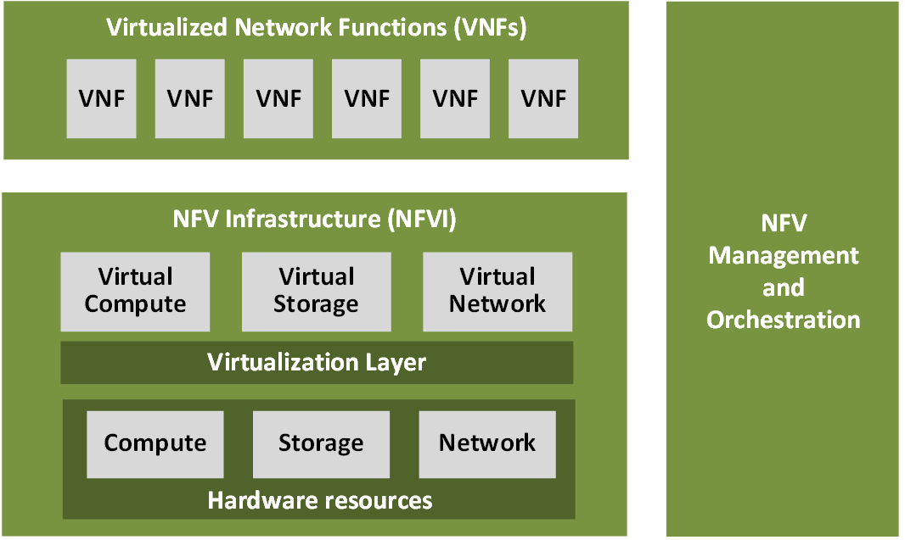

`NFV` means "network function virtualization", it stands for an "operation
framework for orchestrating and automating VNFs". And `VNF` means "virtualized
network function", such as virtualized routers, firewalls, load balancers,
traffic optimizers, IDS or IPS, web application protectors, and so on. 

////
VNF/VNFI:: NFV infrastructure: contrail/NFX
NFV:: vsrx 
NMO:: cso
VIM:: virtualized infrastructure manager, openstack, contrail, used to initiate VNFs
////

In a nutshell, you can think of NVF as a "concept", or "framework" to
virtualize certain network functions, while VNF is the implementations of each
individual network functions.  Among others, firewalls and load balancers are
the two most common `VNFs` in the industry, especially for deployments inside
data centers. When you read today's documents about virtualization technology,
you will see the terms in such a pattern like "vXXX" (e.g. vSRX, vMX), or
"cXXX" (e.g.  cSRX) very often. that letter `v` indicates it is a "virtualized"
product, while letter `c` - "containerized" is its container version. 

.openstack

Jointly launched by NASA and Rackspace in 2010, Openstack has rapidly gained
popularity in many enterprise data centres. It is one of the most used open
source cloud computing platform to support software development and Big Data
analytics.  OpenStack comprises a set of software modules, e.g, compute, storage
& networking modules, which works together to provide an open source choice for
building private & public cloud environments. As an IaaS (Infrastructure As A
Service) open source implementation ,it provides a wide range of services, from
basic service like computing service, storage service, networking service, etc,
to advanced services like database, container orchestration and others. 

You can think of Openstack as an abstraction layer providing a cloud
environment on your promise. With openstack installed in your servers, you can
spawn a VM, consume and recycle it when you are done, all in seconds. Under
that abstraction layer, Openstack hides most complexities of automation and
orchestration of diverse underlying resources like compute, storage and
networking. You could choose Servers, storage, networking devices from your
favorite vendors to build the underlying infrastructure, and openstack will
"consume" all of them and expose to the user as a pool of common "resources"
like number of CPUs, RAMs, hard disk spaces, IP addresses, etc. The user does
not (need to) care about vendor and brand details.

image:../diagrams/openstack-ui.png[image]

If we compare openstack with SDN, it's not hard to see that the two model shares
some common features. Both models provide certain level of abstractions, hide
the low level hardware details and expose to upper level user applications.  The
differences are somewhat subtle to describe in just a few words. First off,
although there are various distributions from different vendors, they share
common core components that is managed by the OpenStack Foundation. SDN is more
of a "framework" or an "approach" to manage the network dynamically,  which can
be implemented with totally different software techniques.  Secondly, From the
perspective of technical ecological coverage, the ecological aspects of
OpenStack are much wider, because networking is just one of its services that is
implemented by its `Neutron` component among its other various plugins.  SDN,
and its ecology, in contrast, mainly focus on the networking.  There are also
difference in the way that Neutron works comparing with how a typical SDN
controller works. OpenStack Neutron focuses on providing network services for
virtual machines, containers, physical servers, etc, and provides a unified
**northbound** REST API to users, SDN focuses on configuration and management of
forwarding control toward the underlaying network device, it not only provides
user-oriented northbound API, but also provides standard **southbound** API to
communicating with various hardware devices. 

NOTE: The comparison between openstack and SDN here are more of conceptual. In
reality these two models can, and in fact often, coupled with each other in
some way, loosely or tightly. one example is Tungsten Fabric(TF), which we'll
talk about later in this chapter.

////
Flexibility is the main driver for any visualization platform.  The data center
network itself is also part of the virtualization revolution. SDN and network
overlays are the key drivers for virtualizing networks in data centers.
////

== SDN solutions Overview 

=== controllers

As we've mentioned in previous sections, SDN is a networking solution which
changes the traditional network architecture by bringing all control
functionalities to a single location and making centralized decisions.
SDN controllers are the brain of SDN architecture, which perform the control
decision tasks while routing the packets. Centralized decision capability for
routing enhances the network performance. As a result, SDN controller is the
core components of any SDN solutions.

While working with SDN architecture, one of the major point of concerns is which
controller and solution should be selected for deployment. There are quite a few
SDN controller and solutions implementations from various vendors, and every
solution has its own pros and cons along with its working domain. In this
section we'll review some of the popular SDN controllers in the market, and the
corresponding SDN solutions.

////
==== SDN controller reports

.TODO, some research about today's market players, may skip

image:https://user-images.githubusercontent.com/2038044/78374061-61d4bf00-7599-11ea-9742-20b94163ddcf.png[image]
////

=== opendaylight (ODL)

OpenDaylight, aften abbreviated as ODL, is a Java based open source project
started from 2013, it was originally led by IBM and Cisco but later hosted under
the Linux Foundation. it was the first open source Controller that could support
non-OpenFlow southbound protocols, which made it much easier to be
integrated with multiple vendors.

ODL is a modular platform for SDN. It is not a single piece of software. It is a
modular platform for integrating multiple plugins and modules under one umbrella
There are many plugins and modules built for OpenDaylight. Some are in
production, while some are still under development. 

.opendaylight "Boron"
image:../diagrams/BoronDiagrams_final.png[]
//image:https://user-images.githubusercontent.com/2038044/78376350-2f789100-759c-11ea-923c-883b03048d37.png[image]

Some of the initial SDN controllers had their southbound APIs tightly bound to
OpenFlow, but as we can see from the diagram, besides openflow, many other
southbound protocols that are available in today's market are also supported.
Examples are NETCONF, OVSDB, SNMP, BGP, etc. Support of these protocols are done
in a modular method in the form of different plugins, which are linked
dynamically to a central component named "Service Abstraction Layer (SAL)". SAL
does translations between the SDN application and the underlaying network
equipments. for instance, when it receives a service request from a SDN
application, typically via high level API calls (northbound), it understands the
API call and translates the request to a language that the underlying network
equipments can also understand. That language is one of the southbound
protocols.

While this "translation" is transparent to the SDN application, ODL itself needs
to know all the details about how to talk to each one of the network devices it
supports, their features, capabilities etc. A `topology manager` module in ODL
manages this type of information. It collects
topology related information from various modules and protocols, such as ARP,
host tracker, device manager, switch manager, OpenFlow, etc, and based on this
info, it visualizes the network topology by drawing a diagram dynamically, and
shows all the managed devices and how they are connected together.

.ODL topology
image:../diagrams/odl-topo1.png[]

Any topology changes, such as adding new devices, will be updated in the
database and reflected immediately in the diagram. 

.ODL topology update
image:../diagrams/odl-topo2.png[]

As an SDN controller, ODL has "global view" of the whole network, therefore it
has all necessary visibility and knowledge of the network that can be used to
draw the network diagram in realtime.

//== OVS^<<ovs>>^

=== Open vSwitch (OVS) introduction

OVS is one of the most popular and "production quality" open source
implementation of a multilayer virtual switch. OVS was created by Nicira back
in 2009, which was acquired by VMware. It is licensed under the Apache 2.0
license and provided by Linux Foundation.The virtual switch basically does most
of the jobs you could expect a physical switch does, but in a software method.
OVS is typically running with linux hypervisors like KVM and can be loaded on a
Linux kernel. OVS supports most features supported in tradtional physical
switches, such as:

* 802.1Q and VLAN
* BFD
* NetFlow/sFlow
* port mirroring
* LACP
* VXLAN
* GENEVE GRE Overlays
* STP
* IPv6

Besides functions of traditionalities of traditional switches, the bigger
advantage of OVS is that it also has native support to SDN solution via `OVSDB`
and `OpenFlow` protocols.  That means any SDN controller can integrate OVS via
these 2 open standard protocols. Therefore OVS can work either as a standalone
L2 switch within a hypervisor host, or it can be managed and programmed via an
SDN controller, such as ODL. that is why it is used in so many open source and
commercial virtualization projects.  

////
=== The OVS archetecture

Open vSwitch introduced an architecture that comprises an SDN controller that
configures and manages virtual switches via the `OVSDB` protocol and pushes
flows inside the switches via the `OpenFlow` protocol. In general the OVS
comprises the following components:

* An ovsdb-server database
* An ovsdb-vswitchd daemon
* A kernel module

The architecture is described in this figure:

//image::../diagrams/OVS-arch.jpg[image]
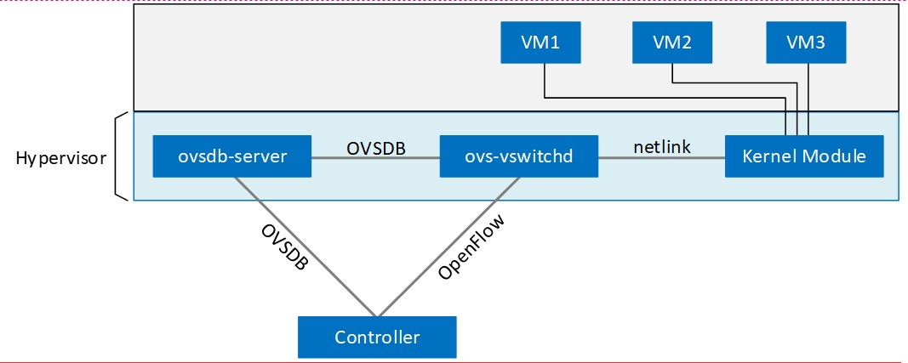

.Ovsdb-server

This is a configuration database that controls and stores the switch-level
configuration. It contains information on creating bridges, attaching
interfaces, attaching tunnels, and so on. These objects are organized in the
form of a set of different tables that points to each other in a certain
sequence:

* OVS table 
* Bridge table
* Port table 
* Interface table

For example, an entry in the top level OVS table points to a brige table, which
has items pointing to a port table, which in turn, points to a interface table.
A stateful database makes sure the system can recover back to the exact status
it was in case it rebooted. The ovsdb-server database talks to the outside
controller via the `OVSDB` protocol.

.Ovsdb-vswitchd

This is the heart of OVS and where flow processing happens.  `ovsdb-vswitchd`
has all the information (e.g. bridges, flow tables, etc) needed to forward
packets. It has different interfaces to other components.  Inside of the
hypervisor, it connects to ovsdb-server via the OVSDB protocol, and to the
kernel module via a Linux Netlink interface. To outside controller, it runs
OpenFlow protocol to exchange flow information.

//Ovsdb-vswitchd handles the forwarding of all sorts
//of flows that are communicated to it via the OpenFlow protocol.

//.ovs ovsdb:

//image::https://user-images.githubusercontent.com/2038044/78375629-158a7e80-759b-11ea-965a-6e858a76b2b8.png[image]

=== OVS workflow

`Ovsdb-vswitchd` pushes the flows to the kernel module for fast forwarding.
When the first packet arrives, it goes through the kernel module, where the
headers are hashed to find a flow entry. If the flow entry is not found, the
packet goes to ovsdb-vswitchd for normal processing. `Ovsdb-vswitchd` then
pushes the flow to be cached inside the module kernel. If a similar flow comes
in, it is forwarded via the fast path inside the kernel module. The kernel
module does not contain any of the OpenFlow tables that are known to
ovsdb-vswitchd; rather, it contains the result of the different lookups in the
flow tables. The kernel module also handles the tunneling of packets via
protocols such as GRE, VXLAN, and others.

////
=== Calico introduction

Quote from calico official website:
____
Calico is an open source networking and network security solution for
containers, virtual machines, and native host-based workloads. Calico supports
a broad range of platforms including Kubernetes, OpenShift, Docker EE,
OpenStack, and bare metal services.
____

Calico has been an open-source project from day one. It was originally designed
for today's modern cloud-native world and runs on both public and private
clouds. Its reputation mostly comes from it's deplayment in Kubernetes and its
ecosystem environments. Today Calico has become one of the most popularly used
kubernetes Contrainer Network Interfaces(CNI) and many enterprises are using it
at scale.

Comparing with other overlay network SDN solutions, Calico is special in the
sense that it does not use any overlay networking design or tunneling
protocols, nor does it require NAT.  Instead it uses a plain IP networking
fabric to enables host to host and pod to pod networking.  The basic idea is to
provides Layer 3 networking capabilities and associates a virtual router with
each node, so that each node is behaving like a traditional router, or a
"virtual router". We know that a typical Internet router relies on routing
protocols like OSPF, BGP to learn and advertise the routing information, and
That is the way a node in calico networking works. It chooses BGP as its
routing protocol, because of it's simple, industry's current best practice, and
the only protocol that sufficiently scale.

Calico uses a policy engine to deliver high-level network policy management. 

////
=== Calico archetecture

//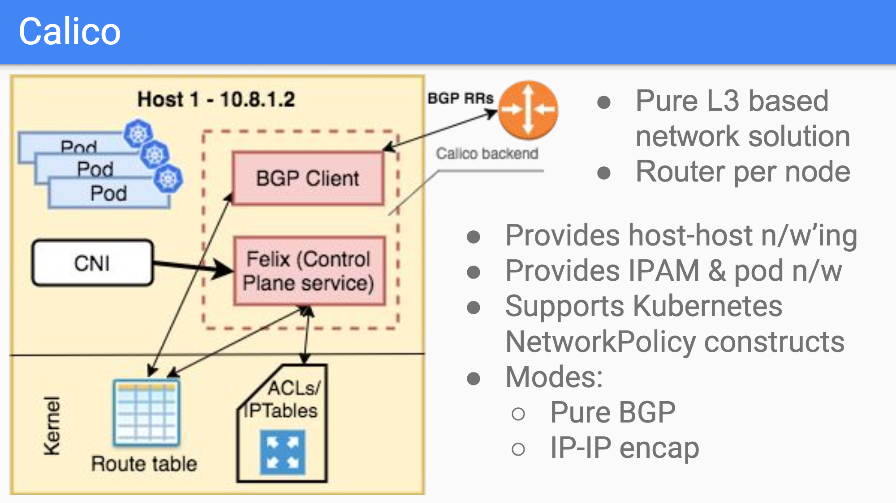
image:../diagrams/calico-arch.png[image]

Calico is made up of the following components:

- Felix: This is the primary Calico agent that runs on each machine that hosts endpoints.
- The Orchestrator plugin: orchestrator-specific code that tightly integrates Calico into that orchestrator.
- BIRD: This is an opensource BGP speaker module that advertises and installs
  routing information.
- BGP Route Reflector (BIRD): This is an optional BGP route reflector for higher scale.
- Calico CNI plugin: This plugin connects the containers with the host
- IPAM: This module is needed for IP address allocation management
- etcd: the data store.

.felix (policy)

This is calico "agent" - a daemon that runs on every workload, for example on
nodes that host containers or VMs. it is the one that performs most of the
"magics" in the calico stack. It is responsible for programming routes and
ACLs, and anything else required on the host, in order to provide the desired
connectivity for the endpoints on that host.

Depending on the specific orchestrator environment, Felix is responsible for
the following tasks:

* Interface management (ARP response)
* Route programming (linux kernel FIB)
* ACL programming (host IPtables)
* State reporting (health check)

//It has multiple responsibilities:
//
//- it writes the routing table of the operating system 
//- it manipulates IPtables on the host.

It does all this by connecting to etcd and reading information from there. It
runs inside the calico/node DaemonSet along with `confd` and `BIRD`.

.Orchestrator plugin

The orchestrator plugins are essentially responsible for API translations.
Calico has a separate plugin for each major cloud orchestration platforms (e.g.
OpenStack, Kubernetes). 

//The purpose of these plugins is to bind Calico more tightly into the
//orchestrator, allowing users to manage the Calico network just as they’d manage
//network tools that were built into the orchestrator.

For example in openstack environment, a Calico Neutron ML2 driver integrates
with Neutron’s ML2 plugin to allows users to configure the Calico network
simply by making Neutron API calls. This provides seamless integration with
Neutron.

.Etcd (database)

the backend data store for all the information Calico needs. it can be the same
of different etcd that kubernetes use.
//it's recommended deploy a separate etcd for production systems, or at least
//deploy it outside of your kubernetes cluster.
it has at least, but not limited to the following information:
* list of all workloads (endpoints)
* BGP configuration
* policys from user (e.g. defined via the `calicoctl` tool)
* information about each container (pod name, IP, etc), received from calico CNI

.BIRD (BGP)

Calico makes uses of BGP to propagate routes between hosts.  And the BGP
"speaker" in calico is BIRD - a routing daemon that runs on every host that
also hosts Felix module in the Kubernetes cluster, usually as a `DaemonSet`. It
’s included in the calico/node container.  it's role is to read routing state
that Felix programs into the kernel and distribute it around the data center.
comparing with what Felix does, one of the main differences is that Felix
"insert" routes into the linux kernel FIB and BIRD "distribute" them to all
other nodes in the deployment, this turns each host to a virtual Internet BGP
router ("vRouter"), and ensures that traffic is efficiently routed around the
deployment.

.Confd

confd is a simple configuration management tool. In Calico, BIRD does not deal
with etcd directly, it is another module "confd" that reads the BGP
configuration from etcd and feed to BIRD in the form of configurations files in
disk.

.CNI plugin

configure IP, routes
`CNI` stands for "container networking interface". 

There’s an interface for each pod, When the container spun up, calico (via CNI)
created an interface for us and assigned it to the pod.

when a new pod starts up, Calico will:
- query the kubernetes API to determine the pod exists and that it’s on this node
- assigns the pod an IP address from within its IPAM
- create an interface on the host so that the container can get an address
- tell the kubernetes API about this new IP

.IPAM plugin

as the name indicated already, Calico's IPAM plugin is responsible for "IP
address management". when a new container is spawn, calico IPAM plugin reads
information from etcd database to decide which IP is available to be allocated
to the container. the IP address by default will be allocated in the unit of
/26 "block". a block is essentially a subnet which aggregate the routes to save
routing table spaces.

=== calico workflow

- A pod/container is spawned using an orchestrator like kubernetes
- Calico IPAM plugin assign an IP address from an IP block (by default /26). It
  then records this in etcd.
- Calico CNI applies the network configuration to the container so it has a
  default route pointing to the host. The CNI also save this information in etcd.
- Calico felix applies the network configuration to the host, so it is aware of
  the new container, and be ready to receive packets from it.
- confd reads the data from etcd and generates the routing configuration, BIRD
  uses this configuratioin to establish BGP neighborship with other nodes. It
  then advertises the container subnet to the rest of the cluster via BGP
- All other hosts in the same cluster will learn this subnet via BGP and
  install the route into its local routing table, now the new container is
  reachable from anywhere in the cluster.
- User may configure a routing policy, E.g. via the `calicoctl` commands. The
  policy will be saved in etcd database. Felix reads this policy and applies it
  to the firewall configurations.

//.Reference
//
//* https://www.projectcalico.org
//* https://www.projectcalico.org/why-bgp/
////

=== VCP(nuage) introduction

The SDN platform offered by Nuage Networks (Now Nokia) is called "Virtualized
Cloud Platform (VCP)". It provides a "policy-based" SDN platform that has a
data plane built on top of the open source OVS, and a closed source SDN
controller.

The Nuage platform uses overlays to provide policy-based networking between
different clouding environment (Kubernetes Pods or non-Kubernetes environments
such as VMs and bare metal servers). It also has a real-time analytics engine
to monitor Kubernetes applications.

All components can be installed in containers. There are no special hardware
requirements.

////
=== VCP architecture

Nuage VCP incudes 3 major components:

* virtualized services directory (VSD)
* virtualized services controller (VSC)
* virtualized routing and switching (VRS)

.Nuage architecture
image:https://user-images.githubusercontent.com/2038044/78465427-93e24000-76c3-11ea-92ee-39a45a259e74.png[image]

.VSD

In Nuage VCP, The Virtualised Services Directory (VSD) is a policy engine,
business logic and analytics engine that supports the abstract definition of
network services. Through RESTful APIs to VSD, administrators can define and
refine service designs and incorporate enterprise policies.

It is a web-based, graphical console that connects to all of the VRS nodes in
the network to manage their deployment and configuration. 

The VSD policy & analytics engine presents a unified web interface where
configuration and monitoring data is presented. The VSD is API-enabled for
integration with other orchestration tools. Alternatively, you can develop your
apps. Either way, the VSD is based on tools from the service provider world,
and therefore scaling potential looks very good. It integrates multiple data
centre networks by linking VSDs together and exchanging policy data.

.VSC

Nuage Virtual Services Controllers (VSC) works between VSD and VRS. policies
from VSD is distributed through a number of VSC to all of the VRS nodes in the
network to manage their deployment and configuration.

VSC is SDN controller in Nuage VCP architecture. it provides a robust control
plane for the datacenter network, maintaining a full per-tenant view of network
and service topologies. Through network APIs that use southbound interfaces
(e.g. OpenFlow), VSC programs the datacenter network independent of different
hardwares.

The VSC implements an OSPF, IS-IS or BGP listener to monitor the state of the
physical network. Therefore, if routes starts flapping, the VSC is able to
incorporate those events into the decision tree.

While scalability in a single data center can be achieved by setting up
multiple VSC, each handling a certain group of VRS devices, scalability between
multiple data centres can be achieved by connecting VSC controllers
horizontally at the top of the hierarchy.

.Nuage VSC MP-BGP
image:../diagrams/nuage-mpbgp.png[]

As shown in the diagram above, VSC controllers are synchronised using
MP-BGP. A BGP connection peers with PE routers at the WAN edge, and then the
VSC controller uses MP-BGP to synchronise controller state & configuration with
VSCs in other data centres. This is vital for end-to-end network stability.

When dVRS devices are communicating to non-local dVRS devices,
data is tunnelled in MPLS-over-GRE to the PE router.

.VRS

The VRS module serves as a virtual endpoint for network services. It detects
changes in the compute environment as they occur and instantaneously triggers
policy-based responses to ensure that the network connectivity needs of
applications are met.

configuration of the VRS is derived from a series of templates. 

Each VRS routes traffic into the network according to its flow table.
Therefore, the entire VRS system performs routing at the edge of the
network.

A VRS can’t make a forwarding decision in a vacuum, as events in the
underlying physical network must be considered. Nuage Networks has
extensively considered how to provide the VSC controller with all the
information required to have a complete model of the network. 
////

////
==== other solutions?

===== cisco: apic
===== openflood
==== vmare NSX
////

== Overview of Tungsten Fabric (TF)

=== TF introduction

////
We've introduced a few SDN solutions existing in the market.  Some of them are
based on proprietary protocols and standards. Openflow is standardized protocol,
but it is more or less "outdated" technologies after more than a decade since
it's birth in 2008.
////

The Tungsten Fabric (TF), is an open-standard based, proactive overlay SDN
solution. It works with existing physical network devices and help address the
networking challenges for self-service, automated, and vertically integrated
cloud architecture. It also improves scalability through a proactive overlay
virtual network technique.

TF controller integrates with most of the popular cloud management systems such
as OpenStack, vmware, and Kubernetes. TF's focus is to provide networking
connectivity and functionalities, and enforce user-defined network and security
policies to the various of workloads based on different platforms and
orchestrators.

One of the major advantage of Tungsten Fabric is that it is "multi-cloud" and
"multi-stack". It is made up of open standards for easier interoperability with
other networking hardware like routers or switches. Today it supports:

* Multiple compute types - Baremetal, VMs and containers
* Multiple cloud stack types - VMware, OpenStack, Kubernetes (via CNI), OpenShift
* Multiple performance modes - Kernel native, DPDK accelerated, and several
  SmartNICs from different vendors
* Multiple overlay models - VxLAN, MPLSoUDP, MPLSoGRE tunnels or direct,
  non-overlay mode (no tunneling)

TF fits seamlessly into Linux Foundation Networking (LFN) mission to foster open
source innovation in the networking space.

The TF system is implemented as a set of nodes running on general-purpose x86
servers. Each node can be implemented as a separate physical server, or VM.

.Open source version

Initially, "Contrail" was a product of a startup company "Contrail system",
which was acquired by Juniper Networks in Dec. 2012. It was open sourced in 2013
with a new name "OpenContrail" under the Apache 2.0 license, which means that
anyone can use and modify the code of "Opencontrail" system without any
obligation to publish or release the modifications. In early 2018, it was
rebranded to "Tungsten Fabric" (abbreviated as "TF") as it transitioned into a
fully-fledged Linux Foundation project. Currently TF is still managed by the
Linux Foundation.

////
Tungsten Fabric (TF) seeks to be one of many potential next generation open
source software-defined networking solutions that can be used as part of a
"stack". TF already plays nice with some LFN projects such as DPDK. It also
works closely with related LF open networking projects such as Akraino Edge
Stack, OPNFV, and ONAP. TF seeks to continue to increase coordination and
interoperability with related open source networking projects over time.
////

.commercial version

Juniper also maintains a commercial version of the Contrail system, and
provides commercial support to the payed users. Both the open-source version
and commerical version of the Contrail system provides the same full
functionalities, features and performances.

NOTE: Throughout this book, we use these terms "Contrail", "Opencontrail",
"Tungsten Fabric" and "TF" interchangeably.

=== TF architecture

TF consists of two main components:

- Tungsten Fabric Controller: This is the SDN controller in the SDN architecture. 

////
a set of software services that maintains a model of networks and network
policies, typically running on several servers for high availability
////

- Tungsten Fabric vRouter: This is the forwarding plane that runs in each
  compute node performings packet forwarding and enforces network and security
  policies.

The communication between the controller and vRouters is via XMPP, which is a
widely used messaging protocol.

//installed in each host that runs workloads (virtual machines or containers)

A high level Tungsten Fabric architecture is shown below:

.TF architecture
image:../diagrams/TFA_private_cloud.png[TF arch]
//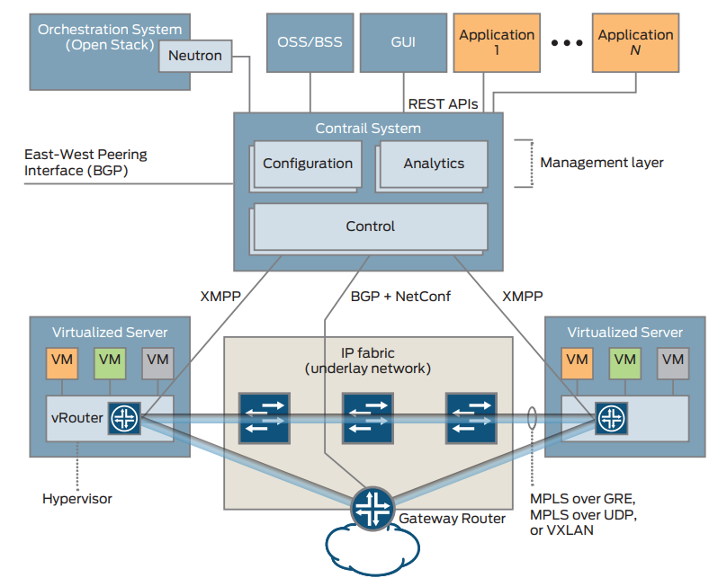

==== The TF SDN controller node

The TF SDN controller integrates with an orchestrator's networking module in
the form of a "plugin", for instance:

- In OpenStack environment, TF interfaces with the Neutron server as a neutron plugin 
- In kubernetes environment, TF interfaces with k8s API server as a
  `kube-network-manager` process and a `CNI` plugin that is watching the events
  from the k8s API.

TF SDN Controller is a so-called "logically centralized" but "physically
distributed" SDN controller. It is "physically distributed" because same exact
controllers can be running in multiple (typicall three) nodes in a cluster for
high availability(HA) purpose.  However, all controllers work together to
behaves consistently as a single logical unit that is responsible for providing
the management, control, and analytics functions of the whole cluster. 

This "physically distributed" nature of the Contrail SDN Controller is a
distinguishing feature. Because there can be multiple redundant instances of the
controller, operating in an "active/active" mode (as opposed to an
"active-standby" mode). When everything works, two controllers can share the
workload and load balance the control tasks. When a node becomes overloaded,
additional instances of that node type can be instantiated after which the load
is automatically redistributed. On the failure of any active node, the system as
a whole can continue to operate without any interruption. This prevents any
single node from becoming a bottleneck and allows the system to manage a very
large-scale system.
In production, a typical High-Availability (HA) deployment is to run three
controller nodes in an active-active mode, single point failure is eliminated.

//This is a distinguishing feature to archive the goal of redundancy and horizontal scalability.

As any SDN controller, The TF controller has a "global view" of all routes in
the cluster. it implements this by collecting the route information from all
computes (where the TF vRouters resides) and distributes this information
throughout the cluster.

==== TF vRouter: compute node

Compute nodes are general-purpose virtualized servers that host VMs. These VMs
can be tenants running general applications, or service VMs running network
services such as a virtual load balancer or virtual firewall.  Each compute
node contains a TF vRouter that implements the forwarding plane.
//and the distributed part of the control plane.

The TF vRouter is conceptually similar to other existing virtualized switches
such as the Open vSwitch (OVS), but it also provides routing and higher layer
services. It replaces traditional Linux bridge and IP tables, or Open vSwitch
networking on the compute hosts. Configured by TF controller, TF vRouter
implement the desired networking and security policies. While workloads in same
network can communicate with each other "by default", an explicit network policy
is required to communicate with VMs in different networks.

As other overlay SDN solutions, TF vRouter extends the network from the
physical routers and switches in a data center into a virtual overlay network
hosted in the virtualized servers.  Overlay tunnels are established between all
computes, communication between VMs on different nodes are carried in these
tunnels and behaves as if they are on the same compute. Currently VxLAN,
MPLSoUDP and MPLSoGRE tunnels are supported.

==== TF controller components

In each TF SDN Controller there are three main components:

image:../diagrams/TF_arch2.png[contrail arch]

- Configuration nodes - These nodes keep a persistent copy of the intended
  configuration states and store them in cassandra database. they are also
  responsible for translating the high-level data model into a lower-level form
  suitable for interacting with control nodes.

- Control nodes - These nodes are responsible for propagating the low-level
  state data it received from configuration node to the network devices and
  peer systems in an eventually consistent way.  They implement a logically
  centralized control plane that is responsible for maintaining network state.
  Control nodes run XMPP with network devices, and run BGP with each other.

- Analytics nodes - These nodes are mostly about statistics and logging. They
  are responsible for capturing real-time data from network elements,
  abstracting it, and presenting it in a form suitable for applications to
  consume.  it collects, stores, correlates, and analyzes information from network
  elements.

////
- Gateway nodes are physical gateway routers or switches that connect the
  tenant virtual networks to physical networks such as the Internet, a customer
  VPN, another data center, or non-virtualized servers.

- Service nodes are physical network elements providing network services such
  as DPI, IDP,IPS, WAN optimizers, and load balancers. Service chains can
  contain a mixture of virtual services (implemented as VMs on compute nodes)
  and physical services (hosted on service nodes).

For clarity, Figure 2 does not show physical routers and switches that form the
underlay IP-over-Ethernet network.  There is also an interface from every node
in the system to the analytics nodes. This interface is not shown in Figure 2
to avoid clutter.
////

==== TF vRouter components

TF vRouter is the main forwarding module running in each compute node. The
compute node is a general-purpose x86 server that hosts tenant VMs running
customer applications.

// examples can be: Web servers, database servers, enterprise applications or hosting
// virtualized services used to create service chains

TF vRouter consists two components:

* The vRouter agent, which is the local control plane. 
* The vRouter forwarding plane

NOTE: In the typical configuration, Linux is the host OS and KVM is the
hypervisor. The Contrail vRouter forwarding plane can sits either in the Linux
kernel space, or in the user space in DPDK mode. more details about this will
be covered in later chapters.

.vRouter Agent

//image:../diagrams/TF_vrouter1.png[contrail vrouter1]
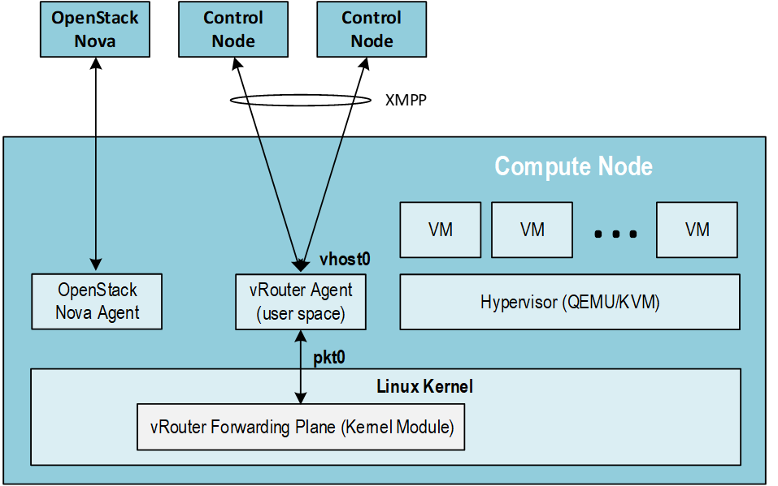

The vRouter agent is a user space process running inside Linux. It acts as the
local, lightweight control plane in the compute, in a way similar to what
"routing engine" does in a pysical router.  For example, vRouter agent
establish XMPP neighborships with two controller nodes, then exchances the
routing information with them. vRouter agent also dynamically generate flow
entries and injects them into the vRouter forwarding plane. This gives
instructions to the vRouter about how to forward packets.

.vRouter Forwarding Plane

//image:../diagrams/TF_vrouter2.png[contrail vrouter2]
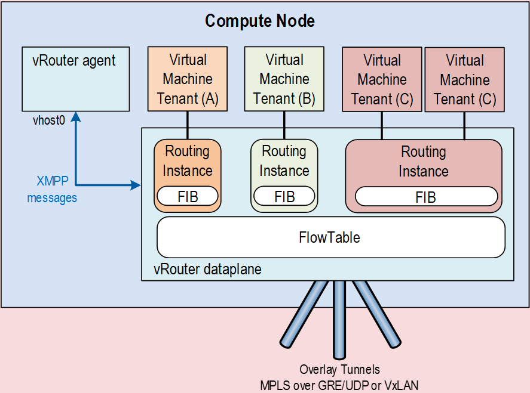

The vRouter forwarding plane works like a "line card" of a traditional router.
it looks up its local FIB and determines the next hop of a packet. It also
encapsulates packets properly before sending them to the underlay network and
decapsulates packets to be received from the underlay network.

We'll cover more details of TF vrouter in the later chapters.

== References

* [[sdn-history]] https://www.cs.princeton.edu/courses/archive/fall13/cos597E/papers/sdnhistory.pdf
* [[onf-sdn-definition]] https://www.opennetworking.org/sdn-definition/
* [[ovs]]https://www.openvswitch.org/
////
* https://www.rfc-editor.org/rfc/rfc7426.txt
* https://portal.etsi.org/NFV/NFV_White_Paper.pdf
* https://www.sdxcentral.com/wp-content/uploads/2015/08/SDxCentral-SDN-Controllers-Report-2015-B2.pdf[SDxCentral-SDN-Controllers-Report-2015]
* https://www.opennetworking.org/images/stories/downloads/sdn-resources/special-reports/Special-Report-OpenFlow-and-SDN-State-of-the-Union-B.pdf[Special-Report-OpenFlow-and-SDN-2016]
* https://ieeexplore.ieee.org/stamp/stamp.jsp?arnumber=8379403[Controllers in SDN: A Review Report. 2018]
//* https://aptira.com/comparison-of-software-defined-networking-sdn-controllers-part-2-open-network-operating-system-onos[2019]
* https://www.opendaylight.org/technical-community/getting-started-for-developers/roadmap
* https://www.opendaylight.org/what-we-do/current-release/boron
* https://www.sdnlab.com/community/article/odl/1
* https://wiki.lfnetworking.org/display/LN/Tungsten+Fabric+Project+Proposal
* http://yuba.stanford.edu/cleanslate/research_project_ethane.php
* http://yuba.stanford.edu/ethane/pubs.html
* https://dl.acm.org/doi/10.1145/1355734.1355746
////

<<<

