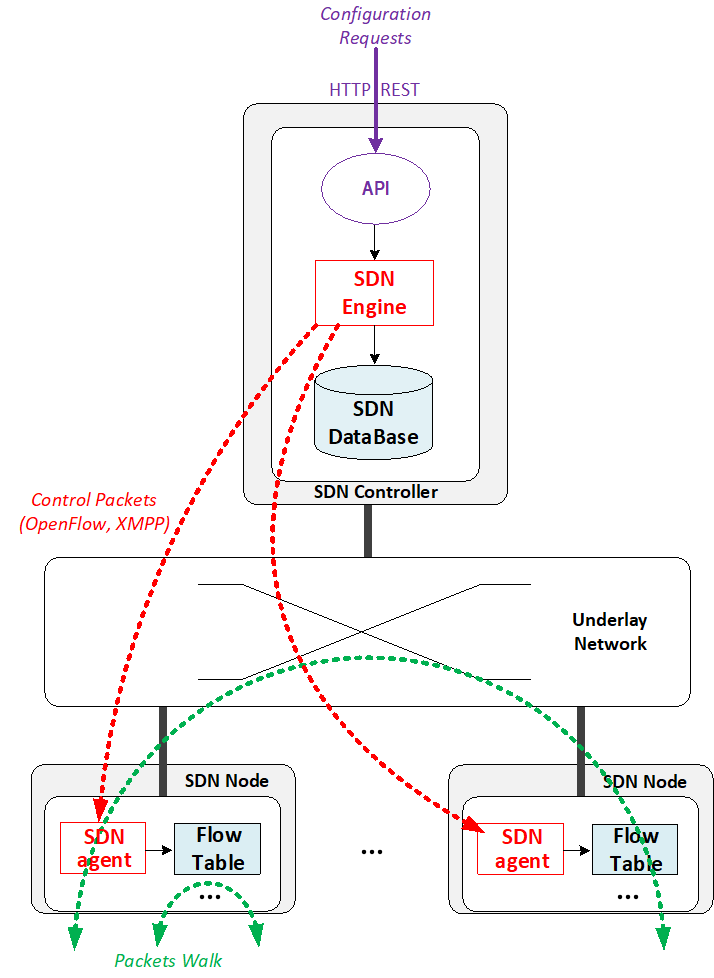

= chapter 1: SDN overview
:doctype: book
:toc: right
:toclevels: 3
:data-uri:

== what is SDN - the history

=== Network device evolution

Since early 1990 network device manufacturer made a lot of innovation in order
to increase router speeds. They started from a router node in which everything
was computed into the central CPU to reach a situation where the central CPU is
less and less used due to a distributed architecture in which lots of action
are done in “line cards”.

//image::ch1-extracted-media/word/media/image1.svg[image]
image::diagrams/ch1-extracted-media/word/media/image1.png[image]

These progresses have been made thanks to the use of proprietary ASICs
(Application-Specific Integrated Circuit), TCAM (Ternary Content-Addressable
Memory) which have been designed to process data packets at high speed.

In early 2000, the Virtualization for x86 computers support has led to lots of
innovation into systems domain. Compute virtualization and High-Speed network
devices evolution have enabled the **Cloud** creation.

Later, It appears it was not convenient to manage several isolated network
devices having each their own configuration language. Following needs have
emerged:

* Single point of configuration
* Configuration protocol standardization
* Network feature support on x86 servers
* Extensibility and ability to scale

And these desires called for the cloud and SDN technology development.

=== Early age of SDN

In Stanford University (US - CA) Clean Slate Research Projects program has been
initiated in order to think about how to improve the Internet network
architecture. ETHANE project was part of this program. Its purpose was to “
Design network where connectivity is governed by high-level, global policy”.
This project is generally known as the first implementation of SDN:

In 2008, a white paper has been proposed by ACM (Association for Computing
Machinery) to design a new protocol (OpenFlow) to be able to program network
devices from a network controller.

In 2011, ONF (Open Networking Foundation) has been created to promote SDN
Architecture and OpenFlow protocols.

=== SDN startups acquired by major networks or virtualization vendors

First companies working on SDN have been founded around 2010. Most of them have
now been bought by main networks or virtualization solution vendors.

In 2007, Martin Casado, who was working on Ethane project has founded Nicira to
provide solutions for network virtualization with SDN concept. Nicira has been
aquired by vMware in 2012 to develop VMare NSX. In 2016, VMWare also bought
PLUMGrid a SDN startup founded in 2013.

In 2010, BigSwitch networks has been founded: BigSwitch is proposing a SDN
solution. In early 2020, BigSwitch has been acquired by Arista Networks.

In 2012, Cisco has created Insieme Networks, a spin-in start-up company working
on SDN. In 2013, Cisco take back control on Insieme in order to develop its own
SDN solution called ACI (Application Centric Infrastructure).

In early 2012, Contrail Systems Inc has been created and aquired at the end of
the year by Juniper Networks.

In 2013, Alcatel Lucent has created Nuage Networks, a spin-in start-up company
working on SDN. Nuage Networks is now an affiliate of Nokia.

The road of SDN development and its history is never straighforward and looks
more nuanced than a single storyline might suggest, it's actually far more
complex to be described in a short section here. This diagram
from <<sdn-history>> shows developments in programmable networking over the past 20
years, and their chronological relationship to advances in network
virtualization.

image::diagrams/sdn-history.png[sdn-history]

.References

* [[sdn-history]] https://www.cs.princeton.edu/courses/archive/fall13/cos597E/papers/sdnhistory.pdf
* http://yuba.stanford.edu/cleanslate/research_project_ethane.php
* http://yuba.stanford.edu/ethane/pubs.html
* https://dl.acm.org/doi/10.1145/1355734.1355746

== SDN definition

=== What is SDN?

The concept of `SDN`, and the term itself, are both very broad and often
confusing.  
There is no real accurate definition of SDN, 
and vendors usually take it very differently. Initially it was used to
in Stanford’s OpenFlow project, and later it has been extended to include a
much wider area of technologies. Discussion about each vendor's SDN definition
is beyond the scope of this book. 
but we generally consider that a SDN solution has to provide one to several of
following characteristics:

* a network control and configuration plane split from the network dataplane.
* a centralized configuration and control plane (SDN controller)
* a simplified network node
* network programmability to provide network automation
* automatic provisioning (ZTP zero touch provisioning) of network nodes
* virtualization support and openness

////
//laurent:
SDN (*Software Define Networking*) is a network architecture model in which the
network dataplane function has been physically splitted from configuration and
control plane function.
////

According to <<onf-sdn-definition>>, *Software-Defined Networking (SDN)* is:

> The physical separation of the network control plane from the forwarding plane,
> and where a control plane controls several devices

.SDN layer^<<onf-sdn-definition>>^
//jpg is too small after converted to word
//image::diagrams/sdn-architecture-img.jpg[image, 400, 400]
//seems size does not help when converting to word
image::diagrams/sdn-architecture-img.png[image, 400, 400]

////
//ping:
Infrastructure layer:: this layer is composed of all networking equipments, e.g.
routers, switches, firewalls, etc. these devices build "underlay network" which
carries all the network traffic, which are no much different from what we've
seen in any tradtional network in terms of forwarding behavior, except that
their control plane is now located in a centralized plane - the control layer.

Control layer:: is where all "intelligence" located and where "SDN controllers"
would reside. a SDN controller have a "global view" of the network as a whole,
and based on the information it has, it calculates the disired reachability
information on behalf of all individual network devices in the infrastructure
layer. It then gives configurations and instructions (e.g. flow table, routing
table, etc) to the network devices regarding how to do the forwarding, using the
"South bound" interfaces supported by the network devices.

Application layer:: is where all kinds of applications are located. each network
vendors are coming up with their set of SDN applications so this is the most
"open" area. application layer leverages the so-called "northbound interface"
provided by control layer, which hides the complicated, and trival details about
how to interact with the network devices. we'll talk about the north bound and
south bound interfaces in the coming sections.
////

In this diagram, you can see that SDN allows simple high-level policies in the
"application layer" to modify the network, because the device level dependency
is eliminated to some extent. Now the network administrator can operate the
different vendor-specific devices in the "infrastructure layer" from a single
software console - control layer. The controller in control layer is designed in
such a way that it can view the whole network globally. This controller design
helps a lot to introduce functionalities or programs as they just needs to be
talk to the centralized controller. All details communicating with each device
is hidden from the applications.

Several expectations are behind this new model:

- *cost reduction*: using standardized network nodes. The costly part of the
  network equipment (CPU) beeing moved and shared onto a central node.

- *openness*: using some standardized protocols like REST, OpenFlow, XMPP,
  NetConf

- *automation*: through the API interfaces provided by the SDN controller.

- *features rich*: with the ability of the SDN Controller to reprogram each
  controlled device using flow tables

NOTE: in this diagram, "openflow" is marked as the protocol between control
layer and infrastructure layer. This is to give an example about the "south
bound" interface. As of today there are more choices available and standardized
in the SDN industry, which will be covered later in this chapter.

.References:

* [[onf-sdn-definition]] https://www.opennetworking.org/sdn-definition/
* https://www.rfc-editor.org/rfc/rfc7426.txt

=== Traditional Network Planes and SDN layer

.traditional network device planes
traditionally, A typical network device (e.g. a router) has following planes:

.traditional network device planes
//image::ch1-extracted-media/word/media/image3.svg[image]
image::diagrams/ch1-extracted-media/word/media/image3.png[image]

- *Configuration* (and management) *plane*: used for network node configuration
  and supervision. Widely use protocols are CLI (Command Line Interface), SNMP
  (Simple Network Management Protocol) and NetConf.
- *Control plane*: used by network nodes to take packet forwarding decision. In
  traditional networks most widely used network control protocols are OSPF,
  ISIS and BGP for IP protocol and LDP; RSVP-TE for MPLS.
- *Forwarding* (or data or user) *plane*: This plane is responsible to perform
  data packet processing and forwarding. This forwarding plane is made of
  proprietary protocols and is specific to each network equipment vendor.

First two planes (configuration and control) are located into router main
processor card. The last one is located into the router line cards.

.SDN layer

SDN architecture is built with 3 layers:

.SDN architecture
//image::ch1-extracted-media/word/media/image4.svg[image]
image::diagrams/ch1-extracted-media/word/media/image4.png[image]

- *Application Layer*: is containing all the application provided by the SDN
  solution. Generally a Web GUI dashboard is the first application provided to
  SDN users. Other very common applications are Network infrastructure
  interconnection interfaces allowing the SDN solution to be plugged to a Cloud
  Infrastructure or a Container orchestrator.

- *Control Layer*: is containing the SDN controller. This is the smartest part
  of a SDN solution. The SDN controller is made up of:
  ** one or several Northbound interfaces that are used to interconnect SDN
  application with the SDN infrastructure. The most used northbound interface
  protocol is HTTP REST.
  ** one or several Southbound interfaces that are used to control SDN network
  nodes. Most used southbound interface protocols are OpenFlow and XMPP.
  ** the SDN engine, made up of SDN Control Logic and some databases.

- *Infrastructure Layer*: is containing the SDN network nodes. This is the
  working part of a SDN solution. SDN network nodes are either physical or
  virtual nodes. On each SDN node are located:
  ** a SDN agent: which is handling the communication between each SDN network
  node and the SDN controller.
  ** A flow/routing information table filled by the SDN Agent.
  ** A forwarding plane engine

=== the primary changes between SDN and traditional networking

In a traditional infrastructure, the route calculation is made on each
individual router. Routing path is the result of routing information exchange,
and of a distributed calculation.

.Component in a traditional router
//image::ch1-extracted-media/word/media/image5.svg[image]
image::diagrams/ch1-extracted-media/word/media/image5.png[image]

Traditional networks are very robust but very hard to manage due to the high
number of points to configure. Traditional network nodes are requiring
expensive components because they are implementing high end routing protocols.

Control and Configuration functions are gathered into a "SDN controller" which
is controlling SDN Network devices. This new architecture intends to
provide a new way to configure the network using a centralized configuration
and control point.

New Cloud infrastructures are requiring:

- a single configuration point
- the ability to distribute at a higher scale network elements, at least in
  each Cloud compute, and not only at the network infrastructure level.
- a simplified network node in order to be able to implement it into each compute node.

In order to get a single configuration point, a centralized network controller
is proposed by the SDN Architecture. In order to be able to simplify network
nodes, the smartest part has been moved onto a controller.

.Comparison between tradition network devices and SDN devices
//image::ch1-extracted-media/word/media/image2.svg[image]
image::diagrams/ch1-extracted-media/word/media/image2.png[image]

A southbound network protocol is the last piece needed to allow routing
information between the SDN controller and each controlled element. A network
infrastructure is allowing the communication between SDN controller and SDN
network nodes, and data packet transfer between SDN nodes. This underlay
network infrastructure is playing the same role that the local switch fabric is
doing inside a standalone router between the control processor card and lines
cards.

In a SDN infrastructure route calculation is done centrally onto the controller
and distributed into each SDN network node. It makes the controller the weakest
point of this new kind of infrastructure.

Lots of efforts are done by each SDN solution supplier to make this centralized point:

* highly resilient: using clustered architecture to build the controller
* highly scalable: using distributed compute and storage architectures

=== underlay vs overlay

.underlay
In SDN architecture, each network node is connected to a physical network
infrastructure. This physical network which is providing connectivity between
network nodes is called the underlay network infrastructure.

.overlay
Today the industry began to shift in the direction of building L3 data centers
and L3 infrastructures, mostly due to the rich features coming from L3
technologies, e.g, ECMP load balancing, flooding control, etc.  However, the L2
traffic does not disappear and most likely it never will.  there are always the
desire that a group of network users need to reside in the same L2 network,
typically a VLAN. However, In today's virtualization environment, a user's VM
can be spawned in any compute located anywhere in the L3 cluster. Even if 2 VMs
happen to be spawned in the server, there is often a need to move them around
without changing their networking attributes. These requirements to make a VM
always belonging to the "same VLAN" calls for an overlay model over the L3
network. In other words, this new mechanism needs to allow you to tunnel L2
Ethernet domains with different encapsulations over an L3 network.

////
However, customer data packet collected by SDN nodes have to be able to traverse
transparently across underlay network infrastructure. Therefore, a packet
encapsulation, or "tunneling" mechanism, is needed in SDN networks.
////

The overlay network is a logical network that runs on top of the underlay L3 IP
network. The overlay is formed of tunnels to carry the traffic across the L3
fabric. The underlay also needs to separate between different administrative
domains (tenants), switch within the same L2 broadcast domain, route between L2
broadcast domains, and provide IP separation via VRFs.

//image::ch1-extracted-media/word/media/image6.svg[image]

Indeed, without such an encapsulation mechanism, traditional segmentation
solutions (VLAN, VRF) would have to be provided by the physical infrastructure
and implemented up to each SDN node, in order to provide an isolated
transportation channel for each customer network connected to the SDN
infrastructure.

Encapsulation protocols used in SDN networks have to provide:

* network segmentation: ability to build several different network connectivity between 2 SDN network nodes.
* ability to carry transparently Ethernet frames and IP packets
* ability to be carried over an IP connectivity

Several encapsulation protocols are used into SDN networks; they are:

* VxLAN
* Geneve
* STT
* NVGRE
* MPLS over GRE
* MPLS over UDP

These encapsulation protocols are providing Overlay connectivity which is
required between customers workload connected to the SDN infrastructure.

//image::ch1-extracted-media/word/media/image6.svg[image]

Each SDN node is call a VTEP (Virtual Tunnel End Point) as it is starting and
terminating the overlay tunnels.

=== interfaces between layers

We've seen "openflow" marked as one of the possible interfaces in the "SDN
layer" section. Now we'll introduce the concept of "southbound" and "northbound"
interface and other available choices in today's industry.

.southbound interface 

The "southbound" interface resides between the controller in "control layer" and
network devices in "infrastructure layer". Basically what it does is to provide
a means of communication between the 2 layers. Based on the demands and needs, a
SDN Controller will dynamically changes the configuration or routing information
of network devices. For example, a new VM will advertise a new subnet or host
routes when it is spawned in a server, this advertisement will be delivered to
SDN controller via a southbound protocol. Accordingly, SDN controller collects
all routing updates from the whole SDN cluster, decides the most current and
best route entries and it may "reflect" these information to all other network
devices or VMs. this ensures all devices will has the most uptodate routing
information in real time. the two most well-known southbound interface in the
industry is `openflow` and `OVSDB`.

.openflow

OpenFlow is one of the most widely deployed southbound standard from open source
community. It first made its appearance in 2008 by Martin Casado at Stanford
University. The appearance of OpenFlow was one of the main factors which gave
birth to Software Defined Networking.

OpenFlow provides various information for the Controller. It generates the
event-based messages in case of port or link changes. The protocol generates a
flow based statistic for the forwarding device and passes it to the controller. 

OpenFlow also provides a rich set of protocol specifications for effective
communication at the controller and switching element side. Open Flow provides
an open source platform for Research Community. 

Every physical or virtual OpenFlow-enabled switch in the SDN domain needs to
first register with the OpenFlow controller. The registration process is
completed via an OpenFlow HELLO packet originating from the OpenFlow switch
sent, to the SDN controller. 

NOTE: although openflow is very popularly used as southbound interface in SDN,
it is not the only choice for the southbound interface. there are other options
available(like XMPP).

.OVSDB

unlike openflow, OVSDB is a southbound API designed to provide additional
management capabilities like networking functions. With OVSDB we can create the
virtual switch instances, set the interfaces and connect them to the switches.
We can also provide the QoS policy for the interfaces.

.northbound interface

The northbound interface provides connectivity between the controller and the
network applications running in management plane. As we already discussed that
southbound interface has OpenFlow as open source protocol, northbound lacks
such type of protocol standards. However with the advancement of technology now
we have a wide range of northbound API support like ad-hoc API's, RESTful APIs
etc. The selection of northbound interface usually depends on the programming
language used in application development.

=== SDN, openstack, NVF and data center

.openstack

OpenStack is one of the IaaS open source implementation solutions, providing
basic services like computing service, storage service, networking service, etc.
It also provides advanced services like database, container orchestration and
other advanced services. SDN, and its ecology, in contrast, mainly focus on the
networking. Therefore, from the perspective of technical ecological coverage,
the ecological aspects of OpenStack are much wider, because networking is just
one of its services that is implemented by its `Neutron` component and it's
various plugins.

////
There are also difference in the way that Neutron works comparing with how a
typical SDN controller works. OpenStack Neutron focuses on providing network
services for virtual machines, containers, physical servers, etc. 
//It provides northbound REST API to users, 
SDN focuses on configuration and forwarding control management toward the
underlaying network device, not only to provide user-oriented northbound API,
but also to provide southbound API, communicating with various hardware
devices.
////

.NFV: Networking Function Virtualization

NFV/VNF sounds like new buzzwords, but those technologies have been around for
years. `NFV` means "network function virtualization", according to ETSI it
stands for an "operation framework for orchestrating and automating VNFs". And
`VNF` means "virtualized network function", such as virtualized routers,
firewalls, load balancers, traffic optimizers, IDS or IPS, web application
protectors, and so on. When you read today's documents about virtualization
technology, you will see the terms in such a pattern like "vXX" (e.g. vSRX) very
often. that letter `v` indicates it is a "virtualized" product.  Among others,
firewalls and load balancers are the two most common VNFs in the industry,
especially for deployments inside data centers.

.data center

Flexibility is the main driver for any visualization platform.  The data center
network itself is also part of the virtualization revolution. SDN and network
overlays are the key drivers for virtualizing networks in data centers.

.References

* https://portal.etsi.org/NFV/NFV_White_Paper.pdf

== SDN Dataplane 
=== kernel
=== dpdk
=== sriov
=== smartnic
=== vDPA
=== eBPF

== SDN solutions

=== controllers

As we've mentioned in previous sections, SDN is a networking scenario which
changes the traditional network architecture by bringing all control
functionalities to a single location and making centralized decisions.
SDN controllers are the brain of SDN architecture, which perform the control
decision tasks while routing the packets. Centralized decision capability for
routing enhances the network performance. As a result, SDN controller is the
core components of any SDN solutions.

While working with SDN architecture, one of the major point of concerns is which
controller and solution should be selected for deployment. There are quite a few
SDN controller and solutions implementations from various vendors, and every
solution has its own pros and cons along with its working domain. In this
section we'll review some of the popular SDN controllers in the market, and the
corresponding SDN solutions.

=== SDN controller reports

.TODO, some research about today's market players, may skip

image::https://user-images.githubusercontent.com/2038044/78374061-61d4bf00-7599-11ea-9742-20b94163ddcf.png[image]

.References

* https://www.sdxcentral.com/wp-content/uploads/2015/08/SDxCentral-SDN-Controllers-Report-2015-B2.pdf[2015 ]
* https://www.opennetworking.org/images/stories/downloads/sdn-resources/special-reports/Special-Report-OpenFlow-and-SDN-State-of-the-Union-B.pdf[2016 ]
* https://ieeexplore.ieee.org/stamp/stamp.jsp?arnumber=8379403[Controllers in SDN: A Review Report. 2018]
//* https://aptira.com/comparison-of-software-defined-networking-sdn-controllers-part-2-open-network-operating-system-onos[2019]

=== opendaylight (ODL)

OpenDaylight, aften abbreviated as ODL, is a Java based open source project
started from 2013, it was originally led by IBM and Cisco but later hosted under
the Linux Foundation. it was the first open source Controller that can support
non-OpenFlow southbound protocols, which can make it much easier to be
integrated with multiple vendors.

ODL is a modular platform for SDN. It is not a single piece of software. It is a
modular platform for integrating multiple plugins and modules under one umbrella
There are many plugins and modules built for OpenDaylight. Some are in
production, while some are still under development. 

.opendaylight "Boron"
image::diagrams/BoronDiagrams_final.png[]
//image::https://user-images.githubusercontent.com/2038044/78376350-2f789100-759c-11ea-923c-883b03048d37.png[image]

Some of the initial SDN controllers had their southbound APIs tightly bound to
OpenFlow, But as we can see from the diagram, besides openflow, many other
southbound protocols that are available in today's market are also supported.
Examples are NETCONF, OVSDB, SNMP, BGP, etc. Support of these protocols are done
in a modular method in the form of different plugins, which are linked
dynamically to a central component named "Service Abstraction Layer (SAL)". SAL
does translations between the SDN application and the underlaying network
equipments. for instance, when it receives a service request from a SDN
application, typically via high level API calls (northbound), it understands the
API call and translates the request to a language that the underlying network
equipments can also understand. That language is one of the southbound
protocols.

While this "translation" is transparent to the SDN application, ODL itself needs
to know all the details about how to talk to each one of the network devices it
supports, their features, capabilities etc. a `topology manager` module in OLD
manages this type of information. What `topology manager` does is to collect
topology related information from various modules and protocols, such as ARP,
host tracker, device manager, switch manager, OpenFlow, etc, and based on these
info, it visualize the network topology by drawing a diagram dynamically, all
the managed devices and how they are connected together will be showed in it.

.ODL topology
image::diagrams/odl-topo1.png[]

any topology changes, such as adding new devices, will be updated in the
database and reflected immediately in the diagram. 

.ODL topology update
image::diagrams/odl-topo2.png[]

Remember earlier we mentioned that an SDN controller has "global
view" of the whole SDN network. In that sense ODL has all necessary visibility
and knowledge of the network that can be used to draw the network diagram in
realtime.

.References:

* https://www.opendaylight.org/technical-community/getting-started-for-developers/roadmap
* https://www.opendaylight.org/what-we-do/current-release/boron
* https://www.sdnlab.com/community/article/odl/1

=== underlay network and overlay network

=== OVN

==== OVS

==== OVN

=== ONOS

=== calico

==== calico introduction

quote from calico official website:
____
Calico is an open source networking and network security solution for
containers, virtual machines, and native host-based workloads. Calico supports
a broad range of platforms including Kubernetes, OpenShift, Docker EE,
OpenStack, and bare metal services.
____

Calico has been an open-source project from day one. It was originally designed
for today's modern cloud-native world and runs on both public and private
clouds. Its reputation mostly comes from it's deplayment in Kubernetes and its
ecosystem environments. Today Calico has become one of the most popularly used
kubernetes CNIes and many enterprises using it at scale.

Comparing with other overlay network SDN solutions, Calico is special in the
sense that it does not use any overlay networking design or tunneling
protocols, nor does it require NAT.  Instead it uses a plain IP networking
fabric to enables host to host and pod to pod networking.  The basic idea is to
provides Layer 3 networking capabilities and associates a virtual router with
each node, so that each node is behaving like a traditional router, or a
"virtual router". We know that a typical Internet router relies on routing
protocols like OSPF, BGP to learn and advertise the routing information, and
That is the way a node in calico networking works. It chooses BGP, because of
it's simple, industry's current best practice, and the only protocol that
sufficiently scale.

calico uses a policy engine to deliver high-level network policy management. 

==== calico archetecture

//image::diagrams/k8s-calico-graph.png[image]
image::diagrams/calico-arch.png[image]

Calico is made up of the following components:

- Felix: the primary Calico agent that runs on each machine that hosts endpoints.
- The Orchestrator plugin: orchestrator-specific code that tightly integrates Calico into that orchestrator.
- BIRD: a BGP speaker that advertise and install routing information.
- BGP Route Reflector (BIRD): an optional BGP route reflector for higher scale.
- calico CNI plugin: connect the containers with the host
- IPAM: for IP address allocation management
- etcd: the data store.

===== felix (policy)

This is calico "agent" - a daemon that runs on every workload, for example on
nodes that host containers or VMs. it is the one that performs most of the
"magics" in the calico stack. It is responsible for programming routes and
ACLs, and anything else required on the host, in order to provide the desired
connectivity for the endpoints on that host.

Depending on the specific orchestrator environment, Felix is responsible for
the following tasks:

* Interface management (ARP response)
* Route programming (linux kernel FIB)
* ACL programming (host IPtables)
* State reporting (health check)

////
It has multiple responsibilities:

- it writes the routing table of the operating system 
- it manipulates IPtables on the host.
////
It does all this by connecting to etcd and reading information from there. It
runs inside the calico/node DaemonSet along with `confd` and `BIRD`.

===== Orchestrator plugin

The orchestrator plugins are essentially responsible for API translations.
Calico has a separate plugin for each major cloud orchestration platforms (e.g.
OpenStack, Kubernetes). 
////
The purpose of these plugins is to bind Calico more tightly into the
orchestrator, allowing users to manage the Calico network just as they’d manage
network tools that were built into the orchestrator.
////
For example in openstack environment, a Calico Neutron ML2 driver integrates
with Neutron’s ML2 plugin to allows users to configure the Calico network
simply by making Neutron API calls. This provides seamless integration with
Neutron.

===== Etcd (database)

the backend data store for all the information Calico needs. it can be the same of different etcd that kubernetes use.
//it's recommended deploy a separate etcd for production systems, or at least
//deploy it outside of your kubernetes cluster.
it has at least, but not limited to the following information:
* list of all workloads (endpoints)
* BGP configuration
* policys from user (e.g. defined via the `calicoctl` tool)
* information about each container (pod name, IP, etc), received from calico CNI

===== BIRD (BGP)

Calico makes uses of BGP to propagate routes between hosts.  And the BGP
"speaker" in calico is BIRD - a routing daemon that runs on every host that
also hosts Felix module in the Kubernetes cluster, usually as a `DaemonSet`. It
’s included in the calico/node container.  it's role is to read routing state
that Felix programs into the kernel and distribute it around the data center.
comparing with what Felix does, one of the main differences is that Felix
"insert" routes into the linux kernel FIB and BIRD "distribute" them to all
other nodes in the deployment, this turns each host to a virtual Internet BGP
router ("vRouter"), and ensures that traffic is efficiently routed around the
deployment.

===== Confd

confd is a simple configuration management tool. In Calico, BIRD does not deal
with etcd directly, it is another module "confd" that reads the BGP
configuration from etcd and feed to BIRD in the form of configurations files in
disk.

===== CNI plugin

configure IP, routes
`CNI` stands for "container networking interface". 

There’s an interface for each pod, When the container spun up, calico (via CNI)
created an interface for us and assigned it to the pod.

when a new pod starts up, Calico will:
- query the kubernetes API to determine the pod exists and that it’s on this node
- assigns the pod an IP address from within its IPAM
- create an interface on the host so that the container can get an address
- tell the kubernetes API about this new IP

===== IPAM plugin

as the name indicated already, Calico's IPAM plugin is responsible for "IP
address management". when a new container is spawn, calico IPAM plugin reads
information from etcd database to decide which IP is available to be allocated
to the container. the IP address by default will be allocated in the unit of
/26 "block". a block is essentially a subnet which aggregate the routes to save
routing table spaces.

==== calico workflow

- A container is spawned
- calico IPAM plugin assign an IP address from an IP block (by default /26). it
  then records this in etcd.
- calico CNI apply the network configuration to the container so it has a
  default route pointing to the host. CNI also save these information to etcd.
- calico felix appy the network configuration to the host, so it is aware of
  the new container, and be ready to receive packets from it.
- confd read the data from etcd and generate the routing configuration, BIRD
  use these configuratioin to establish BGP neighborship with other nodes. it
  then advertises the container subnet to the rest of the cluster via BGP
- all other hosts in the same cluster will learn this subnet via BGP and
  install the route into its local routing table, now the new container is
  reachable from anywhere in the cluster.
- user may configure a routing policy, e.g. via the `calicoctl` commands. the
  policy will be save in etcd database. felix read this policy and applies it
  to the firewall configurations.

.Reference

* https://www.projectcalico.org
* https://www.projectcalico.org/why-bgp/

=== nuage VCP (Nokia)

The Virtualized Cloud Platform (VCP) product from Nuage networks provides a
highly scalable policy-based Software-Defined Networking (SDN) platform. It is
an enterprise-grade offering that builds on top of the open source Open vSwitch
for the data plane along with a feature-rich SDN controller built on open
standards.

The Nuage platform uses overlays to provide seamless policy-based networking
between Kubernetes Pods and non-Kubernetes environments (VMs and bare metal
servers). Nuage's policy abstraction model is designed with applications in
mind and makes it easy to declare fine-grained policies for applications. The
platform's real-time analytics engine enables visibility and security
monitoring for Kubernetes applications.

All VCS components can be installed in containers. There are no special
hardware requirements.

.Nuage architecture
image::https://user-images.githubusercontent.com/2038044/78465427-93e24000-76c3-11ea-92ee-39a45a259e74.png[image]

.Nuage VSP incudes 3 major components

* virtualized services directory (VSD)
* virtualized services controller (VSC)
* virtualized routing and switching (VRS)

==== VSD

In Nuage VCP, The Virtualised Services Directory (VSD) is a policy engine,
business logic and analytics engine that supports the abstract definition of
network services. Through RESTful APIs to VSD, administrators can define and
refine service designs and incorporate enterprise policies.

It is a web-based, graphical console that connects to all of the VRS nodes in
the network to manage their deployment and configuration. 

The VSD policy & analytics engine presents a unified web interface where
configuration and monitoring data is presented. The VSD is API-enabled for
integration with other orchestration tools. Alternatively, you can develop your
apps. Either way, the VSD is based on tools from the service provider world,
and therefore scaling potential looks very good. It integrates multiple data
centre networks by linking VSDs together and exchanging policy data.

==== VSC

Nuage Virtual Services Controllers (VSC) works between VSD and VRS. policies
from VSD is distributed through a number of VSC to all of the VRS nodes in the
network to manage their deployment and configuration.

VSC is SDN controller in Nuage VCP architecture. it provides a robust control
plane for the datacenter network, maintaining a full per-tenant view of network
and service topologies. Through network APIs that use southbound interfaces
(e.g. OpenFlow), VSC programs the datacenter network independent of different
hardwares.

The VSC implements an OSPF, IS-IS or BGP listener to monitor the state of the
physical network. Therefore, if routes starts flapping, the VSC is able to
incorporate those events into the decision tree.

while scalability in a single data center can be achieved by setting up
multiple VSC, each handling a certain group of VRS devices, scalability between
multiple data centres can be achieved by connecting VSC controllers
horizontally at the top of the hierarchy.

.Nuage VSC MP-BGP
image::diagrams/nuage-mpbgp.png[]

As shown in the diagram above, VSC controllers are synchronised using
MP-BGP. A BGP connection peers with PE routers at the WAN edge, and then the
VSC controller uses MP-BGP to synchronise controller state & configuration with
VSCs in other data centres. This is vital for end-to-end network stability.

When dVRS devices are communicating to non-local dVRS devices,
data is tunnelled in MPLS-over-GRE to the PE router.

==== VRS

The VRS module serves as a virtual endpoint for network services. It detects
changes in the compute environment as they occur and instantaneously triggers
policy-based responses to ensure that the network connectivity needs of
applications are met.

configuration of the VRS is derived from a series of templates. 

Each VRS routes traffic into the network according to its flow table.
Therefore, the entire VRS system performs routing at the edge of the
network.

A VRS can’t make a forwarding decision in a vacuum, as events in the
underlying physical network must be considered. Nuage Networks has
extensively considered how to provide the VSC controller with all the
information required to have a complete model of the network. 

=== contrail (brief)

=== vmare NSX

=== other solutions?

==== cisco: apic
==== openflood

== Overview of Tungsten Fabric (TF)

=== TF introduction

Many SDN solutions exists to help automate the provisioning of network devices.
Some of them are based on proprietary protocols and standards. Openflow is
standardized protocol, but it is more or less "outdated" technologies after
more than a decade since it's birth in 2008.

The Tungsten Fabric (TF), is an open-standard based, proactive overlay SDN
solution that works with existing physical network devices and help address the
networking challenges for self-service, automated, and vertically integrated
cloud architecture. It also improves scalability through a proactive overlay
virtual network technique.

TF controller integrates with most of the popular cloud management systems such
as OpenStack, vmware, and Kubernetes. TF's focus is to provide networking
connectivity and functionalities, and enforce user-defined network and security
policies to the various of workloads based on different platforms and
orchestrators.

The TF system is implemented as a set of nodes running on general-purpose x86
servers. Each node can be implemented as a separate physical server, or VM.

.open source

`Contrail` was a product of a startup company "Contrail system", which was
acquired by Juniper Networks in Dec. 2012. It was open sourced in 2013 with a
new name "OpenContrail" under the Apache 2.0 license, which means that anyone
can use and modify the code of Opencontrail system without any obligation to
publish or release the modifications. In early 2018, it was renamed again to
Tungsten Fabric. 

Juniper also maintains a commercial version of the Contrail system.  and
provides commercial support to the payed users. both The open-source version
and commerical version of the Contrail system provide the same full
functionalities, features and performances.

NOTE: Throughout this book, we use these terms "contrail", "opencontrail",
"Tungsten Fabric"(TF) interchangeably.

=== TF components

TF consists of two main components:

- Tungsten Fabric Controller: the SDN controller in the SDN architecture. 

////
a set of software services that maintains a model of networks and network
policies, typically running on several servers for high availability
////

- Tungsten Fabric vRouter: a forwarding plane that runs in the each compute node
  performings packet forwarding and enforces network and security policies.

The communication between the controller and vRouters is via XMPP, which is a
widely used messaging protocol.

//installed in each host that runs workloads (virtual machines or containers)

A high level Tungsten Fabric architecture is shown below:

.TF architecture
image::diagrams/TFA_private_cloud.png[TF arch]
//image::diagrams/TF_arch1.png[TF arch]

==== The TF SDN controller

The TF SDN controller integrates with an orchestrator's networking module in
the form of a "plugin", for instance:

- in OpenStack environment, TF interfaces with the Neutron server as a neutron plugin 
- in kubernetes environment, TF interfaces with k8s API server as a
  `kube-network-manager` process and a `CNI` plugin that is watching the events
  from the k8s API.

TF SDN Controller is a "logically centralized" but "physically distributed" SDN
controller. it is "physically distributed" because same exact controllers can be
running in multiple (typicall three) nodes in a cluster. However, all
controllers together behaves consistently as a single logical unit that is
responsible for providing the management, control, and analytics functions of
the whole cluster. As any SDN controller, The TF controller has a "global view"
of all routes in the cluster. it implements this by collecting the route
information from all computes (where the TF Vrouters resides) and distributes
these information throughout the cluster.

////
The physically distributed nature of the Contrail SDN Controller is a
distinguishing feature. Because there can be multiple redundant instances of
any node, operating in an active/active mode (as opposed to an active-standby
mode), the system can continue to operate without any interruption when any
node fails. When a node becomes overloaded, additional instances of that node
type can be instantiated after which the load is automatically redistributed.
This prevents any single node from becoming a bottleneck and allows the system
to manage a very large-scale system—tens of thousands of servers.
////

In a typical High-Availability (HA) deployment, three controller nodes are
running in an active-active mode, single point failure is eliminated in this
model. This is a distinguishing feature to archive the goal of redundancy and
horizontal scalability.

==== TF vRouter

Compute nodes are general-purpose virtualized servers that host VMs. These VMs
can be tenants running general applications, or service VMs running network
services such as a virtual load balancer or virtual firewall.  Each compute
node contains a TF vRouter that implements the forwarding plane and the
distributed part of the control plane.

The TF vRouter is conceptually similar to other existing virtualized switches
such as the Open vSwitch (OVS), but it also provides routing and higher layer
services. It replaces traditional Linux bridge and IP tables, or Open vSwitch
networking on the compute hosts. Configured by TF controller, TF vRouter
implement the desired networking and security policies. while workloads in same
network can communicate with each other "by default", a explicit network policy
is required to communicate with VMs in different networks.

TF vRouter also extends the network from the physical routers and switches in a
data center into a virtual overlay network hosted in the virtualized servers.
Overlay tunnels are established statelessly between all forwarding plane nodes, 
communication between endpoints on different nodes are carried in these tunnels
and behaves as if they are on the same nodes. currently vXLAN, MPLSoUDP and
MPLSoGRE tunnels are supported.

==== TF controller components

the TF SDN Controller consists of three main components:

image::diagrams/TF_arch2.png[contrail arch]

- Configuration nodes is the "brain" of TF SDN controller. they are responsible
  for translating the high-level data model into a lower-level form suitable
  for interacting with network elements. it keep a persistent copy of the
  intended configuration state and translate the high-level data model into the
  lower-level model suitable for interacting with network elements. This
  information is kept in cassandra database.

- Control nodes are responsible for propagating this low-level state to and
  from network elements and peer systems in an eventually consistent way.  it
  implement a logically centralized control plane that is responsible for
  maintaining ephemeral network state. Control nodes interact with each other
  and with network elements to ensure that network state is eventually
  consistent.

- Analytics nodes are responsible for capturing real-time data from network
  elements, abstracting it, and presenting it in a form suitable for
  applications to consume.  it collect, store, correlate, and analyze
  information from network elements. This information includes statistics,
  logs, events, and errors. 

////
- Gateway nodes are physical gateway routers or switches that connect the
  tenant virtual networks to physical networks such as the Internet, a customer
  VPN, another data center, or non-virtualized servers.

- Service nodes are physical network elements providing network services such
  as DPI, IDP,IPS, WAN optimizers, and load balancers. Service chains can
  contain a mixture of virtual services (implemented as VMs on compute nodes)
  and physical services (hosted on service nodes).

For clarity, Figure 2 does not show physical routers and switches that form the
underlay IP-over-Ethernet network.  There is also an interface from every node
in the system to the analytics nodes. This interface is not shown in Figure 2
to avoid clutter.
////

==== TF vRouter components

TF vRouter is running in each compute node. The compute node is a
general-purpose x86 server that hosts tenant VMs running customer applications.

// examples can be: Web servers, database servers, enterprise applications or hosting
// virtualized services used to create service chains

TF vRouter consists two components:

* the vRouter agent: the local control plane. 
* the vRouter forwarding plane

NOTE: In the typical configuration, Linux is the host OS and KVM is the
hypervisor. The Contrail vRouter forwarding plane can sits either in the Linux
kernel space, or in the user spalce in dpdk mode.

.vRouter Agent

image::diagrams/TF_vrouter1.png[contrail vrouter1]

The vRouter agent is a user space process running inside Linux. It acts as the
local, lightweight control plane in the compute, in a way similar to what
"routing engine" does in a pysical router.  For example, vRouter agent
establish XMPP neighborships with two controller nodes, then exchances the
routing information with them. vRouter agent also dynamically generate flow
entries and inject them into the vRouter forwarding plane, this gives
instructions about how to forward the packets.

.vRouter Forwarding Plane

image::diagrams/TF_vrouter2.png[contrail vrouter2]

The vRouter forwarding plane works like a "line card" of a traditional router.
it look up its local FIB and determines the next hop of a packet, 
and enables encapsulating packets to be sent to the overlay network and
decapsulating packets to be received from the overlay network.

We'll cover more details of TF vrouter in the next chapter.

=== Openstack integration (brief)

.Neutron
TODO

.Nova
TODO

=== k8s integration?

=== openshift integration?

=== vcenter integration?

== summary

== resources
