:doctype: book
:toc: right
:toclevels: 3
:source-highlighter: pygments
:pygments-style: manni
:data-uri:
//:pygments-style: emacs
//:pygments-linenums-mode: inline
:pygments-linenums-mode: table
:title: DPDK accelerated Tungsten Fabric dataplane
//https://htmlpreview.github.io/?https://gist.githubusercontent.com/pinggit/19990e2a56dedc947847a2b7890c7329/raw/2822894c6958329d181c022838191fa85e7e053c/ContrailPerformanceGuidev3.2.docx.html

= DPDK accelerated Tungsten Fabric dataplane

[cols="",]
|====
|v0.2  |Jul,02, 2020 | added first draft ch2/3
|v0.1  |Jun,02, 2020 | adjusted TOC: grouped some topics, merged HP/CPU into fine tune chapter, etc
|v0    |May 29, 2020 | First version of the book after "perf guide" polishment/reorganization
|====

== *[underline]#chapter 1: SDN overview#* (ping)

=== what is SDN - the history

==== Network device evolution

Since early 1990 network device manufacturer made a lot of innovation in order
to increase router speeds. They started from a router node in which everything
was computed into the central CPU to reach a situation where the central CPU is
less and less used due to a distributed architecture in which lots of action
are done in “line cards”.

//image::ch1-extracted-media/word/media/image1.svg[image]
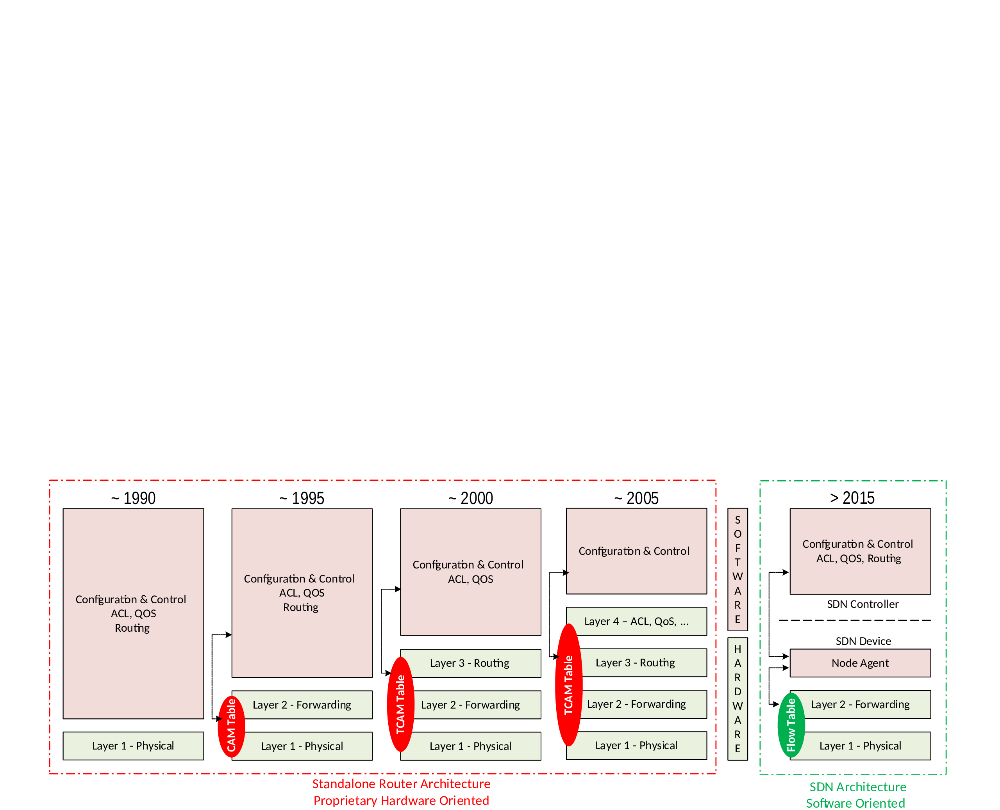

These progresses have been made thanks to the use of proprietary TCAM (Ternary
Content-Addressable Memory) and ASICs (Application-Specific Integrated Circuit)
which have been designed to perform table look up and data packets forwarding at
high speed.

In early 2000, the Virtualization for x86 computers support has led to lots of
innovation into systems domain. Compute virtualization and High-Speed network
devices evolution have enabled the **Cloud** creation.

Later, It appears it was not convenient to manage several isolated network
devices each having their own configuration language. Following needs have
emerged:

* Single point of configuration
* Configuration protocol standardization
* Network feature support on x86 servers
* Extensibility and ability to scale

And these desires called for the cloud and SDN technology development.

==== Early age of SDN

In Stanford University (US - CA), Clean Slate Research Projects program has been
initiated in order to think about how to improve the Internet network
architecture. "ETHANE" project was part of this program. Its purpose was to "
Design network where connectivity is governed by high-level, global policy".
This project is generally known as the first implementation of SDN.

In 2008, a white paper has been proposed by ACM (Association for Computing
Machinery) to design a new protocol (OpenFlow) that can program network devices
from a network controller.

In 2011, ONF (Open Networking Foundation) has been created to promote SDN
Architecture and OpenFlow protocols.

==== SDN startups acquired by major networks or virtualization vendors

First companies working on SDN have been founded around 2010. (Most of them have
now been acquired by main networks or virtualization solution vendors.)
In 2007, Martin Casado, who was working on Ethane project has founded Nicira to
provide solutions for network virtualization with SDN concept. Nicira has been
aquired by vMware in 2012 to develop VMare NSX. In 2016, VMWare also bought
PLUMGrid a SDN startup founded in 2013.
In 2010, BigSwitch networks has been founded: BigSwitch is proposing a SDN
solution. In early 2020, BigSwitch has been acquired by Arista Networks.
In 2012, Cisco has created Insieme Networks, a spin-in start-up company working
on SDN. In 2013, Cisco take back control on Insieme in order to develop its own
SDN solution called ACI (Application Centric Infrastructure).
In early 2012, Contrail Systems Inc has been created and aquired at the end of
the year by Juniper Networks.
In 2013, Alcatel Lucent has created Nuage Networks, a spin-in start-up company
working on SDN. Nuage Networks is now an affiliate of Nokia.

The road of SDN development and its history is never straighforward and looks
more nuanced than a single storyline might suggest. It's actually far more
complex to be described in a short section. This diagram from <<sdn-history>>
shows developments in programmable networking over the past 20 years, and their
chronological relationship to advances in network virtualization.

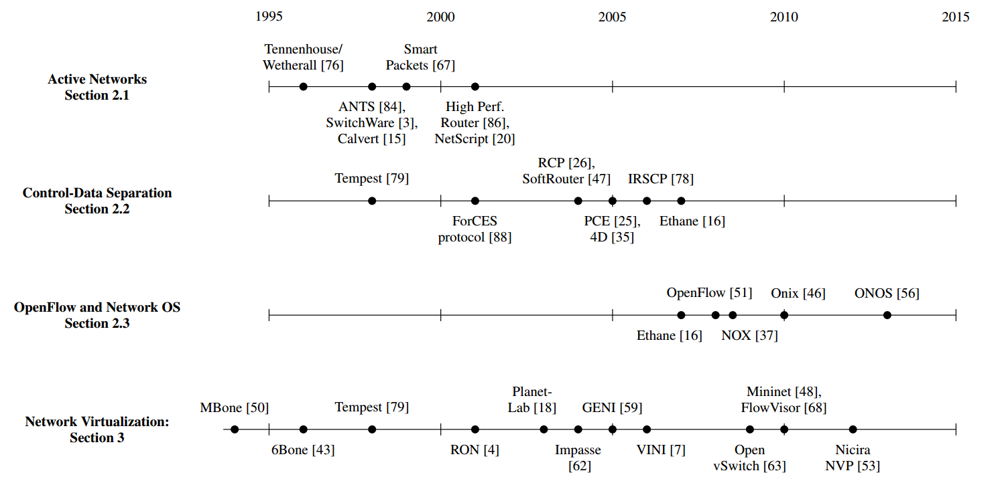

=== SDN definition

==== What is SDN?

The concept of `SDN`, and the term itself, are both very broad and often
confusing.  There is no real accurate definition of SDN, and vendors usually
take it very differently. Initially it was used to in Stanford’s OpenFlow
project, and later it has been extended to include a much wider area of
technologies. Discussion about each vendor's exact SDN definition is beyond the
scope of this book. But we generally consider that a SDN solution has to
provide one to several of following characteristics:

* a network control and configuration plane split from the network dataplane.
* a centralized configuration and control plane (SDN controller)
* a simplified network node
* network programmability to provide network automation
* automatic provisioning (ZTP zero touch provisioning) of network nodes
* virtualization support and openness

////
//laurent:
SDN (*Software Define Networking*) is a network architecture model in which the
network dataplane function has been physically splitted from configuration and
control plane function.
////

According to <<onf-sdn-definition>>, *Software-Defined Networking (SDN)* is:

> The physical separation of the network control plane from the forwarding plane,
> and where a control plane controls several devices

.SDN layer^<<onf-sdn-definition>>^
//jpg is too small after converted to word
//image::diagrams/sdn-architecture-img.jpg[image, 400, 400]
//seems size does not help when converting to word
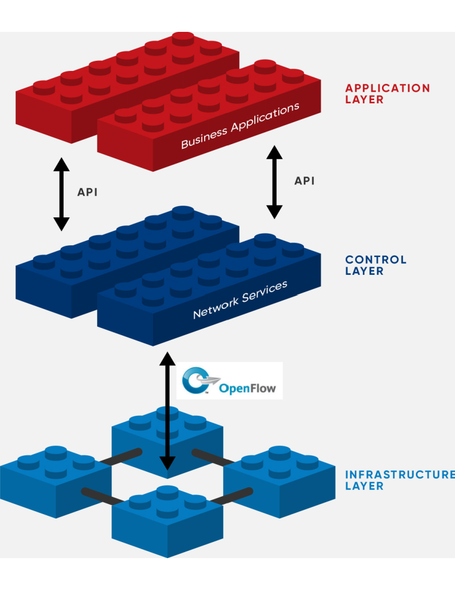

////
//ping:
Infrastructure layer:: this layer is composed of all networking equipments, e.g.
routers, switches, firewalls, etc. these devices build "underlay network" which
carries all the network traffic, which are no much different from what we've
seen in any tradtional network in terms of forwarding behavior, except that
their control plane is now located in a centralized plane - the control layer.

Control layer:: is where all "intelligence" located and where "SDN controllers"
would reside. a SDN controller have a "global view" of the network as a whole,
and based on the information it has, it calculates the disired reachability
information on behalf of all individual network devices in the infrastructure
layer. It then gives configurations and instructions (e.g. flow table, routing
table, etc) to the network devices regarding how to do the forwarding, using the
"South bound" interfaces supported by the network devices.

Application layer:: is where all kinds of applications are located. each network
vendors are coming up with their set of SDN applications so this is the most
"open" area. application layer leverages the so-called "northbound interface"
provided by control layer, which hides the complicated, and trival details about
how to interact with the network devices. we'll talk about the north bound and
south bound interfaces in the coming sections.
////

In this diagram, you can see that SDN allows simple high-level policies in the
"application layer" to modify the network, because the device level dependency
is eliminated to some extent. The network administrator can operate the
different vendor-specific devices in the "infrastructure layer" from a single
software console - the "control layer". The "controller" in control layer is
designed with such a way that it can view the whole network globally.  This
controller design helps a lot to introduce functionalities or programs as they
just needs to talk to the centralized controller, without the need to know all
details communicating with each individual device. These details are hidden by
the controller from the applications.

Several expectations are behind this new model:

- *openness*: communication between controller and network device uses
  standardized protocols like REST, OpenFlow, XMPP, NetConf, etc. This
  eliminates traditional vendor lock-in, giving you freedom of choice in
  networking.

- *cost reduction*: because of the openness, you can pick which ever low-cost
  vendor for your infrastructure (hardware).

- *automation*: the controller layer has a global view of whole network.  with
  the API exposed by the control layer, from the application perspective it's
  much easier to automate network devices application.

////
ch1 QUESTION: hard to explain why?
- *features rich*: with the ability of the SDN Controller to reprogram each
  controlled device using flow tables
////

NOTE: in this diagram, "openflow" is marked as the protocol between control
layer and infrastructure layer. This is to give an example about the standard
communication protocols. As of today more choices are available and standardized
in the SDN industry, which will be covered later in this chapter.

==== Traditional Network Planes and SDN layer

.traditional network device planes
traditionally, A typical network device (e.g. a router) has following planes:

.traditional network device planes
//image::ch1-extracted-media/word/media/image3.svg[image]
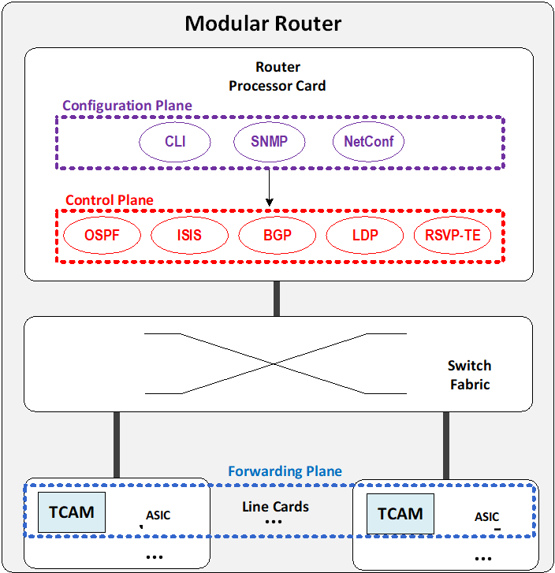

- *Configuration* (and management) *plane*: used for network node configuration
  and supervision. Examples of widely use protocols are CLI (Command Line
  Interface), SNMP (Simple Network Management Protocol) and NetConf.
- *Control plane*: used by network nodes to make packet forwarding decision. In
  traditional networks there have been a wide range of various different network
  control protocols running in the networks. Common examples are OSPF, ISIS,
  BGP, LDP, RSVP-TE, etc.
- *Forwarding* (or data or user) *plane*: This plane is responsible to perform
  data packet processing and forwarding. 
  This forwarding plane is made of
  proprietary protocols and is specific to each network equipment vendor.

////
NOTE: strickly speaking, "CLI" by itself is NOT a real protocol, nor is it ever
"standardized" - it may never be. it is a tool to provide user the ability to
interact with each individual device, and in this sense we call it a protocol.
////

configuration and control plane are located in device's main processor card,
oftenly called "routing engine", or "routing switching engine". The forwarding
plane is located in the device's packet forwarding card, oftenly called "line
card". 

//TODO: add MX picture?

.SDN layer

SDN architecture is built with 3 layers:

.SDN architecture
//image::ch1-extracted-media/word/media/image4.svg[image]
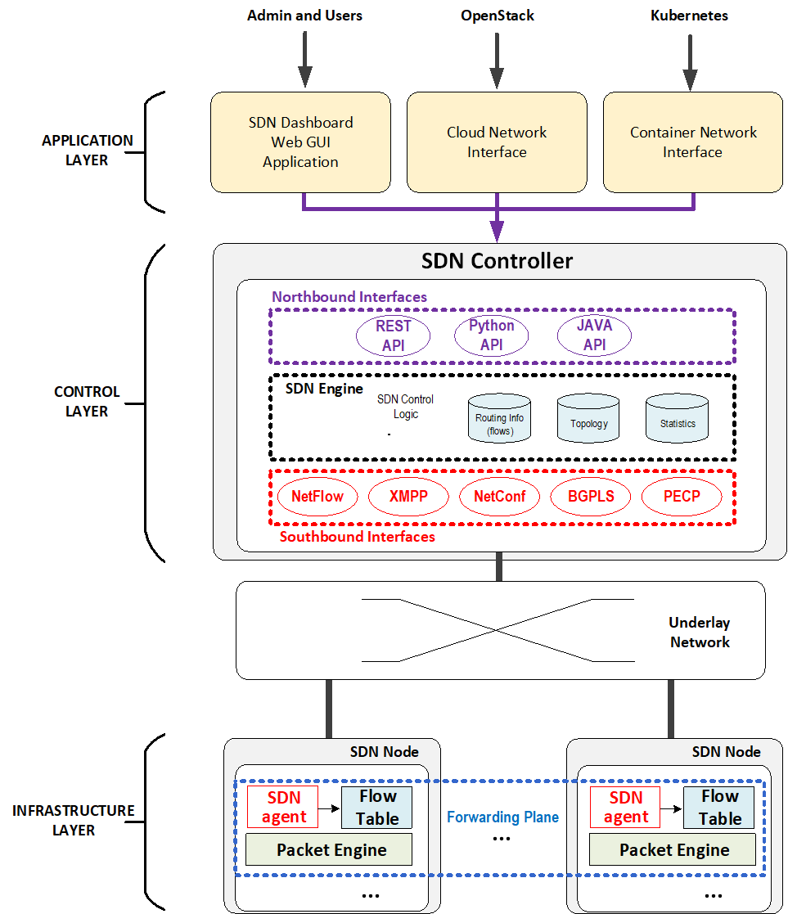

- *Application Layer*: containing all the application provided by the SDN
  solution. Generally a Web GUI dashboard is the first application provided to
  SDN users. Other common applications are Network infrastructure
  interconnection interfaces allowing the SDN solution to be plugged to a Cloud
  Infrastructure or a Container orchestrator.

- *Control Layer*: containing the SDN controller. This is the most intelligent
  part of a SDN solution. The SDN controller is made up of:
  ** the SDN engine, made up of SDN Control Logic and databases.
  ** "Southbound" interfaces that are used to control SDN network nodes. Most
     commonly used southbound interface protocols are OpenFlow, XMPP and OVSDB.
  ** "Northbound" interfaces that are used to expose services provided by the
     infrastructure layer "upward" to the SDN applications. The most commonly
     used northbound interface protocol is HTTP/REST.

- *Infrastructure Layer*: containing the SDN network nodes. This is the work
  load of a SDN solution. SDN network nodes can be either physical or virtual
  nodes. Typically, on each SDN node, there are:
  ** a SDN agent: which is handling the communication between each SDN network
     node and the SDN controller.
  ** A flow/routing table built by the SDN Agent.
  ** A forwarding plane engine

==== the primary changes between SDN and traditional networking

In a traditional infrastructure, the route calculation is made on each
individual router. each router needs to run one or several routing protocols,
through which it exchanges routes with the rest routers in the network, and
eventually, based on the route information learned, each router assumes it gains
enough knowledge about the network in order to make the forwarding decision.
From the network perspective, the control plane is distributed in each
individual router, and the end to end routing path is the result of all
decisions made by the control plane located on each router. 

The control plane on one router may look like this:

.Component in a traditional router
//image::ch1-extracted-media/word/media/image5.svg[image]
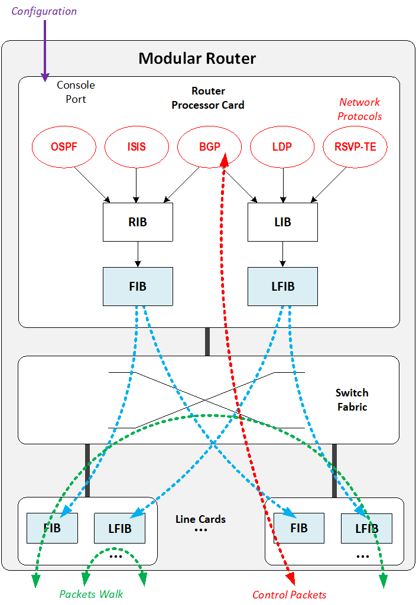

In reality, for example, a simplified Juniper MX control plane typical looks
like this:

//image::diagrams/Juniper-router-Separate-Control-and-Forwarding-Planes.png[image]
//image::diagrams/Juniper-RE-PFE.png[image]
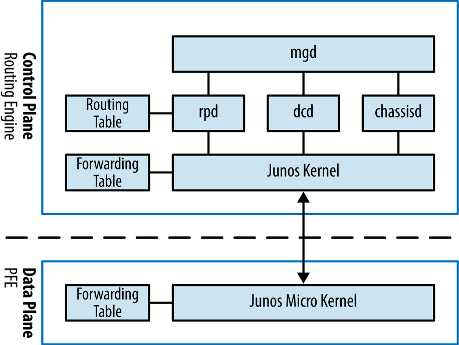

//even though traditional networks are very robust, 
Running a control plane on each router make it very hard to manage, because each
individual network device needs to be carefully configured. It requires
extensive, vendor-specific experiences and skills to configure the device.  The
high number of configuration points often make it very challenging to build a
robust network.  Flexibility is also a recurring hurdle for traditional networks
since most routers run proprietary hardware and software. 

//Traditional network nodes require expensive components because they are implementing high end routing protocols.

In contrast, in SDN networking, Control and Configuration functions are gathered
into a "SDN controller" which is controlling Network devices.  The new
architecture intends to provide a completely new way to configure the network.
This new Cloud infrastructure brings:

- simplified routers, without complex control plane in each router.
- a centralized control plane, which is a single configuration point

Let's compare the two architectures:

.Comparison between tradition network devices and SDN devices
//image::ch1-extracted-media/word/media/image2.svg[image]
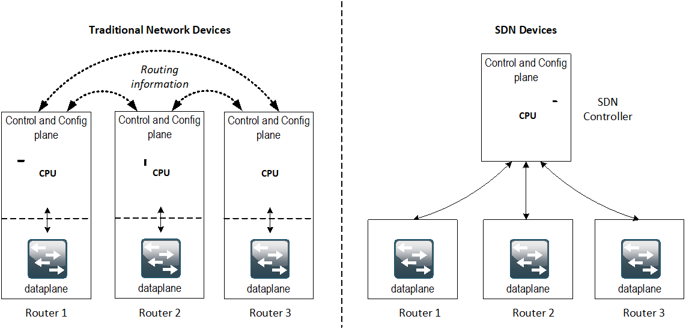

////
?
- the ability to distribute at a higher scale network elements, at least in
  each Cloud compute, and not only at the network infrastructure level.

In order to get a single configuration point, a centralized network controller
is proposed by the SDN Architecture. In order to be able to simplify network
nodes, the smartest part has been moved onto a controller.
////

This SDN infrastructure uses a centralized configuration and control point.
route calculation is done centrally in the controller and distributed into each
SDN network node. Well the idea looks good and simple, it requires a few
foundamental protocols and infrastructures to be implemented before this model
can work:

* a southbound network protocol: is needed to allow routing information being
  exchanged between the SDN controller and each controlled element. 
* A "underlay" network: A network infrastructure is allowing the communication
  between SDN controller and SDN network nodes, and data packet transfer between
  SDN nodes.

This underlay network infrastructure is playing the same role that the local
switch fabric is doing inside a standalone router between the control processor
card and lines cards. Based on it, A "overlay" network can be built by the
controller, which basically hides underlay network infrastructure details from
the applications so they will focus on the high level service implementations.
we'll talk more about "underlay" and "overlay" in the next section.

convenient as it is, this makes the controller the weakest point in the whole
model. Think of what will happen if this SDN controller, serving as the "brain",
stops working. Everything will be frozen and nothing works as expected, or even
worse, some part of the infrastructure continues to run but in an unexpected
way, which will very likely trigger bigger issues to other part of the network.

Lots of efforts are done by each SDN solution supplier to solve this weakness.
A common and efficient practice is to use clustered architecture to build a
highly resilient controller cluster. e.g 3 SDN controllers can load balance
and/or backup each other. on failure of one or two, the other one can still make
the whole cluster survive, giving the operator longer maintanence windows to fix
the problem.

//TODO: a 3 controller diagram will be better, opertional

//* highly scalable: using distributed compute and storage architectures

==== underlay vs overlay

.underlay network
In SDN architecture, each network node is connected to a physical network
infrastructure. This physical network which is providing basic connectivity
between network nodes is called the "underlay" network infrastructure. sometimes
it is also called "fabric", and typically it's a plane L3 IP network.

.overlay network
very often The underlay needs to separate between different administrative
domains (often called "tenants"), switch within the same L2 broadcast domain,
route between L2 broadcast domains, provide IP separation via VRFs, and etc.
This is implemented in the form of "overlay" networks. The overlay network is a
logical network that runs on top of the underlay network. The overlay is formed
of tunnels to carry the traffic across the L3 fabric. 

.why do we need overlay network?
Today the industry began to shift in the direction of building L3 data centers
and L3 infrastructures, mostly due to the rich features coming from L3
technologies, e.g, ECMP load balancing, flooding control, etc. But the L2
traffic does not disappear and most likely it never will. There are always the
desire that a group of network users need to reside in the same L2 network -
typically a VLAN. However, In today's virtualization environment, a user's VM
can be spawned in any compute located anywhere in the L3 cluster. Even if 2 VMs
are spawned in the same server, there is often a need to move them around
between different servers without changing their networking attributes. These
requirements to make a VM always belonging to the "same VLAN" calls for an
overlay model over the L3 network. In other words, we need a new mechanism to
allow us to tunnel L2 Ethernet domains with different encapsulations over an L3
network.

For example, in SDN node1 we were running VM11 and VM12, they were both serving
same sales department and so they were located in same VLAN.  because of some
administrative requirement, VM12 needs to be moved to another physical SDN node2
which, may be physically located in another rack that is a few router "hops"
away. Now we need to ensure not only data packet from VM11 in SDN node1 to be
able to reach VM12 in SDN node2, but also they are talking to each other as if
they are still in the same VLAN, exactly the same way as before just as if VM12
has never moved. This ability to make the "local" (in same VLAN) traffic to
traverse transparently across underlay network infrastructure calls for a packet
encapsulation, or "tunneling" mechanism in SDN networks.

.overlay tunnels and encapsulations
//image::ch1-extracted-media/word/media/image7.svg[image]
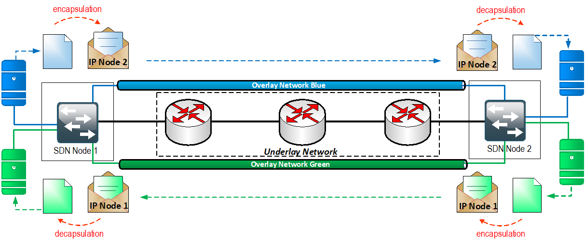

//TODO: correct diagram: IP node 1 => VM11, VM12; IP node 2=> VM21, VM22

Indeed, without such an encapsulation mechanism, traditional segmentation
solutions (VLAN, VRF) would have to be provided by the physical infrastructure
and implemented up to each SDN node, in order to provide an isolated
transportation channel for each customer network connected to the SDN
infrastructure.

Encapsulation protocols used in SDN networks have to provide:

* network segmentation: ability to build several different network connectivity between 2 SDN network nodes.
* ability to carry transparently Ethernet frames and IP packets
* ability to be carried over an IP connectivity

Several encapsulation protocols are used into SDN networks:

* VxLAN
* MPLS over GRE
* MPLS over UDP
* NVGRE
* Geneve
* STT

//image::ch1-extracted-media/word/media/image8.svg[image]
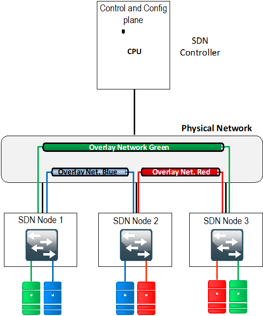

//NVGRE: ethernet over GRE
//Geneve: ethernet over UDP, introduce TLV
//STT: Stateless Transport Tunneling, MAC in TCP
These encapsulation protocols are providing Overlay connectivity which is
required between customers workload connected to the SDN infrastructure.
Each SDN node is call a VTEP (Virtual Tunnel End Point) as it is starting and
terminating the overlay tunnels.

==== interfaces between layers

We've seen "openflow" marked as one of the possible interfaces in the "SDN
layer" section. Now we'll introduce the concept of "southbound" and "northbound"
interface and other available choices in today's industry.

.southbound interface 

The "southbound" interface resides between the controller in "control layer" and
network devices in "infrastructure layer". Basically what it does is to provide
a means of communication between the 2 layers. Based on the demands and needs, a
SDN Controller will dynamically changes the configuration or routing information
of network devices. For example, a new VM will advertise a new subnet or host
routes when it is spawned in a server, this advertisement will be delivered to
SDN controller via a southbound protocol. Accordingly, SDN controller collects
all routing updates from the whole SDN cluster through the southbound
interfaces, and decides the most current and best route entries, then, it may
"reflect" these information to all other network devices or VMs. This ensures
all devices having the most uptodate routing information in real time. Among
others, examples of the most well-known southbound interfaces in the industry
are `openflow`, `OVSDB` and `XMPP`.

.openflow

OpenFlow is one of the most widely deployed southbound standard from open source
community. It first made its appearance in 2008 by Martin Casado at Stanford
University. The appearance of OpenFlow was one of the main factors which gave
birth to Software Defined Networking.

OpenFlow provides various information for the Controller. It generates the
event-based messages in case of port or link changes. The protocol generates a
flow based statistic for the forwarding network device and passes it to the
controller. 

OpenFlow also provides a rich set of protocol specifications for effective
communication at the controller and switching element side. Open Flow provides
an open source platform for Research Community. 

Every physical or virtual OpenFlow-enabled network (data plane) devices in the
SDN domain needs to first register with the OpenFlow controller. The
registration process is completed via an OpenFlow `HELLO` packet originating
from the OpenFlow device to the SDN controller. 

////
//these texts are a little bit redundant
NOTE: although openflow is very popularly used as southbound interface in SDN,
it is not the only choice for the southbound interface. there are other options
available(like XMPP).
////

.OVSDB

unlike openflow, OVSDB is a southbound API designed to provide additional
**management** or **configuration** capabilities like networking functions. With
OVSDB we can create the virtual switch instances, set the interfaces and connect
them to the switches.  We can also provide the QoS policy for the interfaces.

.northbound interface

The northbound interface provides connectivity between the controller and the
network applications running in management plane. As we already discussed that
southbound interface has OpenFlow as open source protocol, northbound lacks
such type of protocol standards. However with the advancement of technology now
we have a wide range of northbound API support like ad-hoc API's, RESTful APIs
etc. The selection of northbound interface usually depends on the programming
language used in application development.

==== more alphabet soup of terms

with the development of virtualization, SDN technologies and their ecology in
recent years, more and more terms and changing of these terms emerge in the
networking industry. a lot of confusions have rised, often because of terms are
referring different things when they are used in different context. Sometimes
the latest term the industry uses is a particular technology such as VNF
or a concept such as NFV. Terms rise and fall out of favor as the industry
evolves. In recent years the terms such as openstack, NVF/VNF has become the
industry’s favorite buzzword. This raises the question - just what is openstack,
NVF/VNF and what are the relationships with SDN?

////
The first concept that comes to the mind of the average industry professional is
running one or more guest operating systems on a host. However, digging a little
deeper reveals this definition is too narrow. There are a large number of
services, hardware, and software that can be “virtualized”. This section will
take a look at these different terms along with the pros and cons of each.
////

.NFV: Networking Function Virtualization

`NFV`/`VNF` sounds like new buzzwords, but those technologies have been around
for years.  according to ETSI:

.VNF/VNFI (contrail/NFX) vs NFV (vsrx) vs NMO (cso):
image::https://user-images.githubusercontent.com/2038044/57194252-c9f6cd00-6f12-11e9-8ae0-dbc96830f428.png[]

`NFV` means "network function virtualization", it stands for an "operation
framework for orchestrating and automating VNFs". And `VNF` means "virtualized
network function", such as virtualized routers, firewalls, load balancers,
traffic optimizers, IDS or IPS, web application protectors, and so on. 

////
VNF/VNFI:: NFV infrastructure: contrail/NFX
NFV:: vsrx 
NMO:: cso
VIM:: virtualized infrastructure manager, openstack, contrail, used to initiate VNFs
////

in a nut shell you can think of NVF as a "concept", or "framework" to virtualize
certain network functions, while VNF is the implementations of each individual
network functions.
Among others, firewalls and load balancers are the two most common `VNFs` in the
industry, especially for deployments inside data centers. When you read today's
documents about virtualization technology, you will see the terms in such a
pattern like "vXX" (e.g. vSRX, vMX), or "cXX" (e.g.  cSRX) very often. that
letter `v` indicates it is a "virtualized" product, while letter `c` -
"containerized" is its container version. 

.openstack

Jointly launched by NASA and Rackspace in 2012, Openstack has rapidly gained
popularity in many enterprise data centres. It is one of the most used open
source cloud computing platform to support software development and Big Data
analytics.  OpenStack comprises a set of software modules, e.g, compute, storage
& networking modules, which works together to provide an open source choice for
building private & public cloud environments. As an IaaS (Infrastructure As A
Service) open source implementation ,it provides a wide range of services, from
basic service like computing service, storage service, networking service, etc,
to advanced services like database, container orchestration and others. 

You can think of Openstack as an abstraction layer providing a cloud environment
on your promise. with openstack installed in your servers, ,you can spawn a VM,
consume and recycle it when you are done, all in seconds. under that abstraction
layer, Openstack hides most complexities of automation and orchestration of
diverse underlying resources like compute, storage and networking.  you could
choose Servers, storage, networking devices from your favorite vendors to build
the underlying infrastructure, and openstack will "consume" all of them and
expose to the user as a pool of common "resources": number of CPUs, RAMs, hard
disk spaces, IP addresses, etc. The user does not (need to) care about vendor
and brand details.

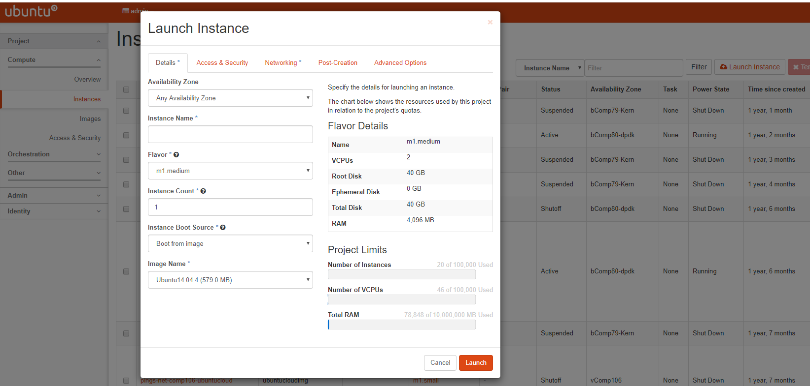

If we compare openstack with SDN, it's not hard to see that the two model shares
some common features. Both models provide certain level of abstractions, hide
the low level hardware details and expose to upper level user applications.  the
differences are somewhat subtle to describe in just a few words. First off,
although there are various distributions from different vendors, they share
common core components that is managed by the OpenStack Foundation. SDN is more
of a "framework" or an "approach" to manage the network dynamically,  which can
be implemented with totally different software techniques.  Secondly, From the
perspective of technical ecological coverage, the ecological aspects of
OpenStack are much wider, because networking is just one of its services that is
implemented by its `Neutron` component among it's other various plugins.  SDN,
and its ecology, in contrast, mainly focus on the networking.  There are also
difference in the way that Neutron works comparing with how a typical SDN
controller works. OpenStack Neutron focuses on providing network services for
virtual machines, containers, physical servers, etc, and provides a unified
**northbound** REST API to users, SDN focuses on configuration and management of
forwarding control toward the underlaying network device, it not only provides
user-oriented northbound API, but also provides standard **southbound** API to
communicating with various hardware devices. 

NOTE: The comparison between openstack and SDN here are more of conceptual. In
reality these two models can, and in fact often, coupled with each other in some
way, loosely or tightly. one example is TF, which we'll talk about later in this
chapter.

////
Flexibility is the main driver for any visualization platform.  The data center
network itself is also part of the virtualization revolution. SDN and network
overlays are the key drivers for virtualizing networks in data centers.
////

=== SDN solutions

==== controllers

As we've mentioned in previous sections, SDN is a networking scenario which
changes the traditional network architecture by bringing all control
functionalities to a single location and making centralized decisions.
SDN controllers are the brain of SDN architecture, which perform the control
decision tasks while routing the packets. Centralized decision capability for
routing enhances the network performance. As a result, SDN controller is the
core components of any SDN solutions.

While working with SDN architecture, one of the major point of concerns is which
controller and solution should be selected for deployment. There are quite a few
SDN controller and solutions implementations from various vendors, and every
solution has its own pros and cons along with its working domain. In this
section we'll review some of the popular SDN controllers in the market, and the
corresponding SDN solutions.

////
==== SDN controller reports

.TODO, some research about today's market players, may skip

image::https://user-images.githubusercontent.com/2038044/78374061-61d4bf00-7599-11ea-9742-20b94163ddcf.png[image]
////

==== opendaylight (ODL)

OpenDaylight, aften abbreviated as ODL, is a Java based open source project
started from 2013, it was originally led by IBM and Cisco but later hosted under
the Linux Foundation. it was the first open source Controller that can support
non-OpenFlow southbound protocols, which can make it much easier to be
integrated with multiple vendors.

ODL is a modular platform for SDN. It is not a single piece of software. It is a
modular platform for integrating multiple plugins and modules under one umbrella
There are many plugins and modules built for OpenDaylight. Some are in
production, while some are still under development. 

.opendaylight "Boron"
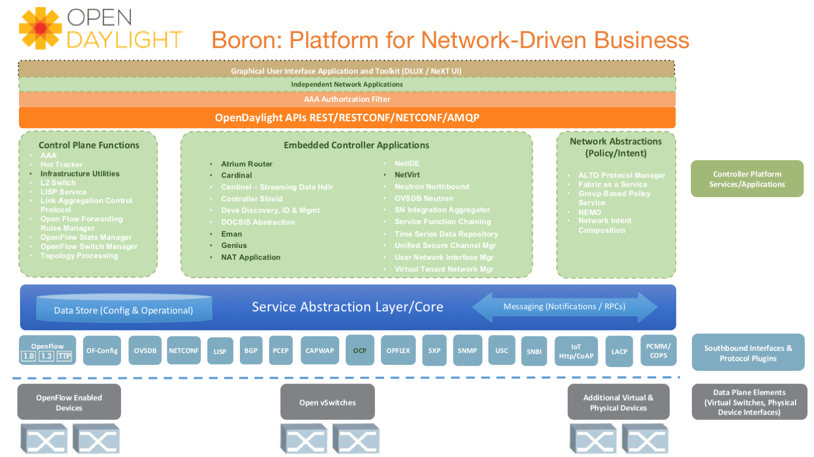
//image::https://user-images.githubusercontent.com/2038044/78376350-2f789100-759c-11ea-923c-883b03048d37.png[image]

Some of the initial SDN controllers had their southbound APIs tightly bound to
OpenFlow, But as we can see from the diagram, besides openflow, many other
southbound protocols that are available in today's market are also supported.
Examples are NETCONF, OVSDB, SNMP, BGP, etc. Support of these protocols are done
in a modular method in the form of different plugins, which are linked
dynamically to a central component named "Service Abstraction Layer (SAL)". SAL
does translations between the SDN application and the underlaying network
equipments. for instance, when it receives a service request from a SDN
application, typically via high level API calls (northbound), it understands the
API call and translates the request to a language that the underlying network
equipments can also understand. That language is one of the southbound
protocols.

While this "translation" is transparent to the SDN application, ODL itself needs
to know all the details about how to talk to each one of the network devices it
supports, their features, capabilities etc. a `topology manager` module in OLD
manages this type of information. What `topology manager` does is to collect
topology related information from various modules and protocols, such as ARP,
host tracker, device manager, switch manager, OpenFlow, etc, and based on these
info, it visualize the network topology by drawing a diagram dynamically, all
the managed devices and how they are connected together will be showed in it.

.ODL topology
image::diagrams/odl-topo1.png[]

any topology changes, such as adding new devices, will be updated in the
database and reflected immediately in the diagram. 

.ODL topology update
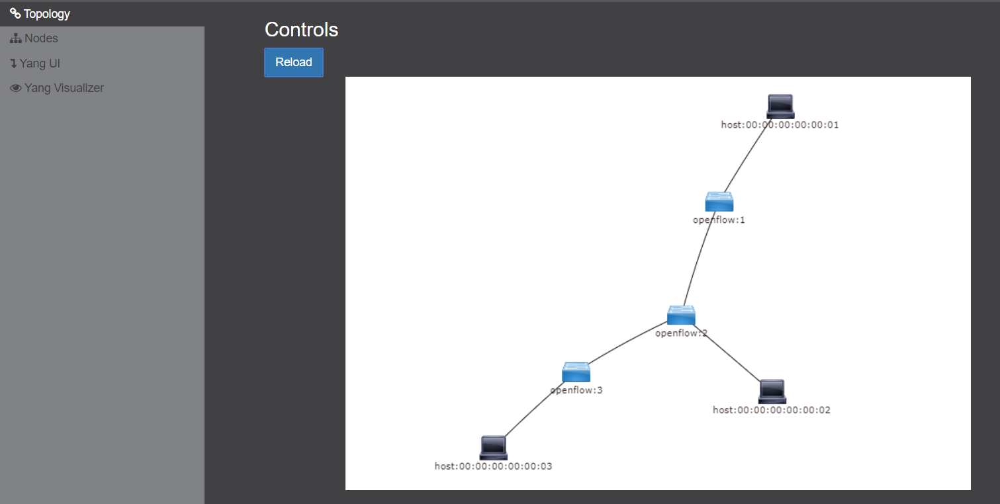

Remember earlier we mentioned that an SDN controller has "global
view" of the whole SDN network. In that sense ODL has all necessary visibility
and knowledge of the network that can be used to draw the network diagram in
realtime.

==== underlay network and overlay network

==== OVN

===== OVS

===== OVN

==== ONOS

==== calico

===== calico introduction

quote from calico official website:
____
Calico is an open source networking and network security solution for
containers, virtual machines, and native host-based workloads. Calico supports
a broad range of platforms including Kubernetes, OpenShift, Docker EE,
OpenStack, and bare metal services.
____

Calico has been an open-source project from day one. It was originally designed
for today's modern cloud-native world and runs on both public and private
clouds. Its reputation mostly comes from it's deplayment in Kubernetes and its
ecosystem environments. Today Calico has become one of the most popularly used
kubernetes CNIes and many enterprises using it at scale.

Comparing with other overlay network SDN solutions, Calico is special in the
sense that it does not use any overlay networking design or tunneling
protocols, nor does it require NAT.  Instead it uses a plain IP networking
fabric to enables host to host and pod to pod networking.  The basic idea is to
provides Layer 3 networking capabilities and associates a virtual router with
each node, so that each node is behaving like a traditional router, or a
"virtual router". We know that a typical Internet router relies on routing
protocols like OSPF, BGP to learn and advertise the routing information, and
That is the way a node in calico networking works. It chooses BGP, because of
it's simple, industry's current best practice, and the only protocol that
sufficiently scale.

calico uses a policy engine to deliver high-level network policy management. 

===== calico archetecture

//image::diagrams/k8s-calico-graph.png[image]
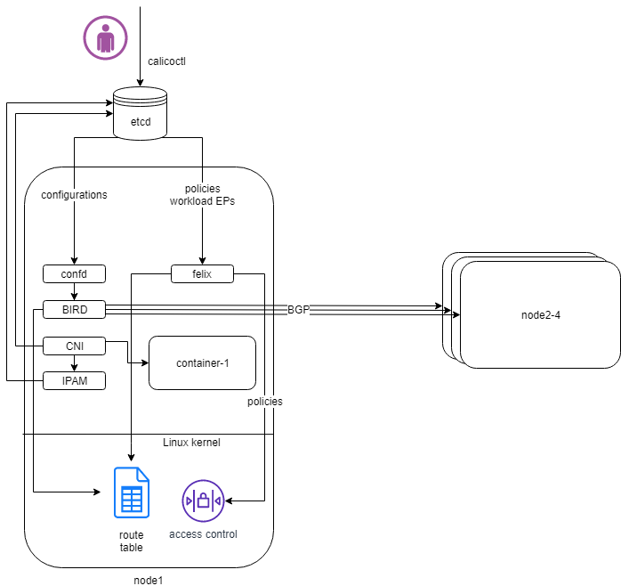

Calico is made up of the following components:

- Felix: the primary Calico agent that runs on each machine that hosts endpoints.
- The Orchestrator plugin: orchestrator-specific code that tightly integrates Calico into that orchestrator.
- BIRD: a BGP speaker that advertise and install routing information.
- BGP Route Reflector (BIRD): an optional BGP route reflector for higher scale.
- calico CNI plugin: connect the containers with the host
- IPAM: for IP address allocation management
- etcd: the data store.

====== felix (policy)

This is calico "agent" - a daemon that runs on every workload, for example on
nodes that host containers or VMs. it is the one that performs most of the
"magics" in the calico stack. It is responsible for programming routes and
ACLs, and anything else required on the host, in order to provide the desired
connectivity for the endpoints on that host.

Depending on the specific orchestrator environment, Felix is responsible for
the following tasks:

* Interface management (ARP response)
* Route programming (linux kernel FIB)
* ACL programming (host IPtables)
* State reporting (health check)

////
It has multiple responsibilities:

- it writes the routing table of the operating system 
- it manipulates IPtables on the host.
////
It does all this by connecting to etcd and reading information from there. It
runs inside the calico/node DaemonSet along with `confd` and `BIRD`.

====== Orchestrator plugin

The orchestrator plugins are essentially responsible for API translations.
Calico has a separate plugin for each major cloud orchestration platforms (e.g.
OpenStack, Kubernetes). 
////
The purpose of these plugins is to bind Calico more tightly into the
orchestrator, allowing users to manage the Calico network just as they’d manage
network tools that were built into the orchestrator.
////
For example in openstack environment, a Calico Neutron ML2 driver integrates
with Neutron’s ML2 plugin to allows users to configure the Calico network
simply by making Neutron API calls. This provides seamless integration with
Neutron.

====== Etcd (database)

the backend data store for all the information Calico needs. it can be the same of different etcd that kubernetes use.
//it's recommended deploy a separate etcd for production systems, or at least
//deploy it outside of your kubernetes cluster.
it has at least, but not limited to the following information:
* list of all workloads (endpoints)
* BGP configuration
* policys from user (e.g. defined via the `calicoctl` tool)
* information about each container (pod name, IP, etc), received from calico CNI

====== BIRD (BGP)

Calico makes uses of BGP to propagate routes between hosts.  And the BGP
"speaker" in calico is BIRD - a routing daemon that runs on every host that
also hosts Felix module in the Kubernetes cluster, usually as a `DaemonSet`. It
’s included in the calico/node container.  it's role is to read routing state
that Felix programs into the kernel and distribute it around the data center.
comparing with what Felix does, one of the main differences is that Felix
"insert" routes into the linux kernel FIB and BIRD "distribute" them to all
other nodes in the deployment, this turns each host to a virtual Internet BGP
router ("vRouter"), and ensures that traffic is efficiently routed around the
deployment.

====== Confd

confd is a simple configuration management tool. In Calico, BIRD does not deal
with etcd directly, it is another module "confd" that reads the BGP
configuration from etcd and feed to BIRD in the form of configurations files in
disk.

====== CNI plugin

configure IP, routes
`CNI` stands for "container networking interface". 

There’s an interface for each pod, When the container spun up, calico (via CNI)
created an interface for us and assigned it to the pod.

when a new pod starts up, Calico will:
- query the kubernetes API to determine the pod exists and that it’s on this node
- assigns the pod an IP address from within its IPAM
- create an interface on the host so that the container can get an address
- tell the kubernetes API about this new IP

====== IPAM plugin

as the name indicated already, Calico's IPAM plugin is responsible for "IP
address management". when a new container is spawn, calico IPAM plugin reads
information from etcd database to decide which IP is available to be allocated
to the container. the IP address by default will be allocated in the unit of
/26 "block". a block is essentially a subnet which aggregate the routes to save
routing table spaces.

===== calico workflow

- A container is spawned
- calico IPAM plugin assign an IP address from an IP block (by default /26). it
  then records this in etcd.
- calico CNI apply the network configuration to the container so it has a
  default route pointing to the host. CNI also save these information to etcd.
- calico felix appy the network configuration to the host, so it is aware of
  the new container, and be ready to receive packets from it.
- confd read the data from etcd and generate the routing configuration, BIRD
  use these configuratioin to establish BGP neighborship with other nodes. it
  then advertises the container subnet to the rest of the cluster via BGP
- all other hosts in the same cluster will learn this subnet via BGP and
  install the route into its local routing table, now the new container is
  reachable from anywhere in the cluster.
- user may configure a routing policy, e.g. via the `calicoctl` commands. the
  policy will be save in etcd database. felix read this policy and applies it
  to the firewall configurations.

.Reference

* https://www.projectcalico.org
* https://www.projectcalico.org/why-bgp/

==== nuage VCP (Nokia)

The Virtualized Cloud Platform (VCP) product from Nuage networks provides a
highly scalable policy-based Software-Defined Networking (SDN) platform. It is
an enterprise-grade offering that builds on top of the open source Open vSwitch
for the data plane along with a feature-rich SDN controller built on open
standards.

The Nuage platform uses overlays to provide seamless policy-based networking
between Kubernetes Pods and non-Kubernetes environments (VMs and bare metal
servers). Nuage's policy abstraction model is designed with applications in
mind and makes it easy to declare fine-grained policies for applications. The
platform's real-time analytics engine enables visibility and security
monitoring for Kubernetes applications.

All VCS components can be installed in containers. There are no special
hardware requirements.

.Nuage architecture
image::https://user-images.githubusercontent.com/2038044/78465427-93e24000-76c3-11ea-92ee-39a45a259e74.png[image]

.Nuage VSP incudes 3 major components

* virtualized services directory (VSD)
* virtualized services controller (VSC)
* virtualized routing and switching (VRS)

===== VSD

In Nuage VCP, The Virtualised Services Directory (VSD) is a policy engine,
business logic and analytics engine that supports the abstract definition of
network services. Through RESTful APIs to VSD, administrators can define and
refine service designs and incorporate enterprise policies.

It is a web-based, graphical console that connects to all of the VRS nodes in
the network to manage their deployment and configuration. 

The VSD policy & analytics engine presents a unified web interface where
configuration and monitoring data is presented. The VSD is API-enabled for
integration with other orchestration tools. Alternatively, you can develop your
apps. Either way, the VSD is based on tools from the service provider world,
and therefore scaling potential looks very good. It integrates multiple data
centre networks by linking VSDs together and exchanging policy data.

===== VSC

Nuage Virtual Services Controllers (VSC) works between VSD and VRS. policies
from VSD is distributed through a number of VSC to all of the VRS nodes in the
network to manage their deployment and configuration.

VSC is SDN controller in Nuage VCP architecture. it provides a robust control
plane for the datacenter network, maintaining a full per-tenant view of network
and service topologies. Through network APIs that use southbound interfaces
(e.g. OpenFlow), VSC programs the datacenter network independent of different
hardwares.

The VSC implements an OSPF, IS-IS or BGP listener to monitor the state of the
physical network. Therefore, if routes starts flapping, the VSC is able to
incorporate those events into the decision tree.

while scalability in a single data center can be achieved by setting up
multiple VSC, each handling a certain group of VRS devices, scalability between
multiple data centres can be achieved by connecting VSC controllers
horizontally at the top of the hierarchy.

.Nuage VSC MP-BGP
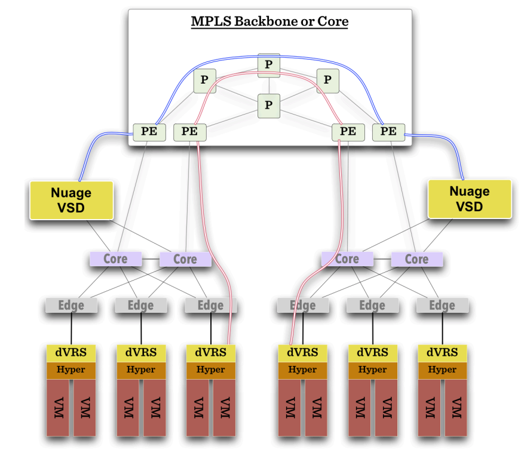

As shown in the diagram above, VSC controllers are synchronised using
MP-BGP. A BGP connection peers with PE routers at the WAN edge, and then the
VSC controller uses MP-BGP to synchronise controller state & configuration with
VSCs in other data centres. This is vital for end-to-end network stability.

When dVRS devices are communicating to non-local dVRS devices,
data is tunnelled in MPLS-over-GRE to the PE router.

===== VRS

The VRS module serves as a virtual endpoint for network services. It detects
changes in the compute environment as they occur and instantaneously triggers
policy-based responses to ensure that the network connectivity needs of
applications are met.

configuration of the VRS is derived from a series of templates. 

Each VRS routes traffic into the network according to its flow table.
Therefore, the entire VRS system performs routing at the edge of the
network.

A VRS can’t make a forwarding decision in a vacuum, as events in the
underlying physical network must be considered. Nuage Networks has
extensively considered how to provide the VSC controller with all the
information required to have a complete model of the network. 

////
==== other solutions?

===== cisco: apic
===== openflood
==== vmare NSX
////

=== Overview of Tungsten Fabric (TF)

==== TF introduction

////
We've introduced a few SDN solutions existing in the market.  Some of them are
based on proprietary protocols and standards. Openflow is standardized protocol,
but it is more or less "outdated" technologies after more than a decade since
it's birth in 2008.
////

The Tungsten Fabric (TF), is an open-standard based, proactive overlay SDN
solution. It works with existing physical network devices and help address the
networking challenges for self-service, automated, and vertically integrated
cloud architecture. It also improves scalability through a proactive overlay
virtual network technique.

TF controller integrates with most of the popular cloud management systems such
as OpenStack, vmware, and Kubernetes. TF's focus is to provide networking
connectivity and functionalities, and enforce user-defined network and security
policies to the various of workloads based on different platforms and
orchestrators.

Tungsten Fabric's primary claim to fame is that it is diligently multi-cloud and
multi-stack. Today it supports:

* Multiple compute types: baremetal, VMs and containers
* Multiple cloud stack types: VMware, OpenStack, Kubernetes (via CNI), OpenShift
* Multiple performance modes: kernel native, DPDK accelerated, and several
  different SmartNICs
* Multiple overlay models: MPLS tunnels or direct, non-overlay mode (no
  tunneling)

TF fits seamlessly into LFN (Linux Foundation Networking) mission to foster open
source innovation in the networking space.

The TF system is implemented as a set of nodes running on general-purpose x86
servers. Each node can be implemented as a separate physical server, or VM.

.open source version

Initially, "Contrail" was a product of a startup company "Contrail system",
which was acquired by Juniper Networks in Dec. 2012. It was open sourced in 2013
with a new name "OpenContrail" under the Apache 2.0 license, which means that
anyone can use and modify the code of "Opencontrail" system without any
obligation to publish or release the modifications. In early 2018, it was
rebranded to "Tungsten Fabric" (abbreviated as "TF") as it transitioned into a
fully-fledged Linux Foundation project.  currently TF is still managed by the
Linux Foundation.

////
Tungsten Fabric (TF) seeks to be one of many potential next generation open
source software-defined networking solutions that can be used as part of a
"stack". TF already plays nice with some LFN projects such as DPDK. It also
works closely with related LF open networking projects such as Akraino Edge
Stack, OPNFV, and ONAP. TF seeks to continue to increase coordination and
interoperability with related open source networking projects over time.
////

.commercial version

Juniper also maintains a commercial version of the Contrail system, and
provides commercial support to the payed users. Both The open-source version
and commerical version of the Contrail system provide the same full
functionalities, features and performances.

NOTE: Throughout this book, we use these terms "contrail", "opencontrail",
"Tungsten Fabric" and "TF" interchangeably.

==== TF components

TF consists of two main components:

- Tungsten Fabric Controller: the SDN controller in the SDN architecture. 

////
a set of software services that maintains a model of networks and network
policies, typically running on several servers for high availability
////

- Tungsten Fabric vRouter: a forwarding plane that runs in each compute node
  performings packet forwarding and enforces network and security policies.

The communication between the controller and vRouters is via XMPP, which is a
widely used messaging protocol.

//installed in each host that runs workloads (virtual machines or containers)

A high level Tungsten Fabric architecture is shown below:

.TF architecture
image::diagrams/TFA_private_cloud.png[TF arch]
//image::diagrams/TF_arch1.png[TF arch]

===== The TF SDN controller node

The TF SDN controller integrates with an orchestrator's networking module in
the form of a "plugin", for instance:

- in OpenStack environment, TF interfaces with the Neutron server as a neutron plugin 
- in kubernetes environment, TF interfaces with k8s API server as a
  `kube-network-manager` process and a `CNI` plugin that is watching the events
  from the k8s API.

TF SDN Controller is a so-called "logically centralized" but "physically
distributed" SDN controller. It is "physically distributed" because same exact
controllers can be running in multiple (typicall three) nodes in a cluster.
However, all controllers work together to behaves consistently as a single
logical unit that is responsible for providing the management, control, and
analytics functions of the whole cluster. 

This "physically distributed" nature of the Contrail SDN Controller is a
distinguishing feature. Because there can be multiple redundant instances of the
controller, operating in an "active/active" mode (as opposed to an
"active-standby" mode). When everything works, two controllers can share the
workload and load balance the control tasks. When a node becomes overloaded,
additional instances of that node type can be instantiated after which the load
is automatically redistributed. on the failure of any active node, the system as
a whole can continue to operate without any interruption. This prevents any
single node from becoming a bottleneck and allows the system to manage a very
large-scale system.
In production, a typical High-Availability (HA) deployment is to run three
controller nodes in an active-active mode, single point failure is eliminated.

//This is a distinguishing feature to archive the goal of redundancy and horizontal scalability.

As any SDN controller, The TF controller has a "global view" of all routes in
the cluster. it implements this by collecting the route information from all
computes (where the TF Vrouters resides) and distributes these information
throughout the cluster.

===== TF vRouter: compute node

Compute nodes are general-purpose virtualized servers that host VMs. These VMs
can be tenants running general applications, or service VMs running network
services such as a virtual load balancer or virtual firewall.  Each compute
node contains a TF vRouter that implements the forwarding plane.
//and the distributed part of the control plane.

The TF vRouter is conceptually similar to other existing virtualized switches
such as the Open vSwitch (OVS), but it also provides routing and higher layer
services. It replaces traditional Linux bridge and IP tables, or Open vSwitch
networking on the compute hosts. Configured by TF controller, TF vRouter
implement the desired networking and security policies. while workloads in same
network can communicate with each other "by default", a explicit network policy
is required to communicate with VMs in different networks.

As other overlay SDN solutions, TF vRouter extends the network from the
physical routers and switches in a data center into a virtual overlay network
hosted in the virtualized servers.  Overlay tunnels are established between all
computes, communication between VMs on different nodes are carried in these
tunnels and behaves as if they are on the same compute. Currently vXLAN,
MPLSoUDP and MPLSoGRE tunnels are supported.

===== TF controller components

In each TF SDN Controller there are three main components:

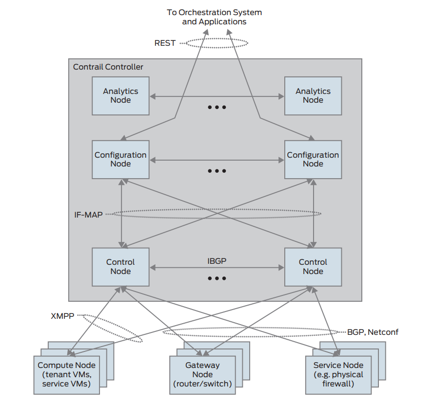

- Configuration nodes keep a persistent copy of the intended configuration
  states and store them in cassandra database. they are also responsible for
  translating the high-level data model into a lower-level form suitable for
  interacting with control nodes.

- Control nodes are responsible for propagating the low-level state data it
  received from configuration node to the network devices and peer systems in
  an eventually consistent way.  They implements a logically centralized control
  plane that is responsible for maintaining network state. control nodes run
  XMPP with network devices, and run BGP with each other.

- Analytics nodes are mostly about statistics and logging. They are responsible
  for capturing real-time data from network elements, abstracting it, and
  presenting it in a form suitable for applications to consume.  it collect,
  store, correlate, and analyze information from network elements.

////
- Gateway nodes are physical gateway routers or switches that connect the
  tenant virtual networks to physical networks such as the Internet, a customer
  VPN, another data center, or non-virtualized servers.

- Service nodes are physical network elements providing network services such
  as DPI, IDP,IPS, WAN optimizers, and load balancers. Service chains can
  contain a mixture of virtual services (implemented as VMs on compute nodes)
  and physical services (hosted on service nodes).

For clarity, Figure 2 does not show physical routers and switches that form the
underlay IP-over-Ethernet network.  There is also an interface from every node
in the system to the analytics nodes. This interface is not shown in Figure 2
to avoid clutter.
////

===== TF vRouter components

TF vRouter is running in each compute node. The compute node is a
general-purpose x86 server that hosts tenant VMs running customer applications.

// examples can be: Web servers, database servers, enterprise applications or hosting
// virtualized services used to create service chains

TF vRouter consists two components:

* the vRouter agent: the local control plane. 
* the vRouter forwarding plane

NOTE: In the typical configuration, Linux is the host OS and KVM is the
hypervisor. The Contrail vRouter forwarding plane can sits either in the Linux
kernel space, or in the user space in dpdk mode. more details will be covered in
later chapters.

.vRouter Agent

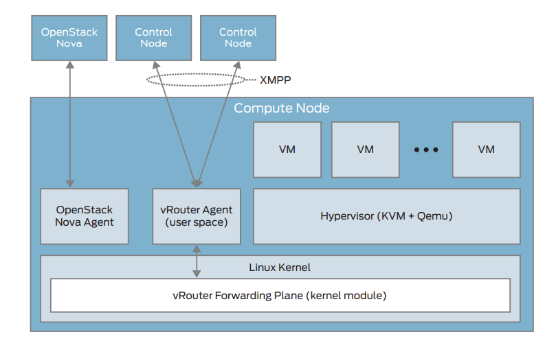

The vRouter agent is a user space process running inside Linux. It acts as the
local, lightweight control plane in the compute, in a way similar to what
"routing engine" does in a pysical router.  For example, vRouter agent
establish XMPP neighborships with two controller nodes, then exchances the
routing information with them. vRouter agent also dynamically generate flow
entries and inject them into the vRouter forwarding plane, this gives
instructions to the vRouter about how to forward packets.

.vRouter Forwarding Plane

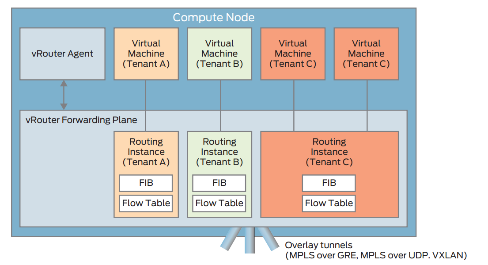

The vRouter forwarding plane works like a "line card" of a traditional router.
it looks up its local FIB and determines the next hop of a packet.  It also
encapsulates packets properly before sending them to the overlay network and
decapsulates packets to be received from the overlay network.

We'll cover more details of TF vrouter in the later chapters.

////
.References

* [[sdn-history]] https://www.cs.princeton.edu/courses/archive/fall13/cos597E/papers/sdnhistory.pdf
* http://yuba.stanford.edu/cleanslate/research_project_ethane.php
* http://yuba.stanford.edu/ethane/pubs.html
* https://dl.acm.org/doi/10.1145/1355734.1355746
* [[onf-sdn-definition]] https://www.opennetworking.org/sdn-definition/
* https://www.rfc-editor.org/rfc/rfc7426.txt
* https://portal.etsi.org/NFV/NFV_White_Paper.pdf
* https://www.sdxcentral.com/wp-content/uploads/2015/08/SDxCentral-SDN-Controllers-Report-2015-B2.pdf[2015 ]
* https://www.opennetworking.org/images/stories/downloads/sdn-resources/special-reports/Special-Report-OpenFlow-and-SDN-State-of-the-Union-B.pdf[2016 ]
* https://ieeexplore.ieee.org/stamp/stamp.jsp?arnumber=8379403[Controllers in SDN: A Review Report. 2018]
//* https://aptira.com/comparison-of-software-defined-networking-sdn-controllers-part-2-open-network-operating-system-onos[2019]
* https://www.opendaylight.org/technical-community/getting-started-for-developers/roadmap
* https://www.opendaylight.org/what-we-do/current-release/boron
* https://www.sdnlab.com/community/article/odl/1
* https://wiki.lfnetworking.org/display/LN/Tungsten+Fabric+Project+Proposal
////

<<<

== *[underline]#chapter 2: SDN dataplane fundamentals#* (laurent)

=== Performance requirements

Ethernet minimum frame size is 64 Bytes.
When Ethernet frames are sent onto the wire, Inter Frame Gap and Preamble bits are added.
Minimum size of Ethernet frames on the physical layer is 84 Bytes (672 bits).

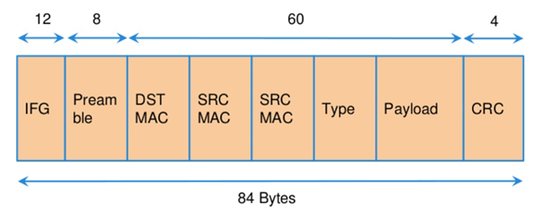

For a 10 Gbit/s interface, the number of frames per seconds can reach up to
14.88 Mpps for traffic using the smallest Ethernet frame size.  It means a new
frame will have to be forwarded each 67 ns.

A CPU running at 2Ghz has a 0.5 ns cycle.
Such a CPU has a budget of only 134 cycles per packet to be able to process a flow of 10 Gb/s.

Generic Linux Ethernet drivers are not performant enough to be able to process such a 10Gb/s packet flow.

Indeed lots of times are required to :

- perform packet processing in Linux Kernel using interrupt mechanism,
- transfer application data from host memory to Network Interface card

A SDN solution like Contrail needs to use specific setup and mechanisms in
order to be able to process network flows onto a generic x86 platform at a high
rate.

=== software architecture

==== kernel

==== kvm, QEMU

_Kernel-based Virtual Machine (KVM) is an open source virtualization technology
built into Linux. It provides hardware assist to the virtualization software,
using built-in CPU virtualization technology to reduce virtualization overheads
(cache, I/O, memory) and improving security._

_QEMU is a hosted virtual machine emulator that provides a set of different
hardware and device models for the guest machine. For the host, qemu appears as
a regular process scheduled by the standard Linux scheduler, with its own
process memory. In the process, QEMU allocates a memory region that the guest
see as physical, and executes the virtual machine’s CPU instructions._

_With KVM, QEMU can just create a virtual machine with virtual CPUs (vCPUs) that
the processor is aware of, that runs native-speed instructions. When a special
instruction is reached by KVM, like the ones that interacts with the devices or
to special memory regions, vCPU pauses and informs QEMU of the cause of pause,
allowing hypervisor to react to that event._

==== Virtio

_Virtio is an open specification for virtual machines' data I/O communication,
offering a straightforward, efficient, standard and extensible mechanism for
virtual devices, rather than boutique per-environment or per-OS mechanisms. It
uses the fact that the guest can share memory with the host for I/O to
implement that._

Virtio was developed as a standardized open interface for virtual machines
(VMs) to access simplified devices such as block devices and network adaptors.

There are two parts to networking within VirtIO:

- the virtual network device that is provided to the guest (e.g. a PCI network card).
- the network backend that interacts with the emulated NIC (e.g. puts packets onto the host's network, to the vrouter).

In Contrail Networking, VirtIO is used to connect with guest VM vNIC onto the vrouter vif interface.

____
When we talk about the virtio interface we have a backend component and a frontend component:

- The backend component is the host side of the virtio interface
- The frontend component is the guest side of the virtio interface 

In the vhost-net/virtio-net architecture the components are as follows:

- vhost-net is the backend running in the host kernel space 
- virtio-net is the frontend running in the guest kernel space

The following diagram shows how virtio backend and frontend are mapped to the big picture:

image::diagrams/2019-09-10-virtio-intro-fig2.jpg[]
____

In the diagram below you have a detailed view of a Virtual instance connectivity with a Kernel mode vrouter :

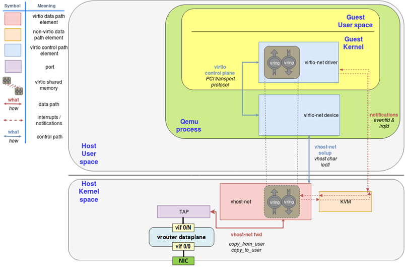

For more information on VirtIO :

* https://www.redhat.com/en/blog/introduction-virtio-networking-and-vhost-net
* https://www.redhat.com/en/blog/deep-dive-virtio-networking-and-vhost-net

==== DPDK

Data Plane Development Kit (DPDK) is a set of data plane libraries and network
interface controller drivers for fast packet processing, currently managed as
an open-source project under the Linux Foundation.

image::diagrams/extracted-media-ContrailPerformanceGuidev3.2.docx/media/image27.png[image,width=602,height=258]

The main goal of the DPDK is to provide a simple, complete framework for fast
packet processing in data plane applications.

The framework creates a set of libraries for specific environments through the
creation of an Environment Abstraction Layer (EAL), which may be specific to a
mode of the Intel® architecture (32-bit or 64-bit), Linux* user space compilers
or a specific platform.

These environments are created through the use of make files and configuration
files. Once the EAL library is created, the user may link with the library to
create their own applications.

The DPDK implements a "run to completion model" for packet processing, where all
resources must be allocated prior to calling Data Plane applications, running
as execution units on logical processing cores.

The model does not support a scheduler and all devices are accessed by polling.
The primary reason for not using interrupts is the performance overhead imposed
by interrupt processing.

For more information please refer to dpdk.org documents http://dpdk.org/doc/guides/prog_guide/index.html

===== DPDK memory management

With DPDK there is a direct link between application data stored in host memory
and the NIC memory used to transfer data onto the wire :

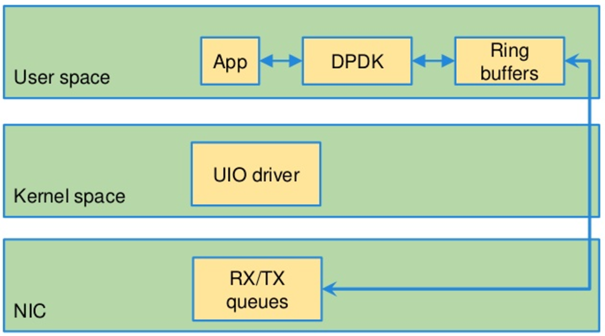

DPDK uses message buffers known as `mbufs` to store packet data into the host memory.
These `mbufs` are stored in memory pools known as `mempools`.
`Mempools` are set up as a `ring`, which creates a pool with a configuration
similar to a first-in, first-out (FIFO) system.

image::diagrams/extracted-media-ContrailPerformanceGuidev3.2.docx/media/image17.png[image,width=604,height=254]

`Rings descriptors` are managing data storage into mempools.
The more descriptors RX/TX rings are containing, the more memory size will be required in each mempool to store data.

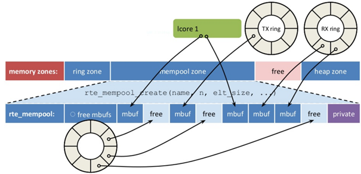

The Host OS exchanges packets with the NIC through the so called `rings`.  A
ring is a circular array of `descriptors` allocated by the OS in the system
memory (RAM). Each `descriptor` contains information about a packet that has been
received or that is going to be transmitted.

.Q&A
****
"ring" = "descriptor", seems like located on both cores or NIC? also see
<<vrouter DPDK fine tuning parameters>>

answer: Ring is a set of memory pointers (descriptors). These pointers are
pointing the real memory area in which the data to be processed (packets) are
stored.

There are 2 rings per “queues” (1 per direction:. 1 RX ring, 1 TX ring).

Data are stored in compute central memory (in huge page area). Packets are not
moved from one queue to another, but these are descriptors (pointers) that are
moving from one queue to another.
****

*[.underline]#RX ring#*

RX ring is managing Data transfer from NIC memory to host memory :

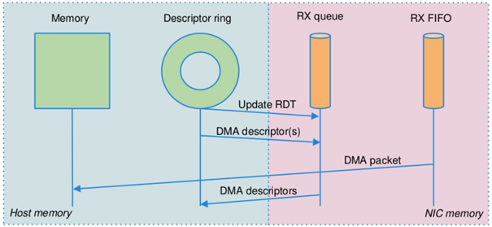

Synchronization between the OS and the NIC happens through two registers, whose
content is interpreted as an index in the RX ring:

- Receive Descriptor Head (RDH): indicates the first descriptor prepared by the
  OS that can be used by the NIC to store the next incoming packet.
- Receive Descriptor Tail (RDT): indicates the position to stop reception, i.e.
  the first descriptor that is not ready to be used by the NIC.

*[.underline]#TX ring#*

TX ring is managing data transfer from host memory to NIC memory :

image::diagrams/extracted-media-ContrailPerformanceGuidev3.2.docx/media/image14.png[image,width=605,height=279]

Synchronization between the host OS and the NIC happens through two registers,
whose content is interpreted as an index in the TX ring:

- Transmit Descriptor Head (TDH): indicates the first descriptor that has been
  prepared by the OS and has to be transmitted on the wire.
- Transmit Descriptor Tail (TDT): indicates the position to stop transmission,
  i.e. the first descriptor that is not ready to be transmitted, and that will
  be the next to be prepared.

*[.underline]#DMA#*

Direct Memory Access (DMA) allows PCI devices to read (write) data from (to)
memory without CPU intervention. This is a fundamental requirement for high
performance devices.

===== DPDK Poll Mode Drivers (PMD)

When DPDK is used, Network interfaces are no more managed in Kernel space.
Legacy NIC driver which is usually used to manage the NIC has to be replaced by
a new driver which is able to run into user space.  This new drive, called *Poll
Mode Driver (PMD)* will be used to manage the network interface into user space
with the DPDK library.

A Poll Mode Driver consists of APIs, provided through the BSD driver running in
user space, to configure the devices and their respective queues.
In addition, a PMD accesses the RX and TX descriptors directly without any
interrupts (with the exception of Link Status Change interrupts) to quickly
receive, process and deliver packets in the user’s application.

.NIC access path: dpdk vs kernel
image::https://user-images.githubusercontent.com/2038044/83194151-33d9aa00-a106-11ea-88f7-4cde53c601a8.png[]

* PMD used to manage physical interfaces :

    - I40e PMD for Intel X710/XL710/X722 10/40 Gbps family of adapters http://dpdk.org/doc/guides/nics/i40e.html
    - IXGBE PMD http://dpdk.org/doc/guides/nics/ixgbe.html
    - Linux bonding PMD http://dpdk.org/doc/guides/prog_guide/link_bonding_poll_mode_drv_lib.html

* PMD used to manage virtual interfaces :

    - Virtio PMD http://dpdk.org/doc/guides/nics/virtio.html

ping? "PMD user space process" vs. "pmd kernel drivers"
https://github.com/pinggit/dpdk-contrail-book/issues/1#issue-625774372

===== DPDK PMD Linux drivers

In Linux user space environment, the DPDK application runs as a user-space
application using the pthread library.

PCI information about devices and address space is discovered through the
`/sys` kernel interface and through kernel modules such as:

- uio_pci_generic,
- igb_uio or 
- vfio-pci

Different PMDs may require different kernel drivers in order to work properly.
Depending on the PMD being used, a corresponding kernel driver should be loaded
and bound to the network ports.  Before loading, make sure that each NIC has
been flashed with the latest version of NVM/firmware.

====== UIO

Supported NICs

- Intel http://dpdk.org/browse/dpdk/tree/drivers/net/e1000[[.underline]#igb#] (82575, 82576, 82580, I210, I211, I350, I354, DH89xx)
- Intel http://dpdk.org/doc/guides/nics/ixgbe.html[[.underline]#ixgbe#] (82598, 82599, X520, X540, X550)
- Intel http://dpdk.org/doc/guides/nics/i40e.html[[.underline]#i40e#] (X710, XL710, X722)

NOTE: RHEL does not support "*uio_pci_generic*" driver

To enable `igb_uio` driver change `physical_uio_driver` in
`/etc/contrail/contrail-vrouter-agent.conf` file and restart
`supervisor-vrouter`.

////
[cols="",]
|====
a|{empty}[DEFAULT]

physical_uio_driver=**igb_uio**
|====
////

[source, sh, linenums]
----
/etc/contrail/contrail-vrouter-agent.conf
[DEFAULT]
physical_uio_driver=igb_uio
----

====== VFIO

Supported NICs

- Intel http://dpdk.org/doc/guides/nics/i40e.html[[.underline]#i40e#] (X710, XL710, X722)

====== VFIO and IOMMU

Input–Output Memory Management Unit (IOMMU) is a memory management unit (MMU)
that connects a Direct Memory Access (DMA) capable I/O bus to the main memory.

In Virtualization, an IOMMU is re-mapping the addresses accessed by the
hardware into a similar translation table that is used to map guest-physical
address to host-physical addresses.

image::diagrams/extracted-media-ContrailPerformanceGuidev3.2.docx/media/image10.png[image,width=296,height=296]

IOMMU provides a short path for the guest to get access to the physical device
memory.  Intel has published a specification for IOMMU technology as
*Virtualization Technology for Directed I/O*, abbreviated as *VT-d*.

VFIO need to get IOMMU enabled :

- both kernel and BIOS must support and be configured to use IO virtualization (such as Intel® VT-d).
- IOMMU must be enabled into Linux Kernel parameters in `/etc/default/grub` and run `update-grub` command.

GRUB configuration example :

[cols="",]
|====
|GRUB_CMDLINE_LINUX_DEFAULT="*iommu=pt intel_iommu=on*"
|====

.VFIO can be also be used without IOMMU
While this is just as unsafe as using UIO, it does make it possible for the
user to keep the degree of device access and programming that VFIO has, in
situations where IOMMU is not available.

To enable vfio-pci driver change physical_uio_driver in
`/etc/contrail/contrail-vrouter-agent.conf` file and restart `supervisor-vrouter`.

    [DEFAULT]
    physical_uio_driver=**vfio-pci**

.Drivers features compatibility list

[cols=",,,,",options="header",]
|====
|                 |*RHEL DPDK*               |*Ubuntu DPDK*|*RHEL SRIOV (VF)**|*Ubuntu SRIOV (VF)**
|*igb_uio*        |No (no dkms support)      |Yes (dkms)   |No                |Yes
|*uio_pci_generic*|No (not supported by RHEL)|Yes          |No                |No
|*vfio_pci*       |Yes                       |Yes          |Yes               |Yes
|====

*vRouter in parallel with SRIOV (VF support on VM)

===== DPDK capable NICs

[cols=",,,,,",options="header",]
|====
|*NICs*                              |*Ubuntu - KVM*|*Ubuntu - DPDK*|*Redhat - KVM*|*Redhat - DPDK*|*vCenter - ESX*
|Intel 82599/X520 "Niantic" - 10G    |Yes           |Yes            |Yes           |Yes            |Yes
|Intel X710 "Fortville" - 10G/25G/40G|Yes           |Yes            |Yes           |Yes            |Not tested
|Broadcom bnxt 2x25G                 |Yes           |Yes            |Not tested    |Not tested     |Not tested
|Mellanox 2x25G                      |Yes           |Yes            |Not tested    |Not tested     |Not tested
|Netronome                           |3.1.x only    |No             |No            |No             |No
|====

These are the guidelines from Intel with regard to Intel NIC X710 (in order not
to bump into a known issue that impacts data plane)

- Do not use a single PCI NIC for non-DPDK and DPDK interfaces (having i40e
  kernel driver used together with i40e PMD driver for interfaces on the same
  PCI NIC cause problems)
- Upgrade NIC FW to 6.01 and i40e kernel driver to 2.4.6 (all necessary
  information you find in that document, table 9.
  https://www.intel.com/content/dam/www/public/us/en/documents/release-notes/xl710-ethernet-controller-feature-matrix.pdf
- LLDP is supported from 6.01 NIC FW but Intel also suggested to disable
  (`ethtool -set-priv-flags <interface name> disable-fw-lldp on`)

NOTE: If your server manufacturer has no support for the latest firmware please
contact him asap (i.e. The latest Lenovo server firmware includes 5.05 for X710
NICs)

* Redhat supports 1.6.27 i40 kernel driver version.
* Canonical supports 1.4.25 i40e kernel version.

<<<

=== hardware architecture 

==== NUMA

NUMA means Non-Uniform Memory Access systems

A traditional server has a single CPU, a single RAM and a single RAM controller.

A RAM can be made of several DIMM banks in several sockets, all being associated to the CPU.
When the CPU needs access to data in RAM, it requests it to its RAM controller.

Recent servers can have multiple CPUs, each one having its own RAM and its own RAM controller.
Such systems are called NUMA systems, or Non-Uniform Memory Access.
For example, in a server with 2 CPUs, each one can be a separate NUMA: NUMA0 and NUMA1.

.NUMA nodes architecture.
image::diagrams/extracted-media-ContrailPerformanceGuidev3.2.docx/media/image30.jpg[image,width=602,height=338]

- *In green*: CPU core accessing a memory item located in its own NUMA’s RAM controller, showing minimum latency.
- *In red*: CPU core accessing a memory item located in the other NUMA through
  the QPI (Quick Path Interconnect) path and the remote RAM controller, showing
  a higher latency.

When CPU0 needs to access data located in RAM0, it will go through its local RAM controller 0. 
Same thing happens for CPU1.

When CPU0 needs to access data located in the other RAM1, the first (local)
controller 0 has to go through the second (or remote) RAM controller 1 which
will access the (remote) data in RAM 1. Data will use an internal connection
between the 2 CPUs called QPI, or Quick Path Interconnect, which is typically
of a high enough capacity to avoid being a bottleneck, typically 1 or 2 times
25GBps (400 Gbps). For example the Intel Xeon E5 has 2 CPUs with 2 QPI links
between them; Intel Xeon E7 has 4 CPUs, with a single QPI between pairs of
CPUs.

////
* register     : superfast, takes no time
* cached memory: 7 - 30 cycles
* local RAM    : 170 cycles
* remote RAM   : 370 cycles
////

The fastest RAM that the CPU has access to is the register, which is inside the
CPU and reserved to it.

Beyond the register, the CPU has access to cached memory, which is a special
memory based on higher performance hardware.

Cached memory are shared between the cores of a single CPU.
Typical characteristics of memory cache are:

- Accessing a Level 1 cache takes 7 CPU cycles (with a size of 64KB or 128KB).
- Accessing a Level 2 cache takes 11 CPU cycles (with a size of 1MB).
- Accessing a Level 3 cache takes 30 CPU cycles (with a larger size).

If the CPU needs to access data that is in the main RAM, it has to use its RAM
controller.

Access to RAM takes then typically 170 CPU cycles (the green line in the
diagram). Access to the remote RAM through the remote RAM controller typically
adds 200 cycles (the red line in the diagram), meaning RAM latency is roughly
doubled.

When data needed by the CPU is located both in the local and in the remote RAM
with no particular structure, latency to access data can be unpredictable and
unstable.

==== Hyper-threading (HT)

A single physical CPU core with hyper-threading appears as two logical CPUs to
an operating system.

While the operating system sees two CPUs for each core, the actual CPU hardware
only has a single set of execution resources for each core.

Hyper-threading allows the two logical CPU cores to share physical execution
resources.

The sharing of resources allows two logical processors to work with each other
more efficiently, and allows a logical processor to borrow resources from a
stalled logical core (assuming both logical cores are associated with the same
physical core). Hyper-threading can help speed processing up, but it’s nowhere
near as good as having actual additional cores.

The performance of vRouter with *_sibling_* HT cores can increase by 10% to 20%
(result is based on performance tests described hereinafter).

==== Huge pages

Memory is managed in blocks known as pages.
On most systems, a page is 4Ki.
1Mi of memory is equal to 256 pages; 1Gi of memory is 256,000 pages, etc.
CPUs have a built-in memory management unit that manages a list of these pages in hardware.

The Translation Lookaside Buffer (TLB) is a small hardware cache of virtual-to-physical page mappings.
If the virtual address passed in a hardware instruction can be found in the TLB, the mapping can be determined quickly.
If not, a `TLB miss` occurs, and the system falls back to slower, software based address translation.
This results in performance issues.
Since the size of the TLB is fixed, the only way to reduce the chance of a TLB miss is to increase the page size.

Virtual memory address lookup slows down when the number of entries increases.

A huge page is a memory page that is larger than 4Ki.
In x86_64 architecture, in addition to *standard 4KB memory* page size, two larger page sizes are available: *2MB* and *1GB*.

Contrail DPDK vrouter can use both or only one huge page size.

==== hardware topology Discovery

Use `lstopo` (`hwloc-nox` package)and `numactl` commands to check cores numbering and numa nodes architecture

[source, sh, linenums]
----
(Ubuntu) # apt-get install hwloc
(RedHat) # yum install hwloc

# lstopo
Machine (252GB)
  NUMANode L#0 (P#0 126GB)
    Socket L#0 + L3 L#0 (30MB)
      L2 L#0 (256KB) + L1d L#0 (32KB) + L1i L#0 (32KB) + Core L#0
        PU L#0 (P#0)
        PU L#1 (P#24)
      L2 L#1 (256KB) + L1d L#1 (32KB) + L1i L#1 (32KB) + Core L#1
        PU L#2 (P#1)
        PU L#3 (P#25)
      L2 L#2 (256KB) + L1d L#2 (32KB) + L1i L#2 (32KB) + Core L#2
        PU L#4 (P#2)
        PU L#5 (P#26)
      L2 L#3 (256KB) + L1d L#3 (32KB) + L1i L#3 (32KB) + Core L#3
        PU L#6 (P#3)
        PU L#7 (P#27)
      L2 L#4 (256KB) + L1d L#4 (32KB) + L1i L#4 (32KB) + Core L#4
        PU L#8 (P#4)
        PU L#9 (P#28)
      L2 L#5 (256KB) + L1d L#5 (32KB) + L1i L#5 (32KB) + Core L#5
        PU L#10 (P#5)
        PU L#11 (P#29)
      L2 L#6 (256KB) + L1d L#6 (32KB) + L1i L#6 (32KB) + Core L#6
        PU L#12 (P#6)
        PU L#13 (P#30)
      L2 L#7 (256KB) + L1d L#7 (32KB) + L1i L#7 (32KB) + Core L#7
        PU L#14 (P#7)
        PU L#15 (P#31)
      L2 L#8 (256KB) + L1d L#8 (32KB) + L1i L#8 (32KB) + Core L#8
        PU L#16 (P#8)
        PU L#17 (P#32)
      L2 L#9 (256KB) + L1d L#9 (32KB) + L1i L#9 (32KB) + Core L#9
        PU L#18 (P#9)
        PU L#19 (P#33)
      L2 L#10 (256KB) + L1d L#10 (32KB) + L1i L#10 (32KB) + Core L#10
        PU L#20 (P#10)
        PU L#21 (P#34)
      L2 L#11 (256KB) + L1d L#11 (32KB) + L1i L#11 (32KB) + Core L#11
        PU L#22 (P#11)
        PU L#23 (P#35)
    HostBridge L#0
      PCIBridge
        PCI 103c:3239
          Block L#0 "sda"
          Block L#1 "sdb"
      PCIBridge
        PCI 8086:1572
          Net L#2 "t1a"
        PCI 8086:1572
          Net L#3 "t1b"
      PCIBridge
        PCI 8086:1572
          Net L#4 "t2a"
        PCI 8086:1572
          Net L#5 "t2b"
      PCIBridge
        PCI 102b:0533
      PCIBridge
        PCI 14e4:1657
          Net L#6 "meth0"
        PCI 14e4:1657
          Net L#7 "meth1"
        PCI 14e4:1657
          Net L#8 "eth4"
        PCI 14e4:1657
          Net L#9 "eth6"
  NUMANode L#1 (P#1 126GB) + Socket L#1 + L3 L#1 (30MB)
    L2 L#12 (256KB) + L1d L#12 (32KB) + L1i L#12 (32KB) + Core L#12
      PU L#24 (P#12)
      PU L#25 (P#36)
    L2 L#13 (256KB) + L1d L#13 (32KB) + L1i L#13 (32KB) + Core L#13
      PU L#26 (P#13)
      PU L#27 (P#37)
    L2 L#14 (256KB) + L1d L#14 (32KB) + L1i L#14 (32KB) + Core L#14
      PU L#28 (P#14)
      PU L#29 (P#38)
    L2 L#15 (256KB) + L1d L#15 (32KB) + L1i L#15 (32KB) + Core L#15
      PU L#30 (P#15)
      PU L#31 (P#39)
    L2 L#16 (256KB) + L1d L#16 (32KB) + L1i L#16 (32KB) + Core L#16
      PU L#32 (P#16)
      PU L#33 (P#40)
    L2 L#17 (256KB) + L1d L#17 (32KB) + L1i L#17 (32KB) + Core L#17
      PU L#34 (P#17)
      PU L#35 (P#41)
    L2 L#18 (256KB) + L1d L#18 (32KB) + L1i L#18 (32KB) + Core L#18
      PU L#36 (P#18)
      PU L#37 (P#42)
    L2 L#19 (256KB) + L1d L#19 (32KB) + L1i L#19 (32KB) + Core L#19
      PU L#38 (P#19)
      PU L#39 (P#43)
    L2 L#20 (256KB) + L1d L#20 (32KB) + L1i L#20 (32KB) + Core L#20
      PU L#40 (P#20)
      PU L#41 (P#44)
    L2 L#21 (256KB) + L1d L#21 (32KB) + L1i L#21 (32KB) + Core L#21
      PU L#42 (P#21)
      PU L#43 (P#45)
    L2 L#22 (256KB) + L1d L#22 (32KB) + L1i L#22 (32KB) + Core L#22
      PU L#44 (P#22)
      PU L#45 (P#46)
    L2 L#23 (256KB) + L1d L#23 (32KB) + L1i L#23 (32KB) + Core L#23
      PU L#46 (P#23)
      PU L#47 (P#47)
----

[source, sh, linenums]
----
(Ubuntu) # apt-get install numactl
(RedHat) # yum install numactl

# numactl --hardware
available: 2 nodes (0-1)
node 0 cpus: 0 1 2 3 4 5 6 7 8 9 10 11 24 25 26 27 28 29 30 31 32 33 34 35
node 0 size: 128811 MB
node 0 free: 89428 MB
node 1 cpus: 12 13 14 15 16 17 18 19 20 21 22 23 36 37 38 39 40 41 42 43 44 45 46 47
node 1 size: 129019 MB
node 1 free: 92592 MB
node distances:
node   0   1
  0:  10  21
  1:  21  10

# lscpu | grep NUMA
NUMA node(s):          2
NUMA node0 CPU(s):     0-11,24-35
NUMA node1 CPU(s):     12-23,36-47
----

To check NIC assignment to NUMA node.

    # cat /sys/class/net/eth0/device/numa_node
    0

TIP: We recommend assigning the Cores (real and sibling/hyperthreaded) to the same
NUMA as the NIC(s).

Use `lspci` command to find PCI addresses of NICs that will be bound to DPDK process

[source, sh, linenums, subs="quotes"]
----
# lspci | grep Ethernet
02:00.0 Ethernet controller: Broadcom Corporation NetXtreme BCM5719 Gigabit Ethernet PCIe (rev 01)
02:00.1 Ethernet controller: Broadcom Corporation NetXtreme BCM5719 Gigabit Ethernet PCIe (rev 01)
02:00.2 Ethernet controller: Broadcom Corporation NetXtreme BCM5719 Gigabit Ethernet PCIe (rev 01)
02:00.3 Ethernet controller: Broadcom Corporation NetXtreme BCM5719 Gigabit Ethernet PCIe (rev 01)
*05:00.0 Ethernet controller: Intel Corporation Ethernet Controller X710 for 10GbE SFP+ (rev 01)*
*05:00.1 Ethernet controller: Intel Corporation Ethernet Controller X710 for 10GbE SFP+ (rev 01)*
*0b:00.0 Ethernet controller: Intel Corporation Ethernet Controller X710 for 10GbE SFP+ (rev 01)*
*0b:00.1 Ethernet controller: Intel Corporation Ethernet Controller X710 for 10GbE SFP+ (rev 01)*
----

Use `dpdk_nic_bind.py` command to verify proper binding of NICs to DPDK

    sudo /opt/contrail/bin/dpdk_nic_bind.py -s

.lab capture

****

.hwloc-ls GUI from 3.2 lab [[hwloc-ls]]
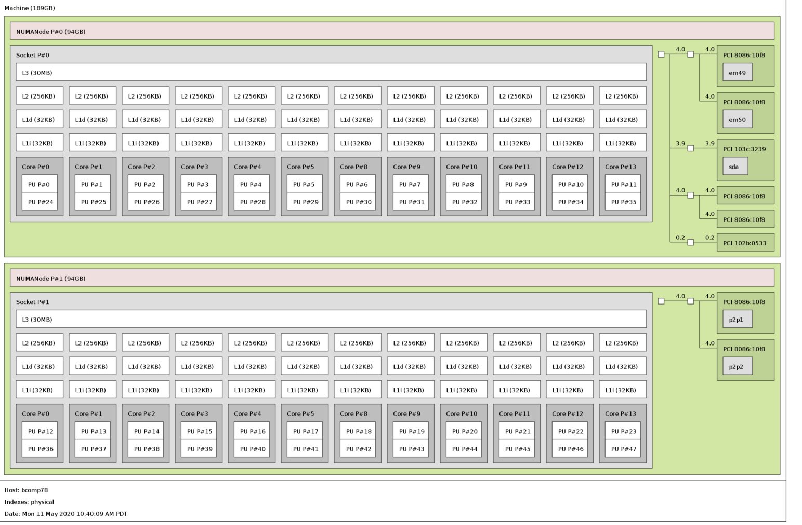

.3.2 lab

[source, sh, linenums]
----
$ lstopo
Machine (189GB)
  NUMANode L#0 (P#0 94GB)
    Socket L#0 + L3 L#0 (30MB)
      L2 L#0 (256KB) + L1d L#0 (32KB) + L1i L#0 (32KB) + Core L#0
        PU L#0 (P#0)
        PU L#1 (P#24)
      L2 L#1 (256KB) + L1d L#1 (32KB) + L1i L#1 (32KB) + Core L#1
        PU L#2 (P#1)
        PU L#3 (P#25)
      L2 L#2 (256KB) + L1d L#2 (32KB) + L1i L#2 (32KB) + Core L#2
        PU L#4 (P#2)
        PU L#5 (P#26)
      L2 L#3 (256KB) + L1d L#3 (32KB) + L1i L#3 (32KB) + Core L#3
        PU L#6 (P#3)
        PU L#7 (P#27)
      L2 L#4 (256KB) + L1d L#4 (32KB) + L1i L#4 (32KB) + Core L#4
        PU L#8 (P#4)
        PU L#9 (P#28)
      L2 L#5 (256KB) + L1d L#5 (32KB) + L1i L#5 (32KB) + Core L#5
        PU L#10 (P#5)
        PU L#11 (P#29)
      L2 L#6 (256KB) + L1d L#6 (32KB) + L1i L#6 (32KB) + Core L#6
        PU L#12 (P#6)
        PU L#13 (P#30)
      L2 L#7 (256KB) + L1d L#7 (32KB) + L1i L#7 (32KB) + Core L#7
        PU L#14 (P#7)
        PU L#15 (P#31)
      L2 L#8 (256KB) + L1d L#8 (32KB) + L1i L#8 (32KB) + Core L#8
        PU L#16 (P#8)
        PU L#17 (P#32)
      L2 L#9 (256KB) + L1d L#9 (32KB) + L1i L#9 (32KB) + Core L#9
        PU L#18 (P#9)
        PU L#19 (P#33)
      L2 L#10 (256KB) + L1d L#10 (32KB) + L1i L#10 (32KB) + Core L#10
        PU L#20 (P#10)
        PU L#21 (P#34)
      L2 L#11 (256KB) + L1d L#11 (32KB) + L1i L#11 (32KB) + Core L#11
        PU L#22 (P#11)
        PU L#23 (P#35)
    HostBridge L#0
      PCIBridge
        PCI 8086:10f8
          Net L#0 "em49"
        PCI 8086:10f8
          Net L#1 "em50"
      PCIBridge
        PCI 103c:3239
          Block L#2 "sda"
      PCIBridge
        PCI 8086:10f8
          Net L#3 "p1p1"
        PCI 8086:10f8
      PCIBridge
        PCI 102b:0533
  NUMANode L#1 (P#1 94GB)
    Socket L#1 + L3 L#1 (30MB)
      L2 L#12 (256KB) + L1d L#12 (32KB) + L1i L#12 (32KB) + Core L#12
        PU L#24 (P#12)
        PU L#25 (P#36)
      L2 L#13 (256KB) + L1d L#13 (32KB) + L1i L#13 (32KB) + Core L#13
        PU L#26 (P#13)
        PU L#27 (P#37)
      L2 L#14 (256KB) + L1d L#14 (32KB) + L1i L#14 (32KB) + Core L#14
        PU L#28 (P#14)
        PU L#29 (P#38)
      L2 L#15 (256KB) + L1d L#15 (32KB) + L1i L#15 (32KB) + Core L#15
        PU L#30 (P#15)
        PU L#31 (P#39)
      L2 L#16 (256KB) + L1d L#16 (32KB) + L1i L#16 (32KB) + Core L#16
        PU L#32 (P#16)
        PU L#33 (P#40)
      L2 L#17 (256KB) + L1d L#17 (32KB) + L1i L#17 (32KB) + Core L#17
        PU L#34 (P#17)
        PU L#35 (P#41)
      L2 L#18 (256KB) + L1d L#18 (32KB) + L1i L#18 (32KB) + Core L#18
        PU L#36 (P#18)
        PU L#37 (P#42)
      L2 L#19 (256KB) + L1d L#19 (32KB) + L1i L#19 (32KB) + Core L#19
        PU L#38 (P#19)
        PU L#39 (P#43)
      L2 L#20 (256KB) + L1d L#20 (32KB) + L1i L#20 (32KB) + Core L#20
        PU L#40 (P#20)
        PU L#41 (P#44)
      L2 L#21 (256KB) + L1d L#21 (32KB) + L1i L#21 (32KB) + Core L#21
        PU L#42 (P#21)
        PU L#43 (P#45)
      L2 L#22 (256KB) + L1d L#22 (32KB) + L1i L#22 (32KB) + Core L#22
        PU L#44 (P#22)
        PU L#45 (P#46)
      L2 L#23 (256KB) + L1d L#23 (32KB) + L1i L#23 (32KB) + Core L#23
        PU L#46 (P#23)
        PU L#47 (P#47)
    HostBridge L#5
      PCIBridge
        PCI 8086:10f8
        PCI 8086:10f8
          Net L#4 "p2p2"
----

.2003 lab
[source, sh, linenums]
----
[root@overcloudjcx-compdpdk1hw0-0 heat-admin]# lspci | grep Ether
19:00.0 Ethernet controller: Intel Corporation Ethernet Controller X710 for 10GbE SFP+ (rev 02)
19:00.1 Ethernet controller: Intel Corporation Ethernet Controller X710 for 10GbE SFP+ (rev 02)
19:00.2 Ethernet controller: Intel Corporation Ethernet Controller X710 for 10GbE SFP+ (rev 02)
19:00.3 Ethernet controller: Intel Corporation Ethernet Controller X710 for 10GbE SFP+ (rev 02)
3b:00.0 Ethernet controller: Intel Corporation I350 Gigabit Network Connection (rev 01)
3b:00.1 Ethernet controller: Intel Corporation I350 Gigabit Network Connection (rev 01)

[root@overcloudjcx-compdpdk1hw0-0 heat-admin]# docker exec -it contrail-vrouter-agent-dpdk /opt/contrail/bin/dpdk_nic_bind.py -s

Network devices using DPDK-compatible driver
============================================
0000:19:00.0 'Ethernet Controller X710 for 10GbE SFP+' drv=vfio-pci unused=i40e
0000:19:00.1 'Ethernet Controller X710 for 10GbE SFP+' drv=vfio-pci unused=i40e

Network devices using kernel driver
===================================
0000:19:00.2 'Ethernet Controller X710 for 10GbE SFP+' if=em3 drv=i40e unused=vfio-pci
0000:19:00.3 'Ethernet Controller X710 for 10GbE SFP+' if=em4 drv=i40e unused=vfio-pci
0000:3b:00.0 'I350 Gigabit Network Connection' if=p1p1 drv=igb unused=vfio-pci *Active*
0000:3b:00.1 'I350 Gigabit Network Connection' if=p1p2 drv=igb unused=vfio-pci

Other network devices
=====================
<none>
----
****

==== Physical CPU cores allocation planning

When planning physical CPU cores allocation, the following aspects need to be
taken into account:

- hyperthreading enabled or not
- numa topology
- number of cores assigned to vrouter for 2 kinds of tasks:
  * forwarding threads (packet processing purpose)
  * control and service threads (vrouter management purpose)
- number of cores left for system processes
- number of cores allocated to VMs

WARNING: A proper definition and configuration of CPU partitioning is key for
optimal performance.  A bogus implementation is indeed the main source of
transient packet drops even at moderate throughput.

==== Hyper Threading

If HT (Hyper Threading) is enabled, the first half of each numa node core are
physical cores, and the second half their HT sibling.

//ping: see <<hwloc-ls, hwloc-ls GUI>>

The best way to utilize all cores in the system, especially when using
`hw:cpu_policy=dedicated` (see <<CPU isolation mechanisms>>) is to
*use both siblings when calculating mask for vrouter (and other resources line
systemd)*. In that case, both siblings for each core used for VM pinning can be
utilized.

With OpenStack, Having a core without its sibling listed in `vcpu_pin_set`
variable in `nova.conf` file and `hw:cpu_policy=dedicated` set in flavor
properties used to spawn an instance leads to a scheduling error (variable
`sibling_set` referenced before assignment).

.Q&A
****
Question: shouldn't disabling HT archive max perf?

Answer: HT matter is not a yes or no answer. It depends …

First, things to consider … HT has been created to improve hardware use
efficiency. Idea is, we are creating “two virtual CPU” on a single Hardware
CPU. It improve Physical CPU usage as the the second virtual CPU can use the
physical resource when the first one is sleeping (like VM usage is improving
Physical BM utilization). As the main DPDK principle is to never let a CPU to
sleep … we should answer no !!!

But, from the customer perspective which is using Bare Metal Compute to run VM,
his answer is YES, I want it !!!

So, in general every customer is enabling HT on his servers. So, the question
is: for vrouter needs, will we recommend to use only one “logical CPU” per
physical CPU ?

Or do we recommend to use both (aka siblings) on physical CPU ?

Here, again the answer is not so clear, and can’t be Yes or No.

Refer to this section: *_Last step: sibling consideration_*

_[.underline]#Two (simplified) situations#_:

. highest throughput is expected and number VM per compute is no the first
  criteria, do not use siblings
. VM per compute is the first criteria. An average DPDK vrouter performance is
  largely enough, let's use siblings
****

==== CPU isolation mechanisms

- Tasks to be run by an operating system must be spread across available CPUs.
- These tasks into a multi-threading environment are often made of several
  processes which are also made of several threads.
- In order to run all these processes and threads on the CPU offered by the
  node, the Operating System is using a scheduler to place each single one onto
  a given CPU.
- There are two styles of scheduling, `cooperative` and `preemptive`.
- By default, RedHat Linux is using a `cooperative` mode

//ping: https://draveness.me/system-design-scheduler/
//.ping: regarding preemptive and cooperative
//image::diagrams/preemptive-scheduling.png[]
//image::diagrams/cooperative-scheduling.png[]
//https://medium.com/traveloka-engineering/cooperative-vs-preemptive-a-quest-to-maximize-concurrency-power-3b10c5a920fe

In order to get a CPU booked for a subset of tasks, we have to inform the
Operating System scheduler not to use these CPUs for all the tasks it has to
run.

These CPUs are told: `"isolated"` because they are no more used to process all tasks.
In order to get a CPU isolated several mechanisms can be used:

- remove this CPU from the "common" CPU list used to process all tasks
- change the scheduling algorithm (cooperative to preemptive)
- participate or not to interrupt processing

RedHat Linux is currently supporting 2 different CPU isolation methods.
They are `isolcpus` and `tuned CPU partitioning`, They can be used either
independently or simultaneously.

.*isolcpus*
A first method, *isolcpus* kernel parameter, has been proposed to keep CPUs
away from linux scheduler. This isolation mechanism will:

- remove isolated CPUs from the "common" CPU list used to process all tasks
- change the scheduling algorithm from `cooperative` to `preemptive`
- perform CPU isolation at the *system boot*

The main drawbacks of using `isolcpus` are :

- it requires manual placement of processes on isolated cpus.
- it is not possible to re-arrange the CPU isolation rules after the system startup
- it is not possible to move process from one isolated cpu to another.

.*tuned CPU partitioning*
A second method, *tuned CPU partitioning*, has been proposed more recently.
since almost all processes are started by `systemd`, physical CPU cores
assignment can be configured in a different way:

- `CPUAffinity` parameter in `/etc/systemd/system.conf`; 
  it will restrict all processes spawned by `systemd` to the list of cores.
- `isolated_cores`: is removing a set of CPU from the "common" CPU list used to
  process all tasks

NOTE: from RHEL 7.5, `CPUAffinity` is natively integrated in *tuned’s
cpu-partitioning profile*.

This isolation mechanism will:

- remove isolated CPUs from the "common" CPU list used to process all tasks
- perform CPU isolation after the system boot using systemd.

The main drawbacks of using `tuned partitioning` are :

- Some processes are started at the system boot before systemd is started.
  These processes are run before isolation rules are enforced and could break
  expected isolation rules.
- Scheduling Algorithm is kept to `cooperative` mode which provides a lower isolation.

In few words, `tuned partitioning` is more flexible and featureful than isolcpus,
but is providing a lower CPU isolation.
This is why both mechanisms are often used altogether to enforce CPU isolation.

IMPORTANT: if both tuned CPU partitioning profiles and isolcpus mechanisms are
used, *be careful to be consistent* in the defined setup.

.Q&A
****
Question: talk about both algorithm.

Answer:

First, we have to override this is RedHat specific. Ubuntu is using only one mechanism.

Second (not for the book), but this is not so clear on RedHat side. First idea
was that new tuned partitioning will replace isolcpus historical mechanism.

But today this is not so clear on Redhat side, and they recommend to use both !!!.

Mainly because isolcpus is changing the scheduling algorithm from cooperative
to preemptive, so it is more efficient for isolation.

This is why in my opinion we have to explain that:

- two mechanisms are proposed by redhat

- describe each one (how to configure it, what it does)

- explain we are recommending to use both of them to have the better CPU isolation as possible
****

===== isolcpus mechanism configuration

WARNING: before Contrail 20.03 release, it is not recommended to use such an
isolation method.  If used some packet drops could randomly occur and vrouter
performances are not stable.

[qanda]
====
question: explain why?

A (LD): For a lot of complex reason hard to explain. One of them (easiest to
understand) is:

because before 20.03 we were not offering an ability to pin correctly service
threads.

when we were enforcing a too strict CPU isolation service threads were sometime
using vrouter allocated polling and processing CPUs.

Since 20.03 we are proposing a setup in which:

- vrouter processing CPUs are assigned to well defined CPU list
- vrouter control and service CPUs are assigned to another well defined CPU list

OpenStack is providing a mechanism to assign a well defined CPU list to Virtual
Instances

Consequently at system level we can enforce a strict isolation to remove
vrouter and openstack assigned CPU to the "common" pool.

A small common pool is kept for Operating System usage (in a shart Hypervisor
needs)

*To be supplemented by Kiran and Premecz.*
====

*_isolcpus_* is a kernel parameter. It has to be provisioned at the system
startup.  GRUB configuration has to be modified in order to take into
consideration a new set of isolated CPU, and then, the system has to be
restarted.

[source, sh, linenums]
----
$ vi /etc/default/grub
GRUB_CMDLINE_LINUX="console=tty0 console=ttyS0,115200n8 crashkernel=auto rhgb quiet default_hugepagesz=1GB hugepagesz=1G hugepages=28 iommu=pt intel_iommu=on isolcpus=7,9-35,43,45-71"
$ grub2-mkconfig -o /etc/grub2.cfg
----

When `TripleO` is used for Contrail and OpenStack installation, this grub
configuration update is automatically done, using
`TRIPLEO_HEAT_TEMPLATE_KERNEL_ARGS` environment variable to define `isolcpus`
value.

For instance :

    TRIPLEO_HEAT_TEMPLATE_KERNEL_ARGS: "isolcpus=7,9-35,43,45-71"

.Q&A
****
question: here it should be `=` instead of `:`?

    TRIPLEO_HEAT_TEMPLATE_KERNEL_ARGS: "isolcpus=7,9-35,43,45-71"

Because, this variable content will be added to GRUB “command line” which is
using shell like syntax.
****

.lab capture (3.2 no isolcpus)
****
[source, sh, linenums]
----
[2020-05-12 12:47:43]root@bcomp78:~
$ cat /etc/default/grub | grep iso
----

[source, sh, linenums]
----
[root@overcloudmz5-compdpdk-3 ~]# cat /etc/default/grub | grep iso
TRIPLEO_HEAT_TEMPLATE_KERNEL_ARGS=" default_hugepagesz=1GB hugepagesz=1G hugepages=64 hugepagesz=2M hugepages=8192 isolcpus=1-9,11-19,21-29,31-39"
#TRIPLEO_HEAT_TEMPLATE_KERNEL_ARGS=" default_hugepagesz=1GB hugepagesz=1G hugepages=64 hugepagesz=2M hugepages=8192 isolcpus=5-9,11-19,25-29,31-39"
#TRIPLEO_HEAT_TEMPLATE_KERNEL_ARGS=" default_hugepagesz=1GB hugepagesz=1G hugepages=64 hugepagesz=2M hugepages=8192 isolcpus=5,8-9,11-19,25,28-29,31-39"
----
****

===== Tuned CPU partitioning configuration

Tuned cpu partitioning has to be installed onto the system:

    yum install tuned-profiles-cpu-partitioning

Tuned is using CPU isolation information defined into
`cpu-partitioning-variables.conf and into system.conf`:

[source, sh, linenums]
----
/etc/tuned/cpu-partitioning-variables.conf
isolated_cores=7,9-35,43,45-71

/systemd/system.conf
CPUAffinity=0-6,8,36-42,44
----

Tuned is not setting `isolcpus` Kernel value, but `tuned.non_isolcpus`.

.lab capture
****
[source, sh, linenums]
----
[root@overcloudmz5-compdpdk-3 ~]# cat /etc/systemd/system.conf | grep CPU
#CPUAffinity=1 2
#DefaultCPUAccounting=no
#DefaultLimitCPU=
CPUAffinity=0 10 20 30  #<---systemd processes will use these CPUs only

[root@overcloudmz5-compdpdk-3 ~]# cat /etc/tuned/cpu-partitioning-variables.conf
# Examples:
# isolated_cores=2,4-7
isolated_cores=1-9,11-19,21-29,31-39    #<---
#
# To disable the kernel load balancing in certain isolated CPUs:
# no_balance_cores=5-10
----
****

=== other hardware acceleration technologies

==== sriov
==== smartnic
==== vDPA
==== eBPF

== chapter 2: SDN dataplane fundamentals (first draft)

=== Virtualization concepts

==== Server virtualization

_Kernel-based Virtual Machine_ (KVM) is an open source virtualization technology
built into Linux. It provides hardware assist to the virtualization software,
using built-in CPU virtualization technology to reduce virtualization overheads
(cache, I/O, memory) and improving security.

_QEMU_ is a hosted virtual machine emulator that provides a set of different
hardware and device models for the guest machine. For the host, QEMU appears as
a regular process scheduled by the standard Linux scheduler, with its own
process memory. In the process, QEMU allocates a memory region that the guest
sees as physical and executes the virtual machine’s CPU instructions._

With KVM, QEMU can just create a virtual machine with virtual CPUs (vCPUs) that
the processor is aware of, that runs native-speed instructions. When a special
instruction is reached by KVM, like the ones that interacts with the devices or
to special memory regions, vCPU pauses and informs QEMU of the cause of pause,
allowing hypervisor to react to that event.

LibVirt is an Open Source toolkit to manage virtualization platforms. Libvirt
is collection of softwares which allow to manage virtual machines and other
virtualization functionality, such as storage and network interface management.
LibVirt is proposing to define virtual components in a XML-formatted
configurations, that are able to be translated into QEMU command line.

==== Inter Process Communication

Inter process communication (IPC) is a mechanism which allows processes to
communicate with each other and synchronize their actions. The communication
between these processes can be considered as a method of cooperation between
them.

IPC is used in network virtualization in order to be able to exchange data
between different distributed processes of a same application (virtio frontend
and backend, contrail vrouter agent and dataplane) or between processes of
distinct applications (contrail vrouter and QEMU virtio, virtio and VFIO)

Two different modes of communication are used for IPC:

* *Shared Memory*: processes are reading and writing information into shared
  memory region.
* *Message Passing*: processes are establishing a communication link which will
  be used to exchange messages.

===== Shared Memory

_Following scenario is used when shared memory is used for IPC:_

* _First, a shared memory area is defined (shmget) with a key identifier known by processes involved into the communication._
* _Second, processes are attaching (shmat) to the shared memory and are retrieving a memory pointer._
* _Then, processes are reading or writing information in the shared memory using the shared memory pointer (read/write operation)._
* _Next, processes are detaching from the shared memory (shmdt)_
* _Last, the shared memory area is freed (shmctl)_

_Following system calls are used in shared memory IPC:_

* _*shmget*: create the shared memory segment or use an already created shared memory segment._
* _*shmat*: attach the process to the already created shared memory segment._
* _*shmdt*: detach the process from the already attached shared memory segment._
* _*shmctl*: control operations on the shared memory segment (set permissions, collect information)._

===== Message passing

_Several message passing methods are available to exchange data information between processes:_

* _*eventfd:* is a system call that creates an "eventfd object" (64-bit integer). It can be used as an event wait/notify mechanism by user-space applications, and by the kernel to notify user-space applications of events._
* _*pipe (and named pipe)* are unidirectional data channel. Data written to the write-end of the pipe is buffered by the operating system until it is read from the read-end of the pipe._
* _*Unix Domain Socket*: domain sockets use the file system as their address space. Processes reference a domain socket as an inode, and multiple processes can communicate using a same socket. The server of the communication binds a Unix socket to a path in the file system, so a client can connect to it using that path._

_There are some other mechanisms that can be used by processes to exchange messages (shared file, message queues, network sockets, and signals system calls) and are not described in this document._

_ +
_

==== Network device Architecture and concepts

===== Control and Data paths

Two different flows are used by a network application using a NIC device:

* *Control*: manages configuration changes (activation/deactivation) and
  capability negotiation (speed, duplex, buffer size) between the NIC and
  network application for establishing and terminating the data path on which
  data packets will be transferred.

* *Data*: performs data packets transfer between NIC and network application.
  Packet are transferred from NIC internal buffer to a host memory area which is
  reachable by the network application.

_Each flow is using a well-defined path:_

* _control path_
* _data path_

_ +
_

===== Event versus polling based packet processing

_Linux network stack is using an event-based packet processing method. In such a method every incoming packet hitting the NIC:_

* _is copied in host memory via DMA_
* _then the NIC generates an interrupt._
* _then a Kernel module is placing the packet into a “socket buffer”_
* _application runs a “read” system call_

_for every egress packet generated by the network application:_

* {blank}
+
____
_application performs a write call on the socket in order to copy the generated packet from the applications user space a socket buffer_
____
* {blank}
+
____
_Kernel device driver invokes the NIC DMA engine to transmit the frame onto the wire._
____
* {blank}
+
____
_Once transmission is complete, the NIC raises an interrupt to signal transmit completion in order to get socket buffer memory freed._
____

_This method is not efficient when packets are hitting the NIC at a high packet rate. Lots of interrupts are generated, creating lots of context switching (kernel to user and vice-versa)._

[cols=",",]
|===
|_Event based packet processing_ |_polling based packet processing_
|===

_Polling based packet processing is an alternate method (it is used by DPDK). All incoming packets are copied transparently (without generating any interrupt) by the NIC into a specific host memory area region (predefined by the application). At a regular pacing, the network application is reading (polling) packets stored into this memory area._

_On the opposing direction, the network application is writing packet into the shared memory area region. A DMA transfer is triggered to copy the packet from the host memory to the NIC card buffers._

_No interrupt is used with this method, but it requires network application to check at a regular pacing whether a new packet has hit the NIC. This method is well suited for high rate packet processing: If packets are arriving at a slow rate this algorithm is less efficient as the event based one._

==== Network devices virtualization

_Like CPU virtualization, two kinds of methods are used to virtualize network devices:_

* _Software-Based Emulation._
* _Hardware-assisted Emulation._

_Software Based Emulation are widely supported but can suffer of poor performance. Hardware assisted Emulation if providing good performance thanks to hardware acceleration, but it requires to use a hardware that supports some specific features._

===== Software-Based Emulation.

_Two solutions are proposed for device virtualization with software:_

* _*Traditional Device Emulation* (Binary Translation): the guest device drivers are not aware of the virtualization environment. During runtime, the Virtual Machine Manager (VMM), usually QEMU/KVM, will trap all the IO and Memory-mapped I/O (MMIO) accesses and emulate the device behavior (trap and emulate mechanism). +
The Virtual Machine Manager (VMM) emulates the I/O device to ensure compatibility and then processes I/O operations before passing them on to the physical device (which may be different). Lots of VMEXIT (context switching) are generated with this method. It provides poor performance._
* _*Paravirtualized Device Emulation* (virtio): the guest device drivers are aware of the virtualization environment. This solution uses a front-end driver in the guest that works in concert with a back-end driver in the Virtual Machine Manager (VMM). These drivers are optimized for sharing and have the benefit of not needing to emulate an entire device. The back-end driver communicates with the physical device. Performance are much better than with Traditional Device Emulation._

_Software emulated devices can be completely virtual with no physical counterpart or physical ones exposing a compatible interface._

===== Hardware-assisted Emulation.

_Two solutions are proposed for device virtualization assisted with hardware:_

* _*Direct Assignment*: allows a VM to access directly to a network device. Thus the guest device drivers can directly access the device configuration space to, e.g., launch a DMA operation in a safe manner, via IOMMU. +
[.underline]#Drawbacks#:_

* _direct assignment has limited scalability. A physical device can only be assigned to one single VM._
* _IOMMU must be supported by the host CPU (Intel VT-d or_ AMD-Vi _feature)_.

* _*SR-IOV*: with SR-IOV, each physical device (physical function) can appear as multiple virtual ones (aka virtual function). Each virtual function can be directly assigned to one VM, and this direct assignment is using the vt-d/IOMMU feature._
* _[.underline]#Drawbacks#:_

* _IOMMU must be supported by the host CPU (Intel VT-d or_ AMD-Vi _feature)_.
* _SR-IOV must be supported by the NIC device (but also by the BIOS and the host OS)._

==== Emulated network devices

_The following two emulated network devices are provided with QEMU/KVM:_

* _*e1000* device: emulates an Intel E1000 network adapter (Intel 82540EM, 82573L, 82544GC)._
* _*rtl8139* device: emulates a Realtek 8139 network adapter._

==== Paravirtualized network device

_Virtio is an open specification for virtual machines' data I/O communication, offering a straightforward, efficient, standard and extensible mechanism for virtual devices, rather than boutique per-environment or per-OS mechanisms. It uses the fact that the guest can share memory with the host for I/O to implement that._

Virtio was developed as a standardized open interface for virtual machines (VMs) to access simplified devices such as block devices and network adaptors.

===== Virtio frontend and backend

VirtIO interface is made of backend component and a frontend component:

* The frontend component is the guest side of the virtio interface
* The backend component is the host side of the virtio interface

===== Virtio transport protocol

virtio network driver is the VirtIO frontend component exposed into the guest VM

virtio network device is the VirtIO backend component exposed by the hypervisor.

Virtual Network frontend and backends are interconnected with a transport protocol (usually PCI/PCIe).

The virtio drivers must be able to allocate memory regions that both the hypervisor and the devices can access for reading and writing, via memory sharing. Two different domains have to be considered for a network device:

* virtio device initialization, activation or shutdown (control plane)
* network packets transfer through the virtio device (data plane)

_Control plane_ is used for capability exchange negotiation between the host and guest both for establishing and terminating the data plane. _Data plane_ is used for transferring the actual packets between host and guest.

_Virtqueues_ are the mechanism for bulk data transport on virtio devices. They are composed of:

* guest-allocated buffers that the host interacts with (read/write packets)
* descriptor rings

Virqueues are controlled with I/O Registers notification messages:

* _Available Buffer Notification_: virtio driver notifies there are buffers that are ready to be processed by the device.
* _Used Buffer Notification_: virtio device notifies it has finished processing some buffers.

===== Virtio device network backend

The network backend that interacts with the emulated NIC and which is exposed on the host side. Usually network backend is a _tap_ device. But other backends are proposed with VirtIO (SLIRP, VDE, Socket)

tap devices are virtual point-to-point network devices that the userspace applications can use to exchange L2 packets. Tap devices are requiring tun kernel module to be loaded. Tun kernel modules create a kind of device in /dev/net system directory tree (/dev/net/tun).

Each new tap device has a name in the /dev/net/tree filesystem.

===== Virtio net backend drawbacks

The usual transport backend used by virtio net device is presenting some inefficiencies:

* syscall and data copy are required for each packet to send or receive through the tap interface (no bulk transfer mode).
* virtio driver (front end) notifies there are one available packet for the virtio device (backend) with an interrupt messages (IOCTL)
* each interrupt message stops vCPU execution and generate a context switch (vmexit). Then the host processes the available packet and resume (vmexit) the VM execution using a syscall.

Each time a packet is sent, the VM stops to work to get the available packet processed.

Hypervisor is involved in both virtio control plane and data plane.

===== vhost protocol

vhost protocol was designed in order to address virtio device usual transport backend limitations. It's a message-based protocol which allows the hypervisor to offload the data plane to a handler. The handler is a component which manage virtio data forwarding. The host hypervisor is no longer process packets.

The dataplane is fully offloaded to the handler that reads or writes packets to/from the virtqueues. vhost handler direclty access the virtqueues memory region as well as send and receive notification messages.

vhost handler is made up of two parts:

* _vhost-net_

* a kernel driver
* it exposes a character device on /dev/vhost-net
* uses ioctls to exchange vhost messages (vhost protocol control plane),
* uses irqfd and ioeventfd file descriptor to exchange notifications with the guest.
* spawns a vhost worker thread

* _vhost worker_

* a linux thread named _vhost-<pid>_ (<pid> is the hypervisor process ID)
* handles the I/O events (generated by virtio driver or tap device)
* forwards packets (copy operations)

A tap device is still used to communicate the guest instance with the host, but the virtio dataplane is managed by vhost handler and is no more processed by the hypervisor.

Guest instances is no more stopped (context switch with a VMEXIT) at each VirtIO packet transfer.

New virtio _vhost-net_ packet processing backend use is completely transparent to the guest who still uses the standard virtio interface.

==== Physical network device Direct I/O Assignment

KVM guests usually have access to software based emulated NIC device (either para-virtualized devices with virtio or traditional emulated devices). On host machines which have Intel VT-d or AMD IOMMU hardware support, another option is possible. PCI devices may be assigned directly to the guest, allowing the device to be used with minimal performance overhead.

Assigned devices are physical devices that are exposed to the virtual machine. This method is also known as _passthrough_.

The VT-d or AMD IOMMU extensions must be enabled in BIOS in order to be able to perform for device Direct Assignment:

Two methods are supported:

* *PCI passthrough*: PCI devices on the host system are directly attached to virtual machines, providing guests with exclusive access to PCI devices for a range of tasks. This enables PCI devices to appear and behave as if they were physically attached to the guest virtual machine.
* *VFIO device assignment*: VFIO improves on previous PCI device assignment architecture by moving device assignment out of the KVM hypervisor and enforcing device isolation at the kernel level.

When VFIO the Physical device is exposed to the host user space memory and is made visible from the guest VM it has been assigned.

==== SR-IOV

Single Root I/O Virtualization (SR-IOV) specification is defined by the PCI-SIG (PCI Special Interest Group). This is a PCI Express (PCI-e) that extends a single physical PCI function to share its PCI resources as separate virtual functions (VFs).

The physical function contains the SR-IOV capability structure and manages the SR-IOV functionality (it can be used to configure and control a PCIe device).

A single physical port (root port) presents multiple, separate virtual devices as unique PCI device functions (up to 256 virtual functions – depends on device capabilities).

Each virtual device may have its own unique PCI configuration space, memory-mapped registers, and individual MSI-based interrupts. Unlike a physical function, a virtual function can only configure its own behavior. Each virtual function can be directly connected to a virtual machine via PCI device assignment (passthrough mode).

SR-IOV improves network device performance for each virtual machine as it can share a single physical device between several virtual machines using device direct I/O assignment method.

With SR-IOV, each VM has a direct access to the physical network using the assigned virtual function interface allocated to each. They can communicate altogether using the Virtual Ethernet Bridge provided by the NIC card. A virtual switch can also use SRIOV to get access to the physical network. VM using SRIOV assigned virtual function device have a direct access to the physical network and are not connected to any intermediate virtual network switch or router.

Following command can be used to check whether SR-IOV is supported or not on a physical NIC card:

$ lspci -s <NIC_BDF> -vvv | grep -i "Single Root I/O Virtualization"

==== VirtIO SR-IOV and SDN

VirtIO is bringing lots of flexibility. VirtIO is offering a standardized driver which is fully independent of the hardware used on the physical platform hosting VM instances.

When virtio connectivity is used VM can be easily migrated from one host to another using “live migration” feature. When SRIOV is use, this live migration is not an easy task and is not really possible to achieve.

Indeed, network driver used by VM depends on used hardware on the bare metal node which are hosting them. In order to make VM migration from one bare metal node to another, both nodes must at least to use same hardware NIC model. But when SRIOV is used VM connectivity is having barely the same performance has a real physical NIC, whereas with VirtIO, performance could be poor.

Also, SRIOV, providing a direct access to the physical NIC is making host virtual network nodes (virtual router/switch) used by SDN solution totally blind about VM using such connectivity. Local traffic switching between VM connected on a same SRIOV physical card is achieve by the Virtual Ethernet bridge proposed by SRIOV. Communication between VM connected onto distinct SRIOV physical ports must rely on physical network.

SDN vswitch/vrouter usage is very limited when SRIOV is used. Indeed, packet switching between VMs which are using VFs of a same SR-IOV physical port are using the physical Virtual Ethernet Bridge hosted in the physical NIC.

Only some few use cases are relevant, which are:

* Provide internal connectivity between VM using distinct SR-IOV physical ports (it avoids to send the traffic out of the server to be processed by the physical network)
* Build hybrid mode solutions with multi-NIC VM. Network traffic not requiring high performance is using emulated NIC (management traffic for instance). Network connectivity requiring high performance will be processed by SRIOV assigned NIC (for instance video data traffic).

With SRIOV we are getting high performance but with poor flexibility and no network virtualization features. With VirtIO we are getting a high level of network virtualization suitable for SDN, which is very flexible with poor performances.

For SDN use cases, we need network virtualization features and performance. DPDK will bring both.

=== Network Packer processing performance requirements

Ethernet minimum frame size is 64 Bytes. When Ethernet frames are sent onto the wire, Inter Frame Gap and Preamble bits are added. Minimum size of Ethernet frames on the physical layer is 84 Bytes (672 bits).

image::diagrams/extracted-media-ch2-sdn-dataplane-fundamentals.docx/media/image14.png[image,width=560,height=218]

For a 10 Gbit/s interface, the number of frames per seconds can reach up to 14.88 Mpps for traffic using the smallest Ethernet frame size. It means a new frame will have to be forwarded each 67 ns.

A CPU running at 2Ghz has a 0.5 ns cycle. Such a CPU has a budget of only 134 cycles per packet to be able to process a flow of 10 Gb/s.

Generic Linux Ethernet drivers are not performant enough to be able to process such a 10Gb/s packet flow. Indeed, with regular Linux NIC drivers lots of times are required to:

* perform packet processing in Linux Kernel using interrupt mechanism,
* transfer application data from host memory to Network Interface card

DPDK is one of the most used solution available allowing to build a network application using high-speed NICs and working at wire speed. Therefore, Contrail is proposing DPDK as one of the solutions to be used for the physical compute connectivity.

=== DPDK and Network applications

==== DPDK application working principle

DPDK is dedicating one (or more) CPU to one (or more) thread that are continuously polling a one (or more) DPDK NIC RX queue. CPU on which a DPDK polling thread is started will be loaded at 100% whatever there some packets to process or not, as no interrupt mechanism is used in DPDK to warn the DPDK application that a packet has been received.

Using DPDK library API, physical NIC packets will be made available into user space memory in which the DPDK application is running. So, when DPDK is used there is no user space to kernel space context switching and it saves lots of CPU cycles. Also, the host memory is using large continuous memory area, the huge pages, which allow large data transfers and avoid high data fragmentation in memory which would require a higher memory management effort at the application level. Such a fragmentation would also cost some precious CPU cycles.

Hence, most of the CPU cycles of DPDK pinned CPU are used for polling and processing packets delivered by the physical NIC in DPDK queues can be processed at a very high speed. If one CPU is not powerful enough to manage incoming packets that are hitting the physical NIC at a very high rate; we can allocate an additional one to the DPDK application in order to increase it packet processing capacity.

A DPDK application is a multi-thread program that is using DPDK library to process network data. In order to scale, we can start several packet polling and processing threads (each one pinned on a dedicated CPU) that are running in parallel.

3 main components are involved into a DPDK application:

* *Physical NIC*
** buffering packets in physical queues
** using DMA to transfer packets in host memory
* *DPDK NIC abstraction* with its queue representation in huge pages host memory:
** descriptor rings
** mbuf (to store packets)
* *Linux pThread* use to poll and process packets received in DPDK NIC queues.

==== DPDK overview

Data Plane Development Kit (DPDK) is a set of data plane libraries and network interface controller drivers for fast packet processing, currently managed as an open-source project under the Linux Foundation.

The main goal of the DPDK is to provide a simple, complete framework for fast packet processing in data plane applications.

The framework creates a set of libraries for specific environments through the creation of an Environment Abstraction Layer (EAL), which may be specific to a mode of the Intel® architecture (32-bit or 64-bit), Linux* user space compilers or a specific platform.

These environments are created through the use of make files and configuration files. Once the EAL library is created, the user may link with the library to create their own applications.

The DPDK implements a "run to completion model" for packet processing, where all resources must be allocated prior to calling Data Plane applications, running as execution units on logical processing cores.

The model does not support a scheduler and all devices are accessed by polling. The primary reason for not using interrupts is the performance overhead imposed by interrupt processing.

For more information please refer to dpdk.org documents http://dpdk.org/doc/guides/prog_guide/index.html

==== DPDK software architecture

DPDK is a set of programing libraries that can be used to create an application that needs to process network packets at a high speed. DPDK is proposing following functions:

* A queue manager implements lockless queues
* A buffer manager pre-allocates fixed size buffers
* A memory manager allocates pools of objects in memory and uses a ring to store free objects
* Poll mode drivers (PMD) are designed to work without asynchronous notifications, reducing overhead
* A packet framework made up of a set of libraries that are helpers to develop packet processing

In order to reduce Linux user to kernel space context switching all these functions are made available by DPDK into the user space applications are running. User applications using DPDK libraries have a direct access to the NIC cards, without passing through a NIC Kernel driver as it is required when DPDK is not used.

[cols=",",]
|===
|_Regular Network Application_ |_Network Application with DPDK_
|===

DPDK is allowing to build user-space multi-thread network application using the POSIX thread (pthread) library.

DPDK is a framework which is made of several libraries:

* Environment Abstraction Layer (EAL)
* Ethernet Devices Abstraction (ethdev)
* Queue Management (rte_ring)
* Memory Pool Management (rte_mempool)
* Buffer Management (rte_mbuf)
* Timer Manager (librte_timer)
* Ethernet Poll Mode Driver (PMD)
* Packet Forwarding Algorithm made up of Hash (librte_hash) and Longest Prefix Match (LPM,librte_lpm) libraries
* IP protocol functions (librte_net)

Ethdev library exposes APIs to use the networking functions of DPDK NIC devices. The bottom half part of ethdev is implemented by NIC PMD drivers. Thus some features may not be implemented.

Poll Mode ethernet Drivers (PMDs) are a key component for DPDK. These PMDs by-pass the kernel and are providing a direct access to the Network Interface Cards (NIC) used with DPDK.

Linux user space device enablers (UIO or VFIO) are provided by Linux Kernel and are required to run DPDK. They are allowing to discover and expose PCI devices information and address space through the `/sys` directory tree.

DPDK libraries are allowing kernel-bypass application development:

* probing for PCI devices (attached via a Linux user space device enabler),
* huge-page memory allocation,
* data structures geared toward polled-mode message-passing applications:
** such as lockless rings
** memory buffer pools with per-core caches.

The diagram below is providing an overview of DPDK libraries.

Only few libraries have been described in this diagram: Set of libraries is enriched at each new DPDK release (cf: https://www.dpdk.org/).

==== DPDK Environment Abstraction Layer

The Environment Abstraction Layer (EAL) is responsible to provide access to low-level resources such as hardware and memory space. It provides a generic interface that hides the environment specifics from the applications and libraries. The EAL performs physical memory allocation using _mmap()_ in _hugetlbfs_ (using huge page sizes to increase performance).

Provided services by EAL are:

* DPDK loading and launching
* Support for multi-process and multi-thread execution types
* Core affinity/assignment procedures
* System memory allocation/de-allocation
* Atomic/lock operations
* Time reference
* PCI bus access
* Trace and debug functions
* CPU feature identification
* Interrupt handling
* Alarm operations
* Memory management (malloc)

=== DPDK memory management

==== mbufs and mempools

Network Data are stored in compute central memory (in huge page area).

DPDK uses message buffers known as `mbufs` to store packet data into the host memory. These `mbufs` are stored in memory pools known as `mempools`..

mbufs are storing DPDK NIC incoming and outgoing packets which have to be processed by the DPDK application.

==== Packet descriptors

`DPDK queues are not storing the packets but a pointer onto the real packet. It avoids performing a data transfer that would be needed when packets have to be forward from a DPDK NIC to another.`

Packets are not moved from one queue to another, but these are descriptors (pointers) that are moving from one queue to another.

==== DPDK rings

`Descriptors` are set up as a `ring`. A ring is a circular array of `descriptors``.` Each `ring` describes a single direction DPDK NIC queue. Each DPDK NIC queue is made up of 2 rings (1 per direction: 1 RX ring, 1 TX ring).

Each `descriptor` points onto a packet that has been received (RX ring) or that is going to be transmitted (TX ring).

The more descriptors RX/TX rings are containing, the more memory size will be required in each mempool (number of mbufs) to store data.

==== Data Transfer between host NIC and memory

DPDK application is only processing packets that are exposed in user space host OS memory. +
DPDK rings are an abstraction of the real NIC queues: DPDK is using DMA to keep synchronized at anytime the NIC hardware queues and its DPDK representation in the host memory.

===== Physical NIC incoming packets

When an incoming packet is reaching the physical NIC interface, it is stored in NIC physical queue memory. RX ring is managing packets that have to be processed by a DPDK application.

Synchronization between the host OS and the NIC happens through two registers, whose content is interpreted as an index in the RX ring:

* Receive Descriptor Head (RDH): indicates the first descriptor prepared by the OS that can be used by the NIC to store the next incoming packet.
* Receive Descriptor Tail (RDT): indicates the position to stop reception, i.e. the first descriptor that is not ready to be used by the NIC.

DMA transfer is copying transparently packets from physical NIC memory to the host central memory. DMA is using RDT descriptor as destination memory address for the data to be transferred.

Once packets have been transferred into host memory both RX rings are RDT are updated.

===== Physical NIC outgoing packets

When a packet has to be sent from host memory to the physical NIC interface, it is referenced in NIC TX ring by the DPDK application. TX ring is managing packets that have to be transferred onto a NIC card.

Synchronization between the host OS and the NIC happens through two registers, whose content is interpreted as an index in the TX ring:

* Transmit Descriptor Head (TDH): indicates the first descriptor that has been prepared by the OS and has to be transmitted on the wire.
* Transmit Descriptor Tail (TDT): indicates the position to stop transmission, i.e. the first descriptor that is not ready to be transmitted, and that will be the next to be prepared.

=== DPDK and packet processing

==== Linux pthreads

Multithreading is the ability of a CPU (single core in a multi-core processor architecture) to provigide multiple threads of execution concurrent. In a multithreaded application, the threads share some CPU resources memory:

* CPU caches
* translation lookaside buffer (TLB)

A single Linux process can contain multiple threads, all of which are executing the same program. These threads share the same global memory (data and heap segments), but each thread has its own stack (local variables).

Linux pThreads (POSIX threads) is a C library which contains a set functions that are allowing to manage threads into an application. DPDK is using Linux pThreads library.

==== DPDK lcores

DPDK is using threads that are designed as “lcore”. A “lcore” refers to an EAL thread, which is really a Linux pthread, which is running onto a *single processor execution unit*.

* first lcore: that executes the main() function and that launches other lcores is named master lcore.
* any lcore: that is not the master lcore is a slave lcore.

Lcores are not shating CPU units. Nevertheless, if the host processor supports hyperthreading, a core may include several lcores or threads.

lcores are used to run DPDK application packet processing threads. Several packet processing models are proposed by DPDK. The simplest one is the Run-To-Completion model.

Run-to-Completion, is using a single thread (lcore) for end to end packet processing (polling, processing and forwarding):

==== Multicore Scaling - Pipeline model

A complex application is typically split across multiple cores, with cores communicating through Software queues.

Packet Framework facilitates the creation of pipelines. Each pipeling thread is assigned to a CPU and is using like output or/and input ports.

For instance; Contrail DPDK vRouter is using such a model for GRE encapsulated packet processing.

==== Control Threads

It is possible to create Control Threads. Those threads can be used for management/infrastructure tasks and are used internally by DPDK for multi process support and interrupt handling.

==== Service Core

DPDK service cores enables a dynamic way of performing work on DPDK lcores. Service core support is built into the EAL, and an API is provided to optionally allow applications to control how the service cores are used at runtime.

=== DPDK and Poll Mode Drivers (PMD)

When DPDK is used, Network interfaces are no more managed in Kernel space. Regular Linux NIC driver which is usually used to manage the NIC has to be replaced by a new driver which is able to run into user space. This new drive, called *Poll Mode Driver (PMD)* will be used to manage the network interface into user space with the DPDK library.

==== Physical NIC and BAR registers

PCI devices have a set of registers referred to as configuration space for devices. These configuration space registers are mapped to host memory locations.

When a PCI device is enabled the system's device drivers (by writing configuration commands to the PCI controller), programs the _Base Address Registers_ (BAR) to inform the PCI device of its address mapping. Next, the host operating system is able to address a PCI device.

==== Linux NIC drivers

With usual Linux NIC Kernel, both NIC configuration and Packet processing is done in Kernel Space. User applications which have to establish a TCP connection or send a UDP packet is using the sockets API, exposed by libc library.

[cols=",",]
|===
|_NIC configuration_ |_NIC packet processing_
|===

Linux Packet Processing with sockets API is requiring following operations which are costly:

* Kernel Linux System calls
* Multitask context switching on blocking I/O
* Data copying from kernel (ring buffers) to user space
* Interrupt handling in kernel

With usual Linux Drivers most of operations are occurring in Kernel modes and are requiring lots of user space to kernel space context switching and interruption mechanisms. The heavy context switching usage is costing lots of CPU cycles and is a limiting the numbers of packets that a CPU is able to process. Such drivers are not able to perform packet processing at expected high speed, expecially when 10/40/100G Ethernet generation cards are used on a Linux System.

==== Poll Mode Drivers

A Poll Mode Driver consists of APIs, running in user space, to configure the devices and their respective queues. In addition, a PMD accesses the RX and TX descriptors directly without any interrupts (with the exception of Link Status Change interrupts) to quickly receive, process and deliver packets in the user’s application.

Poll Mode drivers are involved in NIC configuration They are exposing NIC configuration registers into host memory area which is directly reachable from user space.

[cols=",",]
|===
|_NIC configuration_ |_NIC packet processing_
|===

In a short, Poll Mode Drivers are user space pthreads which:

* call specific EAL functions
* have a per NIC implementation
* access to RX/TX descriptors is direct.
* use Linux user space device enablers (UIO or VFIO) driver for specific control changes (interrupts configuration)

Hence user applications can configure directly - from Linux user space where they are running - the NIC cards they are using.

A first configuration phase is using Poll Mode Drivers and DPDK library to configure DPDK rings buffers into Linux user space. Next, incoming packets will be automatically transferred with DMA (Direct Memory Access) mechanism from NIC physical RX queues in NIC memory to DPDK RX rings buffer in host memory. DMA (Direct Memory Access) is also used to transfer outgoing packets from DPDK TX rings buffer in host memory to NIC physical TX queues in NIC memory. DMA offloads expensive memory operations, such as large copies or scatter-gather operations, from the CPU.

==== Direct Memory Access

Direct Memory Access (DMA) allows PCI devices to read (write) data from (to) memory without CPU intervention. This is a fundamental requirement for high performance devices.

DMA is a mechanism that is using a specific hardware controller to manage read and write operation into the main system memory (RAM: Random Access Memory). This mechanism which is totally independent of the central processing unit (CPU) and does not consume any CPU resource. A DMA transfer is used to manage data transfer. DMA transfer triggered by the CPU and is working in background using the specific hardware resource (DMA controller).

DPDK rings and NIC buffers are synchronized with DMA. DPDK application can access transparently to NIC packets in user space reading or writing data in DPDK rings.

==== IOMMU

_Input–Output Memory Management Unit_ (IOMMU) is a memory management unit (MMU) that connects a Direct Memory Access (DMA) capable I/O bus to the main memory.

In Virtualization, an IOMMU is re-mapping the addresses accessed by the hardware into a similar translation table that is used to map guest-physical address to host-physical addresses.

IOMMU provides a short path for the guest to get access to the physical device memory. IOMMU helps to prevent DMA attacks that could be originated by malicious devices. IOMMU provides DMA and interrupt remapping facilities to ensure I/O devices behave within the boundaries they've been allotted.

Intel has published a specification for IOMMU technology as *Virtualization Technology for Directed I/O*, abbreviated as *VT-d*.

In order to get IOMMU enabled:

* both kernel and BIOS must support and be configured to use IO virtualization (such as Intel® VT-d).
* IOMMU must be enabled into Linux Kernel parameters in `/etc/default/grub` and run `update-grub` command.

GRUB configuration example with IOMMU Passthrough enabled:

[cols="",]
|===
|GRUB_CMDLINE_LINUX_DEFAULT="*iommu=pt intel_iommu=on*"
|===

==== DPDK supported NICs

DPDK Library includes Poll Mode Drivers (PMDs) for physical and emulated Ethernet controllers which are designed to work without asynchronous, interrupt-based signaling mechanisms.

* Available DPDK PMD for physical NIC:
** I40e PMD for Intel X710/XL710/X722 10/40 Gbps family of adapters http://dpdk.org/doc/guides/nics/i40e.html
** IXGBE PMD http://dpdk.org/doc/guides/nics/ixgbe.html
** Linux bonding PMD http://dpdk.org/doc/guides/prog_guide/link_bonding_poll_mode_drv_lib.html
* Available DPDK PMD for Emulated NIC:
** DPDK EM poll mode driver supports emulated Intel 82540EM Gigabit Ethernet Controller (qemu e1000 device): +
http://doc.dpdk.org/guides/nics/e1000em.html
** Virtio Poll Mode driver for emulated VirtIO NIC +
http://dpdk.org/doc/guides/nics/virtio.html
** VMXNET3 NIC when VMWare hypervisors are used: +
http://doc.dpdk.org/guides/nics/vmxnet3.html

Lots of other NIC are supported by DPDK (cf http://doc.dpdk.org/guides/nics/overview.html).

Different PMDs may require different kernel drivers in order to work properly (cf Linux User space device enablers). Depending on the PMD being used, a corresponding kernel driver should be loaded and bound to the network ports.

This is also preferable that each NIC has been flashed with the latest version of NVM/firmware.

=== Linux user space device enablers

Most of PMD are using generic user space device enablers to expose physical NIC registers in user space into the host memory. Two space device enablers are widely used by DPDK PMD they are UIO and VFIO.

==== UIO - User Space IO

Linux kernel version 2.6 introduced the _User Space IO_ (UIO) loadable module. UIO is a kernel-bypass mechanism which provides an API that enables user space handling of legacy interrupts (INTx).

UIO has some limitations:

* UIO does not manage message-signaled interrupts (MSI or MSI-X).
* UIO also does not support DMA isolation through IOMMU.

UIO only supports legacy interrupts so it is not usable with SR-IOV and virtual hosts which require MSI/MSI-X interrupts.

Despite these limitations, UIO is well suited for use in virtual machines, where direct IOMMU access is not available. In such a situation, a guest instance user space process is not isolated from other processes in the same instance. But the hypervisor can isolate any guest instance from others or hypervisor host processes using IOMMU.

Currently, two UIO modules are supported by DPDK:

* Linux Generic (_uio_pci_generic_), which is the standard proposed UIO module included in the Linux kernel.
* DPDK specific (_igb_uio_) which must be compiled with the same kernel as the one running on the target.

DPDK specific UIO Kernel module is loaded with insmod command after UIO module has been loaded:

$ sudo modprobe uio

$ sudo insmod kmod/igb_uio.ko

While a single command is needed to load Linux Generic UIO module:

$ sudo modprobe uio_pci_generic

DPDK specific UIO module could be preferred in some situation to Linux Generic UIO module (cf: https://doc.dpdk.org/guides/linux_gsg/linux_drivers.html)

==== VFIO – Virtual Function I/O

Virtual Function I/O (VFIO) kernel infrastructure was introduced in Linux version 3.6.

VFIO provides a user space driver development framework allowing userspace applications to interact directly with hardware devices by mapping the I/O space directly to the application’s memory.

VFIO is a framework for building userspace drivers that provides:

* Mapping of device’s configuration and I/O memory regions to user memory
* DMA and interrupt remapping and isolation based on IOMMU groups.
* Eventfd and irqfd based signalling mechanism to support events and interrupts from and to the userspace application.

VFIO exposes APIs which allow to:

* create character devices (in /dev/vfio/)
* support ioctl calls
* support mechanisms for describing and registering interrupt notification.

VFIO driver is an IOMMU/device agnostic framework for exposing direct device access to userspace, in a secure, IOMMU protected environment. For bare-metal environments, VFIO is the preferred framework for Linux kernel-bypass. It operates with the Linux kernel's IO.

MMU subsystem is used to place devices into IOMMU groups. User space processes can open these IOMMU groups and register memory with the IOMMU for DMA access using VFIO ioctl calls. VFIO also provides the ability to allocate and manage message-signaled interrupt vectors.

A single command is needed to load VFIO module:

$ sudo modprobe vfio_pci

Despite VFIO has been created to work with IOMMU, VFIO can be also be used without (this is just as unsafe as using UIO).

==== Linux user space device enablers to be used

VFIO is generally the preferred Linux user space device enabler to be used because it supports IOMMU to protect host memory. When a real hardware PCI device is attached to host system and IOMMU is used with VFIO, all the reads/writes of that device done in user space by the DPDK application will be protected by the host IOMMU.

But there some is few exceptions. Below is Intel recommendation for the choice of the Kernel driver to be used with DPDK:

image::diagrams/extracted-media-ch2-sdn-dataplane-fundamentals.docx/media/image35.png[Generic P C I kernel driver ,width=604,height=480]

https://software.intel.com/content/www/us/en/develop/articles/memory-in-dpdk-part-2-deep-dive-into-iova.html

=== DPDK and Host Hardware architecture

==== NUMA

NUMA means Non-Uniform Memory Access systems

A traditional server has a single CPU, a single RAM and a single RAM controller.

A RAM can be made of several DIMM banks in several sockets, all being associated to the CPU. When the CPU needs access to data in RAM, it requests it to its RAM controller.

Recent servers can have multiple CPUs, each one having its own RAM and its own RAM controller. Such systems are called NUMA systems, or Non-Uniform Memory Access. For example, in a server with 2 CPUs, each one can be a separate NUMA: NUMA0 and NUMA1.

NUMA nodes architecture.

* *In green*: CPU core accessing a memory item located in its own NUMA’s RAM controller, showing minimum latency.
* *In red*: CPU core accessing a memory item located in the other NUMA through the QPI (Quick Path Interconnect) path and the remote RAM controller, showing a higher latency.

When CPU0 needs to access data located in RAM0, it will go through its local RAM controller 0. Same thing happens for CPU1.

When CPU0 needs to access data located in the other RAM1, the first (local) controller 0 has to go through the second (or remote) RAM controller 1 which will access the (remote) data in RAM 1. Data will use an internal connection between the 2 CPUs called QPI, or Quick Path Interconnect, which is typically of a high enough capacity to avoid being a bottleneck, typically 1 or 2 times 25GBps (400 Gbps). For example, the Intel Xeon E5 has 2 CPUs with 2 QPI links between them; Intel Xeon E7 has 4 CPUs, with a single QPI between pairs of CPUs.

The fastest RAM that the CPU has access to is the register, which is inside the CPU and reserved to it.

Beyond the register, the CPU has access to cached memory, which is a special memory based on higher performance hardware.

Cached memories are shared between the cores of a single CPU. Typical characteristics of memory cache are:

* Accessing a Level 1 cache takes 7 CPU cycles (with a size of 64KB or 128KB).
* Accessing a Level 2 cache takes 11 CPU cycles (with a size of 1MB).
* Accessing a Level 3 cache takes 30 CPU cycles (with a larger size).

If the CPU needs to access data that is in the main RAM, it has to use its RAM controller.

Access to RAM takes then typically 170 CPU cycles (the green line in the diagram). Access to the remote RAM through the remote RAM controller typically adds 200 cycles (the red line in the diagram), meaning RAM latency is roughly doubled.

When data needed by the CPU is located both in the local and in the remote RAM with no particular structure, latency to access data can be unpredictable and unstable.

==== Hyper-threading (HT)

A single physical CPU core with hyper-threading appears as two logical CPUs to an operating system.

While the operating system sees two CPUs for each core, the actual CPU hardware only has a single set of execution resources for each core.

Hyper-threading allows the two logical CPU cores to share physical execution resources.

The sharing of resources allows two logical processors to work with each other more efficiently and allows a logical processor to borrow resources from a stalled logical core (assuming both logical cores are associated with the same physical core). Hyper-threading can help speed processing up, but it’s nowhere near as good as having actual additional cores.

The performance of vRouter with *_sibling_* HT cores can increase by 10% to 20% (result is based on performance tests described hereinafter).

==== Huge pages

Memory is managed in blocks known as pages. On most systems, a page is 4Ki. 1Mi of memory is equal to 256 pages; 1Gi of memory is 256,000 pages, etc. CPUs have a built-in memory management unit that manages a list of these pages in hardware.

The Translation Lookaside Buffer (TLB) is a small hardware cache of virtual-to-physical page mappings. If the virtual address passed in a hardware instruction can be found in the TLB, the mapping can be determined quickly. If not, a `TLB miss` occurs, and the system falls back to slower, software-based address translation. This results in performance issues. Since the size of the TLB is fixed, the only way to reduce the chance of a TLB miss is to increase the page size.

Virtual memory address lookup slows down when the number of entries increases.

A huge page is a memory page that is larger than 4Ki. In x86_64 architecture, in addition to *standard 4KB memory* page size, two larger page sizes are available: *2MB* and *1GB*.

Contrail DPDK vrouter can use both or only one huge page size.

==== CPU isolation and pining

An Operating System is using a scheduler to place each single process and/or threads it has to run onto one CPUs offered by a host.

There are two kinds of scheduling, cooperative and preemptive. By default, Linux scheduler is using a cooperative mode.

Cf: https://medium.com/traveloka-engineering/cooperative-vs-preemptive-a-quest-to-maximize-concurrency-power-3b10c5a920fe

In order to get a CPU booked for a subset of tasks, we have to inform the Operating System scheduler not to use these CPUs for all the tasks it has to run.

These CPUs are told: _“isolated”_ because they are no more used by the OS to process all tasks. In order to get a CPU isolated several mechanisms can be used:

* {blank}
+
____
remove this CPU from the “common” CPU list used to process all tasks
____
* change the scheduling algorithm (cooperative to preemptive)
* participate or not to interrupt processing

Isolation and pinning are two complementary mechanisms that are proposed by Linux OS:

* CPU isolation restricts the set of CPUs that are available for Operating System Scheduler level. When a CPU is isolated, no task will be scheduled on it by the Operating System. An explicit task assignment must be done.
* CPU pinning is also called _processor affinity_.It enables the binding and unbinding of process or a thread onto a CPU. +
On the opposite, CPU pinning is a mechanism that consists in defining a limited set of CPUs that are allowed to be used by:
** [.underline]#the OS Scheduler#. Operating System CPU affinity is managed through systemd.
** [.underline]#a specific process#: using CPU pinning rules (taskset command for instance)

Tasks to be run by an operating system must be spread across available CPUs. These tasks into a multi-threading environment are often made of several processes which are also made of several threads.

==== CPU isolation mechanisms

===== isolcpus

*_isolcpus_* is a Kernel scheduler option. When a CPUs is specified in isolcpus list, it is removed from the general kernel SMP balancing and scheduler algorithms. The only way to move a process onto or off an "isolated" CPU is via the CPU affinity syscalls (or to use the taskset command).

This isolation mechanism:

* remove isolated CPUs from the “common” CPU list used to process all tasks
* change the scheduling algorithm from cooperative to preemptive
* perform CPU isolation at the system boot

isolcpus is suffering of lots of drawbacks; that are:

* it requires manual placement of processes on isolated cpus.
* it is not possible to rearrange the CPU isolation rules after the system startup
* the only way to change isolated CPU list is by rebooting with a different isolcpus value in the boot loader configuration (GRUB for instance).
* isolcpus is disabling the scheduler load balancer for isolated CPUs. It also means the kernel will not balance those tasks equally among all the CPUs sharing the same isolated CPUs (having the same affinity mask)

===== CPU shield

cgroups subsystem is proposing a mechanism to dedicate some CPUs to one or several user processes. It consists in defining a “user shield” group which is protecting a subset of CPU system tasks.

3 cpusets are defined:

* *root*: present in all configurations and contains all cpus (unshielded)
* *system*: contains cpus used for system tasks - the ones which need to run but aren't "important" (unshielded)
* *user*: contains cpus used for tasks we want to assign a set of CPU for their exclusive use (shielded)

CPU shield are manipulated with _cset shield_ command.

===== Tuned

Tuned is a system tuning service for Linux. Tuned is using Tuned profiles to describe Linux OS performance tuning configuration.

The cpu-partitioning profile partitions the system CPUs into isolated and housekeeping CPUs. This profile is intended to be used for latency-sensitive workloads.

PS: Tuned is only supported on Linux RedHat OS family.

Cf: https://tuned-project.org/

==== Linux systemd - System task CPU affinity

A thread's CPU affinity mask determines the set of CPUs on which it is eligible to run.

Linux systemd is a software suite that provides an array of system components for Linux operating systems. Its primary component is an init system used to bootstrap user space and manage user processes.

_CPUAffinity_ parameter in; restricts all processes spawned by systemd to the list of cores defined by the affinity mask.

===== default CPU affinity

When run as a system instance, systemd interprets the configuration file _/etc/systemd/system.conf_. In this configuration file _CPUAffinity_ variable configures the CPU affinity for the service manager as well as the default CPU affinity for all forked off processes.

===== Per service specific CPU affinity

Individual services may override the CPU affinity for their processes with the CPUAffinity= setting in unit files

    # vi /etc/systemd/system/_<my service>_.service
    ...
    [Service]
    CPUAffinity=__<CPU mask>__

On a specific _CPUAffinity_ has been defined for a given service, it has to be
restarted in order the new configuration file to be taken into consideration.

==== CPU assignment for user processes (taskset)

taskset is used to set or retrieve the CPU affinity of a running process given its PID or to launch a new COMMAND with a given CPU affinity.

We can retrieve the CPU affinity of an existing task:

    # taskset -p pid

Or set it:

    # taskset -p mask pid

=== Bind a virtual NIC to DPDK

DPDK requires a direct NIC access into user space. VirtIO vhost-user backend is exposing the virtio network device in user space.

vhost-user is a library that implements the vhost protocol in userspace. Vhost-user library allows to expose a VirtIO backend interface into user space.

vhost-user library defines the structure of messages that are sent over a unix socket to communicate with the VirtIO net device backend (vhost-net kernel driver is using ioctls instead)

User application is using both:

* vhost user library: for emulated PCI NIC control plane
* DPDK libraries: for emulated PCI NIC data plane

=== Run DPDK in a guest VM

==== Virtual IOMMU

Virtual IOMMU (vIOMMU) is allowing to emulate IOMMU for guest VMs.

vIOMMU has the following characteristics:

* translates guest I/O Virtual Addresses (IOVA) to Guest Physical Addresses (GPA)
* Guest Physical Addresses (GPA) are translated to Host Virtual Addresses (HVA) through the hypervisor memory management system.
* performs device isolation.
* implements a I/O TLB (Translation Lookaside Buffer) API which exposes memory mappings

In order to get a virtual device working with a virtual IOMMU we have to:

* create the needed IOVA mappings into the vIOMMU
* configure the device’s DMA with the IOVA

Following mechanisms can be used to create vIOMMU memory mappings:

* Linux Kernel’s DMA API for kernel drivers
* VFIO for userspace drivers

The integration between the virtual IOMMU and any user space network application like DPDK; is usually done through the VFIO driver. This driver will perform device isolation and automatically add the memory (IOVA -to GPA) mappings to the virtual IOMMU.

The use of _hugepages_ memory in DPDK contributes to optimize TLB lookups, since a fewer number of memory pages can cover the same amount of memory. Consequently, the number of Device TLB synchronization messages drop dramatically. Hence, the performance penalty TLB lookups is lowered.

Cf: https://www.redhat.com/en/blog/journey-vhost-users-realm

https://wiki.qemu.org/Features/VT-d

==== Virtio Poll Mode Driver

Virtio-pmd driver, is a DPDK driver, built on the Poll Mode Driver abstraction, that implements the virtio protocol.

==== Physical Network Device Assignment (VFIO) and PCI passthrough

When a DPDK application is running into a host VM, a mechanism has to be used to expose one host physical NIC to get access to the physical network.

IOMMU protects host memory against malicious or bug writes which can corrupt host memory at any time. But, when a physical device is assigned to a guest without vIOMMU usage, the guest memory address space is totally exposed to the hardware PCI device.

vIOMMU is providing a secure mechanism to manage DMA transfer between assigned physical hardware and hosted guest memory.

The PCI device can also be assigned to a guest. By leveraging *VFIO driver* in the host kernel, 

==== SRIOV and DPDK in Guest VM

This use case is almost the same as PCI passthrough. VFIO and IOMMU are used to exposed a SRIOV virtual function directly to a guest VM.

An additional Physical function driver which is vendor specific is using to manage the virtual function creation on the physical NIC. This driver is used by a Virtual Machine Manager (like libvirt) to create the virtual function before to spawn the virtual instance.

Physical incoming packets are directly copied in guest memory without involving the host server. SR-IOV only allow to share a physical NIC between several guests but does not change the packet processing path provided by PCI passthrough.

=== VirtIO assisted Hardware acceleration

____
With DPDK and VirtIO we have a technology that is allowing to get network virtualization at a high speed. This is a key technology for SDN dataplane.
____

But this packet processing model has still some drawbacks:

* DPDK is requiring isolating some host CPUs for its exclusive need. These is some less CPU resources for the user application
* Compute CPU are generic and are not optimized for packet processing. DPDK is requiring lots of CPU usage to provide a both feature rich and performant virtual network (host compute for DPDK vrouter/vswich application and on guest VM for DPDK end-user application.

SR-IOV is bringing performance but it’s use is limited in SDN application due to it’s direct path between guest VM and the NIC hardware which bypass the host operating system in which SDN network function are running (vswitch and vrouter).

____
In coming sections, we are describing some evolution on both VirtIO and direct device assignment in order to provide a solution that:
____

* {blank}
+
____
is running in user space, like proposed by DPDK
____
* {blank}
+
____
with hardware performance, like proposed by SRIOV and direct physical device assignment
____
* {blank}
+
____
features rich to be used in SDN, like proposed by VirtIO software solution.
____

==== Virtio full offloading

With virtio full hardware offloading, both the virtio data plane and virtio control plane are offloaded to the NIC hardware. The physical NIC must support:

* the virtio control specification: discovery, feature negotiation, establishing/terminating the data plane.
* the virtio dataplane specification: virtio ring layout.

Hence once the guest memory is mapped with the NIC using virtio physical device passthrough, the guest communicates directly with the NIC via PCI without involving any specific drivers in the host kernel.

Guest VM packet processing is directly perform in NIC hardware like but presented to the guest instance like a regular virtio emulated interface. Guest VM does not make any difference between a virtio emulated interface and an assigned physical virtio NIC, as they are exposed with the same virtio driver frontend in the guest.

_virtio device passthrough_

Virtio device passthrough can be implemented onto a NIC which is supporting or not SR-IOV.

Like other physical device assignment technics presented in this book, VFIO and IOMMU are used to present the physical device NIC into the guest VM user space.

Hence, such a virtio physical NIC can be used by a DPDK application running into a virtual instance. But, like other virtio device passthrough has also the same limitations for SDN. As the host operating system is totally by passed by this mechanism, we cannot interconnect instances using such NIC interface with a SDN virtual router or switch.

The main advantage of Virtio device passthrough is the flexibility it provides for a virtual instance to use transparently either a real physical interface or an emulated one. It offers an Open public specification, which provide device fully independent of any specific vendor.

Virtio full HW offloading, can support live migration thanks to virtio, which is not possible to achieve without any specific implementation with SR-IOV.

But in order to be able to support such a feature, latest virtio specifications (1.1 version) must be implemented onto both QEMU and the NIC hardware used on the cloud infrastructure.

==== Virtio Datapath Acceleration

Like full hardware offloading, _virtual Data Dath Acceleration_ (vDPA) aims to:

* standardize the physical data plane using the virtio ring layout
* present a standard virtio driver in the guest decoupled from any vendor implementation for the control path

vDPA is presenting a generic control plane through a software piece which provides an abstraction layer on top of physical NIC.

Like Virtio full hardware offloading, vDPA build a direct data path between the gest network interface and the physical NIC, using the virtio ring layout. But for the control path a generic vDPA driver (mediation driver) is used to translate the vendor NIC driver/control-plane to the VirtIO control plane, in order to allow each NIC vendor to keep using its own driver.

It allows NIC vendors to support virtio ring layout at smaller effort keeping wire speed performance on the data plane.

_virtio datapath acceleration_

vDPA is requiring a vendor specific “mediation device driver” to be loaded in the host operating system.

==== Smart NIC

A NIC card generation commonly named “smart NIC” are highly customizable thanks to the last evolution provided by some new capabilities (FPGA, P4).

It makes possible to envisage SDN vSwitch/vRouter dataplane function to be moved into the NIC card keeping only the controle plane function into the host operating system.

For Contrail solution, this is made by offloading several Contrail vRouter tables including:

* Interface Tables
* Next Hop Tables
* Ingress Label Manager (ILM) Tables
* IPv4 FIB
* IPv6 FIB
* L2 Forwarding Tables
* Flow Tables

It allows to accelerate lookups and forwarding actions that are directly performed into the NIC.

SDN packet processing is fully done into the NIC card, no more host CPU processing is involved in packet processing.

Two implementations are proposed by Metronome:

*[.underline]#SRIOV + SmartNIC#*:

image::diagrams/extracted-media-ch2-sdn-dataplane-fundamentals.docx/media/image47.png[image,width=484,height=368]

*[.underline]#vDPA + Smart NIC#*:

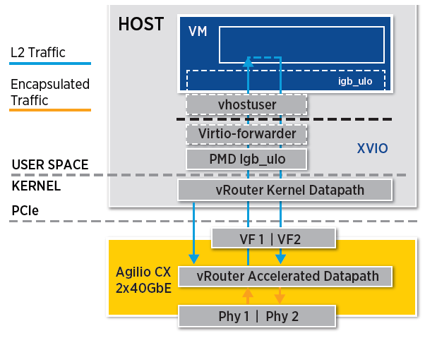

QUESTIONS:

* What about resiliency and bonding of 2 physical cards ?

==== eBPF and XDP

_Berkeley Packet Filter_ (BPF) was designed for capturing and filtering network packets that matched specific rules. In last years extended BPF (eBPF) has been designed to take advantage of new hardware (64 bits usage for intance). An eBPF program is "attached" to a designated code path in the kernel.

_eXpress Data Path_ (XDP), uses eBPF to achieve high-performance packet processing by running eBPF programs at the lowest level of the network stack, immediately after a packet is received. XDP.

XDP support is made available in the Linux Kernel since version 4.8, while eBPF is supported in the Linux Kernel since version 3.18.

XDP requires:

* MultiQ NICs
* Common protocol-generic offloads:
** TX/RX checksum offload
** Received Side Scaling
** Transport Segmentation offload (TSO)

XDP packet processor performs:

* In Kernel RX packets processing
* Process RX packets directly (without any additional memory allocation for software queue, nor socket buffer allocation)
* Assign one CPU to each RX queue. This CPU can be configured into poll mode or interrupt mode.
* Trigger BPF program for packet processing

BFP programs:

* parse packets
* perform table lookup
* manage stateful filters
* manipulate packets (encapsulation, decapsulation, NAT, …)

BFP program main actions are :

* Forward
* Forward after modification (NAT)
* Drop
* Normal receive (regular Linux packet processing with socket buffer and TCP/IP stack)
* Generic Receive Offload (coalesce several received packets of a same connection

XDP is also able to offload an eBPF program to a NIC card which supports it, reducing the CPU load.

XDP and eBPF does not require:

* to allocate large pages
* to allocate dedicated CPUs
* to choose packet polling or interrupt driven networking model
* user space to kernel space context switching to perform eBPF filtering
* allow packet processing offload when supported by used NIC card

PS: eBPF rules are also supported in DPDK application.

https://www.redhat.com/en/blog/using-express-data-path-xdp-red-hat-enterprise-linux-8

Question: What about Contrail and XDP support ?

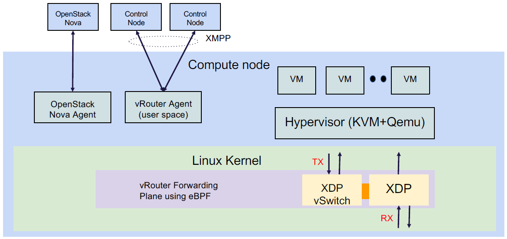

=== NIC virtualization solutions summary

We’ve seen lots of NIC virtualization models for virtual instances. From a full software implementation like proposed by VirtIO to fully hardware assisted solution like proposed by SR-IOV. Also, DPDK is providing the ability to move NIC packet processing from Kernel space to userspace.

In the diagram below we are providing an overview of NIC virtualization solution:

* Fully software solutions are very flexible and fits well with SDN and Cloud feature expectation (Live migration, east-west traffic inside host computes)
* Hardware assisted solutions are very performant but fit less with expected virtualization flexibility. Guest VM migration is poorly supported due to hardware dependencies. These solutions fit well with application requiring a huge north-south traffic (from Guest WM to cloud outside).

In the middle, SmartNIC and DPDK are offering the best compromise for a SDN usage. Smart NIC are proposing very high performance, but this is still not a fully mature solution (lots of implementations vendor specific, no agreed standard).

[cols=",,,,,,",options="header",]
|===
|Feature a|
vhost-net

virtio-net

a|
vhost-user

virtio-pmd

|SR-IOV |Virtio full HW offload |vDPA |Smartnic
|Performance |Low |high a|
very high

(wirespeed)

a|
very high

(wirespeed)

a|
very high

(wirespeed)

a|
very high

(wirespeed)

|data path hardware offloading |No |No |Yes |Yes |Yes |Yes
|control path hardware offloading |No |No |Yes |Yes |No |No
|Guest user NIC |N/A |Yes (DPDK) |Yes (DPDK) |Yes (DPDK) |Yes (DPDK) |Yes (DPDK)
|Guest Kernel NIC |Yes |No |Yes |Yes |Yes |Yes
|VirIO Standard |Yes |Yes |No |Yes |Yes |Yes
|SDN switching support |Yes |Yes |No |No |No |Yes
|Live Migration |Yes |Yes |No |Yes (*) |Yes (*) |Yes (*)
|===

(*): depends on hardware and QEMU latest virtio specification support on the NIC card.

=== Contrail DPDK vrouter application - supported models

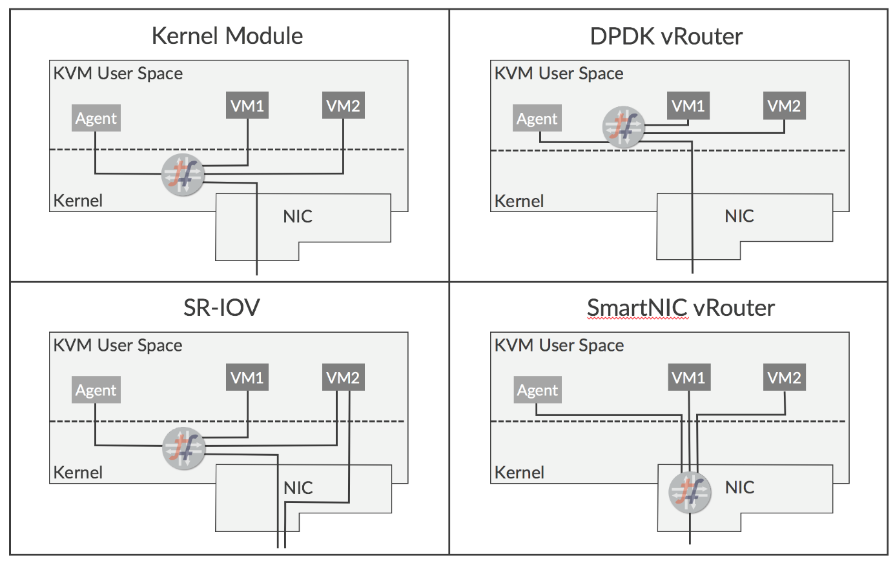

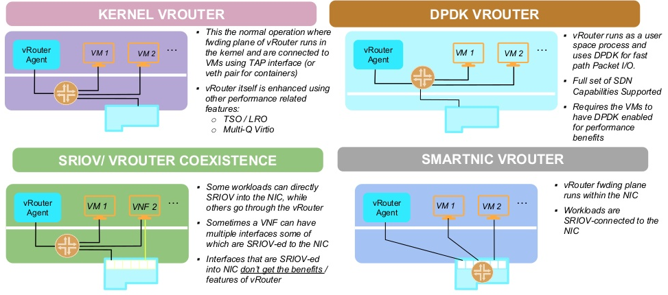

[cols=",,,,,",options="header",]
|===
|*NICs* |*Ubuntu - KVM* |*Ubuntu - DPDK* |*Redhat - KVM* |*Redhat - DPDK* |*vCenter - ESX*
|Intel 82599/X520 "Niantic" - 10G |Yes |Yes |Yes |Yes |Yes
|Intel X710 "Fortville" - 10G/25G/40G |Yes |Yes |Yes |Yes |Not tested
|Broadcom bnxt 2x25G |Yes |Yes |Not tested |Not tested |Not tested
|Mellanox 2x25G |Yes |Yes |Not tested |Not tested |Not tested
|Netronome |3.1.x only |No |No |No |No
|===

[line-through]*These are the guidelines from Intel with regard to Intel NIC X710 (in order not to bump into a known issue that impacts data plane)*

* [line-through]*Do not use a single PCI NIC for non-DPDK and DPDK interfaces (having i40e kernel driver used together with i40e PMD driver for interfaces on the same PCI NIC cause problems)*
* [line-through]*Upgrade NIC FW to 6.01 and i40e kernel driver to 2.4.6 (all necessary information you find in that document, table 9. https://www.intel.com/content/dam/www/public/us/en/documents/release-notes/xl710-ethernet-controller-feature-matrix.pdf*
* [line-through]*LLDP is supported from 6.01 NIC FW but Intel also suggested to disable (*`ethtool -set-priv-flags <interface name> disable-fw-lldp on`[line-through]*)*

[line-through]*If your server manufacturer has no support for the latest firmware please contact him asap (i.e. The latest Lenovo server firmware includes 5.05 for X710 NICs)*

* [line-through]*Redhat supports 1.6.27 i40 kernel driver version.*
* [line-through]*Canonical supports 1.4.25 i40e kernel version.*

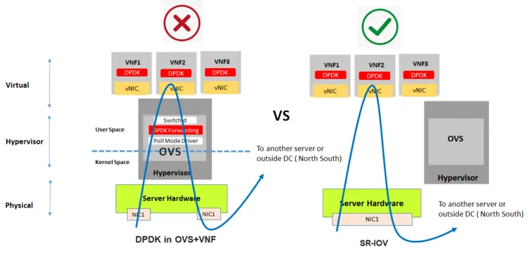

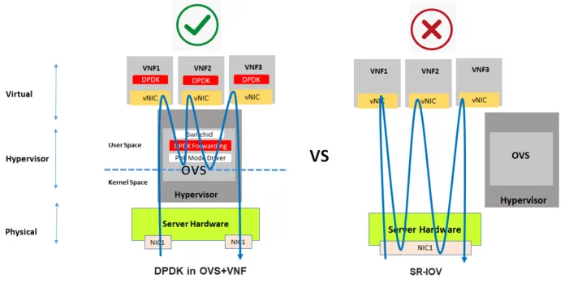

https://www.netronome.com/blog/ovs-offload-models-used-nics-and-smartnics-pros-and-cons/

== *[underline]#chapter 3: Contrail DPDK vrouter architecture#* (kiran)

=== Contrail vrouter architecture

vRouter is made of 2 parts :

- *vRouter agent* : vrouter control and configuration plane
- *vRouter dataplane* : vrouter userplane (user packet processing)

.agent (control plane)
vRouter agent is used to manage the communication between Contrail SDN Controller and vRouter.

vRouter agent has 2 interfaces :

- vhost0 (north controller)
- pkt0 (south dataplane)

vRouter agent is always running in compute node user mode.

.vrouter (dataplane)
vRouter dataplane has 2 kinds of interfaces

- Physical NIC : connected to underlay network in order to send traffic out of the compute node
- vNIC tap : connected to guest virtual instances

.vrouter interfaces
image::diagrams/extracted-media-ContrailPerformanceGuidev3.2.docx/media/image37.png[image,width=351,height=373]

vRouter dataplane is running either in Linux Kernel space or in Linux User space when DPDK is used.
Better performances are expected when vRouter dataplane is running into Linux User space.

=== vrouter and dpdk
Contrail vRouter is using DPDK library to improve packet processing performance.

When using contrail vrouter without DPDK, vRouter dataplane process is running
into Linux Kernel.

.vRouter in kernel with VM application not DPDK aware
image::diagrams/extracted-media-ContrailPerformanceGuidev3.2.docx/media/image32.png[Picture1.png,width=330,height=288]
//image::diagrams/extracted-media-ContrailPerformanceGuidev3.2.docx/media/image32.png[vrouter in kernel with VM]

When using contrail vrouter with DPDK, vRouter dataplane is running into Linux user space.

.vRouter DPDK with VM application DPDK aware.
image::diagrams/extracted-media-ContrailPerformanceGuidev3.2.docx/media/image35.png[Picture1.png,width=336,height=272]

.vRouter DPDK with VM application not DPDK aware.
image::diagrams/extracted-media-ContrailPerformanceGuidev3.2.docx/media/image36.png[image,width=453,height=312]

In order to get good network performances, virtual instances (especially VNF -
Virtual Network Function) are implementing DPDK. 4 topologies are possible:

- vrouter in Kernel mode collecting VNF with a network in Kernel Mode
- vrouter in Kernel mode collecting VNF running DPDK
- vrouter in DPDK mode collecting VNF with a network in Kernel Mode
- vrouter in DPDK mode collecting VNF running DPDK

An all DPDK stack, used both at vrouter level and at VNF level, is providing the best performance.

.vrouter 4 topologies
//image::diagrams/extracted-media-ContrailPerformanceGuidev3.2.docx/media/image16.png[image,width=618,height=513]

//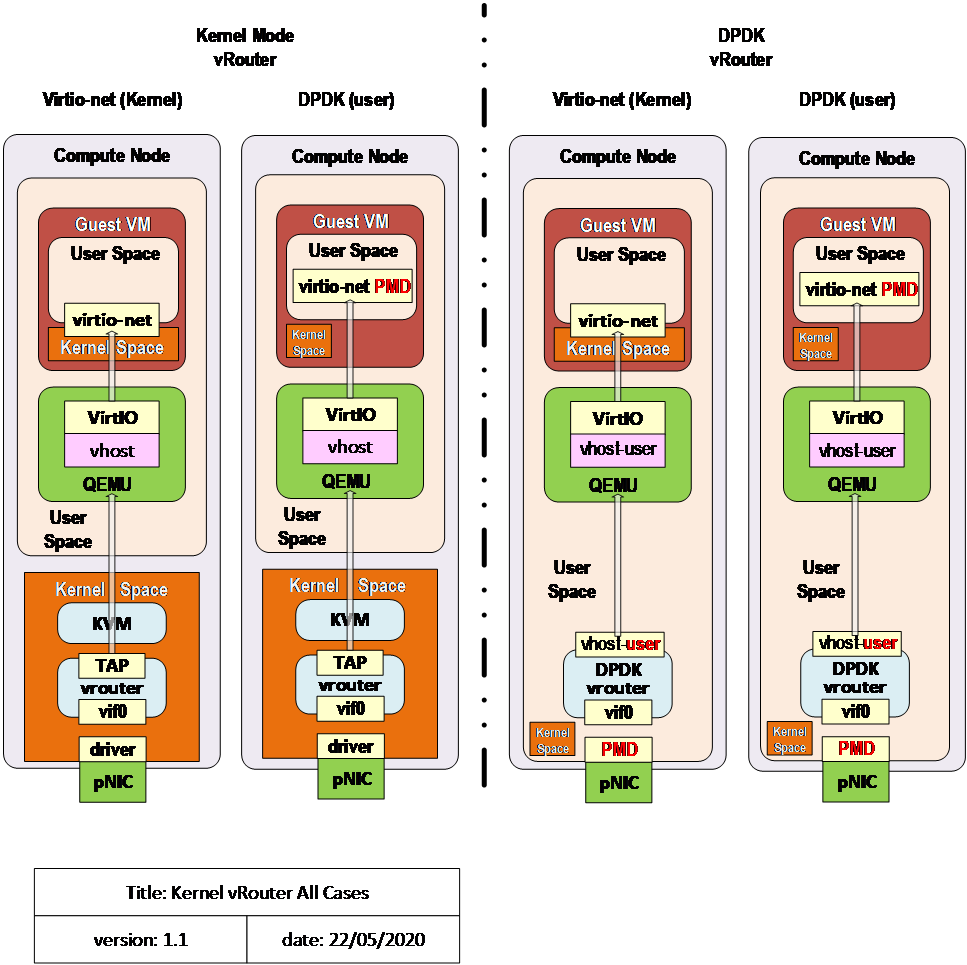

//this diagram looks not related here, comment out
//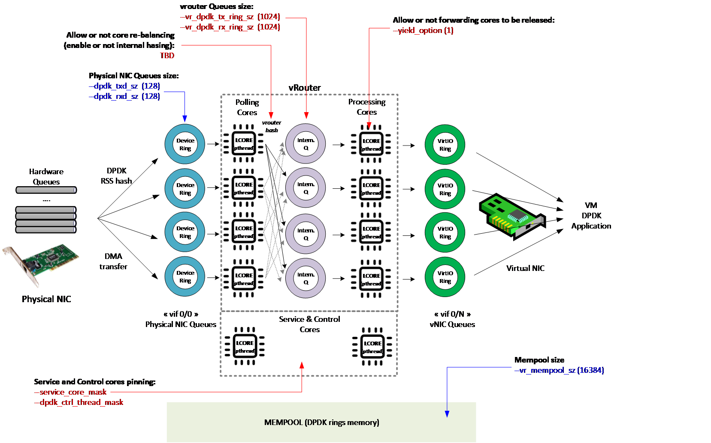
//

When DPDK is used into the virtual instance, vNIC driver (virtio-net) used for
packet processing in Kernel space is replaced by a virtio Poll Mode Driver
(virtio-net PMD) in order to perform packet processing in Virtual Instance user
space.

=== DPDK threads and Contrail lcore numbering

DPDK vrouter is a multi-threads application.
DPDK vrouter forwarding plane process is made up of several kinds of threads.

control and service threads are used for DPDK vrouter configuration (add/remove
  vif interfaces onto the vrouter, manage the communication with the vrouter
  agent for instance)

The term `lcore` refers to an EAL (Environment Abstraction Layer) thread, which
is really a Linux/FreeBSD pthread (physical Thread). A numbering into the dpdk
vrouter is used for lcores.

There are 3 set of threads into a DPDK vrouter,
Each set of threads is made up of several single threads:

- *control threads* : used for DPDK internal processing. `eal-intr-thread`,
  `rte_mp_handle`, `rte_mp_async` (they are generated by the DPDK library
  itself - DPDK setup management) *DPDK control threads will be allocated onto
  Operating System assigned CPUs*

- *service threads* : used for connectivity between vrouter agent and vrouter
  forwarding plane (DPDK vrouter). Thread names are lcore 0 to 9 thread names
  are lcore 0 to 9. They each one has a specific role:

** lcore 0: vhost0
** lcore 1: timers
** lcore 2: Interrupts
** lcore 8: pkt0 (can be busy)
** lcore 9: Netlink (can be busy)

- *processing threads* : used for packet polling and processing (forwarding
  plane), thread names are lcore 10 and above

==== control threads
DPDK control threads can be pinned on any CPU.
These CPUs are only used during Contrail vRouter startup for DPDK initialization.
As they did not require high CPU capacity, a good strategy is to use the CPU
allocated to the Operating System for these threads.

    
==== Service and Processing threads

Besides forwarding threads Contrail DPDK vRouter runs `service threads` :

- *pkt0 thread* for a communication with Contrail vRouter Agent (flow setup) 
  * this is vRouter lcore ID 8 thread (cf appendix section for lcore/pthread numbering). 
  * This is used to send and receive packets to/from the agent.  
  * eg: 1st packet of flow, arp, dhcp etc.

- *netlink thread* to give vRouter Agent possibility to get statistics from Contrail DPDK vRouter
  * this is vRouter lcore ID 9 thread (cf appendix section for lcore/pthread numbering)
  * The Netlink socket family is a Linux kernel interface used for inter-process communication (IPC)

[NOTE]
====
- Before contrail 20.03 release, Service threads were pinned to the whole range
  of cores available on the host system.  
- Since the 20.03 release it is possible to pin these threads on some specific CPUs.
====

Service and Processing threads are named `lcore-slave-<ID>`. Contrail vRouter
cores ID have a specific meaning defined in the following C enum data
structure, An enumeration is defining this numbering :

    enum {
        VR_DPDK_KNITAP_LCORE_ID = 0,
        VR_DPDK_TIMER_LCORE_ID,
        VR_DPDK_UVHOST_LCORE_ID,
        VR_DPDK_IO_LCORE_ID,        # 3
        VR_DPDK_IO_LCORE_ID2,
        VR_DPDK_IO_LCORE_ID3,
        VR_DPDK_IO_LCORE_ID4,
        VR_DPDK_LAST_IO_LCORE_ID,   # 7
        VR_DPDK_PACKET_LCORE_ID,    # 8
        VR_DPDK_NETLINK_LCORE_ID,
        VR_DPDK_FWD_LCORE_ID,       # 10
    };

NOTE: This *lcore numbering* used in vrouter can be seen into source file
(vr_dpdk.h).  Lots of other details concerning DPDK vrouter can also be seen
into following files :

    include/vr_dpdk.h
    dpdk/dpdk_vrouter.c
    dpdk/vr_dpdk_lcore.c

.from https://github.com/Juniper/contrail-vrouter/blob/master/include/vr_dpdk.h
[source,c]
----
/*
 * DPDK LCore IDs
 */
enum {
    VR_DPDK_KNITAP_LCORE_ID = 0,
    VR_DPDK_TIMER_LCORE_ID,
    VR_DPDK_UVHOST_LCORE_ID,
    /*
     * The actual number of IO lcores depends on the number of
     * forwarding lcores.
     */
    VR_DPDK_IO_LCORE_ID,
    VR_DPDK_IO_LCORE_ID2,
    VR_DPDK_IO_LCORE_ID3,
    VR_DPDK_IO_LCORE_ID4,
    VR_DPDK_LAST_IO_LCORE_ID,
    /* [PACKET_ID..FWD_ID) lcores have TX queues, but no RX queues */
    VR_DPDK_PACKET_LCORE_ID,
    VR_DPDK_NETLINK_LCORE_ID,
    /* The actual number of forwarding lcores depends on affinity mask. */
    VR_DPDK_FWD_LCORE_ID,
};
----

0 to 9 lcore numbers are statically defined into the source code and can’t be
configured by user.

- The 3 first logical numbers (0 to 2) are used for "service lcores". 
- The 5 next ones (3 to 7) are booked for IO lcores.
- The 2 next ones (8 to 9) are "lcores with TX queues". 
- Logical cores with number 10 and above are forwarding logical cores.

contrail and service cores should be pinned to dedicated core(s) if flow mode
is heavly used, in packet mode can be use the CPU allocated to the Operating
System. This value is set into `/etc/sysconfig/network-scripts/ifcfg-vhost0`
configuration file.

    DPDK_CTRL_THREAD_MASK=0,1,28,29
    SERVICE_CORE_MASK=0,1,28,29
    
The value can be provided as list (in the example) or hex mask (0x540000054).

==== forwarding threads

- Contrail DPDK vRouter runs forwarding threads to poll NIC queues 
- Forwarding threads are lcore ID 10 and above (cf appendix section for lcore/pthread numbering)
- 1 to 1 mapping between thread and queue
- Forwarding threads in their infinity loops poll its queues on the NIC to
  check if there is packet or burst of packets to receive.
- It is providing descriptors where packets have to be copied to host memory (memory allocated by hugepage). 
- That packet movement to memory is done using NIC DMA (Direct Memory Access processor). 
- Each forwarding thread is pinned to its dedicated CPU core (named DPDK `lcore`). 
- The number of NIC queues is dependent on the number of CPU cores which are
  specified by coremask in Contrail DPDK vRouter configuration
  (`contrail-vrouter-dpdk.ini` file). 
- Contrail DPDK vRouter uses DPDK `ethdev` function to program the NIC.

lcore numbers 10 and above are used for forwarding purpose and defined with CPU affinity value.

This value is set into `/etc/sysconfig/network-scripts/ifcfg-vhost0` configuration file.

    CPU_LIST=2,4,6,30,32,34
    
For instance `2,4,6,30,32,34` CPU list is giving following mapping :

    34 33 32 31 30 29 28 27 26 25 24 23 22 21 20 19 18 17 16 15 14 13 12 11 10 09 08 07 06 05 04 03 02 01 00
     1  0  1  0  1  0  0  0  0  0  0  0  0  0  0  0  0  0  0  0  0  0  0  0  0  0  0  0  1  0  1  0  1  0  0

it means Host CPU numbers 2, 4, 6, 30, 32 and 34 are used for vrouter
forwarding logical cores.

.lab capture: 3.2
****
[source, sh, linenums]
----
$ cat /etc/contrail/supervisord_vrouter_files/contrail-vrouter-dpdk.ini
[program:contrail-vrouter-dpdk]
command=taskset 0xf /usr/bin/contrail-vrouter-dpdk --no-daemon --vdev "eth_bond_bond0,mode=4,xmit_policy=l34,socket_id=0,mac=5c:b9:01:8b:6f:3c,slave=0000:08:00.0,slave=0000:08:00.1" --vlan_tci "2004" --vlan_fwd_intf_name "bond0" --socket-mem 1024,1024
----

`0xf` => cpu# 0~3 are pinned for forwarding.
****

._how to check in logs_
When the router boots up, it displays a message about its logical cores numbering.
For instance, we can get into `contrail-vrouter-dpdk-stdout.log` file, such a message :

    VROUTER: --lcores "(0-2)@(0-47),(8-9)@(0-47),*10@2,11@4,12@6,13@8,14@26,15@28,16@30,17@32*"
    EAL: Detected 48 lcore(s)
    *VROUTER: Using 8 forwarding lcore(s)*
    VROUTER: Using 0 IO lcore(s)
    VROUTER: Using 5 service lcores

- First part of the message - `(0-2)@(0-N),(8-9)@(0-N)` - is always the same,
  as this internal CPU logical numbering is statically defined in vrouter
  source code.

- N is the total number of CPU available in the compute onto which the vrouter
  is running.

- Last part of the message - `*10@2,11@4,12@6,13@8,14@26,15@28,16@30,17@32*` -
  is depending on the CPU affinity.

- Here 8 logical cores are used for forwarding purpose, they are numbered from
  10 to 17. They are mapped one by one onto the host CPUs 2, 4, 6, 8, 26, 28,
  30 and 32.

.lab capture
****
.3.2 lab

[source, sh, linenums]
----
$ cat /var/log/contrail/contrail-vrouter-dpdk-stdout.log
2019-09-27 11:09:58,126 VROUTER: EAL arguments:
2019-09-27 11:09:58,126 VROUTER:            -n  "4"
2019-09-27 11:09:58,126 VROUTER:  --socket-mem  "1024,1024"
2019-09-27 11:09:58,126 VROUTER:        --vdev  "eth_bond_bond0,mode=4,xmit_policy=l34,socket_id=0,mac=5c:b9:01:8b:6f:3c,slave=0000:08:00.0,slave=0000:08:00.1"
2019-09-27 11:09:58,126 VROUTER:      --lcores  "(0-2)@(0-47),(8-9)@(0-47),10@0,11@1,12@2,13@3"
2019-09-27 11:09:58,126 EAL: Detected 48 lcore(s)
----

.19.08 lab

[source, sh, linenums]
----
$ cat /var/log/containers/contrail/contrail-vrouter-dpdk.log
2020-03-09 08:20:55,137 VROUTER: EAL arguments:
2020-03-09 08:20:55,137 VROUTER:            -n  "4"
2020-03-09 08:20:55,137 VROUTER:  --socket-mem  "1024,1024"
2020-03-09 08:20:55,137 VROUTER:        --vdev  "eth_bond_bond0,mode=4,xmit_policy=l23,socket_id=0,mac=0c:c4:7a:b7:2c:f8,lacp_rate=1,slave=0000:02:00.0,slave=0000:02:00.1"
2020-03-09 08:20:55,137 VROUTER:      --lcores  "(0-2)@(0-39),(8-9)@(0-39),10@1,11@2,12@3,13@21,14@22,15@23"
2020-03-09 08:20:55,144 EAL: Detected 40 lcore(s)
2020-03-09 08:20:55,144 EAL: Detected 2 NUMA nodes
----

.2003 lab
[source, sh, linenums]
----
2020-05-25 09:31:19,640 VROUTER: EAL arguments:
2020-05-25 09:31:19,640 VROUTER:            -n  "4"
2020-05-25 09:31:19,640 VROUTER:  --socket-mem  "1024,1024"
2020-05-25 09:31:19,640 VROUTER:        --vdev  "eth_bond_bond1,mode=4,xmit_policy=l34,socket_id=0,mac=e4:43:4b:6e:70:70,lacp_rate=1,slave=0000:19:00.0,slave=0000:19:00.1"
2020-05-25 09:31:19,640 VROUTER:            -t  "(0,1,28,29)"
2020-05-25 09:31:19,640 VROUTER:      --lcores  "(0-2)@(0,1,28,29),(8-9)@(0,1,28,29),10@2,11@4,12@6,13@30,14@32,15@34"
2020-05-25 09:31:19,646 EAL: Detected 56 lcore(s)
2020-05-25 09:31:19,646 EAL: Detected 2 NUMA nodes

----
****

This is this vrouter logical core numbering that has to be in `dropstats` command
(not the real host CPU numbering)

    $ dropstats –core 10

A maximum of 16 polling cores is currently supported by Contrail as the maximum
RX queue is currently 16:

    #define VR_DPDK_MAX_NB_RX_QUEUES 16

We can find those names by running using the "ps" command with some additional
arguments (this is from a compute node where vrouter is using 8 logical
forwarding cores, 4 phy cores using HT siblings):

    # ps -Tp `pidof contrail-vrouter-dpdk`
    PID SPID TTY TIME CMD
    *54490 54490 ? 02:46:12 contrail-vroute*
    *54490 54611 ? 00:02:33 eal-intr-thread*
    *54490 54612 ? 01:35:26 lcore-slave-1*
    *54490 54613 ? 00:00:00 lcore-slave-2*
    *54490 54614 ? 00:00:17 lcore-slave-8*
    *54490 54615 ? 00:02:14 lcore-slave-9*
    *54490 54616 ? 2-21:44:06 lcore-slave-10*
    *54490 54617 ? 2-21:44:06 lcore-slave-11*
    *54490 54618 ? 2-21:44:06 lcore-slave-12*
    *54490 54619 ? 2-21:44:06 lcore-slave-13*
    *54490 54620 ? 2-21:44:06 lcore-slave-14*
    *54490 54621 ? 2-21:44:06 lcore-slave-15*
    *54490 54622 ? 2-21:44:06 lcore-slave-16*
    *54490 54623 ? 2-21:44:06 lcore-slave-17*
    *54490 54990 ? 00:00:00 lcore-slave-9*

.lab capture
****
[source, sh, linenums]
----
[heat-admin@jnprctdpdk01 ~]$ ps -Tp `pidof contrail-vrouter-dpdk`
    PID    SPID TTY          TIME CMD
  46058   46058 ?        1-18:54:41 contrail-vroute
  46058   46070 ?        00:00:00 rte_mp_handle
  46058   46071 ?        00:00:00 rte_mp_async
  46058   46073 ?        01:24:03 eal-intr-thread
  46058   46074 ?        2-12:27:21 lcore-slave-1
  46058   46075 ?        00:00:00 lcore-slave-2
  46058   46076 ?        00:04:59 lcore-slave-8
  46058   46077 ?        00:33:48 lcore-slave-9
  46058   46078 ?        24-13:55:14 lcore-slave-10
  46058   46079 ?        24-13:55:58 lcore-slave-11
  46058   46080 ?        24-13:56:00 lcore-slave-12
  46058   46536 ?        00:00:00 lcore-slave-9
----
****

Here we have :

- *contrail-vrouter is main thread*
- *lcore-slave-1 is timer thread*
- *lcore-slave-2 is uvhost (for qemu) thread*
- l**core-slave-8 is pkt0 thread**
- lcore-slave-9 is netlink thread (for nh/rt programming)
- *lcore-slave-10 onwards are forwarding threads, the ones running at 100% as
  they are constantly polling the interfaces*

To list all lightweight processes created by contrail-vrouter-dpdk run following command:

    # pstree -p $(ps -ef | awk '$8=="/usr/bin/contrail-vrouter-dpdk" {print $2}')
    contrail-vroute(6665)─┬─{contrail-vroute}(7800)
    ├─{contrail-vroute}(7801)
    ├─{contrail-vroute}(7802)
    ├─{contrail-vroute}(7803)
    ├─{contrail-vroute}(7804)
    ├─{contrail-vroute}(7805)
    ├─{contrail-vroute}(7806)
    ├─{contrail-vroute}(7807)
    ├─{contrail-vroute}(7808)
    └─{contrail-vroute}(8200)

The following command can be used.
It provides in the last column the CPU load generated by each thread:

[source, sh, linenums]
----
# ps -mo pid,tid,comm,psr,pcpu -p $(ps -ef | awk '$8=="/usr/bin/contrail-vrouter-dpdk" {print $2}')
    PID     TID COMMAND         PSR %CPU
  58324       - contrail-vroute   -  602
      -   58324 -                28  3.7
      -   58337 -                 0  0.0
      -   58338 -                 0  0.0
      -   58341 -                 1  0.0
      -   58342 -                28  5.0
      -   58343 -                 0  0.0
      -   58344 -                29  0.2
      -   58345 -                 1  0.4
      -   58346 -                 2 99.2
      -   58347 -                 4 99.2
      -   58348 -                 6 99.2
      -   58349 -                30 99.2
      -   58350 -                32 99.2
      -   58351 -                34 99.2
      -   58774 -                 1  0.0
----

Using *_pidstat_* command we can see that some vrouter threads are running at 100% CPU.
Those are the forwarding threads, the ones pinned based on the configured coremask :

[source, sh, linenums]
----
#pidstat -t -p `pidof contrail-vrouter-dpdk`
Linux 3.10.0-1062.12.1.el7.x86_64 (overcloudjcx-compdpdk1hw0-0.prod1.bw.juniper.net)    05/25/2020      _x86_64_        (56 CPU)

09:39:05 AM   UID      TGID       TID    %usr %system  %guest    %CPU   CPU  Command
09:39:05 AM     0     58324         -    0.06    0.00    0.00    0.06     1  contrail-vroute
09:39:05 AM     0         -     58324    0.00    0.00    0.00    0.00     1  |__contrail-vroute
09:39:05 AM     0         -     58337    0.00    0.00    0.00    0.00     0  |__rte_mp_handle
09:39:05 AM     0         -     58338    0.00    0.00    0.00    0.00     0  |__rte_mp_async
09:39:05 AM     0         -     58341    0.00    0.00    0.00    0.00     0  |__eal-intr-thread
09:39:05 AM     0         -     58342    0.00    0.00    0.00    0.00    29  |__lcore-slave-1
09:39:05 AM     0         -     58343    0.00    0.00    0.00    0.00     0  |__lcore-slave-2
09:39:05 AM     0         -     58344    0.00    0.00    0.00    0.00    29  |__lcore-slave-8
09:39:05 AM     0         -     58345    0.00    0.00    0.00    0.00    29  |__lcore-slave-9
09:39:05 AM     0         -     58346    0.01    0.00    0.00    0.01     2  |__lcore-slave-10
09:39:05 AM     0         -     58347    0.01    0.00    0.00    0.01     4  |__lcore-slave-11
09:39:05 AM     0         -     58348    0.01    0.00    0.00    0.01     6  |__lcore-slave-12
09:39:05 AM     0         -     58349    0.01    0.00    0.00    0.01    30  |__lcore-slave-13
09:39:05 AM     0         -     58350    0.01    0.00    0.00    0.01    32  |__lcore-slave-14
09:39:05 AM     0         -     58351    0.01    0.00    0.00    0.01    34  |__lcore-slave-15
09:39:05 AM     0         -     58774    0.00    0.00    0.00    0.00    29  |__lcore-slave-9
----
In the example above, we can notice:

- *processing/forwarding threads:*  lcore-slave-10 - lcore-slave-15, ~100% CPU load.
- *service threads:* lcore-slave-1 - lcore-slave-9.
- *control threads:* rte_mp_handle,rte_mp_async, eal-intr-thread.

NOTE: `pidstat` command is not provided in default OS installation. It has to
be installed with following command on RedHat system:

    # yum install -y sysstat

In order to list CPU cores assigned to contrail-vrouter-dpdk, we have to run
`taskset` command for each lightweight process.
[source, sh, linenums]
----
# taskset -cp -a $(pidof contrail-vrouter-dpdk)
pid 58324's current affinity list: 0,1,28,29
pid 58337's current affinity list: 0,1,28,29
pid 58338's current affinity list: 0,1,28,29
pid 58341's current affinity list: 0,1,28,29
pid 58342's current affinity list: 0,1,28,29
pid 58343's current affinity list: 0,1,28,29
pid 58344's current affinity list: 0,1,28,29
pid 58345's current affinity list: 0,1,28,29
pid 58346's current affinity list: 2
pid 58347's current affinity list: 4
pid 58348's current affinity list: 6
pid 58349's current affinity list: 30
pid 58350's current affinity list: 32
pid 58351's current affinity list: 34
pid 58774's current affinity list: 0,1,28,29
----

.lab capture
****

[source, sh, linenums]
----
[heat-admin@jnprctdpdk01 ~]$ pstree -p $(ps -ef | awk '$8=="/usr/bin/contrail-vrouter-dpdk" {print $2}')
contrail-vroute(46058)─┬─{contrail-vroute}(46070)
                       ├─{contrail-vroute}(46071)
                       ├─{contrail-vroute}(46073)
                       ├─{contrail-vroute}(46074)
                       ├─{contrail-vroute}(46075)
                       ├─{contrail-vroute}(46076)
                       ├─{contrail-vroute}(46077)
                       ├─{contrail-vroute}(46078)
                       ├─{contrail-vroute}(46079)
                       ├─{contrail-vroute}(46080)
                       └─{contrail-vroute}(46536)
----

.2003 lab
----
# pstree -p $(ps -ef | awk '$8=="/usr/bin/contrail-vrouter-dpdk" {print $2}')
contrail-vroute(58324)─┬─{contrail-vroute}(58337)
                       ├─{contrail-vroute}(58338)
                       ├─{contrail-vroute}(58341)
                       ├─{contrail-vroute}(58342)
                       ├─{contrail-vroute}(58343)
                       ├─{contrail-vroute}(58344)
                       ├─{contrail-vroute}(58345)
                       ├─{contrail-vroute}(58346)
                       ├─{contrail-vroute}(58347)
                       ├─{contrail-vroute}(58348)
                       ├─{contrail-vroute}(58349)
                       ├─{contrail-vroute}(58350)
                       ├─{contrail-vroute}(58351)
                       └─{contrail-vroute}(58774)
----

[source, sh, linenums]
----
ps -mo pid,tid,comm,psr,pcpu -p $(ps -ef | awk '$8=="/usr/bin/contrail-vrouter-dpdk" {print $2}')
PID TID COMMAND PSR %CPU
161791 - contrail-vroute - 618
- 161791 - 22 1.6
- 161867 - 3 0.0
- 161868 - 27 1.1
- 161869 - 18 0.0
- 161870 - 27 0.3
- 161871 - 21 0.0
- 161872 - 2 64.3
- 161873 - 3 64.3
- 161874 - 4 64.3
- 161875 - 5 64.3
- 161876 - 6 64.3
- 161877 - 7 98.3
- 161878 - 8 98.1
- 161879 - 9 97.7
- 162134 - 11 0.0
----

[source, sh, linenums]
----
[root@overcloudmz5-compdpdk-1 ~]# pidstat -t -p `pidof contrail-vrouter-dpdk`
Linux 3.10.0-957.27.2.el7.x86_64 (overcloudmz5-compdpdk-1.srelab1.englab.juniper.net)   05/06/2020      _x86_64_        (40 CPU)

07:53:19 AM   UID      TGID       TID    %usr %system  %guest    %CPU   CPU  Command
07:53:19 AM     0     15745         -  100.00  100.00    0.00  100.00     6  contrail-vroute
07:53:19 AM     0         -     15745    0.68    0.62    0.00    1.29     6  |__contrail-vroute
07:53:19 AM     0         -     15777    0.00    0.00    0.00    0.00     3  |__rte_mp_handle
07:53:19 AM     0         -     15778    0.00    0.00    0.00    0.00     3  |__rte_mp_async
07:53:19 AM     0         -     15780    0.01    0.01    0.00    0.02     6  |__eal-intr-thread
07:53:19 AM     0         -     15781    1.21    1.00    0.00    2.21     6  |__lcore-slave-1
07:53:19 AM     0         -     15782    0.00    0.00    0.00    0.00     6  |__lcore-slave-2
07:53:19 AM     0         -     15783    0.00    0.00    0.00    0.00     6  |__lcore-slave-8
07:53:19 AM     0         -     15784    0.03    0.00    0.00    0.03     6  |__lcore-slave-9
07:53:19 AM     0         -     15785   55.21   44.79    0.00  100.00     1  |__lcore-slave-10
07:53:19 AM     0         -     15786   56.77   42.18    0.00   98.95     6  |__lcore-slave-11
07:53:19 AM     0         -     15787   54.10   45.89    0.00   99.99     3  |__lcore-slave-12
07:53:19 AM     0         -     15788   55.25   44.75    0.00  100.00    21  |__lcore-slave-13
07:53:19 AM     0         -     15789   57.25   42.75    0.00  100.00    22  |__lcore-slave-14
07:53:19 AM     0         -     15790   54.27   45.73    0.00  100.00    23  |__lcore-slave-15
07:53:19 AM     0         -     17452    0.00    0.00    0.00    0.00     6  |__lcore-slave-9
----

[source, sh, linenums]
----
[heat-admin@jnprctdpdk01 ~]$ taskset -cp 46075
pid 46075's current affinity list: 4
[heat-admin@jnprctdpdk01 ~]$ taskset -cp 46076
pid 46076's current affinity list: 4
[heat-admin@jnprctdpdk01 ~]$ taskset -cp 46074
pid 46074's current affinity list: 4
[heat-admin@jnprctdpdk01 ~]$ taskset -cp 46078
pid 46078's current affinity list: 1
[heat-admin@jnprctdpdk01 ~]$ taskset -cp 46079
pid 46079's current affinity list: 2
----
****

=== contrail dpdk version

Starting from Contrail 3.2.5 DPDK library 17.02 is used.
Earlier Contrail versions were based on DPDK library version 2.1
https://www.juniper.net/documentation/en_US/contrail3.2/information-products/topic-collections/release-notes/jd0e36.html#jd0e185

Contrail DPDK library fork

https://github.com/Juniper/contrail-dpdk

DPDK release notes

http://dpdk.org/doc/guides-17.02/rel_notes/index.html

DPDK version used by the vrouter can be checked into dpdk vrouter log files :

[source, sh, linenums]
----
$ vi /var/log/containers/contrail/contrail-vrouter-dpdk.log
...
2019-04-19 16:30:41,411 VROUTER: vRouter version: \{"build-info": [\{"build-time": "2019-04-11 23:47:32.407280", "build-hostname": "rhel-7-builder-juniper-contrail-ci-c-0000225573.novalocal", "build-user": "zuul", "build-version": "5.1.0"}]}
2019-04-19 16:30:41,411 VROUTER: DPDK version: *DPDK 18.05.1*
...
----

.lab capture: 3.2
****
[source, sh, linenums]
----
$ less /var/log/contrail/contrail-vrouter-dpdk-stdout.log | grep -i version | tail -2
2019-09-27 11:09:58,103 VROUTER: vRouter version: {"build-info": [{"build-time": "2018-10-18 07:00:47.106457", "build-hostname": "ubuntu", "build-user": "contrail-builder", "build-version": "3.2.13.0"}]}
2019-09-27 11:09:58,103 VROUTER: DPDK version: DPDK 17.02.0
----
****

=== Contrail related linux packages

.Ubuntu

[cols=",",options="header",]
|====
|*Package name*                   |*Description*
|contrail-dpdk-kernel-modules-dkms|Contrail DPDK 17.02 library in DKMS format
|contrail-vrouter-dpdk            |Core vRouter DPDK binary
|contrail-vrouter-dpdk-init a     |DPDK compute-node startup and monitoring scripts like:
                                   contrail-vrouter-dpdk.ini +
                                   dpdk_nic_bind.py +
                                   if-vhost0 +
|====

.Redhat

[cols=",",options="header",]
|====
|*Package name*              |*Description*
|dpdk                        |RHEL DPDK package
|contrail-vrouter-dpdk       |Core vRouter DPDK binary
|contrail-vrouter-dpdk-init a|DPDK compute-node startup and monitoring scripts like: +
                              contrail-vrouter-dpdk.ini +
                              dpdk_nic_bind.py +
                              if-vhost0
|====

[NOTE]
====
* info how to deploy with Director with Openstack Newton
https://github.com/Juniper/contrail-tripleo-heat-templates/tree/stable/newton[[.underline]#https://github.com/Juniper/contrail-tripleo-heat-templates/tree/stable/newton#]
====

.Nova / Qemu / Libvirt

It is required to have Contrail qemu / libvirt / nova packages installed on DPDK nodes in order to:

- Support multiqueue (Multiqueue support is available from Mitaka release)
- Not lose connectivity to VMs when restarting DPDK vrouter

NOTE: This limitation is removed. It is possible to use qemu and nova upstream
packages with `contrail-nova-vif-driver`.
Starting from OpenStack Pike release, no patch is required.
*libvirt is the only package needed if we want multiqueue*.

<<<

== Chapter 3: Overview of DPDK vRouter (first draft)
:doctype: book
:toc: right
:toclevels: 3
:data-uri:

=== Motivation
==== Comparison with linux stack and NAPI
Let us look at the state of the art in software packet processing about 10 years ago. At that time, the linux kernel networking stack was the only way for packet forwarding in linux based x86 servers. Linux networking stack uses a mechanism called as  *New API or NAPI*  in short. This mechanism was added to linux 2.4.x kernels to improve the performance under heavy network IO. NAPI was a midway between interrupt and poll mechanism. It mitigated interrupts nicely such that the operating system disabled the interrupts under heavy load and only enabled them when the load is not high. It also deferred packet processing to "bottom half" where the processing can be done safely. Inspite of this, due to the fact that interrupts still exist, the packet processing incurs a lot of overheads. The context switch during raising an interrupt itself takes several thousands of processor cycles. Once the context switch happens, additional latencies are introduced due to the deferral of bottom halves. Still this was a good improvement compared to the previous versions of linux. Once the context is bottom half, the system switches to poll mode and processes a burst of packets. Once the time share is elapsed, it switches back to interrupt mode. This was fine for smaller NICs, say 1G NICs.

==== Need for a networking stack
Let us consider best case numbers for conventional linux packet processing. Today, linux can do around 1 million packets per second per core quite easily. For handling a 1G NIC with 64 Byte packets, we need around 2 CPU cores (64 x 8 Bits x 2 cores x 1 MPPS = 1 Gbps). This was sufficient about 10 years ago. But later 10G NIC started coming into the market which required 2 X 10 = 20 cores to handle it. Now we have 25G and 100G NICs. Clearly linux does not scale. Something new needed to be developed to handle these high capacity NICs with a reasonable amount of CPU cores. These were the origins for DPDK.

=== Overview of DPDK
Data Plane Development Kit (DPDK) is a framework for fast packet processing in dataplane applications. It consists of a set of userspace libraries and network interface controller drivers which the applications can link. It is currently managed as an open-source project under the Linux Foundation.

==== Origin of DPDK
DPDK was initially created by Intel in 2010 and made available under a permissive open source license. The open source community was established at `dpdk.org` in 2013 by 6WIND and has facilitated the continued expansion of the project. Since then, the community has been continuously growing in terms of the number of contributors, patches, and contributing organizations. DPDK now supports all major CPU architectures and NICs from multiple vendors, which makes it ideally suited to applications that need to be portable across multiple platforms.

In the very first version itself, DPDK L2 forward application was able to give 5 million packets per second (MPPS) per core. It has continuously evolved in the last decade in terms of performance, features, support for different hardware architectures and network interfaces. In the latest LTS of DPDK, the R1911 version, it can give as much as 50 MPPS per core! To put this in perspective, DPDK can handle a 40G NIC using just 1 to 2 CPU cores in the best case. It is an order higher than linux stack. This has become very attractive for Telco NFV use-cases like vEPC, vMX, vSRX etc. Telcos can now virtualize their hardware based networking elements and at the same time get very good performance.

==== Environment Abstraction Layer (EAL)
DPDK creates a EAL which is customized for a particular environment in which it runs in. For example, we can create a DPDK application through compile flags and makefiles which is tuned for x86 64-bit architecture, linux OS. It abstracts hardware dependent portions and provides a generic API for application developers to use. It is a user-space library. Application developers can write their own applications and link it with the DPDK libraries and it runs as a user-space process. 

==== Why use DPDK?
DPDK has lot of constructs which can be used by application developers readily. It has efficient implementations of most common data structures used in networking like MTRIE, hashtable, lockless-queue etc. It also provides implementation of networking components like Longest prefix match (LPM), fragmentation support, segmentation offloads, user space vhost etc. Developers need not re-implement all these and can make use of these readily. DPDK Provides networking drives for most of the popular NIC drives like intel, broadcom, mellanox etc. Application development is also very easy. It has very good documentation and has example applications which application developers can readily make use of it to develop newer applications. They need not to start from scratch, they can add to an existing example application.

Below diagram shows an high level DPDK architecture:

.high level DPDK architecture
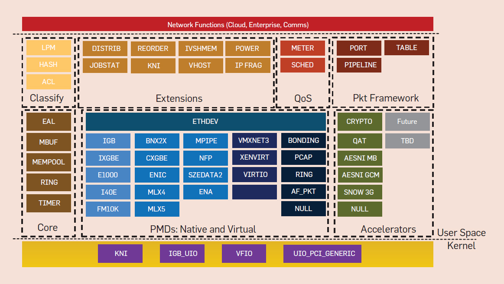

==== Where DPDK cannot be used?
* TCP stack on DPDK is still evolving. It does not have linux socket implementation. TCP applications like web servers, proxy servers are difficult to implement or port to DPDK. Although 6Wind has a TCP stack for DPDK, it is not free.

* DPDK consumes whole CPU cores owing to it's polling nature. The core is not visible in linux and is bound to a user-io driver which we will see later. Due to this, other applications cannot use this CPU core.

* It is also not easy to run more than one concurrent DPDK application. The support for this is still evolving

* DPDK can only run on network interfaces which has supported DPDK drivers. It is not as exhaustive as what linux supports. But more NICs are supported now.

=== How does DPDK achieve good performance?

==== Use of polling
DPDK uses the mechanism of polling to perform packet IO. In contrast, linux uses interrupts. Polling has lot of advantages over interrupts

* The whole interrupt processing is avoided. This saves thousands of CPU cycles during interrupt processing and context switching.
* CPU cores continuously poll for packets in the rings of NIC and dequeue them as soon as they arrive. This reduces the latency of packet processing.
* On the virtual machine side, polling avoids expensive VM Exits when the VM is also a running a DPDK application.

===== Note about the VMExits
Suppose a guest VM wants to send packet to host, it has to enqueue the packet to it's tx ring and raise an interrupt to the host and the later needs to dequeue it. This raising of the interrupt triggers a hypercall. Hypercall is like a system call to the hypervisor. Hypervisor then knows that the packet needs to be dequeued. This operation is called VM Exit and is very expensive. It is in the order of thousands of cycles and this whole overhead is avoided using polling. In polling, the cores continuously poll for packets in the rings and so there is no overhead of VMExits.

==== Efficient use of Intel x86 architecture

The diagram shows the typical cache and memory layout of a x86 server. The following are the ballpark latency numbers when there is a hit at different levels of caches or memory

* L1 cache hit: 7ns
* L2 cache hit: 11ns
* L3 cache hit: 30ns
* Main memory hit: 60ns
* Different socket: 100ns

image::diagrams/ch3/x86_memory_layout.png[image]

These are very significant numbers. Let us take an example of 10G NIC. For 64 Byte packet, the Inter arrival rate is around 67ns. That means, every 67ns, there is a new packet arriving at the NIC. To get line rate, the software has to take the packet, process it and send it out in that time. That is the budget. If it does not meet the budget, there will be queueing and subsequently tail drops. If you see the above latency numbers, just a single cache miss is contributing to 60ns when it has to fetch it from main memory. If it has to fetch it from a different sockets, the latency is 100ns which overshoots the budget. 

So how does DPDK work? How does it get line rate? Earlier in the chapter, we saw the current DPDK versions are able to reach 50Mpps. 

DPDK solves this by using the below techniques

===== Prefetching and Burst processing

Let us say one core is trying to get a packet. It will take 60ns, but in the time it is fetching the packet, DPDK tries to fetch additional 'n' packets. It may not use it at that instant, but it wants to fetch it. So in the time, one packet is fetched, additional set of 'n' packets are fetched. So in the above example, in 60ns, it fetches, say 32 packets. This is called prefetching and burst processing and the packets it receives or sends at one instant is called burst size. By using this approach, the latency is amortized over the number of packets and DPDK is able to get good performance. 

==== NUMA awareness

DPDK is very NUMA aware. All allocations like mempool, mem ring, mbuf can be done on a per NUMA basis. Developers can specify which NUMA to allocate so as to get optimum performance. That is very important. DPDK can do this since it is highly customized and uses Intel architecture to a very good extent.

==== Optimized memory manager

DPDK has a highly optimized memory manager. DPDK works on a group of fixed size objects called a `mempool`. Every one of them are pre-allocated. DPDK does not encourage dynamic allocations because it consumes a lot of CPU cycles and is a speed killer. DPDK pre-allocates a set of `mbufs` and keeps it in a pool called `mempool`. `Mempool` has further optimizations. It is very cache friendly. Everything is alligned to the cache and has a some `mbufs` allocated for each DPDK thread or lcore. This mempool has a `ring` where all the objects are stored. This `ring` itself is a highly optimized lockless ring. This `ring` can be used to communicate with two or more lcores in a multi-producer/multi-consumer kind of scenario without locks. Locking of data structures is a speed killer. By avoiding locks, DPDK gets large performance gains. It makes use of `mempools` when we want to allocate a `mbuf` where packets are stored. Instead of allocating a single `mbuf`, we do a bulk allocation or bulk free. By doing this, it already have `mbufs` in the cache and becomes very cache friendly. 

==== Hugepages

Conventionally, linux works with 4086 byte pages. x86 has a hardware memory cache called Translation lookaside buffer or TLB. This is a fast cahce for page address and virtual addresses generated by the CPU. Once the CPU fetches a page, the address is cached by this TLB. And if the reference is made to the same page again, the memory manager looks up the TLB for the page. If found, multiple page table lookups are avoided. But if the TLB misses, the time it takes to fetch a page is very large. If we look at the linux paging model, it has two or three levels of page tables like midpage table, high page table etc. After these multi-level lookups, it is then memory manager can find the base address of a page to translate the virtual address to a physical address and eventually fetch the page from main memory. This whole process is very expensive. So what DPDK does is, instead of 4K page size, it uses 2M or 1G page size. Because of the use bigger page size, the number of pages in the main memory drastically reduce. So this TLB will suffice to cache or hold the virtual addresses and then most of the lookups of pagetables are avoided, thereby improving performance.

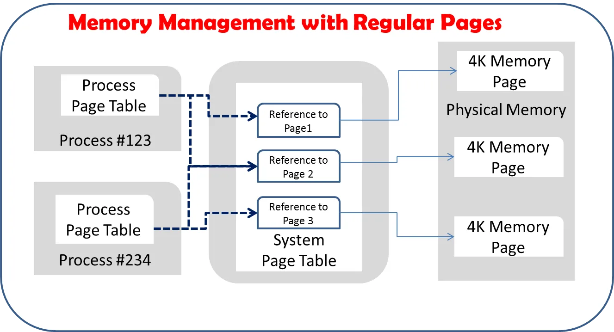

==== UIO drivers

DPDK uses UIO (user IO driver) to communicate with the NICs in user space. UIO driver is a skeletal kernel modules. It takes the BAR(base address) regions of PCI address space the NIC, it's config regions and other relevant regions and creates the memory map of all these which can be accessed by DPDK applications in user space. By this, the applications can directly access the NIC's rx/tx rings and config registers directly. Once the setup is done, the linux kernel is bypassed. The DPDK PMD drivers can enqueue a descriptor and point the descriptor to an address space in the user space instead of kernel space and the NIC can DMA from that. Without the support of UIO, this needed to be in the kernel and needed a system call or other kernel mechanisms to do it. 

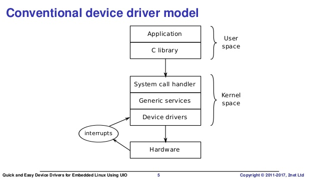

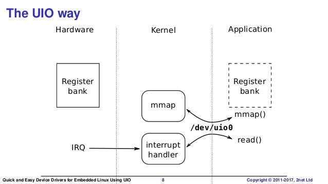

==== Use of Native instructions

DPDK applications exploit the use of native instructions on the hardware to provide further acceleration. Every DPDK application can have the option of compling on native or generic instruction set. For Example, the recent processors after ivy bridge have vector instructions and support SSE2 instructions set. Operations like CRC32 are at an instruction level and can be accelerated. If the DPDK application is compiled for native architectures, it uses those instructions instead of using generic instructions and provides performance gains.

=== Virtio

Virtio is a mechanism of sending packets between virtual machines and host. It is a para-virtualization technology where VM and host need to co-operate. They have to share a common data structure or a memory mapped region called virtio ring so that exchange of packets are possible. It has a front-end driver which runs in the guest and a backend driver which runs in the host. It was first conceived by Rusty Russel in 2009.

==== Types of virtio

* Approach 1 - Virtio Ring is shared between Qemu and guest. If guest wants to send packet out, it has to interrupt Qemu. Qemu will then dequeue the packet and makes system call to linux stack and the stack puts it on the tap interface on the host. It involves VMExits and system calls. Owing to this, it is very expensive. We can get less than 100 KPPS using this approach and so it needed improvements. This lead to approach 2.

* Approach 2 - Here, the virtio Ring is moved inside linux kernel. There are kernel processes called vhost processes. Qemu, through ioctl programs the vhost processes about the address of the memory map when the guest is spawned. When a packet is received from the NIC, the vhost processes will directly take the packet. Without going to Qemu, it will enqueue the packet to the virtio ring which is shared with the guest. If a guest wants to send a packet out, it will enqueue to the ring and vhost processes which will be bound to the ring will dequeue the packet and sends it out on a tap interface. This avoids system calls. Ofcourse there will be VMExits still since it has to interrupt to wake up the vhost processes.

* Approach 3 - With qemu 2.1, there was support for user space vhost. It moves the virtio ring from kernel all the way to userspace. The ring is shared between the guest and DPDK vrouter. Qemu sets up this ring as a control plane using unix sockets. Suppose guest is also DPDK, it does polling, so there are no VMExits. There is nothing in kernel here, so there are no system calls. Since both system calls and VM Exits are avoided, the performance boosts significatnly. It will be an order higher. Without user space vhost enhancement in qemu, vRouter was not even possible as a solution also. User space vhost runs in vrouter. 

==== Server mode Qemu vs Client mode Qemu

There are two options for Qemu -

* Option 1 - Qemu can be client and vRouter needs to be server
* Option 2 - Qemu can be server and vRouter needs to be client

Prior to Qemu 2.8, the only mode supported was option 1, DPDK vRouter had to be server and Qemu had to be client. There were issues like reconnect. So the Qemu community made Qemu as server and DPDK vRouter as client in Qemu 2.8. So it is the responsibility of DPDK vRouter to connect to Qemu and thus the reconnect issues were avoided.

=== Contrail vRouter

==== History

Initially when vRouter was developed, it was based on linux kernel. But linux kernel is slow. In the best case, it can give a few hundred thousand packets per second. This is not enough for supporting faster NICs like 10G, 25G and so on. At that time, the telco industry was moving towards adapting DPDK in their VNFs. But if the back-end is not DPDK powered, the performance will still be less. So a new vRouter flavor was developed which was accelerated using DPDK. With this, vRouter can easily support 10G and 25G NICs. The performance gain was an order in magnitude higher. Whereas the kernel vRouter could only process a few hundered thousand packets per second, the DPDK vRouter can process millions of packets per second on the same hardware. In summary, the main reason why DPDK vRouter originated is due to the need for faster processing speeds due to the availability of faster NICs.

=== Needs refinement

==== Architecture of DPDK vRouter

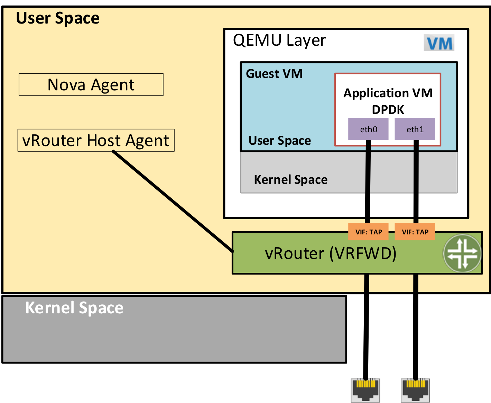

Nothing in kernel, entire DPDK vrouter runs in user-space as an application. It talks to the guest which is also an application. Because it runs in the context of qemu. Because of vhost-user, there is a communication channel between the vrouter and the guest. Earlier agent used to talk to vrouter using system calls. Now its unix sockets. Packet enters the NIC. NIC is polled continuously by DPDK, the packet directly enters DPDK. And DPDK does all the encap/decap, all vrouter functionality. To send it to the guest, it uses vhost user and puts in the ring to guest.

DPDK is an multi threaded application. Comes as a set of pthreads which has affinity to the cores. We call it lcores. We also have a bunch of helper pthreads/lcores and bunch of forwarding lcores. At provisioning time, we decide how many forwarding threads are needed for vrouter and spawn them on DPDK initialization. These threads polls NIC, vritio ring etc. Other threads exist - netlink thread, vhost thread etc, pkt0 thread, KNI/tap thread. 
 We have multi producer single consumer implementation. We have one lock. 
 
How to send packets to linux kernel?
PAcket comes from NIC and enters vrouter. We use KNI or tap to reinject packets from user space to kernel space. In KNI, there is a kernel module calleed KNI. There is a ring shared between DPDK and KNI. DPDK puts in the ring and KNI module which is polling the ring dequeues it and sends it to the tap interface. 

== *[underline]#chapter 4: Contrail DPDK vrouter packet forwarding#* (kiran & prz)

=== interfaces and queues

Contrail DPDK vrouter as any DPDK application is based on queue management.

Queue packets processing consists in :

- queues: in a network interface
- pthreads (lcore): for packet enqueue or dequeue (packet polling)
- descriptor rings (TX/RX): for packet transfer between interface queue and host memory (mbuf)
- memory spaces (mempool)

.muf, queue, ring, lcore
image::diagrams/extracted-media-ContrailPerformanceGuidev3.2.docx/media/image26.png[image,width=491,height=206]

3 kinds of interfaces are connected onto the vrouter :

- Physical interface card (usually a bond) : vif 0/0
- Internal processing interfaces (pkt0) : vif 0/2
- Virtual Machine Interfaces : vif 0/n

For each vrouter interface one or several queues are managed.
Two kinds of interfaces have to be taken in consideration :

- vrouter physical interface card: one TX queue and one RX queue are created
  for each CPU pinned to vrouter.  Onto vrouter virtual machine.
- vrouter virtual machine interface: one or several queues could be
  implemented for each virtual NIC. It depends if the given virtual machine is
  supporting multi-queue or not.

.Q&A
****
.about vhost0(vif 0/1):

here is a drawing which is describing how are plugged each internal nic onto
vrouter dataplane. Vhost0 is belonging to vrouter agent, not to vrouter
dataplane. This is vif0/1 which is connected onto the vrouter dapaplane.

//image:diagrams/extracted-media-QA.docx/media/image1.emf[image,width=601,height=483]
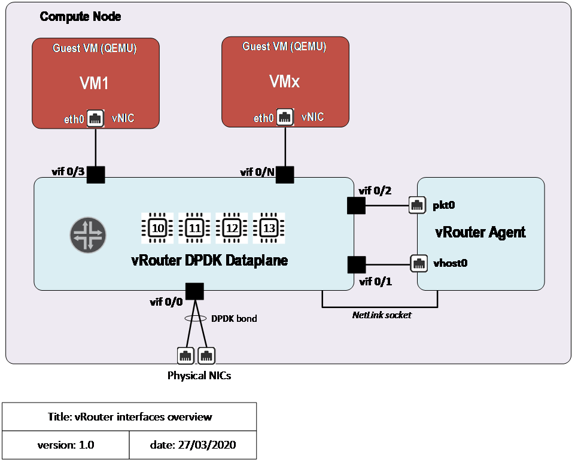

.regarding "one Q per cpu": is Q a concept in NIC or in CPU?

DPDK application principle is simple.

We are allocating as many as needed CPUs as required to process incoming packets.
You have to consider the application we are building with DPDK.
For Juniper/Contrail this is a vrouter processing packets coming from a single physical Interface (to be sent to VM).
This single interface can be a bond. But at vrouter level there is always a unique physical interface.
All the dimensioning consist in “how many CPU do I need to process packet coming from this interface (vif0) ?”

The answer is N CPU. For each CPU we are allocating 1 processing bidirectional
Q (2 in reality because there are 2 directions = 1 for RX and one for RX) which
are the buffers in which we store the packets coming from the physical NIC (RX
Q) or to sent to the physical NIC (TX Q).

So N CPU, means N bidirectional Q (in fact this is 2 x N single direction Q N x RX + N x TX).
****

In the diagram below we have a first overview of vrouter packet processing for
an external packet to be sent to virtual machine instances.

[[packet-processing]] 
.vrouter packet processing (first overview)
//image::diagrams/extracted-media-ContrailPerformanceGuidev3.2.docx/media/image25.png[image,width=293,height=363]
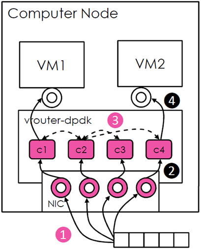

There are 4 main steps in packet processing :

- *step one*: incoming packets are put into RX queues by the network interface card.
- *step two:* each CPU (c1 to c4) is polling its allocated queue in order to
  put each packet into host memory in order to be processed.
- *step three:* packet processing is achieved by a forwarding thread.  This
  forwarding thread could be performed onto any CPU allocated to vrouter.
- *step four:* after being processed, packet is copied onto virtual machine TX interface queues.

ping? here term "copy" needs to be double quoted, as we understand it is not a
real copy, or copied only once - from NIC to main memory. later "copy" is just
sharing the pointer/addresses/descriptors...

NOTE: these 4 steps are performed for VxLAN and MPLSoUDP. For MPLSoGRE, it's
different. this will be further explained later.

////
backup content:
since RSS (hashing algorithm) computed by the NIC is giving a
unique answer for most of the flows, there is no traffic spreading across CPU
(step 2). 

In this particular case there is only one polling CPU.

A hash is calculated onto the incoming decapsulated packets (inner packet) in
order to spread them on several "processing cores" (step 3).
////

=== DPDK VM incoming traffic (from underlay network)

When the traffic is coming from the underlay network, encapsulated packets are
received DPDK compute Physical interface which is bound to vrouter vif 0/0:

.ingress forwarding process
//image::diagrams/extracted-media-ContrailPerformanceGuidev3.2.docx/media/image15.png[image,width=708,height=289]
image::diagrams/extracted-media-ContrailPerformanceGuidev3.2.docx/media/image15.png[image]

.ingress fowarding process

Incoming packets are processed in 3 steps :

- packets are polled by a vrouter polling core and decapsulated.
- decapsulated packet are sent by polling core to a processing core
- processing core is delivering packet to a destination vif interface

Two main situations have to be considered for processing core selection :

- incoming underlay packets are encapsulated with MPLS over GRE
- incoming underlay packets are encapsulated with MPLS over UDP or VxLAN

==== step 1: NIC spreading (RSS)

.Contrail DPDK vRouter architecture
//image::diagrams/extracted-media-ContrailPerformanceGuidev3.2.docx/media/image33.png[image,width=602,height=404]
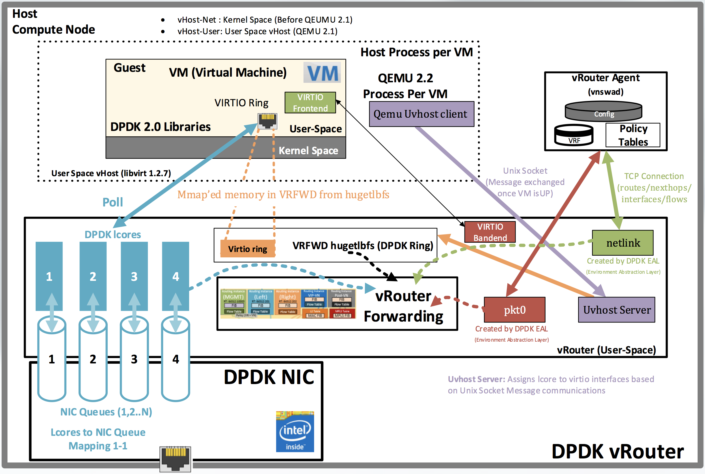

The packet arrives at a physical NIC (pNIC) 
//encapsulated in a MPLSoGRE header (outer header). 
The pNIC computes a hash on the packet outer header

- this hash is called "RSS hash" (Receive Side Scaling)
- this hash is computed onto the encapsulated packet and does not take into
  account the header of the tenant packet (inner header)

Physical NIC (usually an interface bond) itself spread packets across its
queues using 5-tuple hashing function (source IP, destination IP, source port,
destination port and protocol). 

Depending on overlay encapsulation protocol used, the incoming traffic is well
balanced or not onto NIC card RX queues :

- *MPLSoUDP, VxLAN encapsulation protocols* : provide a good entropy.
  * A good hashing will be achieved with their UDP datagrams (several source
    port values are used for the same tunnel IP source and destination pair).
- *MPLSoGRE encapsulation protocol* : not provide a good entropy.
  * Packets from one SDN gateway will be placed only in a single queue, which
    is not an optimal host resource utilization.
  * With a second gateway it is likely to have two NIC queues utilized.

That is the reason Juniper recommends implementing MPLSoUDP on Juniper MXes
(supported in Junos >=16.2).

Based on the "RSS hash", the pNIC selects a queue and writes the packet to the
queue (RX QUEUE into the previous diagram).

.RSS hash
image::diagrams/extracted-media-ContrailPerformanceGuidev3.2.docx/media/image24.png[image,width=664,height=165]

==== step 2: Polling core

Then incoming packet is dequeued by the polling logical core (step 1) :

- there is one queue per vRouter logical core
- vRouter polling logical core in charge of that queue manages packet transfer
  from NIC queue to a free mbuf into the mempool.
- when incoming packets are encapsulated with MPLS over GRE, vRouter polling
  logical core in charge of that queue reads the packet header, computes a
  hash, and selects a vRouter processing logical core based on the hash.

Hashing algorithm is in `vr_dpdk_ethdev.c` module (https://github.com/Juniper/contrail-vrouter/blob/R5.0/dpdk/vr_dpdk_ethdev.c#L873)

////
redundent.

.Q&A
****
per <<packet-processing>> what it meant here is there are 2 hash: 

* 1st hash is done by NIC based on outer header, to multiple queue, to multiple polling core.
* 2nd hash is done by each polling core based on inner header, to multiple forwarding core.

but for MPLSoGRE only 2nd hash happens.

First hash is calculated on underlay packet outer header by the NIC card.

Second hash is calculated by vrouter application on inner header (on
decapsulated packet) because if the first hash result would be reused, we would
have same selected CPU for packet processing than those used for packet
polling.

This is this second hash calculation that is allowing to use a different CPU
for packet processing than for packet polling and to spread the DPDK vrouter
load on all CPUs when MPLSoGRE is used:

This is explained in this drawing. Packets are all polled by the first CPU (due
to poor entropy).

Then due to second hash calculation, packets are re-balanced on the 3 others.

//image:diagrams/extracted-media-QA.docx/media/image6.emf[image,width=601,height=298]
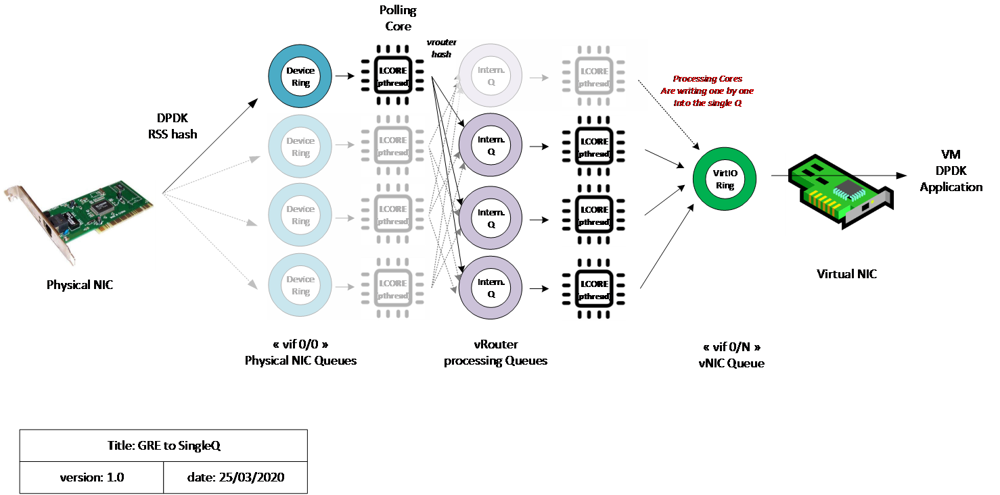
****
////

==== step 3: Forwarding core (MPLSoGRE)

In previous stage polling CPU bound to the queue on which a packet has been
received, is triggering packet transfer from given NIC RX queue to mbuf.

This CPU (here CPU 0) will also choose which CPU (forwarding CPU) will have to
process the packet (decapsulation, routing, switching, etc).

So a hash will be calculated onto polling CPU on decapsulated packet in order
to select a forwarding CPU (decapsulated packet should have a better entropy
than encapsulated one with MPLS over GRE).

Then the forwarding logical core is processing the packet (step 2). Forwarding
CPU is in charge to do :

- flow lookup,
- flow enforcement (switching, routing, NAT, packet transformation)
- decapsulation,
- packet delivery to VM RX queue (vRouter vif TX-QUEUE)

In the diagram below it is shown a situation where the polling CPU core is
selecting another CPU for packet processing.

This would be the case for MPLSoGRE traffic, since the hash performed by the
NIC is likely not efficient :

.DPDK Contrail vRouter packet walk-through from NIC to DPDK guest
//image::diagrams/extracted-media-ContrailPerformanceGuidev3.2.docx/media/image11.png[image,width=605,height=321]
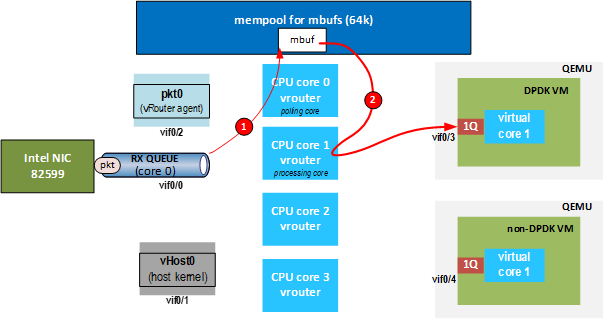

==== step 3: Forwarding core (MPLSoUDP/VxLAN)

In previous stage polling CPU bound to the queue on which a packet has been
received, is triggering packet transfer from given NIC RX queue to mbuf.

This CPU (here CPU 0) will also choose which CPU (forwarding CPU) will have to
process the packet (decapsulation, routing, switching, etc).

But as incoming encapsulated packets are using UDP protocol, a good entropy is
expected for incoming encapsulated traffic.
*No hash is recalculated on the polling core, and each incoming packet will be
processed on the same forwarding core than the polling one.*

////
comment out as known tips.

.Q&A
****
this is the diff with MPLSoGRE, where we see "an extra hop"

Yes. Indeed.

We have to simplify explanations … this is currently very confusing.

In fact this is not so complicated. You have two situations:

* first: processing core is not the same as polling core (there are 2 hash used
  – first calculated by pNIC or vNIC, second one by vrouter)
* second: processing and polling core are the same (we are using only 1 hash
  calculated by pNIC or vNIC)

Next we could provide a matrix stating when 1 or 2 hash are used, and
illustrate some situation with diagrams.
****
////

In the diagram below, it is shown a situation where the polling CPU core is the
same as the forwarding CPU, which will be the case for MPLSoUDP and VXLAN
packets from the NIC:

.DPDK Contrail vRouter packet walk-through from NIC to DPDK guest
//image::diagrams/extracted-media-ContrailPerformanceGuidev3.2.docx/media/image34.png[image,width=605,height=321]
image::diagrams/extracted-media-ContrailPerformanceGuidev3.2.docx/media/image34.png[image]

When MPLS over UDP is used, there is internal traffic load balancing onto vrouter CPU.
Incoming packets are processed with the same forwarding core as polling core :

.ingress MPLS over UDP traffic forwarding
//image::diagrams/extracted-media-ContrailPerformanceGuidev3.2.docx/media/image4.png[image,width=708,height=276]
image::diagrams/extracted-media-ContrailPerformanceGuidev3.2.docx/media/image4.png[image]

It can be easily shown using a traffic generator to send a "single UDP" flow
onto a virtual instance.

When single UDP flow is reaching the vrouter, `RX port packets` and `RX packets`
counters on vif 0/0 have the same values for a same lcore: Here the VM incoming
traffic is polled and processed by core 12:

.UDP flow: polling CPU is same as forwarding CPU
//image::diagrams/extracted-media-ContrailPerformanceGuidev3.2.docx/media/image46.png[image,width=708,height=270]
image::diagrams/extracted-media-ContrailPerformanceGuidev3.2.docx/media/image46.png[image]

Table above has been made using real single flow traffic seen on each vif 0/0
and vif 0/3 interface (vNIC) with `vif --get` command (cf appendixes)

.Q&A
****
how is this neat output captured?

* https://github.com/PrzemekGrygiel/DPDKstats
* https://drive.google.com/open?id=1mhxzRlulBqo3SfbGOywy2smG-NdC5dVN

////
This is a script I made in order to display (at least to have a representation
– I’ve enriched a Premecz Python program) about packet processing. I did it on
Premecz lab during performance tests we’ve made early this year.

//same as above
//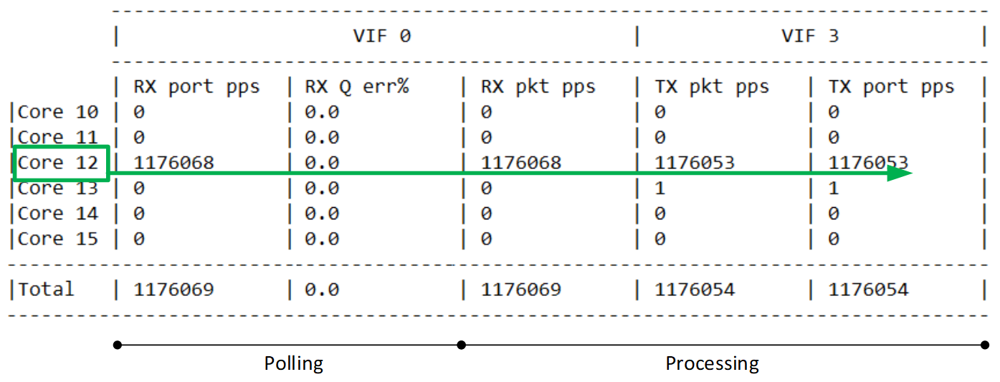
////
****

=== DPDK VM outgoing traffic

vRouter forwarding threads are also responsible for polling `virtio` interface
queues.  The decision which thread will poll which virtio queue is made by
Contrail DPDK vRouter.

If VM uses multiqueue then more vRouter forwarding threads (CPU cores) will be
engaged in receiving packets from a single VM.

.DPDK Contrail vRouter packet walk-through from DPDK guest to NIC
//image::diagrams/extracted-media-ContrailPerformanceGuidev3.2.docx/media/image28.png[image,width=604,height=321]
image::diagrams/extracted-media-ContrailPerformanceGuidev3.2.docx/media/image28.png[image]

- The packet is placed on a vNIC TX queue (vRouter vif RX queue) by the Virtual
  machine.
- A given vNIC TX queue is always polled by the same vRouter logical core.
- A round robin algorithm (described in next section) is used to assign vNIC
  queues to logical cores.
- vNIC sub-interfaces are sharing TX/RX queues with their parent interface.
  Hence the same logical core is polling these queues.

Then, the incoming packet is dequeued by the polling logical core (step 1) :

- vRouter polling logical core in charge of that queue reads the packet header,
- computes a hash, and selects a vRouter processing logical core based on the hash.

.Q&A
****
question: #2 and #3 statements are conflicting?

answer: Not very well described indeed.

* Step 2 is done during vnic life (how each packet is processed)
* Step 3 is done once … at vnic plugin on vrouter
****

.Q&A
****
no 1x1 mapping between vNIC queue and forwarding threads? as with pNIC?

Yes, there is. But you have 2 cases to consider. SingleQ and MultiQ NIC.  Also,
there is a balancing mechanism in order to attach queue0 of each NIC not on a
same CPU ( Cf: vNIC queues - Polling Core Assignment (R1910) )

Here, multiQ case:

Each CPU is bound to a Q :
//image:diagrams/extracted-media-QA.docx/media/image5.emf[image,width=601,height=276]
image:diagrams/extracted-media-QA.docx/media/image5.png[image]

But it is only part of the full view. You have to consider each direction … and
type of traffic.

See my drawings.
****

==== step 1: polling core 

.polling core assignment for vNIC queues (R1910)

vNIC queues are assigned to logical cores in the following way:

- The forwarding core that is currently polling the least number of queues is
  selected, with a tie won by the core with the lowest number (the first
  forwarding core is lcore 10)
- A queue is created for each forwarding core, starting with the least used
  core and wrapping around to the start of the forwarding cores after the
  maximum is reached. However, only the first queue is actually enabled.  All
  of the other queues will only be used if the VM supports multiqueue and
  enables them.
- If the VM supports multiqueue, then it enables the additional queues, at
  which point they are mapped to the forwarding core they were assigned when
  they were created.

Log messages showing this process can be seen in the
`/var/log/containers/contrail/contrail-vrouter-dpdk.log` file.

    2020-01-22 13:53:28,385 VROUTER: lcore 11 RX from HW queue 0
    2020-01-22 13:53:28,385 VROUTER: lcore 12 RX from HW queue 1
    2020-01-22 13:53:28,385 VROUTER: lcore 13 RX from HW queue 2
    2020-01-22 13:53:28,385 VROUTER: lcore 14 RX from HW queue 3
    2020-01-22 13:53:28,385 VROUTER: lcore 15 RX from HW queue 4
    2020-01-22 13:53:28,385 VROUTER: lcore 10 RX from HW queue 5

*When interface is added and the queue to forwarding core mappings are made.*
There are six forwarding cores in this setup. Only the first queue is actually
enabled at this point.

The remaining queues will use the mentioned forwarding cores if the VM chooses
to enable them (i.e. it supports multiqueue).

    2020-01-22 14:02:44,060 UVHOST: Client _tap4966ea8d-49: setting vring 0 ready state 1
    2020-01-22 14:02:44,060 UVHOST: Client _tap4966ea8d-49: setting vring 1 ready state 1
    2020-01-22 14:02:44,060 UVHOST: Client _tap4966ea8d-49: setting vring 2 ready state 1
    2020-01-22 14:02:44,060 UVHOST: Client _tap4966ea8d-49: setting vring 3 ready state 1
    2020-01-22 14:02:44,060 UVHOST: Client _tap4966ea8d-49: setting vring 4 ready state 1
    2020-01-22 14:02:44,060 UVHOST: Client _tap4966ea8d-49: setting vring 5 ready state 1
    2020-01-22 14:02:44,060 UVHOST: Client _tap4966ea8d-49: setting vring 6 ready state 1
    2020-01-22 14:02:44,060 UVHOST: Client _tap4966ea8d-49: setting vring 7 ready state 1
    2020-01-22 14:02:44,061 UVHOST: Client _tap4966ea8d-49: setting vring 8 ready state 0
    2020-01-22 14:02:44,061 UVHOST: Client _tap4966ea8d-49: setting vring 9 ready state 0

*When a VM (in this case a vSRX) requests to enable some of its available
queues.* The vrings here correspond to both transmit and receive queues.

The receive queues are the odd numbers. Divide them by 2 (discard the
remainder) to get the queue number.  i.e. vring 1 is queue 0. ready state 1 =
enabled.  ready state 0 = disabled.  In this example, the vSRX is only enabling
4 queues:

==== step 2: RSS

TIP: Hashing algorithm is in vr_dpdk_ethdev.c module
https://github.com/Juniper/contrail-vrouter/blob/R5.0/dpdk/vr_dpdk_ethdev.c#L873

RSS hashing depends on the packet type:

- for non-UDP/TCP IP packets (except GRE), a 2-tuple is used for the hash:
  source IP address, destination IP address
- for GRE, a hash is done using the source IP address and destination IP
  address, followed by a hash for the GRE key if present
- for TCP or UDP IP packets (IPv4 or IPv6), a hash is done for the source IP
  address and destination IP address followed by a hash for the source port and
  destination port
- Ethernet information is not taken into consideration for hash computation:
  ** VLAN tag (eg if a sub-interface is used), are *not* used for the hash
  ** source and destination MAC addresses are *not* used for the hash
- Non-IPv4/IPv6 packets (i.e. L2 packets) will *not* have a hash performed and
  will be processed by their polling core.

==== step 3: forwarding core

When polling CPU core (in the above example CPU core 3) polls the packet from
VM virtio interface queue it selects which forwarding CPU core will process the
incoming packet. This forwarding CPU core does flow lookup, flow enforcement,
encapsulation and packet delivery to NIC transmit queue.

Then forwarding logical core is processing the packet (step 2). Forwarding CPU
is in charge to do :

- flow lookup,
- flow enforcement (switching, routing, NAT, packet transformation)
- encapsulation,
- packet delivery to physical NIC TX queue

For VM incoming traffic a hash is calculated in order to rebalance received
traffic on a given polling core to all other forwarding cores :

.egress traffic coming from VM
//image::diagrams/extracted-media-ContrailPerformanceGuidev3.2.docx/media/image6.png[image,width=708,height=277]
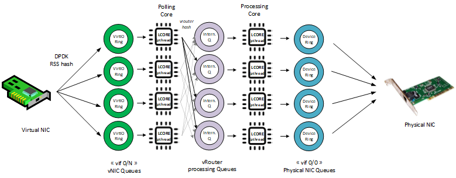

It can be easily shown using a traffic generator to send a "single UDP" flow
onto a virtual instance.

When single UDP flow is reaching the vrouter, `RX port` and `RX packets` 
counters on vif 0/N have the same values for distinct lcores.

Here the VM incoming traffic is polled by core 13 and processed by core 11:

.egress flow: polling CPU is different as forwarding CPU
image::diagrams/extracted-media-ContrailPerformanceGuidev3.2.docx/media/image23.png[image,width=708,height=260]

Table above has been made using real single flow traffic seen on each vif 0/0
and vif 0/3 interface (vNIC) with `vif --get` command (cf appendixes)

regarding `RX port` and `RX packet`, see <<Packet flow from a VM NIC to compute node Physical NIC - counters placement>>

.Q&A
****
this is different than ingress traffic received from pNIC - only MPLSoGRE
traffic will use a different forwarding thread than polling thread.

Yes, and this is something that will change in next releases. To be discussed
with Kiran and Premecz. It seems we will provide the ability to disable this
hash calculation done at vrouter level to rebalance polled packets onto
different CPU to be processed.
****

=== Packet Flow Summary (Based on R1910)

[cols=",,",options="header",]
|====
|*Packet Origination*|*Packet Type*                                |*Action*
|pNIC                |IPv4 MPLSoUDP or VXLAN                       |Processed by polling core
|                    |IPv4 MPLSoGRE - Inner packet is IPv4 or IPv6 |Distributed to a different processing core based on hash of inner packet.
|                    |IPv4 MPLSoGRE - Inner packet not IPv4 or IPV6|Processed by polling core.
|vNIC                |IPv4 MPLSoGRE - Inner packet is iPv4 or IPV6 |Distributed to a different processing core based on hash of inner packet.
|                    |IPv4 MPLSoGRE - Inner packet not IPv4 or IPv6|Processed by polling core
|                    |All other IPv4 packets                       |Distributed to a different processing core based on hash of packet.
|                    |All IPv6 packets                             |Distributed to a different processing core based on hash of packet.
|                    |All non-IPv4/IPv6 packets (i.e. L2 packets)  |Processed by polling core
|====

NOTE: whenever the polling core performs a hash to distribute the packet to a
processing core, the polling core will never select itself to process the
packet.

.Q&A
****
why diff between vNIC and pNIC? when pNIC got MPLSoUDP (just a UDP packet
anyway), it do RSS hashing and put in differnet pNIC queue -> diff polling
core, so polling core does not need to hash again and just processed it. why
vNIC do it differently? vNIC got UDP packet from VM, it should again do hash
and place it into different queue, so different polling core will just poll and
process it. why distribute to other cores here?

First, I think this provided matrix has to be discussed and revised. 
Personally I do not understand this concept of “IPv4 MPLSoGRE” when packet is
originated onto a vNIC.

My understanding is this situation :

[.underline]#Incoming packets from Physical NIC#

[cols=",,",options="header",]
|===
|Outer packet Type     |Inner packet type                    |Action
|IPv4 MPLSoUDP or VXLAN|any                                  |Polling = Processing core (single hash)
|IPv4 MPLSoGRE         |IP (v4 or v6)                        |Polling != Processing core (two hash calc.)
|                      |Not IP (Ethernet Frame for instance) |Polling = Processing core (single hash)
|IPv4                  |Not encapsulated (like XMPP messages)|??
|===

[.underline]#Incoming packets from Virtual NIC#

[cols=",",options="header",]
|===
|Packet type                         |Action
|IP (v4 or v6)                       |Polling != Processing core (two hash calc.)
|Not IP (Ethernet Frame for instance)|Polling = Processing core (single hash)
|===

Second: Why all this complex stuff ?

This is (it was) required by poor entropy situations:

* MPLS GRE encapsulation (incoming traffic from other baremetal computes)
* SingleQ VM (incoming traffic from virtual instances)

In both situations only 1 polling core is selected. So it is useless to
allocate lots of CPU onto your vrouter if due to poor entropy / or single Q VM,
you are using only one core.

This is why Contrail has created a mechanism to spread the load on all CPU.
This mechanism consist in different hash calculation in order to select another
CPU for processing.

This was a nice solution till, GRE was the main encapsulation protocol
supported and most of DPDK VM were single Q.

But now, as most of our customers are using UDP encapsulation protocols and
MultiQ VNF, this old nice mechanism is really a drawback. It brings an
additional calculation and an additional queuing steps that is badly impacting
vrouter performances.

This is why in next release the idea is to propose a setup in which all packets
are polled and processed by the same CPU. It will be worth to use this new
setup when your VNF are MultiQ and when using UDP encapsulations.
****

////
[NOTE]
===
ping: rule of thumb in all cases:

* distribute traffic between cores whenever possible
  - pNIC: MPLSoGRE no good outer header hashing to different polling core, so
    do inner header hashing and do distributing to other forwarding threads
  - pNIC: MPLSoUDP/vXLAN good outer header hashing to different polling core,
    so no need inner hashing and no distribution again
  - vNIC: overlay IP good hashing to different polling core, 
* distribute once only
===
////

The selection of available processing cores for each polling core can be seen
in the `/var/log/containers/contrail/contrail-vrouter-dpdk.log` file.

    2020-01-07 13:08:01,403 VROUTER: Lcore 10: distributing MPLSoGRE packets to [11,12,13,14,15]
    2020-01-07 13:08:01,403 VROUTER: Lcore 12: distributing MPLSoGRE packets to [10,11,13,14,15]
    2020-01-07 13:08:01,403 VROUTER: Lcore 14: distributing MPLSoGRE packets to [10,11,12,13,15]
    2020-01-07 13:08:01,403 VROUTER: Lcore 11: distributing MPLSoGRE packets to [10,12,13,14,15]
    2020-01-07 13:08:01,404 VROUTER: Lcore 13: distributing MPLSoGRE packets to [10,11,12,14,15]
    2020-01-07 13:08:01,404 VROUTER: Lcore 15: distributing MPLSoGRE packets to [10,11,12,13,14]

It mentions MPLSoGRE, but this applies to all packets that are distributed via
hashing by the polling core:

=== *Non DPDK VM* on DPDK vrouter

* When sending packets from NIC to non-DPDK VM, DPDK vRouter raises an interrupt in the guest.
* This is an additional step after copying the packet to that VM.
* The interrupt is only needed because the VM is not polling for packets.
* The vRouter writes to a file descriptor, which tells the kernel to raise an interrupt to non-DPDK VM.
* The file descriptor is sent by Qemu to vrouter when the VM is spawned.
* Also note that an Interrupt is raised for a burst of packets, not for every packet.

To avoid interrupts raised by DPDK vRouter (required to raise packet processing
by QEMU/KVM) that influence packets processing Juniper recommends to only
connect DPDK VMs and DPDK interfaces to DPDK vRouter.

Putting non-DPDK VMs on a DPDK node is affecting performance of both VM and vRouter:

- VM performance is impacted because each interrupt raised would cause a
  "VMExit" (it has a very bad impact on performance)
- vRouter performance is also impacted since it needs to do additional work of
  "raising an interrupt" after it enqueues the packet to the vNIC Ring.

*As a result of these, the performance numbers would be the similar as that of kernel vRouter.*

.Step by Step vif (vhost-user) setup and non DPDK VM packet processing:

. When the VM is spawned, QEMU registers an fd (file descriptor) for the guest
  (irqfd) and passes to the backend (vRouter). The guest listens to this fd for
  changes to process the packets.

. registration mechanism for this fd is provided by KVM kernel module.  This is
  KVM module that actually provides a `wait-notify` mechanism between the guest
  and the backend (vRouter)

. virtual machine is setting a flag `VRING_AVAIL_F_NO_INTERRUPT` into VirtIO
  ring by which vRouter will be aware it needs to notify the Guest VM that a
  packet has been delivered (this flag is not set when VM is using DPDK).

. once the vRouter gets hold of this fd, all it needs to do is to enqueue the
  packets to the virtio ring and write to that fd.

. KVM injects this event to the VM as an interrupt.  In this process, the VM
  needs a 'VMExit'

. VMExit latency is very high (around 10K clock cycles). This is further
  compounded by the NAPI latency. It has a very bad impact on VM performance.
  vRouter performance is also impacted due to the extra work of writing to the
  fd (which interrupts the guest).

=== *[underline]#vNIC queues#*

In the case of DPDK vrouter, the support for multiqueue virtio is available
from Contrail 3.1 onwards.

.vNIC single queue vs multiqueue
//image::diagrams/extracted-media-ContrailPerformanceGuidev3.2.docx/media/image40.png[Screen Shot 2017-11-13 at 10.54.12.png,width=624,height=355]
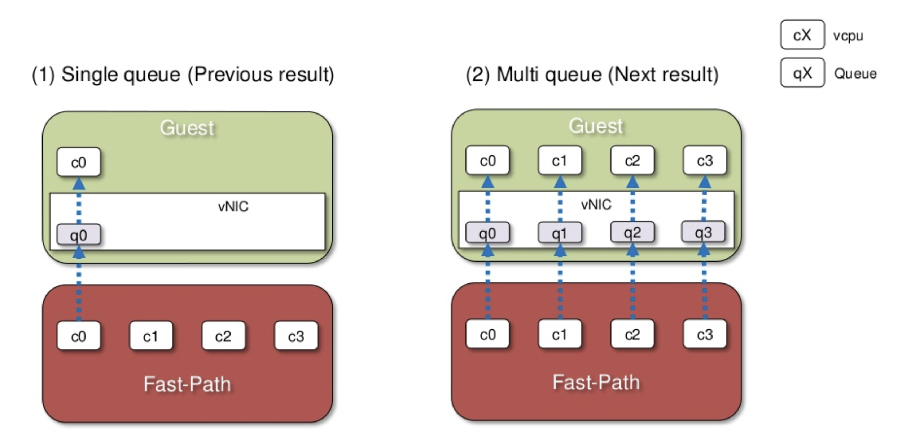

==== Single queue virtIO

The network performance does not scale as the number of vCPUs increases.

Guest cannot transmit or retrieve packets in parallel as `virtio-net` have only
one TX and RX.
`virtio-net` drivers must be synchronized before sending and receiving packets.

It is useless to assign more CPU to vrouter in order to increase packet
processing rate, as only one vrouter CPU is used to poll the single vNIC queue.

Moreover, all vrouter CPU could have a packet to transmit to the vNIC single
queue which is becoming a congestion point.

If we add more CPU, we increase the pressure on the vNIC single queue and it
could lead to jitter and even packet drop (buffer overflow).

==== Multiqueue virtIO

.CPU assigned for Multiqueue and virtIO

When multiqueue is used on a Guest VM, In the ideal scenario, each multiqueue
vNIC is configured with the same number of queue than the number of CPU
allocated to vrouter for packet processing, because the vrouter will only be
able to sustain guest vNIC configured with a number of queue below or equal to
the number for processing core allocated to the vrouter.  The difference with
non-DPDK is that vRouter runs in the user space instead of host kernel.  

Also there is a vhost userspace process wherein the vRouter copies packets
to/from the VM.

Every queue inside the VM maps to a virtio ring on the host user space.

.vNIC multiqueue
//image::diagrams/extracted-media-ContrailPerformanceGuidev3.2.docx/media/image41.png[Screen Shot 2017-11-10 at 16.32.08.png,width=523,height=320]
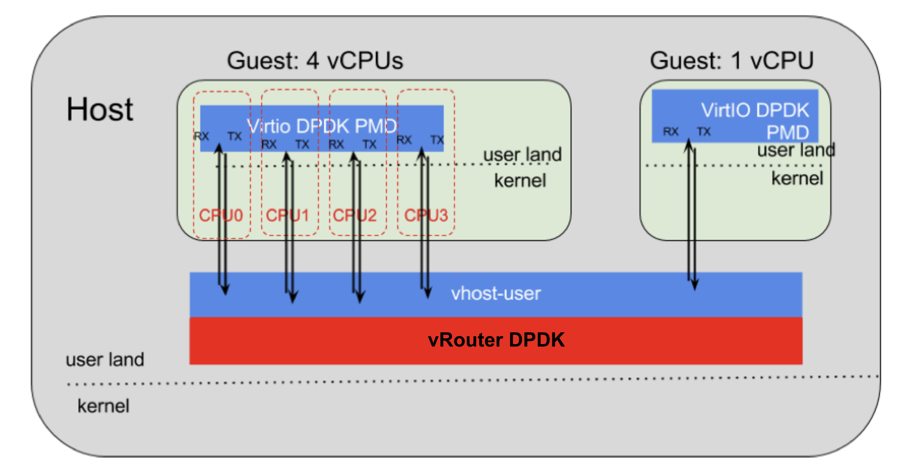

Some of the offload capabilities, e.g. GRO (Generic Receive Offload), is not
supported with multiqueue virtio on DPDK vrouter in Contrail 3.2.

.DPDK Multiqueue packet walk-through

In this case vRouter runs as a multi-core process that exists on all assigned
cores.

There is also a scale-out approach to packet processing using multiple cores so
the performance of one VM is NOT limited by the performance of 1 core.

.traffic to VM
A vRouter might have more cores than there are queues in the VM.
Queues can only be shared when the vRouter cores send to the VM queue.

.traffic from VM
When receiving from the queue, exactly one vRouter core will read from a queue
(*_i.e. receive queues are not shared, in order to prevent packet
reordering_*).

.lab capture
****
.3.2 lab
[source, sh, linenums]
----
root@bcomp79:~# ps aux | grep vhost-
root      1737  0.0  0.0      0     0 ?        S    15:20   0:00 [vhost-1734]
root      1738  0.0  0.0      0     0 ?        S    15:20   0:00 [vhost-1734]
root      1739  0.0  0.0      0     0 ?        S    15:20   0:00 [vhost-1734]
----
****

.Q&A
****
question: this "vhost userspace process" is kernel vrouter only?

answer:

In my opinion we have to explain:

- DPDK vrouter is running in user space (this is the goal of DPDK)
- Kernel vouter dataplane is running in Kernel space (vrouter.ko module)

But after, this kernel/user space has not only to be considered at vrouter level.
You also have to consider the virtualization layer:

- what about virtio (QEMU capaability) ?
- what about the VM itself (using DPDK or not) ?

QEMU, few years ago was not able to run in userspace. So, it was creating
performance issue when used with DPDK applications.

VNF, were also running Kernel packet processing stack

Drawback is interupt mechanisms it required that is slowering packet processing
and Kernel to User context swap (which is CPU intensive) is requires.

Nowaday, lots of VNF are DPDK and QEMU is supporting lots of scenarios.

Ideal situation is to get everything running at userspace level:

- DPDK vrouter
- DPDK VNF (multiQ - same number of Q than vrouter)
- virtio also running in user space (vhost-user)

All these situations are described in this diagram:

//image:diagrams/extracted-media-QA.docx/media/image2.emf[image,width=466,height=464]

The last drawing at right is the best situation and the one that is providing the best performance.

The worst is the first diagram at left. Both diagrams in the middle are providing drawbacks:

* When DPDK VM is used onto a Kernel vRouter, vrouter will will slow down packet processing
* When Kernel VM is used onto a DPDK vrouter, Kernel VM will slow down packet processing

So, this is a pity situation to mix DPDK and not-DPDK element (but sometimes it
can’t be avoided)

So, we have to explain that vrouter can’t solve everything. Part of the job has
to be done at VNF layer.

*In my opinion, the main goal of this book is to explain the (nowadays) optimal situation:*

- DPDK vrouter
- UDP overlay protocol (MPLSoUDP or VxLAN)
- 200X release: with 2 hash mechanism disabled (discuss with Kiran and Premecz about X)
- DPDK VNF (multiQ – with same number of Q than vrouter)
****

==== vNIC queues "queue size" configuration (RedHat OpenStack)

vNIC queues are not configured by Contrail vRouter, they are managed by OpenStack.
Rqueue Size are defined at OpenStack level (using libvirt) : `/etc/nova/nova.conf`

[source, sh, linenums]
----
# Configure virtio rx queue size.
# This option is only usable for virtio-net device with vhost and
# vhost-user backend.  Available only with QEMU/KVM.  Requires libvirt
# v2.3 QEMU v2.7. (integer value)
# Possible values:
# 256 - <No description provided>
# 512 - <No description provided>
# 1024 - <No description provided>
#rx_queue_size=<None>

# Configure virtio tx queue size.
# This option is only usable for virtio-net device with vhost-user
# backend.  Available only with QEMU/KVM.  Requires libvirt v3.7 QEMU
# v2.10. (integer value)
# Possible values:
# 256 - <No description provided>
# 512 - <No description provided>
# 1024 - <No description provided>
#tx_queue_size=<None>
----

Nova configuration file values are provisioned with TripleO.

vNIC queues size can be defined using `NovaLibvirtRxQueueSize` and
`NovaLibvirtRxQueueSize` environment parameters.  By default they are
configured with a 512 value.

Nova configuration file is configured with
`<tripleo-templates-root-dir>/puppet/services/nova-compute.yaml` file:

[source, yaml, linenums]
----
NovaLibvirtRxQueueSize:
   description: >
     virtio-net RX queue size. Valid values are 256, 512, 1024
   default: 512
   type: number
   constraints:
     - allowed_values: [ 256, 512, 1024 ]
   tags:
     - role_specific
 NovaLibvirtTxQueueSize:
   description: >
     virtio-net TX queue size. Valid values are 256, 512, 1024
   default: 512
   type: number
   constraints:
     - allowed_values: [ 256, 512, 1024 ]
----

==== vNIC queues "queue number" configuration (RedHat OpenStack)

.Enable Multiqueue on OpenStack instances

To enable multiqueue with DPDK in a Glance image, we add metadata
`hw_vif_multiqueue_enabled="true"`:

    openstack image set --property hw_vif_multiqueue_enabled="true" [image name or ID]

.number of vNIC queues
Number of queues to be created can’t be specified with Glance metadata.
Currently, the number of queues will match the number of vCPUs, defined for the
instance.

*Nova is configuring automatically the number of queues of each vNIC.  There is
no way to manually define the number of queues to be created for each vNIC.*
We can only change the number of queues of a given vNIC after the virtual
instance has been started, using some Linux commande into the virtual machine
whose vNIC configuration has to be modified (cf next section).

Nova is using `vif.py` script to create instance virtual interfaces
(https://github.com/openstack/nova/blob/master/nova/virt/libvirt/vif.py)

Number of configured queues for a vif is depending on:

- Compute node kernel release
- Number of vCPU configured onto the virtual instance

.kernel 3.x
When a Linux Kernel 3.x is used (RHOSP 13), a maximum of 8 queues are
configured by Nova for each vif.

- when an instance is configured with 8 or less vCPUs: the number of queues
  configured on its multiqueues vif is equal to the number of vCPU.
- when an instance is configured with more than 8 vCPUs: the number of queues
  configured on its multiqueues vif is equal 8

.kernel 4.x
When a Linux Kernel 4.x is used (RHOSP 16), the same algorithm is used but
using 256 instead of 8 as a maximum of queues to be configured by each vif.

[source, sh, linenums]
----
$ vi /usr/lib/python2.7/site-packages/nova/virt/libvirt/vif.py
...
    def _get_max_tap_queues(self):
        # NOTE(kengo.sakai): In kernels prior to 3.0,
        # multiple queues on a tap interface is not supported.
        # In kernels 3.x, the number of queues on a tap interface
        # is limited to 8. From 4.0, the number is 256.
        # See: https://bugs.launchpad.net/nova/+bug/1570631
        kernel_version = int(os.uname()[2].split(".")[0])
        if kernel_version <= 2:
            return 1
        elif kernel_version == 3:
            return 8
        elif kernel_version == 4:
            return 256
        else:
            return None
...
----

==== vNIC queues "queue number" changing

Inside an guest instantiated guest with multiqueues enabled, the NIC channel
setup can be checked and changed as needed with the commands below, *inside
each virtual machine*.

In order to see the current number of queues we have to use :

    ethtool -l [nic name]

In order to change the number of queues we have to use :

    ethtool -L [nic name] combined [number of queues]

For instance, below we are configuring 4 logical queues on eth0 vNIC :

    ethtool -L eth0 combined 4

This should be done during interface initialization, for example in a "pre-up"
action in `/etc/network/interfaces`.
But it seems to be possible to change this configuration on a running interface
without disruption.

.lab capture
****
[source, sh, linenums]
----
[root@perf-test1-swap ~]# ethtool -l eth1
Channel parameters for eth1:
Pre-set maximums:
RX:             0
TX:             0
Other:          0
Combined:       7       #<---
Current hardware settings:
RX:             0
TX:             0
Other:          0
Combined:       7       #<---
----
****

==== vNIC queues verfication

Using virsh dumpxml command, we can verify queue size configured by Nova with
libvirt :

[source, xml, linenums]
----
virsh dumpxml [vm id]
...
<interface type='ethernet'>
    <model type='virtio'/>
    <driver name='vhost' queues='5' rx_queue_size='1024' tx_queue_size='1024'/>
</interface>
...
----

Here, 5 queues have been allocated to the vNIC, `rx/tx_queue_size` is
configured as 1024.

.Q&A
****
question: interface type should be vhostuser?

answer: This is something that is not fully clear for me. When is use OVS DPDK
I clearly see that VM interfaces are vhost user. To be clarified with Kiran and
Premecz.
****

.lab capture
****
.3.2 lab: no queue configured
[source, sh, linenums]
----
<interface type='vhostuser'>
  <mac address='02:0c:e2:8e:2d:c1'/>
  <source type='unix' path='/var/run/vrouter/uvh_vif_tap0ce28e2d-c1' mode='client'/>
  <model type='virtio'/>
  <address type='pci' domain='0x0000' bus='0x00' slot='0x03' function='0x0'/>
</interface>
----

.1908 lab
[source, xml, linenums]
----
[root@overcloudmz5-compdpdk-3 ~]# virsh edit 1
Domain instance-000005ed XML configuration not changed.

<interface type='vhostuser'>
  <mac address='02:0a:8d:a2:c1:db'/>
  <source type='unix' path='/var/run/vrouter/uvh_vif_tap0a8da2c1-db' mode='server'/>
  <model type='virtio'/>
  <driver queues='7' rx_queue_size='512' tx_queue_size='512'/>
  <address type='pci' domain='0x0000' bus='0x00' slot='0x03' function='0x0'/>
</interface>
<interface type='vhostuser'>
  <mac address='02:78:77:5a:56:43'/>
  <source type='unix' path='/var/run/vrouter/uvh_vif_tap78775a56-43' mode='server'/>
  <model type='virtio'/>
  <driver queues='7' rx_queue_size='512' tx_queue_size='512'/>
  <address type='pci' domain='0x0000' bus='0x00' slot='0x04' function='0x0'/>
</interface>
----

****

==== Multiqueue known limitations

===== Number of queues on VM instances

Number of queues configured on virtual instances collected by the vrouter *must
be below or equal to the number of queues configured on the vrouter* (aka
number of CPU assigned to vrouter for packet processing).

If more queues are configured on the instance side than on the vrouter side,
following messages will be seen into the vrouter dpdk logs :

[source, sh, linenums]
----
2019-09-24 16:36:50,011 VROUTER: Adding vif 8 (gen. 37) virtual device tap66e68bc1-a9
2019-09-24 16:36:50,012 VROUTER: lcore 12 TX to HW queue 0
2019-09-24 16:36:50,012 VROUTER: lcore 13 TX to HW queue 1
2019-09-24 16:36:50,012 VROUTER: lcore 8 TX to HW queue 2
2019-09-24 16:36:50,012 VROUTER: lcore 9 TX to HW queue 3
2019-09-24 16:36:50,012 VROUTER: lcore 10 TX to HW queue 4
2019-09-24 16:36:50,012 VROUTER: lcore 11 TX to HW queue 5
2019-09-24 16:36:50,012 VROUTER: lcore 12 RX from HW queue 0
2019-09-24 16:36:50,012 VROUTER: lcore 13 RX from HW queue 1
2019-09-24 16:36:50,012 VROUTER: lcore 10 RX from HW queue 2
2019-09-24 16:36:50,012 VROUTER: lcore 11 RX from HW queue 3
2019-09-24 16:36:50,012 UVHOST: Adding vif 8 virtual device tap66e68bc1-a9
2019-09-24 16:36:50,012 UVHOST: vif (server) 8 socket tap66e68bc1-a9 FD is 173
......
2019-09-24 16:37:46,692 UVHOST: Client _tap66e68bc1-a9: handling message 18
2019-09-24 16:37:46,693 UVHOST: Client _tap66e68bc1-a9: setting vring 0 ready state 1
2019-09-24 16:37:46,693 UVHOST: Client _tap66e68bc1-a9: handling message 18
2019-09-24 16:37:46,693 UVHOST: Client _tap66e68bc1-a9: setting vring 1 ready state 1
2019-09-24 16:37:46,693 UVHOST: Client _tap66e68bc1-a9: handling message 18
2019-09-24 16:37:46,693 UVHOST: Client _tap66e68bc1-a9: setting vring 2 ready state 0
2019-09-24 16:37:46,693 UVHOST: Client _tap66e68bc1-a9: handling message 18
2019-09-24 16:37:46,693 UVHOST: Client _tap66e68bc1-a9: setting vring 3 ready state 0
2019-09-24 16:37:46,693 UVHOST: Client _tap66e68bc1-a9: handling message 18
2019-09-24 16:37:46,693 UVHOST: Client _tap66e68bc1-a9: setting vring 4 ready state 0
2019-09-24 16:37:46,693 UVHOST: Client _tap66e68bc1-a9: handling message 18
2019-09-24 16:37:46,693 UVHOST: Client _tap66e68bc1-a9: setting vring 5 ready state 0
2019-09-24 16:37:46,693 UVHOST: Client _tap66e68bc1-a9: handling message 18
2019-09-24 16:37:46,693 UVHOST: Client _tap66e68bc1-a9: setting vring 6 ready state 0
2019-09-24 16:37:46,693 UVHOST: Client _tap66e68bc1-a9: handling message 18
2019-09-24 16:37:46,693 UVHOST: Client _tap66e68bc1-a9: setting vring 7 ready state 0
2019-09-24 16:37:46,693 UVHOST: Client _tap66e68bc1-a9: handling message 18
2019-09-24 16:37:46,693 UVHOST: vr_uvhm_set_vring_enable: Can not disable TX queue 4 (only 4 queues)
2019-09-24 16:37:46,693 UVHOST: Client _tap66e68bc1-a9: handling message 18
2019-09-24 16:37:46,693 UVHOST: vr_uvhm_set_vring_enable: Can not disable RX queue 4 (only 4 queues)
2019-09-24 16:37:46,693 UVHOST: Client _tap66e68bc1-a9: handling message 18
2019-09-24 16:37:46,693 UVHOST: vr_uvhm_set_vring_enable: Can not disable TX queue 5 (only 4 queues)
2019-09-24 16:37:46,693 UVHOST: Client _tap66e68bc1-a9: handling message 18
2019-09-24 16:37:46,693 UVHOST: vr_uvhm_set_vring_enable: Can not disable RX queue 5 (only 4 queues)
......
019-09-24 16:40:58,250 UVHOST: vr_uvhm_set_vring_enable: Can not enable TX queue 7 (only 4 queues)
2019-09-24 16:40:58,250 UVHOST: Client _tap3c0c41f1-66: handling message 18
2019-09-24 16:40:58,250 UVHOST: vr_uvhm_set_vring_enable: Can not enable RX queue 7 (only 4 queues)
----

Here we have a vrouter configured with 4 forwarding cores (= 4 queues) but the
collected VM is configured with 8 queues.
Queues 4 to 7 won’t be processed by the vrouter.

===== Indirect descriptors are not supported

Contrail does not support indirect buffer descriptors (VIRTIO_RING_F_INDIRECT_DESC).
Cf: https://spp-tmp.readthedocs.io/en/stable/rel_notes/release_16_11.html

So, `indirect_desc` field is set to `false` in QEMU interface setup :

[source, sh, linenums]
----
[heat-admin@xxxx ~]$ sudo docker exec -it c149193e4a14 virsh qemu-monitor-command 1 --hmp info qtree
bus: main-system-bus
  type System
  dev: kvm-ioapic, id ""
    gpio-in "" 24
    gsi_base = 0 (0x0)
    mmio 00000000fec00000/0000000000001000
  dev: i440FX-pcihost, id ""
    pci-hole64-size = 2147483648 (2 GiB)
    short_root_bus = 0 (0x0)
    x-pci-hole64-fix = true
    bus: pci.0
      type PCI
      ...
      dev: virtio-net-pci, id "net1"
        ioeventfd = true
        vectors = 18 (0x12)
        virtio-pci-bus-master-bug-migration = false
        ...
        bar 1: mem at 0xfebd2000 [0xfebd2fff]
        bar 6: mem at 0xffffffffffffffff [0x3fffe]
        bus: virtio-bus
          type virtio-pci-bus
          dev: virtio-net-device, id ""
            csum = true
            rx_queue_size = 1024 (0x400)
            tx_queue_size = 1024 (0x400)
            host_mtu = 0 (0x0)
            x-mtu-bypass-backend = true
            speed = -1 (0xffffffffffffffff)
            duplex = ""
            indirect_desc = false
            event_idx = false
            notify_on_empty = false
            any_layout = false
            iommu_platform = false
            __com.redhat_rhel6_ctrl_guest_workaround = false
            ...
----

<<<

== *[underline]#chapter 5: Contrail DPDK vrouter Performance fine tuning: memory and CPU considerations#* (prz)

=== Performance tuning essentials

Juniper Networks recommends to tune performance in the following four areas:

- Enable multiqueue on VNF as described in section <<Enable Multiqueue on OpenStack instances>>
- Proper CPU allocation as described in section <<service and control threads pinning >= 20.03>>
- Not disable Irqbalance as described in section <<Irqbalance>>
- When router is working in Flow based mode, optimize flow setup rate as
  described in section <<Flow setup rate optimisation>> or consider usage of
  Packed based mode.

The following performance optimization actions are details below:

* Enable CPU performance mode
* Manage a high flow environment
* Bond setting
* Change default encapsulation
* DPDK buffer size adjustment (mbuf)
* Jumbo frame support
* Control the number of CPU cores for vRouter

=== DPDK vrouter memory consideration

==== Huge pages configuration

- DPDK vrouter is using hugepages. Huge pages need to be configured before it
  can be used.

- Only smaller (2MB) pages can be configured using `sysctl`, but 1GB pages are
  strongly recommended, so the only consistent way of configuration is to add
  parameters to linux kernel.

- Allocating huge pages should be done based on the prediction of how many VMs
  (their amount of memory) will be used on a hypervisor + 2GB for vRouter for
  default configuration.

- Of course some memory need to be left for operating system and other processes.

NOTE: When using 2MB hugepages, the amount configured cannot be bigger than
32768.  If more pages are configured, vrouter-dpdk will not start.  This is a
limitation of DPDK library.

NOTE: In RHEL environment, to make vrouter-dpdk work with 1G hugepages, a small
amount of 2MB hugepages needs to be declared too (128 pages is enough).

.configure huge pages
The following kernel parameters configure huge pages:

    default_hugepagesz=1GB hugepagesz=1G hugepages=40 hugepagesz=2M hugepages=40

`default_hugepagesz`:: defines default huge page size (this size will appear in
`/proc/meminfo`, and this size will be mounted by default when pagesize
mounting option will not be used)

`hugepagesz`:: followed by `hugepages` defines size and amount respectively, 
the pair can be repeated to configure different sizes of huge pages.

To finish configuration of hugepages, `hugetlbfs` pseudo filesystem needs to be mounted.
The following line needs to be added to `/etc/fstab`:

    hugetlbfs on /dev/hugepages type hugetlbfs (rw,relatime,seclabel)

.checking huge pages
After adding the configuration to a kernel and rebooting server, the number of
allocated huge pages can be checked from command line.  There are multiple ways
of doing this, The most common way of doing it is to print `/proc/meminfo`.
This is not a good way, because it shows only one (default) huge page size.
Since it is possible to configure multiple sizes of hugepages, the only source
of information is `/sys` filesystem (for each numa node and each size -
total/free):

    # more /sys/devices/system/node/node0/hugepages/hugepages-*/* | cat

.lab capture
****
.3.2 lab
[source, sh, linenums]
----
$ cat /proc/meminfo | grep -i page
AnonPages:      23169520 kB
PageTables:        60296 kB
AnonHugePages:  22657024 kB
HugePages_Total:   48300
HugePages_Free:    43397
HugePages_Rsvd:        0
HugePages_Surp:        0
Hugepagesize:       2048 kB     #<---
----

.1908 lab
[source, sh, linenums]
----
[root@overcloudmz5-compdpdk-3 ~]# cat /proc/meminfo | grep -i huge
AnonHugePages:      8192 kB
HugePages_Total:      64
HugePages_Free:       44
HugePages_Rsvd:        0
HugePages_Surp:        0
Hugepagesize:    1048576 kB
----

.3.2 lab
[source, sh, linenums]
----
$ more /sys/devices/system/node/node0/hugepages/hugepages-*/* | cat
::::::::::::::
/sys/devices/system/node/node0/hugepages/hugepages-2048kB/free_hugepages
::::::::::::::
19759
::::::::::::::
/sys/devices/system/node/node0/hugepages/hugepages-2048kB/nr_hugepages
::::::::::::::
24150
::::::::::::::
/sys/devices/system/node/node0/hugepages/hugepages-2048kB/surplus_hugepages
::::::::::::::
0
----

.1908 lab
[source, sh, linenums]
----
[root@overcloudmz5-compdpdk-3 contrail]# more /sys/devices/system/node/node0/hugepages/hugepages-*/* | cat
::::::::::::::
/sys/devices/system/node/node0/hugepages/hugepages-1048576kB/free_hugepages
::::::::::::::
13
::::::::::::::
/sys/devices/system/node/node0/hugepages/hugepages-1048576kB/nr_hugepages
::::::::::::::
32
::::::::::::::
/sys/devices/system/node/node0/hugepages/hugepages-1048576kB/surplus_hugepages
::::::::::::::
0
::::::::::::::
/sys/devices/system/node/node0/hugepages/hugepages-2048kB/free_hugepages
::::::::::::::
4096
::::::::::::::
/sys/devices/system/node/node0/hugepages/hugepages-2048kB/nr_hugepages
::::::::::::::
4096
::::::::::::::
/sys/devices/system/node/node0/hugepages/hugepages-2048kB/surplus_hugepages
::::::::::::::
0
----

.3.2 lab
[source, sh, linenums]
----
$ cat /etc/fstab
# /etc/fstab: static file system information.
#
# Use 'blkid' to print the universally unique identifier for a
# device; this may be used with UUID= as a more robust way to name devices
# that works even if disks are added and removed. See fstab(5).
#
#<file system>                 <mount point>    <type>     <options>          <dump>  <pass>
/dev/mapper/VG--bcomp78-root   /                ext4       errors=remount-ro  0         1
#/dev/mapper/VG--bcomp78-home  /home            ext4       defaults           0         2
/dev/mapper/VG--bcomp78-home   /mnt             ext4       defaults           0         2
/dev/mapper/VG--bcomp78-swap   none             swap       sw                 0         0
hugetlbfs                      /hugepages       hugetlbfs  defaults           0         0
----

.1908 lab
[source, sh, linenums]
----
[root@overcloudmz5-compdpdk-3 ~]# cat /etc/fstab
#<file system>    <mount point>    <type>      <options>    <dump>  <pass>
LABEL=img-rootfs  /                 xfs        defaults     0           1
none              /dev/hugepages1G  hugetlbfs  pagesize=1G  0           0
none              /dev/hugepages2M  hugetlbfs  pagesize=2M  0           0
----
****

==== hugepages for vrouter: `--socket-mem`

As mentioned before, DPDK vRouter needs its own hugepages.
The DPDK library auto-detects the huge pages from the `hugetlbfs` mount point.

2GB for vRouter are based on setup provided in configuration file.

In order to allocate memory on the first NUMA socket, we are using option with
only one parameter:

    --socket-mem <value>

In order to allocate memory on the NUMA0 and NUMA1 socket, we are using option
with only two parameters:

    --socket-mem <value>,<value>

[source, sh, linenums]
----
/etc/contrail/supervisord_vrouter_files/contrail-vrouter-dpdk.ini
[program:contrail-vrouter-dpdk]
command=/usr/bin/taskset 0x154000000154 /usr/bin/contrail-vrouter-dpdk --no-daemon --vr_flow_entries=2000000 --vdev "eth_bond_bond0,mode=4,xmit_policy=l34,socket_id=0,mac=90:e2:ba:c5:79:90,slave=0000:01:00.0,slave=0000:01:00.1,slave=0000:02:00.0,slave=0000:02:00.1" --socket-mem 1024,1024
----

`*--socket-mem 1024,1024*`:: means allocate 1GB memory (in huge pages) per NUMA
node for vRouter (here we assume 2 NUMA nodes). 

On a 2 NUMA nodes we have to allocate memory on each of them even if vRouter is
only pinned on a single one.  Indeed Virtual machines are pinned on both and
require memory on each.  It is important to allocate hugepage memory to all
NUMA nodes that will have DPDK interfaces associated with them.  If memory is
not allocated on a NUMA node associated with a physical NIC or VM, they cannot
be used.

TIP: If you are using 2 or more ports from different NICs, it is best to ensure
that these NICs are on the same CPU socket.

.Hugepage memory and NUMA sockets
//image::diagrams/extracted-media-ContrailPerformanceGuidev3.2.docx/media/image31.png[image,width=443,height=466]
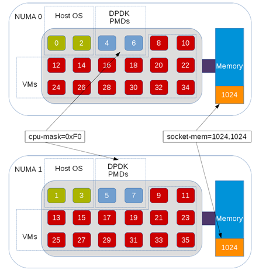

We can get all PCI Ethernet devices installed on the host using the following command :

[source, sh, linenums]
----
# lspci -nn | grep Eth
18:00.0 Ethernet controller [0200]: Intel Corporation 82599 10 Gigabit Dual Port Backplane Connection [8086:10f8] (rev 01)
18:00.1 Ethernet controller [0200]: Intel Corporation 82599 10 Gigabit Dual Port Backplane Connection [8086:10f8] (rev 01)
5e:00.0 Ethernet controller [0200]: Intel Corporation 82599 10 Gigabit Dual Port Backplane Connection [8086:10f8] (rev 01)
5e:00.1 Ethernet controller [0200]: Intel Corporation 82599 10 Gigabit Dual Port Backplane Connection [8086:10f8] (rev 01)
----

We can check the PCI device related numa node id using one of following commands:

[source, sh, linenums]
----
$ lspci -vmms 18:00.0 | grep NUMANode
NUMANode: 0

$ cat /sys/bus/pci/devices/*0000\:18\:00.0*/numa_node
0
----

Using `numactl` we can get CPU IDs on each NUMA socket:

[source, sh, linenums]
----
# numactl -H
available: 2 nodes (0-1)
node 0 cpus: 0 2 4 6 8 10 12 14 16 18 20 22 24 26 28 30 32 34 36 38 40 42 44 46 48 50 52 54 56 58 60 62 64 66 68 70
node 0 size: 96965 MB
node 0 free: 10842 MB
node 1 cpus: 1 3 5 7 9 11 13 15 17 19 21 23 25 27 29 31 33 35 37 39 41 43 45 47 49 51 53 55 57 59 61 63 65 67 69 71
node 1 size: 98304 MB
node 1 free: 12845 MB
node distances:
node 0 1
0: 10 21
1: 21 10
----

TIP: When DPDK vrouter is used, OpenStack flavors must have `hw:mem_page_size`
property (cf OpenStack configuration section).

//ping: best tool for numa topology is `hwloc-ls` GUI. 

.lab capture
****
[source, sh, linenums]
----
$ lspci -nn | grep -i ether
06:00.0 Ethernet controller [0200]: Intel Corporation 82599 10 Gigabit Dual Port Backplane Connection [8086:10f8] (rev 01)
06:00.1 Ethernet controller [0200]: Intel Corporation 82599 10 Gigabit Dual Port Backplane Connection [8086:10f8] (rev 01)
08:00.0 Ethernet controller [0200]: Intel Corporation 82599 10 Gigabit Dual Port Backplane Connection [8086:10f8] (rev 01)
08:00.1 Ethernet controller [0200]: Intel Corporation 82599 10 Gigabit Dual Port Backplane Connection [8086:10f8] (rev 01)
87:00.0 Ethernet controller [0200]: Intel Corporation 82599 10 Gigabit Dual Port Backplane Connection [8086:10f8] (rev 01)
87:00.1 Ethernet controller [0200]: Intel Corporation 82599 10 Gigabit Dual Port Backplane Connection [8086:10f8] (rev 01)

[root@overcloudmz5-compdpdk-3 ~]# lspci -nn | grep -i ether
02:00.0 Ethernet controller [0200]: Intel Corporation 82599ES 10-Gigabit SFI/SFP+ Network Connection [8086:10fb] (rev 01)
02:00.1 Ethernet controller [0200]: Intel Corporation 82599ES 10-Gigabit SFI/SFP+ Network Connection [8086:10fb] (rev 01)
04:00.0 Ethernet controller [0200]: Intel Corporation I350 Gigabit Network Connection [8086:1521] (rev 01)
04:00.1 Ethernet controller [0200]: Intel Corporation I350 Gigabit Network Connection [8086:1521] (rev 01)
----

[source, sh, linenums]
----
$ lspci -vmms "06:00.0"
Slot:   06:00.0
Class:  Ethernet controller
Vendor: Intel Corporation
Device: 82599 10 Gigabit Dual Port Backplane Connection
SVendor:        Hewlett-Packard Company
SDevice:        Ethernet 10Gb 2-port 560FLB Adapter
Rev:    01

[root@overcloudmz5-compdpdk-3 ~]# lspci -vmms 02:00.0
Slot:   02:00.0
Class:  Ethernet controller
Vendor: Intel Corporation
Device: 82599ES 10-Gigabit SFI/SFP+ Network Connection
SVendor:        Super Micro Computer Inc
SDevice:        Device 0611
PhySlot:        7
Rev:    01
NUMANode:       0       #<---
----

[source, sh, linenums]
----
$ numactl -H
available: 2 nodes (0-1)
node 0 cpus: 0 1 2 3 4 5 6 7 8 9 10 11 24 25 26 27 28 29 30 31 32 33 34 35
node 0 size: 96307 MB
node 0 free: 33996 MB
node 1 cpus: 12 13 14 15 16 17 18 19 20 21 22 23 36 37 38 39 40 41 42 43 44 45 46 47
node 1 size: 96764 MB
node 1 free: 32347 MB
node distances:
node   0   1
  0:  10  21
  1:  21  10

[root@overcloudmz5-compdpdk-3 ~]# numactl -H
available: 2 nodes (0-1)
node 0 cpus: 0 1 2 3 4 5 6 7 8 9 20 21 22 23 24 25 26 27 28 29
node 0 size: 65425 MB
node 0 free: 12794 MB
node 1 cpus: 10 11 12 13 14 15 16 17 18 19 30 31 32 33 34 35 36 37 38 39
node 1 size: 65536 MB
node 1 free: 21645 MB
node distances:
node   0   1
  0:  10  21
  1:  21  10
----
****

.Q&A
****
Question: isn't `--socket-mem` to allocate hugepage for vrouter (not to VM)
only? or this is actually a same "global" system-wise parameter just as the
kernel `hugepagesz=1G hugepages=40` parameter?

Answer: This is also something we have to explain clearly. Hugepages use in
DPDK are really badly explained. And, once again this is not so complex as it
seems.

You just have to keep in mind that :

* Packet are put into memory at one place and *never copied* (only descriptors
  are moving from one Q to another)

* Consequently “memory” area where the packet are put must be shared between
  DPDK vrouter and all instances (what ever the instance is – DPDK or not DPDK)

Then, you have DPDK setup :

* At system level : to allocate a given amount of Memory as “hugepage type”
* At vrouter level: to use an amount of system hugepages to store packets (in mbufs)
* vRouter is using CPU on a same NUMA (at least this is the recommended setup
  if you want to avoid performance issues).
* Virtual instances are using CPU on both NUMA (and most probably on the other
  NUMA which is not used by vrouter – because you have lots of CPU on this
  second one available for your VMs)

So, in short, you have instances running on both NUMA. They have to be able
access packets that are referenced by descriptors (that vrouter as put in vNIC
RX queue).

This is why, by default we spread hugepage memory allocation on both NUMA.

//image:diagram/extracted-media-QA.docx/media/image7.emf[image,width=601,height=419]
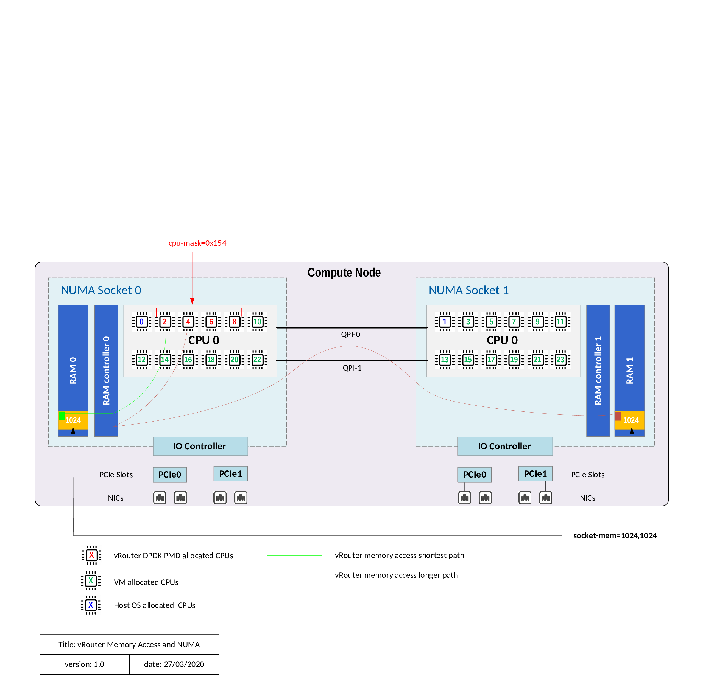

this diagram shows how huge pages are used.

So, first you are allocating HugePage at system level (at startup for 1G huge pages):

    default_hugepagesz=1GB hugepagesz=1G hugepages=40 hugepagesz=2M hugepages=40

I guess, that Huge pages are equally balanced on both NUMA (to be checked)

Then you are requesting at vrtouter level a part of them for vrouter DPDK
application need (to store both underlay and VM packets):

    --socket-mem <value>,<value>
****

==== Kubernetes: vrouter and Single Hugepage size

- Currently Kubernetes in not supported to be run on compute nodes configured
  with multiple huge page size. If a worker node is configured with both 2M and
  1GB hugepage size, Kubelet will fail to start.

- Contrail DPDK vrouter is able to run with a single Hugepage size and does not
  required to get both 2M and 1G pages allocated.

- by default, Contrail vrouter assumes that provided hugepages are 2Mb.

If only 1G huge pages are configured on the compute node, `pagesize` parameter
must be specified into huge page table mount point in order for the vrouter to
be aware that only 1G huge pages are available on the compute node:

Cf: https://github.com/Juniper/contrail-vrouter/blob/R1908/dpdk/vr_dpdk_table_mem.c#L80-L84

If this parameter is not present in the mountpoint, Contrail vrouter is
assuming that 2MB hugepages are available, and will requests 2M huge pages.

If only 1GB huge pages are available onto the compute node, vrouter will fail
to start.

.Hugepage size not specified in mount point

When huge pages mount point is configured without `pagesize` parameter, vrouter
will request 2M hugepages allocation.

[source, sh, linenums]
----
#/etc/fstab:
hugetlbfs on /dev/hugepages type hugetlbfs (rw,relatime,seclabel)

# cat /proc/mounts | grep hugepage
hugetlbfs /dev/hugepages hugetlbfs rw,seclabel,relatime 0 0
----

.hugepage size (1G) specified in mount point

Here we have specified huge pages mount with `pagesize=1G` parameter.
vrouter will request 1G hugepages allocation at startup.

[source, sh, linenums]
----
/etc/fstab:
hugetlbfs on /dev/hugepages type hugetlbfs (rw,relatime,seclabel,pagesize=1G)

# cat /proc/mounts | grep hugepage
hugetlbfs /dev/hugepages hugetlbfs rw,seclabel,relatime,pagesize=1G 0 0
----

****
summary of this section

- k8s setup support one pagesize only, fail if multiple configured
- by default vrouter assumes 2M
- for 1G, `pagesize=1G` has to be explicitly configured in `fstab`

feature limit, should avoid this topic
****

==== IRQ setup

ping? talk about IRQ?

Disabling IRQ Balance is not recommended as it has no impact on performance.
In RHEL, tuned’s cpu-partitioning profile leverages IRQ CPU affinity
(`isolated_cores`).

.Disable IRQ Balance

stop irqbalance daemon and remove irqbalance from system startup:

[source, sh, linenums]
----
$ systemctl stop irqbalance
$ systemctl disable irqbalance
----

.Exclude CPUs from IRQ Balancing

The `/etc/sysconfig/irqbalance` configuration file contains a parameter named
`IRQBALANCE_BANNED_CPUS` that allows to define CPUs to be excluded from
consideration by the IRQ balancing service.

The following mask excludes CPUs 8 to 15 as well as CPU 33 from IRQ balancing:

    IRQBALANCE_BANNED_CPUS=00000001,0000ff00

NOTE: If you are running a system with up to 64 CPU cores, separate each group
of eight hexadecimal digits with a comma.

.Unsupported features

- QoS is not supported (Marking is supported with DPDK vrouter. Hardware
  queueing is not).
- Jumbo frames for DPDK VMs in 3.2.8 and 4.0.1 (*).
- Jumbo frames for non-DPDK VMs on DPDK nodes in 3.2.8 and 4.0.1 (*)

(*) these features are requiring "mergeable buffers" to be supported.

ping? talk about mergeable buffers?

<<<

=== DPDK buffer size adjustment (mbuf)

Received packets in Fortville NICs are processed differently to Niantic.
Contrail vRouter adjusts to Intel recommendations and increases the number of
TX and RX buffer descriptors from 128 to 2048 and the mbuf pool from 16K to 32K
bytes.

Starting from the Contrail 3.2.10 release it will be possible to configure the
number of TX / RX descriptors in `contrail-vrouter-dpdk.ini` file
https://bugs.launchpad.net/juniperopenstack/+bug/1743391

****
LP 1743391:

During testings, we hit problem with packet loss between switch port (TX) and
vrouter vif 0 (RX). The error counters on DPDK vRouter was 0 during all the
test (1Mpps, 4Gbps). After testing it turned out the problem is with lack of
available RX descriptors. Engineering prepared a build that uses 2K TX and RX
descriptors/buffers (instead of 128) and a mbuf pool of size 32K (instead of
16K). The mbuf pool size is actually configurable at runtime by adding this to
the vrouter-dpdk ini file (--vr_mempool_sz=any power of 2). It should be also
possible to configure number of TX / RX descriptors there.

Configuration of the settings through this LP fixed the drop issue and allowed
to achieve higher thorughput (link saturation).

    --dpdk_txd_sz=2048 --dpdk_rxd_sz=2048 --vr_mempool_sz=131072
****

Since Contrail 5.0 release and later, Contrail is now containerized and DPDK
parameters are no more defined into `contrail-vrouter-dpdk.ini` file but are
installed by `/bin/bash /entrypoint.sh` into `contrail-vrouter-agent-dpdk`
container - cf appendix section.

*Caveat: The Intel NIC may silently drop packets in case of a shortage of RX
descriptors.  The DPDK vRouter polls NIC for these statistics.*

==== Intel recommendation

Intel recommendation to reduce or avoid packet loss

When using Niantic (PF), the packets can be either buffered in the RX
descriptors (or, more correctly speaking, in the memory addressed by the RX
descriptors), or in the RX packet buffer in the NIC.

RX packet buffer size is 512KB when flow director is disabled, hence it can
hold > 8000 packets of 64 Bytes => handle an interrupt longer than 500
microseconds -
https://etherealmind.com/wp-content/uploads/2017/01/X520_to_XL710_Tuning_The_Buffers.pdf
)

When using Fortville, packets are by default dropped when RX descriptors are
not available.  Hence, by default, the only buffers available to store packets
when a core is interrupted are the buffers pointed to by the RX descriptors.

A similar behavior (packets dropped when no descriptors available) is obtained
on Niantic when using Virtual functions: to avoid "head of line" blocking,
packets are dropped if no descriptor is available and virtual functions are
used.

So, to avoid packet losses due to CPU core being interrupted when using
Fortville (_or when using Niantic and *SR-IOV*_), the number of RX descriptors
should be configured high enough, for instance to 2048.

Setup number of rx descriptors through rte_eth_rx_queue_setup (see
http://www.dpdk.org/browse/dpdk/tree/examples/l3fwd/main.c#n990

    ret = rte_eth_rx_queue_setup(portid, queueid, nb_rxd, socketid, NULL, pktmbuf_pool[socketid]);

The number of TX descriptors should also be considered and depends on the application.
Imagine the CPU core is interrupted and up to 2048 packets are now buffered through the RX descriptors.
Once the interrupt is dealt with, up to 2048 packets can be received very fast by the application: as the packets are already in memory, they might arrive much faster than 10Gbps.
Hence, when the application tries to forward those packets, the application might try to send those packets faster than 10Gbps.
Some of those packets must be buffered before being sent to the 10 Gb/s link.
Either the application takes care of this by buffering those packets, or those packets must be buffered in the TX descriptors.
In that case, the number of TX descriptors should also be increased (e.g. up to 2048).

Increasing the number of RX and/or TX descriptors implies that you might have
to increase the number of pre-allocated mbufs. This can have a small impact on
performance (throughput), as more memory is being used.

Setup number of mbufs through rte_pktmbuf_pool_create: (see
http://www.dpdk.org/browse/dpdk/tree/examples/l3fwd/main.c#n724)

    rte_pktmbuf_pool_create(s, nb_mbuf, MEMPOOL_CACHE_SIZE, 0, RTE_MBUF_DEFAULT_BUF_SIZE, socketid);

==== Problem

A problem with reassigning kernel driver back to interface when DPDK vRouter is
stopped.

On Compute node In file `/opt/contrail/bin/vrouter-functions.sh` (line 532) in
`s/\x1([0-9:.]+)[\x1]+/ \1/g` there are missing letters from a to f. This should
be corrected and that could impact on not binding interface back to interface
kernel driver from UIO kernel driver when vRouter is stopped.

[source, sh, linenums]
----
## Look for slave PCI addresses of vRouter --vdev argument
DPDK_BOND_PCIS=`sed -nr \
    -e '/^ *command *=/ {
        s/slave=/\x1/g
        s/[^\x1]+//
        s/\x1([0-9:\.]+)[^\x1]+/ \1/g
        p
    }' \
    ${VROUTER_DPDK_INI}`
----

The correct sed should have letters `s/\x1([0-9**a-f**:\.]+)[^\x1]+/ \1/g`.

This issue will be solved in release 5.0.1
https://bugs.launchpad.net/juniperopenstack/+bug/1774403

=== Enable CPU performance mode

- CPU frequency scaling enables the operating system to scale the CPU frequency
  up or down in order to save power.
- CPU frequencies can be scaled automatically depending on the system load, in
  response to ACPI events, or manually by userspace programs.
- To run the CPU at the maximum frequency set `scaling_governor` to `performance`.

    for f in /sys/devices/system/cpu/cpu*/cpufreq/scaling_governor ; do echo performance > $f ; cat $f; done

Disable all power saving options such as: Power performance tuning, CPU
P-State, CPU C3 Report and CPU C6 Report.  Select Performance as the CPU Power
and Performance policy.

.BIOS/Platform Configuration(RBSU)
image::diagrams/extracted-media-ContrailPerformanceGuidev3.2.docx/media/image38.png[image,width=470,height=159]

Disable Turbo Boost to ensure the performance scaling increases with the number of cores.

.Disable Turbo Boost
image::diagrams/extracted-media-ContrailPerformanceGuidev3.2.docx/media/image39.png[image,width=476,height=138]

Set memory frequency to the highest available number, NOT auto.

.Set memory frequency
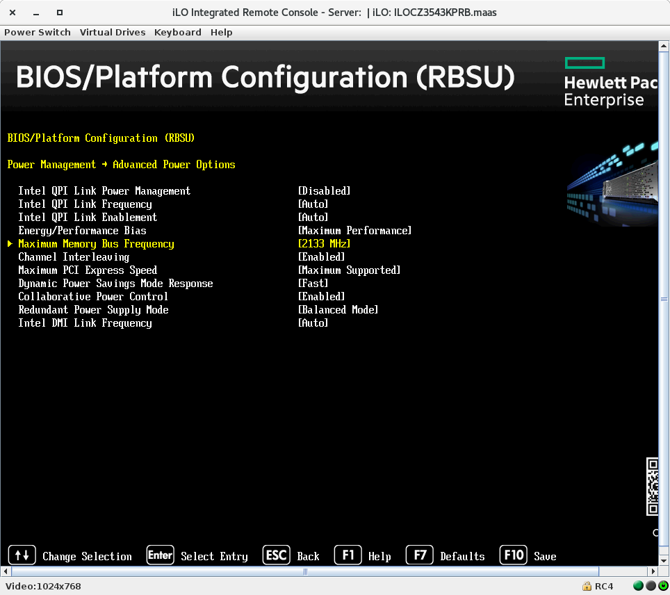

=== DPDK vRouter CPU assignment

In order to get DPDK vrouter threads pinned to a subset of CPUs on each compute
node we have to define:

- vrouter dpdk cores used for packet processing (polling and forwarding
  threads) in `CPU_LIST` (or `coremask`) within following file in:
* `/etc/contrail/supervisord_vrouter_files/contrail-vrouter-dpdk.ini` (up to 4.1)
* `/etc/sysconfig/network-scripts/ifcfg-vhost0` (from 5.0 to higher)

- vrouter dpdk cores used for vrouter management (services threads) in
  `SERVICE_CORE_MASK` within file
  `/etc/sysconfig/network-scripts/ifcfg-vhost0` (from 20.03 to higher)
- vrouter dpdk cores used for `vrouter management` (DPDK control threads) in
  `DPDK_CTRL_THREAD_MASK` within
  file `/etc/sysconfig/network-scripts/ifcfg-vhost0` (from 20.03 to higher)

These values: `CPU_LIST`, `DPDK_CTRL_THREAD_MASK` and `SERVICE_CORE_MASK` are
CPU masks used for CPU pinning with taskset command.

==== packet processing threads

vRouter `CPU_LIST` (also named `coremask` in some configuration files)
variable is allowing to define which core CPU will be allocated for router
forwarding and polling processing threads.

vrouter forwarding and polling processings are CPU intensive.
vrouter logical threads named logica core ID 10 to logical core 10 + N - 1
(with N = Number of allocated polling and forwarding cores) are used for
forwarding and polling processing.
These threads have to be pinned to some well defined CPU in order to avoid the
vrouter to starve the full node CPU capacity.
A maximum of 54 forwarding CPU can be allocated to a vrouter (logical core ID: 10 to 63).

Below is an example of a configuration of a 2 socket system, each processor
with 2*18 physical cores, with HT enabled.
The network adapter in PCI-E bus is attached to NUMA 0. 4 physical cores are
dedicated for vRouter (i.e. 8 logical cores thanks to Hyper Threading).

    NUMA node0 CPU(s):
    PHY cores: *0 2 4 6 8 10 12 14 16 18 20 22 24 26 28 30 32 34*
    HT cores : *36 38 40 42 44 46 48 50 52 54 56 58 60 62 64 66 68 70*
    NUMA node1 CPU(s):
    PHY cores: *1 3 5 7 9 11 13 15 17 19 21 23 25 27 29 31 33 35*
    HT cores : *37 39 41 43 45 47 49 51 53 55 57 59 61 63 65 67 69 71*

We are planning CPU assignment as follows:

- 4 cores for Operating System processes and vrouter agent/dpdk lightweight
  threads: *red* *0, 1, 3, 5, 36, 37, 39, 41*
- 4 physical cores for vRouter DPDK forwarding threads (in same NUMA 0),
  *blue*: *2, 4, 6, 8* with HT siblings *38, 40, 42, 44*. Do not allocate
  physical Core 0 (e.g. here 0 and 36) for Vrouter DPDK forwarding threads.
- The rest of the cores are for Nova vcpu_pin_set, *black*: 7,9-35, 43,45-71.

For optimal performance it is recommended that a single VMs is executed on a
same NUMA (unless it can efficiently leverage kvm/pinning information)

vRouter *CPU_LIST* (aka coremask) calculation based on the assumption above:
vCPUs 2, 4, 6, 8, 38, 40, 42, 44 are allocated for vRouter, which maps to b0001
0101 0100 0000 0000 0000 0000 0000 0000 0001 0101 0100 in binary.

This translates to a hex mask 0x154000000154 that must be configured in the
`/etc/contrail/supervisord_vrouter_files/contrail-vrouter-dpdk.ini` file (see
below example for Contrail 4.1 release).

[source, sh, linenums]
----
[root@overcloud-contraildpdk-16 ~]# cat /etc/contrail/supervisord_vrouter_files/contrail-vrouter-dpdk.ini
[program:contrail-vrouter-dpdk]
command=/bin/taskset *0x154000000154* /usr/bin/contrail-vrouter-dpdk --no-daemon --vdev "eth_bond_bond1,mode=4,xmit_policy=**l34**,socket_id=0,mac=a0:36:9f:d1:c8:78,slave=0000:04:00.0,slave=0000:04:00.1" --vlan_tci "201" --vlan_fwd_intf_name "bond1" --socket-mem 1024,1024
priority=410
autostart=true
killasgroup=true
stdout_capture_maxbytes=1MB
redirect_stderr=true
stdout_logfile=/var/log/contrail/contrail-vrouter-dpdk-stdout.log
stderr_logfile=/var/log/contrail/contrail-vrouter-dpdk-stderr.log
exitcodes=0 ; 'expected' exit codes for process (default 0,2)
----

After modifying this file, the vrouter must be restarted to take changes into account:

    systemctl restart supervisor-vrouter

NOTE: Some processors have different layout of cores in each numa node.  The
most popular is the first half being a part of numa 0 and the second half a
part of numa 1. But there are processors, where even cores are a part of numa 0
and odd cores a part of numa

NOTE: When using 5.0 and later version of contrail vrouter, hex mask
0x154000000154, must be configured into CPU_LIST variable in
`/etc/sysconfig/network-scripts/ifcfg-vhost0` file: `CPU_LIST=0x154000000154`

After modifying this file, the vrouter vhost0 interface must be restarted to
take changes into account:

    $ ifdown vhost0
    $ ifup vhost0

==== service and control threads <= 19.12

For contrail release 19.12 and earlier, Control and Service threads are not
assigned to any CPU.  Consequently, these threads can use any available CPU.

We can get all contrail-vrouter-dpdk assignments using taskset with -a option :

    *# taskset -cap `pidof contrail-vrouter-dpdk`*
    *pid 21666's current affinity list : 0-71*
    *pid 21740's current affinity list : 3-7,18-71*
    *pid 21741's current affinity list : 3-7,18-71*
    *pid 21790's current affinity list : 3-7,18-71*
    *pid 21791's current affinity list : 0-71*
    *pid 21792's current affinity list : 0-71*
    *pid 21793's current affinity list : 0-71*
    *pid 21794's current affinity list : 0-71*
    *pid 21795's current affinity list : 2*
    *pid 21796's current affinity list : 4*
    *pid 21797's current affinity list : 6*
    *pid 21798's current affinity list : 8*
    *pid 21799's current affinity list : 38*
    *pid 21800's current affinity list : 40*
    *pid 21801's current affinity list : 42*
    *pid 21802's current affinity list : 44*
    *pid 29401's current affinity list : 0-71*

.lab capture
****
[source, sh, linenums]
----
[heat-admin@jnprctdpdk01 ~]$ taskset -cap `pidof contrail-vrouter-dpdk`
pid 46058's current affinity list: 4
pid 46070's current affinity list: 4
pid 46071's current affinity list: 4
pid 46073's current affinity list: 4
pid 46074's current affinity list: 4
pid 46075's current affinity list: 4
pid 46076's current affinity list: 4
pid 46077's current affinity list: 4
pid 46078's current affinity list: 1
pid 46079's current affinity list: 2
pid 46080's current affinity list: 3
pid 46536's current affinity list: 4
----
****

In the previous example, we can notice that threads are assigned to a given CPU
set according following rules :

- *processing threads* have a CPU affinity restricted to a single one CPU
  (these are 2,4,6,8,38,40,42 and 44). Consequently each is placed on a single
  CPU.
- *service threads* have a CPU affinity with all available CPUs. They can use
  any CPU..
- *control threads* have CPU affinity with almost all available CPUs.
This is the default DPDK library behavior (DPDK is keeping only CPU that are
not booked for vrouter DPDK processing threads - previous example these are
3-7,18-71).

NOTE: It’s possible for a Contrail release R1912 (and earlier) to apply a patch
in order to be able to use a specific `SERVICE_CORE_LIST` parameter.
This parameter allows to pin both service and control threads onto a specific
CPU list.
In order to get the new parameter available, we have to apply the following
procedure on all the DPDK compute node :

[source, sh, linenums]
----
# mkdir -p /tmp/vrouter_patch
# cd /tmp/vrouter_patch
# curl -o patched-r1912-archive.tar.gz \
'https://review.opencontrail.org/changes/Juniper%2Fcontrail-container-builder~55730/revisions/1/archive?format=tgz'
# tar xvzf ./patched-r1912-archive.tar.gz containers/vrouter/base/network-functions-vrouter-dpdk containers/vrouter/agent-dpdk/entrypoint.sh --strip 3
# mv ./network-functions-vrouter-dpdk /etc/sysconfig/network-scripts/network-functions-vrouter-dpdk
# X=$(docker images --format "\{\{.Repository}}:\{\{.Tag}}" | grep contrail-vrouter-agent-dpdk)
# cat <<EOF > Dockerfile
# FROM $\{X}
# COPY ./entrypoint.sh /entrypoint.sh
# EOF
# docker build . -t $\{X}
----

`SERVICE_CORE_LIST` has been split into two variables into Contrail 20.03 and
later releases:

- `DPDK_CTRL_THREAD_MASK`
- `SERVICE_CORE_MASK`

In order to be used, you’ll have to follow explanation in next section given
for `SERVICE_CORE_MASK` (just replace in you configuration `SERVICE_CORE_MASK` with
`SERVICE_CORE_LIST` when using this patch)

==== service and control threads pinning >= 20.03

Since Contrail 20.03 release it is possible to assign Control and Service
threads to a given CPU list.
vRouter *_SERVICE_CORE_MASK_* variable is allowing to define which core CPU
will be allocated for vrouter service threads. *_DPDK_CTRL_THREAD_MASK_*
variable is allowing to define which core CPU will be allocated for vrouter
control threads.

Below is an example of a configuration of a 2 socket system, each processor
with 2*18 physical cores, with HT enabled.

The network adapter in PCI-E bus is attached to NUMA 0. 4 physical cores are
dedicated for vRouter (i.e. 8 logical cores thanks to Hyper Threading).

    NUMA node0 CPU(s):
    PHY cores: *0 2 4 6 8 10 12 14 16 18 20 22 24 26 28 30 32 34*
    HT cores : *36 38 40 42 44 46 48 50 52 54 56 58 60 62 64 66 68 70*
    NUMA node1 CPU(s):
    PHY cores: *1 3 5 7 9 11 13 15 17 19 21 23 25 27 29 31 33 35*
    HT cores : *37 39 41 43 45 47 49 51 53 55 57 59 61 63 65 67 69 71*

We are planning CPU assignment as follows:

- 4 cores for Operating System processes and vrouter agent/dpdk lightweight
  threads: *red* *0, 1, 3, 5, 36, 37, 39, 41.* DPDK control threads will also
  be pinned on these CPUs.
- 4 physical cores for vRouter DPDK vrouter forwarding threads (in same NUMA
  0), *blue*: *2, 4, 6, 8* with HT siblings *38, 40, 42, 44*. Do not allocate
  physical Core 0 (e.g. here 0 and 36) for Vrouter DPDK threads.
- 1 physical core for vRouter DPDK vrouter service threads (in same NUMA 0),
  *green*: *10* with HT sibling *46*.
- The rest of the cores are for Nova vcpu_pin_set, *black*: 7,9,11-35,
  43,45,47-71.

For optimal performance it is recommended that each VM be executed on a same
NUMA (unless it can efficiently leverage kvm/pinning information).

vRouter service cores mask calculation based on the assumption above: vCPUs 10,
46 are allocated for vRouter, which maps to b0100 0000 0000 0000 0000 0000 0000
0000 0000 0100 0000 0000 in binary.

This translates to a hex mask 0x400000000400 that must be configured into
*SERVICE_CORE_MASK* variable in /etc/sysconfig/network-scripts/ifcfg-vhost0
file:

    SERVICE_CORE_MASK=**0x400000000400**

vRouter DPDK control threads mask calculation based on the assumption above:
vCPUs 0,1,3,5,36,37,39,41 are allocated for vRouter, which maps to binary:

    b0000 0010 1011 0000 0000 0000 0000 0000 0000 0000 0010 1011

This translates to a hex mask 0x2B00000002B that must be configured into
*DPDK_CTRL_TREAD_MASK* variable in /etc/sysconfig/network-scripts/ifcfg-vhost0
file: DPDK_CTRL_THREAD_MASK=**0x2B00000002B**

After file has been updated, the vrouter vhost0 interface must be restarted to
take changes into account:

    $ ifdown vhost0
    $ ifup vhost0

We can get all contrail-vrouter-dpdk assignments using taskset with -a option :

    *# taskset -cap `pidof contrail-vrouter-dpdk`*
    *pid 21666's current affinity list : 0-71*
    *pid 21740's current affinity list : 0,1,3,5,36,37,39,41*
    *pid 21741's current affinity list : 0,1,3,5,36,37,39,41*
    *pid 21790's current affinity list : 0,1,3,5,36,37,39,41*
    *pid 21791's current affinity list : 10,46*
    *pid 21792's current affinity list : 10,46*
    *pid 21793's current affinity list : 10,46*
    *pid 21794's current affinity list : 10,46*
    *pid 21795's current affinity list : 2*
    *pid 21796's current affinity list : 4*
    *pid 21797's current affinity list : 6*
    *pid 21798's current affinity list : 8*
    *pid 21799's current affinity list : 38*
    *pid 21800's current affinity list : 40*
    *pid 21801's current affinity list : 42*
    *pid 21802's current affinity list : 44*
    *pid 29401's current affinity list : 10,46*

In the previous example, we can notice that threads are assigned to a given CPU
set according following rules :

- *processing threads* have a CPU affinity restricted to a single one CPU
  (these are 2,4,6,8,38,40,42 and 44). Consequently each is placed on a single
  CPU.
- *service threads* have CPU affinity restricted to only 2 CPUs (they are
  10,46).
- *control threads* have a CPU affinity restricted to the same CPUs assigned
  for Operation System (they are 0,1,3,5,36,37,39,41).

==== Provisioning concerns

Currently *only CPU assigned to packet processing threads* (*CPU_LIST /
COREMASK*) can be managed with provisioning tools.

Since version 20.03, we can also manage CPU assigned to control and service
threads (*DPDK_CTRL_THREAD_MASK* and *SERVICE_CORE_MASK*) with provisioning
tools.

Contrail can be installed through different tools: Contrail Cloud, Contrail
Networking integrated with RHOSP and TripleO deployer or Juniper Contrail
Ansible Deployer to name some.

===== control and service threads >= 20.03

When setting up the environment we will have to specify the CPU assignment for
service threads.
For RSHOP and Ansible deployer installation be sure to include the service mask
within quotes within configuration files.

When deploying via *Ansible deployer*, file instances.yaml has to include
SERVICE_CORE_MASK and DPDK_CTRL_THREAD_MASK variables with quotes in order to
avoid the given value to be converted into a decimal number leading to wrong
core assignment.

So, we have to use SERVICE_CORE_MASK=”0x400000000400” instead of
SERVICE_CORE_MASK=0x400000000400 and DPDK_CTRL_THREAD_MASK=”0x2B00000002B”
instead of SERVICE_CORE_MASK=0x2B00000002B

    compute_dpdk_1:
    provider: bms
    ip: 172.30.200.46
    roles:
    vrouter:
    PHYSICAL_INTERFACE: vlan0200
    AGENT_MODE: dpdk
    CPU_CORE_MASK: ”0x154000000154”
    *SERVICE_CORE_MASK*: ”0x400000000400”
    *DPDK_CTRL_THREAD_MASK*: ”0x2B00000002B”
    DPDK_UIO_DRIVER: uio_pci_generic
    HUGE_PAGES: 60000

When *TripleO* is used, SERVICE_CORE_MASK and DPDK_CTRL_THREAD_MASK variables have to be included into Contrail Service configuration file (_<tripleo-root-dir>_/environments/contrail/contrail-services.yaml). Quotes have also to be used into TripleO Yaml files in order to avoid the value to be converted into decimal.

In TripleO SERVICE_CORE_MASK: ”0x400000000400” has to be used to get vrouter service threads assigned onto 10 and 46 CPU cores, and DPDK_CTRL_THREAD_MASK=”0x2B00000002B” has to be used to get vrouter control threads assigned onto 0,1,3,5,36,37,39 and 41 CPU cores.

SERVICE_CORE_MASK and DPDK_CTRL_THREAD_MASK have to be defined into ContrailSettings.
ContrailSettings variable can be set at role level :

parameter_defaults:

    <Role Name>Parameters:
    TunedProfileName: "cpu-partitioning"
    IsolCpusList: "2-35,38-71"
    NovaVcpuPinSet: "12-35,48-71"
    NovaComputeCpuSharedSet: "5-7"
    KernelArgs: " isolcpus=2-35,38-71"
    ContrailSettings:
    SERVICE_CORE_MASK: ”0x400000000400”
    DPDK_CTRL_THREAD_MASK: ”0x2B00000002B”

By default, ContrailDpdk is the role name used for DPDK compute.

Or, globally for all roles:

    parameter_defaults:
    ContrailSettings:
    SERVICE_CORE_MASK: ”0x400000000400”
    DPDK_CTRL_THREAD_MASK: ”0x2B00000002B”

NOTE: If `ContrailSettings` is defined at role level, it will hide all
`ContrailSettings` values defined globally.
Each `ContrailSettings` parameters expected at role level have to be redefined
even if defined at the global level.

===== packet processing threads (forwarding cores)

When setting up the environment we will have to specify the CPU assignment for
packet processing threads.
For RSHOP and Ansible deployer installation be sure to include the core mask
within quotes within configuration files.

When deploying via *Ansible deployer*, file instances.yaml has to include
CPU_CORE_MASK variable with quotes in order to avoid the given value to be
converted into a decimal number leading to wrong core assignment.

So, we have to use CPU_CORE_MASK=”0x154000000154” instead of CPU_CORE_MASK=0x154000000154.

Here is an example when installing Contrail via Ansible deployer:

    compute_dpdk_1:
    provider: bms
    ip: 172.30.200.46
    roles:
    vrouter:
    PHYSICAL_INTERFACE: vlan0200
    AGENT_MODE: dpdk
    *CPU_CORE_MASK*: ”0x154000000154”
    SERVICE_CORE_MASK: ”0x400000000400”
    DPDK_UIO_DRIVER: uio_pci_generic
    HUGE_PAGES: 60000

You can connect onto a DPDK compute node and read the vrouter environment file
(which is on the host OS, not inside a container) in order to check that the
correct value has been configured by the deployer.

If you see something like this, things are correct:

    [root@server-5b ~]# cat /etc/contrail/common_vrouter.env | grep CORE
    CPU_CORE_MASK=0x154000000154

Otherwise, if you see this configuration will not be correct:

    [root@server-5b ~]# cat /etc/contrail/common_vrouter.env | grep CORE
    CPU_CORE_MASK=23364622090580

Value 23364622090580 is 0x154000000154 in decimal format.

If you find yourself in the wrong scenario then you can simply edit the common_vrouter file so to include the right core mask syntax.
Next, "re-create" containers by running:

    cd to /etc/contrail/vrouter
    docker-compose down
    docker-compose up -d

This time DPDK will be pinned as desired.

When *TripleO* is used, CPU_LIST has to be included into the Contrail NIC template configuration file (_<tripleo-root-dir>_/network/config/contrail/contrail-dpdk-nic-config.yaml}. Quotes have also to be used into TripleO Yaml files in order to avoid the value to be converted into decimal.

In TripleO CPU_LIST=”0x154000000154” have to be used to get vrouter processing threads assigned onto 2.4.6,8,38,40,42 and 44 CPU cores.

Here is a Contrail NIC template configuration example when installing Contrail via TripleO deployer:

    resources:
    OsNetConfigImpl:
    type: OS::Heat::SoftwareConfig
    properties:
    …
    params:
    $network_config:
    network_config:
    - type: contrail_vrouter_dpdk
    name: vhost0
    use_dhcp: false
    cpu_list: ”0x154000000154”
    …

NOTE: If more that 54 forwarding cores are selected with CPU_CORE_MASK (or
cpu_list), vrouter startup will fail with following message into
`contrail-vrouter-dpdk.log` file: `"Error configuring lcores: number of forwarding cores exceeds maximum of 54" .`

==== vRouter CPU numbers and single queue VM

In non-multiqueue VNF with one DPDK interface, increasing the number of CPU
cores for vRouter can actually decrease performance because of One to Many CPU
cores queues are sending packets one by one what takes time and can produce
microbursts.

.vrouter core numbers and single-queue VNF
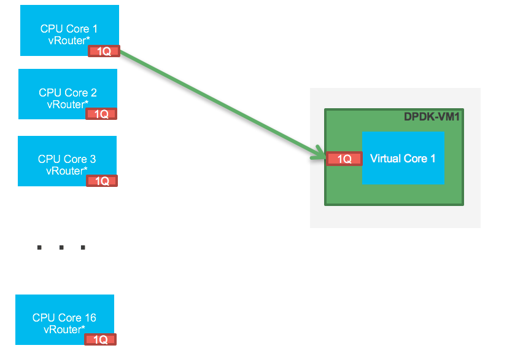

On the diagram cores one by one are sending traffic to VM and when last finish
data processing potentially first will have no time (buffers) to send VM
(virtio queue).

During this case microbursts affecting VNF will be observed on vRouter as TX errors.

<<<

=== DPDK vrouter CPU pinning and isolation

==== tuned and isolcpus - RedHat

First we are enforcing CPU isolation rules in order to keep CPUs assigned to vRouter and Nova out of the system scheduler :

1. Tuned: Prevent CPUs for Nova and vRouter in /etc/tuned/cpu-partitioning-variables.conf
+
[source, sh, linenums]
----
cat /etc/tuned/cpu-partitioning-variables.conf
isolated_cores=2-35,38-71
----

2. Isolcpus: Edit grub configuration in order to add isolcpus (and edit grub to hugepages)
+
[source, sh, linenums]
----
cat /etc/default/grub
GRUB_CMDLINE_LINUX="console=tty0 console=ttyS0,115200n8 crashkernel=auto rhgb quiet default_hugepagesz=1GB hugepagesz=1G hugepages=128 hugepagesz=2M hugepages=40 *isolcpus=2-35,38-71*
----

3. apply isolation changes :
+
[source, sh, linenums]
----
$ systemctl restart tuned
$ grub2-mkconfig -o /boot/grub2/grub.cfg
$ reboot
----

==== isolcpus - Ubuntu

On Ubuntu OS, isolcpus mechanism is used in order to keep CPUs assigned to
vRouter and Nova out of the system scheduler :

    Kernel parameter isolcpus=2-35,38-71 in /etc/default/grub, 
    run update-grub and restart the node.

==== RedHat OS scheduler CPU assignment (CPUAffinity)

1. CPUs assigned to the system scheduler are defined using tuned partitioning mechanism :
+
[source, sh, linenums]
----
vi /systemd/system.conf
...
CPUAffinity=0-1,36-37
----

2. then we apply tuned configuration changes :
+
[source, sh, linenums]
----
# systemctl restart tuned
----

==== Nova CPU assignment (vcpu_pin_set)

Cores to be used by Nova to run VMs is defined into _vcpu_pin_set_ variable (in
DEFAULT section in /etc/nova/nova.conf file).

1. We are enforcing Nova CPU assignment :
+
[source, sh, linenums]
----
# openstack-config --set /etc/nova/nova.conf DEFAULT vcpu_pin_set 4-47
# cat /etc/nova/nova.conf | grep vcpu_pin_set
vcpu_pin_set=3,5,7,9,11-35,39,41,43,45,47-71
----

2. In order to get these changes taken into consideration, nova compute service
   has to be restarted:
+
--
When OpenStack Kolla is used:

    # docker restart nova_compute

When OpenStack Kolla is not used:

    # service nova-compute restart (Ununtu) +
    # service openstack-nova-compute restart (RHEL)
--

NOTE: Optionally, property _hw:cpu_policy=dedicated_ can be set in any
openstack flavor definition to disable VCPUs migration from one physical core
to another.

The advantage of this approach is that for flavors without the
*_hw:cpu_policy=dedicated_* property (the default value will be set
*_hw:cpu_policy=prefered_*), VMs will be balanced between cpus.

With `isolcpus` set, all VMs without the above property will end up executing
on the first cpu from the list.

==== vRouter CPU assignment (CPU_LIST, SERVICE_CORE_MASK and DPDK_CTRL_THREAD_MASK)

1. Configure vrouter CPU_LIST (only CPU 2,4,6,8 are used: mask=0x154):
+
    vi /etc/sysconfig/network-scripts/ifcfg-vhost0
    [...] CPU_LIST=0x154
+
PS: CPU 38,40,42 and 44 are not selected and won’t receive any task to process.

2. Configure vrouter SERVICE_CORE_MASK:
+
    vi /etc/sysconfig/network-scripts/ifcfg-vhost0
    [...] SERVICE_CORE_MASK=0x400000000400

3. Configure vrouter DPDK_CTRL_THREAD_MASK:
+
    vi /etc/sysconfig/network-scripts/ifcfg-vhost0
    [...] DPDK_CTRL_THREAD_MASK=0x2B00000002B

4. We apply vrouter configuration changes :
+
    # ifdown vhost0
    # ifup vhost0

==== Check CPU pinning on all processes

In order to check actual CPU used to run a process and the CPU pinning rule
bound to each process, following command can be used :

    $ ps -eT -o psr,tid,comm,pid,ppid,cmd,pcpu,stat | awk '$3 != "ps" \{ cmd="taskset -cp " $2 "| sed \"s/^pid .*s current affinity list://\" | tr -d \" \" | tr -d \"\\n\" "; cmd | getline affin; printf( "%6s %s \n", affin, $0) }' 2> /dev/null | more
    PSR TID COMMAND PID PPID CMD %CPU STAT
    0-47 0 1 systemd 1 0 /usr/lib/systemd/systemd -- 0.0 Ss
    0-47 0 2 kthreadd 2 0 [kthreadd] 0.0 S
    0 0 4 kworker/0:0H 4 2 [kworker/0:0H] 0.0 S<
    0 0 6 ksoftirqd/0 6 2 [ksoftirqd/0] 0.0 S
    0 0 7 migration/0 7 2 [migration/0] 0.0 S
    0-47 8 8 rcu_bh 8 2 [rcu_bh] 0.0 S

In the first column we can read the *_CPU pinning_* put onto the process with
taskset command, in the second one (PSR), we can see the *_actual CPU_* used by
the process.

.lab capture
[source, sh, linenums]
----
[heat-admin@jnprctdpdk01 ~]$ ps -eT  -o psr,tid,comm,pid,ppid,cmd,pcpu,stat  | awk '$3 != "ps" { cmd="taskset -cp " $2 "| sed \"s/^pid .*s current affinity list://\" | tr -d \" \" | tr -d \"\\n\" "; cmd | getline affin;  printf( "%6s %s \n", affin, $0)  }' 2> /dev/null
       PSR     TID COMMAND             PID    PPID CMD                         %CPU STAT
  0,15  15       1 systemd               1       0 /usr/lib/systemd/systemd --  0.1 Ss
  0,15  15       2 kthreadd              2       0 [kthreadd]                   0.0 S
     0   0       4 kworker/0:0H          4       2 [kworker/0:0H]               0.0 S<
  0-15  15       5 kworker/u32:0         5       2 [kworker/u32:0]              0.0 S
     0   0       6 ksoftirqd/0           6       2 [ksoftirqd/0]                0.0 S
     0   0       7 migration/0           7       2 [migration/0]                0.0 S
  0,15  15       8 rcu_bh                8       2 [rcu_bh]                     0.0 S
  0,15  15       9 rcu_sched             9       2 [rcu_sched]                  0.1 S
    15  15      10 lru-add-drain        10       2 [lru-add-drain]              0.0 S<
     1   1      11 migration/1          11       2 [migration/1]                0.0 S
     1   1      12 ksoftirqd/1          12       2 [ksoftirqd/1]                0.0 S
     1   1      13 kworker/1:0          13       2 [kworker/1:0]                0.0 S
     1   1      14 kworker/1:0H         14       2 [kworker/1:0H]               0.0 S<
  0,15   0      15 rcuob/1              15       2 [rcuob/1]                    0.0 S
----

<<<

== *[underline]#chapter 6: Contrail DPDK vrouter Performance fine tuning: other considerations#* (prz)

=== vrouter physical bond setting

For optimal performance, bond `mode` must be set to `4`, and hash set to layer
3/4 in `contrail-vrouter-dpdk.ini` on the physical interface (Since Contrail
5.0 release and later, Contrail is now containerized and DPDK parameters are no
more defined into `contrail-vrouter-dpdk.ini` file but are installed by
`/bin/bash` `/entrypoint.sh` into `contrail-vrouter-agent-dpdk` container - cf
appendix section).

[source, sh, linenums]
----
/etc/contrail/supervisord_vrouter_files/contrail-vrouter-dpdk.ini
[program:contrail-vrouter-dpdk]
command=/usr/bin/taskset 0xff /usr/bin/contrail-vrouter-dpdk --no-daemon --vr_flow_entries=2000000 --vdev "eth_bond_bond0,*mode=4*,*xmit_policy=l34*,socket_id=0,mac=90:e2:ba:c5:79:90,slave=0000:01:00.0,slave=0000:01:00.1,slave=0000:02:00.0,slave=0000:02:00.1" --socket-mem 1024,1024
priority=410
autostart=true
killasgroup=true
stdout_capture_maxbytes=1MB
redirect_stderr=true
stdout_logfile=/var/log/contrail/contrail-vrouter-dpdk-stdout.log
stderr_logfile=/var/log/contrail/contrail-vrouter-dpdk-stderr.log
exitcodes=0 ; 'expected' exit codes for process (default 0,2)
----

Then run `service supervisor-vrouter restart` for the changes to take effect.

NOTE: Bond linux setup "lacp bond mode=4,xmit_policy=l23" is performing
load-balancing on *layer2+layer3 outer header*. In other words, outgoing
packets are spread onto both interface according underlay destination IP (as
source IP is the same for all encapsulated packets sent by a given compute).

Every packet sent by a compute node to a given remote compute node will use the
same outgoing Ethernet interface for a given encapsulation protocol (VxLAN,
MPLSoUDP or MPLSoGRE).

Using Bond linux setup "lacp bond mode=4,xmit_policy=l34” is performing
load-balancing on *layer3+layer4 outer header.* With this setup when a UDP
encapsulation protocol is used (MPLSoUDP or VxLAN), outgoing packets to be sent
to a given compute node are spread onto both outgoing Ethernet interfaces
according to UDP source port that is used to create traffic “entropy"
(diversity) between different flows.

=== Manage a high flow environment

==== Increase flow table size

The default flow table size is 512K and can be increased by setting the 
`-– vr_flow_entries` in `/etc/contrail/supervisor-vrouter_files/contrail-vrouter-dpdk.ini` 

(Since Contrail 5.0 release and later, Contrail is now containerized and DPDK
parameters are no more defined into `contrail-vrouter-dpdk.ini` file but are
installed by `/bin/bash` `/entrypoint.sh` into `contrail-vrouter-agent-dpdk`
container - cf appendix section)

To increase the flow table to 2M flows set the `–vr_flow_entries` as below:

    command=taskset 0xff /usr/bin/contrail-vrouter-dpdk --no-daemon *--vr_flow_entries=2000000* –vdev "eth_bond_bond0,mode=4,xmit_policy=l34,socket_id=0,mac=90:e2:ba:b8:70:c4,slave=0000:03:00.0,slave=0000:83:00.0,slave=0000:83:00.1,slave=0000:03:00.1" --socket-mem 1024,1024

Then reload kernel module and restart vrouter

==== Flow setup rate optimisation

For optimal flow setup rate, the agent flow thread count can be increased to 4
(default 2 threads).

[source, sh, linenums]
----
/etc/contrail/contrail-vrouter-agent.conf
[FLOWS]
thread_count = 4
----

Then run `service supervisor-vrouter restart` for the changes to take effect.

This setting is also available at orchestration level through the following
variable in TripleO template:

[source, sh, linenums]
----
ContrailSettings:
    VROUTER_GATEWAY: 172.30.254.1
    BGP_ASN: 64512
    BGP_AUTO_MESH: true
    LACP_RATE: 1
    *VROUTER_AGENT__FLOWS__thread_count: '4'*
----

To set about the total amount of threads assigned to the agent (not only for
flows), the number of threads for agent should be higher than for the flow
thread number.

    /etc/contrail/supervisord_vrouter.conf
    environment=TBB_THREAD_COUNT=6

Then run `service supervisor-vrouter restart` for the changes to take effect.

==== Configuration of packet based processing

By default Contrail works in flow-based processing providing a vast feature
portfolio.
Alternatively, packet based mode can be enabled in Contrail on per interface
basis, in order to increase the packet processing rate for traffic that may not
need a processing per flow.

Packet-based processing is configurable at port level by selecting the "Disable
Policy" checkbox: this will stop the creation of new flows for this interface
only.

image::diagrams/extracted-media-ContrailPerformanceGuidev3.2.docx/media/image42.png[Picture1.png,width=538,height=286]

Despite disabling policy the following features will continue to be available:

- Virtualisation and routing with ECMP
- Metadata service
- Link local
- BGPaaS
- Port Mirroring
- Service Chaining with network policy with rule any any and a single-step
  chain (no chaining of several SIs).

=== MPLSoUDP encapsulation Configuration

==== Contrail Configuration

During provisioning of Contrail sometimes provisioning tool not set an
encapsulation priority by this for communication to gateways and among vrouters
is using default MPLSoGRE.
MPLSoGRE is less efficient and not support 5 tuple entropy.
To change it encapsulation priority need to be set as follow:

- MPLSoUDP
- MPLSoGRE
- VxLAN

The encapsulation can be set by WebUI.

image::diagrams/extracted-media-ContrailPerformanceGuidev3.2.docx/media/image47.png[image,width=624,height=342]

==== SDN Gateway configuration: MPLSoUDP and Load Balancing

._MPLSoUDP configuration_

In parallel, for optimal load balancing capabilities and resource usage
optimisation the SDN gateway must also be configured with the MPLSoUDP
encapsulation.

The below configuration applies for JUNOS devices (MX). Note that Junos
MPLSoUDP support starts with 16.2 onwards.

. Configure Tunnels with MPLSoUDP encapsulation
+

    [edit routing-options]
    autonomous-system 65100;
    dynamic-tunnels {
      contrail {
        source-address 10.0.0.100;
        udp; # <===== configuration MPLSoUDP encapsulation (data plane)
        destination-networks {
            10.0.0.0/24;
        }
      }
    }

. Configuration of Control Plane signalling (BGP) to advertise the MPLSoUDP
  encapsulation community (RFC 5512). This overrides the Contrail default GRE
  forwarding mode.
+
--

    # Define a policy and an encapsulation community (RFC 5512) to advertise
    # that prefixes must be reached via an MPLSoUDP Tunnelling encapsulation.
    [edit policy-options] 
    community com-encaps-udp members 0x030c:65100:13; #last digit MUST be 13 (Type = MPLSoUDP)
    policy-statement pol-set-udp-encaps { # define a policy 
      then {
        community add com-encaps-udp;
      }
    }

    # Apply this policy toward the MP-BGP peering toward the Contrail Control Nodes.
    [edit protocols bgp]
    group to-Cluster1 {
      export pol-set-udp-encaps; # apply policy adding UDP encap community
      vpn-apply-export; # if routes exported from a local VRF is defined on PE
      ...
      neighbor 10.0.0.6;
    }
--

._Virtual Network Load Balancing Configuration_

In parallel, some VNF design can also require the activation of Load Balancing (a.ka.
multipath) at VRF level.

    # Control Plane ECMP activation
    routing-instances {
      VRF_XXXXX {
        routing-options {
          multipath;
        }
      }
    }
    # Data Plane ECMP activation
    routing-options {
      forwarding-table {
        export load-balance-per-flow;
      }
    }
    policy-options {
      policy-statement load-balance-per-flow {
        term 1 {
          then {
            load-balance per-packet;
            accept;
          }
        }
      }
    }
    # Optional GTP TEID hashing activation for mobile use cases
    forwarding-options {
        enhanced-hash-key {
        family inet {
            gtp-tunnel-endpoint-identifier;
        }
       }
    }

== *[underline]#chapter 7: Contrail DPDK vrouter Deployment considerations#* (prz)

=== Define number of resources required for vRouter DPDK

DPDK vrouter dimensioning is depending on following parameters:

- Cores for vrouter forwarding
- Cores for vrouter services threads and DPDK control threads
- Hugepages for vrouter

=== Compute Node CPU capacity planning

When we are designing an OpenStack Contrail infrastructure we have to define
how many CPU will be used for vRouter needs, how many for virtual instances and
how many will remain to be used by the Operating system.

.Compute Node CPU capacity planning
image::diagrams/extracted-media-ContrailPerformanceGuidev3.2.docx/media/image8.png[image,width=708,height=253]

=== vrouter forwarding cores capacity planning

==== First step: expected network throughput

Expected network throughput is the first thing to take into consideration.

We can take following assumption for vRouter dimensioning (this is the best
scenario with an optimal setup) :

[cols=",,,",options="header",]
|====
|                       |64 bytes packets|512 bytes packets|1500 bytes packets
|lcore (sibling enabled)|1 MPPS          |0.9 MPPS         |0.6 MPPS
|physical CPU           |2 MPPS          |1.8 MPPS         |1.2 MPPS
|====

NOTE: these values are depending on the actual customer environment.  Real
figures could be different.

.Scenario 1:
Let’s assume we want to be able to process 10 Gb/s of 512 bytes packet size in
full duplex, we need 5 MPPS throughput at the vrouter level (2 x 10 x 1000 /
512 / 8).

So, we need at least 6 forwarding cores to be configured onto the vRouter (5 /
0.9).

.Scenario 2:
We need to be able to process 12 MPPS of 64 bytes packets onto our vRouter (in
full duplex mode: 6 MPPS RX + 6 MPPS TX). So we need at least 12 forwarding
cores (12 / 1).

==== Second step: VM DPDK support and multi queues capability

considerations:

- whether the virtual instances are using DPDK or not. 
- if DPDK is supported, the virtual instances support multiQ vNIC or not?

.not DPDK capable or not supporting DPDK multiQ vNIC
It is preferable not to use more than 4 forwarding cores onto the vRouter.
If more than 4 forwarding cores are used onto the vrouter, some drop can occur
at virtIO queue level due to the traffic burst that will be generated by the
usage of several forwarding cores to deliver packet into a single Q.

.DPDK capable multiQ vNIC
The number of vRouter forwarding cores to be used will depend on:

- Linux Kernel release used onto the OpenStack compute node
- Maximum number of vCPU configured on DPDK virtual instance

The table below is providing the vRouter allocation rule to follow:

[cols=",,",options="header",]
|====
|                2+|Number of Forwarding cores to use
|Max Number of vCPU|Linux Kernel 3.X                 |Linux Kernel 4.X
|N < 8             |>= N                             |>= N
|N >= 8            |>= 8                             |>= N
|====

.Scenario 1 and 2
Let’s assume we are using MultiQ vNIC virtual instances on RedHat OpenStack 13 platform.
So, Linux Kernel 3.X will be used on compute nodes.
These virtual instances will be configured with 12 vCPU.
As Linux Kernel 3.X is used onto our compute nodes, each multiQ vNIC will be configured with 8 queues at maximum.
So we need to use at least 8 forwarding cores to be configured onto the vRouter.

==== Last step: sibling consideration

Then we have to take into consideration the purpose of the OpenStack Contrail
platform.

. high network throughput per vNIC
+
--
If the customer is intending to use its OpenStack computes to host virtual
instances requiring *very high network throughput per vNIC*, It is sometimes
preferable *not to use* siblings on forwarding cores, and we could expect a 50%
performance improvement per processing core.

[cols=",,,",options="header",]
|====
|    |64 bytes packets |512 bytes packets |1500 bytes packets
|lcore (sibling enabled) |1.5 MPPS |1.3 MPPS |0.9 MPPS
|physical CPU |1.5 MPPS |1.3 MPPS |0.9 MPPS
|====

NOTE: these values are depending on the actual customer environment.  Real
figures could be different.
--

. as many as possible virtual instances per compute node
+
--
If the customer is willing to keep a *better capacity* on its compute nodes in
order to start as many virtual instances as possible, it is preferable to *use
CPU siblings* on forwarding cores.
--

.max capacity (VM)
- We are using 2 x 12 physical CPU computes.
- We need 5 Gb/s full duplex traffic throughput to be processed by Contrail
  vRouter (at least 6 forwarding core required). As we are using MultiQ Virtual
  instances with more than 8 vCPU onto Compute nodes running Linux 3.x Kernel,
  we have to allocate at least 8 forwarding cores onto Contrail vRouter. +
- We do not foresee a higher network throughput expectation than the hypothesis
  taken for our current vRouter dimensioning.
- So we are preferring to keep more CPU for VM usage instead of Network performance improvement.
- We will use our CPU siblings for our forwarding cores.

So, we will use a vRouter configuration with 8 forwarding cores configured onto 4 Physical CPUs on NUMA0.
Our compute nodes are fitted with 12 Physical CPUs per NUMA.
So, 8 Physical CPUs - 16 logical cores - will remain available for other
purposes (7 allocated - 14 logical cores - to VM instances and 1 allocated - 2
logical cores to Linux Operating System for Hypervisor needs).

.max throughput
We are using 2 x 12 physical CPU computes.
We need 12 MPPS throughput on our vRouter (64 bytes packets) . At least 12
logical cores are required to get such a performance.
As we are using MultiQ Virtual instances with more than 8 vCPU onto Compute
nodes running Linux 3.x Kernel, we have to allocate at least 8 forwarding cores
onto Contrail vRouter.

- If sibling is used we need to use 12 logical cores on our vRouter (6 Physical CPUs)
- If sibling is not used we need 8 physical cores on our vRouter (8 physical CPUs)

If we are using siblings we are saving 2 Physical CPUs.
But, we probably won’t be able to reach the expected throughput.
Indeed, our multiQ vNIC are configured with 8 queues.
If 8 physical cores are used, we will be able to process each vNIC queue at 1.5 MPPS.
So 12 MPPS for the eight queues (6 MPPS RX + 6 MPPS TX). But, if we are using
siblings, we will only be able to process 1 MPPS each vNIC queue at 1 MPPS.
So only 8 MPPS for the eight queues (4 MPPS RX + 4 MPPS TX).

.Siblings or not siblings:

- If we need 12 MPPS on vRouter distributed on several vNIC, we could use only
  6 physical cores with their siblings (12 logical cores in total).
- If we need 12 MPPS for a single vNIC, it is preferable to use only 8 physical cores.
We have a virtual instance which has *high network throughput requirements per vNIC*.

=== vrouter services cores capacity planning

Service threads are used into the communication between vRouter dataplane (DPDK
vrouter process) and the control plane (vrouter agent). They are involved in
vNIC plugin to the vRouter, flow creation/deletion onto the vrouter.
So we have two scenarios to consider :

.[.underline]#Packet Mode only#

One single CPU will be enough for Service Threads.
If hyperthreading is enabled, a single logical core would be enough.
This CPU could be chosen on any NUMA node, e.g. NUMA#1

.[.underline]#Flow Mode only#

We are allocating a single *Physical CPU* to services threads.
If hyperthreading is enabled, *both logical cores* will be allocated to Service Threads.
If lots of flows are required at a high rate, an additional CPU could be needed.
These CPUs could be chosen on any NUMA node (but on the same NUMA).

.[.underline]#both packet and flow mode#

We are running most of our vNIC in packet mode.
Only a few of them will be using flow mode.
We will allocate a Physical CPU on NUMA1 for vrouter Service Threads (as our
forwarding cores have been allocated on NUMA0). We will use both logical cores
on this physical CPU for our Service Threads.

=== typical CPU assignment

Onto a Contrail OpenStack platform we have following kind of processes that
will use CPUs:

- Operating system processes
- Nova compute etc processes
- vRouter DPDK service lightweight processes
** packet processing threads
** control and service threads *(20.03 and later release)*
- vRouter Agent (default is 2, this can be upgraded to 4 in high flow environment)
- vrouter DPDK forwarding thread

.CPU assignment typical setups
//image::diagrams/extracted-media-ContrailPerformanceGuidev3.2.docx/media/image8.png[image,width=708,height=253]
image::diagrams/extracted-media-ContrailPerformanceGuidev3.2.docx/media/image8.png[image]

.Q&A
****
question: this is great diagram showing overall allocations. the numbering seems
not correct. see <<hwloc-ls, hwloc-ls GUI>> and `lscpu`

answer: the problem is that we are mixing platforms ...

All examples I've added in this document are comming from Orange which is using
to kinds of plaforms (72 lcores or 48 lcores).

So, I'm trying to be consistent in perf guide. But some examples are provided
from other platforms. So, it can lead to confusion.

CPU numbering is not always following same rules:

- some suppliers are using odd and even numbers to differentiate Numa0 from Numa1 CPUs
- others are using first half and second half numbers to differentiate Numa0 from Numa1 CPUs

This is bringing confusion ...

Here an example - 48 lcores:

    # lscpu | grep NUMA
    NUMA node(s): 2
    NUMA node0 CPU(s): 0-11,24-35
    NUMA node1 CPU(s): 12-23,36-47
    Physical Cores are ID 0 to 23
    First half = Numa0
    Second half = Numa1
    Siblings are ID 24 to 27
    Here is another example 72 lcores (like Orange Model):
    Physical Cores are ID 0 to 35
    Even = Numa0
    Odd number = Numa1
    Siblings are ID 36 to 71
    NUMA node0 CPU(s):
    PHY cores: *0 2 4 6 8 10 12 14 16 18 20 22 24 26 28 30 32 34*
    HT cores : *36 38 40 42 44 46 48 50 52 54 56 58 60 62 64 66 68 70*
    NUMA node1 CPU(s):
    PHY cores: *1 3 5 7 9 11 13 15 17 19 21 23 25 27 29 31 33 35*
    HT cores : *37 39 41 43 45 47 49 51 53 55 57 59 61 63 65 67 69 71*
    Updated situation with 48 CPUs:
    NUMA node0 CPU(s):
    PHY cores: *0 2 4 6 8 10 12 14 16 18 20 22*
    HT cores : *24 … 46*
    NUMA node1 CPU(s):
    PHY cores: *1 3 5 7 9 11 13 15 17 19 21 23*
    HT cores : *25 …. 47*

And the diagram I’ve provided in the book:

//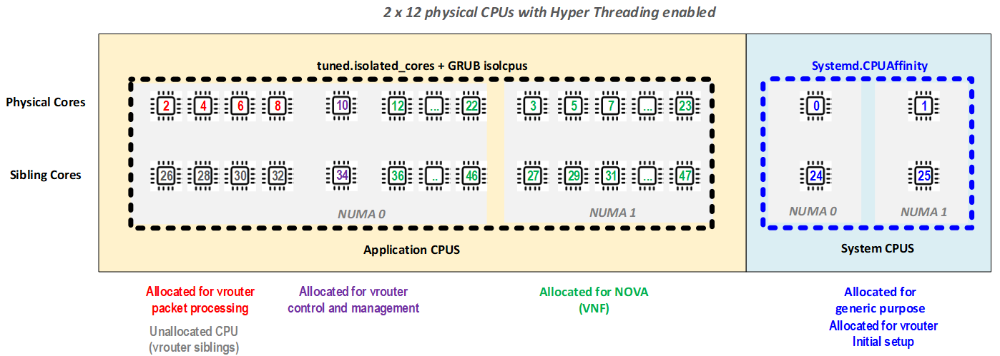

I can provide an updated diagram. But pay attention all netmask I’ve provided are following this numbering rule:

*0x154 …. Has to be changed everywhere if we are changing CPU model*
****

We are defining 4 CPU groups:

- vRouter
  * packet processing threads
  * service threads
- VNF (managed by Nova)
- OS, control threads (DPDK vRouter initial setup), etc

We are applying these allocation rules to get the best performance as possible:

- When Hyper Threading is used, we will book both physical CPUs and their
  sibling ones for DPDK vRouter packet processing threads.
- vRouter packet processing threads will be assigned with *physical CPUs* in same NUMA.
- vRouter assigned CPUs and Nova assigned CPU will be isolated in order to
  prevent them from being used by any other application (or any OS task). Both
  `isolcpu` and `tuned partitioning` mechanisms will be used to get the best
  isolation as possible.

In the following example, we will describe a performance tuning configuration
using a node with 36 physical cores split on 2 NUMA and Hyperthreading enabled
(72 logical cores).

On this system we are applying the following typical CPU allocation:

- vRouter packet processing: 2,4,6,8,38,40,42,44 (NUMA 0)
  * 4 of them will be assigned to vrouter: 2,4,6,8
  * remaining ones are kept unassigned: 38,40,42,44
- vRouter service threads: 10,46 (NUMA 0)
- VNF (aka Nova CPU): 3,5,7,9,11-35,39,41,43,45,47-71 (NUMA 0 and 1)
- OS, vrouter control thread, other task: 0,1,36,37 (NUMA 0 and 1)

Configuration described below is really relevant when a Contrail 20.03 and
later release is used. CPUs 2-35,38-71 will be allocated to Contrail DPDK
vRouter and to Nova. They will be isolated using both `tuned partitioning` and
`isolcpus` mechanisms. The diagram below is describing the target situation:

.CPU assignment example
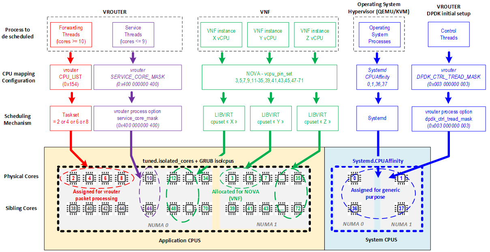

NOTE: When using a Contrail release 19.12 and earlier, this is not recommended
to enforce any CPU isolation rule (for both vrouter and nova assigned CPU). As
these release are not supporting control and service threads CPU pinning, any
isolation rule could generate some instabilities and random packet drop period)

=== Performance tests figures (DPDK vrouter)

In best case scenarios the vRouter can achieve 1,5Mpps per physical core.

The actual performance of the system depends on several parameters: 

- VNF capabilities, 
- traffic patterns, 
- CPU, RAM speed, 
- NICs capabilities, 
- drivers,
- firmware, 
- etc.

Juniper Networks recommends performing tests using a lab representative of the
target production environment.

For standard deployments, 4 up to 8 physical cores are allocated.
When HT siblings are not assigned for vRouter they *MUST NOT* be assigned for
Nova or operating system because this can cause CPU steals.

._Juniper QA tests - 2018_
//image::diagrams/extracted-media-ContrailPerformanceGuidev3.2.docx/media/image19.png[image,width=601,height=337]
image::diagrams/extracted-media-ContrailPerformanceGuidev3.2.docx/media/image19.png[]

.[.underline]#Diagram legend#:
- vr - vRouter allocate on NUMA 0 or 1
- vm - VM allocated on NUMA 0 or 1
- [X]p[Y]ht - number of allocated physical cores with HT siblings

In this diagram we can see that:

- 1 lcore: with a single lcore allocated to the vrouter, we’ve got around 1.8
  MPPS performance.
- 2 lcores: When 2 lcores are allocated to the vrouter, performance is falling
  to 0.5 MPPS per core (this is the impact of internal load balancing which is
  very inefficient for only 2 lcores). 
- When 4 or more lcores are allocated to the vrouter, we can see a performance
  of 0.8 MPPS per lcore when siblings are used (1.6 MPPS per physical CPUl) and
  a performance of 1.2 MPPS per lecore when siblings are not used (1.2 MPPS at
  per physical CPU).

.Q&A
****
question: text makes sense, but not corelating to the diagram. 2p2ht
means 2 pcores, both enabled ht=>4lcores in use?

answer:

It is consistent. Let see the situation with 4 lcores usage:

2 situations:

2p + 2h -> diagram = 3 MPPS

4p + 0h -> diagram = 5.2 MPPS

3 / 4 = 0.75 (almost 0.8) ==> 1,6 MPPS per Physical CPU

5.2 / 4 = 1.3 ==> 1,3 MPPS per Physical CPU (near to 1,25)
****

We can summarize this diagram performance result into following table:

[cols=",,,,",options="header",]
|====
|             2+|*With Siblings*                    2+|*Without Siblings*
|               |per lcore         |per Phys.  CPU    |per lcore|per Phys. CPU
|*1 lcore*      |1.8 MPPS          |1.8 MPPS          |1.8 MPPS |1.8 MPPS
|*2 lcores*     |0.5 MPPS          |1.0 MPPS          |1.0 MPPS |1.0 MPPS
|*>= 4 lcores*  |0.75 MPPS         |1.5 MPPS          |1.25 MPPS|1.25 MPPS
|====

NOTE: These tests have been done without DPDK control threads and vrouter
service threads pinning.

IMPORTANT: before release 20.03 - release 19.12 and earlier (without the patch) some
erratic drops can be seen when CPU isolation rules are enforced either on
vrouter and or nova allocated CPUs. For these versions it is preferable not to
enforce any CPU isolation rules to get the best performance as it has an impact
on packet drops. the bests results are reached when no isolation mechanisms
are enforced. 

////
So in release 19.12 and earlier (without patch applied), for a given level of
packet drops, performance without any CPU isolation rule is better.
////

In 2020, new tests have been proceeded (in Juniper and customer labs) with DPDK
control threads vrouter service threads pinning.  In these tests (done on
RedHat OpeStack platform + contrail 19.12 + patch for DPDK control threads and
vrouter service threads pinning) we’ve enforced CPU isolation (with `isolcpus`
and tuned).

._Juniper and customer tests summary - 2020 (19.12 + patch) - siblings used_
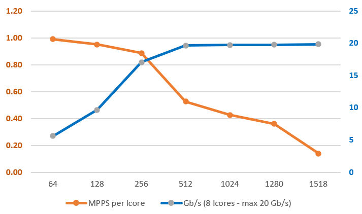

These tests have been done with 8 lcores and CPU siblings were used.
vRouter physical interface was a bond of 2x10 Gb/s NIC (Intel Niantic cards).

MPPS per lcore is the number of packet per second that are processed at vrouter level.
Given values are the performance seen at user level for a half duplex flow
(outgoing only). For a full duplex flows (both outgoing and incoming direction)
these values have to be divided by two.

On such a platform when packet size is more than 512 bytes we were reaching the
physical interface maximum throughput.
This is why performance per lcore seems to decrease at a very low rate for higher packet size.

We can use the results we’ve got for packet size below 512 bytes to extrapolate
values for a higher packet size when we have more than 20 Gb/s available on
vrouter physical interface.

In the diagram below, the MPPS per lcore values for 1024, 1280 and 1500 packet
have been extrapolated using 64, 128, 256 and 512 packet size values :

image::diagrams/extracted-media-ContrailPerformanceGuidev3.2.docx/media/image21.png[image,width=708,height=416]

This diagram could help our customers to evaluate the number of lcores needed
to get a given performance at vrouter level.

NOTE: Of course these values are dependent on the customer's actual setup and
have to be revalidated on field. Real results can differ from what we’ve got in
Juniper labs.

The best results will be achieved when:

- vRouter, VNF and NICs will be on the same NUMA. 
  * It does not mean that other configurations are not allowed but some
    performance degradation can be observed (depends on traffic characteristic
    and NUMA allocation).

- Contrail vrouter threads are correctly pinned (available since 20.03 version) :
    * using `CPU_LIST` for packet processing threads
    * using `SERVICE_CORE_MASK` and `DPDK_CTRL_THREAD_MASK` for control and service
      threads (only available since 20.03 version)
    * core siblings are *not used* for physical core allocated to packet
      processing threads (see <<Compute Node CPU capacity planning>> section)

- CPU allocated to DPDK vrouter and Nova are properly isolated with both `tuned
  partitioning` and `isolcpus` mechanisms (contrail 20.03 and later version).

=== Jumbo frame support

.Host

To enable Jumbo frames on tap and physical interfaces assign Jumbo on vhost0
interface.

    # ifconfig vhost0 mtu 9000

On DPDK node the mtu needs to be set on vhost0 and it will update the pmd.

.Guest

Before Contrail 3.2.8 and 4.0.1 on DPDK Compute:

. If it is a DPDK application then jumbo on the Guest interface(s) works (except i40e NICs)
. If it is a Kernel application (Linux Socket Application) then jumbo on the
  guest interface(s) works from Contrail 3.2.8 / 4.0 (mergeable buffers). For
  more information, this code enhancement is tracked under
  https://bugs.launchpad.net/juniperopenstack/+bug/1592935

****
LP 1592935: DPDK: GRO and GSO support

Vrouter performs Tx and Rx TCP segmentation offload only in the kernel mode
currently. It largely leverages kernel APIs for achieving this. However, in
case of DPDK, the library lacks segmentation support due to which DPDK based
vrouter could not do the offloads.

This commit overcomes the above limitation and adds receive offload and send
offload support to DPDK. As a pre-requisite to this, it also adds mbuf chaining
support and virtio mergeable buffer support.
****

There are limitations with jumbo frame support for Contrail Versions below
4.0.1 and 3.2.8:

DPDK Compute:

- if it is a DPDK application then jumbo on the Guest interface(s) WORKS.
- if it is a Kernel application (Linux Socket Application) then jumbo on the
  guest interface(s) DO NOT WORK.

Kernel Compute:

- if it is a Kernel application (Linux Socket Application) then jumbo on the Guest interface(s) works.

This issue is tracked under https://bugs.launchpad.net/juniperopenstack/+bug/1731174
We do not support these offloads yet inside vrouter-dpdk.

****
LP 1731174:
This is needed to support jumbo MTU in non-DPDK VM. Request from Orange vEPC - Ericsson
****

Starting from Contrail 4.0.1 and 3.2.8, jumbo frames are supported in all scenarios.

=== Configure driver and network settings

Add parameters to configuration file `/etc/contrail/contrail-vrouter-agent.conf`

[source, sh, linenums]
----
DEFAULT]
platform = dpdk
physical_uio_driver = $dpdk_nic_driver
physical_interface_address = $dpdk_dev_pci;
physical_interface_mac = $dpdk_dev_mac;
----

- *$dpdk_dev_pci* is an interface pci address (in case of bond it is 0000:00:00.0)
- *$dpdk_dev_mac* is a mac address assigned to interface (in case of bond the
  lower slaves mac)
- *$dpdk_nic_driver* as described in the section "UIO / VFIO" choose linux
  driver (default is igb_uio)

=== Configure nova scheduler and flavor

.nova scheduler

On every controller, add values `AggregateInstanceExtraSpecFilter` and
`NUMATopologyFilter` to the `scheduler_default_filters` parameter in
/etc/nova/nova.conf.  Restart nova-scheduler.

Configure host aggregates:

[source, sh, linenums]
----
openstack aggregate create dpdk
openstack aggregate add host dpdk [hypervisor 1]
openstack aggregate add host dpdk [hypervisor 2]
openstack aggregate set --property dpdk=true dpdk
----

.Define flavors for VNFs

[source, sh, linenums]
----
openstack flavor create --ram 8192 --disk 20 --vcpus 4 --public my-flavor
openstack flavor set --property aggregate_instance_extra_specs:dpdk=true my-flavor
openstack flavor set --property hw:mem_page_size=large my-flavor
openstack flavor set --property hw:cpu_policy=dedicated my-flavor
openstack flavor set --property hw:cpu_thread_policy=require my-flavor
----

that `mem_page_size` can have 1GB or 2048 values depending on hugepage size
requirements of the VNF.  Multiple flavors could be created in order to provide
for both options.

- `hw:cpu_policy=**dedicated**` - means that Nova will allocate physical cores and their sibling HT
- `hw:cpu_policy=**isolated**` - means that Nova will allocate physical cores only
- `hw:cpu_policy=**prefered**` - allocate range for VM and then system range
  will allocate cores dynamically. *DO NOT use this option with isolated CPUs!*

*Large pages are required* for each instance *(even any non-DPDK instance)
running on hosts with DPDK vrouter*. If large pages are not present in the
guest, the *interface will appear but will not function*.  This is why, on a
compute node running DPDK vrouter, openstack instances must use flavors having
`hw:mem_page_size=**large**` property.

.Q&A
****
question? didn't say why..

A (LD): Indeed. See earlier explanations. Second sentence is explaining why.

You just have to keep in mind that :

- Packet are put into memory at one place and never copied (only descriptors
  are moving from one Q to another)

- Consequently “memory” area where the packets are put must be shared between
  DPDK vrouter and all instances (whatever the instance is – DPDK or not DPDK)
****

.Spawn a VM

    openstack server create --image dpdk_image --flavor my-flavor --nic net-id=276c706c-cf78-44ba-ba97-d9b9dbe36707 vm-dpdk-1

<<<

== *[underline]#chapter 8: Contrail DPDK vrouter troubleshooting#* (laurent)

=== vrouter fine tuning parameters (kernel and DPDK mode)

==== Generic vrouter dimensioning parameters

.Q&A
****
question: since 4.0?

answer: I do not know I do not have any 4.0 lab. I guess there is no difference
(as we are telling “is still using”). But, it is not so important in my
opinion. Let's focus now on 19.X for this book. We can look for this
information for the current (and internal only) perf guide document.
****

Since Contrail 5.0 release and later, Contrail is containerized.
Kernel vrouter module is still using `/etc/modprobe.d/vrouter.conf` file to get
specific dimensioning values.
These parameters are**:**

- *vr_flow_entries*   :maximum flow entries (default is 512K)
- *vr_oflow_entries*  :maximum overflow entries (default is 8K)
- *vr_bridge_entries* :maximum bridge entries (default is 256K)
- *vr_bridge_oentries*:maximum bridge overflow entries
- *vr_mpls_labels*    :maximum MPLS labels used in the node (default is 5K)
- *vr_nexthops*       :maximum next hops in the node (defaut is 512K since contrail 19.11 - 65K before)
- *vr_vrfs*           :maximum VRFs supported in the node
- *vr_interfaces*     :maximum interfaces that can be created (default is 4352); this can be modified from release 3.1.1.0 & 3.2
- *vrouter_dbg*       :1 to dump packets, 0 to disable (disabled by default)

._kernel vrouter_
On a containerized *Kernel mode vrouter*, in order to be able to define a
specific value for these parameters we have to *create* or edit
`/etc/modprobe.d/vrouter.conf` configuration file onto the compute host.
Once done the vrouter interface and the vrouter agent container has also to be
started:

    $ ifdown vhost0
    $ ifup vhost0
    $ docker start contrail_vrouter_agent

vRouter parameters can be checked with :

    $ docker exec contrail_vrouter_agent vrouter --info

NOTE: It’s also possible to define vrouter option values via
`VROUTER_MODULE_OPTIONS` environment variable in
`/etc/sysconfig/network-scripts/ifcfg-vhost0` file.

For instance, we can add the following line to this file to decrease the Next Hop limit:

    VROUTER_MODULE_OPTIONS="vr_nexthops=32768"

Then we are restarting vhost0 interface and vrouter agent container in order to
get it applied.

._DPDK vrouter_
On a containerized *DPDK mode vrouter*, in order to be able to define a
specific value for these parameters we have to use
`DPDK_COMMAND_ADDITIONAL_ARGS` variable into
`/etc/sysconfig/network-scripts/ifcfg-vhost0`.

NOTE: the syntax to be used is slightly different as for the Kernel mode vrouter.
All parameters have to be prefixed with "--". eg:

    DPDK_COMMAND_ADDITIONAL_ARGS=”--vr_nexthops=32768”

Once done the vrouter interface has to be restarted.

    $ ifdown vhost0
    $ ifup vhost0

NOTE: No need to start the vrouter agent container with the DPDK vrouter:

._[.underline]#Example#_:

We will decrease the flow table size from 512 kB to 400 kB onto a *Kernel Mode* vrouter.
Before the change we can display the flow table size using `vrouter --info` command:

[source, sh, linenums]
----
$ sudo docker exec vrouter_vrouter-agent_1 vrouter --info | grep -i "flow table"
Flow Table limit 524288
Flow Table overflow limit 105472
----

`vr_flow_entries` parameter is set to 400000 in the `vrouter.conf`
configuration file onto the host compute:

    $ vi /etc/modprobe.d/vrouter.conf
    options vrouter vr_flow_entries=400000

Then we are restarting vhost0 interface :

[source, sh, linenums]
----
$ ifdown vhost0
$ ifup vhost0
$ docker start contrail_vrouter_agent
----

After the change we can notice the new value:

[source, sh, linenums]
----
$ sudo docker exec vrouter_vrouter-agent_1 vrouter --info | grep -i "flow table"
Flow Table limit 400000
Flow Table overflow limit 80896
----

If you are facing an issue with the router agent container which is not
succeeding to go up, it's probably due to a lack of memory.

You can try to free unused blocks using the following procedure :

[source, sh, linenums]
----
$ sudo -i
# ifdown vhost0
# rmmod vrouter
# free && sync && echo 3 > /proc/sys/vm/drop_caches && free
# modprobe vrouter
# ifup vhost0
----

Cf: https://github.com/Juniper/contrail-controller/wiki/Vrouter-Module-Parameters

==== Increase vrouter default value of dimensioning parameters (especially flow table)

Default parameters of vrouter have to be changed carefully.
Some side effects could happen when changing this parameters, especially on system memory consumption.

For instance, in the previous section it has been described how to change
vrouter setup and how to increase default size value for many table used by the
vrouter. In some situations it could be needed to increase the number of
hugepages allocated to the system.

For instance, we can sustain around 12000 flows per 2M hugepage.  When not
enough huge pages are available, vhost0 interface can’t be created at the
vrouter startup:

[source, sh, linenums]
----
[root@overcloud-contraildpdk-0 ~]# ifup vhost0
b3a25600ece1637e82e017b01357826e2c0abd29e64e8464c67fc5ff61512732
INFO: wait DPDK agent to run... 1
INFO: wait DPDK agent to run... 2
INFO: wait DPDK agent to run... 3
INFO: wait DPDK agent to run... 4
----

We can see the following error messages into vrouter dpdk log file :

    2019-06-19 14:59:02,619 VROUTER: Error mapping file /dev/hugepages2M/flow: Cannot allocate memory (12)
    2019-06-19 14:59:02,619 VROUTER: Error initializing flow table: Cannot allocate memory (12)

Number of allocated huge pages, and free huge pages, can be checked with
following commands:

[source, sh, linenums]
----
# cat /sys/devices/system/node/node0/hugepages/hugepages-2048kB/nr_hugepages
# cat /sys/devices/system/node/node0/hugepages/hugepages-2048kB/free_hugepages
----

When the number of available hugepages fall to 0 (or is below to the needed
value by the vrouter), we have to increase the number of hugepages allocated at
the system startup.

In order to do so, we have to change GRUB config.
Here we are setting 64 x 2M hugepages on the system:

[source, sh, linenums]
----
# vi /etc/default/grub
....
TRIPLEO_HEAT_TEMPLATE_KERNEL_ARGS=" default_hugepagesz=1GB hugepagesz=1G hugepages=10 hugepagesz=2M hugepages=64"
GRUB_CMDLINE_LINUX="$\{GRUB_CMDLINE_LINUX:+$GRUB_CMDLINE_LINUX }$\{TRIPLEO_HEAT_TEMPLATE_KERNEL_ARGS}"
----

Once this file has been changed, we have to rebuild the grub config using this
command (RedHat):

    grub2-mkconfig -o /boot/grub2/grub.cfg

Once done, we are rebooting the node.
After reboot, the number of hugepages can be checked with following commands:

[source, sh, linenums]
----
# cat /proc/cmdline
BOOT_IMAGE=/boot/vmlinuz-3.10.0-957.10.1.el7.x86_64 root=UUID=334f450f-1946-4577-a4eb-822bd33b8db2 ro console=tty0 console=ttyS0,115200n8 crashkernel=auto rhgb quiet default_hugepagesz=1GB hugepagesz=1G hugepages=10 hugepagesz=2M hugepages=64
# cat /sys/devices/system/node/node0/hugepages/hugepages-2048kB/nr_hugepages
64
----

If we want to be able to sustain 2 000 000 flows, we need to have around 164
pages (2,000,000/12,000). With the procedure seen earlier we are changing the
number of hugepages allocated to the system:

    [root@overcloud-contraildpdk-0 ~]# cat /sys/devices/system/node/node0/hugepages/hugepages-2048kB/nr_hugepages
    164

Then, _vr_flow_entries_ parameter is set to 2 000 000 into the vrouter.conf configuration file inside the vrouter agent container :

    $ sudo docker exec -it vrouter_vrouter-agent_1 vi /etc/modprobe.d/vrouter.conf
    options vrouter vr_flow_entries=2000000

Then we are restarting vhost0 interface :

    $ ifdown vhost0
    $ ifup vhost0

This last command should be successful:

    [root@overcloud-contraildpdk-0 ~]# ifup vhost0
    72acf9590f7bbb76cf737c535e20665ace495c9cc5783d2014f8778363fef221
    INFO: wait DPDK agent to run... 1
    INFO: wait DPDK agent to run... 2
    INFO: wait vhost0 to be initilaized... 0/60
    INFO: wait vhost0 to be initilaized... 1/60
    INFO: vhost0 is ready.

Once done we can see that the number of available hugepages has fallen near to 0:

    [root@overcloud-contraildpdk-0 ~]# cat /sys/devices/system/node/node0/hugepages/hugepages-2048kB/free_hugepages
    7

And we can see the flow table size has been set to 2 000 000 :

    [root@overcloud-contraildpdk-0 ~]# sudo docker exec -it contrail-vrouter-agent-dpdk vrouter --info | grep -i flow\ table
    Flow Table limit 2000000
    Flow Table overflow limit 400384

==== 32 bits vrouter nexthop limit parameter (contrail release 19.11 and later)

In release 19.10 and earlier next hop id in contrail virtual router was 16 bits.
Default value for next hop limit was set to 65536.
In high-scaled environment next hop limit would often exceed leading to traffic drops.
After reaching next hop limit contrail vrouter agent still sent new next hop adds to vrouter, on receiving new config.
Failure in creating next hop did not raise any alarm.
There was no accounting for usage of vrouter parameters like next hop, mpls
label, vrf (cf https://github.com/Juniper/contrail-controller/wiki/Vrouter-Module-Parameters ).

Since 19.11 release next hop id in contrail virtual router is increased to 32 bits.
New default value of next hop limit is set to 512k (512*1024). Now, contrail vrouter can support up to 1M next hops.
New specific alarms are raised once next hop limit exceeds and or once mpls label limit exceeds.

A watermark can be configured in agent configuration file (percentage of vr
limits - values: [50-95]).

High Watermark is defined in `/etc/contrail/contrail-vrouter-agent.conf`.
Low watermark in agent is high watermark – 5.

.[.underline]#Example#:

    {empty}[DEFAULT]
    vr_object_high_watermark = 80

Nexthop and mpls label alarm is raised when count for these objects reaches one of these limits:

- watermark*vr_nexthops
- watermark*vr_mpls_labels

Since 19.11 release, two new alarms have been created :

- *system-defined-vrouter-limit-exceeded alarm* (severity major)

  * This alarm is raised when nexthop or mpls labels count crosses high watermark.
  * This alarm is cleared when nexthop and mpls labels count becomes lower than the low watermark.

- *system-defined-vrouter-table-limit-exceeded* (severity critical)

  * This alarm is raised when nexthop or mpls labels count reaches nexthop or mpls labels count configured in vrouter. +
  * This alarm is cleared once nexthop or mpls labels count goes below 95% of nexthop and mpls labels count configured in vrouter.
  * These alarms are raised when either nexthop or mpls labels or both have exceeded the limits.
  * The type of resource/table is available in the alarm

==== vrouter networking parameters (MTU)

Some other parameters (like MTU) are directly set into
`/etc/sysconfig/network-scripts/ifcfg-vhost0`.

[source, sh, linenums]
----
$ sudo vi /etc/sysconfig/network-scripts/ifcfg-vhost0
MTU=1400
----

Then vhost0 interface has to be restarted:

[source, sh, linenums]
----
$ ifdown vhost0
$ ifup vhost0
----

NOTE: `/etc/sysconfig/network-scripts/network-functions-vrouter-kernel-env` can also be used.

=== vrouter DPDK fine tuning parameters

[[vrouter-parameters]]
==== DPDK vrouter parameters

Main parameters that should be customized onto DPDK vrouters in order to get
better performances are :

- mempool size (default 16384 Bytes)
- Physical NIC (PMD) TX and RX descriptors size (default 128)
- socket memory size

Since 20.03 release, some new parameters have been added in order to be able to configure :

- vrouter forwarding lcores TX and RX descriptors size
- yield deactivation on forwarding cores

.[.underline]#vrouters DPDK fine tuning parameters# :

- `--dpdk_ctrl_thread_mask` : (20.03 and later version) CPUs to be used for
  vrouter control threads (CPU list or hexadecimal bitmask).

- `--service_core_mask` : (20.03 and later version) CPUs to be used for vrouter
  service threads (CPU list or hexadecimal bitmask).

- `--yield_option` : (20.03 and later version) is used to enable or disable
  yield on forwarding cores (0 or 1 - enabled by default). In the case of
  `--yield_option 0`, yield is disabled onto forwarding cores.

- `--vr_dpdk_tx_ring_sz` : (20.03 and later version) is used to define
  forwarding lcores TX Ring descriptor size (1024 by default). e.g., for
  `--vr_dpdk_tx_ring_sz 2048`, TX Ring descriptor size has been set to 2048. 

- `--vr_dpdk_rx_ring_sz` : (20.03 and later version) is used to define
  forwarding lcores RX Ring descriptor size (1024 by default). e.g.,
  `--vr_dpdk_rx_ring_sz 2048` , RX Ring descriptor size has been set to 2048. 

- `--socket-mem` : is used to define the amount of memory pre-allocated for
  contrail vrouter.  In the case below, 1GB of huge-page memory is
  pre-allocated on NUMA node 0 and NUMA node 1.  `--socket-mem 1024,1024`

- `--vr_mempool_sz` : is used to define mempool memory size. In the case below
  128 MB mempool memory size is defined.  `--vr_mempool_sz 131072`

- `--dpdk_txd_sz` : is used to define Physical NIC TX Ring descriptor size.  In
  the case below 2048 bytes RX ring descriptor size is defined.  `--dpdk_txd_sz
  2048`

- `--dpdk_rxd_sz` : is used to define Physical NIC RX Ring descriptor size.  In
  the case below 2048 bytes RX ring descriptor size is defined.  `--dpdk_rxd_sz
  2048`

These values have to be adjusted depending on:

- the inter NIC model used
- the number of NIC members of vhost0 bond
- the number of logical cores allocated to the vrouter

.Q&A
****
question: great visualization! maybe worth a better quality image here

answer: as now we are using .doc word format, it will be easier for me to
integrate better quality images. Let’s see how we will integrate images in the
definitive document.
****

.vrouter parameters illustration
//image::diagrams/extracted-media-ContrailPerformanceGuidev3.2.docx/media/image22.png[image,width=662,height=476]
image::diagrams/extracted-media-ContrailPerformanceGuidev3.2.docx/media/image22.png[image]

==== DPDK fine tuning rules (mainly for Intel NIC)

._[.underline]#MEMPOOL SIZE#_

Following formula has to be used to define the mempool size (set of mbufs) to
be configured on vrouter :

_mempool size = MAX(16384, 2 * (number_of_RX_descriptors + number_of_TX_descriptors) * number_of_vrouter_cores * number_of_ports_in_dpdk_bond)_

[NOTE]
====
ping? how to interpret this?

    mempool_size = 2*(rxd+txd)**C*P * (size of ring?)

    1 pNIC has N queues =>
            N rings/descriptors in RAM?
            N forwarding cores => N rings in cores?

====

Provided `mempool` (that are containing `membufs`) size value is suitable to use in
most cases. This value has to be confirmed by tests or monitoring of live
traffic.  Indeed, memory needs are depending on a lot of factors like : packets
size, traffic load, bursts, number of virtual NIC, MTU, ...

In some situations it could be needed to increase `mempool` size above this
calculated size.  We can detect such a need onto vif interface counters.  When
`mempool` size is too low, we can see "no mbuf" high counters values :

[subs="quotes"]
----

$ vif --list | grep -B4 “no mbuf”
vif0/0      PCI: 0000:00:00.0 (Speed 10000, Duplex 1)
Type:Physical HWaddr:b8:85:84:44:50:d1 IPaddr:0.0.0.0
Vrf:0 Mcast Vrf:65535 Flags:TcL3L2VpEr QOS:-1 Ref:152
RX device packets:24559028  bytes:4969135442 errors:0 [red]#no mbufs:231501288288#

vif0/1      PMD: vhost0
Type:Host HWaddr:b8:85:84:44:50:d1 IPaddr:192.168.63.40
Vrf:0 Mcast Vrf:65535 Flags:L3DEr QOS:-1 Ref:18
RX device packets:596147  bytes:456776973 errors:0 [red]#no mbufs:170086#
----

Increasing the mempool size gives lower performance and higher caches misses.
So it is preferable not to oversize this value and to adjust it to the real needs.

._[.underline]#TX/RX DESCRIPTOR SIZE#_

For Intel Niantic NIC family (without SR-IOV) used default value for TX and RX
descriptor size has to be kept (128). For Intel Fortville NIC family (and Intel
Niantic NIC family when SR-IOV is used), TX and RX descriptor size has to be
increased to 2048.

[cols=",,",options="header",]
|====
   |           |*SR-IOV* *used*|*RX/TX descriptor size*
.2+|*Niantic*  |No             |128
               |Yes            |2048
.2+|*Fortville*|No             |2048
               |Yes            |2048
|====

._[.underline]#SOCKET MEMORY SIZE#_

Following formula has to be used to define the socket memory size to be
configured on vrouter :

- if mempool size <= 131072 then use *socketmem = 1024*
- if mempool size > 131072 then use *socketmem = 2048*

._[.underline]#CPU CORE_MASK#_

For DPDK CPU allocation (CPU affinity mask definition), it is preferable to
follow rules hereafter :

- CPU 0 should always be left for the host process
- CPUs should be associated with NUMA node of the DPDK interface
- CPU siblings (in case of Hyper-threading) should be added together
- CPUs assigned to PMD should be excluded from nova scheduling using NovaVcpuPinset

NOTE: Following command gives the siblings of a CPU:

    cat /sys/devices/system/cpu/cpu<cpu no>/topology/thread_siblings_list

._[.underline]#Example of vrouter dpdk setup with Intel NIC cards (SR-IOV not used)#_

[cols=",,,,,",options="header",]
|====
   |                                             |*#LCORES*|*#BOND MEMBERS*|*TX/RX DESC SIZE*|*MEMPOOL SIZE*|*SOCKET MEM*
   |*Default Setup*                              |4        |N/A            |128              |N/A           |N/A
.2+|*Niantic Family (82599/X520)* *10G interface*|4        |2              |128              |16384         |1024
                                                 |8        |2              |128              |16384         |1024
.2+|*Fortville Family (XL 710)* *40G interfaces* |4        |2              |2048             |65536         |1024
                                                 |8        |2              |2048             |131072        |1024
|====

Hence, in `/etc/contrail/supervisord_vrouter_files/contrail-vrouter-dpdk.ini`
we have to put above parameters:

- *4 or 8 logical cores on 2 Niantic bond members - 2 NUMA nodes*

    command=/bin/taskset *<CPU 4 or 8 cores affinity>* /usr/bin/contrail-vrouter-dpdk
    --socket-mem 1024,1024 …

- *4 logical cores on 2 Fortville bond members - 2 NUMA nodes*

    command=/bin/taskset *<CPU 4 cores affinity>* /usr/bin/contrail-vrouter-dpdk
    --dpdk_rxd_sz 2048 --dpdk_txd_sz 2048 --vr_mempool_sz 65536
    --socket-mem 1024,1024 …

- *8 logical cores on 2 Fortville bond members - 2 NUMA nodes*

    command=/bin/taskset *<CPU 8 cores affinity>* /usr/bin/contrail-vrouter-dpdk
    --dpdk_rxd_sz 2048 --dpdk_txd_sz 2048 --vr_mempool_sz 131072
    --socket-mem 1024,1024 …

==== DPDK vouter parameters provisioning

DPDK fine tuning setup has first to be defined before Contrail rollout into the
used OpenStack Contrail deployment tools.

For instance, if TripleO is used, specific parameters have to be defined into
`ContrailDpdkOptions` variable.  This variable is used to fulfill
_DPDK_COMMAND_ADDITIONAL_ARGS_ environment variable for DPDK vrouter container
instance.  If Ansible is used, _DPDK_COMMAND_ADDITIONAL_ARGS_ parameter can be
used.

._[.underline]#For instance with TripleO#_ :

An environment file (`<tripleO root dir>/environments/contrail/contrail-service.yaml`) 
has to be used to declare `ContrailDpdkOptions` value.  With TripleO there are
two possibilities:

First : declare this parameter at global level (same value for any DPDK roles):

    parameter_defaults:
       *ContrailDpdkOptions: "--yield_option 0 …"*

Second : declare this parameter at role level (specific value for each DPDK roles):

    # role specific variables:
    parameter_defaults:
      <Role Name>Parameters:
        ContrailSettings:
             # for service threads
             SERVICE_CORE_MASK: ”0x400000000400”
             # for ctrl threads
             DPDK_CTRL_THREAD_MASK: ”0x2B00000002B”
        ContrailDpdkOptions: “--yield_option 0 …”

For instance with Ansible:

    instances:
      bms1:
        provider: bms
        ip: 192.204.216.44
        roles:
          vrouter:
            AGENT_MODE: dpdk
            SERVICE_CORE_MASK: ”0x400000000400”
            DPDK_CTRL_THREAD_MASK: ”0x2B00000002B”
            CPU_CORE_MASK: ”0x154000000154”
            DPDK_COMMAND_ADDITIONAL_ARGS: “--yield_option 0 …”

When contrail 5.0 or later release is used, dpecified valuers for these
parameters will be put into `/etc/sysconfig/network-scripts/ifcfg-vhost0`
config file on each DPDK compute node..

==== DPDK vouter parameters configuration (5.0 and later versions)

Since Contrail 5.0 release and later, Contrail is containerized and DPDK
parameters are no more defined into `contrail-vrouter-dpdk.ini` file but are
installed by `/bin/bash /entrypoint.sh` into `contrail-vrouter-agent-dpdk`
container.

At the startup, DPDK vrouter container which will run `/bin/bash /entrypoint.sh`, 
which is applying specific DPDK configuration defined into
`DPDK_COMMAND_ADDITIONAL_ARGS` environment variable.

When a specific DPDK setup update is required after the initial rollout, it
could be defined into
`/etc/sysconfig/network-scripts/network-functions-vrouter-dpdk-env` file.  In
this file we can override `DPDK_COMMAND_ADDITIONAL_ARGS` value defined into the
deployment script.

.[.underline]#Example# :

We are adding new specific TX and RX ring size (256 bytes instead of 128 bytes
default value) and using a specific CPU mask into
`network-functions-vrouter-dpdk-env file` :

[source, sh, linenums]
----
$ vi /etc/sysconfig/network-scripts/network-functions-vrouter-dpdk-env
#!/bin/bash
DPDK_COMMAND_ADDITIONAL_ARGS="--dpdk_rxd_sz 256 --dpdk_txd_sz 256"
CPU_LIST=0x154
----

Specific DPDK fine tuning could also be defined into
`/etc/sysconfig/network-scripts/ifcfg-vhost0` file.

[source, sh, linenums]
----
$ vi /etc/sysconfig/network-scripts/ifcfg-vhost0
...
DPDK_COMMAND_ADDITIONAL_ARGS="--dpdk_rxd_sz 256 --dpdk_txd_sz 256"
CPU_LIST=0x154
MTU=9000
----

In order to get these new values taken into consideration we have to restart
vhost0 interface, After vhost0 interface restart the new values have been
applied.

[source, sh, linenums]
----
$ sudo ifdown vhost0
$ sudo ifup vhost0
$ sudo ps -ef | grep vrouter-dpdk
root 97244 97226 0 16:30 ? 00:00:00 /bin/bash /entrypoint.sh /usr/bin/contrail-vrouter-dpdk
root 97476 97244 99 16:30 ? 00:01:13 /usr/bin/contrail-vrouter-dpdk --no-daemon --dpdk_rxd_sz 256 --dpdk_txd_sz 256 --socket-mem 1024 1024 --vlan_tci 20 --vlan_fwd_intf_name bond0 --vdev eth_bond_bond0,mode=4,xmit_policy=l23,socket_id=0,mac=3c:fd:fe:bc:f7:e8,lacp_rate=0,slave=0000:03:00.0,slave=0000:03:00.1
heat-ad+ 97795 92566 0 16:30 pts/9 00:00:00 grep --color=auto vrouter-dpdk
----

We can also see into contrail dpdk vrouter logs, the new values in use :

[source, sh, linenums]
----
$ vi /var/log/containers/contrail/contrail-vrouter-dpdk.log
...
2019-04-19 16:30:41,411 VROUTER: vRouter version: \{"build-info": [\{"build-time": "2019-04-11 23:47:32.407280", "build-hostname": "rhel-7-builder-juniper-contrail-ci-c-0000225573.novalocal", "build-user": "zuul", "build-version": "5.1.0"}]}
2019-04-19 16:30:41,411 VROUTER: DPDK version: DPDK 18.05.1
2019-04-19 16:30:41,427 VROUTER: Log file : /var/log/contrail/contrail-vrouter-dpdk.log
2019-04-19 16:30:41,427 VROUTER: Using VLAN TCI: 20
2019-04-19 16:30:41,427 VROUTER: Bridge Table limit: 262144
2019-04-19 16:30:41,427 VROUTER: Bridge Table overflow limit: 53248
2019-04-19 16:30:41,427 VROUTER: Flow Table limit: 524288
2019-04-19 16:30:41,427 VROUTER: Flow Table overflow limit: 105472
2019-04-19 16:30:41,427 VROUTER: MPLS labels limit: 5120
2019-04-19 16:30:41,427 VROUTER: Nexthops limit: 65536
2019-04-19 16:30:41,427 VROUTER: VRF tables limit: 4096
2019-04-19 16:30:41,427 VROUTER: Packet pool size: 16384
2019-04-19 16:30:41,427 VROUTER: PMD Tx Descriptor size: 256
2019-04-19 16:30:41,427 VROUTER: PMD Rx Descriptor size: 256
2019-04-19 16:30:41,427 VROUTER: Maximum packet size: 9216
2019-04-19 16:30:41,427 VROUTER: Maximum log buffer size: 200
2019-04-19 16:30:41,427 VROUTER: EAL arguments:
2019-04-19 16:30:41,427 VROUTER: -n "4"
2019-04-19 16:30:41,427 VROUTER: --socket-mem "1024,1024"
2019-04-19 16:30:41,427 VROUTER: --vdev "eth_bond_bond0,mode=4,xmit_policy=l23,socket_id=0,mac=3c:fd:fe:bc:f7:e8,lacp_rate=0,slave=0000:03:00.0,slave=0000:03:00.1"
2019-04-19 16:30:41,427 VROUTER: --lcores "(0-2)@(0-71),(8-9)@(0-71),10@2,11@4,12@6,13@8"
2019-04-19 16:30:41,432 EAL: Detected 72 lcore(s)
2019-04-19 16:30:41,432 EAL: Detected 2 NUMA nodes
----

*But, be careful, after this operation contrail_vrouter_agent is stopped, we have to start it :*

    [heat-admin@oln-compute-dpdk-0 ~]$ sudo docker ps --all
    CONTAINER ID IMAGE COMMAND CREATED STATUS PORTS NAMES
    300c9d8b9987 10.19.2.1:8787/contrail-nightly/contrail-vrouter-agent-dpdk:5.1.0-0.655-rhel-queens "/entrypoint.sh /u..." 35 seconds ago Up 34 seconds contrail-vrouter-agent-dpdk
    b936827c6999 10.19.2.1:8787/contrail-nightly/contrail-vrouter-agent:5.1.0-0.538-rhel-queens "/entrypoint.sh /u..." 8 days ago Exited (0) 6 minutes ago contrail_vrouter_agent
    ...

In order to start contrail_vrouter_agent container we have to issue the following command :

    $ sudo docker start contrail_vrouter_agent

=== DPDK vrouter log analysis

laurent's new document

<<<

=== Connectivity Troubleshooting

==== How to check vrouter connectivity

Verify if VM was started on proper DPDK Compute node.

    # openstack server list
    ...get VM UUID...
    # nova show <VM_UUID>

Verify if tap interface has vhostuser type.

[source, sh, linenums]
----
# virsh list
 Id    Name                           State
 ---------------------------------------------------
 5     instance-000032d2              running

# virsh dumpxml instance-000032d2 | grep -A 6 "interface type"
    <interface type='vhostuser'>
      <mac address='02:7f:8e:16:17:ae'/>
      <source type='unix' path='/var/run/vrouter/uvh_vif_tap7f8e1617-ae' mode='client'/>
      <model type='virtio'/>
      <alias name='net0'/>
      <address type='pci' domain='0x0000' bus='0x00' slot='0x03' function='0x0'/>
    </interface>
----

Use vif --list to match the tap interface name to a vif identifier.

[source, sh, linenums]
----
# vif --list
vif0/0  OS: pkt0
          Type:Agent HWaddr:00:00:5e:00:01:00 IPaddr:0
          Vrf:65535 Flags:L3 MTU:1514 Ref:2
          RX packets:6591  bytes:648577 errors:0
          TX packets:12150  bytes:1974451 errors:0
vif0/1  OS: vhost0
          Type:Host HWaddr:00:25:90:c3:08:68 IPaddr:0
          Vrf:0 Flags:L3 MTU:1514 Ref:3
          RX packets:3446598  bytes:4478599344 errors:0
          TX packets:851770  bytes:1337017154 errors:0
vif0/2  OS: p1p0p0 (Speed 1000, Duplex 1)
          Type:Physical HWaddr:00:25:90:c3:08:68 IPaddr:0
          Vrf:0 Flags:L3 MTU:1514 Ref:22
          RX packets:1643238  bytes:1391655366 errors:2812
          TX packets:3523278  bytes:6806058059 errors:0
vif0/4 OS: tap7f8e1617-ae
          Type:Virtual HWaddr:00:00:5e:00:01:00 IPaddr:192.168.0.17
          Vrf:1 Flags:PL3L2D MTU:9160 Ref:23
          RX packets:60  bytes:4873 errors:0
          TX packets:21  bytes:2158 errors:0  
----

Use `vif --get` to check if tap interface is connected to correct RI and TX /
RX counters are increasing.

[source, sh, linenums]
----
# vif --get 4
Vrouter Interface Table

Flags: P=Policy, X=Cross Connect, S=Service Chain, Mr=Receive Mirror
       Mt=Transmit Mirror, Tc=Transmit Checksum Offload, L3=Layer 3, L2=Layer 2
       D=DHCP, Vp=Vhost Physical, Pr=Promiscuous, Vnt=Native Vlan Tagged
       Mnp=No MAC Proxy, Dpdk=DPDK PMD Interface, Rfl=Receive Filtering Offload, Mon=Interface is Monitored
       Uuf=Unknown Unicast Flood, Vof=VLAN insert/strip offload, Df=Drop New Flows, Proxy=MAC Requests Proxied Always

vif0/4      PMD: tap7f8e1617-ae
            Type:Virtual HWaddr:00:00:5e:00:01:00 IPaddr:192.168.0.17
            Vrf:1 Flags:PL3L2D QOS:-1 Ref:23
            RX queue errors to lcore 0 0 0 0 0 0 0 0 0 0 0 0 0 0 0 0 0 0
            RX packets:29  bytes:1218 errors:0
            TX packets:29  bytes:1218 errors:0
            TX port   packets:0 errors:29
            Drops:0
----

Use vifdump command to dump traffic on tap interface.

[source, sh, linenums]
----
# vifdump -i 4
vif0/4      PMD: tap7f8e1617-ae
tcpdump: verbose output suppressed, use -v or -vv for full protocol decode
listening on mon4, link-type EN10MB (Ethernet), capture size 262144 bytes
15:01:17.004641 ARP, Request who-has 192.168.0.17 tell 192.168.0.2, length 28
15:01:19.004610 ARP, Request who-has 192.168.0.17 tell 192.168.0.2, length 28
----

Check contrail-status.

    # contrail-status -d

Use dpdk_nic_bind.py command to verify proper binding of NICs to proper Linux driver.

    # /opt/contrail/bin/dpdk_nic_bind.py -s

==== vRouter vif queues setup

When the router boots up, it displays a message about its logical cores
numbering and pNIC and vNIC queues logical core pinning into
`contrail-vrouter-dpdk-stdout.log` file.

First vif to be initialized, is physical NIC, vif 0/0 :

[source, sh, linenums]
----
2019-02-06 10:15:40,516 VROUTER: Adding vif 0 (gen. 1) eth device 2 PCI 0000:00:00.0 MAC 00:00:00:00:00:00 (vif MAC b8:85:84:44:50:83)
2019-02-06 10:15:40,516 VROUTER: Using 64 TX queues, 4 RX queues
...
2019-02-06 10:15:40,831 VROUTER:     lcore 10 TX to HW queue 0
2019-02-06 10:15:40,831 VROUTER:     lcore 11 TX to HW queue 1
2019-02-06 10:15:40,831 VROUTER:     lcore 12 TX to HW queue 2
2019-02-06 10:15:40,831 VROUTER:     lcore 13 TX to HW queue 3
2019-02-06 10:15:40,831 VROUTER:     lcore  8 TX to HW queue 4
2019-02-06 10:15:40,831 VROUTER:     lcore  9 TX to HW queue 5
2019-02-06 10:15:40,831 VROUTER:     lcore 10 RX from HW queue 0
2019-02-06 10:15:40,831 VROUTER:     lcore 11 RX from HW queue 1
2019-02-06 10:15:40,831 VROUTER:     lcore 12 RX from HW queue 2
2019-02-06 10:15:40,831 VROUTER:     lcore 13 RX from HW queue 3
----

On vif 0/0, 4 queues are configured and pinned to one dedicated "packet
processing core". They are queues 0 to 3, pinned to lcore 10 to 13.

Later on, vNIC vif 0/N are also initialized :

[source, sh, linenums]
----
2019-02-13 14:37:16,250 VROUTER: Adding vif 3 (gen. 4) virtual device tapc02d2743-e3
2019-02-13 14:37:16,250 VROUTER:     lcore 11 TX to HW queue 0
2019-02-13 14:37:16,250 VROUTER:     lcore 12 TX to HW queue 1
2019-02-13 14:37:16,250 VROUTER:     lcore 13 TX to HW queue 2
2019-02-13 14:37:16,250 VROUTER:     lcore  8 TX to HW queue 3
2019-02-13 14:37:16,250 VROUTER:     lcore  9 TX to HW queue 4
2019-02-13 14:37:16,250 VROUTER:     lcore 10 TX to HW queue 5
2019-02-13 14:37:16,250 VROUTER:     lcore 11 RX from HW queue 0
2019-02-13 14:37:16,250 VROUTER:     lcore 12 RX from HW queue 1
2019-02-13 14:37:16,250 VROUTER:     lcore 13 RX from HW queue 2
2019-02-13 14:37:16,250 VROUTER:     lcore 10 RX from HW queue 3
2019-02-13 14:37:16,251 UVHOST: Adding vif 3 virtual device tapc02d2743-e3
2019-02-13 14:37:16,251 UVHOST:     vif (server) 3 socket tapc02d2743-e3 FD is 76
----

On vif 0/0, 4 queues are configured and pinned to one dedicated "packet
processing core". They are also queues 0 to 3, pinned to lcore 10 to 13.
We can notice that cpu to queue mapping is not the same on all vif interfaces.

PS: When the vif is created.
it’s important to check it has be done in server mode :

    2019-09-16 12:32:34,069 UVHOST: Adding vif 3 virtual device tape6b3d698-95
    2019-09-16 12:32:34,069 VROUTER: Adding vif 4 (gen. 7) virtual device tap32da3a01-1e
    2019-09-16 12:32:34,069 UVHOST: vif (server) 3 socket tape6b3d698-95 FD is 65

In our latest release (5.1 and above), a message like:

    2019-09-16 12:32:34,069 UVHOST: vif (client) 3 socket tape6b3d698-95 FD is 65

Means the vif interface has not been properly created by the vrouter.

==== vRouter vif queues activation

First the a connected message is confirming the socket is well connected.
Then, as soon as QEMU sending `VHOST_USER_SET_VRING_ENABLE` (message 18)
message, ring is enabled from vrouter side:

    2019-09-12 12:46:40,445 UVHOST: connected to /var/run/vrouter/uvh_vif_tapfe589e24-ae for uvhost socket FD 190
    2019-09-12 12:46:45,859 UVHOST: Client _tapfe589e24-ae: handling message 1
    2019-09-12 12:46:45,859 UVHOST: Client _tapfe589e24-ae: handling message 15
    2019-09-12 12:46:45,859 UVHOST: Client _tapfe589e24-ae: handling message 16
    2019-09-12 12:46:45,859 UVHOST: Client _tapfe589e24-ae: handling message 17
    2019-09-12 12:46:45,860 UVHOST: Client _tapfe589e24-ae: no handler defined for message 3
    2019-09-12 12:46:45,860 UVHOST: Client _tapfe589e24-ae: handling message 1
    2019-09-12 12:46:45,860 UVHOST: Client _tapfe589e24-ae: handling message 13
    2019-09-12 12:46:45,860 UVHOST: Client _tapfe589e24-ae: handling message 13
    2019-09-12 12:46:52,274 UVHOST: Client _tapfe589e24-ae: handling message 18

As soon as this last message is received, the vrouter interface is active.
If this last message is not received from QEMU by Contrail vrouter, the
interface will be disabled :

    2019-09-12 12:47:29,107 UVHOST: connected to /var/run/vrouter/uvh_vif_tape75222a7-31 for uvhost socket FD 212
    2019-09-12 12:47:35,733 UVHOST: Client _tape75222a7-31: handling message 1
    2019-09-12 12:47:35,733 UVHOST: Client _tape75222a7-31: handling message 15
    2019-09-12 12:47:35,733 UVHOST: Client _tape75222a7-31: handling message 16
    2019-09-12 12:47:35,733 UVHOST: Client _tape75222a7-31: handling message 17
    2019-09-12 12:47:35,733 UVHOST: Client _tape75222a7-31: no handler defined for message 3
    2019-09-12 12:47:35,733 UVHOST: Client _tape75222a7-31: handling message 1
    2019-09-12 12:47:35,734 UVHOST: Client _tape75222a7-31: handling message 13
    2019-09-12 12:47:35,734 UVHOST: Client _tape75222a7-31: handling message 13
    2019-09-12 12:53:04,854 UVHOST: Client _tape75222a7-31: shutdown at message receiving
    2019-09-12 12:53:04,854 UVHOST: Client _tape75222a7-31: unmapping 0 memory regions:
    2019-09-12 12:53:05,980 UVHOST: Client _tape75222a7-31: unmapping 0 memory regions

Here, more than 5 minutes after being connected to the socket, the
`VHOST_USER_SET_VRING_ENABLE` has still not been received by the vrouter. So,
the interface is being shut.

Here are the User space VHOST message bound for each ID :

[cols=",",options="header",]
|====
|*Message*                       |*ID*
|VHOST_USER_NONE                 |0
|VHOST_USER_GET_FEATURES         |1
|VHOST_USER_SET_FEATURES         |2
|VHOST_USER_SET_OWNER            |3
|VHOST_USER_RESET_OWNER          |4
|VHOST_USER_SET_MEM_TABLE        |5
|VHOST_USER_SET_LOG_BASE         |6
|VHOST_USER_SET_LOG_FD           |7
|VHOST_USER_SET_VRING_NUM        |8
|VHOST_USER_SET_VRING_ADDR       |9
|VHOST_USER_SET_VRING_BASE       |10
|VHOST_USER_GET_VRING_BASE       |11
|VHOST_USER_SET_VRING_KICK       |12
|VHOST_USER_SET_VRING_CALL       |13
|VHOST_USER_SET_VRING_ERR        |14
|VHOST_USER_GET_PROTOCOL_FEATURES|15
|VHOST_USER_SET_PROTOCOL_FEATURES|16
|VHOST_USER_GET_QUEUE_NUM        |17
|VHOST_USER_SET_VRING_ENABLE     |18
|VHOST_USER_MAX                  |19
|====

PS: Files into following directories have to be investigated in order to check
a vif has been properly enabled :

- `/var/run/vrouter/` : `uvh_tap` file has to be present for each virtual instance virtual port
- `/var/lib/vrouter/ports` : files describing virtual instance port properties

=== Packet drop troubleshooting

==== Interface traffic counters

To verify packet and error statistics for all interfaces.

[source, sh, linenums]
----
 # vif --list --rate
 Interface rate statistics
 ------------------------
 Interface name                VIF ID           RX                       TX                            
                                         Errors   Packets         Errors   Packets
 Physical: bondB               vif0/0     0        644             0        888             
 Host: vhost0                  vif0/1     0        0               0        0               
 Agent: unix                   vif0/2     0        0               0        0               
 Virtual: tapf7d6196c-81       vif0/3     0        0               0        0               
 Virtual: tapbd746390-d8       vif0/4     0        0               0        0               
 Virtual: tap122e8e7b-33       vif0/5     0        0               0        0               
 Virtual: tap48f25122-9e       vif0/6     0        20              0        98              
 Virtual: tap3d147039-e9       vif0/7     0        25              0        20              
----

Identify vRouter statistics (per core). Use without --core to get total interface statistics.

[source, sh, linenums]
----
 # vif --get 0 --core 10 --rate

 Interface rate statistics
 -------------------------
 
 Vrouter Interface Table
 
 Flags: P=Policy, X=Cross Connect, S=Service Chain, Mr=Receive Mirror
        Mt=Transmit Mirror, Tc=Transmit Checksum Offload, L3=Layer 3, L2=Layer 2
        D=DHCP, Vp=Vhost Physical, Pr=Promiscuous, Vnt=Native Vlan Tagged
        Mnp=No MAC Proxy, Dpdk=DPDK PMD Interface, Rfl=Receive Filtering Offload, Mon=Interface is Monitored
        Uuf=Unknown Unicast Flood, Vof=VLAN insert/strip offload, Df=Drop New Flows, Proxy=MAC Requests Proxied Always
 
 vif0/0      PCI: 0000:00:00.0 (Speed 10000, Duplex 1)
             Type:Physical HWaddr:3c:fd:fe:9c:c2:c5 IPaddr:0.0.0.0
             Vrf:0 Flags:TcL3L2Vp QOS:-1 Ref:46
             Core 10 RX device packets:0  bytes:0 errors:0
             Core 10 RX port   packets:15 errors:0
             Core 10 RX queue  packets:15 errors:0
             RX queue errors to lcore 0 0 0 0 0 0 0 0 0 0 0 0 0 0
             Core 10 RX packets:0  bytes:0 errors:0
             Core 10 TX packets:0  bytes:189 errors:0
             Core 10 TX queue  packets:0 errors:0
             Core 10 TX port   packets:0 errors:0
             Core 10 TX device packets:0  bytes:0 errors:0
             Drops:8772364
----

Each physical core is mapped to a virtual core starting from 10 to 10+N. (Don’t
confuse these lcores with host CPU cores). In the case of MPLSoGRE one core
will receive all the pkts and sprays to other cores.

Cycle through the lcores from 10 to 10+(N-1) where N is the no of cores assigned to vrouter.

*[.underline]#Counters description#*

[cols=",",options="header",]
|====
|*[.underline]#Counter#*|*[.underline]#Description#*
|*RX device*            |counter of received packets by physical interface (NIC card), 
                        used only for vif 0/0. +
                        *WARNING!* counters are from vif 0/0 not from physical NIC
|*RX port*              |counter of received packets by logical port (aka PMD statistics)
|*RX queue*             |counter of inter core communication queues usage
|*RX queue errors*      |error counter of lcores queues usage, physical cores
                        used for packets pulling.  lcores ID starting from position 10
|*RX packets*           |counter of received packets by "processing" core. This
                        is the packets received by vrouter (after passing
                        through NIC, PMD and load-balancing core).
|*TX device*            |counter of sent packets by physical interface (NIC
                        card), used only for vif 0/0. +
                        *Warning!* counters are from vif 0/0 not from physical NIC.
|*TX port*              |counter of sent packets by logical port (aka PMD statistics)
|*TX queue*             |counter of inter core communication queues usage
|*TX queue errors*      |error counter of lcores queues usage, physical cores
                        used for packets pulling. lcores ID starting from position 10.
|*TX packets*           |counter of sent packets by "processing" core.
|*Drops*                |counter of drops, to get more info run command with option --get-drop-stats
|*Syscalls*             |number of interrupts raised in the guest using eventfd
                        (wait/notify mechanism by user-space applications, and by the kernel to notify
                        user-space applications of events).
|====

==== Packet flow from a Compute Physical NIC to a VM NIC - counters placement

Compute physical vif is always defined as vif0/0 into the vrouter.
vNIC vif are defined as vif0/N (with N above or equal 3).

From underlay to virtual instances, packets are processed into 3 differents steps :

- vif0 packet polling by a polling core
- vif0 packet processing by a forwarding core
- vif0/n packet delivery by a forwarding core

In order to check the 2 first steps, we have to use counters on vif0/0. For the
last one, we have to use counters on vif0/n. In the following diagram is shown
counters that we have to check on each interface to be able to follow packets
processing from vif0/0 to vif0/n into the vrouter :

.*[.underline]#Packet flow from a Compute Physical NIC to a VM NIC - counters placement#*
image::diagrams/extracted-media-ContrailPerformanceGuidev3.2.docx/media/image2.png[image,width=708,height=277]

comparing with:

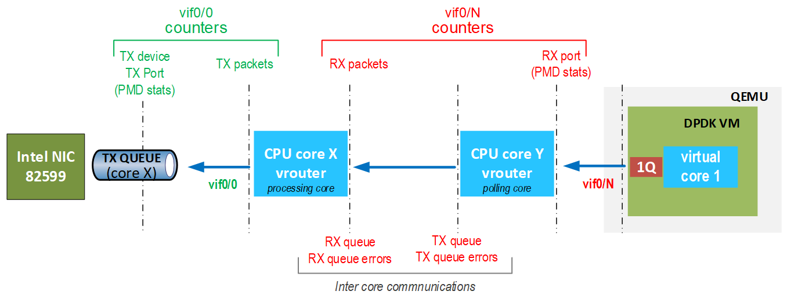

Here on vif 0/0, RX port and RX packets have the same value :

[subs="quotes"]
----
vif0/0  	PCI: 0000:00:00.0 (Speed 10000, Duplex 1)
                Type:Physical HWaddr:b8:85:84:44:50:83 IPaddr:0.0.0.0
                Vrf:0 Mcast Vrf:65535 Flags:TcL3L2VpEr QOS:-1 Ref:147
                RX device packets:11581241437  bytes:4298162385219 errors:0
                RX port   packets: [red]#2067782# errors:0
                RX queue  packets:15 errors:0
                RX queue errors to lcore 0 0 0 0 0 0 0 0 0 0 0 0 0 0 0 0
                RX packets: [red]#2067782#  bytes:511158595 errors:0
                TX packets:2222204  bytes:654123820 errors:0
                Drops:1037474
                TX port   packets:2228775 errors:20
                TX device packets:4545746  bytes:920251684 errors:0
----

This is the expected situation.
It means no packet has been dropped inside the vrouter.

On a receiving VM vif, TX port and TX packets should also have the same value :

[subs="quotes"]
----
vif0/10 	PMD: tap14cebe1c-c5
        	Type:Virtual HWaddr:00:00:5e:00:01:00 IPaddr:172.20.10.20
        	Vrf:2 Mcast Vrf:2 Flags:L3L2DEr QOS:-1 Ref:19
        	RX queue errors to lcore 0 0 0 0 0 0 0 0 0 0 0 0 0 0 0 0
        	RX packets:0  bytes:0 errors:0
        	TX packets: [red]#4665#  bytes:196158 errors:0
        	ISID: 0 Bmac: 02:14:ce:be:1c:c5
        	Drops:0
        	TX port   packets: [red]#1105# errors: [red]#3560# syscalls: [red]#1105#
----

Here 4665 packets have been processed by the "forwarding core", but only 1105
have been sent to VM interface, 3560 where errored.

We can also take note that 1105 "syscalls" notifications have been raised (1
per packet sent to the VM) which shows this instance is not a DPDK one.

This is an *unexpected* situation.
It shows the virtual instance was not able to process all incoming packets in
its vif queues and some of them have been dropped.

==== Packet flow from a VM NIC to compute node Physical NIC - counters placement

Compute physical vif is always defined as vif0/0 into the vrouter.
vNIC vif are defined as vif0/N (with N above or equal 3).

From virtual instances to underlay, packets are processed into 3 differents steps :

- vif0/n packet polling by a polling core
- vif0/n packet processing by a forwarding core
- vif0/0 packet delivery by a forwarding core

.*[.underline]#Packet flow from a VM NIC to compute node Physical NIC - counters placement#*

//comparing with:
//
//image::diagrams/extracted-media-ContrailPerformanceGuidev3.2.docx/media/image2.png[image,width=708,height=277]

Here on a transmitting VM vif, RX port and RX packets have the same value :

[source, sh, linenums]
----
vif0/11 	PMD: tapb2767cbd-40
        	Type:Virtual HWaddr:00:00:5e:00:01:00 IPaddr:194.3.0.8
        	Vrf:5 Mcast Vrf:5 Flags:L2Er QOS:-1 Ref:17
        	RX port   packets: [red]#1433409# errors:0 syscalls:2
        	RX queue  packets:516225 errors:0
        	RX queue errors to lcore 0 0 0 0 0 0 0 0 0 0 0 0 0 0 0 0
        	RX packets: [red]#1433409#  bytes:191289533 errors:0
        	TX packets:1544574  bytes:374354192 errors:0
        	ISID: 0 Bmac: 02:00:00:01:fd:01
        	Drops:673575
        	TX port   packets:1544236 errors:338 syscalls:1450386
----

This is the *expected* situation.
It means no packet has been dropped inside the vrouter.

==== Traffic Load balancing on forwarding cores

A tool for getting statistics per core pps, bw utilisation that can be used for
monitoring or testing performance purpose:

https://github.com/PrzemekGrygiel/DPDKstats

This tool is using vif RX and TX packets counters (packet received and transmitted by forwarding cores).

In order to check traffic is well balanced on all forwarding cores for a given
interface, we have to use following command:

    ./dpdkvifstats.py -v <N>

with *<N>*, interface number to be checked.

*For instance:*

    $ ./dpdkvifstats.py -v 3

image::diagrams/extracted-media-ContrailPerformanceGuidev3.2.docx/media/image9.png[image,width=708,height=170]

Here we can see that the traffic is well balanced on all cores for vif 0/3.
Whatever the direction (vrouter to vif 0/3 = TX pps or vif0/3 to vrouter = RX
pps), whatever the core, each core is processing around 500KPPS.

==== vrouter is dropping packets

When drops are occurring inside the vrouter, it can be checked into "RX queue
errors” counter or “IF Drop" in drop statistics option.

[subs="quotes"]
----
$ vif --get 3 --get-drop-stats | grep "IF Drop“
IF Drop *325686650*

$ vif --get 3 --get-drop-stats | grep "RX queue packets“
RX queue packets:73891601519 errors: *325686650*
----

This value also matches RX Ports packets – RX Packets value:

[subs="quotes"]
----
$ vif --get 3 --get-drop-stats | grep "RX packets"
RX packets:73891746924 bytes:4433501752754 errors:0

$ vif --get 3 --get-drop-stats | grep "RX port"
RX port packets:74217433574 errors:0 syscalls:1
----

.*[.underline]#vrouter is dropping packets#*
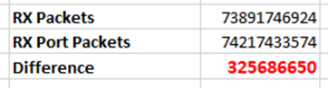

This is a situation that is occuring when too many packets are sent onto one or
more processing cores.  It means :

- traffic is not equally load balanced on all forwarding cores
- or not enough all forwarding cores have been allocated to the vrouter to be
  able to process the incoming traffic.

We can check on which forwarding core the drops have been occured using following command:

    $ vif --get <interface> --core <forwarding core> | grep "RX queue errors"

For instance:

[subs="quotes"]
----
$ vif --get 3 --core *[red]#11#* | grep "RX queue errors"
RX queue errors to lcore 0 0 0 0 0 0 0 0 0 0 *[blue]#27283689 0 7534963 9294274 6851459 5748667#*
----

- *[red]#xxx#*: forwarding core which drops packets
- *[blue]#xxx#*: polling cores whose packets have been dropped

Currently (19.12 release with an optimal setup), a forwarding core is able to
process around 500 KPPS in each direction (RX and TX), so 1 MPPS in total for
64 bytes packets.

==== virtual instance is dropping packets

When drops are occurring because a virtual instance is not fast enough to
process incoming packet, it can be detected using TX port errors counters :

    $ vif --get 10 | grep "TX port \|TX packets"
    TX packets:4665 bytes:196158 errors:0
    TX port packets: [red]#1105# errors: [red]#3560# syscalls: [red]#1105#

Here we are detecting that 3560 packets have been dropped on TX port.
It means VM was to slow to process incoming packets.
Some of them have been dropped into the virtio queues.

==== Packet Drop statistics

With dropstats command we can get details about drops performed by the vrouter.

We can get all parameters supported by this command using :

    $ dropstats --help

When some packet loss issue is encountered, this is a good starting point to
get an overview of all drops that have been performed on the vrouter.

dropstats command run without any arguments is returning drop statistics for
all vrouter cores :

    $ dropstats

In order to get statistics for a given vrouter core, we can use the --core
option.  Keep in mind that 10 is the first processing vrouter lcore:

    $ dropstats --core 10

In order to clear stats counters on all cores we can use this command :

    $ dropstats --clear

Example:

[source, sh, linenums]
----
$ (vrouter-agent-dpdk)[root@overcloud-contraildpdk-1 /]$ dropstats
Invalid IF                    0
Trap No IF                    0
IF TX Discard                 0
IF Drop                       0
IF RX Discard                 0

Flow Unusable                 0
Flow No Memory                0
Flow Table Full               0
Flow NAT no rflow             0
Flow Action Drop              0
Flow Action Invalid           0
Flow Invalid Protocol         0
Flow Queue Limit Exceeded     0
New Flow Drops                0
Flow Unusable (Eviction)      0

Original Packet Trapped       0

Discards                      0
TTL Exceeded                  0
Mcast Clone Fail              0
Cloned Original               0

Invalid NH                    27
Invalid Label                 0
Invalid Protocol              0
Etree Leaf to Leaf            0
Bmac/ISID Mismatch            0
Rewrite Fail                  0
Invalid Mcast Source          0
Packet Loop                   0

Push Fails                    0
Pull Fails                    0
Duplicated                    0
Head Alloc Fails              0
PCOW fails                    0
Invalid Packets               0

Misc                          0
Nowhere to go                 0
Checksum errors               0
No Fmd                        0
Invalid VNID                  0
Fragment errors               0
Invalid Source                0
Jumbo Mcast Pkt with DF Bit   0
No L2 Route                   0
Memory Failures               0
Fragment Queueing Failures    0
No Encrypt Path Failures      0

VLAN fwd intf failed TX       0
VLAN fwd intf failed enq      0
----

.*[.underline]#dropstats ARP Block#*

[cols=",",options="header",]
|====
|*GARP*        |GARP packets from VMs are dropped by vrouter.This is an
                expected behavior. This counter indicates how many GARP packets were dropped.
|*ARP notme*   |this counter is incremented when ARP requests that are not
                handled by vrouter are dropped.  For example, requests for a system that is not
                a host. These drops are counted by counters.
|*Invalid ARPs*|this counter is incremented when the Ethernet protocol is ARP,
                but the ARP operation was neither a request nor a response.
|====

.*[.underline]#dropstats Interface Block#*

[cols=",",options="header",]
|====
|*Invalid IF*                     |this counter is incremented normally during
                                    transient conditions, and should not be a concern.
|*Trap No IF*                     |this counter is incremented when vrouter is
                                    not able to find the interface to trap the
                                    packets to vrouter agent, and should not
                                    happen in a working system
|*IF TX Discard and IF RX Discard*|these counters are incremented when vrouter
                                    is not in a state to transmit and receive
                                    packets, and typically happens when vrouter
                                    goes through a reset state or when the
                                    module is unloaded.
|*IF Drop*                        |this counter indicates packets that are
                                    dropped in the interface layer. The
                                    increase can typically happen when
                                    interface settings are wrong or vrouter was
                                    not powerful enough to process all incoming
                                    packets.
|====

.*[.underline]#dropstats Flow Block#*

[cols=",",options="header",]
|====
|*Flow unusable counter*      |When packets go through flow processing, the
                                first packet in a flow is cached and the
                                vrouter agent is notified so it can take
                                actions on the packet according to the policies
                                configured.  If more packets arrive after the
                                first packet but before the agent makes a
                                decision on the first packet, then those new
                                packets are dropped.  The dropped packets are
                                tracked by this counter
|*Flow No Memory*             |this counter increments when the flow block
                                doesn't have enough memory to perform internal
                                operations.  The Flow Table Full counter
                                increments when the vrouter cannot install a
                                new flow due to lack of available slots.  A
                                particular flow can only go in certain slots,
                                and if all those slots are occupied, packets
                                are dropped.  It is possible that the flow
                                table is not full, but the counter might
                                increment.
|*Flow NAT no rflow*          |this counter tracks packets that are dropped
                                when there is no reverse flow associated with a
                                forward flow that had action set as NAT.  For
                                NAT, the vrouter needs both forward and reverse
                                flows to be set properly.  If they are not set,
                                packets are dropped.
|*Flow Action Drop*           |this counter tracks packets that are dropped due
                                to policies that prohibit a flow.
|*Flow Action Invalid counter*|this counter usually does not increment in the
                                normal course of time, and can be ignored.
|*Flow Invalid Protocol*      |this counter usually does not increment in the
                                normal course of time, and can be ignored.
|*Flow Queue Limit Exceeded*  |More than three packets received before flow
                                processing is completed. This counter usually
                                does not increment in the normal course of
                                time, and can be ignored.
|====

.*[.underline]#dropstats Miscellaneous Operational Block#*

[cols=",",options="header",]
|====
|*Discard*             |this counter tracks packets that hit a discard next
                        hop.  For various reasons interpreted by the agent and
                        during some transient conditions, a route can point to
                        a discard next hop.  When packets hit that route, they
                        are dropped.
|*TTL Exceeded*        |this counter increments when the MPLS time-to-live goes to zero.
|*Mcast Clone Fail*    |it happens when the vrouter is not able to replicate a packet for flooding.
|*Cloned Original*     |Original packet is dropped, after action is taken on
                        cloned packet.  This is an internal tracking counter.
                        *It is harmless and can be ignored.*
|*Invalid NH*          |this counter tracks the number of packets that hit a
                        next hop that was not in a state to be used (usually in
                        transient conditions) or a next hop that was not
                        expected, or no next hops when there was a next hop
                        expected.  Such increments happen rarely, and *should
                        not continuously increment.*
|*Invalid Label*       |this counter tracks packets with an MPLS label unusable
                        by vrouter because the value is not in the expected range.
|*Invalid Protocol*    |typically increments when the IP header is corrupt.
|*Rewrite Fail*        |this counter tracks the number of times vrouter was not
                        able to write next hop rewrite data to the packet.
|*Invalid Mcast Source*|this counter tracks the multicast packets that came
                        from an unknown or unexpected source and thus were dropped.
|*Invalid Source*      |this counter tracks the number of packets that came
                        from an invalid or unexpected source and thus were dropped (RPF check on the
                        packet failed).
|====

*[.underline]#Other counters (mainly intended for developers)#*

[cols=",",options="header",]
|====
|*Push Fails*                 |Increasing the length of buffer failed
|*Pull Fails*                 |Decreasing the length of buffer failed
|*Duplicated*                 |Trap packet to Agent has been truncated and original packet is dropped
|*PCOW fails*                 |Cloning and copying of buffer failed
|*Invalid Packets*            |Format of the received packet is Invalid
|*Misc*                       |Packet dropped for miscellaneous reasons
|*Nowhere to go*              |Packet dropped because intended L3 or L2 processing failed
|*Checksum errors*            |Packet dropped because of Checksum failure
|*No Fmd*                     |No forwarding metadata to process the packet
|*Invalid VNID*               |Wrong VNI/Vxlan Id received in the packet
|*Fragment errors*            |Enqueueing to fragment queue failed
|*Jumbo Mcast Pkt with DF Bit*|Multicast packet more than MTU size is received
|*No L2 Route*                |L2 route is missing
|====

==== vif command: get-drop-stats option

In order to get drops statistics generated on a given vrouter interface we can
use this command :

[subs="quotes"]
----
$ vif --get *_<vif ID>_* --get-drop-stats
----

Adding --core option we can get these statistics for a given vrouter lcore :

[subs="quotes"]
----
$ vif --get *_<vif ID>_* --get-drop-stats --core *_<core ID>_*
----

As for dropstats command, let’s keep in mind that 10 is the first processing
vrouter lcore:

Example:

[source, sh, linenums]
----
$ vif --get 0 --get-drop-stats
Vrouter Interface Table

Flags: P=Policy, X=Cross Connect, S=Service Chain, Mr=Receive Mirror
       Mt=Transmit Mirror, Tc=Transmit Checksum Offload, L3=Layer 3, L2=Layer 2
       D=DHCP, Vp=Vhost Physical, Pr=Promiscuous, Vnt=Native Vlan Tagged
       Mnp=No MAC Proxy, Dpdk=DPDK PMD Interface, Rfl=Receive Filtering Offload, Mon=Interface is Monitored
       Uuf=Unknown Unicast Flood, Vof=VLAN insert/strip offload, Df=Drop New Flows, L=MAC Learning Enabled
       Proxy=MAC Requests Proxied Always, Er=Etree Root, Mn=Mirror without Vlan Tag, Ig=Igmp Trap Enabled

vif0/0      PCI: 0000:00:04.0 (Speed 1000, Duplex 1)
            Type:Physical HWaddr:52:54:00:f2:9f:f6 IPaddr:0.0.0.0
            Vrf:0 Mcast Vrf:65535 Flags:L3L2 QOS:0 Ref:20
            RX device packets:1021114  bytes:0 errors:0
            RX port   packets:1021114 errors:0
            RX queue errors to lcore 0 0 0 0 0 0 0 0 0 0 0
            RX packets:1021114  bytes:157010437 errors:0
            TX packets:1063497  bytes:690713560 errors:0
            Drops:0
            TX queue  packets:104822 errors:0
            TX port   packets:1063497 errors:0
            TX device packets:1063497  bytes:0 errors:0

Invalid IF                    0
Trap No IF                    0
IF TX Discard                 0
IF Drop                       0
IF RX Discard                 0
...
----

==== Dropstats and packet drop log utility

Packet Drop log utility is an extension of dropstats command (available since
Contrail 5.0) which logs drop packet information like: timestamp, drop reason,
vif_index, nexthop id, packet type, source IP, destination IP, source port,
destination port, packet length, packet data, filename and line number.

Packet drop log utility is enabled by default with minimum logging (log only
timestamp, drop reason, file name and line number).

In further release, IP source and destination will be added to this minimum
logging information.

.*[.underline]#vrouter kernel version#*

Packet drop log can be enabled/disabled and its buffer size can be changed
during load time by setting some options in `/etc/modprobe.d/vrouter.conf`:

    options vrouter vr_pkt_droplog_bufsz=<value>
    options vrouter vr_pkt_droplog_buf_en=1

Packet drop log and minimum logging feature during can be enabled/disabled
during runtime using following command:

    $ echo 1 > /proc/sys/net/vrouter/pkt_drop_log_enable
    $ echo 1 > /proc/sys/net/vrouter/pkt_drop_log_min_enable

.*[.underline]#vrouter DPDK version#*

Currently neither `vrouter vr_pkt_droplog_buf_en` nor `vr_pkt_droplog_bufsz`
parameters can be modified when using a DPDK vrouter version. This is also not
possible to disable packet drop log nor minimum logging feature on a dpdk
vrouter.

NOTE: The defined buffer size is the number of entries available for each
processing lcore. The default value is set to 200 entries.
On a DPDK vrouter which is using 4 lcore, we can collect up to 4x200 = 800
dropped packets

*[.underline]#Command#*:

[.underline]#5.1 release#:

    $ dropstat -log 0

display log packet drops for all cores.

    $ dropstats -log <core number>

display log packet drops for the given core.

Full log table is displayed by this command, so empty lines have to be filtered out:

[source, sh, linenums]
----
_sl no: 0 Epoch Time: 0 Local Time: Thu Jan 1 00:00:00 1970_
_Packet Type: 0 Drop reason: NULL Vif idx: 0 Nexthop id: 0 Src IP: NULL Dst IP: NULL Source port: 0 Dest port: 0 file: NULL line no: 0 Packet Length: 0 Packet Data:_
----

It can be done using a filter onto the Drop reason :

[source, sh, linenums]
----
(vrouter-agent-dpdk)[root@overcloud-contraildpdk-1 /]$ dropstats -l 0 | grep -C3 INVALID_NH | head -n 8
Pkt Drop Log for Core 11
sl no: 0 Epoch Time: 1569247326 Local Time: Mon Sep 23 14:02:06 2019
Packet Type: 0 Drop reason: VP_DROP_INVALID_NH Vif idx: 0 Nexthop id: 0 Src IP: NULL Dst IP: NULL Source port: 0 Dest port: 0 file: VR_NEXTHOP_C line no: 2656 Packet Length: 0 Packet Data:
sl no: 1 Epoch Time: 1569247326 Local Time: Mon Sep 23 14:02:06 2019
Packet Type: 0 Drop reason: VP_DROP_INVALID_NH Vif idx: 0 Nexthop id: 0 Src IP: NULL Dst IP: NULL Source port: 0 Dest port: 0 file: VR_NEXTHOP_C line no: 2656 Packet Length: 0 Packet Data:
----

.[.underline]#19.7 release and above#:

    $ dropstat --log 0

display log packet drops for all cores.

    $ dropstats --log <core number>

display log packet drops for the given core.

NOTE: with `--log` option, the lcore number to be given is the real coreID + 1.

*[.underline]#Workaround - How to disable minimum logging feature on Contrail DPDK vrouter#* :

Currently there is no simple way to disable minimum logging feature onto a
Contrail DPDK vrouter.

In this section we are describing a workaround that could be used onto some
development environment in order to collect full packet drop logs onto Contrail
DPDK vrouter. 
*This workaround must not be used onto a production environment*.

. download contrail-debug container from the Juniper Docker Hub:
+
--
    $ sudo docker pull hub.juniper.net/contrail-debug:<tag>

<tag> is depending on the release used, 5.1.0-0.38-rhel-queens for instance.
--

. copy contrail-vrouter-dpdk.debug fileinside DPDK container at /usr/bin
+
--
    $ sudo -i
    # cd /var/lib/docker/overlay2
    # find . -name contrail-vrouter-agent.debug
    # find . -name contrail-vrouter-dpdk.debug

Keep note the path of the last command :

    # docker cp __<contrail-vrouter-dpdk.debug path>/__contrail-vrouter-dpdk.debug `<contrail-vrouter-dpdk name or ID>`:/usr/bin

Here for instance, our dpdk vrouter agent container name is
contrail-vrouter-agent-dpdk and its ID: 3920ca0aac69

    # docker ps | grep vrouter | grep dpdk
    3920ca0aac69 192.168.24.1:8787/contrail/contrail-vrouter-agent-dpdk:1909.30-rhel-queens "/entrypoint.sh /u..." 7 hours ago Up 14 minutes contrail-vrouter-agent-dpdk

--
. run gdb on to contrail vrouter dpdk binary
+
--
    # docker exec -it `<contrail-vrouter-dpdk name or ID>` bash
    (container)# ps -eaf | grep contrail-vrouter-dpdk

Keep note the process ID: <DPDK PID>

    (container)# gdb /usr/bin/contrail-vrouter-dpdk

GDB will load both `contrail-vrouter-dpdk` and `contrail-vrouter-dpdk.debug`
binary files.
--

. attach to the current running dpdk process

    (gdb) attach <DPDK PID>

. Print and update the variable vr_pkt_droplog_min_sysctl_en

    (gdb) p vr_pkt_droplog_min_sysctl_en
    (gdb) set vr_pkt_droplog_min_sysctl_en=0

=== Faulty vrouter deployment troubleshooting

Some typical root cause of a faulty OpenStack contrail deployment failure is a
network misconfiguration onto compute nodes.
Openstack is using `os-net-config` to perform network configuration onto network hosts.

_os-net-config_ CLI is using YAML or JSON file formats.
By default os-net-config uses a YAML config file located at `/etc/os-net-config/config.yaml`.
It can be customized via the `--config-file` CLI option.

Providers are used to apply the desired configuration on the host system.
By default 3 providers are implemented:

- Ifcfg: persistent network config format stored in /etc/sysconfig/network-scripts
- ENI: persistent network config format stored in /etc/network/interfaces
- iproute2: non-persistent provider which implements the config using iproute2, vconfig, etc...

When using `bin/os-net-config` the provider is automatically selected based on
the host systems preferred persistent network type (ifcfg or ENI). This can be
customized via the `--provider CLI` option.

When vrouter is failing to start onto a compute node we have first to check the
configuration that has been tried to be applied by the deployment tool
(Ansible, TripleO for instance). It can be checked using the following command
:

    $ cat /etc/os-net-config/config.json | jq.

vhost0 (vrouter main interface) activation failure can be checked with the following one:

    $ sudo journalctl -u os-collect-config

os-net-config CLI tools can also be run manually in order to try to find the
root cause of a faulty vrouter deployment.
For instance following command can be launched onto a faulty compute node :

    $ sudo os-net-config –c /etc/os-net-config/config.json

Contrail vrouter logs have also to be checked.
For a DPDK vrouter it can be checked into
`/var/log/contrail/contrail-vrouter-dpdk.log` (up to 4.1) or
`/var/log/containers/contrail/contrail-vrouter-dpdk.log` (from 5.0 and above).

    $ cat /var/log/containers/contrail/contrail-vrouter-dpdk.log

When DPDK is used, it’s also important to check that some DPDK interfaces are
available to be used by the vrouter. It can be checked with :

    $ sudo /opt/contrail/bin/dpdk_nic_bind.py -s

<<<

== appendix

=== References

.*[.underline]#Some more information about performance and DPDK#* :

- https://developers.redhat.com/blog/2017/06/28/ovs-dpdk-parameters-dealing-with-multi-numa/
- https://doc.dpdk.org/guides/linux_gsg/nic_perf_intel_platform.html
- https://software.intel.com/en-us/articles/dpdk-performance-optimization-guidelines-white-paper
- https://doc.dpdk.org/guides/prog_guide/env_abstraction_layer.html

*[.underline]#Some reference about the kernel args#*:

- https://access.redhat.com/articles/3720611
- https://access.redhat.com/documentation/en-us/red_hat_enterprise_linux_for_real_time/7/html-single/tuning_guide/index#Isolating_CPUs_Using_tuned-profiles-realtime

- https://codilime.com/how-can-dpdk-access-devices-from-user-space/
