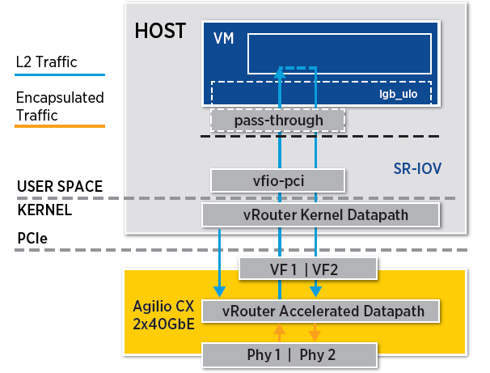

= chapter 2: SDN dataplane fundamentals
:doctype: book
:toc: right
:toclevels: 3
:source-highlighter: pygments
:pygments-style: manni
:data-uri:
:pygments-linenums-mode: table

== Virtualization concepts

=== Server virtualization

Kernel-based Virtual Machine (KVM) is an open source virtualization technology built into Linux.
It provides hardware assist to the virtualization software, using built-in CPU virtualization technology to reduce virtualization overheads (cache, I/O, memory) and improving security.

QEMU is a hosted virtual machine emulator that provides a set of different hardware and device models for the guest machine.
For the host, QEMU appears as a regular process scheduled by the standard Linux scheduler, with its own process memory.
In the process, QEMU allocates a memory region that the guest sees as physical and executes the virtual machine’s CPU instructions.

With KVM, QEMU can just create a virtual machine with virtual CPUs (vCPUs) that the processor is aware of and runs native-speed instructions.
When a special instruction is reached by KVM, like the ones that interacts with the devices or to special memory regions, vCPU pauses and informs QEMU of the cause of pause, allowing hypervisor to react to that event.

LibVirt is an Open Source toolkit to manage virtualization platforms.
Libvirt is collection of softwares which allow to manage virtual machines and other virtualization functionality, such as storage and network interface management.
LibVirt is proposing to define virtual components in a XML-formatted configurations, that are able to be translated into QEMU command line.

ifdef::word[image::../diagrams/extracted-media-chapter2cleaned4adoc.docx/media/image1.emf[image]]
ifndef::word[image::../diagrams/extracted-media-chapter2cleaned4adoc.docx/media/image1.png[image]]

=== Inter Process Communication

Inter process communication (IPC) is a mechanism which allows processes to communicate with each other and synchronize their actions.
The communication between these processes can be considered as a method of cooperation between them.

IPC is used in network virtualization in order to be able to exchange data
between different distributed processes of a same application (for example,
virtio frontend and backend, contrail vrouter agent and dataplane, etc ...) or
between processes of distinct applications (e.g., contrail vrouter and QEMU
virtio, virtio and VFIO, and so on)

Two different modes of communication are used for IPC:

- Shared Memory: processes are reading and writing information into shared memory region.
- Message Passing: processes are establishing a communication link which will be used to exchange messages.

==== Shared Memory

Following scenario is used when shared memory is used for IPC:

* First, a shared memory area is defined (shmget) with a key identifier known by processes involved into the communication.
* Second, processes are attaching (shmat) to the shared memory and are retrieving a memory pointer.
* Then, processes are reading or writing information in the shared memory using the shared memory pointer (read/write operation).
* Next, processes are detaching from the shared memory (shmdt)
* Last, the shared memory area is freed (shmctl)

Following system calls are used in shared memory IPC:

* shmget: create the shared memory segment or use an already created shared memory segment.
* shmat: attach the process to the already created shared memory segment.
* shmdt: detach the process from the already attached shared memory segment.
* shmctl: control operations on the shared memory segment (set permissions, collect information).

==== Message passing

Several message passing methods are available to exchange data information between processes:

* eventfd: is a system call that creates an "eventfd object" (64-bit integer).
  It can be used as an event wait/notify mechanism by user-space applications,
  and by the kernel to notify user-space applications of events.
* pipe (and named pipe) are unidirectional data channel.  Data written to the
  write-end of the pipe is buffered by the operating system until it is read
  from the read-end of the pipe.
* Unix Domain Socket: domain sockets use the file system as their address
  space.  Processes reference a domain socket as an inode, and multiple
  processes can communicate using a same socket.  The server of the
  communication binds a Unix socket to a path in the file system, so a client
  can connect to it using that path.

There are some other mechanisms that can be used by processes to exchange
messages (shared file, message queues, network sockets, and signals system
calls) and are not described in this document.

=== Network device Architecture and concepts

==== Control and Data paths

Two different flows are used by a network application using a NIC device:

* Control: manages configuration changes (activation/deactivation) and
  capability negotiation (speed, duplex, buffer size) between the NIC and
  network application for establishing and terminating the data path on which
  data packets will be transferred.

* Data: performs data packets transfer between NIC and network application.
Packet are transferred from NIC internal buffer to a host memory area which is reachable by the network application.

ifdef::word[image::../diagrams/extracted-media-chapter2cleaned4adoc.docx/media/image2.emf[image]]
ifndef::word[image::../diagrams/extracted-media-chapter2cleaned4adoc.docx/media/image2.png[image]]

Each flow is using a well-defined path:

* control path
* data path

==== Event versus polling based packet processing

Linux network stack is using an event-based packet processing method.
In such a method every incoming packet hitting the NIC:

* is copied in host memory via DMA
* then the NIC generates an interrupt.
* then a Kernel module is placing the packet into a "socket buffer"
* application runs a "read" system call

for every egress packet generated by the network application:

- application performs a write call on the socket in order to copy the generated packet from the applications user space to a socket buffer
- Kernel device driver invokes the NIC DMA engine to transmit the frame onto the wire.
- Once transmission is complete, the NIC raises an interrupt to signal transmit completion in order to get socket buffer memory freed.

This method is not efficient when packets are hitting the NIC at a high packet rate.
Lots of interrupts are generated, creating lots of context switching (kernel to user and vice-versa).

[cols=",",]
|====
a| 
ifdef::word[image::../diagrams/extracted-media-chapter2cleaned4adoc.docx/media/image3.emf[image] Event based packet processing]
ifndef::word[image::../diagrams/extracted-media-chapter2cleaned4adoc.docx/media/image3.png[image] Event based packet processing]

a| 
ifdef::word[image::../diagrams/extracted-media-chapter2cleaned4adoc.docx/media/image4.emf[image] polling based packet processing]
ifndef::word[image::../diagrams/extracted-media-chapter2cleaned4adoc.docx/media/image4.png[image] polling based packet processing]
|====

Polling based packet processing is an alternate method (it is used by DPDK). All incoming packets are copied transparently (without generating any interrupt) by the NIC into a specific host memory area region (predefined by the application). At a regular pacing, the network application is reading (polling) packets stored into this memory area.

On the opposing direction, the network application is writing packet into the shared memory area region.
A DMA transfer is triggered to copy the packet from the host memory to the NIC card buffers.

No interrupt is used with this method, but it requires network application to check at a regular pacing whether a new packet has hit the NIC.
This method is well suited for high rate packet processing: If packets are arriving at a slow rate this algorithm is less efficient as the event based one.

=== Network devices virtualization

Like CPU virtualization, two kinds of methods are used to virtualize network devices:

* Software-Based Emulation.
* Hardware-assisted Emulation.

Software Based Emulation are widely supported but can suffer of poor performance.
Hardware assisted Emulation if providing good performance thanks to hardware acceleration, but it requires to use a hardware that supports some specific features.

==== Software-Based Emulation.

Two solutions are proposed for device virtualization with software:

* Traditional Device Emulation (Binary Translation): the guest device drivers are not aware of the virtualization environment.
During runtime, the Virtual Machine Manager (VMM), usually QEMU/KVM, will trap all the IO and Memory-mapped I/O (MMIO) accesses and emulate the device behavior (trap and emulate mechanism). +
The Virtual Machine Manager (VMM) emulates the I/O device to ensure compatibility and then processes I/O operations before passing them on to the physical device (which may be different). Lots of VMEXIT (context switching) are generated with this method.
It provides poor performance.

* Paravirtualized Device Emulation (virtio): the guest device drivers are aware of the virtualization environment.
This solution uses a front-end driver in the guest that works in concert with a back-end driver in the Virtual Machine Manager (VMM). These drivers are optimized for sharing and have the benefit of not needing to emulate an entire device.
The back-end driver communicates with the physical device.
Performance are much better than with Traditional Device Emulation.

Software emulated devices can be completely virtual with no physical counterpart or physical ones exposing a compatible interface.

==== Hardware-assisted Emulation.

Two solutions are proposed for device virtualization assisted with hardware:

* Direct Assignment: allows a VM to access directly to a network device.
Thus the guest device drivers can directly access the device configuration space to, e.g., launch a DMA operation in a safe manner, via IOMMU. +
Drawbacks:

* direct assignment has limited scalability.
A physical device can only be assigned to one single VM.
* IOMMU must be supported by the host CPU (Intel VT-d or AMD-Vi feature).

* SR-IOV: with SR-IOV, each physical device (physical function) can appear as multiple virtual ones (aka virtual function). Each virtual function can be directly assigned to one VM, and this direct assignment is using the vt-d/IOMMU feature.
* Drawbacks:

* IOMMU must be supported by the host CPU (Intel VT-d or AMD-Vi feature).
* SR-IOV must be supported by the NIC device (but also by the BIOS, the host OS and the guest VM).

=== Emulated network devices

The following two emulated network devices are provided with QEMU/KVM:

* e1000 device: emulates an Intel E1000 network adapter (Intel 82540EM, 82573L, 82544GC).
* rtl8139 device: emulates a Realtek 8139 network adapter.

=== Paravirtualized network device

Virtio is an open specification for virtual machines' data I/O communication, offering a straightforward, efficient, standard and extensible mechanism for virtual devices, rather than boutique per-environment or per-OS mechanisms.
It uses the fact that the guest can share memory with the host for I/O to implement that.

Virtio was developed as a standardized open interface for virtual machines (VMs) to access simplified devices such as block devices and network adaptors.

==== Virtio frontend and backend

VirtIO interface is made of backend component and a frontend component:

* The frontend component is the guest side of the virtio interface
* The backend component is the host side of the virtio interface

ifdef::word[image::../diagrams/extracted-media-chapter2cleaned4adoc.docx/media/image5.emf[image]]
ifndef::word[image::../diagrams/extracted-media-chapter2cleaned4adoc.docx/media/image5.png[image]]

==== Virtio transport protocol

virtio network driver is the VirtIO frontend component exposed into the guest VM

virtio network device is the VirtIO backend component exposed by the hypervisor.

Virtual Network frontend and backends are interconnected with a transport protocol (usually PCI/PCIe).

The virtio drivers must be able to allocate memory regions that both the hypervisor and the devices can access for reading and writing, via memory sharing.
Two different domains have to be considered for a network device:

* virtio device initialization, activation or shutdown (control plane)
* network packets transfer through the virtio device (data plane)

ifdef::word[image::../diagrams/extracted-media-chapter2cleaned4adoc.docx/media/image6.emf[image]]
ifndef::word[image::../diagrams/extracted-media-chapter2cleaned4adoc.docx/media/image6.png[image]]

Control plane is used for capability exchange negotiation between the host and guest both for establishing and terminating the data plane.
Data plane is used for transferring the actual packets between host and guest.

Virtqueues are the mechanism for bulk data transport on virtio devices.
They are composed of:

* guest-allocated buffers that the host interacts with (read/write packets)
* descriptor rings

Virqueues are controlled with I/O Registers notification messages:

* Available Buffer Notification: virtio driver notifies there are buffers that are ready to be processed by the device.
* Used Buffer Notification: virtio device notifies it has finished processing some buffers.

==== Virtio device network backend

The network backend that interacts with the emulated NIC and which is exposed on the host side.
Usually network backend is a tap device.
But other backends are proposed with VirtIO (SLIRP, VDE, Socket)

tap devices are virtual point-to-point network devices that the user space applications can use to exchange L2 packets.
Tap devices are requiring tun kernel module to be loaded.
Tun kernel modules create a kind of device in /dev/net system directory tree (/dev/net/tun).

Each new tap device has a name in the /dev/net/tree filesystem.

==== Virtio net backend drawbacks

The usual transport backend used by virtio net device is presenting some inefficiencies:

* syscall and data copy are required for each packet to send or receive through the tap interface (no bulk transfer mode).
* virtio driver (front end) notifies there are one available packet for the virtio device (backend) with an interrupt messages (IOCTL)
* each interrupt message stops vCPU execution and generate a context switch (vmexit). Then the host processes the available packet and resume (vmexit) the VM execution using a syscall.

Each time a packet is sent, the VM stops to work to get the available packet processed.

ifdef::word[image::../diagrams/extracted-media-chapter2cleaned4adoc.docx/media/image7.emf[image]]
ifndef::word[image::../diagrams/extracted-media-chapter2cleaned4adoc.docx/media/image7.png[image]]

Hypervisor is involved in both virtio control plane and data plane.

==== vhost protocol

vhost protocol was designed in order to address virtio device usual transport backend limitations.
It's a message-based protocol which allows the hypervisor to offload the data plane to a handler.
The handler is a component which manage virtio data forwarding.
The host hypervisor is no longer process packets.

The dataplane is fully offloaded to the handler that reads or writes packets to/from the virtqueues.
vhost handler direclty access the virtqueues memory region as well as send and receive notification messages.

vhost handler is made up of two parts:

* vhost-net

* a kernel driver
* it exposes a character device on /dev/vhost-net
* uses ioctls to exchange vhost messages (vhost protocol control plane),
* uses irqfd and ioeventfd file descriptor to exchange notifications with the guest.
* spawns a vhost worker thread

* vhost worker

* a linux thread named vhost-<pid> (<pid> is the hypervisor process ID)
* handles the I/O events (generated by virtio driver or tap device)
* forwards packets (copy operations)

A tap device is still used to communicate the guest instance with the host, but the virtio dataplane is managed by vhost handler and is no more processed by the hypervisor.

Guest instances is no more stopped (context switch with a VMEXIT) at each VirtIO packet transfer.

New virtio vhost-net packet processing backend is completely transparent to the guest who still uses the standard virtio interface.

ifdef::word[image::../diagrams/extracted-media-chapter2cleaned4adoc.docx/media/image8.emf[image]]
ifndef::word[image::../diagrams/extracted-media-chapter2cleaned4adoc.docx/media/image8.png[image]]

=== Physical network device Direct I/O Assignment

KVM guests usually have access to software based emulated NIC device (either para-virtualized devices with virtio or traditional emulated devices). On host machines which have Intel VT-d or AMD IOMMU hardware support, another option is possible.
PCI devices may be assigned directly to the guest, allowing the device to be used with minimal performance overhead.

Assigned devices are physical devices that are exposed to the virtual machine.
This method is also known as passthrough.

The VT-d or AMD IOMMU extensions must be enabled in BIOS in order to be able to perform for device Direct Assignment:

Two methods are supported:

* PCI passthrough: PCI devices on the host system are directly attached to virtual machines, providing guests with exclusive access to PCI devices for a range of tasks.
This enables PCI devices to appear and behave as if they were physically attached to the guest virtual machine.
* VFIO device assignment: VFIO improves on previous PCI device assignment architecture by moving device assignment out of the KVM hypervisor and enforcing device isolation at the kernel level.

With VFIO the Physical device is exposed to the host user space memory and is made visible from the guest VM it has been assigned.

ifdef::word[image::../diagrams/extracted-media-chapter2cleaned4adoc.docx/media/image9.emf[image]]
ifndef::word[image::../diagrams/extracted-media-chapter2cleaned4adoc.docx/media/image9.png[image]]

=== SR-IOV

Single Root I/O Virtualization (SR-IOV) specification is defined by the PCI-SIG (PCI Special Interest Group). This is a PCI Express (PCI-e) that extends a single physical PCI function to share its PCI resources as separate virtual functions (VFs).

The physical function contains the SR-IOV capability structure and manages the SR-IOV functionality (it can be used to configure and control a PCIe device).

A single physical port (root port) presents multiple, separate virtual devices as unique PCI device functions (up to 256 virtual functions – depends on device capabilities).

Each virtual device may have its own unique PCI configuration space, memory-mapped registers, and individual MSI-based interrupts.
Unlike a physical function, a virtual function can only configure its own behavior.
Each virtual function can be directly connected to a virtual machine via PCI device assignment (passthrough mode).

SR-IOV improves network device performance for each virtual machine as it can share a single physical device between several virtual machines using device direct I/O assignment method.

ifdef::word[image::../diagrams/extracted-media-chapter2cleaned4adoc.docx/media/image10.emf[image]]
ifndef::word[image::../diagrams/extracted-media-chapter2cleaned4adoc.docx/media/image10.png[image]]

With SR-IOV, each VM has a direct access to the physical network using the assigned virtual function interface allocated to each.
They can communicate altogether using the Virtual Ethernet Bridge provided by the NIC card.
A virtual switch can also use SRIOV to get access to the physical network.
VM using SRIOV assigned virtual function device has a direct access to the physical network and are not connected to any intermediate virtual network switch or router.

ifdef::word[image::../diagrams/extracted-media-chapter2cleaned4adoc.docx/media/image11.emf[image]]
ifndef::word[image::../diagrams/extracted-media-chapter2cleaned4adoc.docx/media/image11.png[image]]

Following command can be used to check whether SR-IOV is supported or not on a physical NIC card:

$ lspci -s <NIC_BDF> -vvv | grep -i "Single Root I/O Virtualization"

=== VirtIO SR-IOV and SDN

VirtIO is bringing lots of flexibility.
VirtIO is offering a standardized driver which is fully independent of the hardware used on the physical platform hosting VM instances.

When virtio connectivity is used VM can be easily migrated from one host to another using "live migration" feature.
When SRIOV is use, this live migration is not an easy task and is not really possible to achieve.

Indeed, network driver used by VM depends on used hardware on the bare metal node which are hosting them.
In order to make VM migration from one bare metal node to another, both nodes must at least to use same hardware NIC model.
But when SRIOV is used VM connectivity is having barely the same performance has a real physical NIC, whereas with VirtIO, performance could be poor.

Also, SRIOV, providing a direct access to the physical NIC is making host virtual network nodes (virtual router/switch) used by SDN solution totally blind about VM using such connectivity.
Local traffic switching between VM connected on a same SRIOV physical card is achieve by the Virtual Ethernet bridge proposed by SRIOV.
Communication between VM connected onto distinct SRIOV physical ports must rely on physical network.

SDN vswitch/vrouter usage is very limited when SRIOV is used.
Indeed, packet switching between VMs which are using VFs of a same SR-IOV physical port are using the physical Virtual Ethernet Bridge hosted in the physical NIC.

Only some few use cases are relevant, which are:

* Provide internal connectivity between VM using distinct SR-IOV physical ports (it avoids to send the traffic out of the server to be processed by the physical network)

ifdef::word[image::../diagrams/extracted-media-chapter2cleaned4adoc.docx/media/image12.emf[image]]
ifndef::word[image::../diagrams/extracted-media-chapter2cleaned4adoc.docx/media/image12.png[image]]

* Build hybrid mode solutions with multi-NIC VM.
Network traffic not requiring high performance is using emulated NIC (management traffic for instance). Network connectivity requiring high performance will be processed by SRIOV assigned NIC (for instance video data traffic).

ifdef::word[image::../diagrams/extracted-media-chapter2cleaned4adoc.docx/media/image13.emf[image]]
ifndef::word[image::../diagrams/extracted-media-chapter2cleaned4adoc.docx/media/image13.png[image]]

With SRIOV we are getting high performance but with poor flexibility and no network virtualization features.
With VirtIO we are getting a high level of network virtualization suitable for SDN, which is very flexible with poor performances.

For SDN use cases, we need network virtualization features and performance.
DPDK will bring both.

== Network Packer processing performance requirements

Ethernet minimum frame size is 64 Bytes.
When Ethernet frames are sent onto the wire, Inter Frame Gap and Preamble bits are added.
Minimum size of Ethernet frames on the physical layer is 84 Bytes (672 bits).

image::../diagrams/extracted-media-chapter2cleaned4adoc.docx/media/image14.png[image,width=560,height=219]

For a 10 Gbit/s interface, the number of frames per seconds can reach up to 14.88 Mpps for traffic using the smallest Ethernet frame size.
It means a new frame will have to be forwarded each 67 ns.

A CPU running at 2Ghz has a 0.5 ns cycle.
Such a CPU has a budget of only 134 cycles per packet to be able to process a flow of 10 Gb/s.

Generic Linux Ethernet drivers are not performant enough to be able to process such a 10Gb/s packet flow.
Indeed, with regular Linux NIC drivers lots of times are required to:

* perform packet processing in Linux Kernel using interrupt mechanism,
* transfer application data from host memory to Network Interface card

DPDK is one of the most used solution available allowing to build a network application using high-speed NICs and working at wire speed.
Therefore, Contrail is proposing DPDK as one of the solutions to be used for the physical compute connectivity.

== DPDK and Network applications

=== DPDK application working principle

DPDK is dedicating one (or more) CPU to one (or more) thread that are continuously polling a one (or more) DPDK NIC RX queue.
CPU on which a DPDK polling thread is started will be loaded at 100% whatever there some packets to process or not, as no interrupt mechanism is used in DPDK to warn the DPDK application that a packet has been received.

ifdef::word[image::../diagrams/extracted-media-chapter2cleaned4adoc.docx/media/image15.emf[image]]
ifndef::word[image::../diagrams/extracted-media-chapter2cleaned4adoc.docx/media/image15.png[image]]

Using DPDK library API, physical NIC packets will be made available into user space memory in which the DPDK application is running.
So, when DPDK is used there is no user space to kernel space context switching and it saves lots of CPU cycles.
Also, the host memory is using large continuous memory area, the huge pages, which allow large data transfers and avoid high data fragmentation in memory which would require a higher memory management effort at the application level.
Such a fragmentation would also cost some precious CPU cycles.

Hence, most of the CPU cycles of DPDK pinned CPU are used for polling and processing packets delivered by the physical NIC in DPDK queues.
As a result, the packet forwarding task can be processed at a very high speed.
If one CPU is not powerful enough to manage incoming packets that are hitting the physical NIC at a very high rate; we can allocate an additional one to the DPDK application in order to increase its packet processing capacity.

A DPDK application is a multi-thread program that is using DPDK library to process network data.
In order to scale, we can start several packet polling and processing threads (each one pinned on a dedicated CPU) that are running in parallel.

3 main components are involved into a DPDK application:

* Physical NIC
** buffering packets in physical queues
** using DMA to transfer packets in host memory
* DPDK NIC abstraction with its queue representation in huge pages host memory:
** descriptor rings
** mbuf (to store packets)
* Linux pThread use to poll and process packets received in DPDK NIC queues.

ifdef::word[image::../diagrams/extracted-media-chapter2cleaned4adoc.docx/media/image16.emf[image]]
ifndef::word[image::../diagrams/extracted-media-chapter2cleaned4adoc.docx/media/image16.png[image]]

=== DPDK overview

Data Plane Development Kit (DPDK) is a set of data plane libraries and network interface controller drivers for fast packet processing, currently managed as an open-source project under the Linux Foundation.

The main goal of the DPDK is to provide a simple, complete framework for fast packet processing in data plane applications.

The framework creates a set of libraries for specific environments through the creation of an Environment Abstraction Layer (EAL), which may be specific to a mode of the Intel® architecture (32-bit or 64-bit), Linux* user space compilers or a specific platform.

These environments are created through the use of make files and configuration files.
Once the EAL library is created, the user may link with the library to create their own applications.

The DPDK implements a "run to completion model" for packet processing, where all resources must be allocated prior to calling Data Plane applications, running as execution units on logical processing cores.

The model does not support a scheduler and all devices are accessed by polling.
The primary reason for not using interrupts is the performance overhead imposed by interrupt processing.

For more information please refer to dpdk.org documents http://dpdk.org/doc/guides/prog_guide/index.html

=== DPDK software architecture

DPDK is a set of programing libraries that can be used to create an application that needs to process network packets at a high speed.
DPDK is proposing following functions:

* A queue manager implements lockless queues
* A buffer manager pre-allocates fixed size buffers
* A memory manager allocates pools of objects in memory and uses a ring to store free objects
* Poll mode drivers (PMD) are designed to work without asynchronous notifications, reducing overhead
* A packet framework made up of a set of libraries that are helpers to develop packet processing

In order to reduce Linux user to kernel space context switching all these functions are made available by DPDK into the user space where applications are running.
User applications using DPDK libraries have a direct access to the NIC cards, without passing through a NIC Kernel driver as it is required when DPDK is not used.

[cols=",",]
|====
a|
Regular Network Application

ifdef::word[image::../diagrams/extracted-media-chapter2cleaned4adoc.docx/media/image17.emf[image]]
ifndef::word[image::../diagrams/extracted-media-chapter2cleaned4adoc.docx/media/image17.png[image]]

a|
Network Application with DPDK

ifdef::word[image::../diagrams/extracted-media-chapter2cleaned4adoc.docx/media/image18.emf[image]]
ifndef::word[image::../diagrams/extracted-media-chapter2cleaned4adoc.docx/media/image18.png[image]]

|====

DPDK is allowing to build user-space multi-thread network application using the POSIX thread (pthread) library.

DPDK is a framework which is made of several libraries:

* Environment Abstraction Layer (EAL)
* Ethernet Devices Abstraction (ethdev)
* Queue Management (rte_ring)
* Memory Pool Management (rte_mempool)
* Buffer Management (rte_mbuf)
* Timer Manager (librte_timer)
* Ethernet Poll Mode Driver (PMD)
* Packet Forwarding Algorithm made up of Hash (librte_hash) and Longest Prefix Match (LPM,librte_lpm) libraries
* IP protocol functions (librte_net)

Ethdev library exposes APIs to use the networking functions of DPDK NIC devices.
The bottom half part of ethdev is implemented by NIC PMD drivers.
Thus some features may not be implemented.

Poll Mode ethernet Drivers (PMDs) are a key component for DPDK.
These PMDs by-pass the kernel and are providing a direct access to the Network Interface Cards (NIC) used with DPDK.

Linux user space device enablers (UIO or VFIO) are provided by Linux Kernel and are required to run DPDK.
They are allowing to discover and expose PCI devices information and address space through the `/sys` directory tree.

DPDK libraries are allowing kernel-bypass application development:

* probing for PCI devices (attached via a Linux user space device enabler),
* huge-page memory allocation,
* data structures geared toward polled-mode message-passing applications:
** such as lockless rings
** memory buffer pools with per-core caches.

The diagram below is providing an overview of DPDK libraries.

ifdef::word[image::../diagrams/extracted-media-chapter2cleaned4adoc.docx/media/image19.emf[image]]
ifndef::word[image::../diagrams/extracted-media-chapter2cleaned4adoc.docx/media/image19.png[image]]

Only few libraries have been described in this diagram: Set of libraries is enriched at each new DPDK release (cf: https://www.dpdk.org/).

=== DPDK Environment Abstraction Layer

The Environment Abstraction Layer (EAL) is responsible to provide access to low-level resources such as hardware and memory space.
It provides a generic interface that hides the environment specifics from the applications and libraries.
The EAL performs physical memory allocation using mmap() in hugetlbfs (using huge page sizes to increase performance).

Provided services by EAL are:

* DPDK loading and launching
* Support for multi-process and multi-thread execution types
* Core affinity/assignment procedures
* System memory allocation/de-allocation
* Atomic/lock operations
* Time reference
* PCI bus access
* Trace and debug functions
* CPU feature identification
* Interrupt handling
* Alarm operations
* Memory management (malloc)

ifdef::word[image::../diagrams/extracted-media-chapter2cleaned4adoc.docx/media/image20.emf[image]]
ifndef::word[image::../diagrams/extracted-media-chapter2cleaned4adoc.docx/media/image20.png[image]]

== DPDK memory management

=== DPDK optimized memory management for speed

DPDK has a highly optimized memory manager.
DPDK works on a group of fixed size objects called a mempool.
Every one of them are pre-allocated.
DPDK does not encourage dynamic allocations because it consumes a lot of CPU cycles and it is a speed killer.

DPDK stores incoming packets into mbufs (memory buffers). DPDK pre-allocates a set of mbufs and keeps it in a pool called mempool.

DPDK makes use of mempools each time it needs to allocate a mbuf where packets are stored.
Instead of allocating a single mbuf, DPDK do a bulk allocation, or bulk free once packets are consumed.
By doing this, packets to be processed (mbufs) are already in cache memory.
Therefore, DPDK is very cache friendly.

Mempool has further optimizations.
It is very cache friendly.
Everything is aligned to the cache and has a some mbufs allocated for each DPDK thread or lcore.
Each mempool are also bound with rings which are referencing mbufs containing packets stored into mempool.

Each ring is a highly optimized lockless ring.
It can be used by several lcores in a multi-producer/multi-consumer kind of scenario without locks.
By avoiding locks, DPDK gets large performance gains, as data structures locking is also a speed killer.

=== mbufs and mempools

Network Data are stored in compute central memory (in huge page area).

DPDK uses message buffers known as `mbufs` to store packet data into the host memory.
These `mbufs` are stored in memory pools known as `mempools`.

ifdef::word[image::../diagrams/extracted-media-chapter2cleaned4adoc.docx/media/image21.emf[image]]
ifndef::word[image::../diagrams/extracted-media-chapter2cleaned4adoc.docx/media/image21.png[image]]

mbufs are storing DPDK NIC incoming and outgoing packets which have to be processed by the DPDK application.

=== Packet descriptors

`DPDK queues are not storing the packets but a pointer onto the real packet.
It avoids performing a data transfer that would be needed when packets have to be forward from a DPDK NIC to another.`

ifdef::word[image::../diagrams/extracted-media-chapter2cleaned4adoc.docx/media/image22.emf[image]]
ifndef::word[image::../diagrams/extracted-media-chapter2cleaned4adoc.docx/media/image22.png[image]]

Packets are not moved from one queue to another, but these are descriptors (pointers) that are moving from one queue to another.

ifdef::word[image::../diagrams/extracted-media-chapter2cleaned4adoc.docx/media/image23.emf[image]]
ifndef::word[image::../diagrams/extracted-media-chapter2cleaned4adoc.docx/media/image23.png[image]]

=== DPDK rings

`Descriptors` are set up as a `ring`. A ring is a circular array of `descriptors.` Each `ring` describes a single direction DPDK NIC queue.
Each DPDK NIC queue is made up of 2 rings (1 per direction: 1 RX ring, 1 TX ring).

ifdef::word[image::../diagrams/extracted-media-chapter2cleaned4adoc.docx/media/image24.emf[image]]
ifndef::word[image::../diagrams/extracted-media-chapter2cleaned4adoc.docx/media/image24.png[image]]

Each `descriptor` points onto a packet that has been received (RX ring) or that is going to be transmitted (TX ring).

The more descriptors RX/TX rings are containing, the more memory size will be required in each mempool (number of mbufs) to store data.

=== Data Transfer between host NIC and memory

DPDK application is only processing packets that are exposed in user space host OS memory. +
DPDK rings are an abstraction of the real NIC queues: DPDK is using DMA to keep synchronized at anytime between the NIC hardware queues and its DPDK representation in the host memory.

==== Physical NIC incoming packets

When an incoming packet is reaching the physical NIC interface, it is stored in NIC physical queue memory.
RX ring is managing packets that have to be processed by a DPDK application.

Synchronization between the host OS and the NIC happens through two registers, whose content is interpreted as an index in the RX ring:

* Receive Descriptor Head (RDH): indicates the first descriptor prepared by the OS that can be used by the NIC to store the next incoming packet.
* Receive Descriptor Tail (RDT): indicates the position to stop reception, i.e. the first descriptor that is not ready to be used by the NIC.

ifdef::word[image::../diagrams/extracted-media-chapter2cleaned4adoc.docx/media/image25.emf[image]]
ifndef::word[image::../diagrams/extracted-media-chapter2cleaned4adoc.docx/media/image25.png[image]]

DMA transfer is copying transparently packets from physical NIC memory to the host central memory.
DMA is using RDT descriptor as destination memory address for the data to be transferred.

Once packets have been transferred into host memory both RX rings and RDT are updated.

==== Physical NIC outgoing packets

When a packet has to be sent from host memory to the physical NIC interface, it is referenced in NIC TX ring by the DPDK application.
TX ring is managing packets that have to be transferred onto a NIC card.

ifdef::word[image::../diagrams/extracted-media-chapter2cleaned4adoc.docx/media/image26.emf[image]]
ifndef::word[image::../diagrams/extracted-media-chapter2cleaned4adoc.docx/media/image26.png[image]]

Synchronization between the host OS and the NIC happens through two registers, whose content is interpreted as an index in the TX ring:

* Transmit Descriptor Head (TDH): indicates the first descriptor that has been prepared by the OS and has to be transmitted on the wire.
* Transmit Descriptor Tail (TDT): indicates the position to stop transmission, i.e. the first descriptor that is not ready to be transmitted, and that will be the next to be prepared.

== DPDK and packet processing

=== Linux pthreads

Multithreading is the ability of a CPU (single core in a multi-core processor architecture) to provide multiple threads of execution concurrent.
In a multithreaded application, the threads share some CPU resources memory:

* CPU caches
* translation lookaside buffer (TLB)

A single Linux process can contain multiple threads, all of which are executing the same program.
These threads share the same global memory (data and heap segments), but each thread has its own stack (local variables).

Linux pThreads (POSIX threads) is a C library which contains a set functions that are allowing to manage threads into an application.
DPDK is using Linux pThreads library.

=== DPDK lcores

DPDK is using threads that are designed as "lcore”. A “lcore" refers to an EAL thread, which is really a Linux pthread, which is running onto a single processor execution unit.

* first lcore: that executes the main() function and that launches other lcores is named master lcore.
* any lcore: that is not the master lcore is a slave lcore.

Lcores are not sharing CPU units.
Nevertheless, if the host processor supports hyperthreading, a core may include several lcores or threads.

lcores are used to run DPDK application packet processing threads.
Several packet processing models are proposed by DPDK.
The simplest one is the Run-To-Completion model.

ifdef::word[image::../diagrams/extracted-media-chapter2cleaned4adoc.docx/media/image27.emf[image]]
ifndef::word[image::../diagrams/extracted-media-chapter2cleaned4adoc.docx/media/image27.png[image]]

Run-to-Completion, is using a single thread (lcore) for end to end packet processing (packet polling, processing and forwarding).

=== Multicore Scaling - Pipeline model

A complex application is typically split across multiple cores, with cores communicating through Software queues.

Packet Framework facilitates the creation of pipelines.
Each pipeling thread is assigned to a CPU and is using software queues like output or/and input ports.

ifdef::word[image::../diagrams/extracted-media-chapter2cleaned4adoc.docx/media/image28.emf[image]]
ifndef::word[image::../diagrams/extracted-media-chapter2cleaned4adoc.docx/media/image28.png[image]]

For instance, Contrail DPDK vRouter is using such a model for GRE encapsulated packet processing.

=== Control Threads

It is possible to create Control Threads.
Those threads can be used for management/infrastructure tasks and are used internally by DPDK for multi process support and interrupt handling.

=== Service Core

DPDK service cores enables a dynamic way of performing work on DPDK lcores.
Service core support is built into the EAL, and an API is provided to optionally allow applications to control how the service cores are used at runtime.

== DPDK and Poll Mode Drivers (PMD)

When DPDK is used, Network interfaces are no more managed in Kernel space.
Regular Linux NIC driver which is usually used to manage the NIC has to be replaced by a new driver which is able to run into user space.
This new drive, called Poll Mode Driver (PMD) will be used to manage the network interface into user space with the DPDK library.

=== Physical NIC and BAR registers

PCI devices have a set of registers referred to as configuration space for devices.
These configuration space registers are mapped to host memory locations.

When a PCI device is enabled, the system's device drivers (by writing configuration commands to the PCI controller) programs the Base Address Registers (BAR) to inform the PCI device of its address mapping.
Next, the host operating system is able to address this PCI device.

=== Linux NIC drivers

With usual Linux NIC Kernel, both NIC configuration and Packet processing is done in Kernel Space.
User applications which have to establish a TCP connection or send a UDP packet is using the sockets API, exposed by libc library.

[cols=",",]
|====
a|
ifdef::word[image::../diagrams/extracted-media-chapter2cleaned4adoc.docx/media/image29.emf[image]]
ifndef::word[image::../diagrams/extracted-media-chapter2cleaned4adoc.docx/media/image29.png[image]]

NIC configuration

a|
ifdef::word[image::../diagrams/extracted-media-chapter2cleaned4adoc.docx/media/image30.emf[image]]
ifndef::word[image::../diagrams/extracted-media-chapter2cleaned4adoc.docx/media/image30.png[image]]

NIC packet processing

|====

Linux Packet Processing with sockets API is requiring following operations which are costly:

* Kernel Linux System calls
* Multitask context switching on blocking I/O
* Data copying from kernel (ring buffers) to user space
* Interrupt handling in kernel

With usual Linux Drivers most of operations are occurring in Kernel modes and are requiring lots of user space to kernel space context switching and interruption mechanisms.
The heavy context switching usage is costing lots of CPU cycles and is a limiting the numbers of packets that a CPU is able to process.
Such drivers are not able to perform packet processing at expected high speed, especially when 10/40/100G Ethernet generation cards are used on a Linux System.

=== Poll Mode Drivers

A Poll Mode Driver consists of APIs, running in user space, to configure the devices and their respective queues.
In addition, a PMD accesses the RX and TX descriptors directly without any interrupts (with the exception of Link Status Change interrupts) to quickly receive, process and deliver packets in the user’s application.

Poll Mode drivers are involved in NIC configuration.
They are exposing NIC configuration registers into host memory area which is directly reachable from user space.

[cols=",",]
|====
a|
ifdef::word[image::../diagrams/extracted-media-chapter2cleaned4adoc.docx/media/image31.emf[image]]
ifndef::word[image::../diagrams/extracted-media-chapter2cleaned4adoc.docx/media/image31.png[image]]

NIC configuration

a|
ifdef::word[image::../diagrams/extracted-media-chapter2cleaned4adoc.docx/media/image32.emf[image]]
ifndef::word[image::../diagrams/extracted-media-chapter2cleaned4adoc.docx/media/image32.png[image]]

NIC packet processing

|====

In short, Poll Mode Drivers are user space pthreads which:

* call specific EAL functions
* have a per NIC implementation
* have direct access to RX/TX descriptors
* use Linux user space device enablers (UIO or VFIO) driver for specific control changes (interrupts configuration)

Hence user applications can configure directly the NIC cards they are using from Linux user space where they are running.

A first configuration phase is using Poll Mode Drivers and DPDK library to configure DPDK rings buffers into Linux user space.
Next, incoming packets will be automatically transferred with DMA (Direct Memory Access) mechanism from NIC physical RX queues in NIC memory to DPDK RX rings buffer in host memory.
DMA (Direct Memory Access) is also used to transfer outgoing packets from DPDK TX rings buffer in host memory to NIC physical TX queues in NIC memory.
DMA offloads expensive memory operations, such as large copies or scatter-gather operations, from the CPU.

=== Direct Memory Access (DMA)

Direct Memory Access (DMA) allows PCI devices to read (write) data from (to) memory without CPU intervention.
This is a fundamental requirement for high performance devices.

DMA is a mechanism that is using a specific hardware controller to manage read and write operations into the main system memory (RAM: Random Access Memory). This mechanism is totally independent of the central processing unit (CPU) and does not consume any CPU resource.
A DMA transfer is used to manage data transfer.
DMA transfer is triggered by the CPU and is working in background using the specific hardware resource (DMA controller).

DPDK rings and NIC buffers are synchronized with DMA.
Thanks to this synchronization mechanism, DPDK application can access transparently to NIC packets in user space reading or writing data in DPDK rings.

=== IOMMU

Input–Output Memory Management Unit (IOMMU) is a memory management unit (MMU) that connects a Direct Memory Access (DMA) capable I/O bus to the main memory.

In Virtualization, an IOMMU is re-mapping the addresses accessed by the hardware into a similar translation table that is used to map guest virtual machine address memory to host-physical addresses memory.

ifdef::word[image::../diagrams/extracted-media-chapter2cleaned4adoc.docx/media/image33.emf[image]]
ifndef::word[image::../diagrams/extracted-media-chapter2cleaned4adoc.docx/media/image33.png[image]]

IOMMU provides a short path for device to get access only to a well scoped physical device memory area which corresponds to a given guest virtual machine memory.
IOMMU helps to prevent DMA attacks that could be originated by malicious devices.
IOMMU provides DMA and interrupt remapping facilities to ensure I/O devices behave within the boundaries they've been allotted.

Intel has published a specification for IOMMU technology as Virtualization Technology for Directed I/O, abbreviated as VT-d.

In order to get IOMMU enabled:

* both kernel and BIOS must support and be configured to use IO virtualization (such as Intel® VT-d).
* IOMMU must be enabled into Linux Kernel parameters in `/``etc``/default/grub` and run `update-grub` command.

GRUB configuration example with IOMMU Passthrough enabled:

[cols="",]
|====
|GRUB_CMDLINE_LINUX_DEFAULT="iommu=pt intel_iommu=on"
|====

=== DPDK supported NICs

DPDK Library includes Poll Mode Drivers (PMDs) for physical and emulated Ethernet controllers which are designed to work without asynchronous, interrupt-based signaling mechanisms.

* Available DPDK PMD for physical NIC:
** I40e PMD for Intel X710/XL710/X722 10/40 Gbps family of adapters http://dpdk.org/doc/guides/nics/i40e.html
** IXGBE PMD http://dpdk.org/doc/guides/nics/ixgbe.html
** Linux bonding PMD http://dpdk.org/doc/guides/prog_guide/link_bonding_poll_mode_drv_lib.html
* Available DPDK PMD for Emulated NIC:
** DPDK EM poll mode driver supports emulated Intel 82540EM Gigabit Ethernet Controller (qemu e1000 device): +
http://doc.dpdk.org/guides/nics/e1000em.html
** Virtio Poll Mode driver for emulated VirtIO NIC +
http://dpdk.org/doc/guides/nics/virtio.html
** VMXNET3 NIC when VMWare hypervisors are used: +
http://doc.dpdk.org/guides/nics/vmxnet3.html

Lots of other NIC are supported by DPDK (cf http://doc.dpdk.org/guides/nics/overview.html).

Different PMDs may require different kernel drivers in order to work properly (cf Linux User space device enablers). Depending on the PMD being used, a corresponding kernel driver should be loaded and bound to the network ports.

This is also preferable that each NIC has been flashed with the latest version of NVM/firmware.

== Linux user space device enablers

Most of PMD are using generic user space device enablers to expose physical NIC registers in user space into the host memory.
Two space device enablers are widely used by DPDK PMD they are UIO and VFIO.

=== UIO - User Space IO

Linux kernel version 2.6 introduced the User Space IO (UIO) loadable module.
UIO is a kernel-bypass mechanism which provides an API that enables user space handling of legacy interrupts (INTx).

UIO has some limitations:

* UIO does not manage message-signaled interrupts (MSI or MSI-X).
* UIO also does not support DMA isolation through IOMMU.

UIO only supports legacy interrupts so it is not usable with SR-IOV and virtual hosts which require MSI/MSI-X interrupts.

Despite these limitations, UIO is well suited for use in virtual machines, where direct IOMMU access is not available.
In such a situation, a guest instance user space process is not isolated from other processes in the same instance.
But the hypervisor can isolate any guest instance from others or hypervisor host processes using IOMMU.

Currently, two UIO modules are supported by DPDK:

* Linux Generic (uio_pci_generic), which is the standard proposed UIO module included in the Linux kernel.
* DPDK specific (igb_uio) which must be compiled with the same kernel as the one running on the target.

DPDK specific UIO Kernel module is loaded with insmod command after UIO module has been loaded:

    $ sudo modprobe uio
    $ sudo insmod kmod/igb_uio.ko

While a single command is needed to load Linux Generic UIO module:

    $ sudo modprobe uio_pci_generic

DPDK specific UIO module could be preferred in some situation to Linux Generic UIO module (cf: https://doc.dpdk.org/guides/linux_gsg/linux_drivers.html)

=== VFIO – Virtual Function I/O

Virtual Function I/O (VFIO) kernel infrastructure was introduced in Linux version 3.6.

VFIO provides a user space driver development framework allowing user space applications to interact directly with hardware devices by mapping the I/O space directly to the application’s memory.

VFIO is a framework for building user space drivers that provides:

* Mapping of device’s configuration and I/O memory regions to user memory
* DMA and interrupt remapping and isolation based on IOMMU groups.
* Eventfd and irqfd based signaling mechanism to support events and interrupts from and to the user space application.

VFIO exposes APIs which allow to:

* create character devices (in /dev/vfio/)
* support ioctl calls
* support mechanisms for describing and registering interrupt notification.

VFIO driver is an IOMMU/device agnostic framework for exposing direct device access to user space, in a secure, IOMMU protected environment.
For bare-metal environments, VFIO is the preferred framework for Linux kernel-bypass.
It operates with the Linux kernel's IO.

ifdef::word[image::../diagrams/extracted-media-chapter2cleaned4adoc.docx/media/image34.emf[image]]
ifndef::word[image::../diagrams/extracted-media-chapter2cleaned4adoc.docx/media/image34.png[image]]

MMU subsystem is used to place devices into IOMMU groups.
User space processes can open these IOMMU groups and register memory with the IOMMU for DMA access using VFIO ioctl calls.
VFIO also provides the ability to allocate and manage message-signaled interrupt vectors.

A single command is needed to load VFIO module:

    $ sudo modprobe vfio_pci

Despite VFIO has been created to work with IOMMU, VFIO can be also be used without (this is just as unsafe as using UIO).

=== Linux user space device enablers to be used

VFIO is generally the preferred Linux user space device enabler to be used because it supports IOMMU to protect host memory.
When a real hardware PCI device is attached to host system and IOMMU is used with VFIO, all the reads/writes of that device done in user space by the DPDK application will be protected by the host IOMMU.

But there some is few exceptions.
Below is Intel recommendation for the choice of the Kernel driver to be used with DPDK:

image::../diagrams/extracted-media-chapter2cleaned4adoc.docx/media/image35.png[Generic P C I kernel driver ,width=605,height=480]

https://software.intel.com/content/www/us/en/develop/articles/memory-in-dpdk-part-2-deep-dive-into-iova.html

== DPDK and Host Hardware architecture

=== NUMA

NUMA means Non-Uniform Memory Access systems

A traditional server has a single CPU, a single RAM and a single RAM controller.

A RAM can be made of several DIMM banks in several sockets, all being associated to the CPU.
When the CPU needs access to data in RAM, it requests it to its RAM controller.

Recent servers can have multiple CPUs, each one having its own RAM and its own RAM controller.
Such systems are called NUMA systems, or Non-Uniform Memory Access.
For example, in a server with 2 CPUs, each one can be a separate NUMA: NUMA0 and NUMA1.

ifdef::word[image::../diagrams/extracted-media-chapter2cleaned4adoc.docx/media/image36.emf[image]]
ifndef::word[image::../diagrams/extracted-media-chapter2cleaned4adoc.docx/media/image36.png[image]]

NUMA nodes architecture.

* In green: CPU core accessing a memory item located in its own NUMA’s RAM controller, showing minimum latency.
* In red: CPU core accessing a memory item located in the other NUMA through the QPI (Quick Path Interconnect) path and the remote RAM controller, showing a higher latency.

When CPU0 needs to access data located in RAM0, it will go through its local RAM controller 0. Same thing happens for CPU1.

When CPU0 needs to access data located in the other RAM1, the first (local) controller 0 has to go through the second (or remote) RAM controller 1 which will access the (remote) data in RAM 1. Data will use an internal connection between the 2 CPUs called QPI, or Quick Path Interconnect, which is typically of a high enough capacity to avoid being a bottleneck, typically 1 or 2 times 25GBps (400 Gbps). For example, the Intel Xeon E5 has 2 CPUs with 2 QPI links between them; Intel Xeon E7 has 4 CPUs, with a single QPI between pairs of CPUs.

The fastest RAM that the CPU has access to is the register, which is inside the CPU and reserved to it.

Beyond the register, the CPU has access to cached memory, which is a special memory based on higher performance hardware.

image::../diagrams/extracted-media-chapter2cleaned4adoc.docx/media/image37.png[image,width=405,height=346]

Cached memories are shared between the cores of a single CPU.
Typical characteristics of memory cache are:

* Accessing a Level 1 cache takes 7 CPU cycles (with a size of 64KB or 128KB).
* Accessing a Level 2 cache takes 11 CPU cycles (with a size of 1MB).
* Accessing a Level 3 cache takes 30 CPU cycles (with a larger size).

If the CPU needs to access data that is in the main RAM, it has to use its RAM controller.

Access to RAM takes typically 170 CPU cycles (the green line in the diagram). Access to the remote RAM through the remote RAM controller typically adds 200 cycles (the red line in the diagram), meaning RAM latency is roughly doubled.

When data needed by the CPU is located both in the local and in the remote RAM with no particular structure, latency to access data can be unpredictable and unstable.

=== Hyper-threading (HT)

A single physical CPU core with hyper-threading appears as two logical CPUs to an operating system.

While the operating system sees two CPUs for each core, the actual CPU hardware only has a single set of execution resources for each core.

Hyper-threading allows the two logical CPU cores to share physical execution resources.

The sharing of resources allows two logical processors to work with each other more efficiently and allows a logical processor to borrow resources from a stalled logical core (assuming both logical cores are associated with the same physical core). Hyper-threading can help speed processing up, but it’s nowhere near as good as having actual additional cores.

=== Huge pages

Memory is managed in blocks known as pages.
On most systems, a page is 4KB.
1MB of memory is equal to 256 pages; 1GB of memory is 256,000 pages, etc.
CPUs have a built-in memory management unit that manages a list of these pages in hardware.

image::../diagrams/extracted-media-chapter2cleaned4adoc.docx/media/image38.png[image,width=560,height=131]

The Translation Lookaside Buffer (TLB) is a small hardware cache of virtual-to-physical page mappings.
If the virtual address passed in a hardware instruction can be found in the TLB, the mapping can be determined quickly.
If not, a `TLB miss` occurs, and the system falls back to slower, software-based address translation.
This results in performance issues.
Since the size of the TLB is fixed, the only way to reduce the chance of a TLB miss is to increase the page size.

image::../diagrams/extracted-media-chapter2cleaned4adoc.docx/media/image39.png[image,width=560,height=303]

Virtual memory address lookup slows down when the number of entries increases.

A huge page is a memory page that is larger than 4Ki.
In x86_64 architecture, in addition to standard 4KB memory page size, two larger page sizes are available: 2MB and 1GB.

Contrail DPDK vrouter can use both or only one huge page size.

=== CPU isolation and pining

An Operating System is using a scheduler to place each single process and/or threads it has to run onto one CPUs offered by a host.

There are two kinds of scheduling, cooperative and preemptive.
By default, Linux scheduler is using a cooperative mode.

In order to get a CPU booked for a subset of tasks, we have to inform the Operating System scheduler not to use these CPUs for all the tasks it has to run.

These CPUs are told: "isolated" because they are no more used by the OS to process all tasks.
In order to get a CPU isolated several mechanisms can be used:

- remove this CPU from the "common" CPU list used to process all tasks
* change the scheduling algorithm (cooperative to preemptive)
* participate or not to interrupt processing

Isolation and pinning are two complementary mechanisms that are proposed by Linux OS:

* CPU isolation restricts the set of CPUs that are available for Operating System Scheduler level.
When a CPU is isolated, no task will be scheduled on it by the Operating System.
An explicit task assignment must be done.
* CPU pinning is also called processor affinity.
It enables the binding and unbinding of process or a thread onto a CPU. +
On the opposite, CPU pinning is a mechanism that consists in defining a limited set of CPUs that are allowed to be used by:
** the OS Scheduler.
Operating System CPU affinity is managed through systemd.
** a specific process: using CPU pinning rules (taskset command for instance)

Tasks to be run by an operating system must be spread across available CPUs.
These tasks in a multi-threading environment are often made of several processes which are also made of several threads.

=== CPU isolation mechanisms

==== isolcpus

isolcpus is a Kernel scheduler option.
When a CPUs is specified in isolcpus list, it is removed from the general kernel SMP balancing and scheduler algorithms.
The only way to move a process onto or off an "isolated" CPU is via the CPU affinity syscalls (or to use the taskset command).

This isolation mechanism:

* remove isolated CPUs from the "common" CPU list used to process all tasks
* change the scheduling algorithm from cooperative to preemptive
* perform CPU isolation at the system boot

isolcpus is suffering of lots of drawbacks; that are:

* it requires manual placement of processes on isolated cpus.
* it is not possible to rearrange the CPU isolation rules after the system startup
* the only way to change isolated CPU list is by rebooting with a different isolcpus value in the boot loader configuration (GRUB for instance).
* isolcpus is disabling the scheduler load balancer for isolated CPUs.
It also means the kernel will not balance those tasks equally among all the CPUs sharing the same isolated CPUs (having the same affinity mask)

==== CPU shield

cgroups subsystem is proposing a mechanism to dedicate some CPUs to one or several user processes.
It consists in defining a "user shield" group which is protecting a subset of CPU system tasks.

3 cpusets are defined:

* root: present in all configurations and contains all cpus (unshielded)
* system: contains cpus used for system tasks - the ones which need to run but aren't "important" (unshielded)
* user: contains cpus used for tasks we want to assign a set of CPU for their exclusive use (shielded)

CPU shield are manipulated with cset shield command.

==== Tuned

Tuned is a system tuning service for Linux.
Tuned is using Tuned profiles to describe Linux OS performance tuning configuration.

The cpu-partitioning profile partitions the system CPUs into isolated and housekeeping CPUs.
This profile is intended to be used for latency-sensitive workloads.

PS: Tuned is only supported on Linux RedHat OS family.

Cf: https://tuned-project.org/

=== Linux systemd - System task CPU affinity

A thread's CPU affinity mask determines the set of CPUs on which it is eligible to run.

Linux systemd is a software suite that provides an array of system components for Linux operating systems.
Its primary component is an init system used to bootstrap user space and manage user processes.

CPUAffinity parameter restricts all processes spawned by systemd to the list of cores defined by the affinity mask.

==== default CPU affinity

When run as a system instance, systemd interprets the configuration file /etc/systemd/system.conf.
In this configuration file CPUAffinity variable configures the CPU affinity for the service manager as well as the default CPU affinity for all forked off processes.

==== Per service specific CPU affinity

Individual services may override the CPU affinity for their processes with the CPUAffinity setting in unit files

    # vi /etc/systemd/system/<my service>.service
    ...
    [Service]
    CPUAffinity=<CPU mask>

If a specific CPUAffinity has been defined for a given service, it has to be restarted in order for the new configuration file to be taken into consideration.

=== CPU assignment for user processes (taskset)

taskset is used to set or retrieve the CPU affinity of a running process given its PID or to launch a new COMMAND with a given CPU affinity.

We can retrieve the CPU affinity of an existing task:

    # taskset -p pid

Or set it:

    # taskset -p mask pid

== Bind a virtual NIC to DPDK

DPDK requires a direct NIC access into user space.
VirtIO vhost-user backend is exposing the virtio network device in user space.

vhost-user is a library that implements the vhost protocol in user space.
Vhost-user library allows to expose a VirtIO backend interface into user space.

vhost-user library defines the structure of messages that are sent over a unix socket to communicate with the VirtIO net device backend (vhost-net kernel driver is using ioctls instead)

ifdef::word[image::../diagrams/extracted-media-chapter2cleaned4adoc.docx/media/image40.emf[image]]
ifndef::word[image::../diagrams/extracted-media-chapter2cleaned4adoc.docx/media/image40.png[image]]

Kernel Mode Virtual Machine connected to a DPDK compute application

User application is using both:

* vhost user library: for emulated PCI NIC control plane
* DPDK libraries: for emulated PCI NIC data plane

Support for user space vhost has been provided with QEMU 2.1 and above.

== Run DPDK in a guest VM

=== Virtual IOMMU

Virtual IOMMU (vIOMMU) is allowing to emulate IOMMU for guest VMs.

vIOMMU has the following characteristics:

* translates guest virtual machine I/O Virtual Addresses (IOVA) to guest Physical Addresses (GPA)
* Guest virtual machine Physical Addresses (GPA) are translated to Host Virtual Addresses (HVA) through the hypervisor memory management system.
* performs device isolation.
* implements a I/O TLB (Translation Lookaside Buffer) API which exposes memory mappings

In order to get a virtual device working with a virtual IOMMU we have to:

* create the needed IOVA mappings into the vIOMMU
* configure the device’s DMA with the IOVA

Following mechanisms can be used to create vIOMMU memory mappings:

* Linux Kernel’s DMA API for kernel drivers
* VFIO for user space drivers

ifdef::word[image::../diagrams/extracted-media-chapter2cleaned4adoc.docx/media/image41.emf[image]]
ifndef::word[image::../diagrams/extracted-media-chapter2cleaned4adoc.docx/media/image41.png[image]]

The integration between the virtual IOMMU and any user space network application like DPDK is usually done through the VFIO driver.
This driver will perform device isolation and automatically add the memory (IOVA -to GPA) mappings to the virtual IOMMU.

The use of hugepages memory in DPDK contributes to optimize TLB lookups, since a fewer number of memory pages can cover the same amount of memory.
Consequently, the number of Device TLB synchronization messages drop dramatically.
Hence, the performance penalty TLB lookups is lowered.

Cf: https://www.redhat.com/en/blog/journey-vhost-users-realm

https://wiki.qemu.org/Features/VT-d

=== Virtio Poll Mode Driver

Virtio-pmd driver, is a DPDK driver, built on the Poll Mode Driver abstraction, that implements the virtio protocol.

ifdef::word[image::../diagrams/extracted-media-chapter2cleaned4adoc.docx/media/image42.emf[image]]
ifndef::word[image::../diagrams/extracted-media-chapter2cleaned4adoc.docx/media/image42.png[image]]

Vhost user protocol moves the virtio ring from kernel all the way to userspace.
The ring is shared between the guest and DPDK application.
QEMU sets up this ring as a control plane using unix sockets.

If the both the host server guest virtual machine are DPDK there are no VMExits in the host for guest packets processing.
Guest virtual machine uses virtio-net PMD driver and performs packets polling.
So. There is nothing running in kernel here, so there are no system calls.
Since both system calls and VM Exits are avoided, the performance boosts significantly.
It will be an order higher.

=== Physical Network Device Assignment (VFIO) and PCI passthrough

When a DPDK application is running into a guest Virtual Machine, a mechanism has to be used to expose one of the host physical NIC to this guest in order it gets access to the physical network.

IOMMU protects host memory against malicious or bug writes which can corrupt host memory at any time.
But, when a physical device is assigned to a guest virtual machine without vIOMMU usage, the guest memory address space is totally exposed to the hardware PCI device.

ifdef::word[image::../diagrams/extracted-media-chapter2cleaned4adoc.docx/media/image43.emf[image]]
ifndef::word[image::../diagrams/extracted-media-chapter2cleaned4adoc.docx/media/image43.png[image]]

A PCI device can be assigned to a guest in order to be used by a guest DPDK application.
By leveraging VFIO driver in the host kernel we provide a direct access to an assigned physical NIC from this guest protected with IOMMU.

Next, by leveraging VFIO driver in the guest kernel we provide a direct access to the assigned physical from this guest user space.
vIOMMU is providing a secure mechanism to manage DMA transfer between an assigned physical hardware and hosted guest virtual instance memory area.

=== SRIOV and DPDK in Guest VM

This use case is almost the same as PCI passthrough.
VFIO and IOMMU are used to expose a SRIOV virtual function directly to a guest VM.

An additional Physical function driver which is vendor specific is used to manage the virtual function creation on the physical NIC.
This driver is used by a Virtual Machine Manager (like libvirt) to create the virtual function before the virtual instance is spawned.

ifdef::word[image::../diagrams/extracted-media-chapter2cleaned4adoc.docx/media/image44.emf[image]]
ifndef::word[image::../diagrams/extracted-media-chapter2cleaned4adoc.docx/media/image44.png[image]]

Physical incoming packets are directly copied in guest memory without involving the host server.
SR-IOV only allow to share a physical NIC between several guests but does not change the packet processing path provided by PCI passthrough.

== VirtIO assisted Hardware acceleration

With DPDK and VirtIO we have a technology that is allowing to get network virtualization at a high speed.
This is a key technology for SDN dataplane.

But this packet processing model has still some drawbacks:

* DPDK is requiring isolating some host CPUs for its exclusive need.
These is some less CPU resources for the user application
* Compute CPU are generic and are not optimized for packet processing.
DPDK is requiring lots of CPU usage to provide a both feature rich and performant virtual network (host compute for DPDK vrouter/vswich application and on guest VM for DPDK end-user application.

SR-IOV is bringing performance but it’s use is limited in SDN application due to it’s direct path between guest VM and the NIC hardware which bypass the host operating system in which SDN network function are running (vswitch and vrouter).

In coming sections, we are describing some evolution on both VirtIO and direct device assignment in order to provide a solution that:

- is running in user space, like proposed by DPDK
- with hardware performance, like proposed by SRIOV and direct physical device assignment
- features rich to be used in SDN, like proposed by VirtIO software solution.

=== Virtio full offloading

With virtio full hardware offloading, both the virtio data plane and virtio control plane are offloaded to the NIC hardware.
The physical NIC must support:

* the virtio control specification: discovery, feature negotiation, establishing/terminating the data plane.
* the virtio dataplane specification: virtio ring layout.

Hence once the guest memory is mapped with the NIC using virtio physical device passthrough, the guest communicates directly with the NIC via PCI without involving any specific drivers in the host kernel.

Guest VM packet processing is directly performed in NIC hardware like but presented to the guest instance like a regular virtio emulated interface.
Guest VM does not make any difference between a virtio emulated interface and an assigned physical virtio NIC, as they are exposed with the same virtio driver frontend in the guest.

ifdef::word[image::../diagrams/extracted-media-chapter2cleaned4adoc.docx/media/image45.emf[image]]
ifndef::word[image::../diagrams/extracted-media-chapter2cleaned4adoc.docx/media/image45.png[image]]

virtio device passthrough

Virtio device passthrough can be implemented onto a NIC which is supporting or not SR-IOV.

Like other physical device assignment technics presented in this book, VFIO and IOMMU are used to present the physical device NIC into the guest VM user space.

Hence, such a virtio physical NIC can be used by a DPDK application running into a virtual instance.
But, like other virtio device passthrough has also the same limitations for SDN.
As the host operating system is totally by passed by this mechanism, we cannot interconnect instances using such NIC interface with a SDN virtual router or switch.

The main advantage of Virtio device passthrough is the flexibility it provides for a virtual instance to use transparently either a real physical interface or an emulated one.
It offers an Open public specification, which provide device fully independent of any specific vendor.

Virtio full HW offloading, can support live migration thanks to virtio, which is not possible to achieve without any specific implementation with SR-IOV.

But in order to be able to support such a feature, latest virtio specifications (1.1 version) must be implemented onto both QEMU and the NIC hardware used on the cloud infrastructure.

ifdef::word[image::../diagrams/extracted-media-chapter2cleaned4adoc.docx/media/image46.emf[image]]
ifndef::word[image::../diagrams/extracted-media-chapter2cleaned4adoc.docx/media/image46.png[image]]

=== Virtio Datapath Acceleration

Like full hardware offloading, virtual Data Dath Acceleration (vDPA) aims to:

* standardize the physical data plane using the virtio ring layout
* present a standard virtio driver in the guest decoupled from any vendor implementation for the control path

vDPA is presenting a generic control plane through a software piece which provides an abstraction layer on top of physical NIC.

Like Virtio full hardware offloading, vDPA build a direct data path between the gest network interface and the physical NIC, using the virtio ring layout.
But for the control path a generic vDPA driver (mediation driver) is used to translate the vendor NIC driver/control-plane to the VirtIO control plane, in order to allow each NIC vendor to keep using its own driver.

It allows NIC vendors to support virtio ring layout at smaller effort keeping wire speed performance on the data plane.

ifdef::word[image::../diagrams/extracted-media-chapter2cleaned4adoc.docx/media/image47.emf[image]]
ifndef::word[image::../diagrams/extracted-media-chapter2cleaned4adoc.docx/media/image47.png[image]]

virtio datapath acceleration

vDPA is requiring a vendor specific "mediation device driver" to be loaded in the host operating system.

ifdef::word[image::../diagrams/extracted-media-chapter2cleaned4adoc.docx/media/image48.emf[image]]
ifndef::word[image::../diagrams/extracted-media-chapter2cleaned4adoc.docx/media/image48.png[image]]

=== Smart NIC

A NIC card generation commonly named "smart NIC" are highly customizable thanks to the last evolution provided by some new capabilities (FPGA, P4).

It makes possible to envisage SDN vSwitch/vRouter dataplane function to be moved into the NIC card keeping only the controle plane function into the host operating system.

For Contrail solution, this is made by offloading several Contrail vRouter tables including:

* Interface Tables
* Next Hop Tables
* Ingress Label Manager (ILM) Tables
* IPv4 FIB
* IPv6 FIB
* L2 Forwarding Tables
* Flow Tables

It allows to accelerate lookups and forwarding actions that are directly performed into the NIC.

ifdef::word[image::../diagrams/extracted-media-chapter2cleaned4adoc.docx/media/image49.emf[image]]
ifndef::word[image::../diagrams/extracted-media-chapter2cleaned4adoc.docx/media/image49.png[image]]

SDN packet processing is fully done into the NIC card, no more host CPU processing is involved in packet processing.

Two implementations are proposed by Metronome:

SRIOV + SmartNIC:

vDPA + Smart NIC:

image::../diagrams/extracted-media-chapter2cleaned4adoc.docx/media/image51.png[image,width=482,height=383]

=== eBPF and XDP

Berkeley Packet Filter (BPF) was designed for capturing and filtering network packets that matched specific rules.
In last years extended BPF (eBPF) has been designed to take advantage of new hardware (64 bits usage for intance). An eBPF program is "attached" to a designated code path in the kernel.

eXpress Data Path (XDP), uses eBPF to achieve high-performance packet processing by running eBPF programs at the lowest level of the network stack, immediately after a packet is received.
XDP.

ifdef::word[image::../diagrams/extracted-media-chapter2cleaned4adoc.docx/media/image52.emf[image]]
ifndef::word[image::../diagrams/extracted-media-chapter2cleaned4adoc.docx/media/image52.png[image]]

XDP support is made available in the Linux Kernel since version 4.8, while eBPF is supported in the Linux Kernel since version 3.18.

XDP requires:

* MultiQ NICs
* Common protocol-generic offloads:
** TX/RX checksum offload
** Received Side Scaling
** Transport Segmentation offload (TSO)

XDP packet processor performs:

* In Kernel RX packets processing
* Process RX packets directly (without any additional memory allocation for software queue, nor socket buffer allocation)
* Assign one CPU to each RX queue.
This CPU can be configured into poll mode or interrupt mode.
* Trigger BPF program for packet processing

BFP programs:

* parse packets
* perform table lookup
* manage stateful filters
* manipulate packets (encapsulation, decapsulation, NAT, ...)

BFP program main actions are :

* Forward
* Forward after modification (NAT)
* Drop
* Normal receive (regular Linux packet processing with socket buffer and TCP/IP stack)
* Generic Receive Offload (coalesce several received packets of a same connection

XDP is also able to offload an eBPF program to a NIC card which supports it, reducing the CPU load.

ifdef::word[image::../diagrams/extracted-media-chapter2cleaned4adoc.docx/media/image53.emf[image]]
ifndef::word[image::../diagrams/extracted-media-chapter2cleaned4adoc.docx/media/image53.png[image]]

XDP and eBPF does not require:

* to allocate large pages
* to allocate dedicated CPUs
* to choose packet polling or interrupt driven networking model
* user space to kernel space context switching to perform eBPF filtering
* allow packet processing offload when supported by used NIC card

PS: eBPF rules are also supported in DPDK application.

https://www.redhat.com/en/blog/using-express-data-path-xdp-red-hat-enterprise-linux-8

== NIC virtualization solutions summary

We’ve seen lots of NIC virtualization models for virtual instances.
From a full software implementation like proposed by VirtIO to fully hardware assisted solution like proposed by SR-IOV.
Also, DPDK is providing the ability to move NIC packet processing from Kernel space to user space.

In the diagram below we are providing an overview of NIC virtualization solution:

* Fully software solutions are very flexible and fits well with SDN and Cloud feature expectation (Live migration, east-west traffic inside host computes)
* Hardware assisted solutions are very performant but fit less with expected virtualization flexibility.
Guest VM migration is poorly supported due to hardware dependencies.
These solutions fit well with application requiring a huge north-south traffic (from Guest WM to cloud outside).

ifdef::word[image::../diagrams/extracted-media-chapter2cleaned4adoc.docx/media/image54.emf[image]]
ifndef::word[image::../diagrams/extracted-media-chapter2cleaned4adoc.docx/media/image54.png[image]]

In the middle, SmartNIC and DPDK are offering the best compromise for a SDN usage.
Smart NIC are proposing very high performance, but this is still not a fully mature solution (lots of implementations vendor specific, no agreed standard).

////
[cols=",,,,,,",options="header",]
|====
|Feature a|
vhost-net

virtio-net

a|
vhost-user

virtio-pmd

|SR-IOV |Virtio full HW offload |vDPA |Smartnic
|Performance |Low |high a|
very high

(wirespeed)

a|
very high

(wirespeed)

a|
very high

(wirespeed)

a|
very high

(wirespeed)

|data path hardware offloading |No |No |Yes |Yes |Yes |Yes
|control path hardware offloading |No |No |Yes |Yes |No |No
|Guest user NIC |N/A |Yes (DPDK) |Yes (DPDK) |Yes (DPDK) |Yes (DPDK) |Yes (DPDK)
|Guest Kernel NIC |Yes |No |Yes |Yes |Yes |Yes
|VirIO Standard |Yes |Yes |No |Yes |Yes |Yes
|SDN switching support |Yes |Yes |No |No |No |Yes
|Live Migration |Yes |Yes |No |Yes (*) |Yes (*) |Yes (*)
|====
////

image::https://user-images.githubusercontent.com/2038044/90983821-e327f080-e53e-11ea-9420-b50e388e5dba.png[image]
(*): depends on hardware and QEMU latest virtio specification support on the NIC card.
