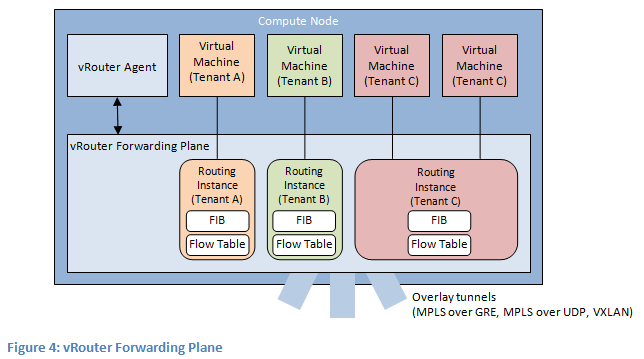
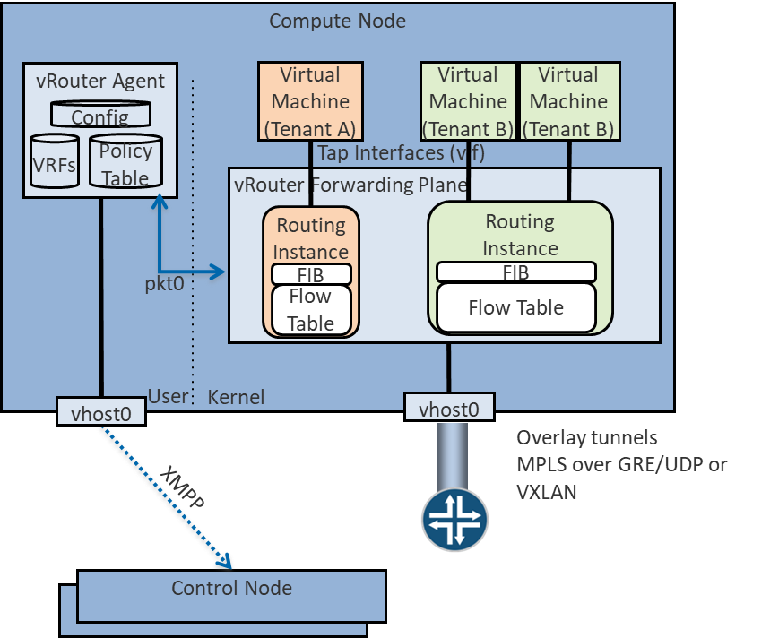

== chapter 3: Contrail DPDK vrouter

=== vrouter architecture

Contrail vrouter is made up of two parts:

* *vRouter agent*: this piece is interconnecting the vRouter with the Contrail control nodes using XMPP protocol. This is the control plane local relay for the vrouter. The actual control plane is located on Contrail control nodes and is shared between all vrouters of the virtual infrastructure.
* *vRouter dataplane*: this piece is performing vrouter network packet processing.

=== vrouter agent with vrouter dataplane and contrail control nodes interconnexion

Contrail vRouter agent is interconnected to :

* *Contrail Control node* : using vhost0 network interface. XMPP packets are exchange between Contrail vRouter agent and Contrail Control nodes through vhost0 interface.
* *Contrail vRouter dataplane* : using pkt0 network interface. Flow and forwarding infromation are exhanged between vrouter agent and vrouter dataplane through pkt0 interface.

=== vrouter dataplanes

3 kind of vrouter dataplanes are supported:

* *Linux Kernel* : vrouter dataplane is a Linux kernel module (vrouter.ko). Using this module, Contrail vRouter can access to Linux Network Interface Card (NIC). Packet forwarding is made by the regular Linux TCP/IP stack. Contrail vRouter dataplane is only taking care to fulfil dataplane forwarding decision information (MAC, IP and flow table information). Linux TCP/IP stack is working in interrupt mode. Consequently, packet processing performance tuning has to be done at Linux Operating System level.

____
image:extracted-media-chapter3cleaned4adoc.docx/media/image3.emf[image]
____

* *DPDK* : vrouter dataplane is a specific packet processing application using DPDK library. NIC cards used by Contrail DPDK vrouter application are removed from the Linux operating system (they are no more visible as an available NIC into the host OS) and bound to the vrouter. Contrail DPDK vrouter is managing both dataplane forwarding decision information (MAC, IP and flow table information) and packet processing. Contrail DPDK application is working in poll mode. Consequently, packet processing performance tuning has mainly to be done at Contrail vrouter application level.

____
image:extracted-media-chapter3cleaned4adoc.docx/media/image4.emf[image]
____

* *SmartNIC* : when SmartNIC is used, Contrail vRouter dataplane is running onto the SmartNIC itself. It means Host resources are not involved in packet processing. It allows to save the high number of CPU resources that can be used for vrouter packet processing in the two previous modes.

____
image:extracted-media-chapter3cleaned4adoc.docx/media/image5.emf[image]
____

==== Kernel vrouter

vRouter agent is fitted with two interfaces:

* Vhost0: used to communicated with Contrail controllers and to exchange XMPP packets
* Pkt0: used to communicate with the vrouter dataplane. The vrouter dataplane is using this interface to forward a copy of any incoming packets for which no processing and forwarding rules is known.

Both vrouter agent interfaces are connected to vif0/1 and vif0/2 vrouter interface.

image:extracted-media-chapter3cleaned4adoc.docx/media/image6.emf[image]

Only a single physical interface can be connected onto the vrouter. This interface is connected onto vif0/0 vrouter interface. For redundancy purpose, we are generally connecting a Linux bond to vif0/0.

Virtual Machine Network interfaces (VNIC) are VirtIO interfaces. Each VNIC is connected to a distinct vif onto the vrouter dataplane (vif0/3 and higher).

A specific Kernel Module is loaded by the vrouter dataplane. This specific Kernel module is allowing the vrouter to get access to Linux TCP/IP stack.

In this architecture, an important part of the packet processing is performed by the Linux TCP/IP stack. NIC queues (either physical or virtual) are handled by Linux Operating system.

For each packet received by a NIC in a RX queue, an interrupt is generated and sent to the vrouter dapaplane in order to get the packet processed by the vrouter. Once a packet has been processed by the vrouter dataplane, it is sent into a TX queue. Then another interrupt is generated for each packet received into the TX queue is order to warn either a virtual machine a packet has been received on one of its virtual NIC or to warn the compute operating system that a packet has to be sent to the underlay network.

Kernel mode vrouter packet processing is working in interrupt mode. This mode is generating lots of context switching between Linux TCP stack and vrouter application.

When the packet flow rate is low this is working well. But as soon as the network packets rate is rising the system is overwhelmed with the number of interrupts generated.

==== DPDK vrouter

Vrouter interface numbering is the same as for Kernel mode.

Vrouter vif0/0 is used to connect the underlay NIC card (usually a Linux bond interface).

Vif0/1 and vif0/2 are used to connect vrouter agent vhost0 and pkt0 interfaces.

Vif0/3 and higher are used to connect Virtual Machine Network interfaces (VNIC).

But when DPDK is used; the vrouter dataplane is fully running into user space. There are no more vrouter dataplane piece of code running into kernel space. DPDK Poll Mode Drivers (PMD) are used to manage network interfaces configuration in user space. A Linux device user space enabler (usually vfio or uio) is used to expose network interfaces registers into user space to make them reachable by DPDK PMD.

All NICs connected to the vrouter are so moved from Linux kernel space to user space and are no more manage nor visible by the operating system. Consequently, this is the DPDK application, here the vrouter, which is fully processing the network packets. Vrouter DPDK dataplane is responsible for packets polling, packets processing and packets forwarding.

No more action is taken in charge by the operating system. All user packet life processing steps are performed by the vrouter DPDK dataplane.

image:extracted-media-chapter3cleaned4adoc.docx/media/image7.emf[image]

The vrouter DPDK dataplane is working into polling mode and no more in interrupt mode. This is very efficient when the network packet rate is high. There are no more context switching between Linux Kernel and vrouter dataplane application, there are no more interrupt generated.

But the network packet rate is low, this way of working could be less efficient than the regular Kernel mode. Indeed, for DPDK mode we are booking a set of CPU only for packet processing purpose. If the network packets rate is too low, lots of CPU cycle are unused and wasted.

=== DPDK dataplane vrouter software architecture

Contrail DPDK dataplane vrouter is built with two software components :

* DPDK library
* VirtIO library

DPDK library is allowing to connect one physical NIC to the Contrail vRouter. This NIC is named vif0. This is the vrouter network interface with the physical infrastructure (underlay network infrastructure). This library is also used to manage packet forwarding:

* between vrouter physical interface and virtual interfaces belonging to Virtual machines. This is the traffic pattern exchanged between local Virtual Machines and remote ones or external networks.
* between vrouter virtual interfaces belonging to Virtual machines that are connected to the vrouter. This is pure local virtual network traffic.

In addition to DPDK, a Linux user space device enabler is required in order the DPDK vRouter to be able to configure physical NIC from user space. VFIO or UIO can be used with Contrail vrouter.

image:extracted-media-chapter3cleaned4adoc.docx/media/image8.emf[image]

VirtIO library is allowing to interconnect the virtual NICs of virtual machines to the vrouter using vHost user protocol.

=== vrouter DPDK dataplane internal architecture

Contrail vrouter DPDK dataplane is made up of several building blocks.

* User packets processing
* Control packets processing
* vrouter DPDK dataplane configuration and control

==== User packets processing

User packets processing is consisting to forward network packets between user Virtual Machines located inside the Cloud infrastructure or between these machines and external networks.

In order to do so, each vrouter DPDK dataplane is built with:

* a vif0/0 network interface which is used to interconnect the vRouter with the physical network
* one to several Virtual NIC belonging to the virtual machines spawn onto the compute node. These virtual NIC are vif0/N on the vrouter (N > 2).

image:extracted-media-chapter3cleaned4adoc.docx/media/image9.emf[image]

The main task of the vrouter consist to forward packets between vif0/0 and other vif 0/N. In order to do so; polling and processing tasks are pinned on vrouter dedicated CPU (polling and processing cores). These polling and processing tasks are reading or writing network packets from vif queues using DPDK functions. These network queues are DPDK rings build with DPDK poll mode driver on the physical NIC connected to vif0/0 or with virtio for virtual machines virtual NIC.

These polling and processing tasks are performed by lcore 10, lcore 11, lcore 12, lcore 13 and higher Linux threads.

==== Control packets processing

One other role of the vrouter DPDK dataplane is to provide the network connectivity between vrouter agent started locally on the compute node and the Contrail Control nodes which are located onto some distinct computes.

Contrail vHost0 interface is the logical network interface used by the vrouter agent to send (or receive) XMPP to (from) the Contrail Control nodes.

vHost0 vrouter agent interface is connected onto vif0/1 on the vrouter DPDK dataplane.

image:extracted-media-chapter3cleaned4adoc.docx/media/image10.emf[image]

vrouter DPDK dataplane polling and processing cores are used to forward XMPP packets between vif0/1 (vrouter agent vhost0 listening interface) and vif0/0 (connectivity to the underlay infrastructure on which Contrail Control nodes are plugged).

==== vrouter DPDK dataplane configuration and control

One last role of the vrouter DPDK dataplane is to provide a network connectivity channel with the vrouter agent. This network channel is used for two main purpose:

* DPDK setup (number of polling and processing cores, DPDK ring size, …) and vrouter dataplane configuration (add/remove virtual NICs to the vrouter)
* Transfer network control information (IP routes, MAC and flow tables) from the vrouter agent to the vrouter dataplane

Two network channels are used:

* vif 0/1 which is bound to pkt0 vrouter agent interface. This network connectivity is used to send a copy of any user incoming packet to the the vrouter agent for which no network processing rules is known by the vrouter dataplane. Then the vrouter agent can take a decision (drop or forward) for this new incoming flow.
* Netlink Unix Socket which is used by the vrouter agent to push network control information (IP routes, MAC and flow tables) to the vrouter dataplane. These information are either pushed :
** In a proactive mode thanks to network information rules provided by Contrail Control nodes
** in a reactive mode in response to a new incoming packet received on vrouter agent pkt0 interface

image:extracted-media-chapter3cleaned4adoc.docx/media/image11.emf[image]

vrouter DPDK dataplane control and configuration task are handled by two kind of threads:

* DPDK control threads for DPDK setup
* vRouter Service threads for vRouter dataplane setup and vrouter control information processing

==== DPDK vrouter internal architecture overview

All different building blocks of Contrail DPDK vrouter are gathered in a single diagram shown below:

image:extracted-media-chapter3cleaned4adoc.docx/media/image12.emf[image]

=== Contrail DPDK vrouter packets processing

==== Packets polling and processing

Incoming packets are placed into each vif (vrouter interface) queue per each network interface card. A vif queue is made up of two DPDK rings:

* one RX ring: in which are stored packets received from a NIC to be processed by the vrouter
* one TX ring: in which are stored packets to be sent by the vrouter to a NIC

image:extracted-media-chapter3cleaned4adoc.docx/media/image13.emf[image]

Packets stored in vif RX rings are polled by a polling task. Then the polled packets are processed by a processing task and put into a target vif TX rings.

Polling and processing tasks are performed into Linux threads. These threads are are automatically spawned by the vrouter onto a well-defined CPU list. The vrouter is running as many as polling and processing threads as the number of polling and processing CPU allocated to the vrouter (defined in CPU_LIST DPDK vrouter variable).

The first polling and processing threads is named lcore10, the next one is named lcore11, and so on. Hence if a DPDK vrouter has been configured with 4 polling and processing CPU into its CPU list, 4 threads will be launched: lcore10, lcore11, lcore12 and lcore13.

image:extracted-media-chapter3cleaned4adoc.docx/media/image14.emf[image]

Each lcore10 and higher started by a DPDK vrouter is a polling a processing thread. They are running onto a single CPU listed into CPU_LIST variable. We will use indifferently in the next sections the term lcore or thread to speak about a vrouter thread pinned to a single CPU.

==== Single Queue versus Multi-Queue NIC

NIC connected to vrouter (either physical or virtual) can be configured to several queues.

Each NIC queue is automatically pinned to a single vrouter polling and processing thread (lcore10 and higher). Consequently, when a NIC is configured with only a single Q, all incoming and outgoing packets are processed by a single vrouter polling and processing threads.

In order to avoid to bind all single queue interfaces on the same polling and processing thread; each interface queue is pinned to a distinct vrouter lcore into a round robin manner when each interface is created. Single queue vif0/1 is automatically pinned to lcore 10, single queue vif0/2 is automatically pinned to lcore 11, and so on.

Hence the vRouter whole CPU power is automatically distributed among all the single queue interfaces. This distribution is automatically defined for each interface and is kept unchanged during all the interface life duration.

When a NIC is configured with several queues, each single Q is bound to a distinct polling and processing thread (lcore). Hence the vRouter whole CPU power is automatically distributed among all the queues of a each multi queue interface.

Even if there is no hard rule that prevent a user to configure a different number of queue on a NIC as the number of lcores (polling and processing threads) configured on the vrouter; the best scenario is to configure each multi queue NIC with a same number of queue as the number of configured polling and processing threads on the vrouter.

image:extracted-media-chapter3cleaned4adoc.docx/media/image15.emf[image]

We also have to take into consideration that currently the DPDK vrouter is unable to process correctly a multi queue NIC which is configured with more queues than the number of polling and processing threads configured on the vrouter.

==== MPLS over GRE overlay

Incoming overlay encapsulated packets are received on the Compute physical Network Interface Card, usually a Bond made up of 2 NICs, used for user packets transport.

Incoming Overlay packets are placed into Physical NIC queues using DPDK RSS (Received Side Scaling) hashing algorithm. A vrouter startup are created (with the help of the physical NIC PMD) as many DPDK queues (both RX and TX rings) as the number of vrouter allocated polling and processing cores.

The hashing algorithm is used 4 tuple values: IP source, IP destination, source port and destination port. Unfortunately, the entropy of these 4 values is low when GRE is used.

Indeed, the 4 tuple values is kept the same between 2 different compute nodes.

All packets coming from different Virtual Machines located on a same compute node will be bound to the same 4 tuple value. Hence, the hashing algorithm will provide an identical value for all network flows coming from each single compute.

image:extracted-media-chapter3cleaned4adoc.docx/media/image16.emf[image]

Consequently, all packets coming from Virtual Machines located on a same compute will be received only in one DPDK RX ring of the vif0/0 interface (vrouter interface connected to the underlay network).

So, incoming MPLS GRE overlay packets are not well balanced onto the different polling and processing threads (lcores) the vrouter is fitted with. Therefore when MPLS GRE overlay is used; it has been chosen to perform the packet processing (packet transformation and delivery in a vif TX ring) onto a different lcore than those used for the packet polling (retrieve a packet from a vif0/0 RX ring).

A DPDK pipeline model is then used. A first lcore is only performing packet polling, a second one is performing the packet processing. Some internal queues are setup in order to store packets that have been polled by the polling lcore thread and that are waiting to be processed by the processing lcore thread.

A hash algorithm is applied onto the decapsulated packet (inner packet) in order to select one of the internal queues that are each handled by a single processing lcore thread.

Thanks to this mechanism, even if few compute nodes are used into the physical infrastructure and user packets carried with MPLS over GRE overlay protocol, all vRouter allocated CPU are used.

==== UDP overlay (VxLAN or MPLS over UDP)

When an UDP overlay protocol is used (MPLS over GRE or VxLAN) we have a better entropy. Indeed, even if few computes are used, the sending compute can create diversity using some distinct values in the UDP source port of overlay packet.

Different network flows coming from a same virtual remote machine will generate different RSS hash results.

image:extracted-media-chapter3cleaned4adoc.docx/media/image17.emf[image]

Consequently, incoming overlay packets are balanced onto all the DPDK RX rings configured for the physical interface. It is useless to split polling and processing steps. Therefore when an UDP overly protocol is used to transport user packets between compute nodes; the vrouter is using the same lcore for both polling and processing steps of each packet.

It is more efficient to use UDP overlay protocols. Performance reached with a same DPDK vrouter configuration is higher when an UDP overlay protocol is chosen instead of MPLS over GRE.

=== Supported scenarios

A contrail DPDK vrouter is able to collect DPDK virtual machines as well as Linux Kernel packet processing virtual machines. Likewise, a contrail Kernel vrouter is also able to collect both DPDK and non DPDK virtual machines.

image:extracted-media-chapter3cleaned4adoc.docx/media/image18.emf[image]

But only two scenarios are really making sense:

* Kernel mode vrouter collecting Kernel mode virtual machines
* DPDK vrouter collecting DPDK virtual machines

In the Kernel scenario, both Virtual Machines and Contrail vRouter are working with a regular Linux TCP/IP stack using interrupt mode packet processing. They are both suffering of same limitation (packet processing does not scale due to interrupt mode) and the same advantages (it does not require to book lots of CPU for packet processing). So this scenario is the best to be used when the collected virtual machines are not expecting a high network connectivity performance.

In the DPDK scenario, both Virtual Machines and Contrail vRouter are working with a DPDK library using poll mode packet processing. They are both suffering of same limitation (poll mode requires to book some CPUs for packet processing) and the same advantages (it allow to reach line rate packet processing). So this scenario is the best to be used when the collected virtual machines are requiring a high network connectivity performance. Typically Virtual Network Functions (VNF).

Hybrid cases are unsuitable. When a Kernel mode Virtual Machine is plugged onto a Contrail DPDK vrouter, it impacts very badly the whole Contrail vRouter performance. Indeed Contrail DPDK vRouter has to emulate interrupt mode using KVM features in order to kick the Virtual machine. It takes lots of DPDK vRouter resources that are no more available to perform DPDK packet polling and processing. This is not only impacting the Kernel Mode VM but all the other DPDK ones.

A DPDK Virtual machine plugged onto a Contrail Kernel mode vRouter is also very inefficient. Even if the Virtual machine is able to process its network packets at a very high speed, Linux Kernel packet processing used by Kernel mode vRouter does not scale well. So, at the end lots of packets generated by a high speed VNF plugged on a Contrail Kernel mode vRouter could by lost.

This is why Contrail users have to be consistent and to plug DPDK Virtual machines onto DPDK dataplane vrouter and Kernel mode Virtual machines onto Kernel mode dataplane vrouter.

When an virtual infrastructure is made up of several kinds of virtual machines (both DPDK and not DPDK ones), placement strategy have to be defined in order to spawn DPDK VM onto computes fitted with Contrail DPDK vrouter and to spawn non DPDK VM onto computes fitted with Contrail Kernel mode vrouter.
