= Chapter 3: Contrail DPDK vRouter architecture
:doctype: book
:toc: right
:toclevels: 3
:source-highlighter: pygments
:pygments-style: manni
:data-uri:
//:pygments-style: emacs
//:pygments-linenums-mode: inline
:pygments-linenums-mode: table

== Contrail Software Stack

Contrail is a SDN platform which provides virtual networking mainly for overlay
workloads like Virtual machines and Containers. It consists of two components:

[arabic]
. Contrail controller
. Contrail vRouter

Contrail Controller is a logically centralized but physically distributed SDN
controller that is responsible for providing the management, control, and
analytics functions for the whole cluster.

This picture shows the high-level description of the contrail architecture.

ifdef::word[image:extracted-media-ch3-v0.3-notrack.docx/media/image1.emf[image,width=413,height=422]]
ifndef::word[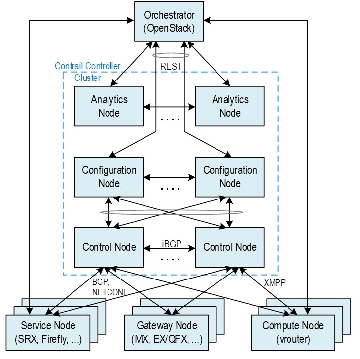]

At the top, there is an orchestrator which can be Openstack or Kubernetes.
Below that, there are controller components like control node, config node and
analytics node. At the bottom right is the compute node. The compute nodes are
general purpose x86 servers which will be the main focus of this chapter.

== Contrail compute node

ifdef::word[image:extracted-media-ch3-v0.3-notrack.docx/media/image2.emf[image,width=525,height=391]]
ifndef::word[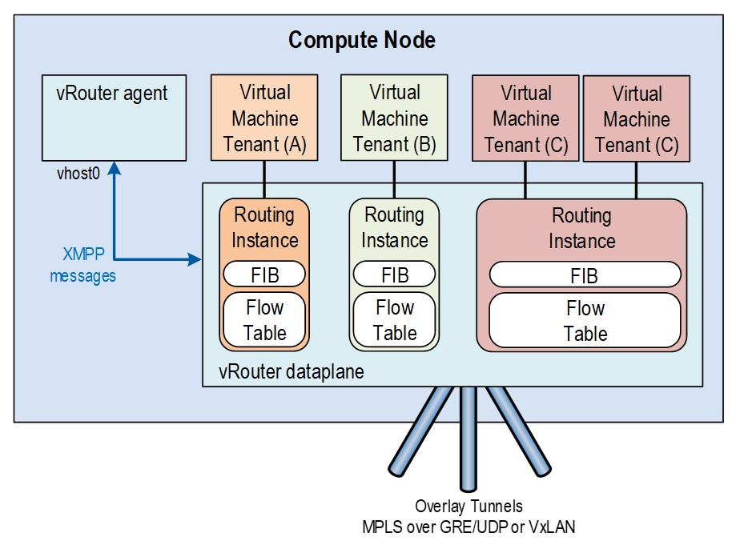]

This picture shows a more detailed view of the compute node. This is the place
where vRouter runs. It is the most important component of the contrail
dataplane. We can see some workloads running. The workloads can be either
virtual machines or containers. These workloads have their interfaces plumbed
into the vRouter.

At a high level, vRouter forms dynamic overlay tunnels with other workloads
running on the same or different computes to send and receive data traffic.
Within the server, it switches the packets between the VM interfaces and
physical interfaces after doing the required encapsulations or decapsulations.
Currently, the encapsulations supported to vRouter are MPLS over UDP
(MPLSoUDP), MPLS over GRE (MPLSoGRE) and VXLAN. Each of these workloads have a
corresponding forwarding state or routing instance inside vRouter which it uses
to switch the packets. The physical interface that is connected to the
Top-or-rack switch can be single or bonded mode.

The vRouter itself can be running either as a linux kernel module or as a
userspace DPDK process. There is a vRouter agent process also running in user
space. The agent has a connection to the controller using a XMPP channel which
is used to download configurations and forwarding information. The main job of
the agent is to program this forwarding state to vRouter forwarding plane.

== vRouter architecture

vRouter is the workhorse of the Contrail system. Each and every packet to and
from the contrail cluster goes through vRouter. vRouter is highly performant,
efficient and has the capability to process millions of packets per second. It
is multi-threaded, multi-cored and multi-queued to achieve maximum parallelism
and exploit the x86 hardware to the maximum extent.

To support the rich and diverse features, vRouter has a sophisticated packet
processing pipeline. The same pipeline can be stitched by the vRouter agent
process from the simplest to the most complicated manner depending on the
treatment which needs to be given to a packet. vRouter maintains multiple
instances of forwarding bases and all the table accesses and updates use RCU
(Read Copy Update) locks which is kind of lockless.

== vRouter and it’s interfaces

The picture below describes the vRouter and its interfaces to the outside
world. It has interfaces to each of the workloads (VM1, VM2.. VMn) that it
manages. These are typically tap interfaces.

ifdef::word[image:extracted-media-ch3-v0.3-notrack.docx/media/image3.emf[image,width=386,height=230]]
ifndef::word[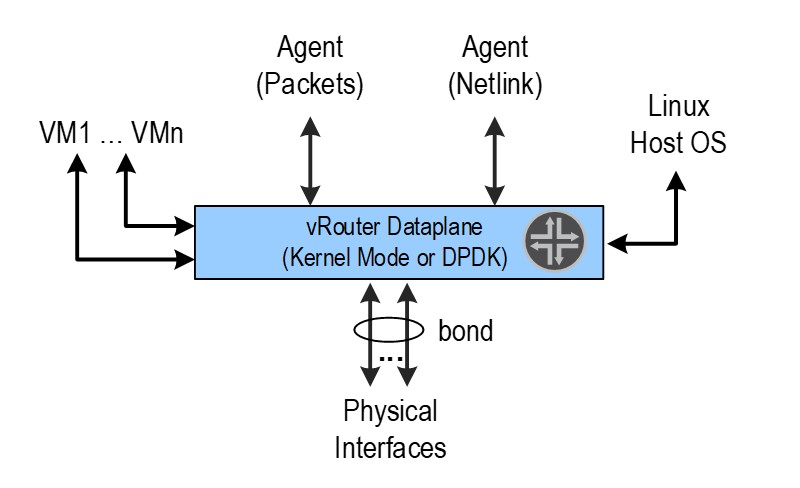]

To send packets to other physical servers or switches, it uses the physical
interfaces. They can be single or bonded NIC. vRouter is only interested in
overlay packets or the packets to/from the workloads. For other packets, it
uses the linux interface to send them to the host operating system.

This Linux interface is called vhost0. It also has netlink interfaces toward
the vRouter agent to download the forwarding state and also to send/receive
some exception packets. The name of the later is called pkt0 interface.

The below is the sample output from “vif --list” command which gives the list
of all vifs that are configured on a compute node:

    [root@a7s3 ~]# vif --list
    Vrouter Interface Table
    Flags: P=Policy, X=Cross Connect, S=Service Chain, Mr=Receive Mirror
    Mt=Transmit Mirror, Tc=Transmit Checksum Offload, L3=Layer 3, L2=Layer 2
    D=DHCP, Vp=Vhost Physical, Pr=Promiscuous, Vnt=Native Vlan Tagged
    Mnp=No MAC Proxy, Dpdk=DPDK PMD Interface, Rfl=Receive Filtering Offload, Mon=Interface is Monitored
    Uuf=Unknown Unicast Flood, Vof=VLAN insert/strip offload, Df=Drop New Flows, L=MAC Learning Enabled
    Proxy=MAC Requests Proxied Always, Er=Etree Root, Mn=Mirror without Vlan Tag, HbsL=HBS Left Intf
    HbsR=HBS Right Intf, Ig=Igmp Trap Enabled

    vif0/0 PCI: 0000:00:00.0 (Speed 20000, Duplex 1) NH: 4
    Type:Physical HWaddr:90:e2:ba:c3:af:20 IPaddr:0.0.0.0
    Vrf:0 Mcast Vrf:65535 Flags:TcL3L2VpVofEr QOS:-1 Ref:16
    RX device packets:14117825256 bytes:2456433542438 errors:0
    RX queue errors to lcore 0 0 0 0 0 0 0 0 0 0 0 0
    Fabric Interface: eth_bond_bond0 Status: UP Driver: net_bonding
    Slave Interface(0): 0000:02:00.0 Status: UP Driver: net_ixgbe
    Slave Interface(1): 0000:02:00.1 Status: UP Driver: net_ixgbe
    Vlan Id: 101 VLAN fwd Interface: vfw
    RX packets:7058889673 bytes:1199976475061 errors:0
    TX packets:7059332226 bytes:1200700918913 errors:0
    Drops:392133
    TX device packets:14119406674 bytes:2457969960530 errors:0

    vif0/1 PMD: vhost0 NH: 5
    Type:Host HWaddr:90:e2:ba:c3:af:20 IPaddr:8.0.0.4
    Vrf:0 Mcast Vrf:65535 Flags:L3DEr QOS:-1 Ref:13
    RX device packets:815137 bytes:780115621 errors:0
    RX queue errors to lcore 0 0 0 0 0 0 0 0 0 0 0 0
    RX packets:815137 bytes:780115621 errors:0
    TX packets:873131 bytes:162620313 errors:0
    Drops:12
    TX device packets:873131 bytes:162620313 errors:0

    vif0/2 Socket: unix
    Type:Agent HWaddr:00:00:5e:00:01:00 IPaddr:0.0.0.0
    Vrf:65535 Mcast Vrf:65535 Flags:L3Er QOS:-1 Ref:3
    RX port packets:135922 errors:0
    RX queue errors to lcore 0 0 0 0 0 0 0 0 0 0 0 0
    RX packets:135922 bytes:11689292 errors:0
    TX packets:36432 bytes:3198966 errors:0
    Drops:0

    vif0/3 PMD: tap41a9ab05-64 NH: 32
    Type:Virtual HWaddr:00:00:5e:00:01:00 IPaddr:192.168.1.104
    Vrf:3 Mcast Vrf:3 Flags:PL3L2DEr QOS:-1 Ref:12
    RX queue packets:7057651439 errors:7736
    RX queue errors to lcore 0 0 0 0 0 0 0 0 0 0 7736 0
    RX packets:7057833621 bytes:875156312738 errors:0
    TX packets:7057123054 bytes:875068202430 errors:0
    ISID: 0 Bmac: 02:41:a9:ab:05:64
    Drops:7947

    vif0/4 PMD: tapd2d7bb67-c1 NH: 29
    Type:Virtual HWaddr:00:00:5e:00:01:00 IPaddr:192.168.0.104
    Vrf:2 Mcast Vrf:2 Flags:PL3L2DEr QOS:-1 Ref:12
    RX queue packets:782831 errors:0
    RX queue errors to lcore 0 0 0 0 0 0 0 0 0 0 0 0
    RX packets:799687 bytes:81599398 errors:0
    TX packets:1110661 bytes:85243244 errors:0
    ISID: 0 Bmac: 02:d2:d7:bb:67:c1
    Drops:1665

The different types of interfaces listed here are:

* vif0/0 - Represents the underlay NIC card (usually a Linux bond interface).
* vif0/1 – Represents the interfact to the linux operating system (vhost0)
* vif0/2 – Represents the interfact to the vRouter agent (pkt0).
* vif0/3 and higher – Represents the Virtual Machine Interfaces (VNIC).

=== vRouter packet processing Pipeline

The vRouter packet processing pipeline is described in the picture below.

ifdef::word[image:extracted-media-ch3-v0.3-notrack.docx/media/image4.emf[image,width=624,height=175]]
ifndef::word[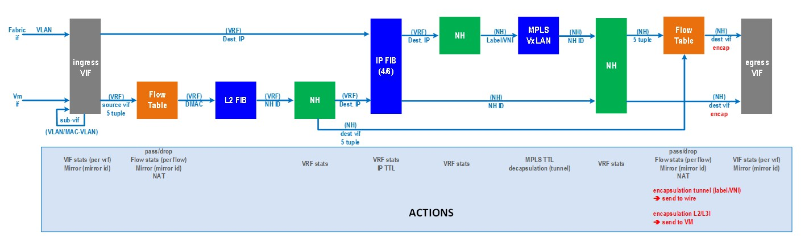]

There are various tables and engines in action in this pipeline. Some of the
important tables in this pipeline are flow table, route table, NH table and the
MPLS/VXLAN table. The vRouter agent programs these tables based on the
forwarding state it receives from the control node and also based on its own
internal processing. Each packet, depending on which interface it is coming
from, is subjected to the desired processing.

At a high level, all packets enter from an interface called ‘vif’. The vifs are
nothing but one of the vRouter interfaces that we described previously.
Example: tap interface, physical interface, vhost0 interface, agent interface
etc. Depending upon the configuration of that interface, it enters different
pipeline stages, doing lookups in different tables and based on what actions
are defined in each stage, the packets are modified accordingly.

At the end of the processing, it is sent to another vRouter interface or vif
after encapsulation or decapsulation. This is a fairly generic pipeline and the
agent stitches this based on the rich feature set that the contrail cluster is
configured.

Another important aspect of vRouter is that of forwarding modes. The vRouter
can work in two modes - flow mode (bottom pipeline on the diagram above) or
packet mode (top on the diagram above). By default, Contrail works in flow
mode. This means that, vRouter keep track of every single flow traversing it.
Depending on the flow action, it can either forward the packet or drop it. In
the packet mode, vRouter bypasses the flow table and directly uses the nexthop
to treatment that needs to be given to the packet. Example: If the nexthop is
tunnel next hop, the packet is encapsulated in a tunnel header and forwarded
into an outgoing interface.

=== vRouter deployment methods

Contrail supports three kinds of vRouter deployments:

==== Linux Kernel

In this method of deployment, vRouter is installed as a kernel module
(vrouter.ko) inside the Linux operating system. This is the default
installation mode when configuring a compute node. vRouter registers itself
with the linux TCP/IP stack to get packets from any of the linux interfaces. It
uses the netdev_rx_handler_register() API provided by linux for this purpose.
The interfaces can be bond, physical, tap (for VMs), veth (for containers) etc.
It relies on linux to send and receive packets from different interfaces.
Example: Linux exposes a tap interface backed by vhost-net driver to
communicate with VMs. Once vRouter registers for packets from this tap
interface, the linux stack sends all the packets to it. To send a packet,
vRouter just has to use regular linux APIs like dev_queue_xmit() to send the
packets out on a linux interface.

____
ifdef::word[image:extracted-media-ch3-v0.3-notrack.docx/media/image5.emf[image,width=312,height=328]]
ifndef::word[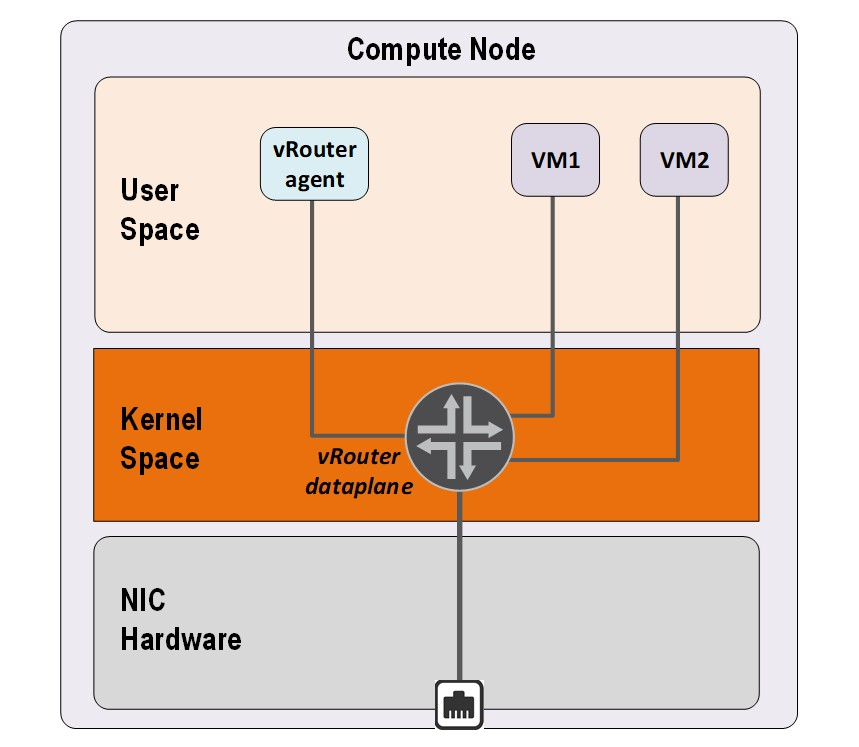]
____

NIC queues (either physical or virtual) are handled by Linux Operating system.

With respect to the packet processing performance, the tuning has to be done at
Linux Operating System level.

ifdef::word[image:extracted-media-ch3-v0.3-notrack.docx/media/image6.emf[image,width=560,height=488]]
ifndef::word[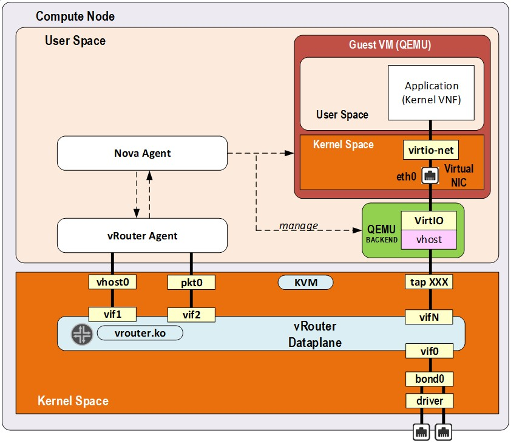]

Here, packet processing is works in interrupt mode. This mode generates
interrupts resulting in lot of context switches. When the packet flow rate is
low, this is works well. But as soon as the packet rate starts increasing, the
system gets overwhelmed with the number of interrupts generated resulting in
poor performance.

==== *_DPDK_*

In this mode, vRouter runs as a user space application that is linked to the
DPDK library. This is the performant version of vRouter that is commonly used
by telcos, where the VNFs themselves are DPDK based applications. The
performance of vRouter in this mode is more than 10 times higher than the
kernel mode. The physical interface is used by DPDK’s poll mode drivers (PMD)
instead of linux kernel’s interrupt-based drivers. A user-IO (UIO) Kernel
module like vfio or uio is used to expose network interfaces registers into
user space so that they are reachable by DPDK PMD. When a NIC is bound to UIO
driver, it is moved from Linux kernel space to user space and therefore no more
managed nor visible by the linux operating system. Consequently, it is the DPDK
application (which is the vRouter here) that fully manages the NIC. This
includes packets polling, packets processing and packets forwarding. No more
action is taken by the operating system. All user packet processing steps are
performed by the vRouter DPDK dataplane.

____
ifdef::word[image:extracted-media-ch3-v0.3-notrack.docx/media/image7.emf[image,width=326,height=343]]
ifndef::word[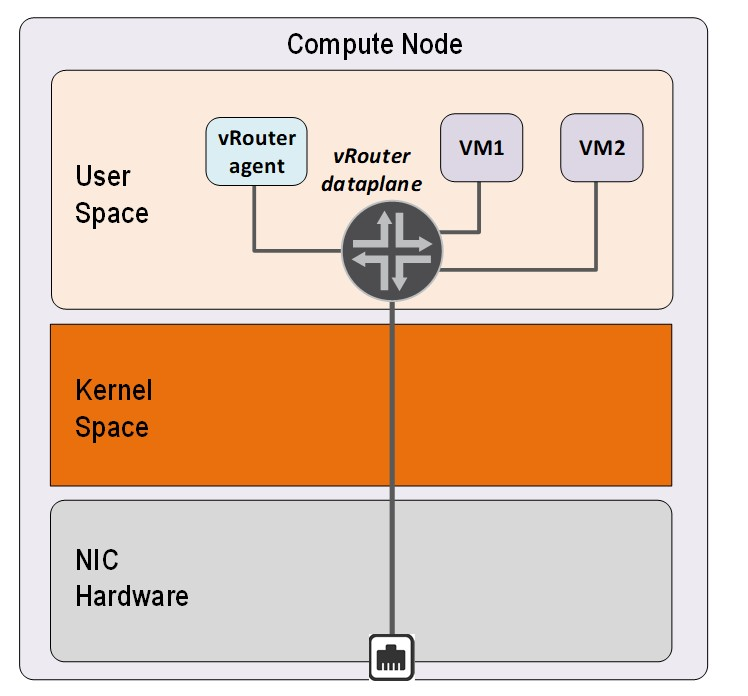]
____

The nature of this “polling mode” makes the vRouter DPDK dataplane packet
processing/ forwarding much more efficient as compared to the interrupt mode,
which is used by linux kernel, when packet rate is high. There are no
interrupts and context switching during packet IO.

NOTE: When the network packet rate is low, this way of working could be less
efficient than the regular Kernel mode. In DPDK mode, a set of CPUs are fully
dedicated for packet processing purpose and always polling even in the absence
of packets. If the network packets rate is too low, lot of CPU cycle are unused
and wasted. However, there is an inbuilt optimization technique which gets
kicked in which yields the CPU for a small amount of time when there are no
packets in the previous polling interval.

Finally, since DPDK vRouter does not require any support from linux kernel, it
needs to be heavily tuned to get the best packet processing performance.

In this chapter we’ll mainly focus on the architecture of DPDK vRouter.

ifdef::word[image:extracted-media-ch3-v0.3-notrack.docx/media/image8.emf[image,width=604,height=552]]
ifndef::word[image:extracted-media-ch3-v0.3-notrack.docx/media/image8.jpg[image,width=604,height=552]]

==== *_SmartNIC_*

In this mode, the Contrail vRouter runs inside the SmartNIC itself. This means,
host resources are not involved in packet processing. It saves the CPU
resources that will be used by vRouter for packet processing. Since all the
packet processing is done by the NIC hardware, the performance is the best
compared to the previous two types of deployments.

____
ifdef::word[image:extracted-media-ch3-v0.3-notrack.docx/media/image9.emf[image,width=318,height=334]]
ifndef::word[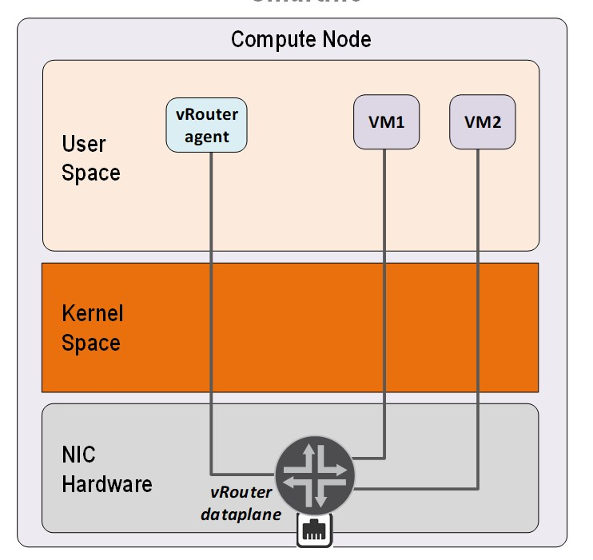]
____

Currently, contrail offers solutions with Smart NICs from Netronome and
Mellanox. At the time of writing of this book, a solution based out of Intel
PAC N3000 smart NIC support was being worked on.

== DPDK vrouter architecture

=== DPDK vRouter software architecture

DPDK vRouter is a userspace application as mentioned previously. It is
comprised of multiple pthreads, which are also called lcores (logical cores) in
DPDK terminology. Each pthread has a specific role to perform. The lcores run
in a tight loop, also called the poll mode. They can exchange packets among
themselves using DPDK queues. Each lcore has a receive queue which can be used
by other lcores to enqueue packets which needs to be processed by that lcore.
They also poll different vRouter interfaces queues like - physical, VM and tap.

ifdef::word[image:extracted-media-ch3-v0.3-notrack.docx/media/image10.emf[image,width=624,height=437]]
ifndef::word[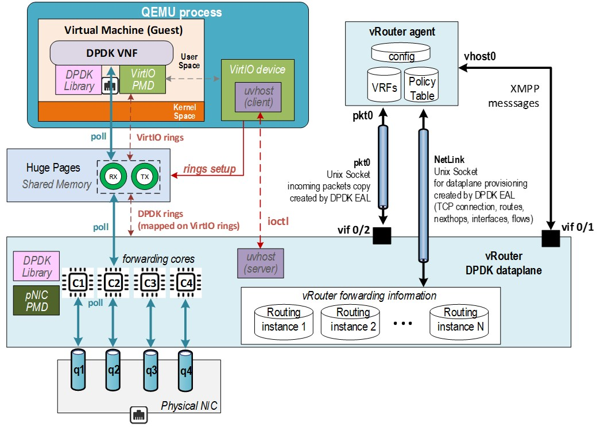]

=== DPDK vRouter and lcores

vRouter is a multi-threaded user-space application. It spawns several pthread
or lcores which run in a tight ‘while’ loop. Each lcore is responsible for a
specific task. The different types of lcores are:

* Forwarding lcores
* Service lcores
** Tapdev lcore
** Timer lcore
** Uvhost lcore
** Packet (Pkt0) lcore
** Netlink lcore

=== Forwaring lcores

Forwarding lcores are responsible for polling the physical and virtual
interfaces. Physical interfaces can be a bonded interface also. In addition,
they can do the vrouter packet processing which is briefly illustrated in the
section “vRouter packet processing Pipeline”. These lcores can assume the role
of both polling and processing.

These lcores are spawned by the vRouter with a well-defined CPU list. It gets
the CPU list as a “core mask” using the “taskset” linux command.

Example: taskset 0x1e0 /usr/bin/contrail-vrouter-dpdk --no-daemon

The hex representation of 0x1e0 is as follows –

[cols=",,,,,,",options="header",]
|===
|CPU Number |5 |4 |3 |2 |1 |0
|Bit value |0 |1 |1 |1 |1 |0
|===

This will make the vRouter spawn 4 forwarding cores and they will be pinned to
CPUs 1,2,3,4

The first forwarding is named lcore10, the next one is named lcore11, and so
on. Hence if a DPDK vRouter has been configured with 4 polling and processing
CPU into its CPU list, 4 threads will be launched: lcore10, lcore11, lcore12
and lcore13.

The below is the output which lists the threads running in vRouter, it’s names
and also it’s PIDs

    [root@a7s4 ~]# ps -T -p $(pidof contrail-vrouter-dpdk)
    PID SPID TTY TIME CMD
    3685 3685 ? 03:47:37 contrail-vroute Main thread and tuntap lcore
    3685 3800 ? 00:04:32 eal-intr-thread DPDK control thread
    3685 3801 ? 00:00:00 rte_mp_handle DPDK control thread
    3685 3802 ? 04:55:48 lcore-slave-1 Timer lcore
    3685 3803 ? 00:00:02 lcore-slave-2 uvhost lcore
    3685 3804 ? 00:00:11 lcore-slave-8 Packet (pkt0) lcore
    3685 3805 ? 00:04:12 lcore-slave-9 netlink lcore
    3685 3806 ? 6-16:39:37 lcore-slave-10 forwarding thread #1
    3685 3807 ? 6-16:40:48 lcore-slave-11 forwarding thread #2
    3685 3808 ? 6-16:35:35 lcore-slave-12 forwarding thread #3
    3685 3809 ? 6-16:37:52 lcore-slave-13 forwarding thread #4
    3685 5048 ? 00:00:00 lcore-slave-9 fork of netlink core (for client mode qemu)

==== Packet processing models in dataplane software

There are three types of packet processing models which any multi-threaded
dataplane application follows:

[arabic]
. Run-to-completion model
. Pipeline model
. Hybrid model

In run-to-completion model, the software does not have multiple stages and it
does the entire processing in a single context or single stage. There are no
FIFOs here ensuring that latency overheads are less.

In the pipeline model, the software is divided into multiple stages. Each stage
completes part of the processing and hands it over to the next stage and so on.
The way to handover is using a FIFO buffer between the stages. These buffers
introduce latency. But the main advantage of this model is that it ensures even
load balancing of all stages in the event when only a few stages are loaded
than others.

Contrail vRouter uses a hybrid model where it uses pipelining model in some
scenarios and run-to-completion model in other scenarios. This ensures good
load balancing of all lcores with a reasonable latency. It needs to have FIFOs
due to pipelining.

The different ways of packet processing done by the vRouter is as follows:

* Run-to-completion: A forwarding lcore polls for packets from a vif Rx queue.
  Then it performs the vRouter packet processing and determines the encap/decap
  that needs to be done. It also finds which outgoing vifs the modified packets
  needs to be sent. Finally, it sends them on those outgoing vif Tx queues.
* Pipeline: A forwarding lcore polls for packetets from a vif Rx queue. It then
  distributes these packets to other forwarding lcores using the DPDK software
  rings between them. The other forwarding lcores pick up the packets and
  performs packet processing. Then they send the modified packets to other vif
  Tx queues.

vRouter uses Run-to-completion model in one or more of these scenarios:

* The option “--vr_no_load_balance” is configured
* The packets coming on the NIC from the wire have MPLSoUDP encapsulation
* The packets coming on the NIC from the wire have VXLAN encapsulation

vRouter uses Pipeline mode in one or more of these scenarios:

* The packets coming on the NIC from the wire have MPLSoGRE encapsulation
* The packets are received by the vRouter from the Workloads (VMs or containers)
* The option “--vr_no_load_balance” is turned off

=== Service lcores

Service lcores are responsible for handling all vRouter interfaces other than
workload (VM) interfaces and physical interfaces. It also hands other
book-keeping and miscellaneous tasks for vRouter like timer management and
vhost-user control path. By default, they are not pinned to any physical CPU.

Most of the service lcores make use of user sockets to talk to other processes
in the system like agent, qemu (VM) and linux stack.

==== User sockets in vRouter

____
User socket (usocket) is an object where IO happens. While it can represent
non-socket objects too (like an eventfd), most consumers are socket users and
hence usocket is primarily a socket.

A socket, when used for IO, has to have a protocol to understand the format of
the data that enters and exits it. vRouter DPDK has three protocols –
____

* {blank}
+
____
NETLINK
____
* {blank}
+
____
PACKET
____
* {blank}
+
____
EVENT
____

____
A NETLINK socket carries Netlink messages i.e.: each message in the socket will
have a a netlink header

A PACKET socket carries packets that have a agent_hdr. A PACKET socket has a
ring, a vif, and a child usocket that represents an eventfd that is written by
the datapath threads to wake up the packet thread whenever there are new
packets that are enqueued on the ring.

The EVENT protocol represents an eventfd. We can write an 8 byte value that
will be accumulated over writes to be read by the reader. This is used as a
wakeup mechanism for one or more threads.

For each of the protocol, multiple transport types could make sense. For
example - for a NETLINK socket, both a TCP and a UNIX transport could make
sense. However, for a packet socket, only a RAW transport will make sense.
____

==== Tapdev lcore

vRouter implements a custom PMD for tuntap devices which can be used to send
and receive packets between vRouter and the linux host OS. It is a replacement
for DPDK KNI PMD. Currently “vhost0” and “monitoring” interfaces (used by
vifdump utility which is explained later) make use of it.

When a tap device is initialized, vRouter uses the “tun” driver (/dev/net/tun)
in linux and creates a tuntap device.

    [root@a7s3 ~]# ethtool -i vhost0
    driver: tun
    version: 1.6
    firmware-version:
    expansion-rom-version:
    bus-info: tap
    supports-statistics: no
    supports-test: no
    supports-eeprom-access: no
    supports-register-dump: no
    supports-priv-flags: no

When the netlink communication channel between the agent and vRouter DPDK has
been setup using the netlink lcore, agent sends a message to the vRouter DPDK
to add the vhost0 interface. As part of this sequence, a new vhost0 vif or
vif0/1 is created and is setup so that the tapdev lcore is responsible for
polling the vhost0 interface. In each iteration, the PMD uses raw “read” and “
write” socket calls to receive and transmit packets to the tuntap device.

===== Receiving packets from vhost0

One of the forwarding cores will be assigned to process the “vhost0” packets
and will be polling a dedicated DPDK ring, called the “tapdev_rx_ring”. This
ring will be added to the forwarding lcore’s poll list when the vhost vif is
added by the vRouter agent. The tapdev PMD will receive packets from the vhost0
interface using the “read()” socket call and enqueue them to the above
mentioned DPDK ring. The designated forwarding core then picks these packets
and processes it.

ifdef::word[image:extracted-media-ch3-v0.3-notrack.docx/media/image11.emf[image,width=602,height=275]]
ifndef::word[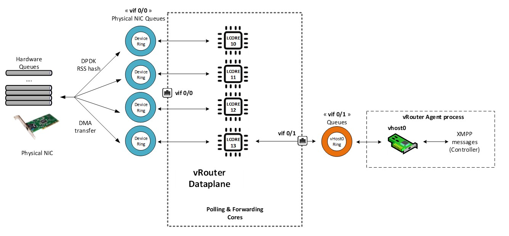]

===== Sending packets to vhost0

All the forwarding cores will have Tx rings for vhost0. Packets that needs to
be sent to vhost0 will be enqueued to these Tx rings by the lcores. The tapdev
PMD polls these Tx rings and dequeues the packets from these rings. It then
sends the packets to the “vhost0” interface using the write socket call.

Timer lcore

ifdef::word[image:extracted-media-ch3-v0.3-notrack.docx/media/image12.emf[image,width=603,height=344]]
ifndef::word[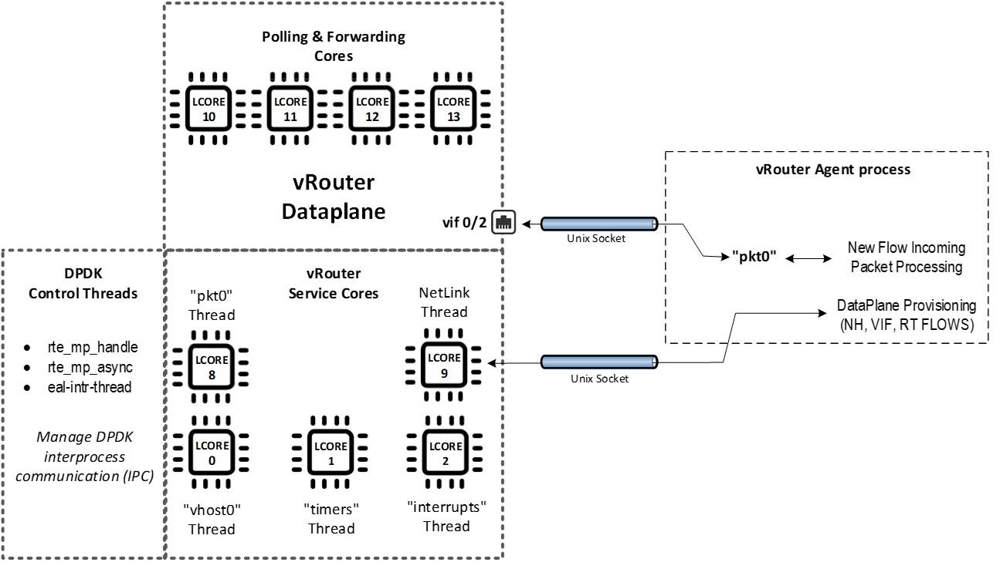]

==== Netlink lcore

Netlink lcore is responsible for establishing a communication channel with the
agent for programming the forwarding state (like routes, nexthops, labels
etc.). It creates a unix server socket at “/var/run/vrouter/dpdk_netlink” to
which the agent connects.

    (vrouter-agent-dpdk)[root@a7s4-kiran /]$ netstat -anp | grep dpdk_netlink
    unix 2 [ ACC ] STREAM LISTENING 46105 3728/contrail-vrout /var/run/vrouter/dpdk_netlink
    unix 3 [ ] STREAM CONNECTED 4952631 3728/contrail-vrout /var/run/vrouter/dpdk_netlink

    (vrouter-agent-dpdk)[root@a7s4-kiran /]$ ps -eaf|grep 3728
    root 3728 2551 99 Oct02 ? 210-14:44:48 /usr/bin/contrail-vrouter-dpdk --no-daemon --socket-mem 1024 --vlan_tci 101 --vdev eth_bond_bond0,mode=4,xmit_policy=l34,socket_id=0,mac=00:1b:21:bb:f9:48,lacp_rate=0,slave=0000:02:00.0,slave=0000:02:00.1

The first line of the output shows the state as “LISTENING” for DPDK vRouter
which indicates that it is a server and is waiting for clients such as agent to
connect to it. The second line shows the agent connected to it and so the state
is “CONNECTED”.

The protocol that is carried in this socket is “NETLINK” which means all
messages have netlink header which is of size 24 bytes followed by the payload.
The socket type is “UNIX”. The netlink header comprises of the following –

* Netlink message header
* Generic netlink message header
* Netlink attribute

The header can be viewed easily using gdb to the DPDK vRouter

    (gdb) ptype struct nlmsghdr Netlink message header
    type = struct nlmsghdr \{
    unsigned int nlmsg_len;
    unsigned short nlmsg_type;
    unsigned short nlmsg_flags;
    unsigned int nlmsg_seq;
    unsigned int nlmsg_pid;
    }
    (gdb) ptype struct genlmsghdr Generic netlink message header
    type = struct genlmsghdr \{
    __u8 cmd;
    __u8 version;
    __u16 reserved;
    }
    (gdb) ptype struct nlattr Netlink attribute
    type = struct nlattr \{
    __u16 nla_len;
    __u16 nla_type;
    }
    (gdb) p sizeof(struct nlmsghdr) + sizeof(struct genlmsghdr) + sizeof(struct nlattr)
    $1 = 24

The payload of this message is in “Sandesh” format. This is a proprietary data
format (similar to XML) used by the agent and vRouter. The format of this is –

[cols=",,,,",]
|===
|Object name |Type +
serial number +
value |Type +
serial number +
length +
value |….. |Type +
serial number +
value
|===

The object name specifies the type of object the message contains - like
nexthop, route, mpls etc.

Type can be fixed length datatypes like uint8, uint16, uint32. It can also be
variable length datatypes like “list” in which case there will be a “length”
field to specify the length of the list.

These messages are parsed by inbuilt parser and appropriate callbacks called
depending on the objects. Example: For a nexthop object, the nexthop callback
within vRouter is called which in-turn programs that nexthop in the nexthop
table.

If the vRouter needs to return a status or error message to the agent after
processing of the Sandesh object, it can do so. That way, the agent gets to
know if the programming was successful or not.

Packets to be sent between vRouter agent and Contrail Control nodes are
forwarded using the same packet processing principles than the user packets.

vRouter DPDK dataplane polling and processing cores are used to forward XMPP
packets between vif0/1 (vRouter agent vhost0 listening interface) and vif0/0
(connecting to the underlay infrastructure on which Contrail Control nodes are
plugged).

== Contrail DPDK vRouter packets processing

=== Packets polling and processing

During initialization of the NIC interface, vRouter configures it with the same
number of queues as the number of forwarding cores it has. For example, if the
vRouter has 5 forwarding cores, the number of Rx queues it configures to the
NIC is 5.

A vif queue is made up of two DPDK rings:

* one RX ring: in which are stored packets received from a NIC to be processed by the vRouter
* one TX ring: in which are stored packets to be sent by the vRouter to a NIC

ifdef::word[image:extracted-media-ch3-v0.3-notrack.docx/media/image13.emf[image,width=528,height=514]]
ifndef::word[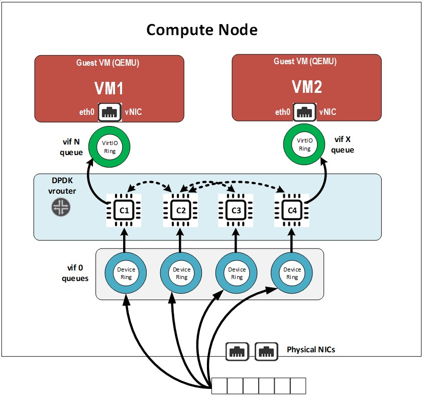]

Packets stored in vif RX rings are polled by a forwarding lcore. There is a
one-to-one mapping between forwarding cores and the NIC’s Rx queues. Then the
polled packets are processed by a the same lcore or different one and then
pushed to a target vif’s TX ring.

ifdef::word[image:extracted-media-ch3-v0.3-notrack.docx/media/image14.emf[image,width=603,height=289]]
ifndef::word[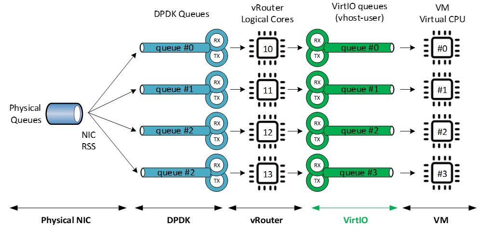]

Each lcore10 and higher started by a DPDK vRouter is a polling and a processing
thread. They are running onto a single CPU listed defined by CPU_LIST variable.

=== MPLS over GRE overlay

Incoming overlay encapsulated packets are received on the Compute physical
Network Interface Card, usually a Bond made up of 2 NICs, used for user packets
transport.

Incoming Overlay packets are placed into Physical NIC queues using DPDK RSS
(Received Side Scaling) hashing algorithm. A vRouter startup are created (with
the help of the physical NIC PMD) as many DPDK queues (both RX and TX rings) as
the number of vRouter allocated polling and processing cores.

The RSS hashing algorithm for MPLSoGRE only use 3 tuple values: IP source, IP
destination, protocol number. Unfortunately, the entropy of these 3 values is
low when GRE is used.

Indeed, the 3 tuple values is kept the same between 2 different compute nodes.

All packets coming from different Virtual Machines located on a same compute
node will be bound to the same 3 tuple value. Hence, the hashing algorithm will
provide an identical value for all network flows coming from each single
compute.

ifdef::word[image:extracted-media-ch3-v0.3-notrack.docx/media/image15.emf[image,width=604,height=223]]
ifndef::word[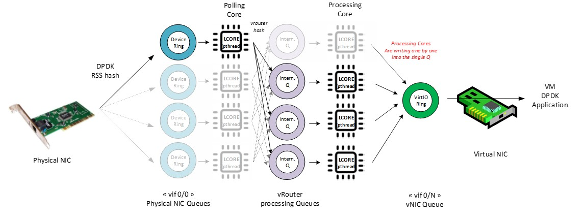]

Consequently, all packets coming from Virtual Machines located on a same
compute will be received only in one DPDK RX ring of the vif0/0 interface
(vRouter interface connected to the underlay network).

So, incoming MPLS GRE overlay packets are not well balanced onto the different
polling and processing threads (lcores) the vRouter is fitted with. Therefore,
when MPLS GRE overlay is used, it has been chosen to perform the packet
processing (packet transformation and delivery in a vif TX ring) onto a
different lcore than those used for the packet polling (retrieve a packet from
a vif0/0 RX ring).

A DPDK pipeline model is then used. A first lcore is only performing packet
polling, a second one is performing the packet processing. Some internal queues
are setup in order to store packets that have been polled by the polling lcore
thread and that are waiting to be processed by the processing lcore thread.

A hash algorithm is applied onto the decapsulated packet (inner packet) in
order to select one of the internal queues that are each handled by a single
processing lcore thread.

Thanks to this mechanism, even if few compute nodes are used into the physical
infrastructure and user packets carried with MPLS over GRE overlay protocol,
all vRouter allocated CPU are used.

=== UDP overlay (VxLAN or MPLS over UDP)

When an UDP overlay protocol is used (MPLS over UDP or VxLAN) we have a better
entropy, 5 tuples from values: IP source, IP destination, source port and
destination port, protocol. Indeed, even if few computes are used, the sending
compute can create diversity using some distinct values in the UDP source port
of overlay packet.

Different network flows coming from a same virtual remote machine will generate
different RSS hash results.

ifdef::word[image:extracted-media-ch3-v0.3-notrack.docx/media/image16.emf[image,width=604,height=225]]
ifndef::word[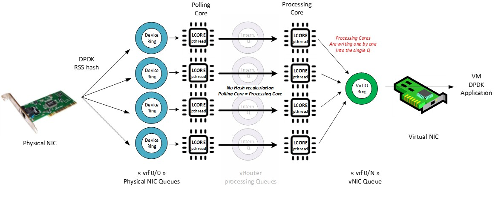]

Consequently, incoming overlay packets are balanced onto all the DPDK RX rings
configured for the physical interface. It is useless to split polling and
processing steps. Therefore, when an UDP overly protocol is used to transport
user packets between compute nodes, the vRouter is using the same lcore for
both polling and processing steps of each packet.

It is more efficient to use UDP overlay protocols. Performance reached with a
same DPDK vRouter configuration is higher when an UDP overlay protocol is
chosen instead of MPLS over GRE.

=== Single Queue versus Multi-Queue NIC

NIC connected to vRouter can be configured to several queues.

Each NIC queue is automatically pinned to a single vRouter polling and
processing thread (lcore10 and higher). Consequently, when a NIC is configured
with only a single Q, all incoming and outgoing packets are processed by a
single vRouter polling and processing threads.

In order to avoid binding all single queue interfaces on the same polling and
processing thread; each interface queue is pinned to a distinct vRouter lcore
into a round robin manner when each interface is created. Single queue vif0/3
is automatically pinned to lcore 10, single queue vif0/4 is automatically
pinned to lcore 11, and so on.

Hence the vRouter whole CPU power is automatically distributed among all the
single queue interfaces. This distribution is automatically defined for each
interface and is kept unchanged during all the interface life duration.

When a NIC is configured with several queues, each single queue is bound to a
distinct polling and processing thread (lcore). Hence the vRouter whole CPU
power is automatically distributed among all the queues on each multi queue
interface.

Even if there is no hard rule that prevent a user to configure a different
number of queue on a NIC as the number of lcores (polling and processing
threads) configured on the vRouter; the best scenario is to configure each
multi queue NIC with the same number of queue as the number of configured
polling and processing threads on the vRouter.

ifdef::word[image:extracted-media-ch3-v0.3-notrack.docx/media/image17.emf[image,width=604,height=552]]
ifndef::word[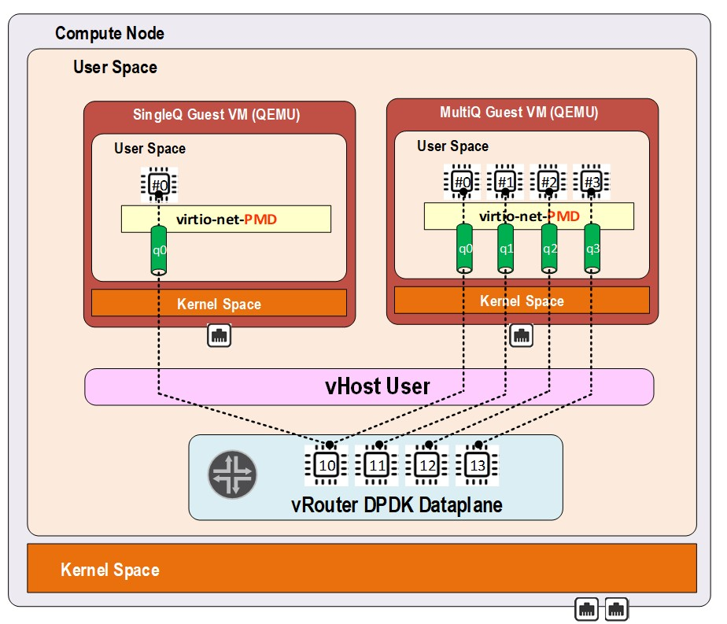]

NOTE: We also have to take into consideration that currently the DPDK vRouter
is unable to process correctly a multi queue vNIC which is configured with more
queues than the number of polling and processing threads configured on the
vRouter.

== Supported scenarios

Contrail DPDK vRouter is able to collect DPDK virtual machines as well as Linux
Kernel packet processing virtual machines. Likewise, a contrail Kernel vRouter
is also able to collect both DPDK and non DPDK virtual machines.

ifdef::word[image:extracted-media-ch3-v0.3-notrack.docx/media/image18.emf[image,width=604,height=502]]
ifndef::word[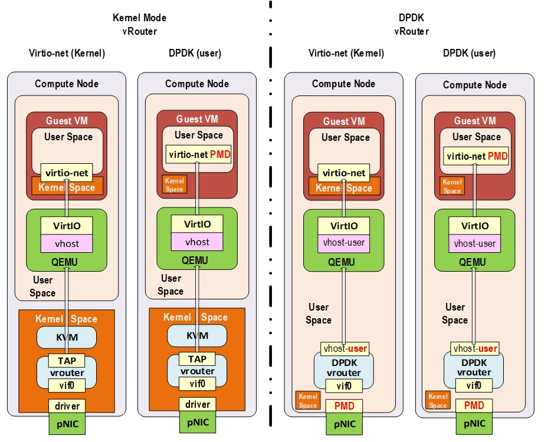]

But only two scenarios really make sense:

* Kernel mode vRouter collecting Kernel mode virtual machines
* DPDK vRouter collecting DPDK virtual machines

In the Kernel scenario, both Virtual Machines and Contrail vRouter work with a
regular Linux TCP/IP stack using interrupt mode packet processing. They both
suffer the same limitations (packet processing does not scale due to interrupt
mode) and the same advantages (it does not require to book lots of CPU for
packet processing). So this scenario is best to be used when the virtual
machines do not expect a high network connectivity performance.

In the DPDK scenario, both Virtual Machines and Contrail vRouter work with a
DPDK library using poll mode packet processing. They both suffer from the same
limitation (poll mode requires to book some CPUs for packet processing) and
have the same advantages (it allows to reach line rate packet processing). This
scenario is the best to be used when the virtual machines require a high
network connectivity performance. Typically, Virtual Network Functions (VNF).

Hybrid cases are unsuitable. When a Kernel mode Virtual Machine is plugged onto
a Contrail DPDK vRouter, it impacts very badly the whole Contrail vRouter and
VNF performance. Indeed, Contrail DPDK vRouter has to emulate interrupt mode
using KVM features in order to kick the Virtual machine. It involve a “VMExit”
which is like a system call to the hypervisor and takes lots of CPU cycles.
This not only impacts the Kernel Mode VM but all the other DPDK VMs as well.

A DPDK Virtual machine plugged onto a Contrail Kernel mode vRouter is also very
inefficient. Even if the Virtual machine is able to process its network packets
at a very high speed, Linux Kernel packet processing used by Kernel mode
vRouter does not scale well. So, at the end lots of packets generated by a high
speed VNF plugged on a Contrail Kernel mode vRouter could be lost.

This is why Contrail users have to be consistent and to plug DPDK Virtual
machines onto DPDK dataplane vRouter and Kernel mode Virtual machines onto
Kernel mode dataplane vRouter.

When virtual infrastructure is made up of several kinds of virtual machines
(both DPDK and not DPDK ones), placement strategy have to be defined in order
to spawn DPDK VM onto computes fitted with Contrail DPDK vRouter and to spawn
non DPDK VM onto computes fitted with Contrail Kernel mode vRouter.
