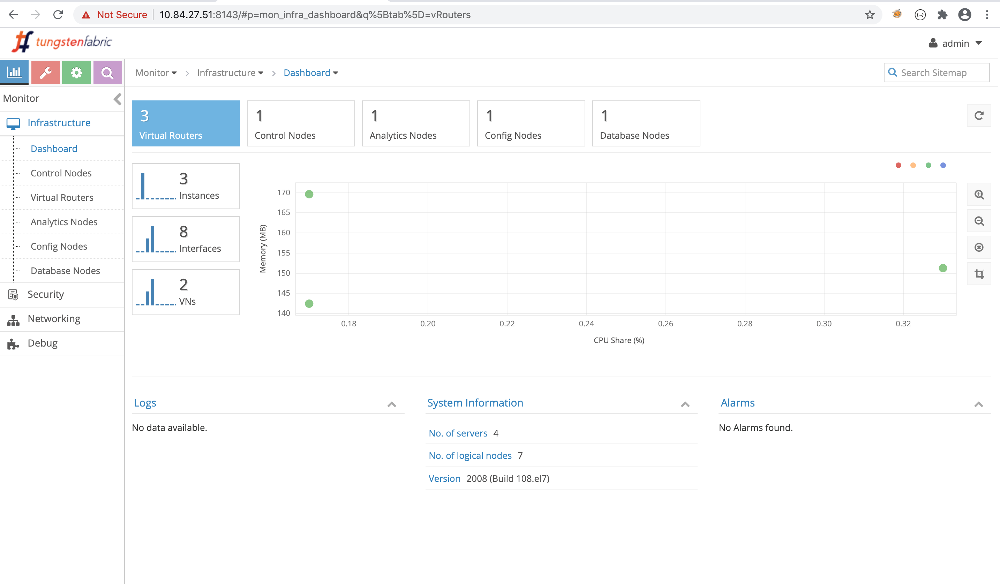
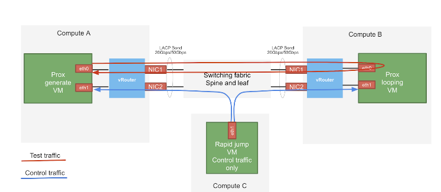

= chapter 4: contrail networking and test tools installation
:doctype: book
:toc: right
:toclevels: 3
:source-highlighter: pygments
:pygments-style: manni
:data-uri:
//:pygments-style: emacs
//:pygments-linenums-mode: inline
:pygments-linenums-mode: table
:contrail-installation:
:appendix!:

In previous chapters, we have gone through most important topics about SDN and
DPDK in general, DPDK vRouter architectures, vRouter packet processing details
and so on. When you read these topics you may wonder how to get a running
contrail networking environment with a few DPDK vRouters in it, so you can play
around, test those theories and familiarize yourself about what you've learned.
Indeed, those topics are important, unfortunately they are by themselves not so
straightforward, so even after we've put great effort to illustrate, some of
them may still sound confusing, especially when you get down to the
implementation details.

In this chapter, we will mostly focus on the hands-ons and lab testings to
verify some of the most important DPDK vRouter concepts and working mechanisms.

* We'll start from introducing steps we've used to install a latest version of
  contrail networking cluster.
* On top of it, we start to build a testing environment.  That includes a few
  VMs running OPENFV PROX software. On each VM, based on its role, the PROX
  software is configured as either a traffic generator or a traffic receiver.
* We'll go ahead to introduce some of the commonly used DPDK tools, scripts and
  log entries that provides useful information to help us understand how things
  run in DPDK environment.
* In the end, we'll go over some case studies. We use PROX and rapid we've
  installed to start different traffic patterns in our setup, and then use DPDK
  tools to analyze what we are seeing.

After reading this chapter, you will have a deeper and concrete understanding
to the some of the main concepts we've covered in this book.
We'll start with the contrail installation.

== contrail installation

=== contrail installation methods

In this book, we've been focusing on DPDK vRouter that runs in each individual
compute node, which basically runs in a relatively standalone mode. but if you
look at forwarding plane as a whole, they are actually a distributed system. In
fact as we've briefed in chapter 1, the whole TF cluster is a complex
distributed system involving a lot more different software modules especially
in control plane. Again, each of the software module can be a completely
different distributed system by themselves. The cassandra database that TF
cluster uses is one such example. Explaining and understanding details about how
things works in distributed system is never easy, and so is the installation
process. It won't be a surprise if you run into some installation issues in
your lab. Generally speaking, it is always much more efficient to follow a
detailed, verfied process with step by step instructions to "avoid" the issues,
than starting with a "try-and-see" mode and then try to fix the issues.

Currently, TF cluster has been widely integrated with many majority deployment
systems and platforms. Therefore depending on your envrionment there can be
totally different ways of installing contrail system. Here is a incomplete list
of currently supported installation methods:

* Installing Contrail with OpenStack and Kolla Ansible
* Installing Contrail with RHOSP
* Installing Kubernetes Contrail Cluster using the Contrail Command UI
* Installing and Provisioning Contrail VMware vRealize Orchestrator Plugin
* Installing a Standalone Red Hat OpenShift Container Platform 3.11 Cluster
  with Contrail Using Contrail OpenShift Deployer
* Installing a Nested Red Hat OpenShift Container Platform 3.11 Cluster Using
  Contrail Ansible Deployer
* Installing Contrail with OpenStack or kubernetes by Using Juju Charms

For example, the second method, you can install contrail with Redhat openstack
platform director 13 (RHOSPd), which is a toolset based on the OpenStack
project TripleO (OOO, OpenStack on OpenStack).  An TF environment built out of
RHOSPd uses concepts of `undercloud` and `overcloud`. Basically `undercloud` is
a single server containing complete OpenStack components, whose role is just to
deploy and manage an `overcloud`, which is a tenant-facing environment that
hosts the "resulting" openstack and TF nodes. This deployment is currently used
by many major service providers in production.

However, the installation process of such a deployment involves the
understanding of RHOSPd, TripleO, and of lots of different types of networks
isolation topologies, which add many uncessary complexities to our lab setup.
In this section, we'll give a detail steps about the first method - installing
contrail with openstack and kolla ansible.

Kolla is an OpenStack project which provides tools to build container images
for OpenStack services.  Kolla Ansible provides Ansible playbooks to deploy the
Kolla images.  The contrail-kolla-ansible playbook works in conjunction with
contrail-ansible-deployer to install OpenStack and Contrail Networking
containers.

=== cluster diagram

.contrail DPDK vRouter test bed
//image::https://user-images.githubusercontent.com/2038044/97359151-b069e380-1872-11eb-8ccc-752d2800ea44.png[image]
//image::https://user-images.githubusercontent.com/2038044/97387164-dbbcf480-18ab-11eb-9aa5-ae45bfe4761a.png[image]
image::https://user-images.githubusercontent.com/2038044/97815050-7a08db80-1c59-11eb-8ff9-d3e9fb750e04.png[image]

//=== re-image servers

=== configure bond and vlan

To enable bond interface in centos, under `/etc/sysconfig/network-scripts/` of
all nodes where bond interface is needed, add these configuration files:

[options="header", width="100%",cols="a,a"]
|====
 | bond | members

//row1
 |
[source, sh, linenums]
----
$ cat ifcfg-bond0
SUBCHANNELS=1,2,3
NM_CONTROLLED=no
BOOTPROTO=none
BONDING_OPTS="miimon=100 mode=802.3ad xmit_hash_policy=layer3+4"
DEVICE=bond0
BONDING_MASTER=yes
ONBOOT=yes
----
 |
[source, sh, linenums]
----
$ cat ifcfg-bond0.101
NM_CONTROLLED=no
NETMASK=255.255.255.0
BOOTPROTO=none
DEVICE=bond0.101
VLAN=yes
IPADDR=8.0.0.3
ONBOOT=yes
----

//row2
 |
[source, sh, linenums]
----
$ cat ifcfg-enp2s0f0
HWADDR=00:1b:21:bb:f9:46
SLAVE=yes
NM_CONTROLLED=no
BOOTPROTO=none
MASTER=bond0
DEVICE=enp2s0f0
ONBOOT=yes
----
 |
[source, sh, linenums]
----
$ cat ifcfg-enp2s0f1
HWADDR=00:1b:21:bb:f9:47
SLAVE=yes
NM_CONTROLLED=no
BOOTPROTO=none
MASTER=bond0
DEVICE=enp2s0f1
ONBOOT=yes
----
|====

Then restart network service to invoke these configurations:

    service network restart

Once the restart is successful, you should see bond0 interface appearing in all
nodes with one of these IP addresses in each node: 8.0.0.1 to 8.0.0.4. Now we
should have the IP connectivities in both management network and fabric
network.

Next we'll need to install ansible and use it to automate the rest part of the
installations. The most part of ansible's magic is done throught its
`playbooks`, and configuration for all plays is done in a single file with a
default name `instances.yaml`. This configuration file has multiple main
sections. We'll go over some of the main parameters in this file and then
introduce the steps to run the playbooks.

////
[source, sh, linenums]
----
[2020-10-25 16:09:09]root@bcomp78:~/kiran_setup/a7s5
$ cat ifcfg-bond0
SUBCHANNELS=1,2,3
NM_CONTROLLED=no
BOOTPROTO=none
BONDING_OPTS="miimon=100 mode=802.3ad xmit_hash_policy=layer3+4"
DEVICE=bond0
BONDING_MASTER=yes
ONBOOT=yes
[2020-10-25 16:09:22]root@bcomp78:~/kiran_setup/a7s5
$ cat ifcfg-bond0.101
NM_CONTROLLED=no
NETMASK=255.255.255.0
BOOTPROTO=none
DEVICE=bond0.101
VLAN=yes
IPADDR=8.0.0.3
ONBOOT=yes
[2020-10-25 16:12:28]root@bcomp78:~/kiran_setup/a7s5
$ ls
ifcfg-bond0  ifcfg-bond0.101  ifcfg-enp2s0f0  ifcfg-enp2s0f1
[2020-10-25 16:13:19]root@bcomp78:~/kiran_setup/a7s5
$ cat ifcfg-enp2s0f0
HWADDR=00:1b:21:bb:f9:46
SLAVE=yes
NM_CONTROLLED=no
BOOTPROTO=none
MASTER=bond0
DEVICE=enp2s0f0
ONBOOT=yes
[2020-10-25 16:13:27]root@bcomp78:~/kiran_setup/a7s5
$ cat ifcfg-enp2s0f1
HWADDR=00:1b:21:bb:f9:47
SLAVE=yes
NM_CONTROLLED=no
BOOTPROTO=none
MASTER=bond0
DEVICE=enp2s0f1
ONBOOT=yes
[2020-10-25 16:14:02]root@bcomp78:~/kiran_setup/a7s5
----
////

=== the configuration file `instances.yaml`

[source, sh, linenums]
----
1  global_configuration:
2    CONTAINER_REGISTRY: svl-artifactory.juniper.net/contrail-nightly
3    REGISTRY_PRIVATE_INSECURE: True
4  provider_config:
5    bms:
6      ssh_pwd: c0ntrail123
7      ssh_user: root
8      ntpserver: 10.84.5.100
9      domainsuffix: englab.juniper.net
10 instances:
11   a7s2:
12     provider: bms
13     ip: 10.84.27.2
14     roles:
15       openstack_control:
16       openstack_network:
17       openstack_storage:
18       openstack_monitoring:
19       config_database:
20       config:
21       control:
22       analytics_database:
23       analytics:
24       webui:
25   a7s3:
26     provider: bms
27     ip: 10.84.27.3
28     ssh_user: root
29     ssh_pwd: c0ntrail123
30     roles:
31       openstack_compute:
32       vrouter:
33         PHYSICAL_INTERFACE: bond0.101
34         CPU_CORE_MASK: "0x1fe"
35         DPDK_UIO_DRIVER: uio_pci_generic
36         HUGE_PAGES: 32000
37         AGENT_MODE: dpdk
38   a7s4:
39     provider: bms
40     ip: 10.84.27.4
41     ssh_user: root
42     ssh_pwd: c0ntrail123
43     roles:
44       openstack_compute:
45       vrouter:
46         PHYSICAL_INTERFACE: bond0.101
47         CPU_CORE_MASK: "0x1fe"
48         DPDK_UIO_DRIVER: uio_pci_generic
49         HUGE_PAGES: 32000
50         AGENT_MODE: dpdk
51   a7s5:
52     provider: bms
53     ip: 10.84.27.5
54     ssh_user: root
55     ssh_pwd: c0ntrail123
56     roles:
57       openstack_compute:
58       vrouter:
59         PHYSICAL_INTERFACE: bond0.101
60 contrail_configuration:
61   CONTRAIL_VERSION: 2008.108
62   OPENSTACK_VERSION: rocky
63   CLOUD_ORCHESTRATOR: openstack
64   CONTROLLER_NODES: 8.0.0.1
65   OPENSTACK_NODES: 8.0.0.1
66   CONTROL_NODES: 8.0.0.1
67   KEYSTONE_AUTH_HOST: 8.0.0.200
68   KEYSTONE_AUTH_ADMIN_PASSWORD: c0ntrail123
69   RABBITMQ_NODE_PORT: 5673
70   KEYSTONE_AUTH_URL_VERSION: /v3
71   IPFABRIC_SERVICE_IP: 8.0.0.200
72   VROUTER_GATEWAY: 8.0.0.254
73   two_interface: true
74   ENCAP_PRIORITY: VXLAN,MPLSoUDP,MPLSoGRE
75   AUTH_MODE: keystone
76   CONFIG_API_VIP: 10.84.27.51
77   ssh_user: root
78   ssh_pwd: c0ntrail123
79   METADATA_PROXY_SECRET: c0ntrail123
80   CONFIG_NODEMGR__DEFAULTS__minimum_diskGB: 2
81   CONFIG_DATABASE_NODEMGR__DEFAULTS__minimum_diskGB: 2
82   DATABASE_NODEMGR__DEFAULTS__minimum_diskGB: 2
83   XMPP_SSL_ENABLE: no
84   LOG_LEVEL: SYS_DEBUG
85   AAA_MODE: rbac
86 kolla_config:
87   kolla_globals:
88     kolla_internal_vip_address: 8.0.0.200
89     kolla_external_vip_address: 10.84.27.51
90     contrail_api_interface_address: 8.0.0.1
91     keepalived_virtual_router_id: "111"
92     enable_haproxy: "yes"
93     enable_ironic: "no"
94     enable_swift: "no"
95   kolla_passwords:
96     keystone_admin_password: c0ntrail123
97     metadata_secret: c0ntrail123
98     keystone_admin_password: c0ntrail123
----

* line 1-3: global configrations
* line 2: specifies the registry from which to pull Contrail containers
* line 3: set to "True" if containers that are pulled from a private registry named `CONTAINER_REGISTRY` are not accessible
* line 4-9: configures provider-specific settings
* line 5: bare metal server (bms) environment
* line 6-9: ssh password, user name, ntpserver and domainsuffix
* line 10-59: `Instances` means the node on which the containers will be
  launched. here we defined 4 nodes, named a7s2, a7s3, a7s4 and a7s5
* line 11-24: this is the configuration section for node `a7s2`
* line 12-14: defines this server's provider type (baremetal server), ip address, and roles
* line 14-24: roles of containers that will be installed in this node.
  according to the configuration, this server `a7s2` will be installed with all
  "controller" softwares modules, in both openstack and contrail.
* line 25-37: define parameters for our first DPDK compute node. openstack
  compute components and contrail vRouter will be installed.
* line 33: under vRouter, `bond0.101` will be the `PHYSICAL_INTERFACE`, which
  is also called a "fabric interface" which carries all the underlay data packets
* line 34-37: these are the DPDK specific configurations. For kernel based
  vRouter these are not needed.
* line 34: `CPU_CORE_MASK` defines DPDK vRouter forwarding lcore pinning.
  `0x1fe`, if converted to binary format, is `0b000111111110`. That means
  physical CPU core NO.1 through 8 is used as forwarding lcores: lcore#10
  through lcore#17.
* line 35: `DPDK_UIO_DRIVER` specifies which UIO driver to use. Here it is
  `uio_pci_generic`. (There is another popular UIO driver: `igb_uio`.)
* line 36: `HUGE_PAGES` defines number of huge pages. Here we allocate 32000
  huge pages. considering page size 2M it will be 64G memory usage in total.
  `free -h` command output in compute node will confirm this.
* line 37: set agent mode to `dpdk`.
* line 38-50: define the second DPDK vRouter on server `a7s4`
* line 51-59: define the third vRouter. This is a kernal based one, so we don't
  need any DPDK specific parameters.
* line 60-85: `contrail_configuration` section contains parameters for Contrail
  services
* line 61-62: specifies contrail and openstack versions.
* line 63: specifies the cloud orchestrator. it can be openstack or vcenter.
  our setup is with openstack only.
* line 64-66: specify who is the controller node. In our setup both openstack
  and contrail controllers are installed in same node
* line 71, 76: There are the two "virtual IP" configured
* line 80-82: These are needed only for lab setup. without these parameters,
  `contrail-status` will print warning to indicate that the storage space is
  too small.
* line 86-98: defines the parameters for Kolla
* line 87-94: refers to OpenStack service
* line 88-89: VIPs configured for management and data/ctrl network
  respectively. One usage of these VIPs is make it possible to access the
  openstack horizon service (webUI) from managent network. By default all
  OpenStack services listen on the the IP in data/ctrl network. With these VIPs
  configured and used by keepalived, HAproxy can forward the access request
  coming from the management network to the to Horizon service.

////
By default, all OpenStack services listen on the IP interface provided by the
kolla_internal_vip_address/network_interface variables under the kolla_globals
section in config/instances.yaml. In most cases this corresponds to the
ctrl-data network, which means that even Horizon will now run only on the
ctrl-data network. The only way Kolla provides access to Horizon on the
management network is by using HAProxy and keepalived. Enabling keepalived
requires a virtual IP for VRRP, and it cannot be the interface IP. There is no
way to enable HAProxy without enabling keepalived when using Kolla
configuration parameters. For this reason,you need to provide two virtual IP
addresses: one on management (kolla_external_vip_address) and one on
ctrl-data-network (kolla_internal_vip_address).  With this configuration,
Horizon will be accessible on the management network by means of the
kolla_external_vip_address.
////

////
The instance configuration
has a few provider-specific knobs. The instance configuration specifies which roles are installed on which
instance. Additionally, instance-wide and role-specific Contrail and Kolla configurations can be specified,
overwriting the parameters from the global Contrail and Kolla configuration settings.
////

////
=== instances.yaml (ping)

    global_configuration:
    CONTAINER_REGISTRY: svl-artifactory.juniper.net/contrail-nightly
    REGISTRY_PRIVATE_INSECURE: True
    provider_config:
    bms:
        ssh_pwd: Juniper
        ssh_user: root
        ntpserver: ntp.juniper.net
        domainsuffix: local
    instances:
    cent111:
        provider: bms
        ip: 10.85.188.19
        roles:
        openstack_control:
        openstack_network:
        openstack_storage:
        openstack_monitoring:
        config_database:
        config:
        control:
        analytics_database:
        analytics:
        webui:
    cent222:
        provider: bms
        ip: 10.85.188.20
        ssh_user: root
        ssh_pwd: c0ntrail123
        roles:
        openstack_compute:
        vrouter:
          VROUTER_GATEWAY: 10.169.25.1
    cent333:
        provider: bms
        ip: 10.85.188.21
        ssh_user: root
        ssh_pwd: c0ntrail123
        roles:
        openstack_compute:
        vrouter:
          VROUTER_GATEWAY: 10.169.25.1
    contrail_configuration:
    CONTRAIL_VERSION: master-latest
    OPENSTACK_VERSION: queens
    CLOUD_ORCHESTRATOR: openstack
    CONTROLLER_NODES: 10.85.188.19
    OPENSTACK_NODES: 10.85.188.19
    CONTROL_NODES: 10.169.25.19
    KEYSTONE_AUTH_HOST: 8.0.0.200
    KEYSTONE_AUTH_ADMIN_PASSWORD: c0ntrail123
    RABBITMQ_NODE_PORT: 5673
    KEYSTONE_AUTH_URL_VERSION: /v3
    IPFABRIC_SERVICE_IP: 8.0.0.200
    VROUTER_GATEWAY: 8.0.0.254
    two_interface: true
    ENCAP_PRIORITY: VXLAN,MPLSoUDP,MPLSoGRE
    AUTH_MODE: keystone
    CONFIG_API_VIP: 10.84.27.51
    ssh_user: root
    ssh_pwd: c0ntrail123
    METADATA_PROXY_SECRET: c0ntrail123
    CONFIG_NODEMGR__DEFAULTS__minimum_diskGB: 2
    CONFIG_DATABASE_NODEMGR__DEFAULTS__minimum_diskGB: 2
    DATABASE_NODEMGR__DEFAULTS__minimum_diskGB: 2
    XMPP_SSL_ENABLE: no
    LOG_LEVEL: SYS_DEBUG
    AAA_MODE: rbac
    kolla_config:
    kolla_globals:
        kolla_internal_vip_address: 8.0.0.200
        kolla_external_vip_address: 10.84.27.51
        contrail_api_interface_address: 8.0.0.1
        keepalived_virtual_router_id: "111"
        enable_haproxy: "yes"
        enable_ironic: "no"
        enable_swift: "no"
    kolla_passwords:
        keystone_admin_password: c0ntrail123
        metadata_secret: c0ntrail123
        keystone_admin_password: c0ntrail123
////

=== installation steps

Once the yaml file is carefully prepared, the installation process is
relatively easy. Basically we select one node as the deployment node, this is
the node from where we want to automate the installation of all other nodes. In
practice, we use controller node as the deployment node.  In this node we need
to install some pre-requisite software packages, such as python libraries,
`ansible`, `git`, etc. python modules (e.g `python-wheel`) are used by ansible,
and `ansible` is our automation tool. `git` is used to clone a github
repository which includes all ansible playbooks. We then use ansible to
automate the software installation in all nodes based on the playbooks and our
configuration file `instances.yaml`. The detail steps are here:

. install pre-requisite packages on deployment node, in our case it's the
  controller `a2s2`

    yum -y remove python-netaddr
    yum -y install epel-release python-pip gcc python-cffi python-devel bcrypt==3.1.7 sshpass python-wheel
    pip install wheel requests
    yum -y install git
    pip install ansible==2.5.2.0

. use git to clone install ansible deployer folder into deployment node:

    git clone http://github.com/tungstenfabric/tf-ansible-deployer
    cd tf-ansible-deployer

. place the prepared configuration file `instances.yaml` to
  `tf-ansible-deployer/config`

//(Ref for version: https://svl-artifactory.juniper.net/artifactory/contrail-nightly/contrail-vrouter-agent-dpdk/)

. install contrail with ansible

    ansible-playbook -i inventory/ -e orchestrator=openstack playbooks/configure_instances.yml
    ansible-playbook -i inventory/ playbooks/install_openstack.yml
    ansible-playbook -i inventory/ -e orchestrator=openstack playbooks/install_contrail.yml

. install openstack client

    pip install --ignore-installed python-openstackclient python-ironicclient openstack-heat


// source /etc/kolla/kolla-toolbox/admin-openrc.sh

Once everything succeeds, you will have an up and running 4 nodes contrail
cluster (1 controller node and 3 vRouter/compute node). You can login to the
setup through webUI or ssh session to check the system running status.

=== post-installation verification

Here is the contrail web UI for a working setup:

//TODO: GIVE webUI capture here.


You can also login to each individual nodes with ssh, and run `contrail-status`
command to verify the running status of each components of it.

.contrail-status
//image::https://user-images.githubusercontent.com/2038044/97387061-9b5d7680-18ab-11eb-895e-cfa3402ba6aa.png[image]
image::https://user-images.githubusercontent.com/2038044/97387902-576b7100-18ad-11eb-85fb-c2a15df29f55.png[image]

////
[source, sh, linenums]
----
[root@a7s2 ~]# contrail-status -d
Pod              Service         Original Name                          Original Version  State    Id            Status
                 redis           contrail-external-redis                2008-108          running  5a9db926cbd7  Up 5 weeks
analytics        api             contrail-analytics-api                 2008-108  running  ffa1c9d65bef  Up  5  weeks
analytics        collector       contrail-analytics-collector           2008-108  running  62dd3cb0c5ef  Up  5  weeks
analytics        nodemgr         contrail-nodemgr                       2008-108  running  980f3b14fef1  Up  5  weeks
analytics        provisioner     contrail-provisioner                   2008-108  running  dcfece09dce0  Up  5  weeks
config           api             contrail-controller-config-api         2008-108  running  6deba17231f1  Up  5  weeks
config           device-manager  contrail-controller-config-devicemgr   2008-108  running  140b915d5c0b  Up  5  weeks
config           dnsmasq         contrail-controller-config-dnsmasq     2008-108  running  cce2e6124202  Up  5  weeks
config           nodemgr         contrail-nodemgr                       2008-108  running  c7357ac3adcb  Up  5  weeks
config           provisioner     contrail-provisioner                   2008-108  running  0dbce86b5bca  Up  5  weeks
config           schema          contrail-controller-config-schema      2008-108  running  c66c2cc74a46  Up  5  weeks
config           svc-monitor     contrail-controller-config-svcmonitor  2008-108  running  35cea0ce7c6b  Up  5  weeks
config-database  cassandra       contrail-external-cassandra            2008-108  running  3af9f861dc6a  Up  5  weeks
config-database  nodemgr         contrail-nodemgr                       2008-108  running  012c57356dcb  Up  5  weeks
config-database  provisioner     contrail-provisioner                   2008-108  running  19a1103bc7c1  Up  5  weeks
config-database  rabbitmq        contrail-external-rabbitmq             2008-108  running  ad5e5170eb8d  Up  5  weeks
config-database  zookeeper       contrail-external-zookeeper            2008-108  running  6e9dc681a355  Up  5  weeks
control          control         contrail-controller-control-control    2008-108  running  050eada38bcf  Up  5  weeks
control          dns             contrail-controller-control-dns        2008-108  running  278e8abac5c2  Up  5  weeks
control          named           contrail-controller-control-named      2008-108  running  a11c711f3d8c  Up  5  weeks
control          nodemgr         contrail-nodemgr                       2008-108  running  e65d072a185d  Up  5  weeks
control          provisioner     contrail-provisioner                   2008-108  running  c78cb838c983  Up  5  weeks
database         cassandra       contrail-external-cassandra            2008-108  running  eb53bcbc519c  Up  5  weeks
database         nodemgr         contrail-nodemgr                       2008-108  running  89752c46b7e3  Up  5  weeks
database         provisioner     contrail-provisioner                   2008-108  running  53b653c2f910  Up  5  weeks
database         query-engine    contrail-analytics-query-engine        2008-108  running  4e0677c41e6c  Up  5  weeks
webui            job             contrail-controller-webui-job          2008-108  running  cbe3e50053bd  Up  5  weeks
webui            web             contrail-controller-webui-web          2008-108  running  54bf2d6386c5  Up  5  weeks

== Contrail control ==          == Contrail database ==         == Contrail webui ==
control: active                 nodemgr: active                 web: active
nodemgr: active                 query-engine: active            job: active
named: active                   cassandra: active
dns: active                                                     
                                                                
== Contrail config-database ==  == Contrail analytics ==        == Contrail config ==
nodemgr: active                 nodemgr: active                 svc-monitor: active
zookeeper: active               api: active                     nodemgr: active
rabbitmq: active                collector: active               device-manager: active
cassandra: active                                               api: active
                                                                schema: active
[root@a7s3 ~]# contrail-status -d
Pod      Service      Original Name                Original Version  State    Id            Status
         rsyslogd                                  2008-108          running  1a8b8835a607  Up 2 weeks
vrouter  agent        contrail-vrouter-agent       2008-108          running  7f625c1aa5b3  Up 12 days
vrouter  agent-dpdk   contrail-vrouter-agent-dpdk  2008-108          running  c3f1478cb431  Up 12 days
vrouter  nodemgr      contrail-nodemgr             2008-108          running  7014c32c3975  Up 2 weeks
vrouter  provisioner  contrail-provisioner         2008-108          running  a52d90deaf0a  Up 2 weeks

WARNING: container with original name '' have Pod or Service empty. 
Pod: '' / Service: 'rsyslogd'. Please pass NODE_TYPE with pod name to container's env

vrouter DPDK module is PRESENT
== Contrail vrouter ==
nodemgr: active
agent: active
----
////

If everything works, congratulations! You now have your own lab to play with.
Next, we'll go over the steps of setting up testing tools to send and receive
traffic - the PROX and rapid script.

== dpdk vRouter test tools: prox and rapid

=== introduction

.PROX

PROX (Packet pROcessing eXecution Engine) is an OPNFV project application built
on top of DPDK. It is capable of performing various operations on packets in a
highly configurable manner. It also support performance statistics that can be
used for performance investigations. Because of the rich feature set it
supports, it can be used to create flexible software architectures through
small and readable configuration files. In this chapter we'll introduce how to
use it to test vrouter performance in DPDK environment.

In a typical test you need two VMs running PROX.
VM1 is generating packets, sending them to VM2 which will perform a "swap"
operation on all packets, so that they are sent back to VM1.

* "traffic generator" VM ("gen" VM)
* "traffic receiver and looping VM" VM ("swap" VM, or "loop" VM)

In this book we will call them "gen" and "swap" VM respectively.  One special
feature we used here is that, the "swap" PROX is configured in such a way that,
once receives the packets sent from the generator, it will "swap", or "loop"
them back to the generator VM, so the latter can collect them and calculate how
much traffic got forwarded by the DUT - in our case it is the DPDK vRouter.

.rapid

Rapid(Rapid Automated Performance Indication for Dataplane) is a groups of
"wrapper" scripts interacting with PROX to simplify and automate the
configuration of PROX.  It is a set of files and scripts offering an even
easier way to do a sanity check of the dataplane performance.

rapid is very powerful and configurable. A typical workflow is like below:

* A script name `runrapid.py` will send the proper configuration files to the
  gen and swap VMs involved in the testing, so each one will knows its role
  ("generator" or "swapper") in the test.
* It then starts PROX within both VMs, as generator and swapper respectively.
* While the test is ongoing it collects the results from PROX. Results are
  printed on the screen and logged in the log and csv files.
* The same tests will be done for different packet sizes, different
  amounts of flows, under certain latency and packets drop rate.

////
An example of the output can be seen in Figure 3: Screen shot . In the first
test in this example, VM1 is sending the same 64 byte UDP packet to VM2. We are
requesting to send at 100% (PROX is using a 10Gb/s interface as the equivalent
of 100%). You will see that the underlying infrastructure (a vSwitch in this
case) can only accept +-1.4Mpps. The test is declared successful if the loss &
latency criteria are met and if we are able to send the requested number of
packets through the NIC. This second criterion is added since the packet loss
calculation is based on the number of packets that made it through the NIC.

The thresholds for these criteria are defined in the test files

We have now a binary search algorithm to find the speed at which we still pass
the criteria. Note that in the first table, we also print the reason for the
failure of the test in red.
////

The rapid scripts are typically installed in a third VM, called "jump" VM in
this book. The purpose of this VM is to control the traffic generator to start,
stop, pause the test as well as collecting the statistics.

.PROX and rapid test setup

//small and readable configuration files.

A typical prox and rapid testing setup looks like this:

.testing diagram


The test setup consists of three compute nodes, running the above mentioned 3
VMs respectively:

* "PROX generate VM" runs on compute-A: This is the "traffic generator" VM for
  traffic generation
* "PROX looping VM" runs on compute-B: This is the "swap" VM for looping
  traffic out of the same interface where it came in. This is the DUT (device
  under test) where the vRouter is running.
* "rapid jump VM" runs on compute-C: This is the VM where rapid scripts are
  installed, it is responsible for control traffic genaration and collecting
  results

////
The traffic generator is also a VM running PROX hosted by vRouter in
compute-A. There is a third VM called Control traffic VM which is running in
compute-C.
////

.Hardware requirements

Here is a brief summary of hardware requirements for different VM:

* swap VM: this is where the DUT (vRouter) is located. Based on the test
  requirement a specific amount of hardware resources should be allocated and
  all applications that could unnecessarily consume the hardware resources
  should be removed.
* gen VM: In order to saturate the DUT, the traffic generator VM and the
  compute should be allocated much more CPU resources than the DUT.
* Jump VM: no high speed VM is required, can be run on kernel or DPDK compute)
* Optionally, the generator and receiver computes can run on a bonded
  interface configured with 802.3ad LACP mode. This is a common configuration
  recommended in practical environment.

.PROX setup in our lab
image::https://user-images.githubusercontent.com/2038044/97815050-7a08db80-1c59-11eb-8ff9-d3e9fb750e04.png[image]

NOTE: By default, `multi-queue` is enabled on both Prox gen and swap VMs via
openstack image property. You can refer to chapter 3 for more details about
"multi-queue" feature and its configurations. Additionally, Rapid scripts also
provides CPU pinning to protect PROX PMDs against CPU stealing by other
processes and the VM Operating System.

=== installation: manual steps

////
TODO: need a rewording.
unfortunately due some custom patching/fork we have compiled in into
vRouter bin, so it is only used by vrouter-dpdk process and not for general
other dpdk apps.

TODO: steps still fail

TODO: explain why re-compile is needed? - pre-built prox doesn't work in
pre-built VM?

////

.creating openstack resources

As mentioned earlier, to perform the test we need two VM both running PROX. One
sending traffic and the other one receive and swap it back. Same exact PROX
application is running but with different configuration files.

Apparently, the IP level connectivity is required in order for the two VM to be
able to exchange packets with each other. In our case, the two VM will be
spawned by openstack nova. Needless to say, all supporting objects and
resources associcated to the VMs, like IPAM, subnet, virtual-network and VM
flavor (size of CPU/memory/storage/etc), also need to be created out of
openstack infrastructure, either from horizon webUI or openstack CLIes. A quick
list of the common tasks are listed here:

* create IPAMs/subnets/virtual networks
* create flavors
* create images
* create host aggregates
* create instances
* create key-pairs

On top of these, installing PROX inside of the VMs, like with many other open
source projects, often requires downloading the source code and compile it in
your platform.  That means you download the PROX source codes, compile it to
get the execute, then configure and run the application. In this section we'll
introduce how PROX is installed in our setup we built for this book, You can
find more details in PROX website here:
https://wiki.opnfv.org/display/SAM/PROX+installation

The software and CPU model we use here are shown below:

    [root@a7s3 ~]# cat /etc/centos-release
    CentOS Linux release 7.7.1908 (Core)

    [root@a7s3 ~]# uname -a
    Linux a7s3 3.10.0-1062.el7.x86_64 #1 SMP Wed Aug 7 18:08:02 UTC 2019 x86_64 x86_64 x86_64 GNU/Linux

    [root@a7s3 ~]# lscpu | grep Model
    Model:                 62
    Model name:            Intel(R) Xeon(R) CPU E5-2620 v2 @ 2.10GHz

In our lab setup the VM OS is the same as the host, and the emulated CPU Model
is `Intel Xeon E3-12xx`:

    [root@stack2-gen ~]# cat /etc/centos-release
    CentOS Linux release 7.7.1908 (Core)

    [root@stack2-gen ~]# uname -a
    Linux stack2-gen.novalocal 3.10.0-1062.18.1.el7.x86_64 #1 SMP Tue Mar 17 23:49:17 UTC 2020 x86_64 x86_64 x86_64 GNU/Linux

    [root@stack2-gen ~]# lscpu | grep -i Model
    Model:                 58
    Model name:            Intel Xeon E3-12xx v2 (Ivy Bridge, IBRS)

NOTE: There is a good chance that your servers and VM may have totally
different hardware and software architectures. The steps below are tested and
working fine in our setup, but depending on your environment it may works just
fine or run into some errors. Check PROX online document for more detailed
instructions.

.Compiling and building DPDK

PROX is a dpdk application. When running, it connects to the DPDK libraries to
implement most of its features. Therefore to build it we need a DPDK
environment.

TIP: You can either build it inside of the VM where you want to run it,
or build it directly in the host environment where the VM got spawned and copy
it into the VM.

The steps to build DPDK in our setup is as below:

Add the following to the end of ~/.bashrc file

[source, sh, linenums]
----
sudo yum install numactl-devel net-tools wget gcc unzip libpcap-devel \
     ncurses-devel libedit-devel pciutils lua-devel kernel-devel

export RTE_SDK=/root/dpdk
export RTE_TARGET=x86_64-native-linuxapp-gcc
export RTE_KERNELDIR=/lib/modules/`ls /lib/modules`/build
export RTE_UNBIND=$RTE_SDK/tools/dpdk_nic_bind.py
#Re-login or source that file
. ~/.bashrc
#Build DPDK
git clone https://github.com/DPDK/dpdk
cd dpdk
git checkout v19.11
make install T=$RTE_TARGET
----

TIP: `19.11` is the stable and recommended version of DPDK at the time of
writing of this book.

////
there is an issue during compiling. the running kernel is 1062. but the
installed kernel-header file is 1127. so compiling fails. solution is to
install kernel 1127 or install kernel-header for 1062. here we change 2 options
in `common_linux` and it works.

[root@a7s3 ~]# uname -r
3.10.0-1062.el7.x86_64

[root@a7s3 dpdk]# rpm -qa | grep kernel

kernel-tools-libs-3.10.0-1062.el7.x86_64
kernel-devel-3.10.0-1127.19.1.el7.x86_64
kernel-3.10.0-1062.el7.x86_64
kernel-tools-3.10.0-1062.el7.x86_64
kernel-headers-3.10.0-1127.19.1.el7.x86_64

[root@a7s3 config]# pwd
/root/dpdk/config
[root@a7s3 config]# diff -u common_linux.bqk common_linux
--- common_linux.bqk    2020-09-25 09:09:22.129212895 -0700
+++ common_linux        2020-09-25 09:09:38.761975258 -0700
@@ -8,9 +8,9 @@
 CONFIG_RTE_EXEC_ENV_LINUXAPP=y

 CONFIG_RTE_EAL_NUMA_AWARE_HUGEPAGES=y
-CONFIG_RTE_EAL_IGB_UIO=y
+CONFIG_RTE_EAL_IGB_UIO=n
 CONFIG_RTE_EAL_VFIO=y
-CONFIG_RTE_KNI_KMOD=y
+CONFIG_RTE_KNI_KMOD=n
 CONFIG_RTE_LIBRTE_KNI=y
 CONFIG_RTE_LIBRTE_PMD_KNI=y
 CONFIG_RTE_LIBRTE_VHOST=y
////

.Compiling PROX

Now with DPDK libraries built, we can start to download, extract and build the
PROX application. Here are the steps:

[source, sh, linenums]
----
git clone https://github.com/opnfv/samplevnf
cd samplevnf/VNFs/DPPD-PROX
git checkout origin/master
make
----

When `make` succeeds, the compiled binary PROX will be available in `build`
folder of current directory.

We'll demonstrate this later.

.configuration files

The set of sample configuration files can be found in: `./config` folder.
Sample configs of PROX functioning as the "generator" is available in `./gen/`
folder.

Assuming the current directory is where you've just built PROX, we can just
launch PROX with a proper configuration file.

    ./build/prox -f <prox configuration file>

When it runs, a ncurse based UI will pop up and through it you will see update
about the running states in real time. We'll give an example on this later.

.Rapid installation

Rapid scripts can be downloaded from here:
https://github.com/opnfv/samplevnf/tree/master/VNFs/DPPD-PROX/helper-scripts/rapid
The scripts were developed in python, so you can run them directly and no need
to compile.

//TODO: check with prz

=== installation: heat automation

We have just introduced the steps of manually compiling PROX from source code. We
also has assumed you know how to perform a list of tasks to create all
necessary objects required by the VMs from openstack. Doing this one time
is not a big deal. Suppose you are working in a dynamic environment where you
often need to:

* quickly build up a PROX test environment to do some tests
* tear it down after the test is finished
* redo the same test all over again in another cluster

Repeating these manual steps will become a tedious and even painful job.  You
will soon prefer to be able to simplify the building, creation and
configuration of PROX, as well as creating all necessary openstack resources.
In openstack environment the NO. 1 choice for automation is `heat`. With
`heat`, typically all tasks are programmed in a template file, with calls all
parameters from another environment file. In appendix, we provide all sample
template file as long as environment file and associcated scripts, which are
tested and proved to be working fine in our setup. You can use them as a
starting point, then make necessary customizations based on your environment to
build your owen automation. The virtual machine, where the tools are running,
including rapid scripts and PROX DPDK application that is pre-compiled in it,
has also been built as an image . With all these automations carefully designed
and tested, all what we need to do now becomes much simpler:

* download this pre-built image and load it into openstack image service
* create the heat stack with the sample template files

If everything goes well, you will have your whole PROX testing environment
available in just a few minutes. The detail steps are listed below:

. Prepare pre-built VM image, heat template files and scripts
+
--
  * VM image: this is the image with PROX compiled, as shown in previous section.
//  https://drive.google.com/file/d/1bX6e7RdKzmay4yisaiqYcXT-a4B0EUCN/view?usp=sharing[jnpr gdrive]
  * Adjust the heat template, environment variables and automation scripts
    based on your environment: footnote:[These files are available in this
    https://github.com/damjanek/dpdk-prox-contrail[github repository]]

      ** environment.yaml
      ** build-rapid.yml
      ** configure.rapid.sh
--

//TODO: upload to github and give the URL?

. Load rapid image into opentack glance service

    openstack image create --disk-format qcow2 --container-format bare --public --file rapidVM.qcow2 rapidVM-1908
    openstack image set --property hw_vif_multiqueue_enabled="true" rapidVM-1908

. (Optionally) if you're using ceph backend:

    qemu-img convert rapidVM-1908.qcow2 rapidVM-1908.raw
    openstack image create --disk-format raw --container-format bare --public --file rapidVM.raw rapidVM-1908
    openstack image set --property hw_vif_multiqueue_enabled="true" rapidVM-1908

. Create heat stack with the prepared yaml files:

    openstack stack create -t build-rapid.yml -e environment.yaml stack2

Wait for a few minutes and use `openstack stack list` command to check the
stack creation progress.

.openstack stack list
image::https://user-images.githubusercontent.com/2038044/94342342-75a82d80-ffde-11ea-95c5-9b86aff12db6.png[image]

////
[source, sh, linenums]
----
[root@a7s2 ~]# openstack stack list
+--------------------------------------+------------+----------------------------------+-----------------+----------------------+--------------+
| ID                                   | Stack Name | Project                          | Stack Status    | Creation Time        | Updated Time |
+--------------------------------------+------------+----------------------------------+-----------------+----------------------+--------------+
| 649c84ed-642c-430b-ac59-f9fd9bfd866b | stack2     | 4499b8ba34b34281b7315325921832fa | CREATE_COMPLETE | 2020-09-15T20:06:55Z | None         |
+--------------------------------------+------------+----------------------------------+-----------------+----------------------+--------------+
////

.openstack topology (graph)
image::https://user-images.githubusercontent.com/2038044/94285521-c017a480-ff21-11ea-82ce-d97d8a282654.png[image]

Once succeeded, you can use different sub-command of `openstack stack` command
to retrieve the parameters of the stack components.

[source, sh, linenums]
----
openstack stack list STACK
openstack stack resource list
openstack stack resource list --filter type=OS::Nova::Server
openstack stack show STACK
openstack stack output show STACK
----

.openstack stack show STACK
image::https://user-images.githubusercontent.com/2038044/94342432-04b54580-ffdf-11ea-845f-31439e32cb97.png[image]

////
[source, sh, linenums]
----
[root@a7s2 ~]# openstack stack show stack2
+-----------------------+----------------------------------------------------------------------------------------------------------------------+
| Field                 | Value                                                                                                                |
+-----------------------+----------------------------------------------------------------------------------------------------------------------+
| id                    | 649c84ed-642c-430b-ac59-f9fd9bfd866b                                                                                 |
| stack_name            | stack2                                                                                                               |
| description           | Heat template to build Rapid/Prox DPDK testing framework, in case of issues please contact:                          |
|                       | Przemek Grygiel pgrygiel@juniper.net                                                                                 |
|                       | Damian Szeluga dszeluga@juniper.net                                                                                  |
|                       |                                                                                                                      |
| creation_time         | 2020-09-15T20:06:55Z                                                                                                 |
| updated_time          | None                                                                                                                 |
| stack_status          | CREATE_COMPLETE                                                                                                      |
| stack_status_reason   | Stack CREATE completed successfully                                                                                  |
| parameters            | OS::project_id: 4499b8ba34b34281b7315325921832fa                                                                     |
|                       | OS::stack_id: 649c84ed-642c-430b-ac59-f9fd9bfd866b                                                                   |
|                       | OS::stack_name: stack2                                                                                               |
|                       | control_gen_ip: 192.168.0.104                                                                                        |
|                       | control_jump_ip: 192.168.0.106                                                                                       |
|                       | control_net_mask: '24'                                                                                               |
|                       | control_net_prefix: 192.168.0.0                                                                                      |
|                       | control_swap_ip: 192.168.0.105                                                                                       |
|                       | data_gen_ip: 192.168.1.104                                                                                           |
|                       | data_net_mask: '24'                                                                                                  |
|                       | data_net_prefix: 192.168.1.0                                                                                         |
|                       | data_swap_ip: 192.168.1.105                                                                                          |
|                       | drop_rate: '0.01'                                                                                                    |
|                       | floating_network: ''                                                                                                 |
|                       | flows: '1024'                                                                                                        |
|                       | gen_az: nova:a7s3                                                                                                    |
|                       | gen_flavor_cpu: '10'                                                                                                 |
|                       | gen_list: 2,3                                                                                                        |
|                       | jump_az: nova:a7s5-kiran                                                                                             |
|                       | jump_on_kernel_node: 'True'                                                                                          |
|                       | lat_list: 4,5                                                                                                        |
|                       | packet_mode: 'True'                                                                                                  |
|                       | packet_sizes: 64,256,512,1024,1500                                                                                   |
|                       | rapid-image: rapidVM-1908                                                                                            |
|                       | start_speed: '200'                                                                                                   |
|                       | swap_az: nova:a7s4-kiran                                                                                             |
|                       | swap_flavor_cpu: '8'                                                                                                 |
|                       | swap_list: 2,3                                                                                                       |
|                       | vrouter_gen_cpus: '4'                                                                                                |
|                       | vrouter_swap_cpus: '4'                                                                                               |
|                       |                                                                                                                      |
| outputs               | - description: IP Address of jump if floating_id provided                                                            |
|                       |   output_key: jump_ip                                                                                                |
|                       |   output_value: null                                                                                                 |
|                       | - description: List of cores used as swap cores                                                                      |
|                       |   output_key: swap_cores                                                                                             |
|                       |   output_value: 2,3                                                                                                  |
|                       | - description: List of cores used as lat cores                                                                       |
|                       |   output_key: lat_cores                                                                                              |
|                       |   output_value: 4,5                                                                                                  |
|                       | - description: List of cores used as gen cores                                                                       |
|                       |   output_key: gen_cores                                                                                              |
|                       |   output_value: 2,3                                                                                                  |
|                       | - description: Deployed testing permutation                                                                          |
|                       |   output_key: desc                                                                                                   |
|                       |   output_value: 'Packet Mode: True DR: 0.01 Start speed: 200% Flows: ["1024"] Packet                                 |
|                       |     sizes: ["64", "256", "512", "1024", "1500"] Vrouter cores for gen: 4 Vrouter cores                               |
|                       |     for swap: 4.'                                                                                                    |
|                       |                                                                                                                      |
| links                 | - href: http://8.0.0.200:8004/v1/4499b8ba34b34281b7315325921832fa/stacks/stack2/649c84ed-642c-430b-ac59-f9fd9bfd866b |
|                       |   rel: self                                                                                                          |
|                       |                                                                                                                      |
| parent                | None                                                                                                                 |
| disable_rollback      | True                                                                                                                 |
| deletion_time         | None                                                                                                                 |
| stack_user_project_id | 3b0d9c51952041acace1b1674e22f1ba                                                                                     |
| capabilities          | []                                                                                                                   |
| notification_topics   | []                                                                                                                   |
| stack_owner           | None                                                                                                                 |
| timeout_mins          | None                                                                                                                 |
| tags                  | None                                                                                                                 |
+-----------------------+----------------------------------------------------------------------------------------------------------------------+
----
////

////
[root@a7s2 ~]# openstack stack resource list stack2
+------------------------+--------------------------------------+-----------------------------------------+-----------------+----------------------+
| resource_name          | physical_resource_id                 | resource_type                           | resource_status | updated_time         |
+------------------------+--------------------------------------+-----------------------------------------+-----------------+----------------------+
| service_keypair        | stack2                               | OS::Nova::KeyPair                       | CREATE_COMPLETE | 2020-09-15T20:06:56Z |
| instance_control_swap  | 6b949719-4453-43eb-9e10-441a25a89b1f | OS::ContrailV2::InstanceIp              | CREATE_COMPLETE | 2020-09-15T20:06:56Z |
| rapid_config           | c49071a8-b64c-45f0-9397-976ac92a6dfa | OS::Heat::SoftwareConfig                | CREATE_COMPLETE | 2020-09-15T20:06:56Z |
| swap_vm                | 634ef773-9ffa-45af-95fa-98acb8e2c489 | OS::Nova::Server                        | CREATE_COMPLETE | 2020-09-15T20:06:56Z |
| vmi_control_swap       | 45ed5893-e8a7-4e00-b0b9-00ccf759a20a | OS::ContrailV2::VirtualMachineInterface | CREATE_COMPLETE | 2020-09-15T20:06:56Z |
| userdata               | 5b0f87c1-7383-4536-88cb-a1caeab8b142 | OS::Heat::MultipartMime                 | CREATE_COMPLETE | 2020-09-15T20:06:56Z |
| ipam_control_net       | 35d91886-7e5c-474b-83ce-134d3b5d1eb5 | OS::ContrailV2::NetworkIpam             | CREATE_COMPLETE | 2020-09-15T20:06:57Z |
| vmi_control_jump       | 0160123b-14f1-4046-be9b-7ab1343b8424 | OS::ContrailV2::VirtualMachineInterface | CREATE_COMPLETE | 2020-09-15T20:06:57Z |
| instance_control_jump  | bc5911c2-df11-4758-98ce-fc698f52e01d | OS::ContrailV2::InstanceIp              | CREATE_COMPLETE | 2020-09-15T20:06:56Z |
| vmi_data_swap          | 35d2a912-fe0e-4cb1-9fef-df72a424ed87 | OS::ContrailV2::VirtualMachineInterface | CREATE_COMPLETE | 2020-09-15T20:06:57Z |
| ipam_data_net          | a9e07b68-f392-45d9-9c51-9902a322fdb6 | OS::ContrailV2::NetworkIpam             | CREATE_COMPLETE | 2020-09-15T20:06:57Z |
| gen_vm                 | abfcf2da-b184-428e-9bb8-dc151779b398 | OS::Nova::Server                        | CREATE_COMPLETE | 2020-09-15T20:06:56Z |
| flavor_gen             | 6851f236-5e26-4290-8ab7-00ecea8a589c | OS::Nova::Flavor                        | CREATE_COMPLETE | 2020-09-15T20:06:57Z |
| enable_root            | 2daad9cb-aa1c-413f-ba7c-8e48c31fccde | OS::Heat::CloudConfig                   | CREATE_COMPLETE | 2020-09-15T20:06:57Z |
| description            | stack2-description-vkrswpxodxaq      | OS::Heat::Value                         | CREATE_COMPLETE | 2020-09-15T20:06:56Z |
| flavor_jump            | 43dc40e9-b84e-439e-86f8-2c39d43f1ee2 | OS::Nova::Flavor                        | CREATE_COMPLETE | 2020-09-15T20:06:56Z |
| rapid_ssh_private_key  | 0a9fcd99-92d2-45a3-9be8-acf70831c1db | OS::Heat::CloudConfig                   | CREATE_COMPLETE | 2020-09-15T20:06:56Z |
| data_net_name          | stack2-data_net_name-cpluk4sp5zcs    | OS::Heat::Value                         | CREATE_COMPLETE | 2020-09-15T20:06:57Z |
| instance_data_swap     | e412d9e0-761b-40d0-8be3-d326ee5cd27d | OS::ContrailV2::InstanceIp              | CREATE_COMPLETE | 2020-09-15T20:06:56Z |
| vmi_control_gen        | d2d7bb67-c146-409a-b431-5bb8d46fa77c | OS::ContrailV2::VirtualMachineInterface | CREATE_COMPLETE | 2020-09-15T20:06:57Z |
| common_software_config | ed897334-1570-448d-8aaf-f31c244ffbd1 | OS::Heat::SoftwareConfig                | CREATE_COMPLETE | 2020-09-15T20:06:56Z |
| vmi_data_gen           | 41a9ab05-641e-433b-aae8-b88e172fbaf7 | OS::ContrailV2::VirtualMachineInterface | CREATE_COMPLETE | 2020-09-15T20:06:56Z |
| flavor_swap            | 6753c33a-89b8-4beb-8157-8a8dd8613645 | OS::Nova::Flavor                        | CREATE_COMPLETE | 2020-09-15T20:06:56Z |
| control_net_vn         | 3132d843-0745-434d-98a6-49883cff55c0 | OS::ContrailV2::VirtualNetwork          | CREATE_COMPLETE | 2020-09-15T20:06:57Z |
| data_net_vn            | 2c862692-2246-4580-9025-4062892df379 | OS::ContrailV2::VirtualNetwork          | CREATE_COMPLETE | 2020-09-15T20:06:57Z |
| instance_data_gen      | cc57e853-a2a9-4954-9cb6-17f4e4ab8dce | OS::ContrailV2::InstanceIp              | CREATE_COMPLETE | 2020-09-15T20:06:56Z |
| userdata_jump          | 1b54ca74-0bba-4b22-aea0-a49c51f3d0e3 | OS::Heat::MultipartMime                 | CREATE_COMPLETE | 2020-09-15T20:06:56Z |
| jump_vm                | d6588fb9-9788-48d6-9c2f-610782fa5b59 | OS::Nova::Server                        | CREATE_COMPLETE | 2020-09-15T20:06:56Z |
| control_net_name       | stack2-control_net_name-a5x76autszqc | OS::Heat::Value                         | CREATE_COMPLETE | 2020-09-15T20:06:57Z |
| instance_control_gen   | 0449cd8e-ef66-4dcd-83fc-c5f455da4216 | OS::ContrailV2::InstanceIp              | CREATE_COMPLETE | 2020-09-15T20:06:57Z |
+------------------------+--------------------------------------+-----------------------------------------+-----------------+----------------------+

[root@a7s2 ~]# openstack stack resource list stack2 --filter type=OS::Nova::Server
+---------------+--------------------------------------+------------------+-----------------+----------------------+
| resource_name | physical_resource_id                 | resource_type    | resource_status | updated_time         |
+---------------+--------------------------------------+------------------+-----------------+----------------------+
| swap_vm       | 634ef773-9ffa-45af-95fa-98acb8e2c489 | OS::Nova::Server | CREATE_COMPLETE | 2020-09-15T20:06:56Z |
| gen_vm        | abfcf2da-b184-428e-9bb8-dc151779b398 | OS::Nova::Server | CREATE_COMPLETE | 2020-09-15T20:06:56Z |
| jump_vm       | d6588fb9-9788-48d6-9c2f-610782fa5b59 | OS::Nova::Server | CREATE_COMPLETE | 2020-09-15T20:06:56Z |
+---------------+--------------------------------------+------------------+-----------------+----------------------+
////

////
Once it succeeds, you can obtain IP address of jump VM with following:

    openstack stack output show perf-test1-with-floating jump_ip -c output_value -f value

You can get configuration of deployed stack with:

    openstack stack output show perf-test1 desc

[root@a7s2 ~]# openstack stack output show stack2 desc
+--------------+---------------------------------------------------------------------------------------------------------------------------------------------------------------------+
| Field        | Value                                                                                                                                                               |
+--------------+---------------------------------------------------------------------------------------------------------------------------------------------------------------------+
| description  | Deployed testing permutation                                                                                                                                        |
| output_key   | desc                                                                                                                                                                |
| output_value | Packet Mode: True DR: 0.01 Start speed: 200% Flows: ["1024"] Packet sizes: ["64", "256", "512", "1024", "1500"] Vrouter cores for gen: 4 Vrouter cores for swap: 4. |
+--------------+---------------------------------------------------------------------------------------------------------------------------------------------------------------------+
////

.login to the VMs

//The image has been configured with a root password Login `c0ntrail123`. 
So all 3 VMs, once up and running, will inheritage the same login credential
defined in the heat template and scripts.
In contrail/openstack integration environment There are a few common ways to
access a VM running in a specific compute node:

* floating IP: This is an routable IP address that is visible from outside of
  the cluster which maps to an internal IP of the VM. Once VM is launched, you
  can login to a specific VM with this IP address from anywhere that is able to
  reach the IP.
* virsh console: virsh provides access to the VM console. This does not require
  any IP address to be configured.
* meta_ip_address: This is a non-routable private IP that visible only from
  a specific compute. This IP address is automatically generated and mapped to
  the VM's tap interface IP.

In our test we didn't configure any floating IP, so we will use console and
meta_ip_address to access the VM. To access VM console use `virsh console`
command from `nova_libvirt` docker in the compute node:

    [root@a7s3 ~]# docker exec -it nova_libvirt virsh list
     Id    Name                           State
    ----------------------------------------------------
     2     instance-00000041              running

    [root@a7s3 ~]# docker exec -it nova_libvirt virsh console 2
    Connected to domain instance-00000041
    Escape character is ^]

    CentOS Linux 7 (Core)
    Kernel 3.10.0-1062.18.1.el7.x86_64 on an x86_64

    stack2-gen login: root
    Password:
    Last login: Fri Sep 25 17:31:21 from 192.168.0.2
    [root@stack2-gen ~]#

Comparing with console, `ssh` session is usually preferred. Let's take a look
at each VM's allocated interface IPs with `openstack server list` command:

.openstack server list
image::https://user-images.githubusercontent.com/2038044/94342342-75a82d80-ffde-11ea-95c5-9b86aff12db6.png[image]

////
[source, sh, linenums]
----
[root@a7s2 ~]# openstack server list
+--------------------------------------+-------------+--------+---------------------------------------------------------+--------------+-------------+
| ID                                   | Name        | Status | Networks                                                | Image        | Flavor      |
+--------------------------------------+-------------+--------+---------------------------------------------------------+--------------+-------------+
| d6588fb9-9788-48d6-9c2f-610782fa5b59 | stack2-jump | ACTIVE | stack2-control=192.168.0.106                            | rapidVM-1908 | stack2-jump |
| 634ef773-9ffa-45af-95fa-98acb8e2c489 | stack2-swap | ACTIVE | stack2-control=192.168.0.105; stack2-data=192.168.1.105 | rapidVM-1908 | stack2-swap |
| abfcf2da-b184-428e-9bb8-dc151779b398 | stack2-gen  | ACTIVE | stack2-control=192.168.0.104; stack2-data=192.168.1.104 | rapidVM-1908 | stack2-gen  |
+--------------------------------------+-------------+--------+---------------------------------------------------------+--------------+-------------+
----
////

let's take our "jump" VM `stack2-jump` for instance. Openstack allocated an IP
address `192.168.0.106` to it's tap interface from the `stack2-control`
virtual-network. However, this IP address is not directly reachable from the
host. In order to ssh into the VM, we need to first locate the
`meta_ip_address` allocated to the VM's tap interface, or more specifically,
the `vif` interface in vRouter. We can use vRouter `vif` command to confirm
which vif interface has this IP.

[source, sh, linenums]
----
[root@a7s5-kiran ~]# contrail-tools vif -l | grep -B2 -A6 192.168.0.106

vif0/3      OS: tap0160123b-14 NH: 28
            Type:Virtual HWaddr:00:00:5e:00:01:00 IPaddr:192.168.0.106
            Vrf:2 Mcast Vrf:2 Flags:PL3L2DEr QOS:-1 Ref:6
            RX packets:47246  bytes:2362255 errors:0
            TX packets:42996  bytes:2133684 errors:0
            ISID: 0 Bmac: 02:01:60:12:3b:14
            Drops:3553
----

Good. `vif0/3` has the IP, so this `vif` connects to the tap interface of our
jump VM. In contrail vRouter, for each `vif` there is also a "hidden"
`meta_data_ip` of "169.254.0.N", wherre N is the same number as the number in
the interface `vif0/N`. Therefore in this case our `meta_data_ip` is
"169.254.0.3". Let's try to start a ssh session into it:

    [root@a7s5-kiran ~]# ssh 169.254.0.3
    Password:
    Last login: Wed Sep 23 11:13:58 2020
    [root@stack2-jump ~]#

It works. The benefit of this approach is that, not only the interaction with
the VM is much faster, but also it supports file copies with `scp` tool.
Remember in many cases the VM does not has any Internet connection, so in case
you need to copy files into (or out of) the VM, the `meta_data_ip` method will
be especially useful.

////
==== gen

    [root@a7s3 ~]# ist vr intf
    +-------+----------------+--------+-------------------+---------------+---------------+------------+--------------------------------------+
    | index | name           | active | mac_addr          | ip_addr       | mdata_ip_addr | vm_name    | vn_name                              |
    +-------+----------------+--------+-------------------+---------------+---------------+------------+--------------------------------------+
    | 0     | bond0.101      | Active | n/a               | n/a           | n/a           | n/a        | n/a                                  |
    | 1     | vhost0         | Active | 90:e2:ba:c3:af:20 | 8.0.0.4       | 169.254.0.1   | n/a        | default-domain:default-project:ip-   |
    |       |                |        |                   |               |               |            | fabric                               |
    | 3     | tap41a9ab05-64 | Active | 02:41:a9:ab:05:64 | 192.168.1.104 | 169.254.0.3   | stack2-gen | default-domain:admin:stack2-data     |
    | 4     | tapd2d7bb67-c1 | Active | 02:d2:d7:bb:67:c1 | 192.168.0.104 | 169.254.0.4   | stack2-gen | default-domain:admin:stack2-control  |
    | 2     | unix           | Active | n/a               | n/a           | n/a           | n/a        | n/a                                  |
    +-------+----------------+--------+-------------------+---------------+---------------+------------+--------------------------------------+

==== swap

    [root@a7s4-kiran ~]# ist vr intf
    +-------+----------------+--------+-------------------+---------------+---------------+-------------+--------------------------------------+
    | index | name           | active | mac_addr          | ip_addr       | mdata_ip_addr | vm_name     | vn_name                              |
    +-------+----------------+--------+-------------------+---------------+---------------+-------------+--------------------------------------+
    | 0     | bond0.101      | Active | n/a               | n/a           | n/a           | n/a         | n/a                                  |
    | 1     | vhost0         | Active | 00:1b:21:bb:f9:48 | 8.0.0.2       | 169.254.0.1   | n/a         | default-domain:default-project:ip-   |
    |       |                |        |                   |               |               |             | fabric                               |
    | 3     | tap35d2a912-fe | Active | 02:35:d2:a9:12:fe | 192.168.1.105 | 169.254.0.3   | stack2-swap | default-domain:admin:stack2-data     |
    | 4     | tap45ed5893-e8 | Active | 02:45:ed:58:93:e8 | 192.168.0.105 | 169.254.0.4   | stack2-swap | default-domain:admin:stack2-control  |
    | 2     | unix           | Active | n/a               | n/a           | n/a           | n/a         | n/a                                  |
    +-------+----------------+--------+-------------------+---------------+---------------+-------------+--------------------------------------+
    [root@a7s4-kiran ~]#

==== jump

    [root@a7s5-kiran ~]# ist vr intf
    +-------+----------------+--------+-------------------+---------------+---------------+-------------+--------------------------------------+
    | index | name           | active | mac_addr          | ip_addr       | mdata_ip_addr | vm_name     | vn_name                              |
    +-------+----------------+--------+-------------------+---------------+---------------+-------------+--------------------------------------+
    | 0     | bond0.101      | Active | n/a               | n/a           | n/a           | n/a         | n/a                                  |
    | 1     | vhost0         | Active | 00:1b:21:bb:f9:46 | 8.0.0.3       | 169.254.0.1   | n/a         | default-domain:default-project:ip-   |
    |       |                |        |                   |               |               |             | fabric                               |
    | 3     | tap0160123b-14 | Active | 02:01:60:12:3b:14 | 192.168.0.106 | 169.254.0.3   | stack2-jump | default-domain:admin:stack2-control  |
    | 2     | pkt0           | Active | n/a               | n/a           | n/a           | n/a         | n/a                                  |
    +-------+----------------+--------+-------------------+---------------+---------------+-------------+--------------------------------------+
////

=== run rapid automation: runrapid.py

With the stack created and all VMs up and running, we now can introduce how to
run test with rapid. Remember rapid is installed in the "jump" VM, so we'll
need to execute the script from there.

On Jump VM, go to `/root/prox/helper-scripts/rapid/` folder, where you can
locate a python script named "runrapid.py". To run test you can just run it
without any other parameters:

    cd /root/prox/helper-scripts/rapid/
    ./runrapid.py

TIP: This is symbolic link, by default this `rapid` folder links to:
`/opt/openstackrapid/samplevnf/VNFs/DPPD-PROX/helper-scripts/rapid/`

This will start rapid script and send traffic for 10 seconds by default. the
period of time for sending traffic can be adjusted by `--runtime` option:

    cd /root/prox/helper-scripts/rapid/
    ./runrapid.py --runtime <time> # replace <time> with time per one execution in seconds

A few other command line options are supported, which can be listed by `-h`:

    [root@stack2-jump rapid]# ./runrapid.py -h
    usage: runrapid    [--version] [-v]
                       [--env ENVIRONMENT_NAME]
                       [--test TEST_NAME]
                       [--map MACHINE_MAP_FILE]
                       [--runtime TIME_FOR_TEST]
                       [--configonly False|True]
                       [--log DEBUG|INFO|WARNING|ERROR|CRITICAL]
                       [-h] [--help]

    Command-line interface to runrapid

    optional arguments:
      -v,  --version                Show program's version number and exit
      --env ENVIRONMENT_NAME        Parameters will be read from ENVIRONMENT_NAME. Default is rapid.env.
      --test TEST_NAME              Test cases will be read from TEST_NAME. Default is basicrapid.test.
      --map MACHINE_MAP_FILE        Machine mapping will be read from MACHINE_MAP_FILE. Default is machine.map.
      --runtime                     Specify time in seconds for 1 test run
      --configonly                  If this option is specified, only upload all config files to the VMs, do not run the tests
      --log                         Specify logging level for log file output, default is DEBUG
      --screenlog                   Specify logging level for screen output, default is INFO
      -h, --help                    Show help message and exit.

A typical `runrapid.py` script execution looks like this:

.runrapid.py script
image::https://user-images.githubusercontent.com/2038044/94008062-5ad08180-fd70-11ea-8e7d-a3d5de1ff5ac.png[image]

////
[source, sh, linenums]
----
cd /root/prox/helper-scripts/rapid/
[root@stack2-jump rapid]# ./runrapid.py --runtime 5
Using 'rapid.env' as name for the environment
Using 'basicrapid.test' for test case definition
Using 'machine.map' for machine mapping
Runtime: 5
Connected to PROX on 192.168.0.104
Connected to PROX on 192.168.0.105
warmuptest
flowsizetest
+-------------------------------------------------------------------------------------------------------------------------------------------------------------------------+
| UDP,    64 bytes, different number of flows by randomizing SRC & DST UDP port                                                                                           |
+--------+--------------------+----------------+----------------+----------------+------------------------+----------------+----------------+----------------+------------+
| Flows  |  Speed requested   | core generated | Sent by Gen NIC| Forward by SUT |      core received     |  Avg. Latency  |  Max. Latency  |  Packets Lost  | Loss Ratio |
+--------+--------------------+----------------+----------------+----------------+------------------------+----------------+----------------+----------------+------------+
|  16384 |   0.9%  0.131 Mpps |     0.131 Mpps |     0.131 Mpps |     0.131 Mpps |  0.1Gb/s    0.131 Mpps |       641 us   |      5366 us   |              0 |     0.00%  |
+--------+--------------------+----------------+----------------+----------------+------------------------+----------------+----------------+----------------+------------+
+-------------------------------------------------------------------------------------------------------------------------------------------------------------------------+
| UDP,   256 bytes, different number of flows by randomizing SRC & DST UDP port                                                                                           |
+--------+--------------------+----------------+----------------+----------------+------------------------+----------------+----------------+----------------+------------+
| Flows  |  Speed requested   | core generated | Sent by Gen NIC| Forward by SUT |      core received     |  Avg. Latency  |  Max. Latency  |  Packets Lost  | Loss Ratio |
+--------+--------------------+----------------+----------------+----------------+------------------------+----------------+----------------+----------------+------------+
|  16384 |   1.2%  0.056 Mpps |     0.056 Mpps |     0.056 Mpps |     0.056 Mpps |  0.1Gb/s    0.056 Mpps |       621 us   |      4207 us   |              0 |     0.00%  |
+--------+--------------------+----------------+----------------+----------------+------------------------+----------------+----------------+----------------+------------+
+-------------------------------------------------------------------------------------------------------------------------------------------------------------------------+
| UDP,   512 bytes, different number of flows by randomizing SRC & DST UDP port                                                                                           |
+--------+--------------------+----------------+----------------+----------------+------------------------+----------------+----------------+----------------+------------+
| Flows  |  Speed requested   | core generated | Sent by Gen NIC| Forward by SUT |      core received     |  Avg. Latency  |  Max. Latency  |  Packets Lost  | Loss Ratio |
+--------+--------------------+----------------+----------------+----------------+------------------------+----------------+----------------+----------------+------------+
16384 flows: Measurement ongoing at speed: 300.0%
|  16384 |   2.9%  0.067 Mpps |     0.066 Mpps |     0.066 Mpps |     0.066 Mpps |  0.3Gb/s    0.066 Mpps |       672 us   |      8045 us   |              0 |     0.00%  |
|        |  Generator limit?: requesting 0.067 Mpps and getting 0.066 Mpps                                                                                                |
+--------+--------------------+----------------+----------------+----------------+------------------------+----------------+----------------+----------------+------------+
+-------------------------------------------------------------------------------------------------------------------------------------------------------------------------+
| UDP,  1024 bytes, different number of flows by randomizing SRC & DST UDP port                                                                                           |
+--------+--------------------+----------------+----------------+----------------+------------------------+----------------+----------------+----------------+------------+
| Flows  |  Speed requested   | core generated | Sent by Gen NIC| Forward by SUT |      core received     |  Avg. Latency  |  Max. Latency  |  Packets Lost  | Loss Ratio |
+--------+--------------------+----------------+----------------+----------------+------------------------+----------------+----------------+----------------+------------+
|  16384 |   9.4%  0.112 Mpps |     0.112 Mpps |     0.112 Mpps |     0.112 Mpps |  0.9Gb/s    0.112 Mpps |       657 us   |      6569 us   |              0 |     0.00%  |
+--------+--------------------+----------------+----------------+----------------+------------------------+----------------+----------------+----------------+------------+
+-------------------------------------------------------------------------------------------------------------------------------------------------------------------------+
| UDP,  1500 bytes, different number of flows by randomizing SRC & DST UDP port                                                                                           |
+--------+--------------------+----------------+----------------+----------------+------------------------+----------------+----------------+----------------+------------+
| Flows  |  Speed requested   | core generated | Sent by Gen NIC| Forward by SUT |      core received     |  Avg. Latency  |  Max. Latency  |  Packets Lost  | Loss Ratio |
+--------+--------------------+----------------+----------------+----------------+------------------------+----------------+----------------+----------------+------------+
16384 flows: Measurement ongoing at speed: 0.59%
|  16384 | Speed 0 or close to 0 at speed: 0.07%
Waiting for child process 'PROX Testing on TestM1' to complete ...
Child process 'PROX Testing on TestM1' completed successfully
Waiting for child process 'PROX Testing on TestM2' to complete ...
Child process 'PROX Testing on TestM2' completed successfully
----
////

You can see that some preparation work were done before the actual test are started:
. First, the script read 3 files, `rapid.env`, `basicrapid.test` and
  `machine.map`. The `env` file provides IP/MAC information of the gen and swap
  VM, and the `.test` file defines all detail behavior of the test.

. Then, the script connects to both gen and swap VM.
. The script start some small amount of traffic as "warmup". This is to test
  The reachability between the source and destination, and also populate MAC
  table or ARP table in devices along the path.
. When everything is ready, the script starts the traffic in certain speed and
  at the same time monitor the traffic receiving rate in real time. Any packet
  drop rate higher than the defined threshold indicates the current traffic
  rate is too high to the DUT, so it will drop the rate in the next iteration.
  By binary search,  eventually, it finds the maximum throughput between 2
  systems within a given allowed packet loss and accuracy which are defined in
  the `*.test` files (e.g. the `basicrapid.test` file for a simple test)

The script is highly configurable. In appendix We provide a sample
"basicrapid.test" that we use in our lab. You can start with it and fine tune
based on your need.  For example, in section `[test2]` of the file you can
change number of flow and packet size to define different test scenarios.

    [test2]
    test=flowsizetest
    packetsizes=[64,256,512,1024,1500]
    # the number of flows in the list need to be powers of 2, max 2^20
    # Select from following numbers: 1, 2, 4, 8, 16, 32, 64, 128, 256, 512, 1024, 2048, 4096, 8192, 16384, 32768, 65536, 131072, 262144, 524280, 1048576
    flows=[16384, 65536]

////
    [test2]
    test=flowsizetest
    packetsizes=[64,128]
    # the number of flows in the list need to be powers of 2, max 2^20
    # Select from following numbers: 1, 2, 4, 8, 16, 32, 64, 128, 256, 512, 1024, 2048, 4096, 8192, 16384, 32768, 65536, 131072, 262144, 524280, 1048576
    flows=[512,1]
////

=== run PROX manually

OK. We just introduced rapid. The script support very extensive options in the
configuration files which beyond the scope of this book, but we've got the idea
how it works basically. Please remember that Rapid and PROX and two different
applications. Rapid script does all the magics and make your life easier
through automation of PROX, and PROX is the foundation application that does
the "real" works. In fact, PROX can run tests just fine without Rapid. To
launch PROX and start traffic, in the "gen" VM's home folder (`root` in our
case) start this command:

    [root@stack2-gen ~]# /root/prox/build/prox -f /root/gen.cfg

////
    Usage: /root/prox/build/prox [-f CONFIG_FILE] [-a|-e] [-m|-s|-i] [-w DEF] [-u] [-t]
            -f CONFIG_FILE : configuration file to load, ./prox.cfg by default
            -l LOG_FILE : log file name, ./prox.log by default
            -p : include PID in log file name if default log file is used
            -o DISPLAY: Set display to use, can be 'curses' (default), 'cli' or 'none'
            -v verbosity : initial logging verbosity
            -a : autostart all cores (by default)
            -e : don't autostart
            -n : Create NULL devices instead of using PCI devices, useful together with -i
            -m : list supported task modes and exit
            -s : check configuration file syntax and exit
            -i : check initialization sequence and exit
            -u : Listen on UDS /tmp/prox.sock
            -t : Listen on TCP port 8474
            -q : Pass argument to Lua interpreter, useful to define variables
            -w : define variable using syntax varname=value
                 takes precedence over variables defined in CONFIG_FILE
            -k : Log statistics to file "stats_dump" in current directory
            -d : Run as daemon, the parent process will block until PROX is not initialized
            -z : Ignore CPU topology, implies -i
            -r : Change initial screen refresh rate. If set to a lower than 0.001 seconds,
                      screen refreshing will be disabled
////

PROX will parse its configuration file `/root/gen.cfg` and start to boot.
from the booting messages in the screen we can learn its booting sequences:

* setuping the DPDK environment (RTE EAL)
* initializing (rte) devices,
* initializing mempools, port addresses, queue numbers and rings on cores
* initializing DPDK ports
* initializing tasks
* start the test and display a `ncurse` based text UI

You will end up with a `ncurse` based UI like below:

.gen running UI
image::https://user-images.githubusercontent.com/2038044/94008153-82274e80-fd70-11ea-8929-12707cdd2f5c.png[image]

////
[source, sh, linenums]
----
[root@stack2-gen ~]# ./prox/build/prox -f /root/gen.cfg
        Command line: ./prox/build/prox -f /root/gen.cfg
=== prox 20.05 ===
        Using DPDK 19.11.0
        ncurses version = 5.9 (ncurses 5.9.20130511)
        TERM left unchanged to screen
        Does not support Intel RDT Monitoring capability
=== Parsing configuration file '/root/gen.cfg' ===
        *** Reading [lua] section ***
        *** Reading [variables] section ***
        *** Reading [eal options] section ***
        *** Reading [cache set #] sections ***
        *** Reading [port #] sections ***
        *** Reading [defaults] section ***
        *** Reading [global] section ***
        *** Reading [core #] sections ***
=== Setting up RTE EAL ===
        Worker threads core mask is 0x7
        With master core index 0, full core mask is 0x7
        EAL command line: ./prox/build/prox -c0x7 --master-lcore=0 -n4
EAL: Detected 10 lcore(s)
EAL: Detected 1 NUMA nodes
EAL: Multi-process socket /var/run/dpdk/rte/mp_socket
EAL: Selected IOVA mode 'PA'
EAL: No available hugepages reported in hugepages-1048576kB
EAL: Probing VFIO support...
EAL: PCI device 0000:00:03.0 on NUMA socket -1
EAL:   Invalid NUMA socket, default to 0
EAL:   probe driver: 1af4:1000 net_virtio
EAL: PCI device 0000:00:04.0 on NUMA socket -1
EAL:   Invalid NUMA socket, default to 0
EAL:   probe driver: 1af4:1000 net_virtio
        EAL Initialized
=== Initializing rte devices ===
        DPDK has found 1 ports
        Found DPDK port id 0 0000:00:03.0
        Getting info for rte dev 0
        Port 0 : driver='net_virtio' tx_queues=8 rx_queues=8
        Port 0 : 0<=nb_tx_desc<=65535 0<=nb_rx_desc<=65535
warn System did not report numa_node for device 0000:00:03.0
                Disabling UDP cksum on virtio
=== Calibrating TSC overhead ===
        TSC running at 2100000000 Hz
=== Initializing mempools ===
        Creating mempool with name 'core_1_task_0_pool' on socket 0
        Mempool 0x10047df00 size = 8192 * 2312 cache 256, socket 0
=== Initializing port addresses ===
=== Initializing queue numbers on cores ===
=== Initializing rings on cores ===
        *** Initializing rings on core 0, task 0 ***
        *** Initializing rings on core 1, task 0 ***
        *** Initializing rings on core 2, task 0 ***
        Initialized 0 rings:
                Number of packet rings: 0
                Number of control rings: 0
                Number of optimized rings: 0
                Creating ring on socket 0 with size 256
                        source core, task and socket = 1, 0, 0
                        destination core, task and socket = 0, 0, 0
                        destination worker id = 0
                        Core 1 task 0 to -> core 0 task 0 ctrl_ring pkt 0x100318580 A
                Creating ring on socket 0 with size 256
                        source core, task and socket = 0, 0, 0
                        destination core, task and socket = 1, 0, 0
                        destination worker id = 0
                        Core 0 task 0 to -> core 1 task 0 ctrl_ring pkt 0x100338340 B
                Creating ring on socket 0 with size 256
                        source core, task and socket = 2, 0, 0
                        destination core, task and socket = 0, 0, 0
                        destination worker id = 0
                        Core 2 task 0 to -> core 0 task 0 ctrl_ring pkt 0x100318580 A
                Creating ring on socket 0 with size 256
                        source core, task and socket = 0, 0, 0
                        destination core, task and socket = 2, 0, 0
                        destination worker id = 0
                        Core 0 task 0 to -> core 2 task 0 ctrl_ring pkt 0x10034b340 C
=== Checking configuration consistency ===
        Core 2 task 0 transmitting to port 0 in l3 submode
        Core 2 task 0 has found core 1 task 0 receiving from port 0 in l3 submode
=== Initializing ports ===
        *** Initializing port 0 ***
                Port name is set to p0
                Port max RX/TX queue is 8/8
                Port driver is net_virtio
                Supported speed mask = 0x100
                RX offload capa = 0xa1d = VLAN STRIP | UDP CKSUM | TCP CKSUM | TCP LRO | VLAN FILTER | JUMBO FRAME |
                TX offload capa = 0x802d = VLAN INSERT | UDP CKSUM | TCP CKSUM | TCP TS0 | MULTI SEG |
                rx_queue_offload_capa = 0x0
                tx_queue_offload_capa = 0x0
                flow_type_rss_offloads = 0x0
                default RX port conf: burst_size = 0, ring_size = 0, nb_queues = 0
                default TX port conf: burst_size = 0, ring_size = 0, nb_queues = 0
                Setting MTU size to 1500 for port 0 ...
                 Not enabling RSS on virtio port                DEV_RX_OFFLOAD_KEEP_CRC disabled
                DEV_RX_OFFLOAD_JUMBO_FRAME disabled
                DEV_RX_OFFLOAD_VLAN_STRIP enabled on port
                DEV_TX_OFFLOAD_IPV4_CKSUM disabled as neither port or queue supports it
                DEV_TX_OFFLOAD_UDP_CKSUM disabled by configuration
                DEV_TX_OFFLOAD_VLAN_INSERT enabled on port
                DEV_TX_OFFLOAD_MULTI_SEGS disabled
                DEV_TX_OFFLOAD_MBUF_FAST_FREE disabled as neither port or queue supports it
                Configuring port 0... with 1 RX queues and 1 TX queues
                Disabling link state interrupt for vmxnet3/VF/virtio (unsupported)
                MAC address set to 02:41:a9:ab:05:64
                Setting up TX queue 0 on socket 4294967295 with 2048 desc
                Setting up RX queue 0 on port 0 on socket 4294967295 with 2048 desc (pool 0x0x10047df00)
                Starting up port 0 ... done: Link Up - speed 10,000 Mbps - full-duplex
                port 0 in promiscuous mode
        *** Calling early init on all tasks ***
        Shared data tracking hash table created with size 8192
=== Initializing tasks ===
        Initializing MASTER struct for core 0 task 0
        external ip hash table allocated, with 262144 entries of size 4
        external ip table, with 262144 entries of size 272
        internal ip hash table allocated, with 262144 entries of size 5
        internal ip table, with 262144 entries of size 16
        RTMGRP_NEIGH netlink group bound; fd = 27
        RTMGRP_IPV4_ROUTE netlink group bound; fd = 110
                Mempool 0x10a27de80 (master_arp_nd_pool) size = 1024 * 2048 cache 256, socket 0
        Initializing struct for core 0 with 1 task
        Initializing struct for core 1 with 1 task
        Initializing struct for core 1 task 0
        Task (1,0) configured in L3/NDP mode
        Latency using 1 generators
        Initializing struct for core 2 with 1 task
        Initializing struct for core 2 task 0
        Task (2,0) configured in L3/NDP mode
        Initializing L3 (IPv4)
        arp/ndp table, with 262144 entries of size 376
        Creating mempool with name 'hen_pool'
        Mempool 0x10bc7de80 size = 8191 * 1782 cache 256, socket 0
        Generator id = 0
        Using inline definition of a packet
=== PROX started ===
Not initializing msr as running in a VM
        Maximum core_id = 9
offset = -1, -1, -1, -1, -1, -1 -1


1 tasks          2 ports          3 mempools       4 latency        5 latency_distr  6 rings          7 l4gen          8 pkt_len
----
////

The display shows per task statistics which include: estimated idleness, per
second statistics for packets received, transmitted or dropped; per core cache
occupancy, cycles per packet, etc. These statistics can help pinpoint
bottlenecks in the system. This information can then be used to optimize the
configuration. There are quite a few other features include debugging support,
scripting, Open vSwitch support, etc. Refer to PROX website for more details.
For now, let's look at how the traffic flows. Right now from the screenshot
above we only see traffic being sent, but nothing gets received yet. Reason is
we are now running PROX manually and we only starting the "gen" side, which is
the traffic "sender" only. We need to start the "swap" VM as well as a
"receiver", who will also "loop" the traffic back to the sender, so our first
PROX application will see some "RX" statistics. Let's do that. On the compute
where "swap" VM is installed, execute the same `prox` command line, except this
time we pass a different configuration file named `swap.cfg`:

.swap running UI
image::https://user-images.githubusercontent.com/2038044/94008410-fd890000-fd70-11ea-8130-235211204e1a.png[image]

////
[source, sh, linenums]
----
[root@stack2-swap ~]# /root/prox/build/prox -f /root/swap.cfg
        Command line: /root/prox/build/prox -f /root/swap.cfg
=== prox 20.05 ===
        Using DPDK 19.11.0
        ncurses version = 5.9 (ncurses 5.9.20130511)
        TERM left unchanged to screen-256color
        Does not support Intel RDT Monitoring capability
=== Parsing configuration file './swap.cfg' ===
        *** Reading [lua] section ***
        *** Reading [variables] section ***
        *** Reading [eal options] section ***
        *** Reading [cache set #] sections ***
        *** Reading [port #] sections ***
        *** Reading [defaults] section ***
        *** Reading [global] section ***
        *** Reading [core #] sections ***
=== Setting up RTE EAL ===
        Worker threads core mask is 0x5
        With master core index 0, full core mask is 0x5
        EAL command line: ./prox/build/prox -c0x5 --master-lcore=0 -n4
EAL: Detected 8 lcore(s)
EAL: Detected 1 NUMA nodes
EAL: Multi-process socket /var/run/dpdk/rte/mp_socket
EAL: Selected IOVA mode 'PA'
EAL: No available hugepages reported in hugepages-1048576kB
EAL: Probing VFIO support...
EAL: PCI device 0000:00:03.0 on NUMA socket -1
EAL:   Invalid NUMA socket, default to 0
EAL:   probe driver: 1af4:1000 net_virtio
EAL: PCI device 0000:00:04.0 on NUMA socket -1
EAL:   Invalid NUMA socket, default to 0
EAL:   probe driver: 1af4:1000 net_virtio
        EAL Initialized
=== Initializing rte devices ===
        DPDK has found 1 ports
        Found DPDK port id 0 0000:00:03.0
        Getting info for rte dev 0
        Port 0 : driver='net_virtio' tx_queues=8 rx_queues=8
        Port 0 : 0<=nb_tx_desc<=65535 0<=nb_rx_desc<=65535
warn System did not report numa_node for device 0000:00:03.0
                Disabling UDP cksum on virtio
=== Calibrating TSC overhead ===
        TSC running at 2100000000 Hz
=== Initializing mempools ===
        Creating mempool with name 'core_2_task_0_pool' on socket 0
        Mempool 0x10047df00 size = 8192 * 2312 cache 256, socket 0
=== Initializing port addresses ===
=== Initializing queue numbers on cores ===
=== Initializing rings on cores ===
        *** Initializing rings on core 0, task 0 ***
        *** Initializing rings on core 2, task 0 ***
        Initialized 0 rings:
                Number of packet rings: 0
                Number of control rings: 0
                Number of optimized rings: 0
                Creating ring on socket 0 with size 256
                        source core, task and socket = 2, 0, 0
                        destination core, task and socket = 0, 0, 0
                        destination worker id = 0
                        Core 2 task 0 to -> core 0 task 0 ctrl_ring pkt 0x100318580 A
                Creating ring on socket 0 with size 256
                        source core, task and socket = 0, 0, 0
                        destination core, task and socket = 2, 0, 0
                        destination worker id = 0
                        Core 0 task 0 to -> core 2 task 0 ctrl_ring pkt 0x100338340 B
=== Checking configuration consistency ===
        Core 2 task 0 transmitting to port 0 in l3 submode
        Core 2 task 0 has found core 2 task 0 receiving from port 0 in l3 submode
=== Initializing ports ===
        *** Initializing port 0 ***
                Port name is set to if0
                Port max RX/TX queue is 8/8
                Port driver is net_virtio
                Supported speed mask = 0x100
                RX offload capa = 0xa1d = VLAN STRIP | UDP CKSUM | TCP CKSUM | TCP LRO | VLAN FILTER | JUMBO FRAME |
                TX offload capa = 0x802d = VLAN INSERT | UDP CKSUM | TCP CKSUM | TCP TS0 | MULTI SEG |
                rx_queue_offload_capa = 0x0
                tx_queue_offload_capa = 0x0
                flow_type_rss_offloads = 0x0
                default RX port conf: burst_size = 0, ring_size = 0, nb_queues = 0
                default TX port conf: burst_size = 0, ring_size = 0, nb_queues = 0
                Setting MTU size to 1500 for port 0 ...
                 Not enabling RSS on virtio port                DEV_RX_OFFLOAD_KEEP_CRC disabled
                DEV_RX_OFFLOAD_JUMBO_FRAME disabled
                DEV_RX_OFFLOAD_VLAN_STRIP enabled on port
                DEV_TX_OFFLOAD_IPV4_CKSUM disabled as neither port or queue supports it
                DEV_TX_OFFLOAD_UDP_CKSUM disabled by configuration
                DEV_TX_OFFLOAD_VLAN_INSERT enabled on port
                DEV_TX_OFFLOAD_MULTI_SEGS disabled
                DEV_TX_OFFLOAD_MBUF_FAST_FREE disabled as neither port or queue supports it
                Configuring port 0... with 1 RX queues and 1 TX queues
                Disabling link state interrupt for vmxnet3/VF/virtio (unsupported)
                MAC address set to 02:35:d2:a9:12:fe
                Setting up TX queue 0 on socket 4294967295 with 2048 desc
                Setting up RX queue 0 on port 0 on socket 4294967295 with 2048 desc (pool 0x0x10047df00)
                Starting up port 0 ... done: Link Up - speed 10,000 Mbps - full-duplex
                port 0 in promiscuous mode
        *** Calling early init on all tasks ***
=== Initializing tasks ===
        Initializing MASTER struct for core 0 task 0
        external ip hash table allocated, with 262144 entries of size 4
        external ip table, with 262144 entries of size 272
        internal ip hash table allocated, with 262144 entries of size 5
        internal ip table, with 262144 entries of size 16
        RTMGRP_NEIGH netlink group bound; fd = 23
        RTMGRP_IPV4_ROUTE netlink group bound; fd = 104
                Mempool 0x109e7de80 (master_arp_nd_pool) size = 1024 * 2048 cache 256, socket 0
        Initializing struct for core 0 with 1 task
        Initializing struct for core 2 with 1 task
        Initializing struct for core 2 task 0
        Task (2,0) configured in L3/NDP mode
        Initializing L3 (IPv4)
        arp/ndp table, with 262144 entries of size 376
                Core 2: src mac set from port
                Mempool 0x10b87de80 (igmp1_pool) size = 1024 * 2048 cache 256, socket 0
=== PROX started ===
Not initializing msr as running in a VM
        Maximum core_id = 7
offset = -1, -1, -1, -1, -1, -1 -1
----
////

Here you will end up with a similiar ncurse based text UI, after similiar booting
process as of the sender. Once our "swap" end of PROX is up and running,
immediately you will see both "RX" and "TX" counters keep updating on both side
of the traffic:

.gen and swap UI
//image::https://user-images.githubusercontent.com/2038044/94008812-96b81680-fd71-11ea-95ec-7f5622f9a152.png[image]
image::https://user-images.githubusercontent.com/2038044/97934896-03e1a300-1d45-11eb-9d9a-d69b05ebefb0.png[genswap2]

That concludes our discussion of PROX and rapid as our testing tools. We'll use
this tools intensively in the rest of this chapter to generate different kinds
of traffic in each tests. With the traffic running, we can dig deeper to
understand the rules we've introduced about how vRouter works. Next we'll
introduce some of the commonly used tools that are designed for, or especially
useful for verfications in DPDK vRouter environment.

////
=== verfication

==== gen cpu: 8/10

----
(nova-libvirt)[root@a7s3 /]# virsh vcpupin 25
VCPU: CPU Affinity
 ---------------------------------
   0: 10
   1: 4
   2: 11
   3: 5
   4: 9
   5: 3
   6: 0
   7: 6
   8: 1
   9: 7

(nova-libvirt)[root@a7s3 /]# virsh vcpucount 25
maximum      config        10
maximum      live          10
current      config        10
current      live          10
----

==== swap cpu: 6/8

----
(nova-libvirt)[root@a7s4-kiran /]# virsh vcpupin 20
VCPU: CPU Affinity
 ---------------------------------
   0: 10
   1: 4
   2: 11
   3: 5
   4: 9
   5: 3
   6: 0
   7: 6

(nova-libvirt)[root@a7s4-kiran /]# virsh vcpucount 20
maximum      config         8
maximum      live           8
current      config         8
current      live           8
----
////

== dpdk vRouter tool box

In this book you've read a lot of details about DPDK and contrail DPDK vRouter
implementations. You should understand that performance boost is the main
benefit it brings. As with almost everything, it has both pros and cons. One
problem is that is commonly raised is the lack of tools during troubleshooting
process, especially in the case of a traffic loss problems. Within traditional
linux world, there are tons of well-known tools to trace the packet, from
displaying packet statistics in and out of NIC, showing drop counters, to
performing packet capture for deeper level packet decoding. Examples of these
tools are like ifconfig, ip, bmon, tcpdump, tshark, etc. With DPDK, however,
none of the traditional tools can be used directly, and the reason is obvious:
whichever interface bound to DPDK becomes invisible to the linux stack, hence
are also hidden from the perspective of these tools relying on it. In
production, we need some new tools developed to fill this gap, so that we can
narrow the packet loss related issues when the outage is ongoing. Fortunately,
today contrail dpdk vRouter are equiped with quite a few such tools. In this
section we'll look at some of them.

=== "contrail-tools" docker: vRouter tools box

"contrail-tools" is a docker container located in the compute node, where all
of the vRouter tools and utilities are available. Apparently, from the user
perspective, this is more convenient than distributing tools into multiple
containers. This design was introduced a few releases before contrail
networking R2008. As more and more existing tools migrated into it and new
tools added in, this container now really becomes a centralized "tool box",
which you'd like to open whenever you want to check any running states of the
vRouter dataplane. Let's first take a look at how to "open" this "box".

To enter the container, just run `contrail-tools` script (same name as of the
docker) in a compute node.
////
For the first time this was executed, the image does not exist locally so
docker will try to download from repository.

//TODO: why this pulling happens from time to time?
////

    [root@a7s3 ~]# contrail-tools
    Unable to find image 'svl-artifactory.juniper.net/contrail-nightly/contrail-tools:2008.108' locally
    2008.108: Pulling from contrail-nightly/contrail-tools
    f34b00c7da20: Already exists
    b3779b5a313a: Already exists
    4b95f42cde64: Already exists
    8b329f8ee1e6: Already exists
    2986115b3d27: Already exists
    10c5940c4895: Already exists
    dec794e181cd: Already exists
    226c056c5788: Already exists
    d391962e0038: Pull complete
    Digest: sha256:2d68d8cd010ba76c265c3b7458fcf12c459d46ec71357b45118dfc4610f40338
    Status: Downloaded newer image for svl-artifactory.juniper.net/contrail-nightly/contrail-tools:2008.108
    (contrail-tools)[root@a7s3 /]$

Now you are inside of the container. From here you can test all of the old
vRouter tools you may have been familiar with, for example, to print the packet
dropping statistics:

[source, sh, linenums]
----
(contrail-tools)[root@a7s3 /]$ dropstats | grep -iEv " 0$|^$"
Flow Action Drop              1792
Flow Queue Limit Exceeded     305
Invalid NH                    12
No L2 Route                   1
----

TIP: we use grep to remove all counters with a zero value.

When you are done, just exit the docker and it will be killed.

    (contrail-tools)[root@a7s3 /]$ exit
    exit
    [root@a7s3 ~]#

you can also pass the tool command as parameters to the script, execute the
command, get its output, exit the docker, all with one go.

    [root@a7s3 ~]# contrail-tools dropstats | grep -iE route
    No L2 Route                   68129939
    [root@a7s3 ~]#

As the time of the writing of this book, there are nearly 20 tools available in
this container. Let's take a look at what's in the package.

First, in the container we'll locate the package name:

    [root@a7s3 ~]# contrail-tools
    lcontrail-tools)[root@a7s3 /]$ rpm -qa | grep contrail-tool
    contrail-tools-2008-108.el7.x86_64

Then, based on the package name, we can list all available tools in it:

    (contrail-tools)[root@a7s3 /]$ repoquery -l contrail-tools-2008-108.el7.x86_64 | grep bin
    /usr/bin/dpdkinfo
    /usr/bin/dpdkvifstats.py
    /usr/bin/dropstats
    /usr/bin/flow
    /usr/bin/mirror
    /usr/bin/mpls
    /usr/bin/nh
    /usr/bin/pkt_droplog.py
    /usr/bin/qosmap
    /usr/bin/rt
    /usr/bin/sandump
    /usr/bin/vif
    /usr/bin/vifdump
    /usr/bin/vrfstats
    /usr/bin/vrftable
    /usr/bin/vrinfo
    /usr/bin/vrmemstats
    /usr/bin/vrouter
    /usr/bin/vxlan

In previous chapters you've read about `dpdk_nic_bind.py` script, which is a
tool to tell bind a specific driver for a NIC. In the rest of this section,
we'll introduce some more tools that is especially useful in DPDK environment.

////
    (contrail-tools)[root@a7s3 /]$ repoquery -l contrail-tools-2008-62.el7.x86_64
    /usr/bin/dropstats
    /usr/bin/flow
    /usr/bin/mirror
    /usr/bin/mpls
    /usr/bin/nh
    /usr/bin/rt
    /usr/bin/vif
    /usr/bin/vifdump
    /usr/bin/vrfstats
    /usr/bin/vrmemstats
    /usr/bin/vrouter
    /usr/bin/vxlan
    /usr/bin/qosmap             #<---new
    /usr/bin/sandump            #<---new
    /usr/bin/vrftable           #<---new
    /usr/bin/vrinfo             #<---new
    /usr/bin/dpdkinfo           #<---new
    /usr/bin/dpdkvifstats.py    #<---new
    /usr/local/lib64/wireshark/plugins/main.lua
    /usr/local/share/wireshark/init.lua
    /usr/share/lua/5.1
    /usr/share/lua/5.1/common.lua
    /usr/share/lua/5.1/helpers.lua
    /usr/share/lua/5.1/vr_bridge_table_data.lua
    /usr/share/lua/5.1/vr_drop_stats.lua
    /usr/share/lua/5.1/vr_fc_map.lua
    /usr/share/lua/5.1/vr_flow.lua
    /usr/share/lua/5.1/vr_flow_response.lua
    /usr/share/lua/5.1/vr_flow_table_data.lua
    /usr/share/lua/5.1/vr_hugepage_config.lua
    /usr/share/lua/5.1/vr_info.lua
    /usr/share/lua/5.1/vr_interface.lua
    /usr/share/lua/5.1/vr_mem_stats.lua
    /usr/share/lua/5.1/vr_mirror.lua
    /usr/share/lua/5.1/vr_mpls.lua
    /usr/share/lua/5.1/vr_nexthop.lua
    /usr/share/lua/5.1/vr_pkt_drop_log.lua
    /usr/share/lua/5.1/vr_qos_map.lua
    /usr/share/lua/5.1/vr_response.lua
    /usr/share/lua/5.1/vr_route.lua
    /usr/share/lua/5.1/vr_vrf.lua
    /usr/share/lua/5.1/vr_vrf_assign.lua
    /usr/share/lua/5.1/vr_vrf_stats.lua
    /usr/share/lua/5.1/vr_vxlan.lua
    /usr/share/lua/5.1/vrouter_ops.lua
////

=== vif command and scripts

The first one from our contrail DPDK "tool box" is `vif` command. Before
talking about it, let's see how do we list all interfaces in the compute
running DPDK vRouter. Let's first try the linux `ip` or `ifconfig` command in
our DPDK compute running PROX gen VM:

[source, sh, linenums]
----
[root@a7s3 ~]# ip link
1: lo: <LOOPBACK,UP,LOWER_UP> mtu 65536 qdisc noqueue state UNKNOWN mode DEFAULT group default qlen 1000
    link/loopback 00:00:00:00:00:00 brd 00:00:00:00:00:00
2: eno1: <BROADCAST,MULTICAST,UP,LOWER_UP> mtu 1500 qdisc mq state UP mode DEFAULT group default qlen 1000
    link/ether 0c:c4:7a:4c:16:c2 brd ff:ff:ff:ff:ff:ff
3: eno2: <BROADCAST,MULTICAST,UP,LOWER_UP> mtu 1500 qdisc mq state UP mode DEFAULT group default qlen 1000
    link/ether 0c:c4:7a:4c:16:c3 brd ff:ff:ff:ff:ff:ff
8: docker0: <NO-CARRIER,BROADCAST,MULTICAST,UP> mtu 1500 qdisc noqueue state DOWN mode DEFAULT group default
    link/ether 02:42:56:4f:cc:6e brd ff:ff:ff:ff:ff:ff
25: vhost0: <BROADCAST,MULTICAST,UP,LOWER_UP> mtu 1500 qdisc pfifo_fast state UNKNOWN mode DEFAULT group default qlen 1000
    link/ether 90:e2:ba:c3:af:20 brd ff:ff:ff:ff:ff:ff
----

////
[source, sh, linenums]
----
[root@a7s3 ~]# ip a
1: lo: <LOOPBACK,UP,LOWER_UP> mtu 65536 qdisc noqueue state UNKNOWN group default qlen 1000
    link/loopback 00:00:00:00:00:00 brd 00:00:00:00:00:00
    inet 127.0.0.1/8 scope host lo
       valid_lft forever preferred_lft forever
    inet6 ::1/128 scope host
       valid_lft forever preferred_lft forever
2: eno1: <BROADCAST,MULTICAST,UP,LOWER_UP> mtu 1500 qdisc mq state UP group default qlen 1000
    link/ether 0c:c4:7a:4c:16:c2 brd ff:ff:ff:ff:ff:ff
    inet 10.84.27.3/24 brd 10.84.27.255 scope global eno1
       valid_lft forever preferred_lft forever
    inet6 fe80::ec4:7aff:fe4c:16c2/64 scope link
       valid_lft forever preferred_lft forever
3: eno2: <BROADCAST,MULTICAST,UP,LOWER_UP> mtu 1500 qdisc mq state UP group default qlen 1000
    link/ether 0c:c4:7a:4c:16:c3 brd ff:ff:ff:ff:ff:ff
8: docker0: <NO-CARRIER,BROADCAST,MULTICAST,UP> mtu 1500 qdisc noqueue state DOWN group default
    link/ether 02:42:56:4f:cc:6e brd ff:ff:ff:ff:ff:ff
    inet 172.17.0.1/16 brd 172.17.255.255 scope global docker0
       valid_lft forever preferred_lft forever
25: vhost0: <BROADCAST,MULTICAST,UP,LOWER_UP> mtu 1500 qdisc pfifo_fast state UNKNOWN group default qlen 1000
    link/ether 90:e2:ba:c3:af:20 brd ff:ff:ff:ff:ff:ff
    inet 8.0.0.4/24 brd 8.0.0.255 scope global vhost0
       valid_lft forever preferred_lft forever
    inet6 fe80::92e2:baff:fec3:af20/64 scope link
       valid_lft forever preferred_lft forever
----
////

Well, we do see some interfaces got printed:

* the loop interface (lo)
* managment interface (eno1)
* vhost0 interface
* docker interface (docker0)
* physical NIC which is not in use (eno2)

However, some most important interfaces are not shown at all:

* The physical fabric interface: the "bond" interface in our setup
* The VM virtual interfaces: the "tapxxx" interfaces

If we compare with what we would see with the same ip command in a kernel mode
vRouter compute without DPDK, we will see the big differences:

[source, sh, linenums]
----
[root@a7s5-kiran ~]# ip link
1: lo: <LOOPBACK,UP,LOWER_UP> mtu 65536 qdisc noqueue state UNKNOWN mode DEFAULT group default qlen 1000
    link/loopback 00:00:00:00:00:00 brd 00:00:00:00:00:00
2: eno1: <BROADCAST,MULTICAST,UP,LOWER_UP> mtu 1500 qdisc mq state UP mode DEFAULT group default qlen 1000
    link/ether 0c:c4:7a:47:d7:b4 brd ff:ff:ff:ff:ff:ff
3: eno2: <BROADCAST,MULTICAST,UP,LOWER_UP> mtu 1500 qdisc mq state UP mode DEFAULT group default qlen 1000
    link/ether 0c:c4:7a:47:d7:b5 brd ff:ff:ff:ff:ff:ff
4: enp2s0f0: <BROADCAST,MULTICAST,SLAVE,UP,LOWER_UP> mtu 1500 qdisc mq master bond0 state UP mode DEFAULT group default qlen 1000
    link/ether 00:1b:21:bb:f9:46 brd ff:ff:ff:ff:ff:ff
5: enp2s0f1: <BROADCAST,MULTICAST,SLAVE,UP,LOWER_UP> mtu 1500 qdisc mq master bond0 state UP mode DEFAULT group default qlen 1000
    link/ether 00:1b:21:bb:f9:46 brd ff:ff:ff:ff:ff:ff
6: bond0: <BROADCAST,MULTICAST,MASTER,UP,LOWER_UP> mtu 1500 qdisc noqueue state UP mode DEFAULT group default qlen 1000
    link/ether 00:1b:21:bb:f9:46 brd ff:ff:ff:ff:ff:ff
12: docker0: <NO-CARRIER,BROADCAST,MULTICAST,UP> mtu 1500 qdisc noqueue state DOWN mode DEFAULT group default
    link/ether 02:42:d6:c6:2c:12 brd ff:ff:ff:ff:ff:ff
41: pkt1: <UP,LOWER_UP> mtu 65535 qdisc noqueue state UNKNOWN mode DEFAULT group default qlen 1000
    link/void c2:6e:97:ef:cd:b2 brd 00:00:00:00:00:00
42: pkt3: <UP,LOWER_UP> mtu 65535 qdisc noqueue state UNKNOWN mode DEFAULT group default qlen 1000
    link/void 8e:44:4e:2e:28:0c brd 00:00:00:00:00:00
43: pkt2: <UP,LOWER_UP> mtu 65535 qdisc noqueue state UNKNOWN mode DEFAULT group default qlen 1000
    link/void a6:2a:01:7c:db:65 brd 00:00:00:00:00:00
44: vhost0: <BROADCAST,MULTICAST,UP,LOWER_UP> mtu 1500 qdisc pfifo_fast state UNKNOWN mode DEFAULT group default qlen 1000
    link/ether 00:1b:21:bb:f9:46 brd ff:ff:ff:ff:ff:ff
45: bond0.101@bond0: <BROADCAST,MULTICAST,UP,LOWER_UP> mtu 1500 qdisc noqueue state UP mode DEFAULT group default qlen 1000
    link/ether 00:1b:21:bb:f9:46 brd ff:ff:ff:ff:ff:ff
46: pkt0: <BROADCAST,MULTICAST,UP,LOWER_UP> mtu 1500 qdisc pfifo_fast state UNKNOWN mode DEFAULT group default qlen 1000
    link/ether 5e:a0:f8:77:25:97 brd ff:ff:ff:ff:ff:ff
49: tap0160123b-14: <BROADCAST,MULTICAST,UP,LOWER_UP> mtu 1500 qdisc mq state UP mode DEFAULT group default qlen 1000
    link/ether fe:01:60:12:3b:14 brd ff:ff:ff:ff:ff:ff
----

Here except lo, management interface and whatever we saw from the DPDK compute,
we also see these all other important interfaces:

* bond interface and it's subinterface: `bond0`, `bond0.101`
* bond interface's member interfaces: `enp2s0f0`, `enp2s0f1`
* VM tap interface: `tap0160123b-14`
* `pkt0` interface

TIP: pkt1, pkt2, pkt3 interfaces are created by vRouter but not used in dpdk setup

////
TODO: to confirm this.
pkt1/3 GRO
pkt2 RPS:       load balancing + hashing
////

The reason we see these differences, as we've mentioned many times throughout
this book, is that when DPDK is in charge of the NIC card, linux kernel is
mostly "bypassed". The NIC card's feature and functions are exposed by another
special driver directly to the user space PMD driver running in DPDK layer, so
the traditional applications, whichever relies on the interfaces sitting in
linux kernel to do its job, are no more useful.

We'll talk more about this later. for now, let's look at the `vif` command with
`-l|--list` and `--get` option. `vif --list` lists all interfaces located in
the vRouter and `--get` just retrieves one of them.  Here is the capture from
the same DPDK compute:

[source, sh, linenums]
----
[root@a7s3 ~]# contrail-tools vif --get 3
Vrouter Interface Table

Flags: P=Policy, X=Cross Connect, S=Service Chain, Mr=Receive Mirror
       Mt=Transmit Mirror, Tc=Transmit Checksum Offload, L3=Layer 3, L2=Layer 2
       D=DHCP, Vp=Vhost Physical, Pr=Promiscuous, Vnt=Native Vlan Tagged
       Mnp=No MAC Proxy, Dpdk=DPDK PMD Interface, Rfl=Receive Filtering Offload, Mon=Interface is Monitored
       Uuf=Unknown Unicast Flood, Vof=VLAN insert/strip offload, Df=Drop New Flows, L=MAC Learning Enabled
       Proxy=MAC Requests Proxied Always, Er=Etree Root, Mn=Mirror without Vlan Tag, HbsL=HBS Left Intf
       HbsR=HBS Right Intf, Ig=Igmp Trap Enabled

vif0/3      PMD: tap41a9ab05-64 NH: 32
            Type:Virtual HWaddr:00:00:5e:00:01:00 IPaddr:192.168.1.104
            Vrf:3 Mcast Vrf:3 Flags:PL3L2DMonEr QOS:-1 Ref:12
            RX queue  packets:2306654691 errors:0
            RX queue errors to lcore 0 0 0 0 0 0 0 0 0 0 0 0
            RX packets:2306869103  bytes:285898139558 errors:0
            TX packets:47613036  bytes:5739655392 errors:0
            ISID: 0 Bmac: 02:41:a9:ab:05:64

[root@a7s3 ~]# contrail-tools vif -l
Vrouter Interface Table
......

vif0/0      PCI: 0000:00:00.0 (Speed 20000, Duplex 1) NH: 4
            Type:Physical HWaddr:90:e2:ba:c3:af:20 IPaddr:0.0.0.0
            Vrf:0 Mcast Vrf:65535 Flags:TcL3L2VpVofEr QOS:-1 Ref:18
            RX device packets:106218495224  bytes:12108991404264 errors:0
            RX queue errors to lcore 0 0 0 0 0 0 0 0 0 0 0 0
            Fabric Interface: eth_bond_bond0  Status: UP  Driver: net_bonding
            Slave Interface(0): 0000:02:00.0  Status: UP  Driver: net_ixgbe
            Slave Interface(1): 0000:02:00.1  Status: UP  Driver: net_ixgbe
            Vlan Id: 101  VLAN fwd Interface: vfw
            RX packets:53109240518  bytes:5842056828972 errors:0
            TX packets:53459418469  bytes:5880886194306 errors:0
            Drops:291
            TX device packets:106919210258  bytes:12189494593618 errors:0

vif0/1      PMD: vhost0 NH: 5
            Type:Host HWaddr:90:e2:ba:c3:af:20 IPaddr:8.0.0.4
            Vrf:0 Mcast Vrf:65535 Flags:L3DEr QOS:-1 Ref:13
            RX device packets:436036  bytes:400358720 errors:0
            RX queue errors to lcore 0 0 0 0 0 0 0 0 0 0 0 0
            RX packets:436036  bytes:400358720 errors:0
            TX packets:447092  bytes:88525732 errors:0
            Drops:3
            TX device packets:447092  bytes:88518904 errors:0

vif0/2      Socket: unix
            Type:Agent HWaddr:00:00:5e:00:01:00 IPaddr:0.0.0.0
            Vrf:65535 Mcast Vrf:65535 Flags:L3Er QOS:-1 Ref:3
            RX port   packets:71548 errors:0
            RX queue errors to lcore 0 0 0 0 0 0 0 0 0 0 0 0
            RX packets:71548  bytes:6153128 errors:0
            TX packets:14936  bytes:1359697 errors:0
            Drops:0

vif0/3      PMD: tap41a9ab05-64 NH: 38
            Type:Virtual HWaddr:00:00:5e:00:01:00 IPaddr:192.168.1.104
            Vrf:2 Mcast Vrf:2 Flags:L3L2DEr QOS:-1 Ref:12
            RX queue  packets:17708866065 errors:3874701360
            RX queue errors to lcore 0 0 0 0 0 0 0 0 0 0 3874691664 9696
            RX packets:17708865121  bytes:1062531327800 errors:0
            TX packets:17563478684  bytes:1053808124972 errors:0
            ISID: 0 Bmac: 02:41:a9:ab:05:64
            Drops:3874701393

vif0/4      PMD: tapd2d7bb67-c1 NH: 35
            Type:Virtual HWaddr:00:00:5e:00:01:00 IPaddr:192.168.0.104
            Vrf:3 Mcast Vrf:3 Flags:PL3L2DEr QOS:-1 Ref:12
            RX queue  packets:3060 errors:205
            RX queue errors to lcore 0 0 0 0 0 0 0 0 0 0 205 0
            RX packets:5478  bytes:528770 errors:0
            TX packets:5402  bytes:423320 errors:0
            Drops:445
----

////
TIP: Technically speaking, the `vif` interfaces are more like "ports" in
vRouter connecting to its various surrounding peers. We won't go into its
detail implementations, and will continue to call them "interfaces" to be
consistent with existing documentation.
////

Here the vRouter interfaces are:

* vif0/0: this connects to the `bond` interface
* vif0/1: this connects to `vhost0`, the interface in linux kernel
* vif0/2: this connects to the `pkt0` interface toward vrouter agent
* vif0/3: this is the vRouter interface connecting the data interface of
  our PROX VM: `tap41a9ab05-64`
* vif0/4: this is the vRouter interface connecting the control and management
  interface of our PROX VM: `tapd2d7bb67-c1`

Now you should understand the importance of `vif` command, especially in DPDK
vRouter. It shows interfaces from vRouter's perspective, and reveals the one
to one connection mapping between vRouter and fabric or VM tap interface. The
latter would be "invisible" otherwise.

Besides that, it also prints other important information. The `Vrf` numbers and
packet counters are the most commonly used data points.  Among various
counters, usually we focus on the `RX/TX` `packets/bytes` counters which
displays data received or sent in packets or bytes.  Depending on your
environment, sometime you may also see non-zero numbers in `RX/TX queue
packets/errors` counter that gives inter lcore packet statistics. It is usually
happens when two lcores are involved in the packet forwarding path.  We'll use
this command intensively in the rest of this chapter, and we'll analyze these
counters and use them to understand some of the important vRouter working
mechanisms.

`vif` tool also support some other options, use `--help` to print a brief list
of all currently supported options.

[source, sh, linenums]
----
[root@a7s3 ~]# contrail-tools vif --help
Usage: vif [--create <intf_name> --mac <mac>]
           [--add <intf_name> --mac <mac> --vrf <vrf>
                --type [vhost|agent|physical|virtual|monitoring]
                --transport [eth|pmd|virtual|socket]
                --xconnect <physical interface name>
                --policy, --vhost-phys, --dhcp-enable]
                --vif <vif ID> --id <intf_id> --pmd --pci]
           [--delete <intf_id>|<intf_name>]
           [--get <intf_id>][--kernel][--core <core number>][--rate] [--get-drop-stats]
           [--set <intf_id> --vlan <vlan_id> --vrf <vrf_id>]
           [--list][--core <core number>][--rate]
           [--sock-dir <sock dir>]
           [--clear][--id <intf_id>][--core <core_number>]
           [--help]
----

We won't talk about each every options and their usage and usually you don't
need to know anything except `--get` and `-l|--list`. There is one more
(`--add`) which we'll talk about shortly. The `--clear` option will reset all
counters, this is handy to set a quick clean baseline for later observations,
which we'll give an example later.  For others you can refer to
https://www.juniper.net/documentation/en_US/contrail20/topics/task/configuration/vrouter-cli-utilities-vnc.html
for more details.

Next, let's look at two useful scripts that are developed based on `vif`
command: `dpdkvifstats.py` and `vifdump`.

==== dpdkvifstats.py script

We've seen `vif` command prints all interfaces and its traffic statistics
(RX/TX packets/bytes/errors, RX queue packets/errors, etc) in the form of a
"list". During testing or troubleshooting, we can collect these data to
evaluate the vRouter forwarding performance, its running status, is it losing
packets or not, etc.  In production, we always need to examine the traffic
passing through a compute.  Same thing in lab, once you start traffic from PROX
or any other traffic generators, the first thing you want to check is the
traffic rate on interfaces.  In fact there are at least two common tasks in
practice:

* monitor the traffic forwarding "rate" (instead of only number of packets)
* compare statistics between different vif interfaces

Starting from R2008 a python script named `dpdkvifstat.py` is provided, which
collects the statistics from `vif` output, calcuates the changing rate of all
counters in `pps` (packet per second) and `bps` (bit per second), based on both
per-lcore and total statistics. It then prints the result in a table format.
This makes the output looks much "prettier", and also makes comparison accross
vif interfaces much easier.

TIP: In fact `vif` command also provides `--list --rate` options to print
traffic rate. However, it is lacking of itemlized per-lcore statistics and the
display is not easy to be collected in a file.

To demonstrate how the script works, in our testbed we have configured PROX to
send traffic at a constant speed of 125000 Bytes per second (Bps) with minimum
packet size of 60 bytes. That calculates to about 1.48K packet per second (PPS).

////
to good (means complex) to include:

[options="header", width="120%",cols="3*^.^"]
|====
|Bps/bps (including IFG)                | PPS                             | Bps/bps (not including IFG)
|125000 Bps * 8 = 1000000 bps = 1M bps  | 125000 Bps / (64+20) = 1488 PPS | 1488 PPS * 60 Bytes = 89280 Bps * 8 = 714240 bps
|====
////

.PROX gen sending traffic with a speed of 125000 Bytes per second
//image::https://user-images.githubusercontent.com/2038044/95340210-e2df7c80-0882-11eb-985d-6238305b4204.png[image]
image::https://user-images.githubusercontent.com/2038044/97769636-17053080-1b03-11eb-93d0-2a39301a0c73.png[image]

Let's take a look at the `dpdkvifstats.py` script output:

.dpdkvifstats.py
//image::https://user-images.githubusercontent.com/2038044/95361328-99029080-089a-11eb-842e-fd2a69947af3.png[image]
//image::https://user-images.githubusercontent.com/2038044/97770437-a7467400-1b09-11eb-939a-513030a2db35.png[image]
image::https://user-images.githubusercontent.com/2038044/97771076-dd86f200-1b0f-11eb-924c-dfa707ff7532.png[image]
////
[source, sh, linenums]
----
 [root@a7s3 ~]# contrail-tools dpdkvifstats.py -v 3 -c 2
 --------------------------------------------------------------------------------------------------------------------------------------
 | Core 1 | TX pps: 1 | RX pps: 1505 | TX bps: 42  | RX bps: 90296   | TX error: 0 | RX error 0 | TX port error: 0 | RX queue error 0 |
 --------------------------------------------------------------------------------------------------------------------------------------
 | Core 2 | TX pps: 1 | RX pps: 1505 | TX bps: 42  | RX bps: 90282   | TX error: 0 | RX error 0 | TX port error: 0 | RX queue error 0 |
 --------------------------------------------------------------------------------------------------------------------------------------
 | Total  | TX pps: 2 | RX pps: 3010 | TX bps: 672 | RX bps: 1444624 | TX error: 0 | RX error 0 | TX port error: 0 | RX queue error 0 |
 --------------------------------------------------------------------------------------------------------------------------------------

 [root@a7s3 ~]# contrail-tools dpdkvifstats.py -a -c 2
 | VIF 3 | Core 1 | TX pps:1    | RX pps:1499 | TX bps:336     | RX bps:719696 | TX error:0 | RX error 0 | TX port error:0 | RX queue error 0 |
 | VIF 3 | Core 2 | TX pps:1    | RX pps:1502 | TX bps:448     | RX bps:721088 | TX error:0 | RX error 0 | TX port error:0 | RX queue error 0 |
 | VIF 4 | Core 1 | TX pps:0    | RX pps:3    | TX bps:0       | RX bps:2912   | TX error:0 | RX error 0 | TX port error:0 | RX queue error 0 |
 | VIF 4 | Core 2 | TX pps:3    | RX pps:0    | TX bps:1584    | RX bps:112    | TX error:0 | RX error 0 | TX port error:0 | RX queue error 0 |
 | VIF 0 | Core 1 | TX pps:1512 | RX pps:4    | TX bps:1330560 | RX bps:3296   | TX error:0 | RX error 0 | TX port error:0 | RX queue error 0 |
 | VIF 0 | Core 2 | TX pps:1514 | RX pps:0    | TX bps:1336864 | RX bps:0      | TX error:0 | RX error 0 | TX port error:0 | RX queue error 0 |
 ------------------------------------------------------------------------
 |                                pps per Core                          |
 ------------------------------------------------------------------------
 |Core 1  |TX + RX pps: 3019      | TX pps 1513      | RX pps 1506      |
 |Core 2  |TX + RX pps: 3020      | TX pps 1518      | RX pps 1502      |
 ------------------------------------------------------------------------
 |Total   |TX + RX pps: 6039      | TX pps 3031      | RX pps 3008      |
 ------------------------------------------------------------------------
----
719696 + 721088 = 1440784
125000 * 8 = 1000000

//this is used:
[source, sh, linenums]
----
[root@a7s3 ~]# contrail-tools dpdkvifstats.py -v 3 -c 2
-------------------------------------------------------------------------------------------------------------------------------------
| Core 1 | TX pps: 0 | RX pps: 1501 | TX bps: 0   | RX bps: 90080  | TX error: 0 | RX error 0 | TX port error: 0 | RX queue error 0 |
| Core 2 | TX pps: 1 | RX pps: 1    | TX bps: 56  | RX bps: 70     | TX error: 0 | RX error 0 | TX port error: 0 | RX queue error 0 |
| Total  | TX pps: 1 | RX pps: 1502 | TX bps: 448 | RX bps: 721200 | TX error: 0 | RX error 0 | TX port error: 0 | RX queue error 0 |
-------------------------------------------------------------------------------------------------------------------------------------

[root@a7s3 ~]# contrail-tools dpdkvifstats.py -all -c 2
| VIF 3 | Core 1 | TX pps: 0    | RX pps: 1501 | TX bps: 0       | RX bps: 720640 | TX error: 0 | RX error 0 | TX port error: 0 | RX queue error 0 |
| VIF 3 | Core 2 | TX pps: 1    | RX pps: 1    | TX bps: 336     | RX bps: 448    | TX error: 0 | RX error 0 | TX port error: 0 | RX queue error 0 |
| VIF 4 | Core 1 | TX pps: 0    | RX pps: 3    | TX bps: 0       | RX bps: 3000   | TX error: 0 | RX error 0 | TX port error: 0 | RX queue error 0 |
| VIF 4 | Core 2 | TX pps: 3    | RX pps: 0    | TX bps: 1584    | RX bps: 112    | TX error: 0 | RX error 0 | TX port error: 0 | RX queue error 0 |
| VIF 0 | Core 1 | TX pps: 1512 | RX pps: 2    | TX bps: 1282176 | RX bps: 912    | TX error: 0 | RX error 0 | TX port error: 0 | RX queue error 0 |
| VIF 0 | Core 2 | TX pps: 1    | RX pps: 1    | TX bps: 9120    | RX bps: 528    | TX error: 0 | RX error 0 | TX port error: 0 | RX queue error 0 |
------------------------------------------------------------------------
|                                pps per Core                          |
------------------------------------------------------------------------
|Core 1  |TX + RX pps: 3018      | TX pps 1512      | RX pps 1506      |
|Core 2  |TX + RX pps: 7         | TX pps 5         | RX pps 2         |
------------------------------------------------------------------------
|Total   |TX + RX pps: 3025      | TX pps 1517      | RX pps 1508      |
------------------------------------------------------------------------

90080 * 8 = 720640
////

We run the script two times. First, we run the script to show traffic rate
for vif0/3 (`-v`), then we execute it again to show traffic rate for all (`-a`)
vif interfaces for comparison purpose. In both execution, per-lcore statistics
of a specific interface are given seperately. With `-v` option, the "total"
value of the interface is also given, which is the addition of counters from
all cores. This gives a per-interface statistics. With `-a`, the script also
calculates RX/TX/RX+TX traffic rate for each lcore across all interfaces in the
end. This give the overall lcore forwarding load in the DPDK vRouter.

To understand the output, first let's review the DPDK vRouter cpu cores allocation.

In chapter 3, you've learned about DPDK vRouter architectures and you know how
the packet processing works. Basically, *vRouter creates same number of lcores
and DPDK queues as the number of CPUs allocated to it*. In this compute, for
testing purpose, we've allocated 2 CPU cores to vRouter dpdk forwarding lcores.
CPU allocatioin to DPDK vRouter forwarding lcores is configurable via vRouter
configuration files. Refer to chapter 4 for CPU allocation details. For each
vRouter interface, 2 DPDK queues are created, each served by a forwarding lcore
in DPDK process. That is why that in the output for each vif interface there
are 2 lines statistics, for "Core 1" and "Core 2" respectively.

This capture shows vRouter interface `vif 0/3` processed `1501` pps traffic in
the first forwarding lcore, that is `720640` bit per second for 60 Bytes packet
size. These are the majority of the traffic forwarded out of fabric inerface
`vif 0/0`, with a similiar rate of `1512` pps. These overlay packets received
from the VM will be tunneled in extra underlay encapsulations, MPLSoUDP in this
case, so `vif 0/0` the `bps` number (`1282176`) will be a little bit bigger
comparing with the number on the VM interface.

This script is convenient in that, it gives a straightforward overview about
the current traffic profile from vRouter's perspective. To comparing with the
original `vif` output which the script is based on, let's check what the "raw"
data looks like if without `dpdkvifstats.py` script: 

//// 
[source, sh, linenums]
---- [root@a7s3 ~]# date; contrail-tools vif --get 3; sleep 10; date; contrail-tools vif --get 3
Wed Oct  7 07:08:36 PDT
2020

......
vif0/3      PMD: tap41a9ab05-64 NH: 38
            Type:Virtual HWaddr:00:00:5e:00:01:00 IPaddr:192.168.1.104
            Vrf:3 Mcast Vrf:3 Flags:L3L2DEr QOS:-1 Ref:12
            RX queue  packets:1457762899 errors:0
            RX queue errors to lcore 0 0 0 0 0 0 0 0 0 0 0 0
            RX packets:1457893340  bytes:87471243818 errors:0
            TX packets:208763  bytes:10136442 errors:0
            ISID: 0 Bmac: 02:41:a9:ab:05:64
            Drops:33

Wed Oct  7 07:08:47 PDT 2020

......
vif0/3      PMD: tap41a9ab05-64 NH: 38
            Type:Virtual HWaddr:00:00:5e:00:01:00 IPaddr:192.168.1.104
            Vrf:3 Mcast Vrf:3 Flags:L3L2DEr QOS:-1 Ref:12
            RX queue  packets:1457797939 errors:0
            RX queue errors to lcore 0 0 0 0 0 0 0 0 0 0 0 0
            RX packets:1457928405  bytes:87473347268 errors:0
            TX packets:208788  bytes:10137492 errors:0
            ISID: 0 Bmac: 02:41:a9:ab:05:64
            Drops:33
----
////

[source, sh, linenums]
----
[root@a7s3 ~]# vif --clear; sleep 1; vif --get 3 --core 10; vif --get 3 --core 11

Vif stats cleared successfully on all cores for all interfaces
......

vif0/3      PMD: tap41a9ab05-64 NH: 34
            Type:Virtual HWaddr:00:00:5e:00:01:00 IPaddr:192.168.1.104
            Vrf:2 Mcast Vrf:2 Flags:PL3L2DEr QOS:-1 Ref:12
            RX queue errors to lcore 0 0 0 0 0 0 0 0 0 0 0 0
            Core 10 RX packets:1488  bytes:89280 errors:0
            Core 10 TX packets:0  bytes:0 errors:0
            ISID: 0 Bmac: 02:41:a9:ab:05:64
            Drops:131

......
vif0/3      PMD: tap41a9ab05-64 NH: 34
            Type:Virtual HWaddr:00:00:5e:00:01:00 IPaddr:192.168.1.104
            Vrf:2 Mcast Vrf:2 Flags:PL3L2DEr QOS:-1 Ref:12
            Core 11 RX queue  packets:1496 errors:0
            RX queue errors to lcore 0 0 0 0 0 0 0 0 0 0 0 0
            Core 11 RX packets:0  bytes:0 errors:0
            Core 11 TX packets:0  bytes:0 errors:0
            ISID: 0 Bmac: 02:41:a9:ab:05:64
            Drops:131
----

We capture the interface data, wait for 1 second, and capture it again. After
that we can calculate the differences of all counters between the two captures.
We then divide each difference by 10 to get the increasing "rate" of each
counter.

* pps - packets per second: 1488 pps
* Bps - bytes per second: 1488 * 60 = 89280 Bps
* bps - bit per second: 89280 * 8 = 714240 bps

These numbers is consistent with what is seen in `dpdkvifstats.py` script.  But
to monitor multiple vif interfaces we have to repeat these steps multiple
times. Compare these manual works with having a handy script doing everything
for you!

As mentioned, `dpdkvifstats.py` script is useful to quickly retrieve a snapshot
of current traffic profile at the moment, and basically that's it. When
everything goes well that is fine. In the case of traffic loss, we often need
to first "capture" the packets themselves, then from on the packet capture we
can decode the payload and take a deeper look to analyze the issue. Now you may
say: oh you mean the `tcpdump`! Well, Yes and no. Please remember the fact that
we are in a setup where NIC card is invisible to most of the linux applications
- including `tcpdump`! Next let's briefly go over another DPDK vRouter packet
capture script: `vifdump`.

===== vifdump script

In many linux machine, `tcpdump` comes with the OS as part of a standard
packets. With that you can capture whatever packets `sensed` by a NIC, which
can be either physical NIC or virtual NIC like a `tuntap` interface, both NIC
are visible to the kernel. In DPDK environment, the difficulty of an interface
not being visible to the kernel makes `tcpdump` not able to work, unless you
just want it to read packets from a file. Fortunately, we now know that each
interface related to vRouter dataplane connects to a unique vRouter interface
(`vif`). We can make use of this fact and create something alternative.
`vifdump` is a shell script, when invoked, it use `--add` option of `vif`
command to creates a "monitoring" tun interface in linux kernel, and internally
vRouter will clones all data to be passing through the "monitored" vif
interface to this kernel interface.  `vifdump` will then start up the `tcpdump`
program to capture the packets from the "monitoring" tun interface. From a
user's perspective, the script works the same way as with `tcpdump`. Here are 2
captures on `vif0/3` toward VM, that is our PROX gen, and on `vif0/0` toward
fabric interface:

////
[source, sh, linenums]
----
vif0/4348   Monitoring: mon3 for vif0/3
            Type:Monitoring HWaddr:02:00:00:00:00:00 IPaddr:0.0.0.0
            Vrf:0 Mcast Vrf:65535 Flags:L3L2 QOS:0 Ref:5
            RX queue errors to lcore 0 0 0 0 0 0 0 0 0 0 0 0
            RX packets:0  bytes:0 errors:0
            TX packets:0  bytes:0 errors:0
            Drops:0
            TX device packets:73222862  bytes:9078189392 errors:0

[root@a7s3 ~]# ip l show mon3
26: mon3: <BROADCAST,MULTICAST,UP,LOWER_UP> mtu 1500 qdisc pfifo_fast state UNKNOWN mode DEFAULT group default qlen 1000
    link/ether d2:59:9b:a1:4e:1d brd ff:ff:ff:ff:ff:ff
----

//sudo vif --add ${MON_IF_NAME}${MON_IF_ID} --type ${MON_TYPE} \
//    --vif ${MONITORED_VIF_ID} --id ${MON_VIF_ID} >/dev/null

TIP: The `--add` option of `vif` command adds an existing `tun` interfaces in the
host OS to vRouter, with type and flag options.

    vRouter: vif0/3 ------+----- tapxxx: VM
                          |
             vif0/4348----+----- mon3:   host
////

[source, sh, linenums]
----
[root@a7s3 ~]# contrail-tools vifdump -i 3 -n -c 3
vif0/3      PMD: tap41a9ab05-64 NH: 32
tcpdump: verbose output suppressed, use -v or -vv for full protocol decode
listening on mon3, link-type EN10MB (Ethernet), capture size 262144 bytes
13:12:31.286528 IP 192.168.1.104.filenet-cm > 192.168.1.105.filenet-nch: UDP, length 82
13:12:31.286532 IP 192.168.1.104.filenet-rmi > 192.168.1.105.filenet-pch: UDP, length 82
13:12:31.286540 IP 192.168.1.104.filenet-rpc > 192.168.1.105.filenet-pa: UDP, length 82
3 packets captured
401 packets received by filter
271 packets dropped by kernel
vifdump: deleting vif 4348...

[root@a7s3 ~]# contrail-tools vifdump -i 0 -n -c 3
vif0/0      PCI: 0000:00:00.0 (Speed 20000, Duplex 1) NH: 4
tcpdump: verbose output suppressed, use -v or -vv for full protocol decode
listening on mon0, link-type EN10MB (Ethernet), capture size 262144 bytes
13:12:23.796516 IP 8.0.0.4.55184 > 8.0.0.2.4789: VXLAN, flags [I] (0x08), vni 8
IP 192.168.1.104.filenet-pa > 192.168.1.105.filenet-nch: UDP, length 82
13:12:23.796522 IP 8.0.0.4.54530 > 8.0.0.2.4789: VXLAN, flags [I] (0x08), vni 8
IP 192.168.1.104.filenet-rmi > 192.168.1.105.filenet-pa: UDP, length 82
13:12:23.796531 IP 8.0.0.4.63363 > 8.0.0.2.4789: VXLAN, flags [I] (0x08), vni 8
IP 192.168.1.104.filenet-nch > 192.168.1.105.filenet-pch: UDP, length 82
3 packets captured
334 packets received by filter
271 packets dropped by kernel
vifdump: deleting vif 4351...
[root@a7s3 ~]#
----

The shell script also use unix `trap` to monitor signals, and delete the monitoring
interface when the signals appear. The mostly used signal is `SIGINT` triggered
by `ctrl-c` keystroke pressed by user from keyboard to stop the capture. That
is why we see `vifdump: deleting vif 4351...` message in the end of each capture.

`dpdkvifstats.py` and `vifdump` are two scripts developed based on `vif`
command. With these tools we can collect general packet RX/TX counters and
packets contents.

In next section, we'll take a look another powerful debug tool that is
useful in DPDK environment: `dpdkinfo`.

////
[source, sh, linenums]
----
 [root@a7s3 ~]# contrail-tools dpdkvifstats.py -v 0 -c 2
 -------------------------------------------------------------------------------------------------------------------------------------------------------------------------------------------
 |Core 1  | TX pps: 12149     | RX pps: 8         | TX bps: 1336426   | RX bps: 2570      | TX error: 0         | RX error 0         | TX port error: 0         | RX queue error 0         |
 -------------------------------------------------------------------------------------------------------------------------------------------------------------------------------------------
 |Core 2  | TX pps: 12129     | RX pps: 0         | TX bps: 1335006   | RX bps: 0         | TX error: 0         | RX error 0         | TX port error: 0         | RX queue error 0         |
 -------------------------------------------------------------------------------------------------------------------------------------------------------------------------------------------
 |Total   | TX pps: 24278     | RX pps: 8         | TX bps: 21371456  | RX bps: 20560     | TX error: 0         | RX error 0         | TX port error: 0         | RX queue error 0         |
 -------------------------------------------------------------------------------------------------------------------------------------------------------------------------------------------
----
////

==== dpdkinfo command

////
As you have learned so far, in a compute where DPDK is "in charge", basically
the kernel is "bypassed" and whatever is happening in DPDK's teritory is
invisble to the kernel. That means most (if not all) tools built from linux
kernel won't be able to help much. In fact you can't even list any DPDK
interfaces with linux tool, not to mention checking into the low level details
of an interface. The purpose of `dpdkinfo` tool is reads the internal data structure
from vRouter and DPDK library and print them.
////

We've talked about `vif` and `dpdkvifstats.py` tools. Now let's introduce a
relatively new tool that can be used to investigate lower level details of DPDK
interfaces. `dpdkinfo` is introduced since Contrail 20.08. Using this tool
Contrail operators can collect more information about DPDK vRouter fabric
interface internal status, connectivity (physical NIC bond), DPDK library
information, and some other statistics.

Let's first run the tool with `-h` to get a brief menu of it:

[source, sh, linenums]
----
(contrail-tools)[root@a7s3 /]$ dpdkinfo -h
Usage: dpdkinfo
       --help
       --version|-v                  Show DPDK Version
       --bond|-b                     Show Master/Slave bond information
       --lacp|-l     <all/conf>      Show LACP information from DPDK
       --mempool|-m  <all/<mempool-name>>  Show Mempool information
       --stats|-n    <eth>           Show Stats information
       --xstats|-x   <=all/=0(Master)/=1(Slave(0))/=2(Slave(1))>
                                     Show Extended Stats information
       --lcore|-c                    Show Lcore information
       --app|-a                      Show App information
    Optional: --buffsz      <value>  Send output buffer size (less than 1000Mb)
----

From this help information we can see it provides information about DPDK
interface in multiple areas. In this rest of this section, let's take a look at
some of the most useful options, they are:

* `--version|-v`
* `--bond|-b`
* `--lacp|-l`
* `--stats|-n`
* `--xstats|-x`
* `--lcore|-c`

There are some other options like `--app|-a`, `--mempool|-m` we won't
introduced in this book, and the list of supported functions may grow in each
future releases. But you will get the basic idea of its usage and you can refer
the official documents for other usage informations.

===== version

The `-v` or `--version` option reports the basic version information of dpdk release in use.

[source, sh, linenums]
----
(contrail-tools)[root@a7s3 /]$ dpdkinfo -v
DPDK Version: DPDK 19.11.0
vRouter version: {"build-info": [{"build-time": "2020-09-04 10:38:22.330666", "build-hostname": "6fb64a1f86b9", "build-user": "root", "build-version": "2004"}]}
----

===== bond and LACP status

`-b` or `--bond` option print detail information about the bond interface
managed by DPDK. The output is organized in a similiar form as what you would
see for the bond status managed by linux kernel. Compare this output below with
`cat /proc/net/bonding/bond0` output from a compute running kernel mode vRouter:

.`dpdkinfo -b` vs. `cat /proc/net/bonding/bond0`
image::https://user-images.githubusercontent.com/2038044/95601792-faa13700-0a21-11eb-8cd9-4767277f9f25.png[image]

//.`dpdkinfo -b`
//image:https://user-images.githubusercontent.com/2038044/95599375-fcb5c680-0a1e-11eb-834d-ddf3359f817c.png[image]
//
//.`cat /proc/net/bonding/bond0`
//image:https://user-images.githubusercontent.com/2038044/95599828-98dfcd80-0a1f-11eb-86d3-7330f1154c45.png[image]

Basically now you can have same information as of linux kernel bond0, such as
bonding mode, transmit hash policy, system MAC and aggregator information, etc.
In this example the current bonding mode is `802.3AD dynamic link aggregation`,
indicating LACP protocol is configured between compute and peer device (in our
environment it's a TOR switch). The `Transmit Hash Policy` shows `Layer 3+4 (IP
Addresses + UDP Ports) transmit load balancing`, which the bond allows for
traffic to a particular network peer to span multiple slaves for load balancing
purpose. This is achieved by calculating a hash value for each packet from
the IP addresses and UDP ports in the outer header of the packet, and then
distributing the packet based on the hash value.

The commmand outupt also displays each member(slave) link's information, its
current driver, MAC address, up/down status, etc. 

////
You may notice that the
slave interface is identified using PCI bus number (0000:02:00.0 and
0000:02:00.1) instead of interface name as comparing with linux bond. Again the
reason is that the interface name is created by linux kernel, which is
"bypassed" in dpdk.
////

////
[source, sh, linenums]
----
 1 No. of bond slaves: 2                                               1 Ethernet Channel Bonding Driver: v3.7.1 (April 27, 2011)
 2 Bonding Mode: 802.3AD Dynamic Link Aggregation                      2
 3 Transmit Hash Policy: Layer 3+4 (IP Addresses + UDP Ports)          3 Bonding Mode: IEEE 802.3ad Dynamic link aggregation
 4                       transmit load balancing                       4 Transmit Hash Policy: layer3+4 (1)
 5 MII status: UP                                                      5 MII Status: up
 6 MII Link Speed: 20000 Mbps                                          6 MII Polling Interval (ms): 100
 7 MII Polling Interval (ms): 10                                       7 Up Delay (ms): 0
 8 Up Delay (ms): 0                                                    8 Down Delay (ms): 0
 9 Down Delay (ms): 0                                                  9
10 Driver: net_bonding                                                10 802.3ad info
11                                                                    11 LACP rate: slow
12 802.3ad info :                                                     12 Min links: 0
13 LACP Rate: slow                                                    13 Aggregator selection policy (ad_select): stable
14 Aggregator selection policy (ad_select): Stable                    14 System priority: 65535
15 System priority: 65535                                             15 System MAC address: 00:1b:21:bb:f9:46
16 System MAC address:90:e2:ba:c3:af:20                               16 Active Aggregator Info:
17 Active Aggregator Info:                                            17         Aggregator ID: 1
18         Aggregator ID: 0                                           18         Number of ports: 2
19         Number of ports: 2                                         19         Actor Key: 15
20         Actor Key: 33                                              20         Partner Key: 2
21         Partner Key: 4                                             21         Partner Mac Address: 08:81:f4:4c:b3:c4
22         Partner Mac Address: 08:81:f4:4c:b3:c4                     22
23                                                                    23 Slave Interface: enp2s0f0
24 Slave Interface(0): 0000:02:00.0                                   24 MII Status: up
25 Slave Interface Driver: net_ixgbe                                  25 Speed: 10000 Mbps
26 MII status: UP                                                     26 Duplex: full
27 MII Link Speed: 10000 Mbps                                         27 Link Failure Count: 0
28 Permanent HW addr:90:e2:ba:c3:af:20                                28 Permanent HW addr: 00:1b:21:bb:f9:46
29 Aggregator ID: 0                                                   29 Slave queue ID: 0
30 Duplex: full                                                       30 Aggregator ID: 1
31 Bond MAC addr:90:e2:ba:c3:af:20                                    31 Actor Churn State: none
32 Details actor lacp pdu:                                            32 Partner Churn State: none
33         system priority: 65535                                     33 Actor Churned Count: 0
34         system mac address:90:e2:ba:c3:af:20                       34 Partner Churned Count: 0
35         port key: 33                                               35 details actor lacp pdu:
36         port priority: 255                                         36     system priority: 65535
37         port number: 1                                             37     system mac address: 00:1b:21:bb:f9:46
38         port state: 61 (ACT AGG SYNC COL DIST )                    38     port key: 15
39                                                                    39     port priority: 255
40 Details partner lacp pdu:                                          40     port number: 1
41         system priority: 127                                       41     port state: 61
42         system mac address:08:81:f4:4c:b3:c4                       42 details partner lacp pdu:
43         port key: 4                                                43     system priority: 127
44         port priority: 127                                         44     system mac address: 08:81:f4:4c:b3:c4
45         port number: 8                                             45     oper key: 2
46         port state: 63 (ACT TIMEOUT AGG SYNC COL DIST )            46     port priority: 127
47                                                                    47     port number: 6
48 Slave Interface(1): 0000:02:00.1                                   48     port state: 63
49 Slave Interface Driver: net_ixgbe                                  49
50 MII status: UP                                                     50 Slave Interface: enp2s0f1
51 MII Link Speed: 10000 Mbps                                         51 MII Status: up
52 Permanent HW addr:90:e2:ba:c3:af:21                                52 Speed: 10000 Mbps
53 Aggregator ID: 0                                                   53 Duplex: full
54 Duplex: full                                                       54 Link Failure Count: 0
55 Bond MAC addr:90:e2:ba:c3:af:21                                    55 Permanent HW addr: 00:1b:21:bb:f9:47
56 Details actor lacp pdu:                                            56 Slave queue ID: 0
57         system priority: 65535                                     57 Aggregator ID: 1
58         system mac address:90:e2:ba:c3:af:21                       58 Actor Churn State: none
59         port key: 33                                               59 Partner Churn State: none
60         port priority: 255                                         60 Actor Churned Count: 0
61         port number: 2                                             61 Partner Churned Count: 0
62         port state: 61 (ACT AGG SYNC COL DIST )                    62 details actor lacp pdu:
63                                                                    63     system priority: 65535
64 Details partner lacp pdu:                                          64     system mac address: 00:1b:21:bb:f9:46
65         system priority: 127                                       65     port key: 15
66         system mac address:08:81:f4:4c:b3:c4                       66     port priority: 255
67         port key: 4                                                67     port number: 2
68         port priority: 127                                         68     port state: 61
69         port number: 7                                             69 details partner lacp pdu:
70         port state: 63 (ACT TIMEOUT AGG SYNC COL DIST )            70     system priority: 127
71                                                                    71     system mac address: 08:81:f4:4c:b3:c4
72                                                                    72     oper key: 2
73                                                                    73     port priority: 127
74                                                                    74     port number: 5
75                                                                    75     port state: 63
----
////

////
TODO: add some explaination about drivers. talk about enabler, pmd driver, etc

===== dpdk_nic_bind: TODO

Using dpdk_nic_bind.py python script provided into Contrail DPDK vrouter
container, we can get the current Ethernet devices that are used by Contrail
vrouter. We can also see all devives that are compatible with DPDK and that
could be used for the vrouter physical port.

Here we have 2 PCI Ethernet ports, 0000:02:01.0 and 0000:02:02.0 that have been selected by the vrouter.

    (vrouter-agent-dpdk)[root@a7s3 /]$ /opt/contrail/bin/dpdk_nic_bind.py --status

    Network devices using DPDK-compatible driver
    ============================================
    0000:02:00.0 '82599ES 10-Gigabit SFI/SFP+ Network Connection' drv=uio_pci_generic unused=ixgbe
    0000:02:00.1 '82599ES 10-Gigabit SFI/SFP+ Network Connection' drv=uio_pci_generic unused=ixgbe

    Network devices using kernel driver
    ===================================
    0000:04:00.0 'I350 Gigabit Network Connection' if=eno1 drv=igb unused=uio_pci_generic *Active*
    0000:04:00.1 'I350 Gigabit Network Connection' if=eno2 drv=igb unused=uio_pci_generic

    Other network devices
    =====================
    <none>
////


Since LACP is running, for each member link LACP parameters are displayed.
Another way to show this information is with `-l|--lacp` option:

[source, sh, linenums]
----
[root@a7s3 ~]# contrail-tools dpdkinfo -l all
LACP Rate: slow

Fast periodic (ms): 900
Slow periodic (ms): 29000
Short timeout (ms): 3000
Long timeout (ms): 90000
Aggregate wait timeout (ms): 2000
Tx period (ms): 500
Update timeout (ms): 100
Rx marker period (ms): 2000

Slave Interface(0): 0000:02:00.0
Details actor lacp pdu:
        port state: 61 (ACT AGG SYNC COL DIST )

Details partner lacp pdu:
        port state: 63 (ACT TIMEOUT AGG SYNC COL DIST )

Slave Interface(1): 0000:02:00.1
Details actor lacp pdu:
        port state: 61 (ACT AGG SYNC COL DIST )

Details partner lacp pdu:
        port state: 63 (ACT TIMEOUT AGG SYNC COL DIST )

LACP Packet Statistics:
                 Tx      Rx
0000:02:00.0    13414   413
0000:02:00.1    13414   414
----

Here, you can get more insight of LACP running status, including all LACP
timers and PDU statistics about number of packet exchanged with the peer
device. Of course, here the counters are LACP PDU only. If we need all packets
received and sent through the bond interface, we can use `-n|--stats` option.

===== bond packet counters

`-n|--stats` option is useful to look into packet statistics of bond interface.
So far we've seen at least 2 ways of retreiving packet counters from a vif
interface:

* `vif --get X`
* `dpdkvifstats.py -v X`

DPDK bond interface is represented by vRouter interface `vif0/0`, so you may
think setting X to 0 in the above commands achieves the same effect. The
problem is none of these tools print packet statistics for each member link of
the bond.  Let's take a look at an example here:

[source, sh, linenums]
----
 [root@a7s3 ~]# contrail-tools dpdkinfo --stats eth
 Master Info:
 RX Device Packets:28360664, Bytes:3233321316, Errors:0, Nombufs:0
 Dropped RX Packets:0
 TX Device Packets:28361174, Bytes:3234763122, Errors:0
 Queue Rx: [0]28360664
       Tx: [0]28361174
       Rx Bytes: [0]3233321316
       Tx Bytes: [0]3234760294
       Errors:
 ---------------------------------------------------------------------

 Slave Info(0000:02:00.0):
 RX Device Packets:1421, Bytes:129257, Errors:0, Nombufs:0
 Dropped RX Packets:0
 TX Device Packets:28358167, Bytes:3234235595, Errors:0
 Queue Rx: [0]1421
       Tx: [0]28358167
       Rx Bytes: [0]129257
       Tx Bytes: [0]3234232767
       Errors:
 ---------------------------------------------------------------------

 Slave Info(0000:02:00.1):
 RX Device Packets:28359275, Bytes:3233195707, Errors:0, Nombufs:0
 Dropped RX Packets:0
 TX Device Packets:3039, Bytes:531175, Errors:0
 Queue Rx: [0]28359275
       Tx: [0]3039
       Rx Bytes: [0]3233195707
       Tx Bytes: [0]531175
       Errors:
 ---------------------------------------------------------------------
----

With the `--stats eth` option, `dpdkinfo` prints traffic distribution among all
member links of a DPDK bond interfaces. For example, in this example, we are
seeing the first member link(PCI bus 0000:02:00.0) received 1421 packets, while
the second member link (PCI bus 0000:02:00.1) received 28359275 packets. It is
obvious that the second member link carries most part of the traffic. Maybe you
are wondering why we end up with imbalanced traffic distributions, because
previously we've mentioned earlier that `Transmit Hash Policy` is set to load
balancing across member links. The reason is in this test environment we are
sending just one UDP flow!


//RX: 28359275 + 1421 = 28360696 - 28360664 = 32
//TX: 28358167 + 3039 = 28361206 - 28361174 = 32

With more flows we'll see the balance happens. let's send 10 flows, but before
that let's clear the current counters to make our second camparison easier:

[source, sh, linenums]
----
[root@a7s3 ~]# contrail-tools vif --clear

Vif stats cleared successfully on all cores for all interfaces
----

Now we start rapid script to send 64 flows, and check same `dpdkinfo` command
output again:

[source, sh, linenums]
----
 [root@a7s3 ~]# contrail-tools dpdkinfo -n eth
 Master Info:
 RX Device Packets:471211, Bytes:53724144, Errors:0, Nombufs:0
 Dropped RX Packets:0
 TX Device Packets:471189, Bytes:53719798, Errors:0
 Queue Rx: [0]471211
       Tx: [0]471190
       Rx Bytes: [0]53724144
       Tx Bytes: [0]53719884
       Errors:
 ---------------------------------------------------------------------

 Slave Info(0000:02:00.0):
 RX Device Packets:228370, Bytes:26033818, Errors:0, Nombufs:0
 Dropped RX Packets:0
 TX Device Packets:220073, Bytes:25090326, Errors:0
 Queue Rx: [0]228370
       Tx: [0]220076
       Rx Bytes: [0]26033818
       Tx Bytes: [0]25090640
       Errors:
 ---------------------------------------------------------------------

 Slave Info(0000:02:00.1):
 RX Device Packets:242872, Bytes:27693860, Errors:0, Nombufs:0
 Dropped RX Packets:0
 TX Device Packets:251148, Bytes:28633120, Errors:0
 Queue Rx: [0]242872
       Tx: [0]251158
       Rx Bytes: [0]27693860
       Tx Bytes: [0]28634260
       Errors:
 ---------------------------------------------------------------------
----

From the member link packet statistics, we are sure the traffic get
balanced on both links.
//228370 + 242872 = 471242 - 471211 = 31

Now you understand the `-stats|-n` option provides the insight of member link
usage reflected by a few RX/TX counters. Base on these information we can
determine the load balance status of a DPDK bond interface. So far all of the
packet counters we've seen, no matter under master or members, are almost the
same ones as what are provided by `vif` command. In practice, if you need to
get more extensive statistics, there is another option `xstats|-x`. Let's go
check it out:

[source, sh, linenums]
----
[root@a7s3 ~]# contrail-tools dpdkinfo -xall | grep -v ": 0"
Master Info:
Rx Packets:                         Rx Bytes:
    rx_good_packets: 852475379          rx_good_bytes: 97185979648
    rx_q0packets: 852475379             rx_q0bytes: 97185979648
Tx Packets:                         Tx Bytes:
    tx_good_packets: 852853117          tx_good_bytes: 97253818091
    tx_q0packets: 852853127             tx_q0bytes: 97253769503
Errors:
Others:
 ------------------------------------------------------------------

Slave Info(0):0000:02:00.0          Slave Info(1):0000:02:00.1
Rx Packets:                         Rx Packets:
  rx_good_packets: 412875343          rx_good_packets: 439600104
  rx_q0packets: 412875343             rx_q0packets: 439600104
  rx_size_64_packets: 5939            rx_size_64_packets: 19
  rx_size_65_to_127_packets: 412869003 rx_size_65_to_127_packets: 439553375
  rx_size_128_to_255_packets: 191     rx_size_128_to_255_packets: 42367
  rx_size_256_to_511_packets: 206     rx_size_256_to_511_packets: 1173
  rx_broadcast_packets: 5882          rx_size_512_to_1023_packets: 1242
  rx_multicast_packets: 6124          rx_size_1024_to_max_packets: 1922
  rx_total_packets: 412875340         rx_multicast_packets: 396
Tx Packets:                           rx_total_packets: 439600098
  tx_good_packets: 399807799        Tx Packets:
  tx_q0packets: 399807802             tx_good_packets: 453045397
  tx_total_packets: 399807792         tx_q0packets: 453045399
  tx_size_64_packets: 3552            tx_total_packets: 453045389
  tx_size_65_to_127_packets: 399717757 tx_size_65_to_127_packets: 453035768
  tx_size_128_to_255_packets: 59597   tx_size_128_to_255_packets: 6448
  tx_size_256_to_511_packets: 10695   tx_size_256_to_511_packets: 9
  tx_size_512_to_1023_packets: 831    tx_size_512_to_1023_packets: 1680
  tx_size_1024_to_max_packets: 15360  tx_size_1024_to_max_packets: 1484
  tx_multicast_packets: 6365          tx_multicast_packets: 6365
  tx_broadcast_packets: 2941        Rx Bytes:
Rx Bytes:                              rx_good_bytes: 50119065424
   rx_good_bytes: 47066921976          rx_q0bytes: 50119065424
   rx_q0bytes: 47066921976             rx_total_bytes: 50119064740
   rx_total_bytes: 47066921752      Tx Bytes:
Tx Bytes:                              tx_good_bytes: 51649995369
   tx_good_bytes: 45603831138          tx_q0bytes: 51649996187
   tx_q0bytes: 45603781752          Errors:
Errors:                             Others:
Others:                                rx_l3_l4_xsum_error: 439588641
   rx_l3_l4_xsum_error: 412856784      out_pkts_untagged: 474447816
   out_pkts_untagged: 549754060
 ------------------------------------------------------------------
----

As you can see, the output is *very* extensive - perhaps ten times more than
what `vif`, `dpdkvifstats.py` and `dpdkinfo -n eth` give. In fact to shorten
the output, we've removed all counters with a zero value in it, and also edited
the output format to compact all texts in two columns. if you go through it
quickly, you will be able to tell the fact that the majority part of the
traffic is composed of packets with size between 65 to 127 bytes, and that is
what we are sending from rapid script. Increasing traffic packet size from
rapid will end up with a different result:

[source, sh, linenums]
----
[root@a7s3 ~]# contrail-tools dpdkinfo -xall | grep -v ": 0"
Master Info:
....
 --------------------------------------------------------------------
Slave Info(0):0000:02:00.0           Slave Info(1):0000:02:00.1
Rx Packets:                          Rx Packets:
    rx_good_packets: 7902180            rx_good_packets: 7896450
    rx_q0packets: 7902180               rx_q0packets: 7896450
    rx_size_64_packets: 302             rx_size_64_packets: 1
    rx_size_65_to_127_packets: 1731     rx_size_65_to_127_packets: 389
    rx_size_128_to_255_packets: 7900126 rx_size_128_to_255_packets: 7895820
    rx_size_256_to_511_packets: 15      rx_size_256_to_511_packets: 66
    rx_size_512_to_1023_packets: 3      rx_size_512_to_1023_packets: 69
    rx_size_1024_to_max_packets: 3      rx_size_1024_to_max_packets: 105
    rx_broadcast_packets: 299           rx_multicast_packets: 20
    rx_multicast_packets: 312           rx_total_packets: 7896450
    rx_total_packets: 7902180           Tx Packets:
Tx Packets:                             tx_good_packets: 8272747
    tx_good_packets: 7536810            tx_q0packets: 8272747
    tx_q0packets: 7536810               tx_total_packets: 8272747
    tx_total_packets: 7536810           tx_size_65_to_127_packets: 179
    tx_size_64_packets: 181             tx_size_128_to_255_packets: 8272496
    tx_size_65_to_127_packets: 290      tx_size_256_to_511_packets: 17
    tx_size_128_to_255_packets: 7535143 tx_size_512_to_1023_packets: 53
    tx_size_256_to_511_packets: 223     tx_size_1024_to_max_packets: 2
    tx_size_512_to_1023_packets: 90     tx_multicast_packets: 324
    tx_size_1024_to_max_packets: 883  Rx Bytes:
    tx_multicast_packets: 323           rx_good_bytes: 1405706413
    tx_broadcast_packets: 150           rx_q0bytes: 1405706413
Rx Bytes:                               rx_total_bytes: 1405706413
    rx_good_bytes: 1406393359         Tx Bytes:
    rx_q0bytes: 1406393359               tx_good_bytes: 1472542701
    rx_total_bytes: 1406393359           tx_q0bytes: 1472542701
Tx Bytes:                                Errors:
    tx_good_bytes: 1342701308         Others:
    tx_q0bytes: 1342698774               rx_l3_l4_xsum_error: 7895846
Errors:                                  out_pkts_untagged: 3532820029
Others:
    rx_l3_l4_xsum_error: 7901213
    out_pkts_untagged: 3249154601
 --------------------------------------------------------------------
----

////
full template:
[source, sh, linenums]
----
 (contrail-tools)[root@a7s3 /]$ dpdkinfo --xstats=all
 Master Info:
 Rx Packets:                            Tx Packets:
         rx_good_packets: 2738497               tx_good_packets: 3668807
         rx_q0packets: 2738497                  tx_q0packets: 3668807
         rx_q1packets: 0                        tx_q1packets: 0
         ......                                 ......
         rx_q6packets: 0                        tx_q14packets: 0

 Rx Bytes:                              Tx Bytes:
         rx_good_bytes: 506103663               tx_good_bytes: 2293467334
         rx_q0bytes: 506103663                  tx_q0bytes: 2289386986
         rx_q1bytes: 0                          tx_q1bytes: 0
         ......                                 ......
         rx_q6bytes: 0                          tx_q14bytes: 0

 Errors:
         rx_missed_errors: 0
         rx_errors: 0
         tx_errors: 0
         rx_mbuf_allocation_errors: 0
         rx_q0errors: 0
         ......
         rx_q6errors: 0
 Others:
 ---------------------------------------------------------------------

 Slave Info(0):0000:02:00.0
 Rx Packets:                                    Others:
         rx_good_packets: 2171592                       rx_management_dropped: 0
         rx_q0packets: 2171592                          rx_mac_short_packet_dropped: 0
         ......                                         rx_l3_l4_xsum_error: 50
         rx_q7packets: 0                                flow_director_added_filters: 0
         rx_xon_packets: 0                              flow_director_removed_filters: 0
         rx_xoff_packets: 0                             flow_director_matched_filters: 0
         rx_size_64_packets: 487105                     flow_director_missed_filters: 0
         rx_size_65_to_127_packets: 1375656             rx_fcoe_dropped: 0
         rx_size_128_to_255_packets: 15681              rx_fcoe_no_direct_data_placement: 0
         rx_size_256_to_511_packets: 31541              rx_fcoe_no_direct_data_placement_ext_buff: 0
         rx_size_512_to_1023_packets: 128501            out_pkts_untagged: 2922735
         rx_size_1024_to_max_packets: 133108            out_pkts_encrypted: 0
         rx_broadcast_packets: 482390                   out_pkts_protected: 0
         rx_multicast_packets: 502198                   out_octets_encrypted: 0
         rx_management_packets: 0                       out_octets_protected: 0
         rx_total_packets: 2171592                      in_pkts_untagged: 0
         rx_fcoe_packets: 0                             in_pkts_badtag: 0
         rx_flow_control_xon_packets: 0                 in_pkts_nosci: 0
         rx_flow_control_xoff_packets: 0                in_pkts_unknownsci: 0
         rx_total_missed_packets: 0                     in_octets_decrypted: 0
         rx_priority0_xon_packets: 0                    in_octets_validated: 0
         ......                                         in_pkts_unchecked: 0
         rx_priority7_xon_packets: 0                    in_pkts_delayed: 0
         rx_priority0_xoff_packets: 0                   in_pkts_late: 0
         ......                                         in_pkts_ok: 0
         rx_priority6_xoff_packets: 0                   in_pkts_invalid: 0
 Tx Packets:                                            in_pkts_notvalid: 0
         ......                                         in_pkts_unusedsa: 0
 Rx Bytes:                                              in_pkts_notusingsa: 0
         rx_good_bytes: 418786613                       rx_priority0_dropped: 0
         rx_q0bytes: 418786613                          ......
         rx_q1bytes: 0                                  rx_priority6_dropped: 0
         ......
         rx_q7bytes: 0
         rx_error_bytes: 0
         rx_total_bytes: 418786613
 Tx Bytes:
         ......
 Errors:
         rx_missed_errors: 0                            rx_length_errors: 0
         rx_errors: 0                                   rx_fragment_errors: 0
         tx_errors: 0                                   rx_undersize_errors: 0
         rx_mbuf_allocation_errors: 0                   rx_oversize_errors: 0
         rx_q0errors: 0                                 rx_jabber_errors: 0
         ......                                         flow_director_filter_add_errors: 0
         rx_q6errors: 0                                 flow_director_filter_remove_errors: 0
         rx_q7errors: 0                                 rx_fcoe_crc_errors: 0
         rx_crc_errors: 0                               rx_fcoe_mbuf_allocation_errors: 0
         rx_illegal_byte_errors: 0                      rx_priority0_mbuf_allocation_errors: 0
         mac_local_errors: 0                            ......
         mac_remote_errors: 0                           rx_priority6_mbuf_allocation_errors: 0
 ---------------------------------------------------------------------
 Slave Info(1):0000:02:00.1
 Rx Packets:
         ......
----
////

We won't discuss all counters listed in this output, for now just add
`dpdkinfo` with these two options `-n|stats` and `-x|xstats` in your DPDK
vRouter troubleshooting toolkits. Consider to use them to collect information
whenever you run into traffic loss issues during your lab test or production
deployment.

//TODO: add vifdump here is also good

Next we'll explore another interesting option `-c|--lcore`.

===== lcore

There are several key concepts we've been trying to illustrate in this book.
Among others, at least four of them are often mentioned together: `lcore`,
`interface` and `queue`. Before we start introducing `-c|--lcore` option, let's
briefly review these concepts.

`lcore` :: lcore is a thread in vRouter DPDK process running in user space
`interface`:: is the endpoints of connections between vRouter and other VM, or
between vRouter and the outside of the compute. At the vRouter and VM end, the
interfaces are called `vif` and `tap` interfaces respectively. There are also
bond0 physical interface in DPDK user space and `vhost0` interface in linux
kernel. The former is the physically NIC bundle connecting to the peer device,
and the latter give the host an IP address and through with the vRouter agent
can exchange control plane messages with the controller.
`queue`:: for each interface there are some queues created. They are
essentially some memories allocated to hold the packets.

The CPU cores connect all these objects together. As of the writing of this
book, the implemention is to have one to one mapping between the number of CPU
cores allocated to vRouter and the number of interface queues. For example, if
4 CPUs are allocated to DPDK vRouter forwarding threads (the `lcores`), then 4
lcores will be created, and 4 DPDK interface queues will be created for each
vif interface. Same rule applies to the VM - You assign 4 CPU cores to a VM,
then by default, Nova will create 4 (virtio??) queues for a tap interface in the
VM. That said, of course, `multiple queue` as a feature needs to be turned on
in Nova at the first place. We can illustrate this with a table below:

[options="header", width="50%",cols="5*^.^"]
|====
    | vif   | queue | lcore      | queue | tap(vNIC)
 .4+| 0/3   | 0     | 0          |  0 .4+| tap003
            | 1     | 1          |  1
            | 2     | 2          |  2
            | 3     | 3          |  3
 .4+| 0/4   | 0     | 0          |  0 .4+| tap004
            | 1     | 1          |  1
            | 2     | 2          |  2
            | 3     | 3          |  3
|====


This is just a simple example. In production deployment there are a lot more
conditions to consider, and a lot of of confusions rise. Common questions are:

* What if the tap interface queue number is different than the vif queue
  number? What will happen when we have 8 lcores, but one of our VM are running
  4 queues in its tap interface?
* will vif0/3 queue0 always be served by lcore0, instead of other lcores?
  if not, how to determine which vif queue goes to which lcore? Is there a
  chance that imbalanced lcores to queue mapping happens, so that some lcores
  are overloaded and some lcores are relatively idle?

To answer these questions, we need a tool to reveal the "secret" of actual
mapping between lcores and queues from different vif interfaces. This is the
moment for `-c|--lcore` option of `dpdkinfo` to show its power. Again, let's
start with an example:

////
more granular info about each fwding core
assign each fwding core to pull another particular interface queue
interface can be pnic, vertio or tap
there is  no easy way to tell which fwding core is pulling which interface and which queue.
////

////
[source, sh, linenums]
----
[root@jnprctdpdk01 ~]# contrail-tools dpdkinfo -c
No. of forwarding lcores: 3
No. of interfaces: 15
Lcore 0:
        Interface: bond0               Queue ID: 0
        Interface: tapb6eccd04-1b      Queue ID: 0
        Interface: tap0aea8aeb-45      Queue ID: 0

Lcore 1:
        Interface: vhost0              Queue ID: 0
        Interface: tap3d7c6f14-1b      Queue ID: 0
        Interface: tap4fb57afc-5c      Queue ID: 0

Lcore 2:
        Interface: tap72a77689-23      Queue ID: 0
        Interface: tapade30ee1-7c      Queue ID: 0
----

[options="header", width="50%",cols="5*^.^"]
|====
    | vif   | queue | lcore      | queue | peer interface
    | 0/0   | 0     | 0          |  0    | bond0
    | 0/1   | 0     | 0          |  0    | vhost0
    | 0/3   | 0     | 0          |  0    | tapb6eccd04-1b
    | 0/4   | 0     | 0          |  0    | tap0aea8aeb-45
    | 0/5   | 0     | 1          |  0    | tap3d7c6f14-1b
    | 0/6   | 0     | 1          |  0    | tap4fb57afc-5c
    | 0/7   | 0     | 2          |  0    | tap72a77689-23
    | 0/8   | 0     | 2          |  0    | tapade30ee1-7c
|====


////
//TODO: need to explain in this setup why bond0 has just one queue/core?

[source, sh, linenums]
----
[root@a7s3 ~]# contrail-tools dpdkinfo -c
No. of forwarding lcores: 2
No. of interfaces: 4
Lcore 0:
        Interface: bond0.101           Queue ID: 0
        Interface: vhost0              Queue ID: 0

Lcore 1:
        Interface: bond0.101           Queue ID: 1
        Interface: tap41a9ab05-64      Queue ID: 0
----

Let's start from the first line. In this example, we have allocated two
CPU cores to DPDK vRouter forwarding lcores, so we have 2 forwarding lcores
running in total.

Then, the second line give number of vRouter interfaces in the compute. We have
4 of them in total. One vif0/4 connecting to VM tap interface `tap41a9ab05-64`,
three mandatory vif0/0, vif0/1, vif0/2, connecting to bond, vhost0 and pkt0
respectively.  Here, we have created just one VM (actually this is nothing but
the PROX gen VM we've created earlier) with only one tap interface.

Starting from the third line onward are what we'll focus now. The output is
listing all forwarding lcores that are currently configured in vRouter, and for
each lcore it list interfaces that this lcore is associcated with - in another
word, interfaces this core is "serving".

Please note that there are some inconsistencies in term of the lcore numbering
in different tools.
* In `dpdkvifstats.py` script, forwarding lcore number starts from "1", so
  "Core 1" refers to the first forwarding lcore.
* In `dpdkinnfo -c` output, forwarding lcore number starts from "0", so "Lcore
  0" refers to the first forwarding lcore.
* In `vif` output, forwarding lcore number starts from "10", so "--core 10"
  refers to the first forwarding lcore.

This may cause some confusions in our discussions. To make it consistent, in
the rest of this chapter we'll use "the first forwarding lcore", `fwd lcore#10`,
or simply `lcore#10`; "the second forwarding lcore", `fwd lcore#11`, or simply
`lcore#11`, and so on, to indicate "Lcore 0", "Lcore 1" in `dpdkinfo
-c` output, "Core 1", "Core 2" in `dpdkvifstats.py` script output, and "Core
10", "Core 11" in `vif` output, respectively.

[options="header", width="50%",cols="4*^.^"]
|====
| vif       | `dpdkinfo -c` | dpdkvifstats.py | meaning
| `Core 10` | Lcore 0       | Core 1          | 1st forwarding lcore: lcore#10
| `Core 11` | Lcore 1       | Core 2          | 2nd forwarding lcore: lcore#11
|====


OK. As you may have realized, in the VM interface we use just one queue, which
means the "multiple queue" feature on the VM interface is *not* enabled.
Therefore the VM tap interface has only one queue connecting to its peering
vRouter interface. Correspondingly, only one queue in vRouter interface is
needed and only one lcore is required to serve the packet forwarding in the vif
interface.

First, Let's look at the `bond0` and `vhost0` interfaces. `bond0` are the
physical interfaces, and it will always has `multiple queues` enabled, that is
why it has two queues, and both lcores serve it. The `vhost0` interface is a
control plane linux interface. As the time of writing of this book, the
implementation is to hard-code vhost0 with one queue only. The first forwarding
thread `lcore#10` got it. This is not the focus in this section but worth to
know to understand the whole output.

Finally, Let's look at the last line - the VM tap interface. From the output,
we see it is the second forwarding lcore (`lcore#11`) being assigned to this VM
interface. You probably wonder is it just randomly chosen out of the 2 lcores
or some algorithms are used? It is not like that. Currently the allocation
basically follows a simple method. *The least used lcore, in term of number of
interface queues it is serving, will be assigned to serve the next interface
queue.* Based on what we just explained, `lcore#10` took two interfaces
(`bond0.101` and `vhost0`) while `lcore#11` took just one (`bond0.101`), so it
is `lcore#11`'s turn to take the next interface and queue.

IMPORTANT: vNIC queues are assigned to logical cores in the following
algorithm: The forwarding core that is currently polling the least number of
queues is selected, with a tie won by the core with the lowest number (the
first forwarding core lcore#10).

We'll see more examples in later sections, in there we'll test out the "tie
breaker" and other things. We can convert the above mapping into a table
like this:

[options="header", width="50%",cols="5*^.^"]
|====
    | vif   | queue | lcore      | queue | tap(vNIC)
 .2+| 0/0   | 0     | 0          |  0 .2+| bond0
            | 1     | 1          |  1
    | 0/1   | 0     | 0          |  0    | vhost0
    | 0/3   | 0     | 1          |  0    | tap41a9ab05-64
|====

Now we've went through `dpdkinfo` command and demonstrated some most commonly
used options. With this command you can quickly print out a lot of useful
information about DPDK and DPDK vRouter running status. We'll review this again
later in our test case studies. These information is important to know before
we work on any deployment or troubleshooting task in the setup. However, when
things go wrong, instead of just relying on the dpdk commands output, you may
also want to check into the log messages to verify the current running status
is as what you've expected it to be. Next we'll take a look at DPDK vRouter log
messages.

////

==== app

    (contrail-tools)[root@a7s3 /]$ dpdkinfo --app
    No. of lcores: 18
    No. of forwarding lcores: 8
    Fabric interface: bond0.101
    Slave interface(0): enp2s0f0
    Slave interface(1): enp2s0f1
    Vlan vif: vfw0
    Vlan name: vfw0
    Vlan tag: 101
    Ethdev (Master):
            Max rx queues: 128
            Max tx queues: 64
            Ethdev nb rx queues: 8
            Ethdev nb tx queues: 64
            Ethdev nb rss queues: 8
            Ethdev reta size: 128
            Ethdev port id: 2
            Ethdev nb slaves: 2
            Ethdev slaves: 0 1 0 0 0 0

    Ethdev (Slave 0): 0000:02:00.0
            Nb rx queues: 8
            Nb tx queues: 64
            Ethdev reta size: 128

    Ethdev (Slave 1): 0000:02:00.1
            Nb rx queues: 8
            Nb tx queues: 64
            Ethdev reta size: 128

    Tapdev:
            fd: 580 vif name: vfw0
            fd: 589 vif name: vhost0

==== mempool

leak of packet buffers, vRouter stall and stop forwarding
mbufs mempools


    (contrail-tools)[root@a7s3 /]$ dpdkinfo -m all
    ---------------------------------------------------
    Name                    Size    Used    Available
    ---------------------------------------------------
    rss_mempool             16384   3434    12951
    frag_direct_mempool     4096    0       4096
    frag_indirect_mempool   4096    0       4096
    slave_port0_pool        8193    162     8031
    slave_port1_pool        8193    376     7817
    packet_mbuf_pool        8192    122     8070

===== -m rss_mempool

    (contrail-tools)[root@a7s3 /]$ dpdkinfo -m rss_mempool
    rss_mempool
    flags = 10
    nb_mem_chunks = 77
    size = 16384
    populated_size = 16384
    header_size = 64
    elt_size = 9520
    trailer_size = 80
    total_obj_size = 9664
    private_data_size = 64
    avg bytes/object = 9664.882812
    Internal cache infos:
            cache_size=256
            cache_count[0]=331
            cache_count[8]=372
            cache_count[9]=349
            cache_count[10]=257
            cache_count[11]=127
            cache_count[12]=160
            cache_count[13]=293
            cache_count[14]=238
            cache_count[15]=315
            cache_count[16]=141
            cache_count[17]=221
    total_cache_count=2804
    common_pool_count=10189

===== -m frag_direct_mempool

    (contrail-tools)[root@a7s3 /]$ dpdkinfo -m frag_direct_mempool
    frag_direct_mempool
    flags = 10
    nb_mem_chunks = 2
    size = 4096
    populated_size = 4096
    header_size = 64
    elt_size = 384
    trailer_size = 0
    total_obj_size = 448
    private_data_size = 64
    avg bytes/object = 448.109375
    Internal cache infos:
            cache_size=256
            cache_count[14]=257
            cache_count[15]=257
    total_cache_count=514
    common_pool_count=3582

===== -m frag_indirect_mempool

    (contrail-tools)[root@a7s3 /]$ dpdkinfo -m frag_indirect_mempool
    frag_indirect_mempool
    flags = 10
    nb_mem_chunks = 1
    size = 4096
    populated_size = 4096
    header_size = 64
    elt_size = 128
    trailer_size = 0
    total_obj_size = 192
    private_data_size = 0
    avg bytes/object = 192.046875
    Internal cache infos:
            cache_size=256
            cache_count[14]=257
            cache_count[15]=257
    total_cache_count=514
    common_pool_count=3582


    (contrail-tools)[root@a7s3 /]$ dpdkinfo -m lave_port0_pool
    (contrail-tools)[root@a7s3 /]$ dpdkinfo -m lave_port1_pool

===== -m packet_mbuf_pool

    (contrail-tools)[root@a7s3 /]$ dpdkinfo -m packet_mbuf_pool
    packet_mbuf_pool
    flags = 10
    nb_mem_chunks = 10
    size = 8192
    populated_size = 8192
    header_size = 64
    elt_size = 2048
    trailer_size = 0
    total_obj_size = 2112
    private_data_size = 64
    avg bytes/object = 2114.257812
    Internal cache infos:
            cache_size=256
            cache_count[0]=369
            cache_count[8]=71
            cache_count[9]=256
    total_cache_count=696
    common_pool_count=7367

=== vrmemstats

    (contrail-tools)[root@a7s3 /]$ vrmemstats
    vRouter memory usage statistics

    Alloced 771284 Freed 766732
    Outstanding memory/object:

    Assembler Table                 9
    Bridge MAC                      0
    Btable                          16
    Build Info                      0
    Defer                           0
    Drop Stats                      24
    Drop Stats Request              0
    Flow queue                      0
    Flow Request                    0
    Flow Request Path               0
    Flow Hold Stat                  0
    Flow Link Local                 1
    Flow Metadata                   0
    Flow Table Data                 0
    Flow Table Info                 1
    Fragment                        0
    Fragment Queue                  1
    Fragment Queue Element          0
    Fragment Scanner                1
    Host Packet Pool                0
    Hash Table                      3
    Interface                       6
    Interface Bridge Lock           1
    Interface Fat Flow Config       0
    Interface MAC                   0
    Interface Mirror Meta Objects   0
    Interface Request               0
    Interface Request MAC           0
    Interface Request PBB MAC       0
    Interface Req Bridge ID         0
    Interface Mirror Req Meta Objects   0
    Interface Queue                 80
    Interface Request Name          0
    Interface Stats                 6
    Interface Table                 1
    VRF Table                       0
    Index Table                     5
    Malloc                          19
    Message                         0
    Message Response                0
    Message Dump                    0
    Memory Stats Request            1
    Mirror                          0
    Mirror Table                    1
    Mirror MetMirror Meta           0
    MTRIE                           6
    Mtrie Bucket                    84
    Mtrie Stats                     4098
    Mtrie Table                     1
    Network Address                 0
    Nexthop                         42
    NextHop Component               5
    NextHop Request List            0
    NextHop Request Encap           0
    NextHop Request PBB BMAC        0
    NextHop Request                 0
    Route Table                     2
    Route Request MAC object        0
    Timer                           1
    Usock                           10
    Usock Poll                      2
    Usock Buf                       6
    Usock Iovec                     1
    Vrouter Request                 0
    QOS Map Objects                 1
    Forwarding Class Objects        1
    Fatflow v4 exclude list object  0
    Fatflow v6 exclude list object  0

////

==== dpdk vRouter log files

////
TODO: this is copied and rewritten based on Laurent's chapter 5.
will need to capture in same environment and rewrite again.
////

Contrails DPDK vrouter dataplane log file is named `contrail-vrouter-dpdk.log`.
Depending on the version or installation methods, it can be located in
different folders or even with a totally different name. For example:

* in latest TripleO deployment: `/var/log/containers/contrail/dpdk/contrail-vrouter-dpdk.log`
* in latest ansible deployment: `/var/log/contrail/contrail-vrouter-dpdk.log`
* in older 3.x ubuntu deployemnt: `/var/log/contrail.log`

This log file contains lots of good information that is helpful to understand
the current running status. Understanding the log messages are important during
troubleshooting process.

===== DPDK vrouter parameters

Each time the vrouter is started, the main configuration parameters are listed
in the log file during the vrouter initialization stage. We can see the DPDK
library version that has be use to build the DPDK vrouter binary program.

//but also the different values that are used for the different setup parameters.

Here is an example:

[source, sh, linenums]
----
2020-09-15 20:27:22,381 VROUTER: vRouter version: {"build-info":
[{"build-time": "2020-09-15 01:07:25.101398", "build-hostname":
"contrail-build-r2008-rhel-115-generic-20200914170527.novalocal", "build-user":
"contrail-builder", "build-version": "2008"}]}
2020-09-15 20:27:22,382 VROUTER: DPDK version: DPDK 19.11.0
2020-09-15 20:27:23,046 VROUTER: Log file : /var/log/contrail/contrail-vrouter-dpdk.log
2020-09-15 20:27:23,046 VROUTER: Bridge Table limit:          262144
2020-09-15 20:27:23,046 VROUTER: Bridge Table overflow limit: 53248
2020-09-15 20:27:23,046 VROUTER: Flow Table limit:            524288
2020-09-15 20:27:23,046 VROUTER: Flow Table overflow limit:   105472
2020-09-15 20:27:23,046 VROUTER: MPLS labels limit:           5120
2020-09-15 20:27:23,046 VROUTER: Nexthops limit:              32768
2020-09-15 20:27:23,046 VROUTER: VRF tables limit:            4096
2020-09-15 20:27:23,046 VROUTER: Packet pool size:            16384
2020-09-15 20:27:23,046 VROUTER: PMD Tx Descriptor size:      128
2020-09-15 20:27:23,046 VROUTER: PMD Rx Descriptor size:      128
2020-09-15 20:27:23,046 VROUTER: Maximum packet size:         9216
2020-09-15 20:27:23,046 VROUTER: Maximum log buffer size:     200
2020-09-15 20:27:23,046 VROUTER: VR_DPDK_RX_RING_SZ:          2048
2020-09-15 20:27:23,046 VROUTER: VR_DPDK_TX_RING_SZ:          2048
2020-09-15 20:27:23,046 VROUTER: VR_DPDK_YIELD_OPTION:        0
2020-09-15 20:27:23,046 VROUTER: VR_SERVICE_CORE_MASK:        0x10
2020-09-15 20:27:23,046 VROUTER: VR_DPDK_CTRL_THREAD_MASK:    0x10
2020-09-15 20:27:23,046 VROUTER: Unconditional Close Flow on TCP RST: 0
2020-09-15 20:27:23,046 VROUTER: EAL arguments:
2020-09-15 20:27:23,046 VROUTER:            -n  "4"
2020-09-15 20:27:23,046 VROUTER:  --socket-mem  "1024"
----

Here we see a complete list of vRouter start up parameters of
this Contrail vRouter, for example:

* `build-version` "2008"
* is running DPDK Version `19.11.0`.
* `Nexthops limit` parameter is configured as 32768 - decreased from the
  default value (65536).
* CPU core #4 is pinned to be used by control and service thread
  (`VR_SERVICE_CORE_MASK: 0x10`)

We can compare these information with what we can print with these command line
tools and see if they are consistent:

* `contrail-version`
* `dpdkinfo -v`
* `vrouter --info`
* `taskset`

Any inconsistency will provide a clue to proceed in that area.

===== Polling core allocation

In chapter 3 we've introduced that DPDK vRouter process is a multiple threads
application and the threads falls into different categories based on their
roles. This is also reflected by some log entries. Before we dive into the
logs, Let's do a quick review of the three thread categories:

Control threads:: They are generated by DPDK libraries and are used during
Contrail vRouter startup for DPDK initialization. control threads are not our
focus in this book.
Service threads:: There are totally hard-coded two service threads
named `lcore0` through `lcore9`. Each lcore has its own role. For example
`lcore9` serves `netlink` connection between agent and vRouter data plane.
Details of each lcore's rule is out of this book's scope. We just need to know
they are used to serve communication between vrouter agent and vrouter
forwarding plane.
Forwarding threads:: After service threads, from `lcore10` and onward, the
forwarding threads are the main horse power that performs the packet forwarding
tasks and determines the performance of DPDK vRouter. This is the main focus of
our book.

NOTE: In service threads, `lcore3` to `lcore7` are never used in contrail DPDK
vRouter.

OK. Now let's take a look at a interesting log entry:

    2020-09-16 09:06:50,886 VROUTER: --lcores  "(0-2)@(10,34),(8-9)@(10,34),*10@2,11@4,12@6,13@8*

Here, we understand the string `--lcores` means a service thread, or a
forwarding thread. Following this string is a few coupled numbers connected by
`@` - "NUMBER@NUMBER" - which are seperated by commas. How to decode these?
Well, to understand this we need to understand CPU pinning. To achieve maximum
performance we're pinning the service and forwarding threads(or `lcores`) each
with a few specific CPU cores, so each thread will be served by dedicated CPUs
that are isolated from any other system tasks. So this log reads:

* Service threads, that is lcore0 to lcore2 and lcore8-lcore9 in the message, are all
  pinned to two CPU cores: core#10 and CPU core#34.
  The pinning is configured by the `SERVICE_CORE_MASK` parameter.
* Forwarding threads, lcore10 to lcore13, are allocated are pinned to CPU
  core#2, core#4, core#6 and core#8, respectively.
  This is configured from the `CPU_LIST` parameter.

////
* lcore 0 to 2 and above are defined with *_CPU_LIST_*
* lcore 8 to 9 and above are defined with *_SERVICE_CORE_MASK_*
* lcore numbers 10 and above are defined with *_DPDK_CTRL_THREAD_MASK_*
////

===== Internal Load Balancing

In some situation the polling core performs a new hash calculation to
distribute the polled packets to another processing core. This is a DPDK
"pipeline model" implemented in the vrouter.

//In this situation, the polling core will never select itself to process a polled packet.

This distribution behavior can be observed in the following messages in DPDK
log file:

    2020-01-07 13:08:01,403 VROUTER: Lcore 10: distributing MPLSoGRE packets to [11,12,13]
    2020-01-07 13:08:01,403 VROUTER: Lcore 11: distributing MPLSoGRE packets to [10,12,13]
    2020-01-07 13:08:01,403 VROUTER: Lcore 12: distributing MPLSoGRE packets to [10,11,13]
    2020-01-07 13:08:01,404 VROUTER: Lcore 13: distributing MPLSoGRE packets to [10,11,12]

Here the logs show `MPLSoGRE`, but it actually applies to both MPLSoGRE or
`VxLAN` packets.  this is due to historically only MPLS GRE was supported. So,
it remains like that in the software code.  Here is means both MPLSoGRE and
VxLAN packet will be distributed via hashing by the polling core.

//TODO: why always "MPLSoGRE" is used?

ifdef::word[image::../diagrams/extracted-media-chapter5.docx/media/image1.emf[image]]
ifndef::word[image::../diagrams/extracted-media-chapter5.docx/media/image1.png[image]]

===== Virtual Interface queues

Each time a new virtual interface is connected to the vrouter, a vif port is
created on the vrouter with the same number of queues as the number of polling
CPU (specified in `CPU_LIST` parameter). Each queue created is handled by only
one of the vrouter polling core. So, for each vif, we have a one to one mapping
between vrouter polling cores and RX queues. This mapping can be seen from
`dpdkinfo -c` command output which we've introduced. The same can be observed
in DPDK vrouter logs:

    2019-09-24 16:36:50,011 VROUTER: Adding vif 8 (gen. 37) virtual device tap66e68bc1-a9
    ....
    2019-09-24 16:36:50,012 VROUTER: lcore 12 RX from HW queue 0
    2019-09-24 16:36:50,012 VROUTER: lcore 13 RX from HW queue 1
    2019-09-24 16:36:50,012 VROUTER: lcore 10 RX from HW queue 2
    2019-09-24 16:36:50,012 VROUTER: lcore 11 RX from HW queue 3

Here the vif interface 0/8 is created in order to connect the virtual NIC
tap66e68bc1-a9 to the vrouter. Because 4 forwarding lcores are configured, this
vif is created with 4 queues, namely q0 to q3, which are respectively handled
by polling cores 12,13,10 and 11.

////
The connected virtual machine interface can have a different number of queues
than the number of queues configured on the vrouter vif interface it is
connected to. Basically 3 cases have to be taken into consideration:

* The connected virtual machine network interface has less queues than the
  number of queues created on the vrouter interface. Some vrouter interface
  queues won't be enabled.
* The connected virtual machine network interface has the same number of queues
  than the number of queues created on the vrouter interface. All vrouter
  interface queues will be enabled.
* The connected virtual machine network interface has more queues than the
  number of queues created on the vrouter interface. This is an unsupported
  case. Some virtual machine interface queues won't be polled as there is no
  matching queue on the vif it is connected to. Some queues have to be disabled
  on the virtual machine NIC network interface.
////

When a polling queue is enabled on the vrouter, a ring activation message is
generated in the Contrail DPDK log file.

The vrings correspond to both transmit and receive queues:

* the transmit queues are the even numbers. Divide them by 2 to get the queue
  number. i.e. vring 0 is TX queue 0, vring 2 is TX queue 1, …
* the receive queues are the odd numbers. Divide them by 2 (discard the
  remainder) to get the queue number. i.e. vring 1 is RX queue 0, vring 3 is RX
  queue 1,
* ready state 1 = enabled. ready state 0 = disabled

ifdef::word[image::../diagrams/extracted-media-chapter5.docx/media/image2.emf[image]]
ifndef::word[image::../diagrams/extracted-media-chapter5.docx/media/image2.png[image]]

In the example below, only 1 RX (and TX) queue is enabled on the vrouter vif
interface. A single queue virtual machine interface is connected to the vrouter
port:

    2019-09-24 16:37:46,693 UVHOST: Client _tap66e68bc1-a9: setting vring 0 ready state 1
    2019-09-24 16:37:46,693 UVHOST: Client _tap66e68bc1-a9: setting vring 1 ready state 1
    2019-09-24 16:37:46,693 UVHOST: Client _tap66e68bc1-a9: setting vring 2 ready state 0
    2019-09-24 16:37:46,693 UVHOST: Client _tap66e68bc1-a9: setting vring 3 ready state 0
    2019-09-24 16:37:46,693 UVHOST: Client _tap66e68bc1-a9: setting vring 4 ready state 0
    2019-09-24 16:37:46,693 UVHOST: Client _tap66e68bc1-a9: setting vring 5 ready state 0
    2019-09-24 16:37:46,693 UVHOST: Client _tap66e68bc1-a9: setting vring 6 ready state 0
    2019-09-24 16:37:46,693 UVHOST: Client _tap66e68bc1-a9: setting vring 7 ready state 0

In the example hereafter, 4 RX (and TX) queues are enabled on the vrouter vif
interface. But a virtual machine interface having more than 4 queues is
connected to the vrouter port:

    2019-09-24 16:37:46,693 UVHOST: Client _tap66e68bc1-a9: setting vring 0 ready state 1
    2019-09-24 16:37:46,693 UVHOST: Client _tap66e68bc1-a9: setting vring 1 ready state 1
    2019-09-24 16:37:46,693 UVHOST: Client _tap66e68bc1-a9: setting vring 2 ready state 1
    2019-09-24 16:37:46,693 UVHOST: Client _tap66e68bc1-a9: setting vring 3 ready state 1
    2019-09-24 16:37:46,693 UVHOST: Client _tap66e68bc1-a9: setting vring 4 ready state 1
    2019-09-24 16:37:46,693 UVHOST: Client _tap66e68bc1-a9: setting vring 5 ready state 1
    2019-09-24 16:37:46,693 UVHOST: Client _tap66e68bc1-a9: setting vring 6 ready state 1
    2019-09-24 16:37:46,693 UVHOST: Client _tap66e68bc1-a9: setting vring 7 ready state 1
    2019-09-24 16:37:46,693 UVHOST: vr_uvhm_set_vring_enable: Can not disable TX queue 4 (only 4 queues)
    2019-09-24 16:37:46,693 UVHOST: Client _tap66e68bc1-a9: handling message 18
    2019-09-24 16:37:46,693 UVHOST: vr_uvhm_set_vring_enable: Can not disable RX queue 4 (only 4 queues)

As there are more than 4 queues on the virtual machine interface, some queues
must not be enabled on the virtual machine NIC. Unfortunately, these queues can
’t be disabled on the virtual machine. Therefore, this setup is faulty.

ifdef::word[image::../diagrams/extracted-media-chapter5.docx/media/image3.emf[image]]
ifndef::word[image::../diagrams/extracted-media-chapter5.docx/media/image3.png[image]]

=== dpdk vRouter case studies

In previous sections, we've introduced some dpdk tools and explained some
important log entries.
to help collecting DPDK vRouter running status.

==== single queue

Having understood the lcore mapping basics, let's start a test with some
traffic flowing.

===== one way single flow: VM to fabric

To make it very simple, we are sending single uni-directional UDP flow from the
PROX gen VM. We can list current flows we have in vRouter to confirm this.

[source, sh, linenums]
----
 [root@a7s3 ~]# contrail-tools flow -l
 Flow table(size 161218560, entries 629760)

 ......
     Index                Source:Port/Destination:Port                      Proto(V)
 -----------------------------------------------------------------------------------
     40196<=>436016       192.168.0.106:59514                                 6 (3)
                          192.168.0.104:22
 (Gen: 1, K(nh):27, Action:F, Flags:, TCP:SSrEEr, QOS:-1, S(nh):36,  Stats:503/35823,
  SPort 56703, TTL 0, Sinfo 8.0.0.3)

    436016<=>40196        192.168.0.104:22                                    6 (3)
                          192.168.0.106:59514
 (Gen: 1, K(nh):27, Action:F, Flags:, TCP:SSrEEr, QOS:-1, S(nh):27,  Stats:511/71619,
  SPort 49812, TTL 0, Sinfo 4.0.0.0)

    62792<=>172020       192.168.0.106:48664                                 6 (3)
                         192.168.0.104:8474
(Gen: 1, K(nh):27, Action:F, Flags:, TCP:SSrEEr, QOS:-1, S(nh):36,  Stats:3828/296117,
 SPort 63470, TTL 0, Sinfo 8.0.0.3)

   172020<=>62792        192.168.0.104:8474                                  6 (3)
                         192.168.0.106:48664
(Gen: 1, K(nh):27, Action:F, Flags:, TCP:SSrEEr, QOS:-1, S(nh):27,  Stats:2739/274615,
 SPort 52648, TTL 0, Sinfo 4.0.0.0)

     38232<=>257372       192.168.1.105:32768                                17 (2)
                          192.168.1.104:32770
 (Gen: 5, K(nh):30, Action:F, Flags:, QOS:-1, S(nh):37,  Stats:0/0,  SPort 61739,
  TTL 0, Sinfo 0.0.0.0)

    257372<=>38232        192.168.1.104:32770                                17 (2)
                          192.168.1.105:32768
 (Gen: 5, K(nh):30, Action:F, Flags:, QOS:-1, S(nh):30,  Stats:390003/48360372,
  SPort 62464, TTL 0, Sinfo 3.0.0.0)
----

Here, we see 6 vRouter flows, which are in fact 3 groups. The first 2 groups
with index pairs `40196`/`436016` and `62792`/`172020` are generated by the
control messages from rapid "jump" VM into the PROX gen VM. The last group of
flows with index pairs `38232`/`257372` is our single flow test traffic. The
`stats` `39003/48360372` shows the traffic flow is sent from gen VM
(`192.168.1.104:32770`) to swap VM (`192.168.1.105:32768`).

//TODO: why PROX needs 2 sessions? what is 8474?

NOTE: In contrail vRouter, flows are generated in pairs. For any traffic, even
if it is one direction only, vRouter will generate a "reverse flow" for it.
This is because in real world most of the traffic are bidirectional, so having
an seperate entry built for each direction is required. In our case, from PROX
we are generating uni-directional traffic, so only flow of that direction has
packet statistics. it's pairing flow entry is generated as well, but packet
statistics shows nothing.

Let's clear vif counters, and collect the statistics using `dpdkvifstats.py`
tool:

[source, sh, linenums]
----
[root@a7s3 ~]# contrail-tools vif --clear

Vif stats cleared successfully on all cores for all interfaces

[root@a7s3 ~]# contrail-tools dpdkvifstats.py -v 3 -c 2
 ------------------------------------------------------------------
| Core 1 | TX pps: 0 | RX pps: 1504 | TX bps: 0   | RX bps: 90240
| Core 2 | TX pps: 1 | RX pps: 1    | TX bps: 42  | RX bps: 56
| Total  | TX pps: 1 | RX pps: 1505 | TX bps: 336 | RX bps: 722368
 ------------------------------------------------------------------

[root@a7s3 ~]# contrail-tools dpdkvifstats.py -v 0 -c 2
 --------------------------------------------------------------------
| Core 1 | TX pps: 1512 | RX pps: 2 | TX bps: 166320  | RX bps: 132
| Core 2 | TX pps: 1    | RX pps: 1 | TX bps: 112     | RX bps: 110
| Total  | TX pps: 1513 | RX pps: 3 | TX bps: 1331456 | RX bps: 1936
 --------------------------------------------------------------------
----

From The first capture on the vRouter interface connecting to the PROX gen VM
tap interface (`-v 3`), we are seeing "lcore#10" received the traffic - we
can tell from the RX speed `1504 pps` showing in "Core 1" only. The second
capture on the vRouter interface toward bond interface (`-v 0`) confirmed the
same - it is the same `lcore#10` ("Core 1" here) that is sending the traffic
to the bond interface, at speed of 1512 pps, almost the same as the speed it
received the traffic from VM tap interface. This flow is illustrated here:

    VM: tap41a9ab05-64 => vif0/3 => lcore#10 => vif0/0 => bond0

This seems to be "weird", does it? Remember previously based on the
core-interface mapping given by `dpdkinfo -c` We already knew it was the
`lcore#11` serving our VM interface, not the other one.
Accordingly, in `dpdkvifstats.py` output, that should be "Core 2" instead of
"Core 1". Let's revisit the mapping:

[source, sh, linenums]
----
[root@a7s3 ~]# contrail-tools dpdkinfo -c
No. of forwarding lcores: 2
No. of interfaces: 4
Lcore 0:
        Interface: bond0.101           Queue ID: 0
        Interface: vhost0              Queue ID: 0

Lcore 1:
        Interface: bond0.101           Queue ID: 1
        Interface: tap41a9ab05-64      Queue ID: 0
----

So we are right. The flow that is "expected" should be something like this:

    VM: tap41a9ab05-64 => vif0/3 => lcore#11 => vif0/0 => bond0

Well, if you remember what you've read in chapter 3, you probably will know the
answer. When a packet flows from our PROX gen VM to the bond, vRouter uses a
`pipeline model` to process the packet. What that really means is, the
interface's serving lcore, that is the second forwarding lcore in our case
based on `dpdkinfo -c` output, will poll it out of the vif interface. In
chapter 3, when we introduce the vRouter packet forwarding process, we've
mentioned the when traffic flows from vif connecting VM tap interface to
vif0/0, all packets will be distributed by the "polling lcore" to other lcores
for processing. The distribution is calculated based on the hash of the packet
header.

Apparently, Here the "polling" core, based on the mapping above, is `lcore#11`,
and the only "other" lcore is the first forwarding lcore `lcore#10`.
So packets from VM got polled by the `lcore#11` and then distributed to the
`lcore#10`, which then forwarded to the fabric interface vif0/0.
Currently `dpdkvifstats.py` does not tell much about these details, but if you
collect `vif` output, you will see some more clues:

//TODO: in chapter 3, there is no mentioning about VM -> fabric flow/distribution/etc.

[source, sh, linenums]
----
[root@a7s3 ~]# contrail-tools vif --get 3 --core 10
Vrouter Interface Table

......
vif0/3      PMD: tap41a9ab05-64 NH: 38
            Type:Virtual HWaddr:00:00:5e:00:01:00 IPaddr:192.168.1.104
            Vrf:2 Mcast Vrf:2 Flags:L3L2DEr QOS:-1 Ref:12
            RX queue errors to lcore 0 0 0 0 0 0 0 0 0 0 0 0
            Core 10 RX packets:31272  bytes:1876320 errors:0
            Core 10 TX packets:0  bytes:0 errors:0
            Drops:18660668

[root@a7s3 ~]# contrail-tools vif --get 3 --core 11
Vrouter Interface Table

......
vif0/3      PMD: tap41a9ab05-64 NH: 38
            Type:Virtual HWaddr:00:00:5e:00:01:00 IPaddr:192.168.1.104
            Vrf:2 Mcast Vrf:2 Flags:L3L2DEr QOS:-1 Ref:12
            Core 11 RX queue  packets:35384 errors:0
            RX queue errors to lcore 0 0 0 0 0 0 0 0 0 0 0 0
            Core 11 RX packets:26  bytes:1092 errors:0
            Core 11 TX packets:24  bytes:1008 errors:0
            Drops:18660668
----

There is a "RX queue" counter `Core 11 RX queue  packets:35384` gives a little
bit clue about this inter-core distribution. `Core 11`, our second forwarding
lcore, polled the packet first from vif0/3 into its RX queue. Instead of
"processing" the packet, it distributed oto the first forwarding lcore, `Core
10`, which, then "processed" them. That is why same amount of packets are
counted as `RX packets` in `Core 10`. Therefore the full story is a flow like
this:

                             (polling lcore) (processing lcore)
 VM: tap41a9ab05-64 => vif0/3 => lcore#11 => lcore#10 => vif0/0 => bond0

For the sake of completeness, we also captured the vif command on fabric
interface vif0/0:

[source, sh, linenums]
----
[root@a7s3 ~]# contrail-tools vif --get 0 --core 10
Vrouter Interface Table

......
vif0/0      PCI: 0000:00:00.0 (Speed 20000, Duplex 1) NH: 4
            Type:Physical HWaddr:90:e2:ba:c3:af:20 IPaddr:0.0.0.0
            Vrf:0 Mcast Vrf:65535 Flags:TcL3L2VpVofEr QOS:-1 Ref:18
            Core 10 RX device packets:199  bytes:49057 errors:0
            RX queue errors to lcore 0 0 0 0 0 0 0 0 0 0 0 0
            Fabric Interface: eth_bond_bond0  Status: UP  Driver: net_bonding
            Slave Interface(0): 0000:02:00.0  Status: UP  Driver: net_ixgbe
            Slave Interface(1): 0000:02:00.1  Status: UP  Driver: net_ixgbe
            Vlan Id: 101  VLAN fwd Interface: vfw
            Core 10 RX packets:131  bytes:37595 errors:0
            Core 10 TX packets:48756  bytes:5362888 errors:0
            Drops:0
            Core 10 TX device packets:49024  bytes:5730372 errors:0

[root@a7s3 ~]# contrail-tools vif --get 0 --core 11
Vrouter Interface Table

......
vif0/0      PCI: 0000:00:00.0 (Speed 20000, Duplex 1) NH: 4
            Type:Physical HWaddr:90:e2:ba:c3:af:20 IPaddr:0.0.0.0
            Vrf:0 Mcast Vrf:65535 Flags:TcL3L2VpVofEr QOS:-1 Ref:18
            RX queue errors to lcore 0 0 0 0 0 0 0 0 0 0 0 0
            Fabric Interface: eth_bond_bond0  Status: UP  Driver: net_bonding
            Slave Interface(0): 0000:02:00.0  Status: UP  Driver: net_ixgbe
            Slave Interface(1): 0000:02:00.1  Status: UP  Driver: net_ixgbe
            Vlan Id: 101  VLAN fwd Interface: vfw
            Core 11 RX packets:67  bytes:9860 errors:0
            Core 11 TX packets:181  bytes:162062 errors:0
            Drops:0
----

Here after the first forwarding lcore processed the packets from vif0/0, it
sent them out of vif0/0, which is reflected as `TX packets` and `TX device
packets`.

IMPORTANT: What we've tested and demonstrated is the DPDK vRouter default
behavior with the current parameters it current takes. Please keep in mind that
vRouter is configurable. There is one vRouter configuration option introduced
in release R2008 which will change this default `pipeline model` behavior. This
option is `--vr_no_load_balance`, and we can verify the vrouter-dpdk process
running command line in our setup with `ps` command. With that configured,
vRouter will change to the so-called `run to complete model`, which means same
lcore whichever polled the packet will continue to process/forward it. This
requires reboot of DPDK vRouter, and We won't test this scenarios in this book.

This concludes the analysis of traffic forwarding in the direction of VM to
fabric. Next let's take a look at the returning direction: from fabric (vif0/0)
to VM (vif0/3).

===== returning traffic: fabric to VM

Now we add returning traffic. We configure the swap VM in such a way that it
loops whatever it received back to the sender. Here is the capture:

[source, sh, linenums]
----
 [root@a7s3 ~]# contrail-tools dpdkvifstats.py -v 3 -c 2
 ---------------------------------------------------------------------------------
 | Core 1 | TX pps: 0     | RX pps: 85274 | TX bps: 0        | RX bps: 10574058 ..
 | Core 2 | TX pps: 85278 | RX pps: 1     | TX bps: 10574431 | RX bps: 56       ..
 | Total  | TX pps: 85278 | RX pps: 85275 | TX bps: 84595448 | RX bps: 84592912 ..
 ---------------------------------------------------------------------------------

 [root@a7s3 ~]# contrail-tools dpdkvifstats.py -v 0 -c 2
 ---------------------------------------------------------------------------------
 | Core 1 | TX pps: 85844 | RX pps: 16    | TX bps: 14936710  | RX bps: 1940     ..
 | Core 2 | TX pps: 1     | RX pps: 85846 | TX bps: 88        | RX bps: 14937132 ..
 | Total  | TX pps: 85845 | RX pps: 85862 | TX bps: 119494384 | RX bps: 119512576..
 ---------------------------------------------------------------------------------
----

Here, we are looking at the returning traffic from fabric back to our PROX gen
VM:

                  RX                            TX
    fabric: bond0 => vif0/0 => lcore#? => vif0/3 => tap41a9ab05-64 => VM

So we focus on seeing the `RX` in vif 0/0 and `TX` in vif0/3, and the data
shows `lcore#11` received the packets from vif0/0 and forwarded out of vif0/3.
To confirm if this lcore is also the polling lcore, we'll need to look at the
`vif` capture:

[source, sh, linenums]
----
[root@a7s3 ~]# contrail-tools vif --get 0 --core 10
Vrouter Interface Table

......
vif0/0      PCI: 0000:00:00.0 (Speed 20000, Duplex 1) NH: 4
            Type:Physical HWaddr:90:e2:ba:c3:af:20 IPaddr:0.0.0.0
            Vrf:0 Mcast Vrf:65535 Flags:TcL3L2VpVofEr QOS:-1 Ref:18
            RX queue errors to lcore 0 0 0 0 0 0 0 0 0 0 0 0
            Fabric Interface: eth_bond_bond0  Status: UP  Driver: net_bonding
            Slave Interface(0): 0000:02:00.0  Status: UP  Driver: net_ixgbe
            Slave Interface(1): 0000:02:00.1  Status: UP  Driver: net_ixgbe
            Vlan Id: 101  VLAN fwd Interface: vfw
            Core 10 RX packets:676  bytes:106243 errors:0
            Core 10 TX packets:3482241  bytes:605899226 errors:0
            Drops:99
            Core 10 TX device packets:3482474  bytes:619966089 errors:0

[root@a7s3 ~]# contrail-tools vif --get 0 --core 11
Vrouter Interface Table

......
vif0/0      PCI: 0000:00:00.0 (Speed 20000, Duplex 1) NH: 4
            Type:Physical HWaddr:90:e2:ba:c3:af:20 IPaddr:0.0.0.0
            Vrf:0 Mcast Vrf:65535 Flags:TcL3L2VpVofEr QOS:-1 Ref:18
            RX queue errors to lcore 0 0 0 0 0 0 0 0 0 0 0 0
            Fabric Interface: eth_bond_bond0  Status: UP  Driver: net_bonding
            Slave Interface(0): 0000:02:00.0  Status: UP  Driver: net_ixgbe
            Slave Interface(1): 0000:02:00.1  Status: UP  Driver: net_ixgbe
            Vlan Id: 101  VLAN fwd Interface: vfw
            Core 11 RX packets:3594939  bytes:625517508 errors:0
            Core 11 TX packets:166  bytes:133391 errors:0
            Drops:99
----
////
the actual raw data. `RX device packets` => inter-core does happens.
pending https://contrail-jws.atlassian.net/browse/CEM-19837

[source, sh, linenums]
----
[root@a7s3 ~]# contrail-tools vif --get 0 --core 10
Vrouter Interface Table

......
vif0/0      PCI: 0000:00:00.0 (Speed 20000, Duplex 1) NH: 4
            Type:Physical HWaddr:90:e2:ba:c3:af:20 IPaddr:0.0.0.0
            Vrf:0 Mcast Vrf:65535 Flags:TcL3L2VpVofEr QOS:-1 Ref:18
            Core 10 RX device packets:3481584  bytes:619708685 errors:0
            RX queue errors to lcore 0 0 0 0 0 0 0 0 0 0 0 0
            Fabric Interface: eth_bond_bond0  Status: UP  Driver: net_bonding
            Slave Interface(0): 0000:02:00.0  Status: UP  Driver: net_ixgbe
            Slave Interface(1): 0000:02:00.1  Status: UP  Driver: net_ixgbe
            Vlan Id: 101  VLAN fwd Interface: vfw
            Core 10 RX packets:676  bytes:106243 errors:0
            Core 10 TX packets:3482241  bytes:605899226 errors:0
            Drops:99
            Core 10 TX device packets:3482474  bytes:619966089 errors:0

[root@a7s3 ~]# contrail-tools vif --get 0 --core 11
Vrouter Interface Table

......
vif0/0      PCI: 0000:00:00.0 (Speed 20000, Duplex 1) NH: 4
            Type:Physical HWaddr:90:e2:ba:c3:af:20 IPaddr:0.0.0.0
            Vrf:0 Mcast Vrf:65535 Flags:TcL3L2VpVofEr QOS:-1 Ref:18
            RX queue errors to lcore 0 0 0 0 0 0 0 0 0 0 0 0
            Fabric Interface: eth_bond_bond0  Status: UP  Driver: net_bonding
            Slave Interface(0): 0000:02:00.0  Status: UP  Driver: net_ixgbe
            Slave Interface(1): 0000:02:00.1  Status: UP  Driver: net_ixgbe
            Vlan Id: 101  VLAN fwd Interface: vfw
            Core 11 RX packets:3594939  bytes:625517508 errors:0
            Core 11 TX packets:166  bytes:133391 errors:0
            Drops:99
----
////

We do not see any `RX queue` packets as what we've seen in the data we
collected on the VM to fabric direction. Therefore in this direction we don't
see any inter-core load balancing behavior as we've elaborated before. The
reason is in this test vRouter is using VxLAN encapsulations for the fabric
interface, which follows the "Run-to-completion model" that we've explained in
chapter 3, i.e. one forwarding lcore polls for packets, make forwarding
decision, and forward the packet out of the other interface.

//TODO: add vifdump to show VxLAN packet type

////
[source, sh, linenums]
----
[root@a7s3 ~]# contrail-tools vif --get 3 --core 10
Vrouter Interface Table

......
vif0/3      PMD: tap41a9ab05-64 NH: 28
            Type:Virtual HWaddr:00:00:5e:00:01:00 IPaddr:192.168.1.104
            Vrf:2 Mcast Vrf:2 Flags:PL3L2DEr QOS:-1 Ref:12
            RX queue errors to lcore 0 0 0 0 0 0 0 0 0 0 0 0
            Core 10 RX packets:2966479  bytes:367843314 errors:0
            Core 10 TX packets:1  bytes:42 errors:0
            Drops:4912

[root@a7s3 ~]# contrail-tools vif --get 3 --core 11
Vrouter Interface Table

vif0/3      PMD: tap41a9ab05-64 NH: 28
            Type:Virtual HWaddr:00:00:5e:00:01:00 IPaddr:192.168.1.104
            Vrf:2 Mcast Vrf:2 Flags:PL3L2DEr QOS:-1 Ref:12
            Core 11 RX queue  packets:3100048 errors:0
            RX queue errors to lcore 0 0 0 0 0 0 0 0 0 0 0 0
            Core 11 RX packets:53  bytes:2226 errors:0
            Core 11 TX packets:3099096  bytes:384285034 errors:0
            Drops:4912

----

.traffic rate in all cores

[source, sh, linenums]
----
 [root@a7s3 ~]# contrail-tools dpdkvifstats.py -all -c 2
 | VIF 3 | Core 1 | TX pps: 0     | RX pps: 85293 | TX bps: 0         | RX bps: 84611312
 | VIF 3 | Core 2 | TX pps: 85300 | RX pps: 1     | TX bps: 84617272  | RX bps: 448
 | VIF 0 | Core 1 | TX pps: 85755 | RX pps: 3     | TX bps: 119371888 | RX bps: 2888
 | VIF 0 | Core 2 | TX pps: 3     | RX pps: 85772 | TX bps: 6832      | RX bps: 119393720
 ------------------------------------------------------------------------
 |                                pps per Core                          |
 ------------------------------------------------------------------------
 |Core 1  |TX + RX pps: 171051    | TX pps 85755     | RX pps 85296     |
 |Core 2  |TX + RX pps: 171076    | TX pps 85303     | RX pps 85773     |
 ------------------------------------------------------------------------
 |Total   |TX + RX pps: 342127    | TX pps 171058    | RX pps 171069    |
 ------------------------------------------------------------------------
----
////

This concludes our analysis to the bidirectional single flow traffic.  As you
can see, one benefit to have traffic generator/swapper built in lab environment
is, we can fine tune the generator to send traffic in a very specific pattern,
so that we can take a deep look at the counters and analyze the vRouter traffic
forwarding behavior.  This is very helpful for learning purpose. In production,
you probably never expect to has such a "luxury" since the traffic pattern in
the "field" is usually much more complex. But don't worry, we can add more and
more complexities to our traffic pattern so eventually you will see something
close to what you would see in real life.

Next, we'll add more flows in our testbed and check the result.

===== multiple flows

Here, we are sending 64 flows from PROX gen VM. To confirm the flow numbers we
use `flow -s` command in `contrail-tools`:

[source, sh, linenums]
----
 [root@a7s3 ~]# contrail-tools flow -s
 Flow Statistics
 ---------------
     Total  Entries  --- Total =     132, new =       0
     Active Entries  --- Total =     132, new =       0
     Hold   Entries  --- Total =       0, new =       0
     Fwd flow Entries  - Total =     132
     drop flow Entries - Total =       0
     NAT flow Entries  - Total =       0

     Rate of change of Active Entries
     --------------------------------
         current rate      =        0
         Avg setup rate    =        0
         Avg teardown rate =        0
     Rate of change of Flow Entries
     ------------------------------
         current rate      =        0
----

132 flows entries means 66 groups of flows in our test. The additional 2 groups
of flows are the control flows between jump VM and gen VM. Good, let's collect
the traffic statistics.

[source, sh, linenums]
----
 [root@a7s3 ~]# contrail-tools vif --clear

 Vif stats cleared successfully on all cores for all interfaces

 [root@a7s3 ~]# contrail-tools dpdkvifstats.py -all -c 2
 | VIF 3 | Core 1 | TX pps: 1     | RX pps: 85248 | TX bps: 448       | RX bps: 84566016
 | VIF 3 | Core 2 | TX pps: 1     | RX pps: 1     | TX bps: 336       | RX bps: 560
 | VIF 0 | Core 1 | TX pps: 85842 | RX pps: 15    | TX bps: 119490528 | RX bps: 14744
 | VIF 0 | Core 2 | TX pps: 0     | RX pps: 0     | TX bps: 0         | RX bps: 0
 ------------------------------------------------------------------------
 |                                pps per Core                          |
 ------------------------------------------------------------------------
 |Core 1  |TX + RX pps: 171133    | TX pps 85858     | RX pps 85275     |
 |Core 2  |TX + RX pps: 2         | TX pps 1         | RX pps 1         |
 ------------------------------------------------------------------------
 |Total   |TX + RX pps: 171135    | TX pps 85859     | RX pps 85276     |
 ------------------------------------------------------------------------
----

Still, the `lcore#10` processed the packets and forwarded to out of vif0/0.
If you compare this result with our first test, where we have just one
uni-directional flow, there is simply no difference. Shouldn't we expect to see
some load balance between lcores since we have more flows now? We should, but
that is only when the VM tap interface has "multiple queues". With just one
queue, the mapping between our tap interface and lcores never changes. In our
case it's always lcore#11 polling the traffic and distributing to
`lcore#10`, hence we'll always see packet being forwarded by `lcore#10` instead
of `lcore#11`, regardless of number of flows and traffic volumes.

On the other direction, if we enable the returning traffic, we'll see on `VIF
0` (vif0/0) the two lcores' traffic are `RX pps: 41547` and `RX pps: 44257`,
which is well balanced - because we have two queues enabled on the vif0/0.

[source, sh, linenums]
----
 [root@a7s3 ~]# contrail-tools dpdkvifstats.py -all -c 2
 | VIF 3 | Core 1 | TX pps: 41249 | RX pps: 85182 | TX bps: 40919336  | RX bps: 84500544
 | VIF 3 | Core 2 | TX pps: 43936 | RX pps: 1     | TX bps: 43584072  | RX bps: 336
 | VIF 0 | Core 1 | TX pps: 85765 | RX pps: 41547 | TX bps: 119382912 | RX bps: 57825008
 | VIF 0 | Core 2 | TX pps: 3     | RX pps: 44257 | TX bps: 18216     | RX bps: 61604304
 ------------------------------------------------------------------------
 |                                pps per Core                          |
 ------------------------------------------------------------------------
 |Core 1  |TX + RX pps: 253763    | TX pps 127025    | RX pps 126738    |
 |Core 2  |TX + RX pps: 88197     | TX pps 43939     | RX pps 44258     |
 ------------------------------------------------------------------------
 |Total   |TX + RX pps: 341960    | TX pps 170964    | RX pps 170996    |
 ------------------------------------------------------------------------
----

IMPORTANT: With single queue in VM tap interface, it's hard to achieve good
load balance between lcores on the vRouter interface facing the Virtual
Machine. Sometime we need to enable "multiple queue" to make better use of all
our DPDK forwarding lcores.

This concludes our analysis on one single queue test, and we'll go ahead to
test "multiple queues".

==== multiple queues

Let's look at a multiple queue example.

Based on the previous setup, this time we added one more queue in tap interface
of VM gen and then collect the core interface mapping:

[source, sh, linenums]
----
[root@a7s3 ~]# contrail-tools dpdkinfo -c
No. of forwarding lcores: 2
No. of interfaces: 5
Lcore 0:
        Interface: bond0.101           Queue ID: 0
        Interface: vhost0              Queue ID: 0
        Interface: tap41a9ab05-64      Queue ID: 1

Lcore 1:
        Interface: bond0.101           Queue ID: 1
        Interface: tap41a9ab05-64      Queue ID: 0
----

Here is the table view of these mapping:

[options="header", width="50%",cols="5*^.^"]
|====
    | vif   | queue | lcore      | queue | tap(vNIC)
 .2+| 0/0   | 0     | 0          |  0 .2+| bond0
            | 1     | 1          |  1
    | 0/1   | 0     | 0          |  0    | vhost0
 .2+| 0/3   | 0     | 1          |  0 .2+| tap41a9ab05-64
            | 1     | 0          |  1
|====

So most items remains the same, except we have one more queque added on tap and
the vRouter interface to which it attaches, correspondingly, one core is
allocated to serve this new queue. Before this new queue was created we already
know that each of our lcores is serving same amount of queues, therefore as a
"tie breaker", which we've mentioned when we introduce `dpdkinfo -c`
previously, the first forwarding lcore, `lcore#10` with our notation, is
allocated for the new queue.

Let's check the traffic distribution between lcores with multiple queues on VM
tap interface:

[source, sh, linenums]
----
 [root@a7s3 ~]# contrail-tools dpdkvifstats.py -all -c 2
 | VIF 3 | Core 1 | TX pps: 41319 | RX pps: 42606 | TX bps: 40988672 | RX bps: 42264712
 | VIF 3 | Core 2 | TX pps: 43889 | RX pps: 42604 | TX bps: 43537008 | RX bps: 42262288
 | VIF 0 | Core 1 | TX pps: 42923 | RX pps: 41540 | TX bps: 59748824 | RX bps: 57815160
 | VIF 0 | Core 2 | TX pps: 42918 | RX pps: 44320 | TX bps: 59741640 | RX bps: 61693328
 ------------------------------------------------------------------------
 |                                pps per Core                          |
 ------------------------------------------------------------------------
 |Core 1  |TX + RX pps: 168416    | TX pps 84258     | RX pps 84158     |
 |Core 2  |TX + RX pps: 173731    | TX pps 86807     | RX pps 86924     |
 ------------------------------------------------------------------------
 |Total   |TX + RX pps: 342147    | TX pps 171065    | RX pps 171082    |
 ------------------------------------------------------------------------
----

Now, since we have multiple queues on both VM tap interface and the fabric
interface. Traffic on all lcores are very well balanced. Please keep this in
mind as an "ideal" traffic profile that we are expecting the vRouter to has. In
production, we usually deal with more complicated vRouter lcore configurations
and traffic profiles, so the lcore balancing may be appear as perfect as what
we are seeing in lab environment, but at least you have a good baseline in your
mind and knows what to look when the result is far worse than expected.

//Let's move on to take a look at one of the "bad case", which we know for sure
//vRouter won't work well under that condition.

////
TODO: 
* a "bad case", tap queue num > lcore num
* make 4 lcores and redo everything, depending on time.
////

////

=== mixed single/multiple queues

[source, sh, linenums]
----
[root@a7s3 ~]# contrail-tools dpdkinfo -c
No. of forwarding lcores: 2
No. of interfaces: 5
Lcore 0:
        Interface: bond0.101           Queue ID: 0
        Interface: vhost0              Queue ID: 0
        Interface: tapd2d7bb67-c1      Queue ID: 0

Lcore 1:
        Interface: bond0.101           Queue ID: 1
        Interface: tap41a9ab05-64      Queue ID: 0
        Interface: tapd2d7bb67-c1      Queue ID: 1
----

[options="header", width="50%",cols="5*^.^"]
|====
    | vif   | queue | lcore      | queue | tap(vNIC)
 .2+| 0/0   | 0     | 0          |  0 .2+| bond0
            | 1     | 1          |  1
    | 0/1   | 0     | 0          |  0    | vhost0
    | 0/3   | 0     | 0          |  0    | tap41a9ab05-64
 .2+| 0/4   | 0     | 0          |  0 .2+| tapd2d7bb67-c1
            | 1     | 1          |  1
|====

=== no enough fwding cores: TODO or skip

For service provider's perspective, a contrail compute node basically carries
two entities, vRouter softwares from Juniper, and VNFs from other vendors.
vRouter is the underlying platform that serves all VNFs to implement packet
forwarding role. On the other hand, the deployment and operation are conducted
by different teams working with each other. Most of the time this working model
is perfectly fine. In some cases, however, it may produce issues.

For example, The vRouter operator, based on the design, may decide to configure
8 forwarding lcores, which in most cases are good enough. The VNF operator, in
contrast, may prefer to assign 10 or 16 queues to the tap interfaces of some
their VMs carrying most service traffic for performance improvement. If the two
teams do not communicate well and collaborate tightly, things will not work
well, and usually it will be a headache to troubleshoot this type of issues -
Everything is up and running and nothing is really "down", but VNF folks just
can't reach the performance they want. they may start to scratch their heads
and go through all of the configurations just to confirm that "everything is
correct but just doesn't work well".

There are surely a lot of other "bad" examples we can talk about, in this book,
we'll analyze this one only - the problem caused by having a VNF having number
of queues exceeding number of vRouter forwarding lcores.

2 fwding cores, 4 tap queues, packet drop

TODO: will drop this test. can't reproduce so far.

=== example5(optional): 8 fwding core, 4 tap queue
[source, sh, linenums]
----
(contrail-tools)[root@a7s3 /]$ dpdkinfo --lcore
No. of forwarding lcores: 8
No. of interfaces: 5
Lcore 0:
        Interface: bond0.101           Queue ID: 0
        Interface: vhost0              Queue ID: 0

Lcore 1:
        Interface: bond0.101           Queue ID: 1
        Interface: tapa7af118d-a1      Queue ID: 0

Lcore 2:
        Interface: bond0.101           Queue ID: 2
        Interface: tapa7af118d-a1      Queue ID: 1
        Interface: tap41aceabd-87      Queue ID: 0

Lcore 3:
        Interface: bond0.101           Queue ID: 3
        Interface: tapa7af118d-a1      Queue ID: 2
        Interface: tap41aceabd-87      Queue ID: 1

Lcore 4:
        Interface: bond0.101           Queue ID: 4
        Interface: tapa7af118d-a1      Queue ID: 3
        Interface: tap41aceabd-87      Queue ID: 2

Lcore 5:
        Interface: bond0.101           Queue ID: 5
        Interface: tap41aceabd-87      Queue ID: 3

Lcore 6:
        Interface: bond0.101           Queue ID: 6

Lcore 7:
        Interface: bond0.101           Queue ID: 7
----
////

ifdef::appendix[]

=== appendix

==== heat

===== environment.yaml

----
parameters:
  gen_list: 2,3,4,5
  lat_list: 6,7,8,9
  swap_list: 2,3,4,5,6,7
  gen_flavor_cpu: 10
  swap_flavor_cpu: 8
  jump_on_kernel_node: True
  gen_az: nova:a7s3
  swap_az: nova:a7s4-kiran
  jump_az: nova:a7s5-kiran
  #floating_network: public-net
  packet_mode: True
  drop_rate: "0.01"
  start_speed: 200
  packet_sizes:
  - 64
  - 256
  - 512
  - 1024
  - 1500
  flows:
  - 1024
----

===== build-rapid.yml

----
heat_template_version: queens
description: |
  Heat template to build Rapid/Prox DPDK testing framework, in case of issues please contact:
  Przemek Grygiel pgrygiel@juniper.net
  Damian Szeluga dszeluga@juniper.net

parameters:
  rapid-image:
    type: string
    description: "Image used for gen and swap VMs"
    default: "rapidVM-1908"
  data_net_prefix:
    type: string
    description: "Network prefix for data network"
    default: "192.168.1.0"
  data_net_mask:
    type: string
    description: "Network netmask for data network"
    default: "24"
  data_gen_ip:
    type: string
    description: "Gen VM data ip"
    default: "192.168.1.104"
  data_swap_ip:
    type: string
    description: "Swap VM data ip"
    default: "192.168.1.105"
  control_net_prefix:
    type: string
    description: "Network prefix for control network"
    default: "192.168.0.0"
  control_net_mask:
    type: string
    description: "Network netmask for control network"
    default: "24"
  control_gen_ip:
    type: string
    description: "Gen VM control ip"
    default: "192.168.0.104"
  control_swap_ip:
    type: string
    description: "Swap VM control ip"
    default: "192.168.0.105"
  control_jump_ip:
    type: string
    description: "Jump VM control ip"
    default: "192.168.0.106"
  gen_az:
    type: string
    description: "AZ for gen VM"
    default: "nova:overcloudjcx-compdpdk2hw1-0.prod1.bw.juniper.net"
  swap_az:
    type: string
    description: "AZ for swap VM"
    default: "nova:overcloudjcx-compdpdk3hw1-0.prod1.bw.juniper.net"
  jump_az:
    type: string
    description: "AZ for jump VM"
    default: "nova:overcloudjcx-compdpdk3hw0-0.prod1.bw.juniper.net"
  vrouter_gen_cpus:
    type: number
    default: 4
    description: "Number of lcores assigned to vRouter (applicable to gen HV)"
  vrouter_swap_cpus:
    type: number
    default: 4
    description: "Number of lcores assigned to vRouter (applicable to swap HV)"
  floating_network:
    type: string
    description: "FIP network. ID or name. Not used if not passed"
    default: ""
  packet_mode:
    type: boolean
    description: "Use packet mode for swap VM"
    default: True
  drop_rate:
    type: string
    description: "Drop rate threshold"
    default: "0.01"
  start_speed:
    type: number
    description: "Percentage of 10Gig link as starting point for tests"
    default: 200
  packet_sizes:
    type: comma_delimited_list
    description: "List of packet sizes (in bytes) performed during tests"
    default:
      - 64
      - 256
      - 512
      - 1024
      - 1500
  flows:
    type: comma_delimited_list
    description: "List of concurent flow numbers used during tests"
    default:
      - 1024
  lat_list:
    type: string
    description: "Cores used for lat"
    default: "4,5"
  gen_list:
    type: string
    description: "Cores used for gen"
    default: "2,3"
  swap_list:
    type: string
    description: "Cores used for swap"
    default: "2,3"
  gen_flavor_cpu:
    type: number
    description: "Number of vcpus for gen"
    default: 6
  swap_flavor_cpu:
    type: number
    description: "Number of vcpus for swap"
    default: 4
  jump_on_kernel_node:
    type: boolean
    default: False

conditions:
  use_floating:
    not:
      equals:
      - get_param: floating_network
      - ""

resources:
  flavor_jump:
    type: OS::Nova::Flavor
    properties:
      ram: 4096
      vcpus: 2
      disk: 40
      name:
        str_replace:
          template: '%stack_name%-jump'
          params:
            '%stack_name%': { get_param: 'OS::stack_name' }
      extra_specs:
        if: [{ get_param: jump_on_kernel_node},{}, {'hw:mem_page_size': 'large'}]

  flavor_gen:
    type: OS::Nova::Flavor
    properties:
      ram: 8192
      vcpus: { get_param: gen_flavor_cpu}
      disk: 40
      name:
        str_replace:
          template: '%stack_name%-gen'
          params:
            '%stack_name%': { get_param: 'OS::stack_name' }
      extra_specs:
        'hw:cpu_policy': 'dedicated'
        'hw:mem_page_size': 'large'

  flavor_swap:
    type: OS::Nova::Flavor
    properties:
      ram: 8192
      vcpus: { get_param: swap_flavor_cpu }
      disk: 40
      name:
        str_replace:
          template: '%stack_name%-swap'
          params:
            '%stack_name%': { get_param: 'OS::stack_name' }
      extra_specs:
        'hw:cpu_policy': 'dedicated'
        'hw:mem_page_size': 'large'

  control_net_name:
    type: OS::Heat::Value
    properties:
      value:
        str_replace:
          template: '%stack_name%-control'
          params:
            '%stack_name%': { get_param: 'OS::stack_name' }
  data_net_name:
    type: OS::Heat::Value
    properties:
      value:
        str_replace:
          template: '%stack_name%-data'
          params:
            '%stack_name%': { get_param: 'OS::stack_name' }

  service_keypair:
    type: OS::Nova::KeyPair
    properties:
      save_private_key: True
      name: { get_param: 'OS::stack_name' }

  rapid_config:
    type: OS::Heat::SoftwareConfig
    depends_on: [swap_vm, gen_vm, vmi_data_gen, vmi_data_swap]
    properties:
      group: ungrouped
      config:
        str_replace:
          template: { get_file: configure.rapid.sh }
          params:
            '%gen_list%': { get_param: gen_list }
            '%lat_list%': { get_param: lat_list }
            '%swap_list%': { get_param: swap_list }
            '%gen_name%': { get_attr: [gen_vm, name]}
            '%swap_name%': { get_attr: [swap_vm, name]}
            '%gen_mac%': { get_attr: [vmi_data_gen, virtual_machine_interface_mac_addresses, mac_address, 0]}
            '%swap_mac%': { get_attr: [vmi_data_swap, virtual_machine_interface_mac_addresses, mac_address, 0]}
            '%gen_ip%': { get_param: data_gen_ip}
            '%swap_ip%': { get_param: data_swap_ip}
            '%admin_gen_ip%': { get_param: control_gen_ip}
            '%admin_swap_ip%': { get_param: control_swap_ip}
            '%drop_rate%': {get_param: drop_rate }
            '%start_speed%': {get_param: start_speed }
            '%packet_sizes%':
              yaql:
                expression: 'let(a => $.data) -> ",".join($a)'
                data: { get_param: packet_sizes }
            '%flows%':
              yaql:
                expression: 'let(a => $.data) -> ",".join($a)'
                data: { get_param: flows }


  userdata_jump:
    type: OS::Heat::MultipartMime
    properties:
      parts:
      - config: {get_resource: rapid_config}
      - config: {get_resource: rapid_ssh_private_key}
      - config: {get_resource: enable_root}
      - config: {get_resource: common_software_config}

  userdata:
    type: OS::Heat::MultipartMime
    properties:
      parts:
      - config: {get_resource: enable_root}
      - config: {get_resource: common_software_config}

  enable_root:
    type: OS::Heat::CloudConfig
    properties:
      cloud_config:
        disable_root: false

  common_software_config:
    type: OS::Heat::SoftwareConfig
    properties:
      group: ungrouped
      config: |
        #!/bin/sh
        echo "root:c0ntrail123" | chpasswd
        echo -e "\nUseDNS no" >>/etc/ssh/sshd_config
        sed -i -e 's/PasswordAuthentication no/PasswordAuthentication yes/' /etc/ssh/sshd_config
        sed -i -e 's#/home/centos#/root#' /usr/local/libexec/check_prox_system_setup.sh
        systemctl restart sshd

  rapid_ssh_private_key:
    type: OS::Heat::CloudConfig
    properties:
      cloud_config:
        write_files:
        - path: /root/.ssh/id_rsa
          content: {get_attr: [service_keypair, private_key]}
          permissions: '0600'
          owner: 'root:root'

  ipam_data_net:
    type: OS::ContrailV2::NetworkIpam
    properties:
       name:
        str_replace:
          template: "ipam_%ident%"
          params:
            '%ident%': {get_attr: [data_net_name, value ]}

  data_net_vn:
    type: OS::ContrailV2::VirtualNetwork
    depends_on: [ipam_data_net]
    properties:
      name: { get_attr: [data_net_name, value] }
      network_ipam_refs: [{ get_resource: ipam_data_net }]
      network_ipam_refs_data:
        [{
          network_ipam_refs_data_ipam_subnets:
            [{
              network_ipam_refs_data_ipam_subnets_subnet:
                {
                  network_ipam_refs_data_ipam_subnets_subnet_ip_prefix: { get_param: data_net_prefix },
                  network_ipam_refs_data_ipam_subnets_subnet_ip_prefix_len: { get_param: data_net_mask },
                },
                network_ipam_refs_data_ipam_subnets_enable_dhcp: 'true',
                network_ipam_refs_data_ipam_subnets_addr_from_start: 'true',
         }]
     }]

  ipam_control_net:
    type: OS::ContrailV2::NetworkIpam
    properties:
       name:
        str_replace:
          template: "ipam_%ident%"
          params:
            '%ident%': {get_attr: [control_net_name, value]}

  control_net_vn:
    type: OS::ContrailV2::VirtualNetwork
    depends_on: [ipam_control_net]
    properties:
      name: { get_attr: [control_net_name, value] }
      network_ipam_refs: [{ get_resource: ipam_control_net }]
      network_ipam_refs_data:
        [{
          network_ipam_refs_data_ipam_subnets:
            [{
              network_ipam_refs_data_ipam_subnets_subnet:
                {
                  network_ipam_refs_data_ipam_subnets_subnet_ip_prefix: { get_param: control_net_prefix },
                  network_ipam_refs_data_ipam_subnets_subnet_ip_prefix_len: { get_param: control_net_mask },
                },
                network_ipam_refs_data_ipam_subnets_enable_dhcp: 'true',
                network_ipam_refs_data_ipam_subnets_addr_from_start: 'true',
         }]
     }]

  vmi_data_gen:
    type: OS::ContrailV2::VirtualMachineInterface
    properties:
      virtual_network_refs: [{ list_join: [':', { get_attr: [ data_net_vn, fq_name ] } ] }]
      name:
        list_join: ['-', [{ get_param: 'OS::stack_name' }, "gen-data" ]]
      port_security_enabled: false
      virtual_machine_interface_disable_policy: true

  instance_data_gen:
    type: OS::ContrailV2::InstanceIp
    depends_on: [ vmi_data_gen ]
    properties:
      name:
        list_join: ['-', [{ get_param: 'OS::stack_name' }, "gen-data" ]]
      virtual_machine_interface_refs: [{ get_resource: vmi_data_gen }]
      virtual_network_refs: [{ list_join: [':', { get_attr: [ data_net_vn, fq_name ] } ] }]
      instance_ip_address: { get_param: data_gen_ip }

  vmi_data_swap:
    type: OS::ContrailV2::VirtualMachineInterface
    properties:
      name:
        list_join: ['-', [{ get_param: 'OS::stack_name' }, "swap-data" ]]
      virtual_network_refs: [{ list_join: [':', { get_attr: [ data_net_vn, fq_name ] } ] }]
      port_security_enabled: false
      virtual_machine_interface_disable_policy: { get_param: packet_mode }

  instance_data_swap:
    type: OS::ContrailV2::InstanceIp
    depends_on: [ vmi_data_swap ]
    properties:
      name:
        list_join: ['-', [{ get_param: 'OS::stack_name' }, "swap-data" ]]
      virtual_machine_interface_refs: [{ get_resource: vmi_data_swap}]
      virtual_network_refs: [{ list_join: [':', { get_attr: [ data_net_vn, fq_name ] } ] }]
      instance_ip_address: { get_param: data_swap_ip }

  vmi_control_gen:
    type: OS::ContrailV2::VirtualMachineInterface
    properties:
      name:
        list_join: ['-', [{ get_param: 'OS::stack_name' }, "gen-control" ]]
      virtual_network_refs: [{ list_join: [':', { get_attr: [ control_net_vn, fq_name ] } ] }]
      port_security_enabled: false

  instance_control_gen:
    type: OS::ContrailV2::InstanceIp
    depends_on: [ vmi_control_gen ]
    properties:
      name:
        list_join: ['-', [{ get_param: 'OS::stack_name' }, "gen-control" ]]
      virtual_machine_interface_refs: [{ get_resource: vmi_control_gen }]
      virtual_network_refs: [{ list_join: [':', { get_attr: [ control_net_vn, fq_name ] } ] }]
      instance_ip_address: { get_param: control_gen_ip }

  vmi_control_swap:
    type: OS::ContrailV2::VirtualMachineInterface
    properties:
      name:
        list_join: ['-', [{ get_param: 'OS::stack_name' }, "swap-control" ]]
      virtual_network_refs: [{ list_join: [':', { get_attr: [ control_net_vn, fq_name ] } ] }]
      port_security_enabled: false

  instance_control_swap:
    type: OS::ContrailV2::InstanceIp
    depends_on: [ vmi_control_swap ]
    properties:
      name:
        list_join: ['-', [{ get_param: 'OS::stack_name' }, "swap-control" ]]
      virtual_machine_interface_refs: [{ get_resource: vmi_control_swap}]
      virtual_network_refs: [{ list_join: [':', { get_attr: [ control_net_vn, fq_name ] } ] }]
      instance_ip_address: { get_param: control_swap_ip }

  vmi_control_jump:
    type: OS::ContrailV2::VirtualMachineInterface
    depends_on: [ control_net_vn ]
    properties:
      name:
        list_join: ['-', [{ get_param: 'OS::stack_name' }, "jump-control" ]]
      virtual_network_refs: [{ list_join: [':', { get_attr: [ control_net_vn, fq_name ] } ] }]
      port_security_enabled: false

  instance_control_jump:
    type: OS::ContrailV2::InstanceIp
    depends_on: [ vmi_control_jump ]
    properties:
      name:
        list_join: ['-', [{ get_param: 'OS::stack_name' }, "jump-control" ]]
      virtual_machine_interface_refs: [{ get_resource: vmi_control_jump}]
      virtual_network_refs: [{ list_join: [':', { get_attr: [ control_net_vn, fq_name ] } ] }]
      instance_ip_address: { get_param: control_jump_ip }

  floating_ip:
    type: OS::Neutron::FloatingIP
    condition: use_floating
    properties:
      floating_network_id: { get_param: floating_network }
      port_id: { get_resource: vmi_control_jump }

  jump_vm:
    type: OS::Nova::Server
    depends_on: [ instance_control_jump, userdata_jump ]
    properties:
      name:
        str_replace:
          template: '%stack_name%-jump'
          params:
            '%stack_name%': { get_param: 'OS::stack_name' }
      image: { get_param: rapid-image }
      flavor: { get_resource: flavor_jump }
      availability_zone: { get_param: jump_az }
      key_name: { get_resource: service_keypair }
      user_data_format: RAW
      user_data: { get_resource: userdata_jump }
      networks:
      - port: { get_resource: vmi_control_jump }

  gen_vm:
    type: OS::Nova::Server
    depends_on: [ instance_data_gen, instance_control_gen, userdata ]
    properties:
      name:
        str_replace:
          template: '%stack_name%-gen'
          params:
            '%stack_name%': { get_param: 'OS::stack_name' }
      image: { get_param: rapid-image }
      flavor: { get_resource: flavor_gen }
      availability_zone: { get_param: gen_az }
      key_name: { get_resource: service_keypair }
      user_data_format: RAW
      user_data: { get_resource: userdata }
      networks:
      - port: { get_resource: vmi_data_gen }
      - port: { get_resource: vmi_control_gen }

  swap_vm:
    type: OS::Nova::Server
    depends_on: [ instance_data_swap, instance_control_swap, userdata ]
    properties:
      name:
        str_replace:
          template: '%stack_name%-swap'
          params:
            '%stack_name%': { get_param: 'OS::stack_name' }
      image: { get_param: rapid-image }
      flavor: { get_resource: flavor_swap }
      availability_zone: { get_param: swap_az }
      key_name: { get_resource: service_keypair }
      user_data_format: RAW
      user_data: { get_resource: userdata }
      networks:
      - port: { get_resource: vmi_data_swap }
      - port: { get_resource: vmi_control_swap }

  description:
    type: OS::Heat::Value
    properties:
      value:
        str_replace:
          template: 'Packet Mode: %pm% DR: %dr% Start speed: %ss%% Flows: %flows% Packet sizes: %ps% Vrouter cores for gen: %vrg% Vrouter cores for swap: %vrs%.'
          params:
            '%pm%': {get_param: packet_mode}
            '%dr%': {get_param: drop_rate}
            '%ss%': {get_param: start_speed}
            '%flows%': {get_param: flows}
            '%ps%': {get_param: packet_sizes}
            '%vrg%': {get_param: vrouter_gen_cpus}
            '%vrs%': {get_param: vrouter_swap_cpus}

outputs:
  gen_cores:
    description: "List of cores used as gen cores"
    value: {get_param: gen_list}
  lat_cores:
    description: "List of cores used as lat cores"
    value: {get_param: lat_list}
  swap_cores:
    description: "List of cores used as swap cores"
    value: {get_param: swap_list}
  desc:
    description: "Deployed testing permutation"
    value: {get_attr: [description, value] }
  jump_ip:
    description: "IP Address of jump if floating_id provided"
    value: {get_attr: [floating_ip, floating_ip_address]}
    condition: use_floating
----

===== configure.rapid.sh

----
#!/bin/bash
mkdir -p /root/.ssh
sed -i -e 's#/home/centos#/root#' /opt/openstackrapid/samplevnf/VNFs/DPPD-PROX/helper-scripts/rapid/runrapid.py
cat > /opt/openstackrapid/samplevnf/VNFs/DPPD-PROX/helper-scripts/rapid/basicrapid.test << EOF
[DEFAULT]
name = BasicSwapTesting
number_of_tests = 2
total_number_of_test_machines = 2
prox_socket = true
prox_launch_exit = true
lat_percentile = 99
tasks=[0]

[TestM1]
name = Generator
config_file = gen.cfg
dest_vm = 2
gencores = [%gen_list%]
latcores = [%lat_list%]

[TestM2]
name = Swap
config_file = swap.cfg
cores = [%swap_list%]

[BinarySearchParams]
drop_rate_threshold = %drop_rate%
lat_perc_threshold = 300
lat_avg_threshold = 1000
lat_max_threshold = 20000
accuracy = 0.1
startspeed = %start_speed%

[test1]
test=warmuptest
flowsize=512
packetsize=64
warmupspeed=1
warmuptime=2
[test2]

test=flowsizetest
packetsizes=[%packet_sizes%]
# the number of flows in the list need to be powers of 2, max 2^20
# Select from following numbers: 1, 2, 4, 8, 16, 32, 64, 128, 256, 512, 1024, 2048, 4096, 8192, 16384, 32768, 65535, 131072, 262144, 524280, 1048576
flows=[%flows%]
EOF
cat > /opt/openstackrapid/samplevnf/VNFs/DPPD-PROX/helper-scripts/rapid/l2zeroloss.test << EOF
[DEFAULT]
name = L2BasicSwapTesting
number_of_tests = 2
total_number_of_test_machines = 2
prox_socket = true
prox_launch_exit = true
lat_percentile = 99
tasks=[0]

[TestM1]
name = Generator
config_file = l2gen.cfg
dest_vm = 2
gencores = %gen_list%
latcores = %lat_list%

[TestM2]
name = Swap
config_file = l2swap.cfg
cores = %swap_list%

[BinarySearchParams]
drop_rate_threshold = 0
lat_perc_threshold = 300
lat_avg_threshold = 1000
lat_max_threshold = 20000
accuracy = 0.1
startspeed = %start_speed%

[test1]
test=warmuptest
flowsize=512
packetsize=64
warmupspeed=1
warmuptime=2
[test2]

test=flowsizetest
packetsizes=[%packet_sizes%]
# the number of flows in the list need to be powers of 2, max 2^20
# Select from following numbers: 1, 2, 4, 8, 16, 32, 64, 128, 256, 512, 1024, 2048, 4096, 8192, 16384, 32768, 65535, 131072, 262144, 524280, 1048576
flows=[%flows%]
EOF
cat > /opt/openstackrapid/samplevnf/VNFs/DPPD-PROX/helper-scripts/rapid/rapid.env << EOF
[rapid]
loglevel = DEBUG
version = 19.6.30
total_number_of_machines = 2
total_number_of_test_machines = 2

[M1]
name = %gen_name%
admin_ip = %admin_gen_ip%
dp_ip = %gen_ip%
dp_mac = %gen_mac%

[M2]
name = %swap_name%
admin_ip = %admin_swap_ip%
dp_ip = %swap_ip%
dp_mac = %swap_mac%

[ssh]
key = /root/.ssh/id_rsa
user = root
EOF
cat > /opt/openstackrapid/samplevnf/VNFs/DPPD-PROX/helper-scripts/rapid/swap.cfg << EOF
[eal options]
-n=4 ; force number of memory channels
no-output=no ; disable DPDK debug output

[lua]
dofile("parameters.lua")

[port 0]
name=if0
mac=hardware
vlan=yes
set mtu=9000

[defaults]
mempool size=8K

[global]
name=\${name}

[core 0]
mode=master

[core \$cores]
name=swap
task=0
mode=swap
sub mode=l3
rx port=if0
tx port=if0
local ipv4=\${local_ip}
drop=no
;arp update time=1
EOF
cat > /opt/openstackrapid/samplevnf/VNFs/DPPD-PROX/helper-scripts/rapid/l2swap.cfg << EOF
[eal options]
-n=4 ; force number of memory channels
no-output=no ; disable DPDK debug output

[lua]
dofile("parameters.lua")

[port 0]
name=if0
mac=hardware
rx desc=2048
tx desc=2048
vlan=yes
set mtu=9000

[defaults]
mempool size=8K

[global]
name=\${name}

[core 0]
mode=master

[core \$cores]
name=swap
task=0
mode=swap
rx port=if0
tx port=if0
drop=no
EOF
cat > /opt/openstackrapid/samplevnf/VNFs/DPPD-PROX/helper-scripts/rapid/gen.cfg << EOF
[eal options]
-n=4 ; force number of memory channels
no-output=no ; disable DPDK debug output

[lua]
dofile("parameters.lua")

[port 0]
name=p0
rx desc=2048
tx desc=2048
vlan=yes
set mtu=9000

[variables]
\$mbs=8

[defaults]
mempool size=8K

[global]
name=\${name}
;heartbeat timeout=\${heartbeat}

[core 0]
mode=master

[core \$gencores]
name=p0
task=0
mode=gen
sub mode=l3
tx port=p0
bps=1250000000
pkt inline=00 00 00 00 00 00 00 00 00 00 00 00 08 00 45 00 00 2e 00 01 00 00 40 11 f7 7d \${local_hex_ip} \${dest_hex_ip} 0b b8 0b b9 00 1a 55 7b
pkt size=60
;gateway ipv4=\${gw_ip}
local ipv4=\${local_ip}
min bulk size=\$mbs
max bulk size=16
drop=yes
lat pos=42
accuracy pos=46
packet id pos=50
signature=0x98765432
signature pos=56
;arp update time=1

[core \$latcores]
name=lat
task=0
mode=lat
sub mode=l3
rx port=p0
lat pos=42
accuracy pos=46
packet id pos=50
signature=0x98765432
signature pos=56
accuracy limit nsec=1000000
latency bucket size=\${bucket_size_exp}
;arp update time=1
EOF
cat > /opt/openstackrapid/samplevnf/VNFs/DPPD-PROX/helper-scripts/rapid/l2gen.cfg << EOF
[eal options]
-n=4 ; force number of memory channels
no-output=no ; disable DPDK debug output

[lua]
dofile("parameters.lua")

[port 0]
name=p0
rx desc=2048
tx desc=2048
vlan=yes
set mtu=9000

[variables]
\$mbs=8

[defaults]
mempool size=8K

[global]
name=\${name}

[core 0]
mode=master

[core \$gencores]
name=p0
task=0
mode=gen
tx port=p0
bps=1250000000
pkt inline=\${dest_hex_mac} 00 00 00 00 00 00 08 00 45 00 00 2e 00 01 00 00 40 11 f7 7d \${local_hex_ip} \${dest_hex_ip} 0b b8 0b b9 00 1a 55 7b
pkt size=60
;gateway ipv4=\${gw_ip}
local ipv4=\${local_ip}
min bulk size=\$mbs
max bulk size=16
drop=yes
lat pos=42
accuracy pos=46
packet id pos=50
signature=0x98765432
signature pos=56

[core \$latcores]
name=lat
task=0
mode=lat
rx port=p0
lat pos=42
accuracy pos=46
packet id pos=50
signature=0x98765432
signature pos=56
EOF
ln -s /opt/openstackrapid/samplevnf/VNFs/DPPD-PROX/helper-scripts/rapid/swap.cfg /root/swap.cfg
ln -s /opt/openstackrapid/samplevnf/VNFs/DPPD-PROX/helper-scripts/rapid/gen.cfg /root/gen.cfg
cp /home/centos/.ssh/authorized_keys /root/.ssh/authorized_keys
chown -R root:root /root/.ssh
cat > /root/.ssh/config << EOF
Host *
   StrictHostKeyChecking no
   UserKnownHostsFile=/dev/null
EOF
----

==== rapid

===== rapid.env

```sh
[root@stack2-jump rapid]# less rapid.env
[rapid]
loglevel = DEBUG
version = 19.6.30
total_number_of_machines = 2
total_number_of_test_machines = 2

[M1]
name = stack2-gen
admin_ip = 192.168.0.104
dp_ip = 192.168.1.104
dp_mac = 02:41:a9:ab:05:64

[M2]
name = stack2-swap
admin_ip = 192.168.0.105
dp_ip = 192.168.1.105
dp_mac = 02:35:d2:a9:12:fe

[ssh]
key = /root/.ssh/id_rsa
user = root

[Varia]
vim = OpenStack
```


===== basicrapid.test

[source, sh, linenums]
----
[root@stack2-jump rapid]# cat basicrapid.test
[DEFAULT]
name = BasicSwapTesting
number_of_tests = 2
total_number_of_test_machines = 2
prox_socket = true
prox_launch_exit = true
lat_percentile = 99
tasks=[0]

[TestM1]
name = Generator
config_file = gen.cfg
dest_vm = 2
gencores = [2]
latcores = [1]

[TestM2]
name = Swap
config_file = swap.cfg
cores = [2]

[BinarySearchParams]
drop_rate_threshold = 0.001
lat_perc_threshold = 300
lat_avg_threshold = 1000
lat_max_threshold = 20000
accuracy = 0.1
startspeed = 300

[test1]
test=warmuptest
flowsize=512
packetsize=64
warmupspeed=1
warmuptime=2

[test2]
test=flowsizetest
packetsizes=[64,256,512,1024,1500]
# the number of flows in the list need to be powers of 2, max 2^20
# Select from following numbers: 1, 2, 4, 8, 16, 32, 64, 128, 256, 512, 1024, 2048, 4096, 8192, 16384, 32768, 65535, 131072, 262144, 524280, 1048576
flows=[16384]
----


===== machine.map

[source, sh, linenums]
----
[root@stack2-jump rapid]# cat machine.map
##
## Copyright (c) 2010-2019 Intel Corporation
##
## Licensed under the Apache License, Version 2.0 (the "License");
## you may not use this file except in compliance with the License.
## You may obtain a copy of the License at
##
##     http://www.apache.org/licenses/LICENSE-2.0
##
## Unless required by applicable law or agreed to in writing, software
## distributed under the License is distributed on an "AS IS" BASIS,
## WITHOUT WARRANTIES OR CONDITIONS OF ANY KIND, either express or implied.
## See the License for the specific language governing permissions and
## limitations under the License.
##
## This file contains the mapping for each test machine. The test machine will
## be deployed on a machine defined in the *.env file, as defined by the
## machine_index

[DEFAULT]
machine_index=0

[TestM1]
machine_index=1

[TestM2]
machine_index=2

[TestM3]
machine_index=3
----

==== gen & swap

===== gen.cfg


[source, sh, linenums]
----
[root@stack2-gen ~]# cat gen.cfg
[eal options]
-n=4 ; force number of memory channels
no-output=no ; disable DPDK debug output

[lua]
dofile("parameters.lua")

[port 0]
name=p0
rx desc=2048
tx desc=2048
vlan=yes
set mtu=9000

[variables]
$mbs=8

[defaults]
mempool size=8K

[global]
name=${name}
;heartbeat timeout=${heartbeat}

[core 0]
mode=master

[core $gencores]
name=p0
task=0
mode=gen
sub mode=l3
tx port=p0
bps=1250000000
pkt inline=00 00 00 00 00 00 00 00 00 00 00 00 08 00 45 00 00 2e 00 01 00 00 40 11 f7 7d ${local_hex_ip} ${dest_hex_ip} 0b b8 0b b9 00 1a 55 7b
pkt size=60
;gateway ipv4=${gw_ip}
local ipv4=${local_ip}
min bulk size=$mbs
max bulk size=16
drop=yes
lat pos=42
accuracy pos=46
packet id pos=50
signature=0x98765432
signature pos=56
;arp update time=1

[core $latcores]
name=lat
task=0
mode=lat
sub mode=l3
rx port=p0
lat pos=42
accuracy pos=46
packet id pos=50
signature=0x98765432
signature pos=56
accuracy limit nsec=1000000
;latency bucket size=${bucket_size_exp}
;arp update time=1
----

===== gen parameters.lua

[source, sh, linenums]
----
[root@stack2-gen ~]# cat parameters.lua
name="Generator"
local_ip="192.168.1.104"
local_hex_ip="c0 a8 01 68"
gencores="2"
latcores="1"
dest_ip="192.168.1.105"
dest_hex_ip="c0 a8 01 69"
dest_hex_mac="02 35 d2 a9 12 fe"
----

===== swap.cfg

[source, sh, linenums]
----
[root@stack2-swap ~]# cat swap.cfg
[eal options]
-n=4 ; force number of memory channels
no-output=no ; disable DPDK debug output

[lua]
dofile("parameters.lua")

[port 0]
name=if0
mac=hardware
vlan=yes
set mtu=9000

[defaults]
mempool size=8K

[global]
name=${name}

[core 0]
mode=master

[core $cores]
name=swap
task=0
mode=swap
sub mode=l3
rx port=if0
tx port=if0
local ipv4=${local_ip}
drop=no
;arp update time=1
----


===== swap parameters.lua

[source, sh, linenums]
----
[root@stack2-swap ~]# cat parameters.lua
name="Swap"
local_ip="192.168.1.105"
local_hex_ip="c0 a8 01 69"
cores="2"
----

===== gen booting log


==== misc & errors

===== error1

    [root@a7s2 dpdk-prox-contrail]# openstack stack show 5da20953-9c4b-428e-a6e6-915d7a570575
    /usr/lib/python2.7/site-packages/OpenSSL/crypto.py:12: CryptographyDeprecationWarning: Python 2 is no longer supported by the Python core team. Support for it is now deprecated in cryptography, and will be removed in a future release.
    from cryptography import x509
    WARNING: Failed to import plugin baremetal.
    +-----------------------+------------------------------------------------------------------------------------------------------------------------------------------+
    | Field                 | Value                                                                                                                                    |
    +-----------------------+------------------------------------------------------------------------------------------------------------------------------------------+
    | id                    | 5da20953-9c4b-428e-a6e6-915d7a570575                                                                                                     |
    | stack_name            | perf-test1                                                                                                                               |
    | description           | Heat template to build Rapid/Prox DPDK testing framework, in case of issues please contact:                                              |
    |                       | Przemek Grygiel pgrygiel@juniper.net                                                                                                     |
    |                       | Damian Szeluga dszeluga@juniper.net                                                                                                      |
    |                       |                                                                                                                                          |
    | creation_time         | 2020-09-11T16:00:54Z                                                                                                                     |
    | updated_time          | None                                                                                                                                     |
    | stack_status          | CREATE_FAILED                                                                                                                            |
    | stack_status_reason   | Resource CREATE failed: InternalServerError: resources.floating_ip: Request Failed: internal server error while processing your request. |
    |                       | Neutron server returns request_ids: ['req-44fba7ee-87a9-498d-b4fa-4ab32399c937']                                                         |
    | parameters            | OS::project_id: 4499b8ba34b34281b7315325921832fa                                                                                         |
    |                       | OS::stack_id: 5da20953-9c4b-428e-a6e6-915d7a570575                                                                                       |
    |                       | OS::stack_name: perf-test1                                                                                                               |
    |                       | control_gen_ip: 192.168.0.104                                                                                                            |
    |                       | control_jump_ip: 192.168.0.106                                                                                                           |
    |                       | control_net_mask: '24'                                                                                                                   |
    |                       | control_net_prefix: 192.168.0.0                                                                                                          |
    |                       | control_swap_ip: 192.168.0.105                                                                                                           |
    |                       | data_gen_ip: 192.168.1.104                                                                                                               |
    |                       | data_net_mask: '24'                                                                                                                      |
    |                       | data_net_prefix: 192.168.1.0                                                                                                             |
    |                       | data_swap_ip: 192.168.1.105                                                                                                              |
    |                       | drop_rate: '0.01'                                                                                                                        |
    |                       | floating_network: public-net                                                                                                             |
    |                       | flows: '1024'                                                                                                                            |
    |                       | gen_az: nova:a7s3.englab.juniper.net                                                                                                     |
    |                       | jump_az: nova:a7s5-kiran.englab.juniper.net                                                                                              |
    |                       | packet_mode: 'True'                                                                                                                      |
    |                       | packet_sizes: 64,256,512,1024,1500                                                                                                       |
    |                       | rapid-image: rapidVM-1908                                                                                                                |
    |                       | same_host: 'False'                                                                                                                       |
    |                       | start_speed: '200'                                                                                                                       |
    |                       | swap_az: nova:a7s4-kiran.englab.juniper.net                                                                                              |
    |                       | vrouter_gen_cpus: '3'                                                                                                                    |
    |                       | vrouter_swap_cpus: '3'                                                                                                                   |
    |                       |                                                                                                                                          |
    | outputs               | - description: IP Address of jump if floating_id provided                                                                                |
    |                       |   output_key: jump_ip                                                                                                                    |
    |                       |   output_value: null                                                                                                                     |
    |                       | - description: List of cores used as swap cores                                                                                          |
    |                       |   output_key: swap_cores                                                                                                                 |
    |                       |   output_value:                                                                                                                          |
    |                       |   - 2                                                                                                                                    |
    |                       |   - 3                                                                                                                                    |
    |                       |   - 4                                                                                                                                    |
    |                       |   - 5                                                                                                                                    |
    |                       |   - 6                                                                                                                                    |
    |                       |   - 7                                                                                                                                    |
    |                       | - description: List of cores used as lat cores                                                                                           |
    |                       |   output_key: lat_cores                                                                                                                  |
    |                       |   output_value:                                                                                                                          |
    |                       |   - 8                                                                                                                                    |
    |                       |   - 9                                                                                                                                    |
    |                       |   - 10                                                                                                                                   |
    |                       |   - 11                                                                                                                                   |
    |                       |   - 12                                                                                                                                   |
    |                       |   - 13                                                                                                                                   |
    |                       | - description: List of cores used as gen cores                                                                                           |
    |                       |   output_key: gen_cores                                                                                                                  |
    |                       |   output_value:                                                                                                                          |
    |                       |   - 2                                                                                                                                    |
    |                       |   - 3                                                                                                                                    |
    |                       |   - 4                                                                                                                                    |
    |                       |   - 5                                                                                                                                    |
    |                       |   - 6                                                                                                                                    |
    |                       |   - 7                                                                                                                                    |
    |                       | - description: Deployed testing permutation                                                                                              |
    |                       |   output_key: desc                                                                                                                       |
    |                       |   output_value: 'Packet Mode: True DR: 0.01 Start speed: 200% Flows: ["1024"] Packet                                                     |
    |                       |     sizes: ["64", "256", "512", "1024", "1500"] Vrouter cores for gen: 3 Vrouter cores                                                   |
    |                       |     for swap: 3.'                                                                                                                        |
    |                       |                                                                                                                                          |
    | links                 | - href: http://8.0.0.200:8004/v1/4499b8ba34b34281b7315325921832fa/stacks/perf-test1/5da20953-9c4b-428e-a6e6-915d7a570575                 |
    |                       |   rel: self                                                                                                                              |
    |                       |                                                                                                                                          |
    | parent                | None                                                                                                                                     |
    | disable_rollback      | True                                                                                                                                     |
    | deletion_time         | None                                                                                                                                     |
    | stack_user_project_id | 5a124ae5f01c4f18bbdbf6f3d1aab348                                                                                                         |
    | capabilities          | []                                                                                                                                       |
    | notification_topics   | []                                                                                                                                       |
    | stack_owner           | None                                                                                                                                     |
    | timeout_mins          | None                                                                                                                                     |
    | tags                  | None                                                                                                                                     |
    +-----------------------+------------------------------------------------------------------------------------------------------------------------------------------+
    [root@a7s2 dpdk-prox-contrail]#

===== error2

    [root@a7s2 dpdk-prox-contrail]# openstack stack show perf-test1
    /usr/lib/python2.7/site-packages/OpenSSL/crypto.py:12: CryptographyDeprecationWarning: Python 2 is no longer supported by the Python core team. Support for it is now deprecated in cryptography, and will be removed
    in a future release.
    from cryptography import x509
    WARNING: Failed to import plugin baremetal.
    +-----------------------+------------------------------------------------------------------------------------------------------------------------------------------------------------------+
    | Field                 | Value                                                                                                                                                            |
    +-----------------------+------------------------------------------------------------------------------------------------------------------------------------------------------------------+
    | id                    | 83560a1c-d7f1-4175-857f-c510b4875306                                                                                                                             |
    | stack_name            | perf-test1                                                                                                                                                       |
    | description           | Heat template to build Rapid/Prox DPDK testing framework, in case of issues please contact:                                                                      |
    |                       | Przemek Grygiel pgrygiel@juniper.net                                                                                                                             |
    |                       | Damian Szeluga dszeluga@juniper.net                                                                                                                              |
    |                       |                                                                                                                                                                  |
    | creation_time         | 2020-09-14T14:11:10Z                                                                                                                                             |
    | updated_time          | None                                                                                                                                                             |
    | stack_status          | CREATE_FAILED                                                                                                                                                    |
    | stack_status_reason   | Resource CREATE failed: IpAddressGenerationFailureClient: resources.floating_ip: No more IP addresses available on network 62acfb07-45b7-4fa5-bfe6-18dd05a328a5. |
    |                       | Neutron server returns request_ids: ['req-6a9536d2-5b8e-4ebc-a77b-02e9c56aa2ac']                                                                                 |
    | parameters            | OS::project_id: 4499b8ba34b34281b7315325921832fa                                                                                                                 |
    |                       | OS::stack_id: 83560a1c-d7f1-4175-857f-c510b4875306                                                                                                               |
    |                       | OS::stack_name: perf-test1                                                                                                                                       |
    |                       | control_gen_ip: 192.168.0.104                                                                                                                                    |
    |                       | control_jump_ip: 192.168.0.106                                                                                                                                   |
    |                       | control_net_mask: '24'                                                                                                                                           |
    |                       | control_net_prefix: 192.168.0.0                                                                                                                                  |
    |                       | control_swap_ip: 192.168.0.105                                                                                                                                   |
    |                       | data_gen_ip: 192.168.1.104                                                                                                                                       |
    |                       | data_net_mask: '24'                                                                                                                                              |
    |                       | data_net_prefix: 192.168.1.0                                                                                                                                     |
    |                       | data_swap_ip: 192.168.1.105                                                                                                                                      |
    |                       | drop_rate: '0.01'                                                                                                                                                |
    |                       | floating_network: public-net                                                                                                                                     |
    |                       | flows: '1024'                                                                                                                                                    |
    |                       | gen_az: nova:a7s3.englab.juniper.net                                                                                                                             |
    |                       | jump_az: nova:a7s5-kiran.englab.juniper.net                                                                                                                      |
    |                       | packet_mode: 'True'                                                                                                                                              |
    |                       | packet_sizes: 64,256,512,1024,1500                                                                                                                               |
    |                       | rapid-image: rapidVM-1908                                                                                                                                        |
    |                       | same_host: 'False'                                                                                                                                               |
    |                       | start_speed: '200'                                                                                                                                               |
    |                       | swap_az: nova:a7s4-kiran.englab.juniper.net                                                                                                                      |
    |                       | vrouter_gen_cpus: '3'                                                                                                                                            |
    |                       | vrouter_swap_cpus: '3'
    |                       |
    | outputs               | - description: IP Address of jump if floating_id provided
    |                       |   output_key: jump_ip
    |                       |   output_value: null
    |                       | - description: List of cores used as swap cores
    |                       |   output_key: swap_cores
    |                       |   output_value:
    |                       |   - 2
    |                       |   - 3
    |                       |   - 4
    |                       |   - 5
    |                       |   - 6
    |                       |   - 7
    |                       | - description: List of cores used as lat cores
    |                       |   output_key: lat_cores
    |                       |   output_value:
    |                       |   - 8
    |                       |   - 9
    |                       |   - 10
    |                       |   - 11
    |                       |   - 12
    |                       |   - 13
    |                       | - description: List of cores used as gen cores
    |                       |   output_key: gen_cores
    |                       |   output_value:
    |                       |   - 2
    |                       |   - 3
    |                       |   - 4
    |                       |   - 5
    |                       |   - 6
    |                       |   - 7
    |                       | - description: Deployed testing permutation
    |                       |   output_key: desc
    |                       |   output_value: 'Packet Mode: True DR: 0.01 Start speed: 200%
    |                       |     sizes: ["64", "256", "512", "1024", "1500"] Vrouter cores
    |                       |     for swap: 3.'
    |                       |
    | links                 | - href: http://8.0.0.200:8004/v1/4499b8ba34b34281b731532592183
    |                       |   rel: self
    |                       |
    | parent                | None
    | disable_rollback      | True
    | deletion_time         | None
    | stack_user_project_id | 4aeb11440c0f4906a4b0f8fe07888721
    | capabilities          | []
    | notification_topics   | []
    | stack_owner           | None
    | timeout_mins          | None
    | tags                  | None
    +-----------------------+---------------------------------------------------------------
    [root@a7s2 dpdk-prox-contrail]#

===== error3

    | stack_status_reason   | Resource CREATE failed: Forbidden: resources.gen_vm: Quota exceeded for cores: Requested 14, but already used 8 of 20 cores (HTTP 403) (Request-ID: req-48e39a6f-790b-4bca-80af-28c30af30979) |
    | parameters            | OS::project_id: 4499b8ba34b34281b7315325921832fa                                                                                                                                              |

==== References

* https://github.com/damjanek/dpdk-prox-contrail config files from damian and prz
* https://wiki.opnfv.org/display/SAM/Rapid+scripting rapid introduction
* https://github.com/opnfv/samplevnf/tree/master/VNFs/DPPD-PROX prox source code
* https://gist.github.com/pinggit/084986ef87868424aa65480a5071ddc9 procedures
* https://ssd-git.juniper.net/sre/dpdk-testing/-/tree/master steps from przs
* https://ssd-git.juniper.net/sre/dpdk-testing/-/tree/master/ansible-test-framework more automation based on ansible
* https://drive.google.com/file/d/11IMqIlhqlFIxnWMG3jSz9P5d7A8Ki_s8/view?ts=5f705522 dpdk debug-tools introduction

endif::appendix[]
