= DAY ONE: DPDK accelerated Tungsten Fabric
:doctype: book
:toc: right
:toclevels: 3
:source-highlighter: pygments
:pygments-style: manni
:pygments-linenums-mode: table
ifndef::word[:data-uri:]

== *[underline]#chapter 1: SDN overview#*

=== what is SDN - the history

==== Network device evolution

Since early 1990 network device manufacturer made a lot of innovation in order
to increase router speeds. They started from a router node in which everything
was computed into the central CPU to reach a situation where the central CPU is
less and less used due to a distributed architecture in which lots of action
are done in “line cards”.

//image:ch1-extracted-media/word/media/image1.svg[image]
ifndef::word[image:../diagrams/ch1-extracted-media/word/media/image1.png[image]]
ifdef::word[image:../diagrams/ch1-extracted-media/word/media/image1.emf[image]]

These progresses have been made thanks to the use of proprietary TCAM (Ternary
Content-Addressable Memory) and ASICs (Application-Specific Integrated Circuit)
which have been designed to perform table look up and data packets forwarding at
high speed.

In early 2000, the Virtualization for x86 computers support has led to lots of
innovation into systems domain. Compute virtualization and High-Speed network
devices evolution have enabled the **Cloud** creation.

Later, It appears it was not convenient to manage several isolated network
devices each having their own configuration language. Following needs have
emerged:

* Single point of configuration
* Configuration protocol standardization
* Network feature support on x86 servers
* Extensibility and ability to scale

And these desires called for the cloud and SDN technology development.

==== Early age of SDN

In Stanford University (US - CA), Clean Slate Research Projects program has been
initiated in order to think about how to improve the Internet network
architecture. "ETHANE" project was part of this program. Its purpose was to "
Design network where connectivity is governed by high-level, global policy".
This project is generally known as the first implementation of SDN.

In 2008, a white paper has been proposed by ACM (Association for Computing
Machinery) to design a new protocol (OpenFlow) that can program network devices
from a network controller.

In 2011, ONF (Open Networking Foundation) has been created to promote SDN
Architecture and OpenFlow protocols.

==== SDN startups acquired by major networks or virtualization vendors

First companies working on SDN have been founded around 2010. (Most of them have
now been acquired by main networks or virtualization solution vendors.)
In 2007, Martin Casado, who was working on Ethane project has founded Nicira to
provide solutions for network virtualization with SDN concept. Nicira has been
aquired by vMware in 2012 to develop VMare NSX. In 2016, VMWare also bought
PLUMGrid a SDN startup founded in 2013.
In 2010, BigSwitch networks has been founded: BigSwitch is proposing a SDN
solution. In early 2020, BigSwitch has been acquired by Arista Networks.
In 2012, Cisco has created Insieme Networks, a spin-in start-up company working
on SDN. In 2013, Cisco take back control on Insieme in order to develop its own
SDN solution called ACI (Application Centric Infrastructure).
In early 2012, Contrail Systems Inc has been created and aquired at the end of
the year by Juniper Networks.
In 2013, Alcatel Lucent has created Nuage Networks, a spin-in start-up company
working on SDN. Nuage Networks is now an affiliate of Nokia.

The road of SDN development and its history is never straighforward and looks
more nuanced than a single storyline might suggest. It's actually far more
complex to be described in a short section. This diagram from <<sdn-history>>
shows developments in programmable networking over the past 20 years, and their
chronological relationship to advances in network virtualization.

image:../diagrams/sdn-history.png[sdn-history]

=== SDN definition

==== What is SDN?

The concept of `SDN`, and the term itself, are both very broad and often
confusing.  There is no real accurate definition of SDN, and vendors usually
take it very differently. Initially it was used to in Stanford’s OpenFlow
project, and later it has been extended to include a much wider area of
technologies. Discussion about each vendor's exact SDN definition is beyond the
scope of this book. But we generally consider that a SDN solution has to
provide one to several of following characteristics:

* a network control and configuration plane split from the network dataplane.
* a centralized configuration and control plane (SDN controller)
* a simplified network node
* network programmability to provide network automation
* automatic provisioning (ZTP zero touch provisioning) of network nodes
* virtualization support and openness

////
//laurent:
SDN (*Software Define Networking*) is a network architecture model in which the
network dataplane function has been physically splitted from configuration and
control plane function.
////

According to <<onf-sdn-definition>>, *Software-Defined Networking (SDN)* is:

> The physical separation of the network control plane from the forwarding plane,
> and where a control plane controls several devices

.SDN layer^<<onf-sdn-definition>>^
//jpg is too small after converted to word
//image:../diagrams/sdn-architecture-img.jpg[image, 400, 400]
//seems size does not help when converting to word
image:../diagrams/sdn-architecture-img.png[image]

////
//ping:
Infrastructure layer:: this layer is composed of all networking equipments, e.g.
routers, switches, firewalls, etc. these devices build "underlay network" which
carries all the network traffic, which are no much different from what we've
seen in any tradtional network in terms of forwarding behavior, except that
their control plane is now located in a centralized plane - the control layer.

Control layer:: is where all "intelligence" located and where "SDN controllers"
would reside. a SDN controller have a "global view" of the network as a whole,
and based on the information it has, it calculates the disired reachability
information on behalf of all individual network devices in the infrastructure
layer. It then gives configurations and instructions (e.g. flow table, routing
table, etc) to the network devices regarding how to do the forwarding, using the
"South bound" interfaces supported by the network devices.

Application layer:: is where all kinds of applications are located. each network
vendors are coming up with their set of SDN applications so this is the most
"open" area. application layer leverages the so-called "northbound interface"
provided by control layer, which hides the complicated, and trival details about
how to interact with the network devices. we'll talk about the north bound and
south bound interfaces in the coming sections.
////

In this diagram, you can see that SDN allows simple high-level policies in the
"application layer" to modify the network, because the device level dependency
is eliminated to some extent. The network administrator can operate the
different vendor-specific devices in the "infrastructure layer" from a single
software console - the "control layer". The "controller" in control layer is
designed with such a way that it can view the whole network globally.  This
controller design helps a lot to introduce functionalities or programs as they
just needs to talk to the centralized controller, without the need to know all
details communicating with each individual device. These details are hidden by
the controller from the applications.

Several expectations are behind this new model:

- *openness*: communication between controller and network device uses
  standardized protocols like REST, OpenFlow, XMPP, NetConf, etc. This
  eliminates traditional vendor lock-in, giving you freedom of choice in
  networking.

- *cost reduction*: because of the openness, you can pick which ever low-cost
  vendor for your infrastructure (hardware).

- *automation*: the controller layer has a global view of whole network.  with
  the API exposed by the control layer, from the application perspective it's
  much easier to automate network devices application.

////
ch1 QUESTION: hard to explain why?
- *features rich*: with the ability of the SDN Controller to reprogram each
  controlled device using flow tables
////

NOTE: in this diagram, "openflow" is marked as the protocol between control
layer and infrastructure layer. This is to give an example about the standard
communication protocols. As of today more choices are available and standardized
in the SDN industry, which will be covered later in this chapter.

==== Traditional Network Planes and SDN layer

.traditional network device planes
traditionally, A typical network device (e.g. a router) has following planes:

.traditional network device planes
//image:ch1-extracted-media/word/media/image3.svg[image]
ifndef::word[image:../diagrams/ch1-extracted-media/word/media/image3.png[image]]
ifdef::word[image:../diagrams/ch1-extracted-media/word/media/image3.emf[image]]

- *Configuration* (and management) *plane*: used for network node configuration
  and supervision. Examples of widely use protocols are CLI (Command Line
  Interface), SNMP (Simple Network Management Protocol) and NetConf.
- *Control plane*: used by network nodes to make packet forwarding decision. In
  traditional networks there have been a wide range of various different network
  control protocols running in the networks. Common examples are OSPF, ISIS,
  BGP, LDP, RSVP-TE, etc.
- *Forwarding* (or data or user) *plane*: This plane is responsible to perform
  data packet processing and forwarding. 
  This forwarding plane is made of
  proprietary protocols and is specific to each network equipment vendor.

////
NOTE: strickly speaking, "CLI" by itself is NOT a real protocol, nor is it ever
"standardized" - it may never be. it is a tool to provide user the ability to
interact with each individual device, and in this sense we call it a protocol.
////

configuration and control plane are located in device's main processor card,
oftenly called "routing engine", or "routing switching engine". The forwarding
plane is located in the device's packet forwarding card, oftenly called "line
card". 

//TODO: add MX picture?

.SDN layer

SDN architecture is built with 3 layers:

.SDN architecture
//image:ch1-extracted-media/word/media/image4.svg[image]
ifndef::word[image:../diagrams/ch1-extracted-media/word/media/image4.png[image]]
ifdef::word[image:../diagrams/ch1-extracted-media/word/media/image4.emf[image]]

- *Application Layer*: containing all the application provided by the SDN
  solution. Generally a Web GUI dashboard is the first application provided to
  SDN users. Other common applications are Network infrastructure
  interconnection interfaces allowing the SDN solution to be plugged to a Cloud
  Infrastructure or a Container orchestrator.

- *Control Layer*: containing the SDN controller. This is the most intelligent
  part of a SDN solution. The SDN controller is made up of:
  ** the SDN engine, made up of SDN Control Logic and databases.
  ** "Southbound" interfaces that are used to control SDN network nodes. Most
     commonly used southbound interface protocols are OpenFlow, XMPP and OVSDB.
  ** "Northbound" interfaces that are used to expose services provided by the
     infrastructure layer "upward" to the SDN applications. The most commonly
     used northbound interface protocol is HTTP/REST.

- *Infrastructure Layer*: containing the SDN network nodes. This is the work
  load of a SDN solution. SDN network nodes can be either physical or virtual
  nodes. Typically, on each SDN node, there are:
  ** a SDN agent: which is handling the communication between each SDN network
     node and the SDN controller.
  ** A flow/routing table built by the SDN Agent.
  ** A forwarding plane engine

==== the primary changes between SDN and traditional networking

In a traditional infrastructure, the route calculation is made on each
individual router. each router needs to run one or several routing protocols,
through which it exchanges routes with the rest routers in the network, and
eventually, based on the route information learned, each router assumes it gains
enough knowledge about the network in order to make the forwarding decision.
From the network perspective, the control plane is distributed in each
individual router, and the end to end routing path is the result of all
decisions made by the control plane located on each router. 

The control plane on one router may look like this:

.Component in a traditional router
//image:ch1-extracted-media/word/media/image5.svg[image]
ifndef::word[image:../diagrams/ch1-extracted-media/word/media/image5.png[image]]
ifdef::word[image:../diagrams/ch1-extracted-media/word/media/image5.emf[image]]

In reality, for example, a simplified Juniper MX control plane typical looks
like this:

//image:../diagrams/Juniper-router-Separate-Control-and-Forwarding-Planes.png[image]
//image:../diagrams/Juniper-RE-PFE.png[image]
image:../diagrams/mx-control-data-plane.png[image]

//even though traditional networks are very robust, 
Running a control plane on each router make it very hard to manage, because each
individual network device needs to be carefully configured. It requires
extensive, vendor-specific experiences and skills to configure the device.  The
high number of configuration points often make it very challenging to build a
robust network.  Flexibility is also a recurring hurdle for traditional networks
since most routers run proprietary hardware and software. 

//Traditional network nodes require expensive components because they are implementing high end routing protocols.

In contrast, in SDN networking, Control and Configuration functions are gathered
into a "SDN controller" which is controlling Network devices.  The new
architecture intends to provide a completely new way to configure the network.
This new Cloud infrastructure brings:

- simplified routers, without complex control plane in each router.
- a centralized control plane, which is a single configuration point

Let's compare the two architectures:

.Comparison between tradition network devices and SDN devices
//image:ch1-extracted-media/word/media/image2.svg[image]
ifndef::word[image:../diagrams/ch1-extracted-media/word/media/image2.png[image]]
ifdef::word[image:../diagrams/ch1-extracted-media/word/media/image2.emf[image]]

////
?
- the ability to distribute at a higher scale network elements, at least in
  each Cloud compute, and not only at the network infrastructure level.

In order to get a single configuration point, a centralized network controller
is proposed by the SDN Architecture. In order to be able to simplify network
nodes, the smartest part has been moved onto a controller.
////

This SDN infrastructure uses a centralized configuration and control point.
route calculation is done centrally in the controller and distributed into each
SDN network node. Well the idea looks good and simple, it requires a few
foundamental protocols and infrastructures to be implemented before this model
can work:

* a southbound network protocol: is needed to allow routing information being
  exchanged between the SDN controller and each controlled element. 
* A "underlay" network: A network infrastructure is allowing the communication
  between SDN controller and SDN network nodes, and data packet transfer between
  SDN nodes.

This underlay network infrastructure is playing the same role that the local
switch fabric is doing inside a standalone router between the control processor
card and lines cards. Based on it, A "overlay" network can be built by the
controller, which basically hides underlay network infrastructure details from
the applications so they will focus on the high level service implementations.
we'll talk more about "underlay" and "overlay" in the next section.

convenient as it is, this makes the controller the weakest point in the whole
model. Think of what will happen if this SDN controller, serving as the "brain",
stops working. Everything will be frozen and nothing works as expected, or even
worse, some part of the infrastructure continues to run but in an unexpected
way, which will very likely trigger bigger issues to other part of the network.

Lots of efforts are done by each SDN solution supplier to solve this weakness.
A common and efficient practice is to use clustered architecture to build a
highly resilient controller cluster. e.g 3 SDN controllers can load balance
and/or backup each other. on failure of one or two, the other one can still make
the whole cluster survive, giving the operator longer maintanence windows to fix
the problem.

//TODO: a 3 controller diagram will be better, opertional

//* highly scalable: using distributed compute and storage architectures

==== underlay vs overlay

.underlay network
In SDN architecture, each network node is connected to a physical network
infrastructure. This physical network which is providing basic connectivity
between network nodes is called the "underlay" network infrastructure. sometimes
it is also called "fabric", and typically it's a plane L3 IP network.

.overlay network
very often The underlay needs to separate between different administrative
domains (often called "tenants"), switch within the same L2 broadcast domain,
route between L2 broadcast domains, provide IP separation via VRFs, and etc.
This is implemented in the form of "overlay" networks. The overlay network is a
logical network that runs on top of the underlay network. The overlay is formed
of tunnels to carry the traffic across the L3 fabric. 

.why do we need overlay network?
Today the industry began to shift in the direction of building L3 data centers
and L3 infrastructures, mostly due to the rich features coming from L3
technologies, e.g, ECMP load balancing, flooding control, etc. But the L2
traffic does not disappear and most likely it never will. There are always the
desire that a group of network users need to reside in the same L2 network -
typically a VLAN. However, In today's virtualization environment, a user's VM
can be spawned in any compute located anywhere in the L3 cluster. Even if 2 VMs
are spawned in the same server, there is often a need to move them around
between different servers without changing their networking attributes. These
requirements to make a VM always belonging to the "same VLAN" calls for an
overlay model over the L3 network. In other words, we need a new mechanism to
allow us to tunnel L2 Ethernet domains with different encapsulations over an L3
network.

For example, in SDN node1 we were running VM11 and VM12, they were both serving
same sales department and so they were located in same VLAN.  because of some
administrative requirement, VM12 needs to be moved to another physical SDN node2
which, may be physically located in another rack that is a few router "hops"
away. Now we need to ensure not only data packet from VM11 in SDN node1 to be
able to reach VM12 in SDN node2, but also they are talking to each other as if
they are still in the same VLAN, exactly the same way as before just as if VM12
has never moved. This ability to make the "local" (in same VLAN) traffic to
traverse transparently across underlay network infrastructure calls for a packet
encapsulation, or "tunneling" mechanism in SDN networks.

.overlay tunnels and encapsulations
//image:ch1-extracted-media/word/media/image7.svg[image]
ifndef::word[image:../diagrams/ch1-extracted-media/word/media/image7.png[image]]
ifdef::word[image:../diagrams/ch1-extracted-media/word/media/image7.emf[image]]

//TODO: correct diagram: IP node 1 => VM11, VM12; IP node 2=> VM21, VM22

Indeed, without such an encapsulation mechanism, traditional segmentation
solutions (VLAN, VRF) would have to be provided by the physical infrastructure
and implemented up to each SDN node, in order to provide an isolated
transportation channel for each customer network connected to the SDN
infrastructure.

Encapsulation protocols used in SDN networks have to provide:

* network segmentation: ability to build several different network connectivity between 2 SDN network nodes.
* ability to carry transparently Ethernet frames and IP packets
* ability to be carried over an IP connectivity

Several encapsulation protocols are used into SDN networks:

* VxLAN
* MPLS over GRE
* MPLS over UDP
* NVGRE
* Geneve
* STT

//image:ch1-extracted-media/word/media/image8.svg[image]
ifndef::word[image:../diagrams/ch1-extracted-media/word/media/image8.png[image]]
ifdef::word[image:../diagrams/ch1-extracted-media/word/media/image8.emf[image]]

//NVGRE: ethernet over GRE
//Geneve: ethernet over UDP, introduce TLV
//STT: Stateless Transport Tunneling, MAC in TCP
These encapsulation protocols are providing Overlay connectivity which is
required between customers workload connected to the SDN infrastructure.
Each SDN node is call a VTEP (Virtual Tunnel End Point) as it is starting and
terminating the overlay tunnels.

==== interfaces between layers

We've seen "openflow" marked as one of the possible interfaces in the "SDN
layer" section. Now we'll introduce the concept of "southbound" and "northbound"
interface and other available choices in today's industry.

.southbound interface 

The "southbound" interface resides between the controller in "control layer" and
network devices in "infrastructure layer". Basically what it does is to provide
a means of communication between the 2 layers. Based on the demands and needs, a
SDN Controller will dynamically changes the configuration or routing information
of network devices. For example, a new VM will advertise a new subnet or host
routes when it is spawned in a server, this advertisement will be delivered to
SDN controller via a southbound protocol. Accordingly, SDN controller collects
all routing updates from the whole SDN cluster through the southbound
interfaces, and decides the most current and best route entries, then, it may
"reflect" these information to all other network devices or VMs. This ensures
all devices having the most uptodate routing information in real time. Among
others, examples of the most well-known southbound interfaces in the industry
are `openflow`, `OVSDB` and `XMPP`.

.openflow

openflow is a protocol that sends flow information into the virtual switch so
the switch can forward the packets between the different ports.  Flows are
defined based on different criteria such as traffic between a source MAC
address and a destination MAC address, source and destination IP addresses, TCP
ports, VLANs, tunnels, and so on.

OpenFlow is one of the most widely deployed southbound standard from open source
community. It first made its appearance in 2008 by Martin Casado at Stanford
University. The appearance of OpenFlow was one of the main factors which gave
birth to Software Defined Networking.

OpenFlow provides various information for the Controller. It generates the
event-based messages in case of port or link changes. The protocol generates a
flow based statistic for the forwarding network device and passes it to the
controller. 

OpenFlow also provides a rich set of protocol specifications for effective
communication at the controller and switching element side. Open Flow provides
an open source platform for Research Community. 

Every physical or virtual OpenFlow-enabled network (data plane) devices in the
SDN domain needs to first register with the OpenFlow controller. The
registration process is completed via an OpenFlow `HELLO` packet originating
from the OpenFlow device to the SDN controller. 

////
//these texts are a little bit redundant
NOTE: although openflow is very popularly used as southbound interface in SDN,
it is not the only choice for the southbound interface. there are other options
available(like XMPP).
////

.OVSDB
abbreviation for "Open vSwitch Database".  unlike openflow, OVSDB is a
southbound API designed to provide additional **management** or
**configuration** capabilities like networking functions. With OVSDB we can
create the virtual switch instances, set the interfaces and connect them to the
switches.  We can also provide the QoS policy for the interfaces.  OVSDB is a
protocol written in the JavaScript Object Notation (JSON) that basically sends
and receives commands via JSON RPCs. 

.northbound interface

The northbound interface provides connectivity between the controller and the
network applications running in management plane. As we already discussed that
southbound interface has OpenFlow as open source protocol, northbound lacks
such type of protocol standards. However with the advancement of technology now
we have a wide range of northbound API support like ad-hoc API's, RESTful APIs
etc. The selection of northbound interface usually depends on the programming
language used in application development.

==== more alphabet soup of terms

with the development of virtualization, SDN technologies and their ecology in
recent years, more and more terms and changing of these terms emerge in the
networking industry. a lot of confusions have rised, often because of terms are
referring different things when they are used in different context. Sometimes
the latest term the industry uses is a particular technology such as VNF
or a concept such as NFV. Terms rise and fall out of favor as the industry
evolves. In recent years the terms such as openstack, NVF/VNF has become the
industry’s favorite buzzword. This raises the question - just what is openstack,
NVF/VNF and what are the relationships with SDN?

////
The first concept that comes to the mind of the average industry professional is
running one or more guest operating systems on a host. However, digging a little
deeper reveals this definition is too narrow. There are a large number of
services, hardware, and software that can be “virtualized”. This section will
take a look at these different terms along with the pros and cons of each.
////

.NFV: Networking Function Virtualization

`NFV`/`VNF` sounds like new buzzwords, but those technologies have been around
for years.  according to ETSI:

.VNF/VNFI (contrail/NFX) vs NFV (vsrx) vs NMO (cso):
image:https://user-images.githubusercontent.com/2038044/57194252-c9f6cd00-6f12-11e9-8ae0-dbc96830f428.png[]

`NFV` means "network function virtualization", it stands for an "operation
framework for orchestrating and automating VNFs". And `VNF` means "virtualized
network function", such as virtualized routers, firewalls, load balancers,
traffic optimizers, IDS or IPS, web application protectors, and so on. 

////
VNF/VNFI:: NFV infrastructure: contrail/NFX
NFV:: vsrx 
NMO:: cso
VIM:: virtualized infrastructure manager, openstack, contrail, used to initiate VNFs
////

in a nut shell you can think of NVF as a "concept", or "framework" to virtualize
certain network functions, while VNF is the implementations of each individual
network functions.
Among others, firewalls and load balancers are the two most common `VNFs` in the
industry, especially for deployments inside data centers. When you read today's
documents about virtualization technology, you will see the terms in such a
pattern like "vXX" (e.g. vSRX, vMX), or "cXX" (e.g.  cSRX) very often. that
letter `v` indicates it is a "virtualized" product, while letter `c` -
"containerized" is its container version. 

.openstack

Jointly launched by NASA and Rackspace in 2012, Openstack has rapidly gained
popularity in many enterprise data centres. It is one of the most used open
source cloud computing platform to support software development and Big Data
analytics.  OpenStack comprises a set of software modules, e.g, compute, storage
& networking modules, which works together to provide an open source choice for
building private & public cloud environments. As an IaaS (Infrastructure As A
Service) open source implementation ,it provides a wide range of services, from
basic service like computing service, storage service, networking service, etc,
to advanced services like database, container orchestration and others. 

You can think of Openstack as an abstraction layer providing a cloud environment
on your promise. with openstack installed in your servers, ,you can spawn a VM,
consume and recycle it when you are done, all in seconds. under that abstraction
layer, Openstack hides most complexities of automation and orchestration of
diverse underlying resources like compute, storage and networking.  you could
choose Servers, storage, networking devices from your favorite vendors to build
the underlying infrastructure, and openstack will "consume" all of them and
expose to the user as a pool of common "resources": number of CPUs, RAMs, hard
disk spaces, IP addresses, etc. The user does not (need to) care about vendor
and brand details.

image:../diagrams/openstack-ui.png[image]

If we compare openstack with SDN, it's not hard to see that the two model shares
some common features. Both models provide certain level of abstractions, hide
the low level hardware details and expose to upper level user applications.  the
differences are somewhat subtle to describe in just a few words. First off,
although there are various distributions from different vendors, they share
common core components that is managed by the OpenStack Foundation. SDN is more
of a "framework" or an "approach" to manage the network dynamically,  which can
be implemented with totally different software techniques.  Secondly, From the
perspective of technical ecological coverage, the ecological aspects of
OpenStack are much wider, because networking is just one of its services that is
implemented by its `Neutron` component among it's other various plugins.  SDN,
and its ecology, in contrast, mainly focus on the networking.  There are also
difference in the way that Neutron works comparing with how a typical SDN
controller works. OpenStack Neutron focuses on providing network services for
virtual machines, containers, physical servers, etc, and provides a unified
**northbound** REST API to users, SDN focuses on configuration and management of
forwarding control toward the underlaying network device, it not only provides
user-oriented northbound API, but also provides standard **southbound** API to
communicating with various hardware devices. 

NOTE: The comparison between openstack and SDN here are more of conceptual. In
reality these two models can, and in fact often, coupled with each other in some
way, loosely or tightly. one example is TF, which we'll talk about later in this
chapter.

////
Flexibility is the main driver for any visualization platform.  The data center
network itself is also part of the virtualization revolution. SDN and network
overlays are the key drivers for virtualizing networks in data centers.
////

=== SDN solutions

==== controllers

As we've mentioned in previous sections, SDN is a networking scenario which
changes the traditional network architecture by bringing all control
functionalities to a single location and making centralized decisions.
SDN controllers are the brain of SDN architecture, which perform the control
decision tasks while routing the packets. Centralized decision capability for
routing enhances the network performance. As a result, SDN controller is the
core components of any SDN solutions.

While working with SDN architecture, one of the major point of concerns is which
controller and solution should be selected for deployment. There are quite a few
SDN controller and solutions implementations from various vendors, and every
solution has its own pros and cons along with its working domain. In this
section we'll review some of the popular SDN controllers in the market, and the
corresponding SDN solutions.

////
==== SDN controller reports

.TODO, some research about today's market players, may skip

image:https://user-images.githubusercontent.com/2038044/78374061-61d4bf00-7599-11ea-9742-20b94163ddcf.png[image]
////

==== opendaylight (ODL)

OpenDaylight, aften abbreviated as ODL, is a Java based open source project
started from 2013, it was originally led by IBM and Cisco but later hosted under
the Linux Foundation. it was the first open source Controller that can support
non-OpenFlow southbound protocols, which can make it much easier to be
integrated with multiple vendors.

ODL is a modular platform for SDN. It is not a single piece of software. It is a
modular platform for integrating multiple plugins and modules under one umbrella
There are many plugins and modules built for OpenDaylight. Some are in
production, while some are still under development. 

.opendaylight "Boron"
image:../diagrams/BoronDiagrams_final.png[]
//image:https://user-images.githubusercontent.com/2038044/78376350-2f789100-759c-11ea-923c-883b03048d37.png[image]

Some of the initial SDN controllers had their southbound APIs tightly bound to
OpenFlow, But as we can see from the diagram, besides openflow, many other
southbound protocols that are available in today's market are also supported.
Examples are NETCONF, OVSDB, SNMP, BGP, etc. Support of these protocols are done
in a modular method in the form of different plugins, which are linked
dynamically to a central component named "Service Abstraction Layer (SAL)". SAL
does translations between the SDN application and the underlaying network
equipments. for instance, when it receives a service request from a SDN
application, typically via high level API calls (northbound), it understands the
API call and translates the request to a language that the underlying network
equipments can also understand. That language is one of the southbound
protocols.

While this "translation" is transparent to the SDN application, ODL itself needs
to know all the details about how to talk to each one of the network devices it
supports, their features, capabilities etc. a `topology manager` module in OLD
manages this type of information. What `topology manager` does is to collect
topology related information from various modules and protocols, such as ARP,
host tracker, device manager, switch manager, OpenFlow, etc, and based on these
info, it visualize the network topology by drawing a diagram dynamically, all
the managed devices and how they are connected together will be showed in it.

.ODL topology
image:../diagrams/odl-topo1.png[]

any topology changes, such as adding new devices, will be updated in the
database and reflected immediately in the diagram. 

.ODL topology update
image:../diagrams/odl-topo2.png[]

Remember earlier we mentioned that an SDN controller has "global
view" of the whole SDN network. In that sense ODL has all necessary visibility
and knowledge of the network that can be used to draw the network diagram in
realtime.

=== OVS^<<ovs>>^

==== Open vSwitch (OVS) introduction

OVS is one of the most popular and "production quality" open source
implementation of a multilayer virtual switch. OVS was created by Nicira back
in 2009, which was acquired by VMware. It is licensed under the Apache 2.0
license and provided by Linux Foundation.The virtual switch basically does most
of the jobs you could expect a physical switch does, but in a software method.
OVS is typically running with linux hypervisors like KVM and can be loaded on a
Linux kernel. OVS supports most features supported in tradtional physical
switches, such as:

* 802.1Q and VLAN
* BFD
* NetFlow/sFlow
* port mirroring
* LACP
* VXLAN
* GENEVE GRE Overlays
* STP
* IPv6

Beside functions of traditional switches, the bigger advantage of OVS is that
it also has native support to SDN solution via `OVSDB` and `OpenFlow`
protocols.  That means any SDN controller can integrate OVS via these 2 open
standard protocols. Therefore OVS can work either as a standalone L2 switch
within a hypervisor host, or it can be managed and programmed via an SDN
controller, such as ODL. that is why it is used in so many open source and
commercial virtualization projects.  

==== The OVS archetecture

Open vSwitch introduced an architecture that comprises an SDN controller that
configures and manages virtual switches via the `OVSDB` protocol and pushes
flows inside the switches via the `OpenFlow` protocol. In general the OVS
comprises the following components:

* an ovsdb-server database
* an ovsdb-vswitchd daemon
* a kernel module

The architecture is described in this figure:

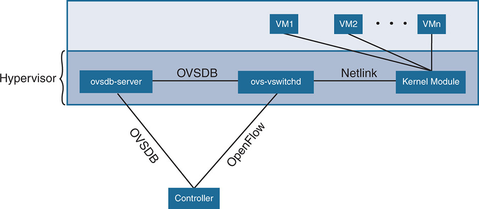

.Ovsdb-server

This is a configuration database that controls and stores the switch-level
configuration. It contains information on creating bridges, attaching
interfaces, attaching tunnels, and so on. these objects are organized in the
form of a set of different tables that points to each other in a certain
sequence:

* OVS table 
* bridge table
* port table 
* interface table

For example, an entry in the top level OVS table points to a brige table, which
has items pointing to a port table, which in turn, points to a interface table.
The stateful database make sure the system can recover back to the exact status
it was in case it rebooted. The ovsdb-server database talks to the outside
controller via the `OVSDB` protocol.

.Ovsdb-vswitchd

This is the heart of OVS and where flow processing happens.  `ovsdb-vswitchd`
has all the information (e.g. bridges, flow tables, etc) needed to forward
packets. It has different interfaces to other components.  Inside of the
hypervisor, it connects to ovsdb-server via the OVSDB protocol, and to the
kernel module via a Linux Netlink interface. To outside controller, it runs
OpenFlow protocol to exchange flow information.

//Ovsdb-vswitchd handles the forwarding of all sorts
//of flows that are communicated to it via the OpenFlow protocol.

////
.ovs ovsdb:

image::https://user-images.githubusercontent.com/2038044/78375629-158a7e80-759b-11ea-965a-6e858a76b2b8.png[image]
////

==== OVS workflow

`Ovsdb-vswitchd` pushes the flows to the kernel module for fast forwarding.
When the first packet arrives, it goes through the kernel module, where the
headers are hashed to find a flow entry. If the flow entry is not found, the
packet goes to ovsdb-vswitchd for normal processing. `Ovsdb-vswitchd` then
pushes the flow to be cached inside the module kernel. If a similar flow comes
in, it is forwarded via the fast path inside the kernel module. The kernel
module does not contain any of the OpenFlow tables that are known to
ovsdb-vswitchd; rather, it contains the result of the different lookups in the
flow tables. The kernel module also handles the tunneling of packets via
protocols such as GRE, VXLAN, and others.

=== calico

==== calico introduction

quote from calico official website:
____
Calico is an open source networking and network security solution for
containers, virtual machines, and native host-based workloads. Calico supports
a broad range of platforms including Kubernetes, OpenShift, Docker EE,
OpenStack, and bare metal services.
____

Calico has been an open-source project from day one. It was originally designed
for today's modern cloud-native world and runs on both public and private
clouds. Its reputation mostly comes from it's deplayment in Kubernetes and its
ecosystem environments. Today Calico has become one of the most popularly used
kubernetes CNIes and many enterprises using it at scale.

Comparing with other overlay network SDN solutions, Calico is special in the
sense that it does not use any overlay networking design or tunneling
protocols, nor does it require NAT.  Instead it uses a plain IP networking
fabric to enables host to host and pod to pod networking.  The basic idea is to
provides Layer 3 networking capabilities and associates a virtual router with
each node, so that each node is behaving like a traditional router, or a
"virtual router". We know that a typical Internet router relies on routing
protocols like OSPF, BGP to learn and advertise the routing information, and
That is the way a node in calico networking works. It chooses BGP, because of
it's simple, industry's current best practice, and the only protocol that
sufficiently scale.

calico uses a policy engine to deliver high-level network policy management. 

==== calico archetecture

//image:../diagrams/k8s-calico-graph.png[image]
image:../diagrams/calico-arch.png[image]

Calico is made up of the following components:

- Felix: the primary Calico agent that runs on each machine that hosts endpoints.
- The Orchestrator plugin: orchestrator-specific code that tightly integrates Calico into that orchestrator.
- BIRD: a BGP speaker that advertise and install routing information.
- BGP Route Reflector (BIRD): an optional BGP route reflector for higher scale.
- calico CNI plugin: connect the containers with the host
- IPAM: for IP address allocation management
- etcd: the data store.

.felix (policy)

This is calico "agent" - a daemon that runs on every workload, for example on
nodes that host containers or VMs. it is the one that performs most of the
"magics" in the calico stack. It is responsible for programming routes and
ACLs, and anything else required on the host, in order to provide the desired
connectivity for the endpoints on that host.

Depending on the specific orchestrator environment, Felix is responsible for
the following tasks:

* Interface management (ARP response)
* Route programming (linux kernel FIB)
* ACL programming (host IPtables)
* State reporting (health check)

////
It has multiple responsibilities:

- it writes the routing table of the operating system 
- it manipulates IPtables on the host.
////
It does all this by connecting to etcd and reading information from there. It
runs inside the calico/node DaemonSet along with `confd` and `BIRD`.

.Orchestrator plugin

The orchestrator plugins are essentially responsible for API translations.
Calico has a separate plugin for each major cloud orchestration platforms (e.g.
OpenStack, Kubernetes). 
////
The purpose of these plugins is to bind Calico more tightly into the
orchestrator, allowing users to manage the Calico network just as they’d manage
network tools that were built into the orchestrator.
////
For example in openstack environment, a Calico Neutron ML2 driver integrates
with Neutron’s ML2 plugin to allows users to configure the Calico network
simply by making Neutron API calls. This provides seamless integration with
Neutron.

.Etcd (database)

the backend data store for all the information Calico needs. it can be the same of different etcd that kubernetes use.
//it's recommended deploy a separate etcd for production systems, or at least
//deploy it outside of your kubernetes cluster.
it has at least, but not limited to the following information:
* list of all workloads (endpoints)
* BGP configuration
* policys from user (e.g. defined via the `calicoctl` tool)
* information about each container (pod name, IP, etc), received from calico CNI

.BIRD (BGP)

Calico makes uses of BGP to propagate routes between hosts.  And the BGP
"speaker" in calico is BIRD - a routing daemon that runs on every host that
also hosts Felix module in the Kubernetes cluster, usually as a `DaemonSet`. It
’s included in the calico/node container.  it's role is to read routing state
that Felix programs into the kernel and distribute it around the data center.
comparing with what Felix does, one of the main differences is that Felix
"insert" routes into the linux kernel FIB and BIRD "distribute" them to all
other nodes in the deployment, this turns each host to a virtual Internet BGP
router ("vRouter"), and ensures that traffic is efficiently routed around the
deployment.

.Confd

confd is a simple configuration management tool. In Calico, BIRD does not deal
with etcd directly, it is another module "confd" that reads the BGP
configuration from etcd and feed to BIRD in the form of configurations files in
disk.

.CNI plugin

configure IP, routes
`CNI` stands for "container networking interface". 

There’s an interface for each pod, When the container spun up, calico (via CNI)
created an interface for us and assigned it to the pod.

when a new pod starts up, Calico will:
- query the kubernetes API to determine the pod exists and that it’s on this node
- assigns the pod an IP address from within its IPAM
- create an interface on the host so that the container can get an address
- tell the kubernetes API about this new IP

.IPAM plugin

as the name indicated already, Calico's IPAM plugin is responsible for "IP
address management". when a new container is spawn, calico IPAM plugin reads
information from etcd database to decide which IP is available to be allocated
to the container. the IP address by default will be allocated in the unit of
/26 "block". a block is essentially a subnet which aggregate the routes to save
routing table spaces.

==== calico workflow

- A container is spawned
- calico IPAM plugin assign an IP address from an IP block (by default /26). it
  then records this in etcd.
- calico CNI apply the network configuration to the container so it has a
  default route pointing to the host. CNI also save these information to etcd.
- calico felix appy the network configuration to the host, so it is aware of
  the new container, and be ready to receive packets from it.
- confd read the data from etcd and generate the routing configuration, BIRD
  use these configuratioin to establish BGP neighborship with other nodes. it
  then advertises the container subnet to the rest of the cluster via BGP
- all other hosts in the same cluster will learn this subnet via BGP and
  install the route into its local routing table, now the new container is
  reachable from anywhere in the cluster.
- user may configure a routing policy, e.g. via the `calicoctl` commands. the
  policy will be save in etcd database. felix read this policy and applies it
  to the firewall configurations.

.Reference

* https://www.projectcalico.org
* https://www.projectcalico.org/why-bgp/

=== VCP(nuage)

==== VCP introduction

The Virtualized Cloud Platform (VCP) is created by Nuage networks. It provides
a "policy-based" SDN platform that has a data plane built on top of the open
source OVS, and a SDN controller built on open standards.

The Nuage platform uses overlays to provide policy-based networking between
different clouding environment (Kubernetes Pods or non-Kubernetes environments
such as VMs and bare metal servers). it also has a real-time analytics engine
to monitor Kubernetes applications.

All components can be installed in containers. There are no special hardware
requirements.

==== VCP architecture

.Nuage VSP incudes 3 major components

* virtualized services directory (VSD)
* virtualized services controller (VSC)
* virtualized routing and switching (VRS)

.Nuage architecture
image:https://user-images.githubusercontent.com/2038044/78465427-93e24000-76c3-11ea-92ee-39a45a259e74.png[image]

.VSD

In Nuage VCP, The Virtualised Services Directory (VSD) is a policy engine,
business logic and analytics engine that supports the abstract definition of
network services. Through RESTful APIs to VSD, administrators can define and
refine service designs and incorporate enterprise policies.

It is a web-based, graphical console that connects to all of the VRS nodes in
the network to manage their deployment and configuration. 

The VSD policy & analytics engine presents a unified web interface where
configuration and monitoring data is presented. The VSD is API-enabled for
integration with other orchestration tools. Alternatively, you can develop your
apps. Either way, the VSD is based on tools from the service provider world,
and therefore scaling potential looks very good. It integrates multiple data
centre networks by linking VSDs together and exchanging policy data.

.VSC

Nuage Virtual Services Controllers (VSC) works between VSD and VRS. policies
from VSD is distributed through a number of VSC to all of the VRS nodes in the
network to manage their deployment and configuration.

VSC is SDN controller in Nuage VCP architecture. it provides a robust control
plane for the datacenter network, maintaining a full per-tenant view of network
and service topologies. Through network APIs that use southbound interfaces
(e.g. OpenFlow), VSC programs the datacenter network independent of different
hardwares.

The VSC implements an OSPF, IS-IS or BGP listener to monitor the state of the
physical network. Therefore, if routes starts flapping, the VSC is able to
incorporate those events into the decision tree.

while scalability in a single data center can be achieved by setting up
multiple VSC, each handling a certain group of VRS devices, scalability between
multiple data centres can be achieved by connecting VSC controllers
horizontally at the top of the hierarchy.

.Nuage VSC MP-BGP
image:../diagrams/nuage-mpbgp.png[]

As shown in the diagram above, VSC controllers are synchronised using
MP-BGP. A BGP connection peers with PE routers at the WAN edge, and then the
VSC controller uses MP-BGP to synchronise controller state & configuration with
VSCs in other data centres. This is vital for end-to-end network stability.

When dVRS devices are communicating to non-local dVRS devices,
data is tunnelled in MPLS-over-GRE to the PE router.

.VRS

The VRS module serves as a virtual endpoint for network services. It detects
changes in the compute environment as they occur and instantaneously triggers
policy-based responses to ensure that the network connectivity needs of
applications are met.

configuration of the VRS is derived from a series of templates. 

Each VRS routes traffic into the network according to its flow table.
Therefore, the entire VRS system performs routing at the edge of the
network.

A VRS can’t make a forwarding decision in a vacuum, as events in the
underlying physical network must be considered. Nuage Networks has
extensively considered how to provide the VSC controller with all the
information required to have a complete model of the network. 

////
==== other solutions?

===== cisco: apic
===== openflood
==== vmare NSX
////

==== VCP workflow

=== Overview of Tungsten Fabric (TF)

==== TF introduction

////
We've introduced a few SDN solutions existing in the market.  Some of them are
based on proprietary protocols and standards. Openflow is standardized protocol,
but it is more or less "outdated" technologies after more than a decade since
it's birth in 2008.
////

The Tungsten Fabric (TF), is an open-standard based, proactive overlay SDN
solution. It works with existing physical network devices and help address the
networking challenges for self-service, automated, and vertically integrated
cloud architecture. It also improves scalability through a proactive overlay
virtual network technique.

TF controller integrates with most of the popular cloud management systems such
as OpenStack, vmware, and Kubernetes. TF's focus is to provide networking
connectivity and functionalities, and enforce user-defined network and security
policies to the various of workloads based on different platforms and
orchestrators.

Tungsten Fabric's primary claim to fame is that it is diligently multi-cloud and
multi-stack. Today it supports:

* Multiple compute types: baremetal, VMs and containers
* Multiple cloud stack types: VMware, OpenStack, Kubernetes (via CNI), OpenShift
* Multiple performance modes: kernel native, DPDK accelerated, and several
  different SmartNICs
* Multiple overlay models: MPLS tunnels or direct, non-overlay mode (no
  tunneling)

TF fits seamlessly into LFN (Linux Foundation Networking) mission to foster open
source innovation in the networking space.

The TF system is implemented as a set of nodes running on general-purpose x86
servers. Each node can be implemented as a separate physical server, or VM.

.open source version

Initially, "Contrail" was a product of a startup company "Contrail system",
which was acquired by Juniper Networks in Dec. 2012. It was open sourced in 2013
with a new name "OpenContrail" under the Apache 2.0 license, which means that
anyone can use and modify the code of "Opencontrail" system without any
obligation to publish or release the modifications. In early 2018, it was
rebranded to "Tungsten Fabric" (abbreviated as "TF") as it transitioned into a
fully-fledged Linux Foundation project.  currently TF is still managed by the
Linux Foundation.

////
Tungsten Fabric (TF) seeks to be one of many potential next generation open
source software-defined networking solutions that can be used as part of a
"stack". TF already plays nice with some LFN projects such as DPDK. It also
works closely with related LF open networking projects such as Akraino Edge
Stack, OPNFV, and ONAP. TF seeks to continue to increase coordination and
interoperability with related open source networking projects over time.
////

.commercial version

Juniper also maintains a commercial version of the Contrail system, and
provides commercial support to the payed users. Both The open-source version
and commerical version of the Contrail system provide the same full
functionalities, features and performances.

NOTE: Throughout this book, we use these terms "contrail", "opencontrail",
"Tungsten Fabric" and "TF" interchangeably.

==== TF architecture

TF consists of two main components:

- Tungsten Fabric Controller: the SDN controller in the SDN architecture. 

////
a set of software services that maintains a model of networks and network
policies, typically running on several servers for high availability
////

- Tungsten Fabric vRouter: a forwarding plane that runs in each compute node
  performings packet forwarding and enforces network and security policies.

The communication between the controller and vRouters is via XMPP, which is a
widely used messaging protocol.

//installed in each host that runs workloads (virtual machines or containers)

A high level Tungsten Fabric architecture is shown below:

.TF architecture
image:../diagrams/TFA_private_cloud.png[TF arch]
//image:../diagrams/TF_arch1.png[TF arch]

===== The TF SDN controller node

The TF SDN controller integrates with an orchestrator's networking module in
the form of a "plugin", for instance:

- in OpenStack environment, TF interfaces with the Neutron server as a neutron plugin 
- in kubernetes environment, TF interfaces with k8s API server as a
  `kube-network-manager` process and a `CNI` plugin that is watching the events
  from the k8s API.

TF SDN Controller is a so-called "logically centralized" but "physically
distributed" SDN controller. It is "physically distributed" because same exact
controllers can be running in multiple (typicall three) nodes in a cluster.
However, all controllers work together to behaves consistently as a single
logical unit that is responsible for providing the management, control, and
analytics functions of the whole cluster. 

This "physically distributed" nature of the Contrail SDN Controller is a
distinguishing feature. Because there can be multiple redundant instances of the
controller, operating in an "active/active" mode (as opposed to an
"active-standby" mode). When everything works, two controllers can share the
workload and load balance the control tasks. When a node becomes overloaded,
additional instances of that node type can be instantiated after which the load
is automatically redistributed. on the failure of any active node, the system as
a whole can continue to operate without any interruption. This prevents any
single node from becoming a bottleneck and allows the system to manage a very
large-scale system.
In production, a typical High-Availability (HA) deployment is to run three
controller nodes in an active-active mode, single point failure is eliminated.

//This is a distinguishing feature to archive the goal of redundancy and horizontal scalability.

As any SDN controller, The TF controller has a "global view" of all routes in
the cluster. it implements this by collecting the route information from all
computes (where the TF Vrouters resides) and distributes these information
throughout the cluster.

===== TF vRouter: compute node

Compute nodes are general-purpose virtualized servers that host VMs. These VMs
can be tenants running general applications, or service VMs running network
services such as a virtual load balancer or virtual firewall.  Each compute
node contains a TF vRouter that implements the forwarding plane.
//and the distributed part of the control plane.

The TF vRouter is conceptually similar to other existing virtualized switches
such as the Open vSwitch (OVS), but it also provides routing and higher layer
services. It replaces traditional Linux bridge and IP tables, or Open vSwitch
networking on the compute hosts. Configured by TF controller, TF vRouter
implement the desired networking and security policies. while workloads in same
network can communicate with each other "by default", a explicit network policy
is required to communicate with VMs in different networks.

As other overlay SDN solutions, TF vRouter extends the network from the
physical routers and switches in a data center into a virtual overlay network
hosted in the virtualized servers.  Overlay tunnels are established between all
computes, communication between VMs on different nodes are carried in these
tunnels and behaves as if they are on the same compute. Currently vXLAN,
MPLSoUDP and MPLSoGRE tunnels are supported.

===== TF controller components

In each TF SDN Controller there are three main components:

image:../diagrams/TF_arch2.png[contrail arch]

- Configuration nodes keep a persistent copy of the intended configuration
  states and store them in cassandra database. they are also responsible for
  translating the high-level data model into a lower-level form suitable for
  interacting with control nodes.

- Control nodes are responsible for propagating the low-level state data it
  received from configuration node to the network devices and peer systems in
  an eventually consistent way.  They implements a logically centralized control
  plane that is responsible for maintaining network state. control nodes run
  XMPP with network devices, and run BGP with each other.

- Analytics nodes are mostly about statistics and logging. They are responsible
  for capturing real-time data from network elements, abstracting it, and
  presenting it in a form suitable for applications to consume.  it collect,
  store, correlate, and analyze information from network elements.

////
- Gateway nodes are physical gateway routers or switches that connect the
  tenant virtual networks to physical networks such as the Internet, a customer
  VPN, another data center, or non-virtualized servers.

- Service nodes are physical network elements providing network services such
  as DPI, IDP,IPS, WAN optimizers, and load balancers. Service chains can
  contain a mixture of virtual services (implemented as VMs on compute nodes)
  and physical services (hosted on service nodes).

For clarity, Figure 2 does not show physical routers and switches that form the
underlay IP-over-Ethernet network.  There is also an interface from every node
in the system to the analytics nodes. This interface is not shown in Figure 2
to avoid clutter.
////

===== TF vRouter components

TF vRouter is running in each compute node. The compute node is a
general-purpose x86 server that hosts tenant VMs running customer applications.

// examples can be: Web servers, database servers, enterprise applications or hosting
// virtualized services used to create service chains

TF vRouter consists two components:

* the vRouter agent: the local control plane. 
* the vRouter forwarding plane

NOTE: In the typical configuration, Linux is the host OS and KVM is the
hypervisor. The Contrail vRouter forwarding plane can sits either in the Linux
kernel space, or in the user space in dpdk mode. more details will be covered in
later chapters.

.vRouter Agent

image:../diagrams/TF_vrouter1.png[contrail vrouter1]

The vRouter agent is a user space process running inside Linux. It acts as the
local, lightweight control plane in the compute, in a way similar to what
"routing engine" does in a pysical router.  For example, vRouter agent
establish XMPP neighborships with two controller nodes, then exchances the
routing information with them. vRouter agent also dynamically generate flow
entries and inject them into the vRouter forwarding plane, this gives
instructions to the vRouter about how to forward packets.

.vRouter Forwarding Plane

image:../diagrams/TF_vrouter2.png[contrail vrouter2]

The vRouter forwarding plane works like a "line card" of a traditional router.
it looks up its local FIB and determines the next hop of a packet.  It also
encapsulates packets properly before sending them to the overlay network and
decapsulates packets to be received from the overlay network.

We'll cover more details of TF vrouter in the later chapters.

==== TF workflow

=== References

* [[sdn-history]] https://www.cs.princeton.edu/courses/archive/fall13/cos597E/papers/sdnhistory.pdf
* [[onf-sdn-definition]] https://www.opennetworking.org/sdn-definition/
* [[ovs]]https://www.openvswitch.org/
////
* https://www.rfc-editor.org/rfc/rfc7426.txt
* https://portal.etsi.org/NFV/NFV_White_Paper.pdf
* https://www.sdxcentral.com/wp-content/uploads/2015/08/SDxCentral-SDN-Controllers-Report-2015-B2.pdf[SDxCentral-SDN-Controllers-Report-2015]
* https://www.opennetworking.org/images/stories/downloads/sdn-resources/special-reports/Special-Report-OpenFlow-and-SDN-State-of-the-Union-B.pdf[Special-Report-OpenFlow-and-SDN-2016]
* https://ieeexplore.ieee.org/stamp/stamp.jsp?arnumber=8379403[Controllers in SDN: A Review Report. 2018]
//* https://aptira.com/comparison-of-software-defined-networking-sdn-controllers-part-2-open-network-operating-system-onos[2019]
* https://www.opendaylight.org/technical-community/getting-started-for-developers/roadmap
* https://www.opendaylight.org/what-we-do/current-release/boron
* https://www.sdnlab.com/community/article/odl/1
* https://wiki.lfnetworking.org/display/LN/Tungsten+Fabric+Project+Proposal
* http://yuba.stanford.edu/cleanslate/research_project_ethane.php
* http://yuba.stanford.edu/ethane/pubs.html
* https://dl.acm.org/doi/10.1145/1355734.1355746
////

<<<

== chapter 2: SDN dataplane fundamentals

=== Virtualization concepts

==== Server virtualization

Kernel-based Virtual Machine (KVM) is an open source virtualization technology built into Linux.
It provides hardware assist to the virtualization software, using built-in CPU virtualization technology to reduce virtualization overheads (cache, I/O, memory) and improving security.

QEMU is a hosted virtual machine emulator that provides a set of different hardware and device models for the guest machine.
For the host, QEMU appears as a regular process scheduled by the standard Linux scheduler, with its own process memory.
In the process, QEMU allocates a memory region that the guest sees as physical and executes the virtual machine’s CPU instructions.

With KVM, QEMU can just create a virtual machine with virtual CPUs (vCPUs) that the processor is aware of and runs native-speed instructions.
When a special instruction is reached by KVM, like the ones that interacts with the devices or to special memory regions, vCPU pauses and informs QEMU of the cause of pause, allowing hypervisor to react to that event.

LibVirt is an Open Source toolkit to manage virtualization platforms.
Libvirt is collection of softwares which allow to manage virtual machines and other virtualization functionality, such as storage and network interface management.
LibVirt is proposing to define virtual components in a XML-formatted configurations, that are able to be translated into QEMU command line.

ifdef::word[image:../diagrams/extracted-media-chapter2cleaned4adoc.docx/media/image1.emf[image]]
ifndef::word[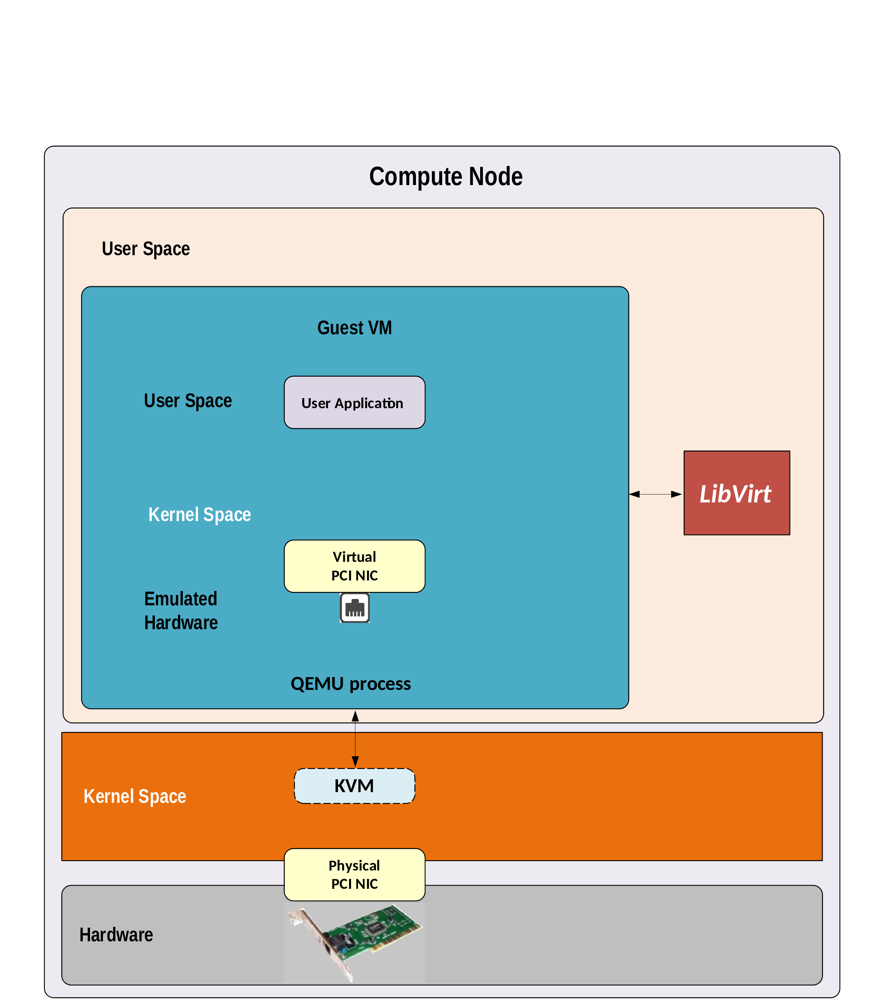]

==== Inter Process Communication

Inter process communication (IPC) is a mechanism which allows processes to communicate with each other and synchronize their actions.
The communication between these processes can be considered as a method of cooperation between them.

IPC is used in network virtualization in order to be able to exchange data
between different distributed processes of a same application (for example,
virtio frontend and backend, contrail vrouter agent and dataplane, etc ...) or
between processes of distinct applications (e.g., contrail vrouter and QEMU
virtio, virtio and VFIO, and so on)

Two different modes of communication are used for IPC:

- Shared Memory: processes are reading and writing information into shared memory region.
- Message Passing: processes are establishing a communication link which will be used to exchange messages.

===== Shared Memory

Following scenario is used when shared memory is used for IPC:

* First, a shared memory area is defined (shmget) with a key identifier known by processes involved into the communication.
* Second, processes are attaching (shmat) to the shared memory and are retrieving a memory pointer.
* Then, processes are reading or writing information in the shared memory using the shared memory pointer (read/write operation).
* Next, processes are detaching from the shared memory (shmdt)
* Last, the shared memory area is freed (shmctl)

Following system calls are used in shared memory IPC:

* shmget: create the shared memory segment or use an already created shared memory segment.
* shmat: attach the process to the already created shared memory segment.
* shmdt: detach the process from the already attached shared memory segment.
* shmctl: control operations on the shared memory segment (set permissions, collect information).

===== Message passing

Several message passing methods are available to exchange data information between processes:

* eventfd: is a system call that creates an "eventfd object" (64-bit integer).
  It can be used as an event wait/notify mechanism by user-space applications,
  and by the kernel to notify user-space applications of events.
* pipe (and named pipe) are unidirectional data channel.  Data written to the
  write-end of the pipe is buffered by the operating system until it is read
  from the read-end of the pipe.
* Unix Domain Socket: domain sockets use the file system as their address
  space.  Processes reference a domain socket as an inode, and multiple
  processes can communicate using a same socket.  The server of the
  communication binds a Unix socket to a path in the file system, so a client
  can connect to it using that path.

There are some other mechanisms that can be used by processes to exchange
messages (shared file, message queues, network sockets, and signals system
calls) and are not described in this document.

==== Network device Architecture and concepts

===== Control and Data paths

Two different flows are used by a network application using a NIC device:

* Control: manages configuration changes (activation/deactivation) and
  capability negotiation (speed, duplex, buffer size) between the NIC and
  network application for establishing and terminating the data path on which
  data packets will be transferred.

* Data: performs data packets transfer between NIC and network application.
Packet are transferred from NIC internal buffer to a host memory area which is reachable by the network application.

ifdef::word[image:../diagrams/extracted-media-chapter2cleaned4adoc.docx/media/image2.emf[image]]
ifndef::word[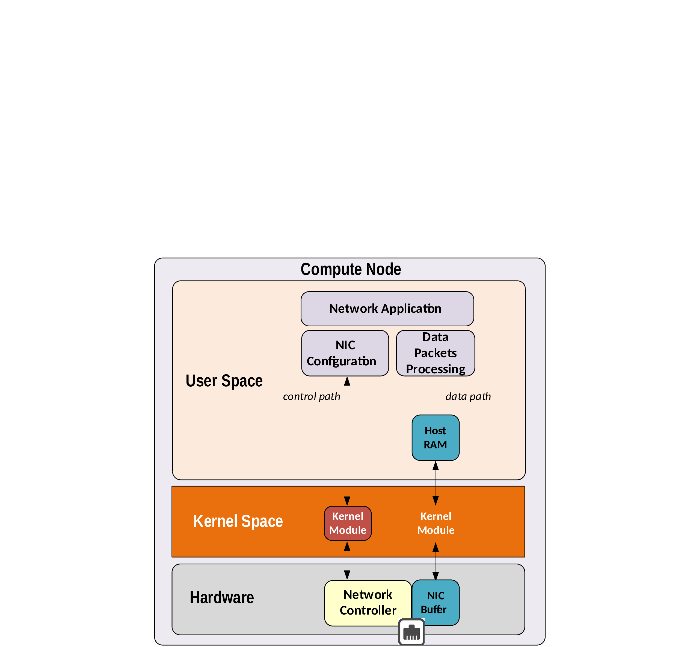]

Each flow is using a well-defined path:

* control path
* data path

===== Event versus polling based packet processing

Linux network stack is using an event-based packet processing method.
In such a method every incoming packet hitting the NIC:

* is copied in host memory via DMA
* then the NIC generates an interrupt.
* then a Kernel module is placing the packet into a "socket buffer"
* application runs a "read" system call

for every egress packet generated by the network application:

- application performs a write call on the socket in order to copy the generated packet from the applications user space to a socket buffer
- Kernel device driver invokes the NIC DMA engine to transmit the frame onto the wire.
- Once transmission is complete, the NIC raises an interrupt to signal transmit completion in order to get socket buffer memory freed.

This method is not efficient when packets are hitting the NIC at a high packet rate.
Lots of interrupts are generated, creating lots of context switching (kernel to user and vice-versa).

[cols=",",]
|====
a| 
ifdef::word[image:../diagrams/extracted-media-chapter2cleaned4adoc.docx/media/image3.emf[image] Event based packet processing]
ifndef::word[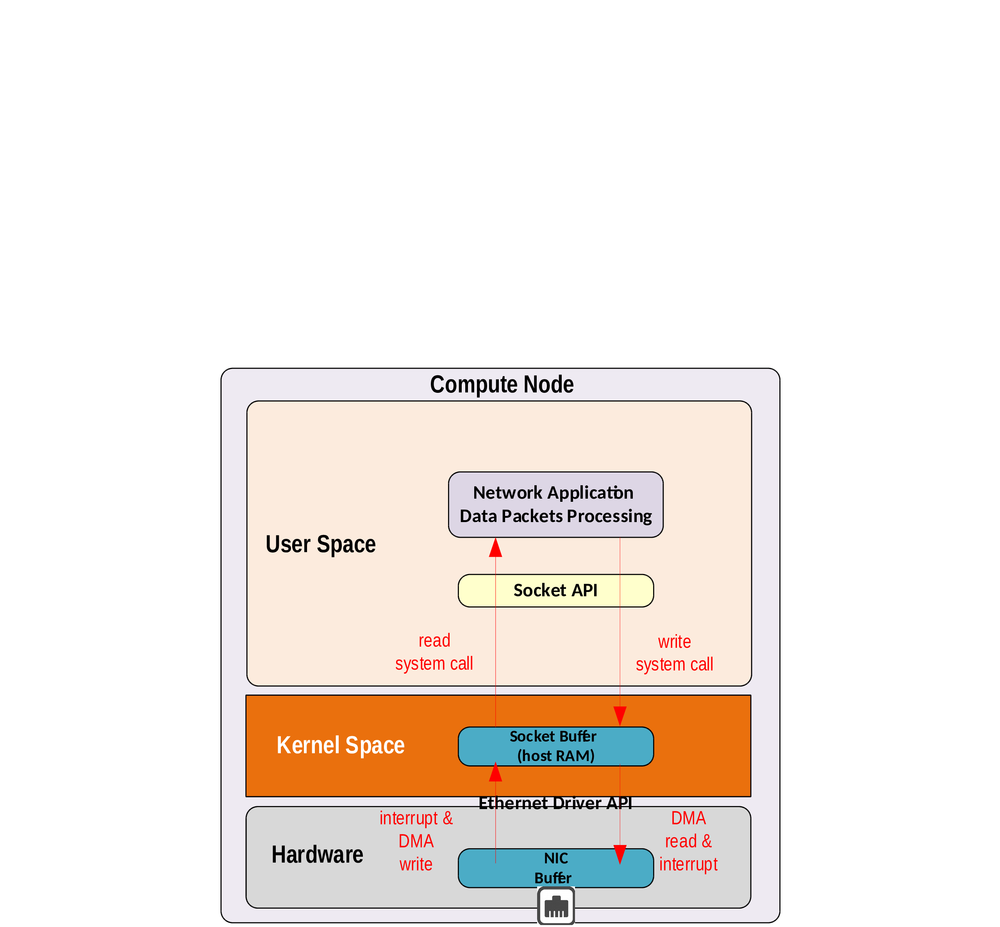 Event based packet processing]

a| 
ifdef::word[image:../diagrams/extracted-media-chapter2cleaned4adoc.docx/media/image4.emf[image] polling based packet processing]
ifndef::word[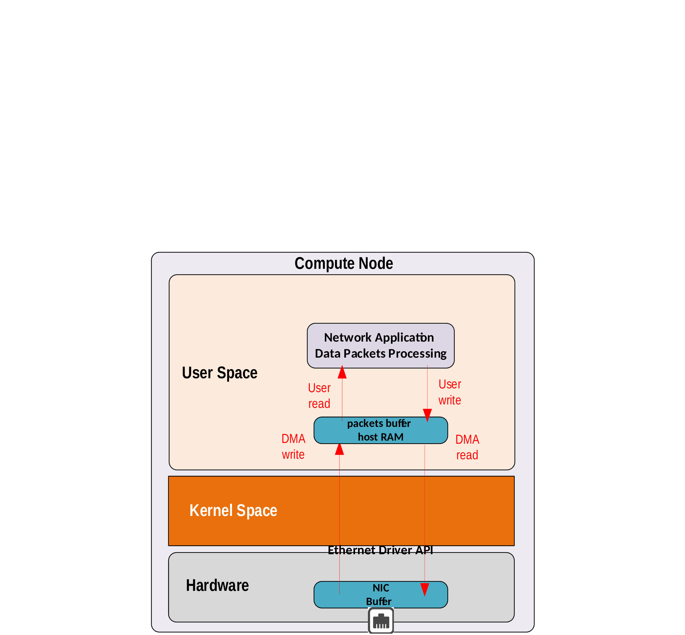 polling based packet processing]
|====

Polling based packet processing is an alternate method (it is used by DPDK). All incoming packets are copied transparently (without generating any interrupt) by the NIC into a specific host memory area region (predefined by the application). At a regular pacing, the network application is reading (polling) packets stored into this memory area.

On the opposing direction, the network application is writing packet into the shared memory area region.
A DMA transfer is triggered to copy the packet from the host memory to the NIC card buffers.

No interrupt is used with this method, but it requires network application to check at a regular pacing whether a new packet has hit the NIC.
This method is well suited for high rate packet processing: If packets are arriving at a slow rate this algorithm is less efficient as the event based one.

==== Network devices virtualization

Like CPU virtualization, two kinds of methods are used to virtualize network devices:

* Software-Based Emulation.
* Hardware-assisted Emulation.

Software Based Emulation are widely supported but can suffer of poor performance.
Hardware assisted Emulation if providing good performance thanks to hardware acceleration, but it requires to use a hardware that supports some specific features.

===== Software-Based Emulation.

Two solutions are proposed for device virtualization with software:

* Traditional Device Emulation (Binary Translation): the guest device drivers are not aware of the virtualization environment.
During runtime, the Virtual Machine Manager (VMM), usually QEMU/KVM, will trap all the IO and Memory-mapped I/O (MMIO) accesses and emulate the device behavior (trap and emulate mechanism). +
The Virtual Machine Manager (VMM) emulates the I/O device to ensure compatibility and then processes I/O operations before passing them on to the physical device (which may be different). Lots of VMEXIT (context switching) are generated with this method.
It provides poor performance.

* Paravirtualized Device Emulation (virtio): the guest device drivers are aware of the virtualization environment.
This solution uses a front-end driver in the guest that works in concert with a back-end driver in the Virtual Machine Manager (VMM). These drivers are optimized for sharing and have the benefit of not needing to emulate an entire device.
The back-end driver communicates with the physical device.
Performance are much better than with Traditional Device Emulation.

Software emulated devices can be completely virtual with no physical counterpart or physical ones exposing a compatible interface.

===== Hardware-assisted Emulation.

Two solutions are proposed for device virtualization assisted with hardware:

* Direct Assignment: allows a VM to access directly to a network device.
Thus the guest device drivers can directly access the device configuration space to, e.g., launch a DMA operation in a safe manner, via IOMMU. +
Drawbacks:

* direct assignment has limited scalability.
A physical device can only be assigned to one single VM.
* IOMMU must be supported by the host CPU (Intel VT-d or AMD-Vi feature).

* SR-IOV: with SR-IOV, each physical device (physical function) can appear as multiple virtual ones (aka virtual function). Each virtual function can be directly assigned to one VM, and this direct assignment is using the vt-d/IOMMU feature.
* Drawbacks:

* IOMMU must be supported by the host CPU (Intel VT-d or AMD-Vi feature).
* SR-IOV must be supported by the NIC device (but also by the BIOS, the host OS and the guest VM).

==== Emulated network devices

The following two emulated network devices are provided with QEMU/KVM:

* e1000 device: emulates an Intel E1000 network adapter (Intel 82540EM, 82573L, 82544GC).
* rtl8139 device: emulates a Realtek 8139 network adapter.

==== Paravirtualized network device

Virtio is an open specification for virtual machines' data I/O communication, offering a straightforward, efficient, standard and extensible mechanism for virtual devices, rather than boutique per-environment or per-OS mechanisms.
It uses the fact that the guest can share memory with the host for I/O to implement that.

Virtio was developed as a standardized open interface for virtual machines (VMs) to access simplified devices such as block devices and network adaptors.

===== Virtio frontend and backend

VirtIO interface is made of backend component and a frontend component:

* The frontend component is the guest side of the virtio interface
* The backend component is the host side of the virtio interface

ifdef::word[image:../diagrams/extracted-media-chapter2cleaned4adoc.docx/media/image5.emf[image]]
ifndef::word[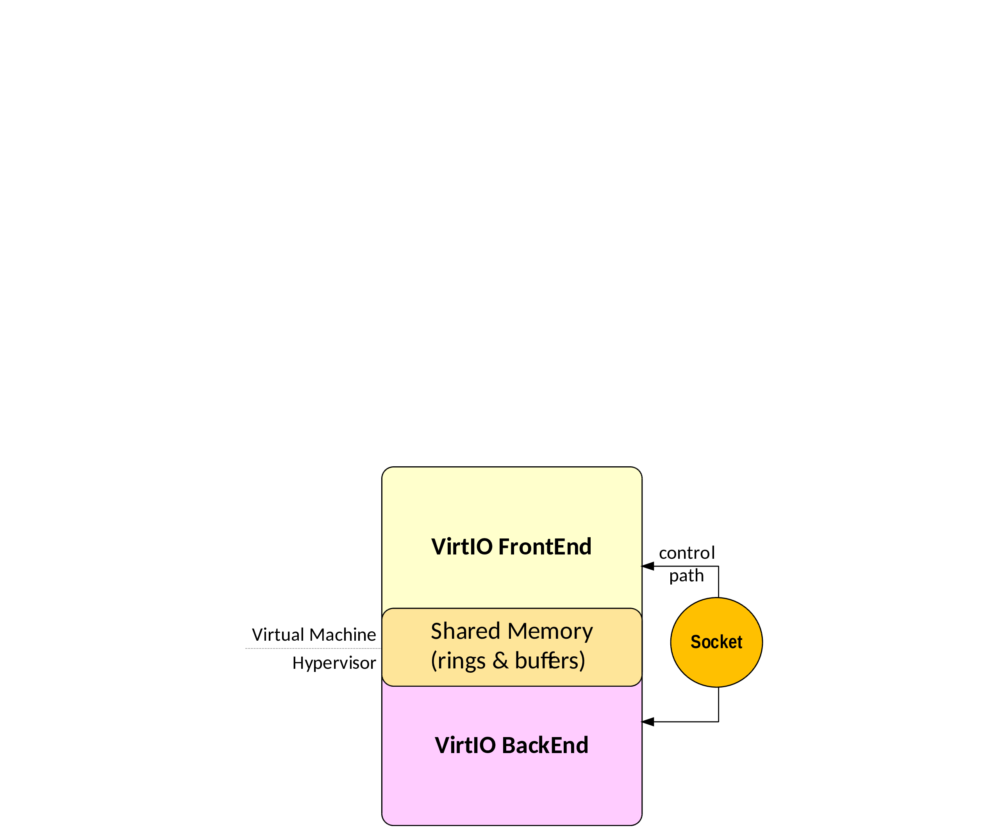]

===== Virtio transport protocol

virtio network driver is the VirtIO frontend component exposed into the guest VM

virtio network device is the VirtIO backend component exposed by the hypervisor.

Virtual Network frontend and backends are interconnected with a transport protocol (usually PCI/PCIe).

The virtio drivers must be able to allocate memory regions that both the hypervisor and the devices can access for reading and writing, via memory sharing.
Two different domains have to be considered for a network device:

* virtio device initialization, activation or shutdown (control plane)
* network packets transfer through the virtio device (data plane)

ifdef::word[image:../diagrams/extracted-media-chapter2cleaned4adoc.docx/media/image6.emf[image]]
ifndef::word[image:../diagrams/extracted-media-chapter2cleaned4adoc.docx/media/image6.png[image]]

Control plane is used for capability exchange negotiation between the host and guest both for establishing and terminating the data plane.
Data plane is used for transferring the actual packets between host and guest.

Virtqueues are the mechanism for bulk data transport on virtio devices.
They are composed of:

* guest-allocated buffers that the host interacts with (read/write packets)
* descriptor rings

Virqueues are controlled with I/O Registers notification messages:

* Available Buffer Notification: virtio driver notifies there are buffers that are ready to be processed by the device.
* Used Buffer Notification: virtio device notifies it has finished processing some buffers.

===== Virtio device network backend

The network backend that interacts with the emulated NIC and which is exposed on the host side.
Usually network backend is a tap device.
But other backends are proposed with VirtIO (SLIRP, VDE, Socket)

tap devices are virtual point-to-point network devices that the user space applications can use to exchange L2 packets.
Tap devices are requiring tun kernel module to be loaded.
Tun kernel modules create a kind of device in /dev/net system directory tree (/dev/net/tun).

Each new tap device has a name in the /dev/net/tree filesystem.

===== Virtio net backend drawbacks

The usual transport backend used by virtio net device is presenting some inefficiencies:

* syscall and data copy are required for each packet to send or receive through the tap interface (no bulk transfer mode).
* virtio driver (front end) notifies there are one available packet for the virtio device (backend) with an interrupt messages (IOCTL)
* each interrupt message stops vCPU execution and generate a context switch (vmexit). Then the host processes the available packet and resume (vmexit) the VM execution using a syscall.

Each time a packet is sent, the VM stops to work to get the available packet processed.

ifdef::word[image:../diagrams/extracted-media-chapter2cleaned4adoc.docx/media/image7.emf[image]]
ifndef::word[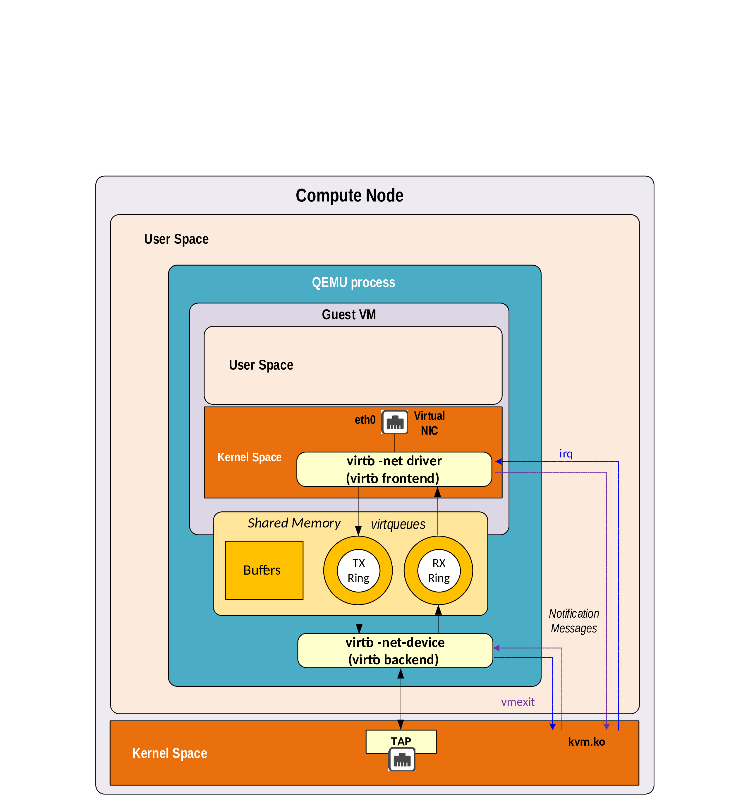]

Hypervisor is involved in both virtio control plane and data plane.

===== vhost protocol

vhost protocol was designed in order to address virtio device usual transport backend limitations.
It's a message-based protocol which allows the hypervisor to offload the data plane to a handler.
The handler is a component which manage virtio data forwarding.
The host hypervisor is no longer process packets.

The dataplane is fully offloaded to the handler that reads or writes packets to/from the virtqueues.
vhost handler direclty access the virtqueues memory region as well as send and receive notification messages.

vhost handler is made up of two parts:

* vhost-net

* a kernel driver
* it exposes a character device on /dev/vhost-net
* uses ioctls to exchange vhost messages (vhost protocol control plane),
* uses irqfd and ioeventfd file descriptor to exchange notifications with the guest.
* spawns a vhost worker thread

* vhost worker

* a linux thread named vhost-<pid> (<pid> is the hypervisor process ID)
* handles the I/O events (generated by virtio driver or tap device)
* forwards packets (copy operations)

A tap device is still used to communicate the guest instance with the host, but the virtio dataplane is managed by vhost handler and is no more processed by the hypervisor.

Guest instances is no more stopped (context switch with a VMEXIT) at each VirtIO packet transfer.

New virtio vhost-net packet processing backend is completely transparent to the guest who still uses the standard virtio interface.

ifdef::word[image:../diagrams/extracted-media-chapter2cleaned4adoc.docx/media/image8.emf[image]]
ifndef::word[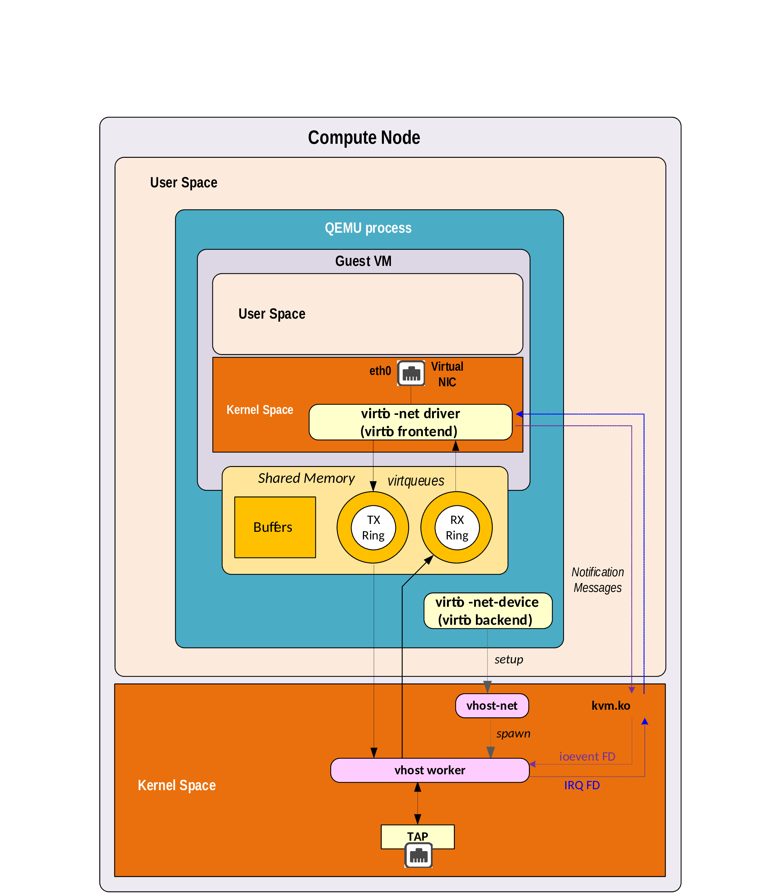]

==== Physical network device Direct I/O Assignment

KVM guests usually have access to software based emulated NIC device (either para-virtualized devices with virtio or traditional emulated devices). On host machines which have Intel VT-d or AMD IOMMU hardware support, another option is possible.
PCI devices may be assigned directly to the guest, allowing the device to be used with minimal performance overhead.

Assigned devices are physical devices that are exposed to the virtual machine.
This method is also known as passthrough.

The VT-d or AMD IOMMU extensions must be enabled in BIOS in order to be able to perform for device Direct Assignment:

Two methods are supported:

* PCI passthrough: PCI devices on the host system are directly attached to virtual machines, providing guests with exclusive access to PCI devices for a range of tasks.
This enables PCI devices to appear and behave as if they were physically attached to the guest virtual machine.
* VFIO device assignment: VFIO improves on previous PCI device assignment architecture by moving device assignment out of the KVM hypervisor and enforcing device isolation at the kernel level.

With VFIO the Physical device is exposed to the host user space memory and is made visible from the guest VM it has been assigned.

ifdef::word[image:../diagrams/extracted-media-chapter2cleaned4adoc.docx/media/image9.emf[image]]
ifndef::word[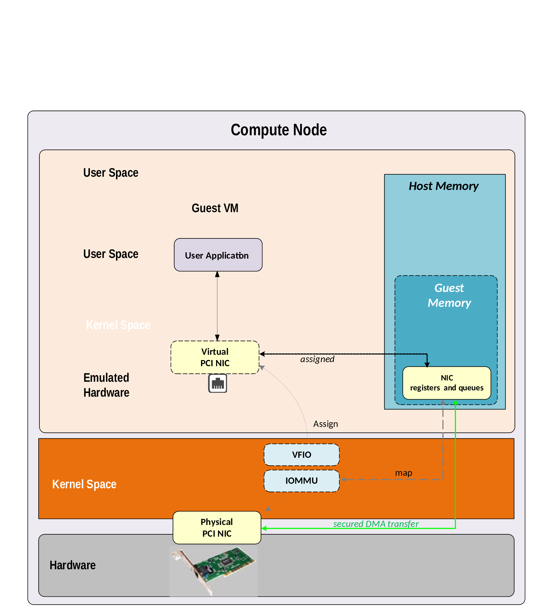]

==== SR-IOV

Single Root I/O Virtualization (SR-IOV) specification is defined by the PCI-SIG (PCI Special Interest Group). This is a PCI Express (PCI-e) that extends a single physical PCI function to share its PCI resources as separate virtual functions (VFs).

The physical function contains the SR-IOV capability structure and manages the SR-IOV functionality (it can be used to configure and control a PCIe device).

A single physical port (root port) presents multiple, separate virtual devices as unique PCI device functions (up to 256 virtual functions – depends on device capabilities).

Each virtual device may have its own unique PCI configuration space, memory-mapped registers, and individual MSI-based interrupts.
Unlike a physical function, a virtual function can only configure its own behavior.
Each virtual function can be directly connected to a virtual machine via PCI device assignment (passthrough mode).

SR-IOV improves network device performance for each virtual machine as it can share a single physical device between several virtual machines using device direct I/O assignment method.

ifdef::word[image:../diagrams/extracted-media-chapter2cleaned4adoc.docx/media/image10.emf[image]]
ifndef::word[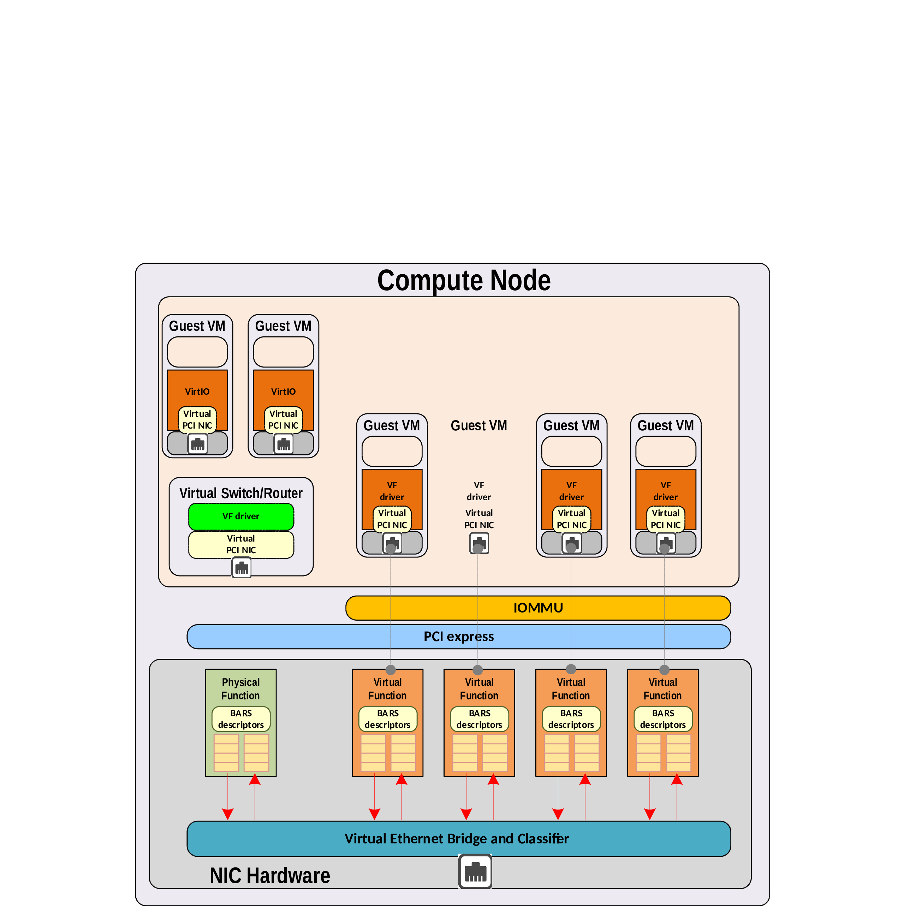]

With SR-IOV, each VM has a direct access to the physical network using the assigned virtual function interface allocated to each.
They can communicate altogether using the Virtual Ethernet Bridge provided by the NIC card.
A virtual switch can also use SRIOV to get access to the physical network.
VM using SRIOV assigned virtual function device has a direct access to the physical network and are not connected to any intermediate virtual network switch or router.

ifdef::word[image:../diagrams/extracted-media-chapter2cleaned4adoc.docx/media/image11.emf[image]]
ifndef::word[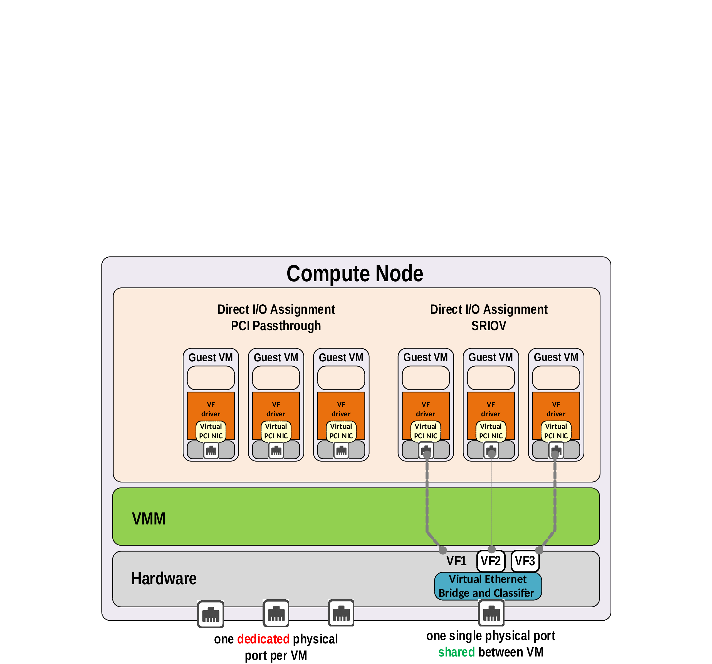]

Following command can be used to check whether SR-IOV is supported or not on a physical NIC card:

$ lspci -s <NIC_BDF> -vvv | grep -i "Single Root I/O Virtualization"

==== VirtIO SR-IOV and SDN

VirtIO is bringing lots of flexibility.
VirtIO is offering a standardized driver which is fully independent of the hardware used on the physical platform hosting VM instances.

When virtio connectivity is used VM can be easily migrated from one host to another using "live migration" feature.
When SRIOV is use, this live migration is not an easy task and is not really possible to achieve.

Indeed, network driver used by VM depends on used hardware on the bare metal node which are hosting them.
In order to make VM migration from one bare metal node to another, both nodes must at least to use same hardware NIC model.
But when SRIOV is used VM connectivity is having barely the same performance has a real physical NIC, whereas with VirtIO, performance could be poor.

Also, SRIOV, providing a direct access to the physical NIC is making host virtual network nodes (virtual router/switch) used by SDN solution totally blind about VM using such connectivity.
Local traffic switching between VM connected on a same SRIOV physical card is achieve by the Virtual Ethernet bridge proposed by SRIOV.
Communication between VM connected onto distinct SRIOV physical ports must rely on physical network.

SDN vswitch/vrouter usage is very limited when SRIOV is used.
Indeed, packet switching between VMs which are using VFs of a same SR-IOV physical port are using the physical Virtual Ethernet Bridge hosted in the physical NIC.

Only some few use cases are relevant, which are:

* Provide internal connectivity between VM using distinct SR-IOV physical ports (it avoids to send the traffic out of the server to be processed by the physical network)

ifdef::word[image:../diagrams/extracted-media-chapter2cleaned4adoc.docx/media/image12.emf[image]]
ifndef::word[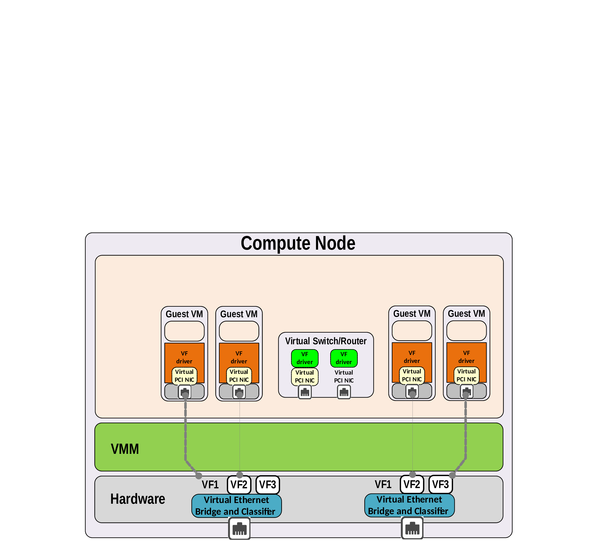]

* Build hybrid mode solutions with multi-NIC VM.
Network traffic not requiring high performance is using emulated NIC (management traffic for instance). Network connectivity requiring high performance will be processed by SRIOV assigned NIC (for instance video data traffic).

ifdef::word[image:../diagrams/extracted-media-chapter2cleaned4adoc.docx/media/image13.emf[image]]
ifndef::word[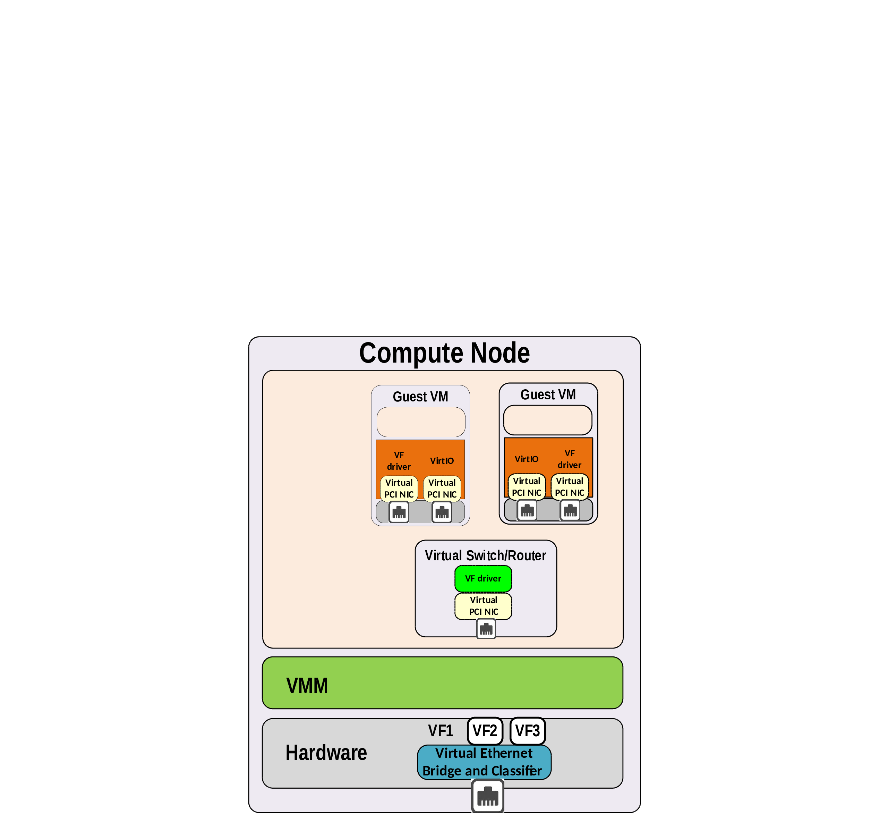]

With SRIOV we are getting high performance but with poor flexibility and no network virtualization features.
With VirtIO we are getting a high level of network virtualization suitable for SDN, which is very flexible with poor performances.

For SDN use cases, we need network virtualization features and performance.
DPDK will bring both.

=== Network Packer processing performance requirements

Ethernet minimum frame size is 64 Bytes.
When Ethernet frames are sent onto the wire, Inter Frame Gap and Preamble bits are added.
Minimum size of Ethernet frames on the physical layer is 84 Bytes (672 bits).

image:../diagrams/extracted-media-chapter2cleaned4adoc.docx/media/image14.png[image,width=560,height=219]

For a 10 Gbit/s interface, the number of frames per seconds can reach up to 14.88 Mpps for traffic using the smallest Ethernet frame size.
It means a new frame will have to be forwarded each 67 ns.

A CPU running at 2Ghz has a 0.5 ns cycle.
Such a CPU has a budget of only 134 cycles per packet to be able to process a flow of 10 Gb/s.

Generic Linux Ethernet drivers are not performant enough to be able to process such a 10Gb/s packet flow.
Indeed, with regular Linux NIC drivers lots of times are required to:

* perform packet processing in Linux Kernel using interrupt mechanism,
* transfer application data from host memory to Network Interface card

DPDK is one of the most used solution available allowing to build a network application using high-speed NICs and working at wire speed.
Therefore, Contrail is proposing DPDK as one of the solutions to be used for the physical compute connectivity.

=== DPDK and Network applications

==== DPDK application working principle

DPDK is dedicating one (or more) CPU to one (or more) thread that are continuously polling a one (or more) DPDK NIC RX queue.
CPU on which a DPDK polling thread is started will be loaded at 100% whatever there some packets to process or not, as no interrupt mechanism is used in DPDK to warn the DPDK application that a packet has been received.

ifdef::word[image:../diagrams/extracted-media-chapter2cleaned4adoc.docx/media/image15.emf[image]]
ifndef::word[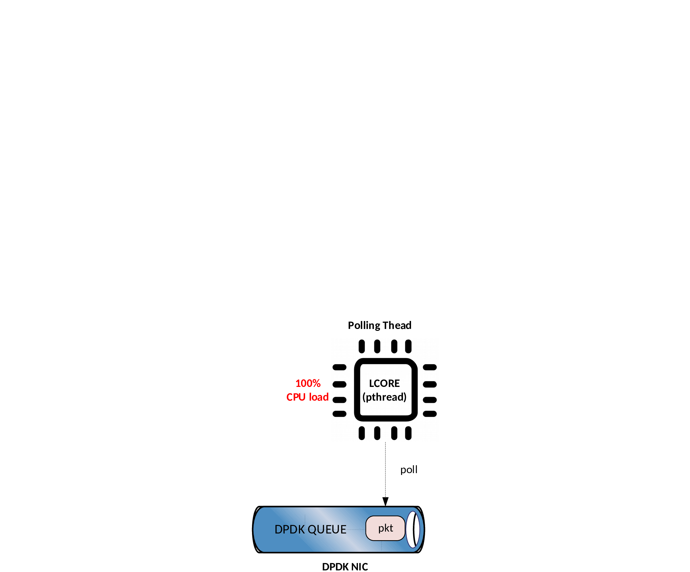]

Using DPDK library API, physical NIC packets will be made available into user space memory in which the DPDK application is running.
So, when DPDK is used there is no user space to kernel space context switching and it saves lots of CPU cycles.
Also, the host memory is using large continuous memory area, the huge pages, which allow large data transfers and avoid high data fragmentation in memory which would require a higher memory management effort at the application level.
Such a fragmentation would also cost some precious CPU cycles.

Hence, most of the CPU cycles of DPDK pinned CPU are used for polling and processing packets delivered by the physical NIC in DPDK queues.
As a result, the packet forwarding task can be processed at a very high speed.
If one CPU is not powerful enough to manage incoming packets that are hitting the physical NIC at a very high rate; we can allocate an additional one to the DPDK application in order to increase its packet processing capacity.

A DPDK application is a multi-thread program that is using DPDK library to process network data.
In order to scale, we can start several packet polling and processing threads (each one pinned on a dedicated CPU) that are running in parallel.

3 main components are involved into a DPDK application:

* Physical NIC
** buffering packets in physical queues
** using DMA to transfer packets in host memory
* DPDK NIC abstraction with its queue representation in huge pages host memory:
** descriptor rings
** mbuf (to store packets)
* Linux pThread use to poll and process packets received in DPDK NIC queues.

ifdef::word[image:../diagrams/extracted-media-chapter2cleaned4adoc.docx/media/image16.emf[image]]
ifndef::word[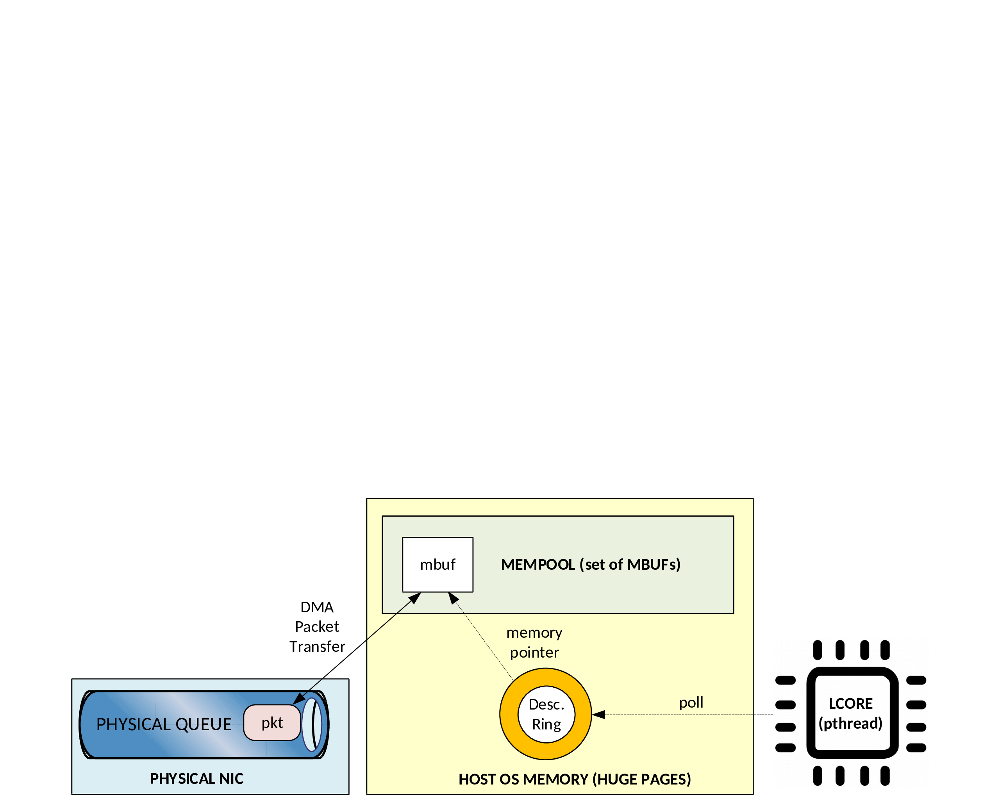]

==== DPDK overview

Data Plane Development Kit (DPDK) is a set of data plane libraries and network interface controller drivers for fast packet processing, currently managed as an open-source project under the Linux Foundation.

The main goal of the DPDK is to provide a simple, complete framework for fast packet processing in data plane applications.

The framework creates a set of libraries for specific environments through the creation of an Environment Abstraction Layer (EAL), which may be specific to a mode of the Intel® architecture (32-bit or 64-bit), Linux* user space compilers or a specific platform.

These environments are created through the use of make files and configuration files.
Once the EAL library is created, the user may link with the library to create their own applications.

The DPDK implements a "run to completion model" for packet processing, where all resources must be allocated prior to calling Data Plane applications, running as execution units on logical processing cores.

The model does not support a scheduler and all devices are accessed by polling.
The primary reason for not using interrupts is the performance overhead imposed by interrupt processing.

For more information please refer to dpdk.org documents http://dpdk.org/doc/guides/prog_guide/index.html

==== DPDK software architecture

DPDK is a set of programing libraries that can be used to create an application that needs to process network packets at a high speed.
DPDK is proposing following functions:

* A queue manager implements lockless queues
* A buffer manager pre-allocates fixed size buffers
* A memory manager allocates pools of objects in memory and uses a ring to store free objects
* Poll mode drivers (PMD) are designed to work without asynchronous notifications, reducing overhead
* A packet framework made up of a set of libraries that are helpers to develop packet processing

In order to reduce Linux user to kernel space context switching all these functions are made available by DPDK into the user space where applications are running.
User applications using DPDK libraries have a direct access to the NIC cards, without passing through a NIC Kernel driver as it is required when DPDK is not used.

[cols=",",]
|====
a|
Regular Network Application

ifdef::word[image:../diagrams/extracted-media-chapter2cleaned4adoc.docx/media/image17.emf[image]]
ifndef::word[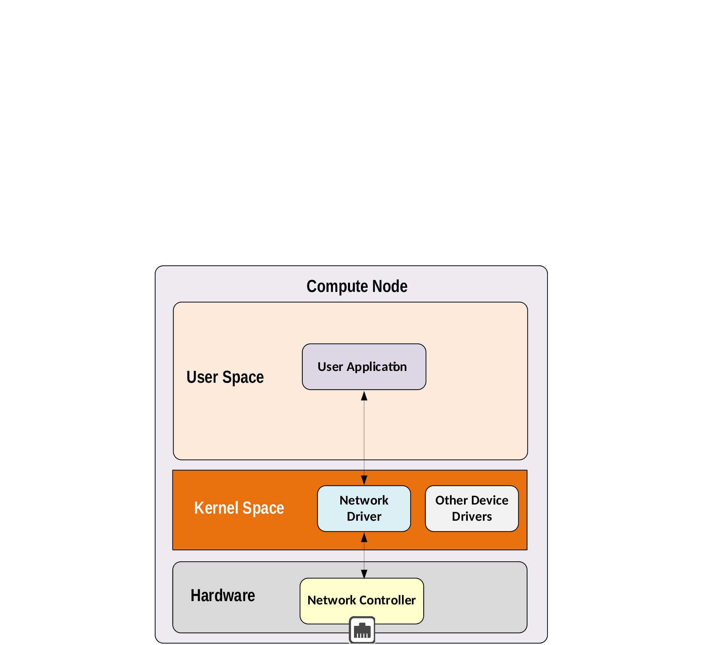]

a|
Network Application with DPDK

ifdef::word[image:../diagrams/extracted-media-chapter2cleaned4adoc.docx/media/image18.emf[image]]
ifndef::word[image:../diagrams/extracted-media-chapter2cleaned4adoc.docx/media/image18.png[image]]

|====

DPDK is allowing to build user-space multi-thread network application using the POSIX thread (pthread) library.

DPDK is a framework which is made of several libraries:

* Environment Abstraction Layer (EAL)
* Ethernet Devices Abstraction (ethdev)
* Queue Management (rte_ring)
* Memory Pool Management (rte_mempool)
* Buffer Management (rte_mbuf)
* Timer Manager (librte_timer)
* Ethernet Poll Mode Driver (PMD)
* Packet Forwarding Algorithm made up of Hash (librte_hash) and Longest Prefix Match (LPM,librte_lpm) libraries
* IP protocol functions (librte_net)

Ethdev library exposes APIs to use the networking functions of DPDK NIC devices.
The bottom half part of ethdev is implemented by NIC PMD drivers.
Thus some features may not be implemented.

Poll Mode ethernet Drivers (PMDs) are a key component for DPDK.
These PMDs by-pass the kernel and are providing a direct access to the Network Interface Cards (NIC) used with DPDK.

Linux user space device enablers (UIO or VFIO) are provided by Linux Kernel and are required to run DPDK.
They are allowing to discover and expose PCI devices information and address space through the `/sys` directory tree.

DPDK libraries are allowing kernel-bypass application development:

* probing for PCI devices (attached via a Linux user space device enabler),
* huge-page memory allocation,
* data structures geared toward polled-mode message-passing applications:
** such as lockless rings
** memory buffer pools with per-core caches.

The diagram below is providing an overview of DPDK libraries.

ifdef::word[image:../diagrams/extracted-media-chapter2cleaned4adoc.docx/media/image19.emf[image]]
ifndef::word[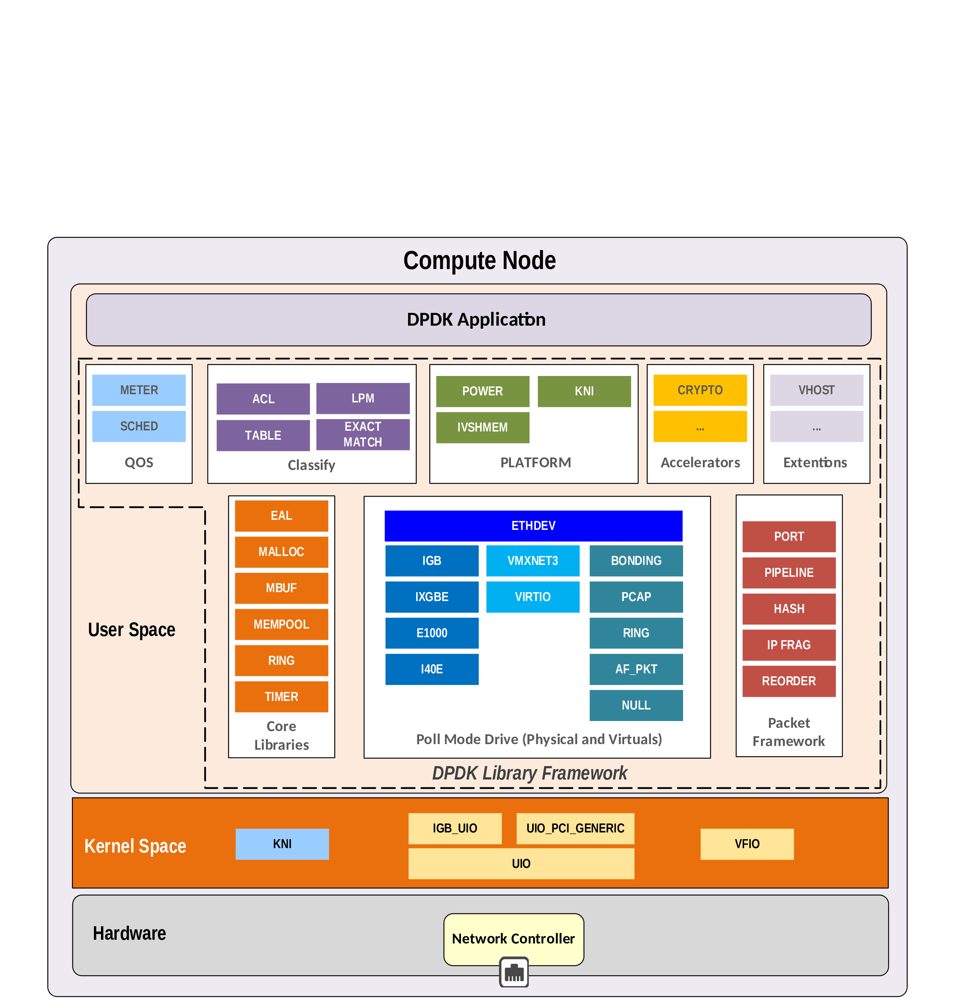]

Only few libraries have been described in this diagram: Set of libraries is enriched at each new DPDK release (cf: https://www.dpdk.org/).

==== DPDK Environment Abstraction Layer

The Environment Abstraction Layer (EAL) is responsible to provide access to low-level resources such as hardware and memory space.
It provides a generic interface that hides the environment specifics from the applications and libraries.
The EAL performs physical memory allocation using mmap() in hugetlbfs (using huge page sizes to increase performance).

Provided services by EAL are:

* DPDK loading and launching
* Support for multi-process and multi-thread execution types
* Core affinity/assignment procedures
* System memory allocation/de-allocation
* Atomic/lock operations
* Time reference
* PCI bus access
* Trace and debug functions
* CPU feature identification
* Interrupt handling
* Alarm operations
* Memory management (malloc)

ifdef::word[image:../diagrams/extracted-media-chapter2cleaned4adoc.docx/media/image20.emf[image]]
ifndef::word[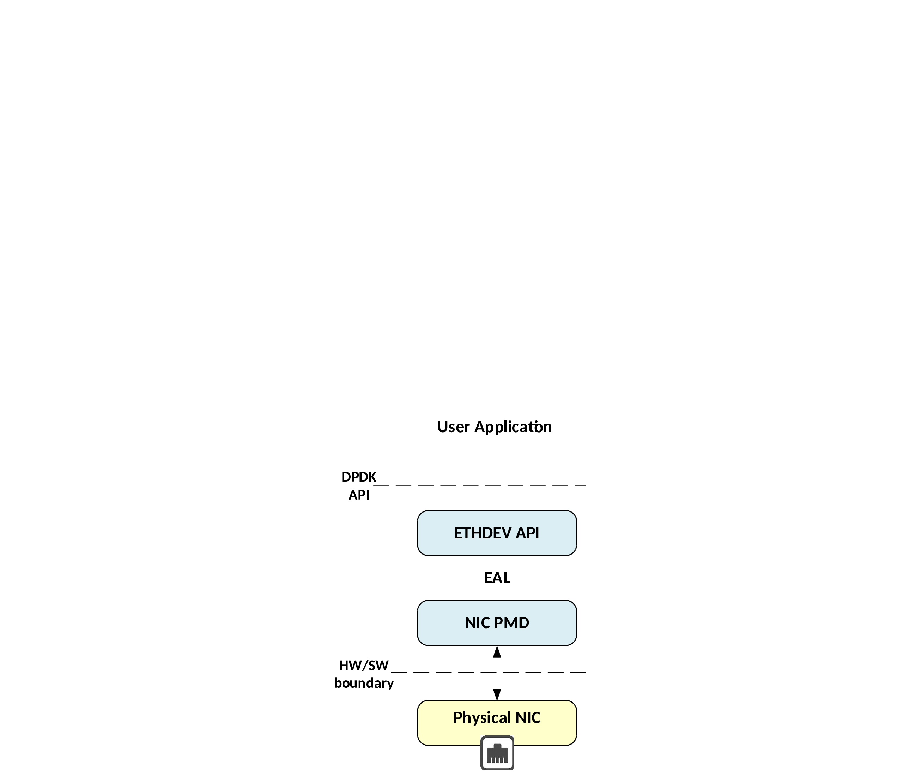]

=== DPDK memory management

==== DPDK optimized memory management for speed

DPDK has a highly optimized memory manager.
DPDK works on a group of fixed size objects called a mempool.
Every one of them are pre-allocated.
DPDK does not encourage dynamic allocations because it consumes a lot of CPU cycles and it is a speed killer.

DPDK stores incoming packets into mbufs (memory buffers). DPDK pre-allocates a set of mbufs and keeps it in a pool called mempool.

DPDK makes use of mempools each time it needs to allocate a mbuf where packets are stored.
Instead of allocating a single mbuf, DPDK do a bulk allocation, or bulk free once packets are consumed.
By doing this, packets to be processed (mbufs) are already in cache memory.
Therefore, DPDK is very cache friendly.

Mempool has further optimizations.
It is very cache friendly.
Everything is aligned to the cache and has a some mbufs allocated for each DPDK thread or lcore.
Each mempool are also bound with rings which are referencing mbufs containing packets stored into mempool.

Each ring is a highly optimized lockless ring.
It can be used by several lcores in a multi-producer/multi-consumer kind of scenario without locks.
By avoiding locks, DPDK gets large performance gains, as data structures locking is also a speed killer.

==== mbufs and mempools

Network Data are stored in compute central memory (in huge page area).

DPDK uses message buffers known as `mbufs` to store packet data into the host memory.
These `mbufs` are stored in memory pools known as `mempools`.

ifdef::word[image:../diagrams/extracted-media-chapter2cleaned4adoc.docx/media/image21.emf[image]]
ifndef::word[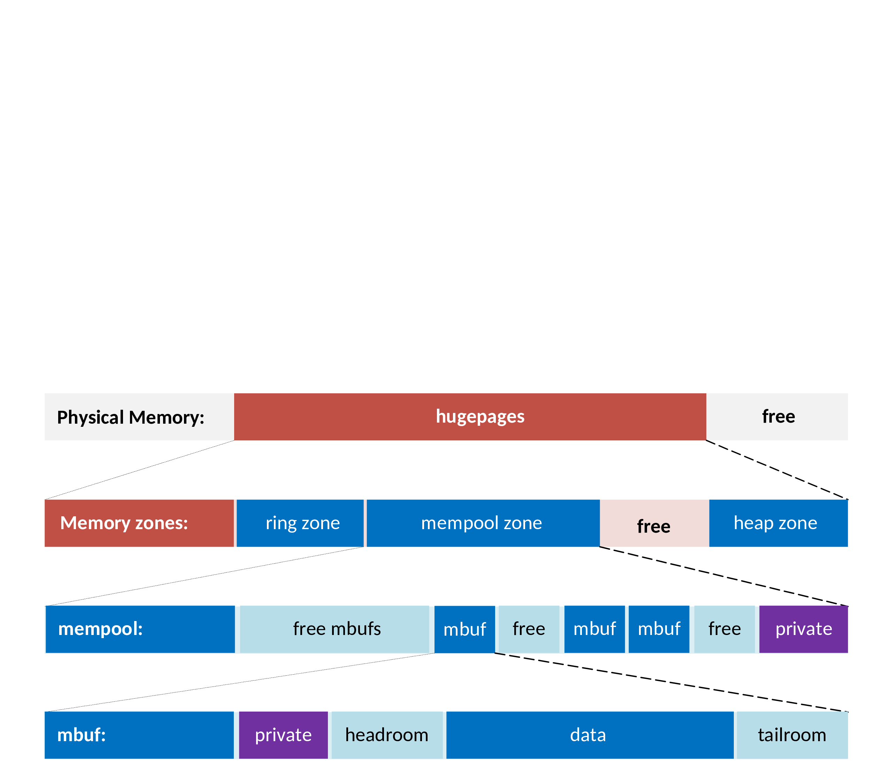]

mbufs are storing DPDK NIC incoming and outgoing packets which have to be processed by the DPDK application.

==== Packet descriptors

DPDK queues are not storing the packets but a pointer onto the real packet.
It avoids performing a data transfer that would be needed when packets have to be forward from a DPDK NIC to another.

ifdef::word[image:../diagrams/extracted-media-chapter2cleaned4adoc.docx/media/image22.emf[image]]
ifndef::word[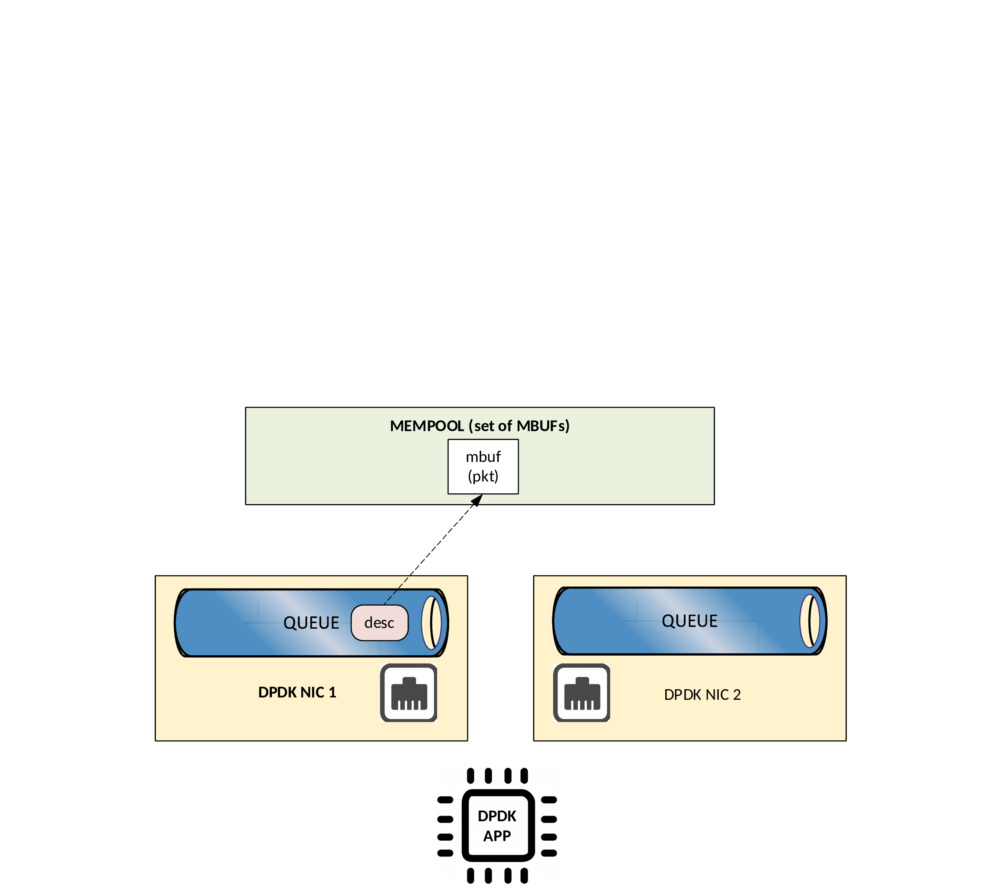]

Packets are not moved from one queue to another, but these are descriptors (pointers) that are moving from one queue to another.

ifdef::word[image:../diagrams/extracted-media-chapter2cleaned4adoc.docx/media/image23.emf[image]]
ifndef::word[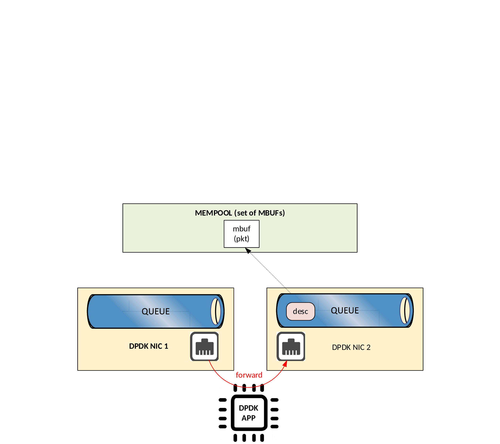]

==== DPDK rings

`Descriptors` are set up as a `ring`. A ring is a circular array of `descriptors.` Each `ring` describes a single direction DPDK NIC queue.
Each DPDK NIC queue is made up of 2 rings (1 per direction: 1 RX ring, 1 TX ring).

ifdef::word[image:../diagrams/extracted-media-chapter2cleaned4adoc.docx/media/image24.emf[image]]
ifndef::word[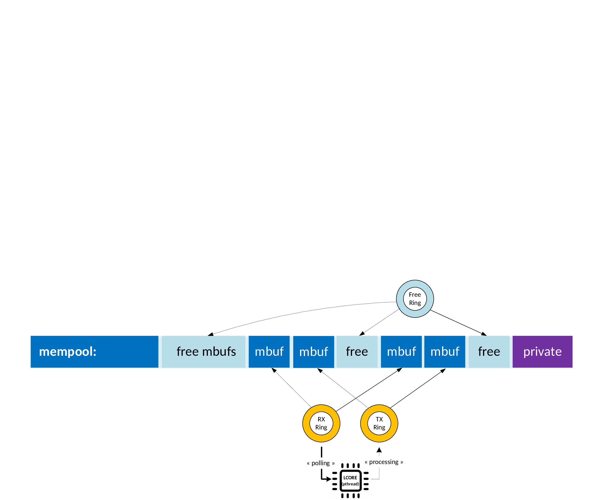]

Each `descriptor` points onto a packet that has been received (RX ring) or that is going to be transmitted (TX ring).

The more descriptors RX/TX rings are containing, the more memory size will be required in each mempool (number of mbufs) to store data.

==== Data Transfer between host NIC and memory

DPDK application is only processing packets that are exposed in user space host OS memory. +
DPDK rings are an abstraction of the real NIC queues: DPDK is using DMA to keep synchronized at anytime between the NIC hardware queues and its DPDK representation in the host memory.

===== Physical NIC incoming packets

When an incoming packet is reaching the physical NIC interface, it is stored in NIC physical queue memory.
RX ring is managing packets that have to be processed by a DPDK application.

Synchronization between the host OS and the NIC happens through two registers, whose content is interpreted as an index in the RX ring:

* Receive Descriptor Head (RDH): indicates the first descriptor prepared by the OS that can be used by the NIC to store the next incoming packet.
* Receive Descriptor Tail (RDT): indicates the position to stop reception, i.e. the first descriptor that is not ready to be used by the NIC.

ifdef::word[image:../diagrams/extracted-media-chapter2cleaned4adoc.docx/media/image25.emf[image]]
ifndef::word[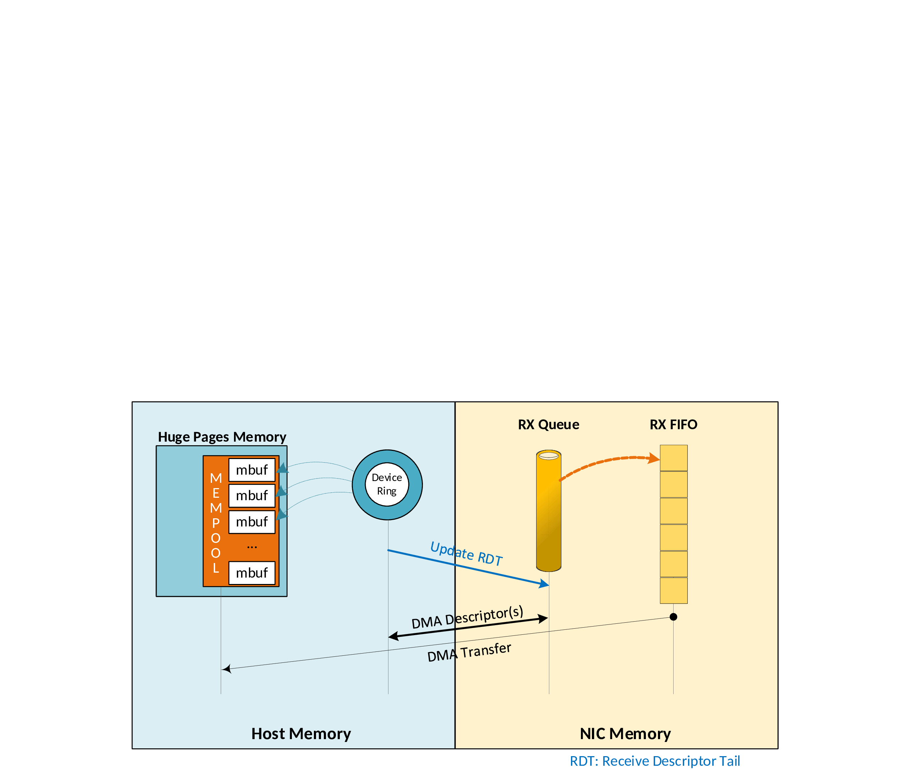]

DMA transfer is copying transparently packets from physical NIC memory to the host central memory.
DMA is using RDT descriptor as destination memory address for the data to be transferred.

Once packets have been transferred into host memory both RX rings and RDT are updated.

===== Physical NIC outgoing packets

When a packet has to be sent from host memory to the physical NIC interface, it is referenced in NIC TX ring by the DPDK application.
TX ring is managing packets that have to be transferred onto a NIC card.

ifdef::word[image:../diagrams/extracted-media-chapter2cleaned4adoc.docx/media/image26.emf[image]]
ifndef::word[]

Synchronization between the host OS and the NIC happens through two registers, whose content is interpreted as an index in the TX ring:

* Transmit Descriptor Head (TDH): indicates the first descriptor that has been prepared by the OS and has to be transmitted on the wire.
* Transmit Descriptor Tail (TDT): indicates the position to stop transmission, i.e. the first descriptor that is not ready to be transmitted, and that will be the next to be prepared.

=== DPDK and packet processing

==== Linux pthreads

Multithreading is the ability of a CPU (single core in a multi-core processor architecture) to provide multiple threads of execution concurrent.
In a multithreaded application, the threads share some CPU resources memory:

* CPU caches
* translation lookaside buffer (TLB)

A single Linux process can contain multiple threads, all of which are executing the same program.
These threads share the same global memory (data and heap segments), but each thread has its own stack (local variables).

Linux pThreads (POSIX threads) is a C library which contains a set functions that are allowing to manage threads into an application.
DPDK is using Linux pThreads library.

==== DPDK lcores

DPDK is using threads that are designed as "lcore”. A “lcore" refers to an EAL thread, which is really a Linux pthread, which is running onto a single processor execution unit.

* first lcore: that executes the main() function and that launches other lcores is named master lcore.
* any lcore: that is not the master lcore is a slave lcore.

Lcores are not sharing CPU units.
Nevertheless, if the host processor supports hyperthreading, a core may include several lcores or threads.

lcores are used to run DPDK application packet processing threads.
Several packet processing models are proposed by DPDK.
The simplest one is the Run-To-Completion model.

ifdef::word[image:../diagrams/extracted-media-chapter2cleaned4adoc.docx/media/image27.emf[image]]
ifndef::word[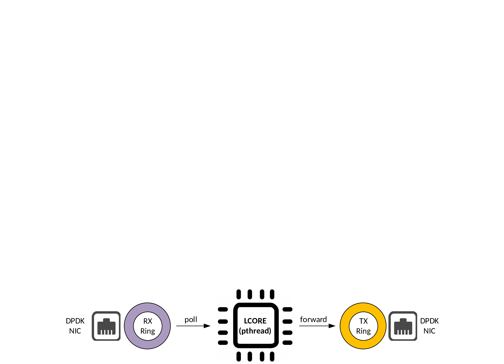]

Run-to-Completion, is using a single thread (lcore) for end to end packet processing (packet polling, processing and forwarding).

==== Multicore Scaling - Pipeline model

A complex application is typically split across multiple cores, with cores communicating through Software queues.

Packet Framework facilitates the creation of pipelines.
Each pipeling thread is assigned to a CPU and is using software queues like output or/and input ports.

ifdef::word[image:../diagrams/extracted-media-chapter2cleaned4adoc.docx/media/image28.emf[image]]
ifndef::word[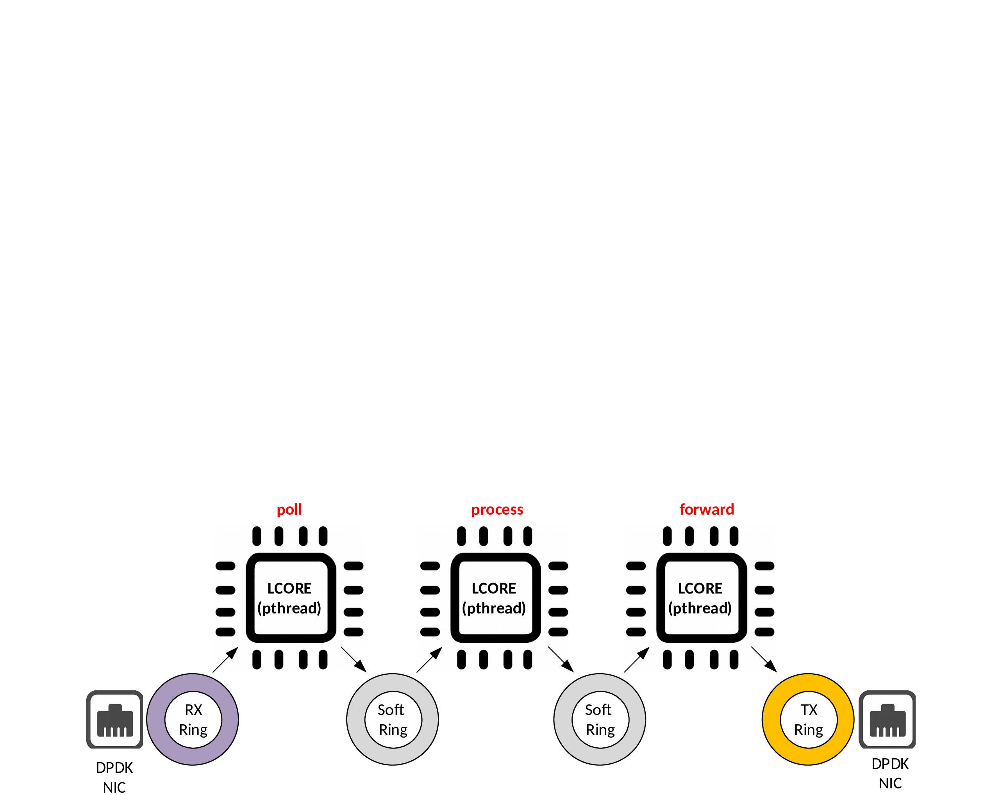]

For instance, Contrail DPDK vRouter is using such a model for GRE encapsulated packet processing.

==== Control Threads

It is possible to create Control Threads.
Those threads can be used for management/infrastructure tasks and are used internally by DPDK for multi process support and interrupt handling.

==== Service Core

DPDK service cores enables a dynamic way of performing work on DPDK lcores.
Service core support is built into the EAL, and an API is provided to optionally allow applications to control how the service cores are used at runtime.

=== DPDK and Poll Mode Drivers (PMD)

When DPDK is used, Network interfaces are no more managed in Kernel space.
Regular Linux NIC driver which is usually used to manage the NIC has to be replaced by a new driver which is able to run into user space.
This new drive, called Poll Mode Driver (PMD) will be used to manage the network interface into user space with the DPDK library.

==== Physical NIC and BAR registers

PCI devices have a set of registers referred to as configuration space for devices.
These configuration space registers are mapped to host memory locations.

When a PCI device is enabled, the system's device drivers (by writing configuration commands to the PCI controller) programs the Base Address Registers (BAR) to inform the PCI device of its address mapping.
Next, the host operating system is able to address this PCI device.

==== Linux NIC drivers

With usual Linux NIC Kernel, both NIC configuration and Packet processing is done in Kernel Space.
User applications which have to establish a TCP connection or send a UDP packet is using the sockets API, exposed by libc library.

[cols=",",]
|====
a|
ifdef::word[image:../diagrams/extracted-media-chapter2cleaned4adoc.docx/media/image29.emf[image]]
ifndef::word[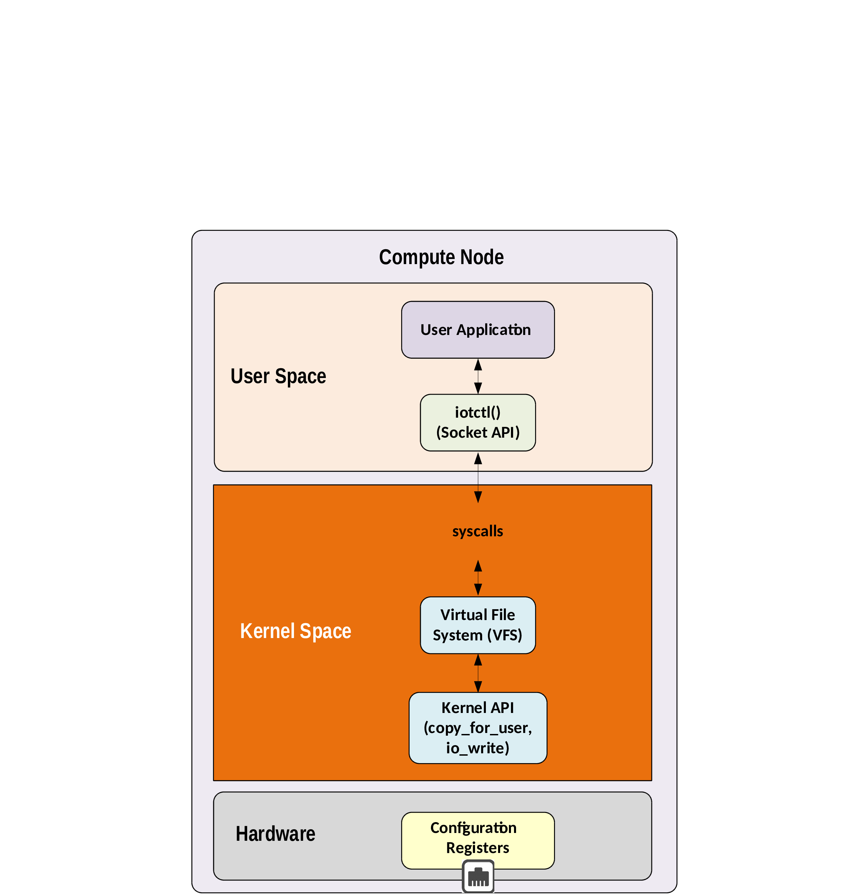]

NIC configuration

a|
ifdef::word[image:../diagrams/extracted-media-chapter2cleaned4adoc.docx/media/image30.emf[image]]
ifndef::word[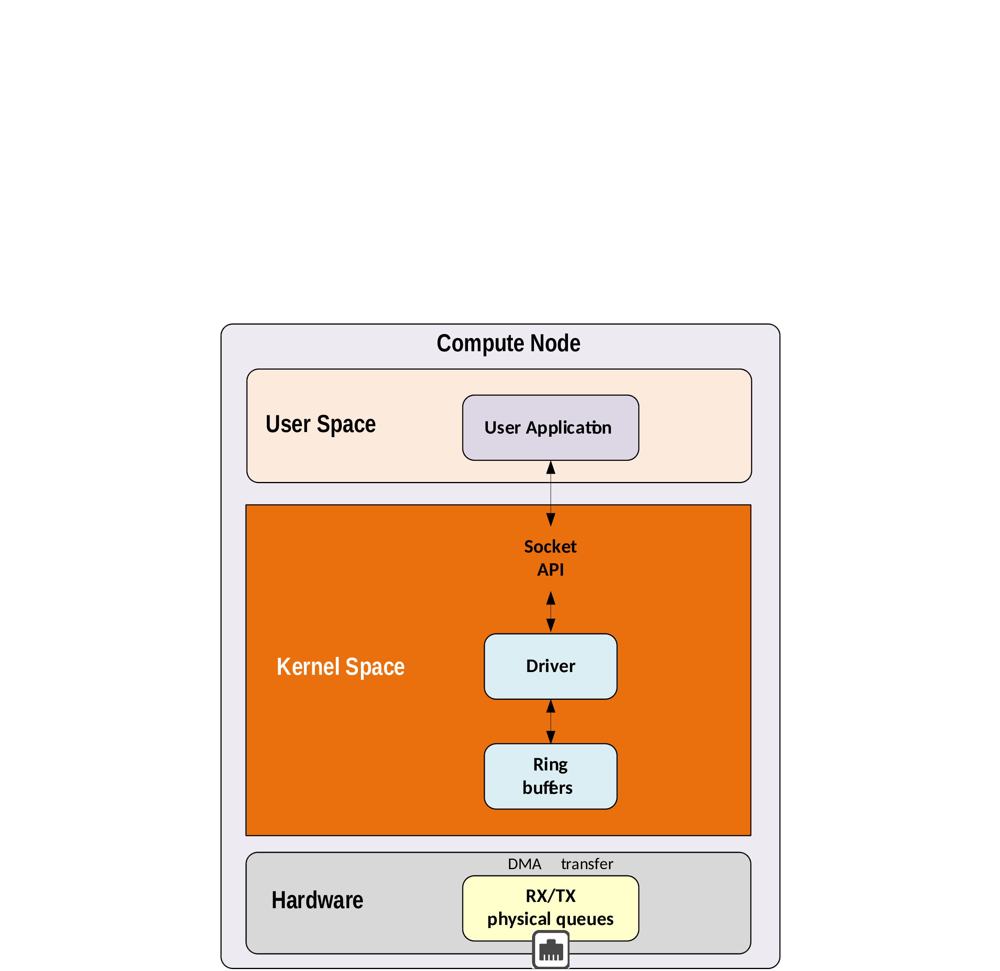]

NIC packet processing

|====

Linux Packet Processing with sockets API is requiring following operations which are costly:

* Kernel Linux System calls
* Multitask context switching on blocking I/O
* Data copying from kernel (ring buffers) to user space
* Interrupt handling in kernel

With usual Linux Drivers most of operations are occurring in Kernel modes and are requiring lots of user space to kernel space context switching and interruption mechanisms.
The heavy context switching usage is costing lots of CPU cycles and is a limiting the numbers of packets that a CPU is able to process.
Such drivers are not able to perform packet processing at expected high speed, especially when 10/40/100G Ethernet generation cards are used on a Linux System.

==== Poll Mode Drivers

A Poll Mode Driver consists of APIs, running in user space, to configure the devices and their respective queues.
In addition, a PMD accesses the RX and TX descriptors directly without any interrupts (with the exception of Link Status Change interrupts) to quickly receive, process and deliver packets in the user’s application.

Poll Mode drivers are involved in NIC configuration.
They are exposing NIC configuration registers into host memory area which is directly reachable from user space.

[cols=",",]
|====
a|
ifdef::word[image:../diagrams/extracted-media-chapter2cleaned4adoc.docx/media/image31.emf[image]]
ifndef::word[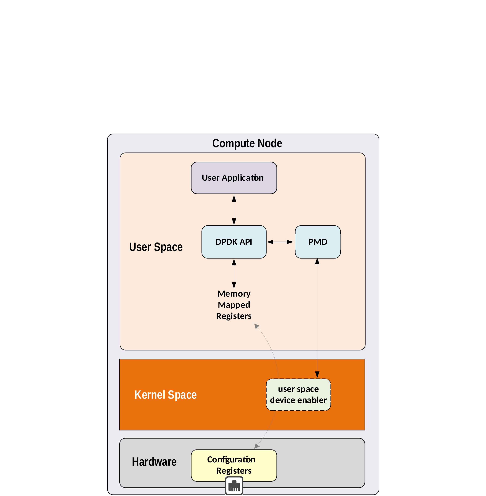]

NIC configuration

a|
ifdef::word[image:../diagrams/extracted-media-chapter2cleaned4adoc.docx/media/image32.emf[image]]
ifndef::word[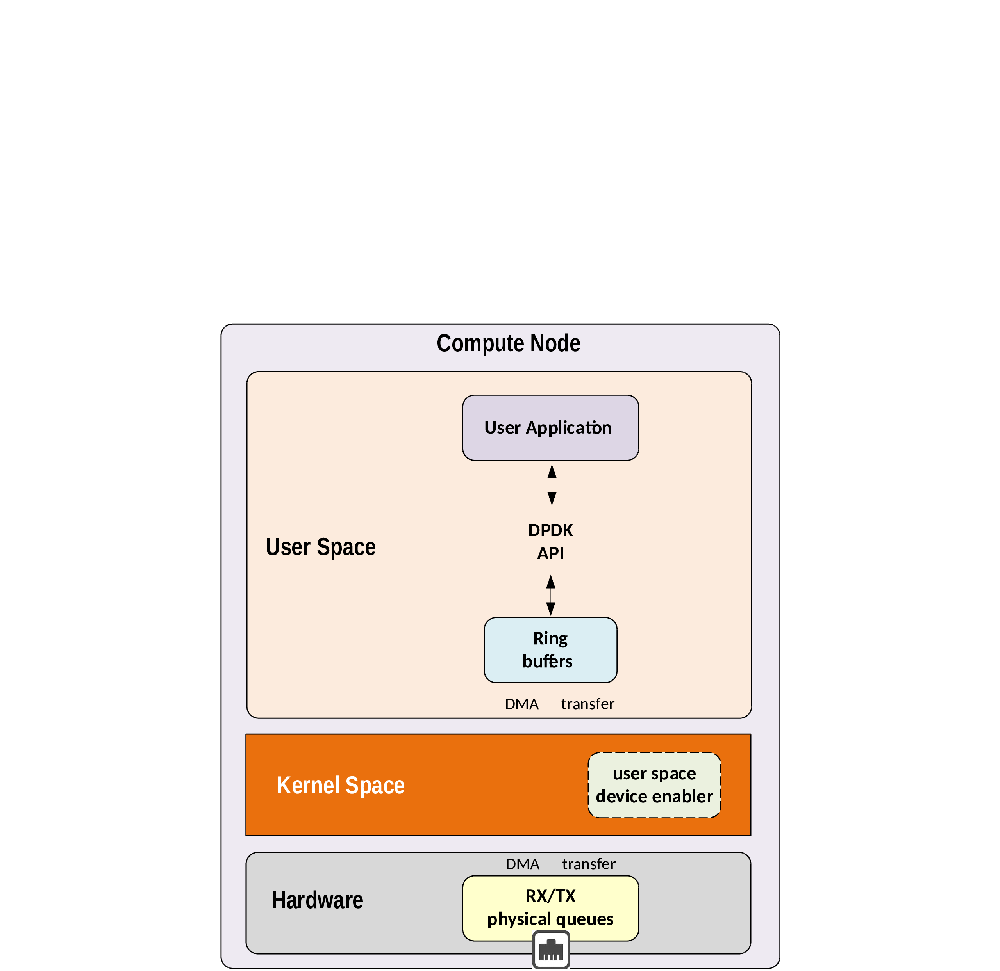]

NIC packet processing

|====

In short, Poll Mode Drivers are user space pthreads which:

* call specific EAL functions
* have a per NIC implementation
* have direct access to RX/TX descriptors
* use Linux user space device enablers (UIO or VFIO) driver for specific control changes (interrupts configuration)

Hence user applications can configure directly the NIC cards they are using from Linux user space where they are running.

A first configuration phase is using Poll Mode Drivers and DPDK library to configure DPDK rings buffers into Linux user space.
Next, incoming packets will be automatically transferred with DMA (Direct Memory Access) mechanism from NIC physical RX queues in NIC memory to DPDK RX rings buffer in host memory.
DMA (Direct Memory Access) is also used to transfer outgoing packets from DPDK TX rings buffer in host memory to NIC physical TX queues in NIC memory.
DMA offloads expensive memory operations, such as large copies or scatter-gather operations, from the CPU.

==== Direct Memory Access (DMA)

Direct Memory Access (DMA) allows PCI devices to read (write) data from (to) memory without CPU intervention.
This is a fundamental requirement for high performance devices.

DMA is a mechanism that is using a specific hardware controller to manage read and write operations into the main system memory (RAM: Random Access Memory). This mechanism is totally independent of the central processing unit (CPU) and does not consume any CPU resource.
A DMA transfer is used to manage data transfer.
DMA transfer is triggered by the CPU and is working in background using the specific hardware resource (DMA controller).

DPDK rings and NIC buffers are synchronized with DMA.
Thanks to this synchronization mechanism, DPDK application can access transparently to NIC packets in user space reading or writing data in DPDK rings.

==== IOMMU

Input–Output Memory Management Unit (IOMMU) is a memory management unit (MMU) that connects a Direct Memory Access (DMA) capable I/O bus to the main memory.

In Virtualization, an IOMMU is re-mapping the addresses accessed by the hardware into a similar translation table that is used to map guest virtual machine address memory to host-physical addresses memory.

ifdef::word[image:../diagrams/extracted-media-chapter2cleaned4adoc.docx/media/image33.emf[image]]
ifndef::word[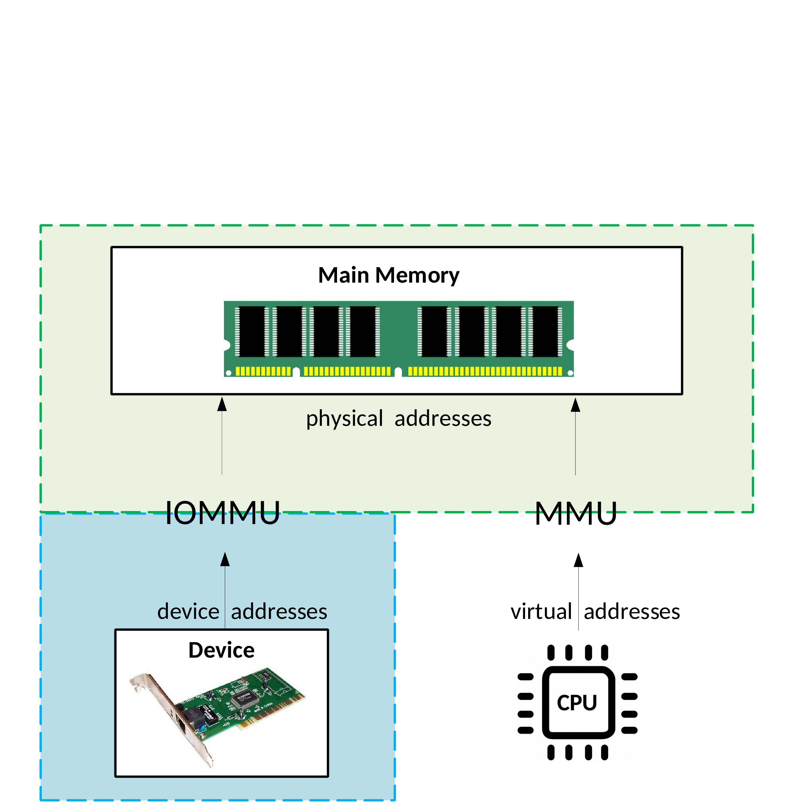]

IOMMU provides a short path for device to get access only to a well scoped physical device memory area which corresponds to a given guest virtual machine memory.
IOMMU helps to prevent DMA attacks that could be originated by malicious devices.
IOMMU provides DMA and interrupt remapping facilities to ensure I/O devices behave within the boundaries they've been allotted.

Intel has published a specification for IOMMU technology as Virtualization Technology for Directed I/O, abbreviated as VT-d.

In order to get IOMMU enabled:

* both kernel and BIOS must support and be configured to use IO virtualization (such as Intel® VT-d).
* IOMMU must be enabled into Linux Kernel parameters in `/``etc``/default/grub` and run `update-grub` command.

GRUB configuration example with IOMMU Passthrough enabled:

[cols="",]
|====
|GRUB_CMDLINE_LINUX_DEFAULT="iommu=pt intel_iommu=on"
|====

==== DPDK supported NICs

DPDK Library includes Poll Mode Drivers (PMDs) for physical and emulated Ethernet controllers which are designed to work without asynchronous, interrupt-based signaling mechanisms.

* Available DPDK PMD for physical NIC:
** I40e PMD for Intel X710/XL710/X722 10/40 Gbps family of adapters http://dpdk.org/doc/guides/nics/i40e.html
** IXGBE PMD http://dpdk.org/doc/guides/nics/ixgbe.html
** Linux bonding PMD http://dpdk.org/doc/guides/prog_guide/link_bonding_poll_mode_drv_lib.html
* Available DPDK PMD for Emulated NIC:
** DPDK EM poll mode driver supports emulated Intel 82540EM Gigabit Ethernet Controller (qemu e1000 device): +
http://doc.dpdk.org/guides/nics/e1000em.html
** Virtio Poll Mode driver for emulated VirtIO NIC +
http://dpdk.org/doc/guides/nics/virtio.html
** VMXNET3 NIC when VMWare hypervisors are used: +
http://doc.dpdk.org/guides/nics/vmxnet3.html

Lots of other NIC are supported by DPDK (cf http://doc.dpdk.org/guides/nics/overview.html).

Different PMDs may require different kernel drivers in order to work properly (cf Linux User space device enablers). Depending on the PMD being used, a corresponding kernel driver should be loaded and bound to the network ports.

This is also preferable that each NIC has been flashed with the latest version of NVM/firmware.

=== Linux user space device enablers

Most of PMD are using generic user space device enablers to expose physical NIC registers in user space into the host memory.
Two space device enablers are widely used by DPDK PMD they are UIO and VFIO.

==== UIO - User Space IO

Linux kernel version 2.6 introduced the User Space IO (UIO) loadable module.
UIO is a kernel-bypass mechanism which provides an API that enables user space handling of legacy interrupts (INTx).

UIO has some limitations:

* UIO does not manage message-signaled interrupts (MSI or MSI-X).
* UIO also does not support DMA isolation through IOMMU.

UIO only supports legacy interrupts so it is not usable with SR-IOV and virtual hosts which require MSI/MSI-X interrupts.

Despite these limitations, UIO is well suited for use in virtual machines, where direct IOMMU access is not available.
In such a situation, a guest instance user space process is not isolated from other processes in the same instance.
But the hypervisor can isolate any guest instance from others or hypervisor host processes using IOMMU.

Currently, two UIO modules are supported by DPDK:

* Linux Generic (uio_pci_generic), which is the standard proposed UIO module included in the Linux kernel.
* DPDK specific (igb_uio) which must be compiled with the same kernel as the one running on the target.

DPDK specific UIO Kernel module is loaded with insmod command after UIO module has been loaded:

    $ sudo modprobe uio
    $ sudo insmod kmod/igb_uio.ko

While a single command is needed to load Linux Generic UIO module:

    $ sudo modprobe uio_pci_generic

DPDK specific UIO module could be preferred in some situation to Linux Generic UIO module (cf: https://doc.dpdk.org/guides/linux_gsg/linux_drivers.html)

==== VFIO – Virtual Function I/O

Virtual Function I/O (VFIO) kernel infrastructure was introduced in Linux version 3.6.

VFIO provides a user space driver development framework allowing user space applications to interact directly with hardware devices by mapping the I/O space directly to the application’s memory.

VFIO is a framework for building user space drivers that provides:

* Mapping of device’s configuration and I/O memory regions to user memory
* DMA and interrupt remapping and isolation based on IOMMU groups.
* Eventfd and irqfd based signaling mechanism to support events and interrupts from and to the user space application.

VFIO exposes APIs which allow to:

* create character devices (in /dev/vfio/)
* support ioctl calls
* support mechanisms for describing and registering interrupt notification.

VFIO driver is an IOMMU/device agnostic framework for exposing direct device access to user space, in a secure, IOMMU protected environment.
For bare-metal environments, VFIO is the preferred framework for Linux kernel-bypass.
It operates with the Linux kernel's IO.

ifdef::word[image:../diagrams/extracted-media-chapter2cleaned4adoc.docx/media/image34.emf[image]]
ifndef::word[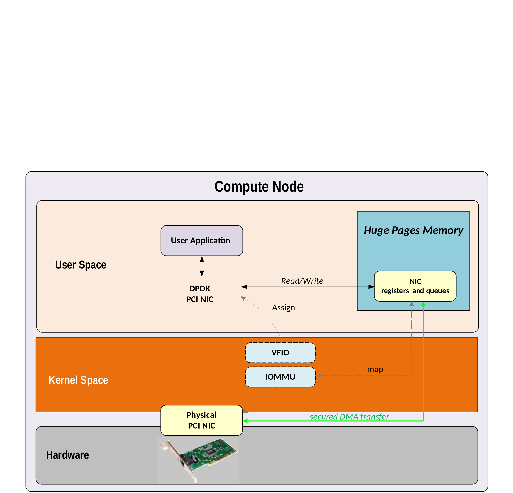]

MMU subsystem is used to place devices into IOMMU groups.
User space processes can open these IOMMU groups and register memory with the IOMMU for DMA access using VFIO ioctl calls.
VFIO also provides the ability to allocate and manage message-signaled interrupt vectors.

A single command is needed to load VFIO module:

    $ sudo modprobe vfio_pci

Despite VFIO has been created to work with IOMMU, VFIO can be also be used without (this is just as unsafe as using UIO).

==== Linux user space device enablers to be used

VFIO is generally the preferred Linux user space device enabler to be used because it supports IOMMU to protect host memory.
When a real hardware PCI device is attached to host system and IOMMU is used with VFIO, all the reads/writes of that device done in user space by the DPDK application will be protected by the host IOMMU.

But there some is few exceptions.
Below is Intel recommendation for the choice of the Kernel driver to be used with DPDK:

image:../diagrams/extracted-media-chapter2cleaned4adoc.docx/media/image35.png[Generic P C I kernel driver ,width=605,height=480]

https://software.intel.com/content/www/us/en/develop/articles/memory-in-dpdk-part-2-deep-dive-into-iova.html

=== DPDK and Host Hardware architecture

==== NUMA

NUMA means Non-Uniform Memory Access systems

A traditional server has a single CPU, a single RAM and a single RAM controller.

A RAM can be made of several DIMM banks in several sockets, all being associated to the CPU.
When the CPU needs access to data in RAM, it requests it to its RAM controller.

Recent servers can have multiple CPUs, each one having its own RAM and its own RAM controller.
Such systems are called NUMA systems, or Non-Uniform Memory Access.
For example, in a server with 2 CPUs, each one can be a separate NUMA: NUMA0 and NUMA1.

ifdef::word[image:../diagrams/extracted-media-chapter2cleaned4adoc.docx/media/image36.emf[image]]
ifndef::word[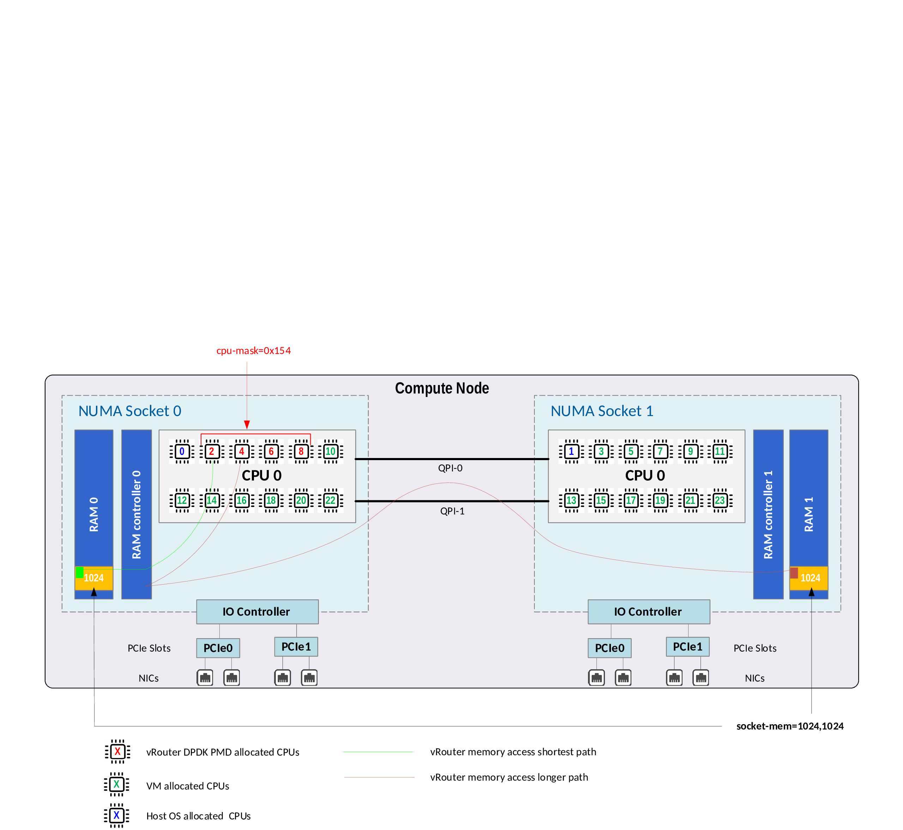]

NUMA nodes architecture.

* In green: CPU core accessing a memory item located in its own NUMA’s RAM controller, showing minimum latency.
* In red: CPU core accessing a memory item located in the other NUMA through the QPI (Quick Path Interconnect) path and the remote RAM controller, showing a higher latency.

When CPU0 needs to access data located in RAM0, it will go through its local RAM controller 0. Same thing happens for CPU1.

When CPU0 needs to access data located in the other RAM1, the first (local) controller 0 has to go through the second (or remote) RAM controller 1 which will access the (remote) data in RAM 1. Data will use an internal connection between the 2 CPUs called QPI, or Quick Path Interconnect, which is typically of a high enough capacity to avoid being a bottleneck, typically 1 or 2 times 25GBps (400 Gbps). For example, the Intel Xeon E5 has 2 CPUs with 2 QPI links between them; Intel Xeon E7 has 4 CPUs, with a single QPI between pairs of CPUs.

The fastest RAM that the CPU has access to is the register, which is inside the CPU and reserved to it.

Beyond the register, the CPU has access to cached memory, which is a special memory based on higher performance hardware.

image:../diagrams/extracted-media-chapter2cleaned4adoc.docx/media/image37.png[image,width=405,height=346]

Cached memories are shared between the cores of a single CPU.
Typical characteristics of memory cache are:

* Accessing a Level 1 cache takes 7 CPU cycles (with a size of 64KB or 128KB).
* Accessing a Level 2 cache takes 11 CPU cycles (with a size of 1MB).
* Accessing a Level 3 cache takes 30 CPU cycles (with a larger size).

If the CPU needs to access data that is in the main RAM, it has to use its RAM controller.

Access to RAM takes typically 170 CPU cycles (the green line in the diagram). Access to the remote RAM through the remote RAM controller typically adds 200 cycles (the red line in the diagram), meaning RAM latency is roughly doubled.

When data needed by the CPU is located both in the local and in the remote RAM with no particular structure, latency to access data can be unpredictable and unstable.

==== Hyper-threading (HT)

A single physical CPU core with hyper-threading appears as two logical CPUs to an operating system.

While the operating system sees two CPUs for each core, the actual CPU hardware only has a single set of execution resources for each core.

Hyper-threading allows the two logical CPU cores to share physical execution resources.

The sharing of resources allows two logical processors to work with each other more efficiently and allows a logical processor to borrow resources from a stalled logical core (assuming both logical cores are associated with the same physical core). Hyper-threading can help speed processing up, but it’s nowhere near as good as having actual additional cores.

==== Huge pages

Memory is managed in blocks known as pages.
On most systems, a page is 4KB.
1MB of memory is equal to 256 pages; 1GB of memory is 256,000 pages, etc.
CPUs have a built-in memory management unit that manages a list of these pages in hardware.

image:../diagrams/extracted-media-chapter2cleaned4adoc.docx/media/image38.png[image,width=560,height=131]

The Translation Lookaside Buffer (TLB) is a small hardware cache of virtual-to-physical page mappings.
If the virtual address passed in a hardware instruction can be found in the TLB, the mapping can be determined quickly.
If not, a `TLB miss` occurs, and the system falls back to slower, software-based address translation.
This results in performance issues.
Since the size of the TLB is fixed, the only way to reduce the chance of a TLB miss is to increase the page size.

image:../diagrams/extracted-media-chapter2cleaned4adoc.docx/media/image39.png[image,width=560,height=303]

Virtual memory address lookup slows down when the number of entries increases.

A huge page is a memory page that is larger than 4Ki.
In x86_64 architecture, in addition to standard 4KB memory page size, two larger page sizes are available: 2MB and 1GB.

Contrail DPDK vrouter can use both or only one huge page size.

==== CPU isolation and pining

An Operating System is using a scheduler to place each single process and/or threads it has to run onto one CPUs offered by a host.

There are two kinds of scheduling, cooperative and preemptive.
By default, Linux scheduler is using a cooperative mode.

In order to get a CPU booked for a subset of tasks, we have to inform the Operating System scheduler not to use these CPUs for all the tasks it has to run.

These CPUs are told: "isolated" because they are no more used by the OS to process all tasks.
In order to get a CPU isolated several mechanisms can be used:

- remove this CPU from the "common" CPU list used to process all tasks
* change the scheduling algorithm (cooperative to preemptive)
* participate or not to interrupt processing

Isolation and pinning are two complementary mechanisms that are proposed by Linux OS:

* CPU isolation restricts the set of CPUs that are available for Operating System Scheduler level.
When a CPU is isolated, no task will be scheduled on it by the Operating System.
An explicit task assignment must be done.
* CPU pinning is also called processor affinity.
It enables the binding and unbinding of process or a thread onto a CPU. +
On the opposite, CPU pinning is a mechanism that consists in defining a limited set of CPUs that are allowed to be used by:
** the OS Scheduler.
Operating System CPU affinity is managed through systemd.
** a specific process: using CPU pinning rules (taskset command for instance)

Tasks to be run by an operating system must be spread across available CPUs.
These tasks in a multi-threading environment are often made of several processes which are also made of several threads.

==== CPU isolation mechanisms

===== isolcpus

isolcpus is a Kernel scheduler option.
When a CPUs is specified in isolcpus list, it is removed from the general kernel SMP balancing and scheduler algorithms.
The only way to move a process onto or off an "isolated" CPU is via the CPU affinity syscalls (or to use the taskset command).

This isolation mechanism:

* remove isolated CPUs from the "common" CPU list used to process all tasks
* change the scheduling algorithm from cooperative to preemptive
* perform CPU isolation at the system boot

isolcpus is suffering of lots of drawbacks; that are:

* it requires manual placement of processes on isolated cpus.
* it is not possible to rearrange the CPU isolation rules after the system startup
* the only way to change isolated CPU list is by rebooting with a different isolcpus value in the boot loader configuration (GRUB for instance).
* isolcpus is disabling the scheduler load balancer for isolated CPUs.
It also means the kernel will not balance those tasks equally among all the CPUs sharing the same isolated CPUs (having the same affinity mask)

===== CPU shield

cgroups subsystem is proposing a mechanism to dedicate some CPUs to one or several user processes.
It consists in defining a "user shield" group which is protecting a subset of CPU system tasks.

3 cpusets are defined:

* root: present in all configurations and contains all cpus (unshielded)
* system: contains cpus used for system tasks - the ones which need to run but aren't "important" (unshielded)
* user: contains cpus used for tasks we want to assign a set of CPU for their exclusive use (shielded)

CPU shield are manipulated with cset shield command.

===== Tuned

Tuned is a system tuning service for Linux.
Tuned is using Tuned profiles to describe Linux OS performance tuning configuration.

The cpu-partitioning profile partitions the system CPUs into isolated and housekeeping CPUs.
This profile is intended to be used for latency-sensitive workloads.

PS: Tuned is only supported on Linux RedHat OS family.

Cf: https://tuned-project.org/

==== Linux systemd - System task CPU affinity

A thread's CPU affinity mask determines the set of CPUs on which it is eligible to run.

Linux systemd is a software suite that provides an array of system components for Linux operating systems.
Its primary component is an init system used to bootstrap user space and manage user processes.

CPUAffinity parameter restricts all processes spawned by systemd to the list of cores defined by the affinity mask.

===== default CPU affinity

When run as a system instance, systemd interprets the configuration file /etc/systemd/system.conf.
In this configuration file CPUAffinity variable configures the CPU affinity for the service manager as well as the default CPU affinity for all forked off processes.

===== Per service specific CPU affinity

Individual services may override the CPU affinity for their processes with the CPUAffinity setting in unit files

    # vi /etc/systemd/system/<my service>.service
    ...
    [Service]
    CPUAffinity=<CPU mask>

If a specific CPUAffinity has been defined for a given service, it has to be restarted in order for the new configuration file to be taken into consideration.

==== CPU assignment for user processes (taskset)

taskset is used to set or retrieve the CPU affinity of a running process given its PID or to launch a new COMMAND with a given CPU affinity.

We can retrieve the CPU affinity of an existing task:

    # taskset -p pid

Or set it:

    # taskset -p mask pid

=== Bind a virtual NIC to DPDK

DPDK requires a direct NIC access into user space.
VirtIO vhost-user backend is exposing the virtio network device in user space.

vhost-user is a library that implements the vhost protocol in user space.
Vhost-user library allows to expose a VirtIO backend interface into user space.

vhost-user library defines the structure of messages that are sent over a unix socket to communicate with the VirtIO net device backend (vhost-net kernel driver is using ioctls instead)

ifdef::word[image:../diagrams/extracted-media-chapter2cleaned4adoc.docx/media/image40.emf[image]]
ifndef::word[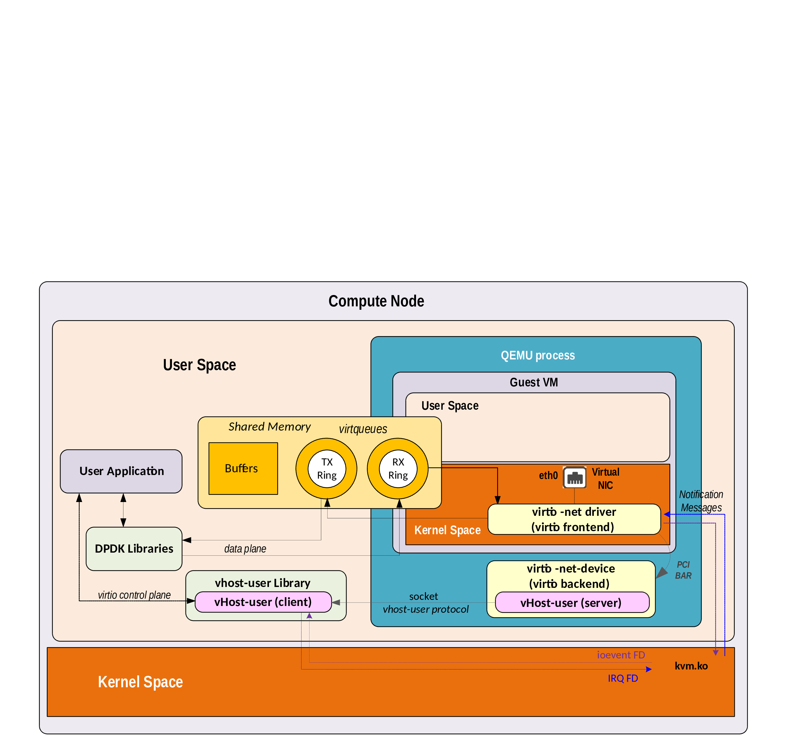]

Kernel Mode Virtual Machine connected to a DPDK compute application

User application is using both:

* vhost user library: for emulated PCI NIC control plane
* DPDK libraries: for emulated PCI NIC data plane

Support for user space vhost has been provided with QEMU 2.1 and above.

=== Run DPDK in a guest VM

==== Virtual IOMMU

Virtual IOMMU (vIOMMU) is allowing to emulate IOMMU for guest VMs.

vIOMMU has the following characteristics:

* translates guest virtual machine I/O Virtual Addresses (IOVA) to guest Physical Addresses (GPA)
* Guest virtual machine Physical Addresses (GPA) are translated to Host Virtual Addresses (HVA) through the hypervisor memory management system.
* performs device isolation.
* implements a I/O TLB (Translation Lookaside Buffer) API which exposes memory mappings

In order to get a virtual device working with a virtual IOMMU we have to:

* create the needed IOVA mappings into the vIOMMU
* configure the device’s DMA with the IOVA

Following mechanisms can be used to create vIOMMU memory mappings:

* Linux Kernel’s DMA API for kernel drivers
* VFIO for user space drivers

ifdef::word[image:../diagrams/extracted-media-chapter2cleaned4adoc.docx/media/image41.emf[image]]
ifndef::word[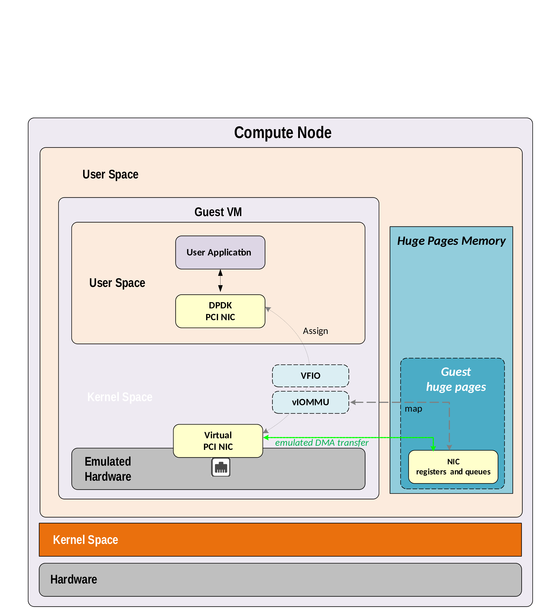]

The integration between the virtual IOMMU and any user space network application like DPDK is usually done through the VFIO driver.
This driver will perform device isolation and automatically add the memory (IOVA -to GPA) mappings to the virtual IOMMU.

The use of hugepages memory in DPDK contributes to optimize TLB lookups, since a fewer number of memory pages can cover the same amount of memory.
Consequently, the number of Device TLB synchronization messages drop dramatically.
Hence, the performance penalty TLB lookups is lowered.

Cf: https://www.redhat.com/en/blog/journey-vhost-users-realm

https://wiki.qemu.org/Features/VT-d

==== Virtio Poll Mode Driver

Virtio-pmd driver, is a DPDK driver, built on the Poll Mode Driver abstraction, that implements the virtio protocol.

ifdef::word[image:../diagrams/extracted-media-chapter2cleaned4adoc.docx/media/image42.emf[image]]
ifndef::word[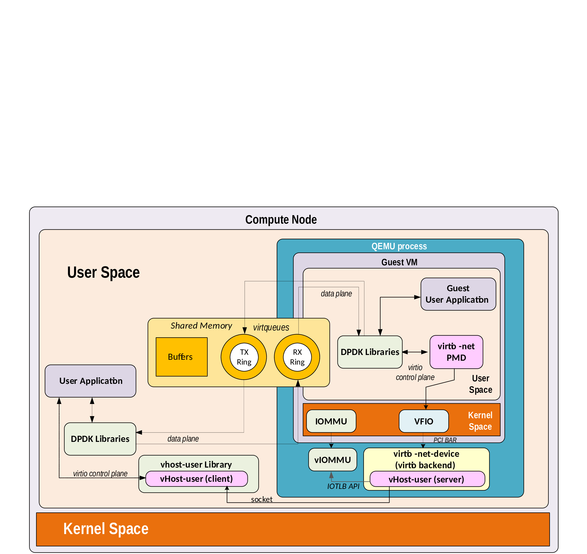]

Vhost user protocol moves the virtio ring from kernel all the way to userspace.
The ring is shared between the guest and DPDK application.
QEMU sets up this ring as a control plane using unix sockets.

If the both the host server guest virtual machine are DPDK there are no VMExits in the host for guest packets processing.
Guest virtual machine uses virtio-net PMD driver and performs packets polling.
So. There is nothing running in kernel here, so there are no system calls.
Since both system calls and VM Exits are avoided, the performance boosts significantly.
It will be an order higher.

==== Physical Network Device Assignment (VFIO) and PCI passthrough

When a DPDK application is running into a guest Virtual Machine, a mechanism has to be used to expose one of the host physical NIC to this guest in order it gets access to the physical network.

IOMMU protects host memory against malicious or bug writes which can corrupt host memory at any time.
But, when a physical device is assigned to a guest virtual machine without vIOMMU usage, the guest memory address space is totally exposed to the hardware PCI device.

ifdef::word[image:../diagrams/extracted-media-chapter2cleaned4adoc.docx/media/image43.emf[image]]
ifndef::word[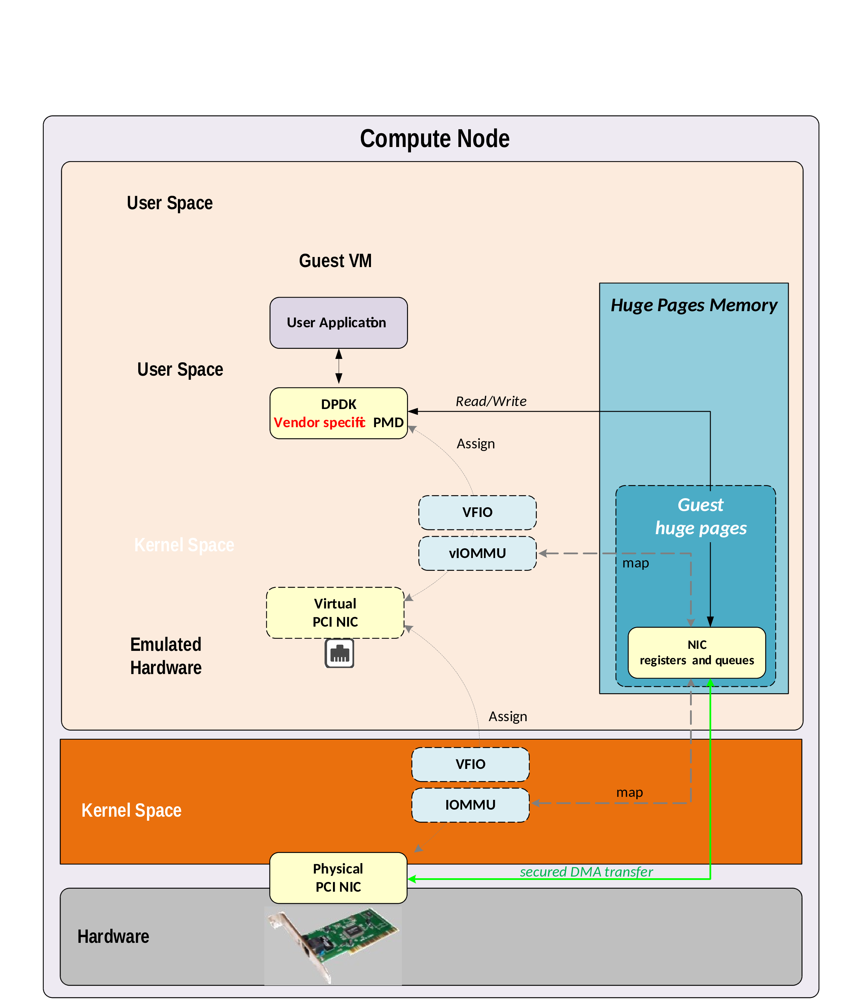]

A PCI device can be assigned to a guest in order to be used by a guest DPDK application.
By leveraging VFIO driver in the host kernel we provide a direct access to an assigned physical NIC from this guest protected with IOMMU.

Next, by leveraging VFIO driver in the guest kernel we provide a direct access to the assigned physical from this guest user space.
vIOMMU is providing a secure mechanism to manage DMA transfer between an assigned physical hardware and hosted guest virtual instance memory area.

==== SRIOV and DPDK in Guest VM

This use case is almost the same as PCI passthrough.
VFIO and IOMMU are used to expose a SRIOV virtual function directly to a guest VM.

An additional Physical function driver which is vendor specific is used to manage the virtual function creation on the physical NIC.
This driver is used by a Virtual Machine Manager (like libvirt) to create the virtual function before the virtual instance is spawned.

ifdef::word[image:../diagrams/extracted-media-chapter2cleaned4adoc.docx/media/image44.emf[image]]
ifndef::word[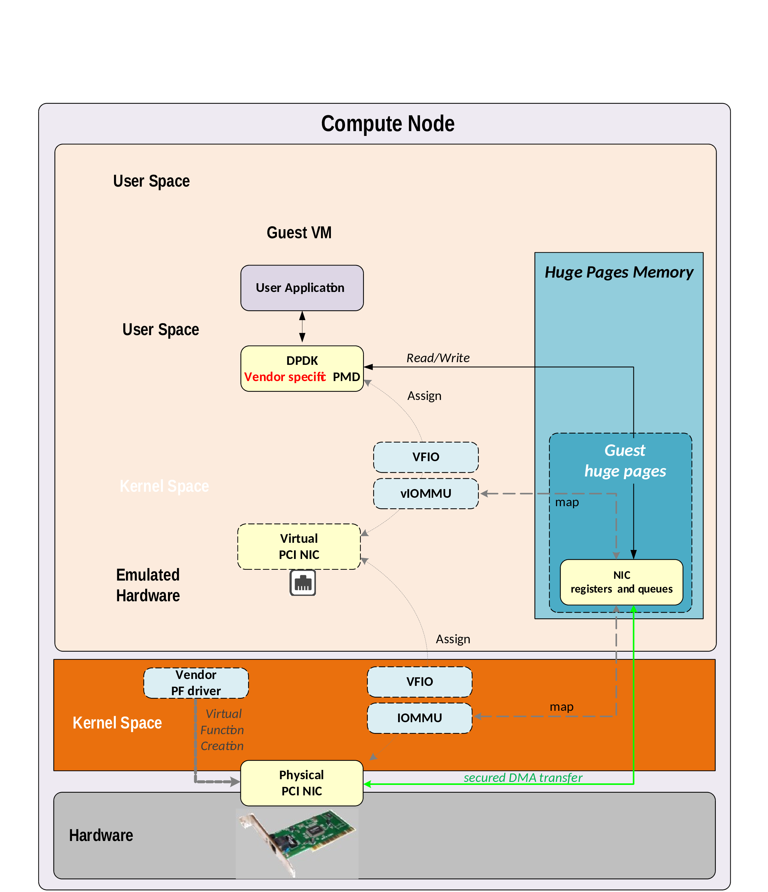]

Physical incoming packets are directly copied in guest memory without involving the host server.
SR-IOV only allow to share a physical NIC between several guests but does not change the packet processing path provided by PCI passthrough.

=== VirtIO assisted Hardware acceleration

With DPDK and VirtIO we have a technology that is allowing to get network virtualization at a high speed.
This is a key technology for SDN dataplane.

But this packet processing model has still some drawbacks:

* DPDK is requiring isolating some host CPUs for its exclusive need.
These is some less CPU resources for the user application
* Compute CPU are generic and are not optimized for packet processing.
DPDK is requiring lots of CPU usage to provide a both feature rich and performant virtual network (host compute for DPDK vrouter/vswich application and on guest VM for DPDK end-user application.

SR-IOV is bringing performance but it’s use is limited in SDN application due to it’s direct path between guest VM and the NIC hardware which bypass the host operating system in which SDN network function are running (vswitch and vrouter).

In coming sections, we are describing some evolution on both VirtIO and direct device assignment in order to provide a solution that:

- is running in user space, like proposed by DPDK
- with hardware performance, like proposed by SRIOV and direct physical device assignment
- features rich to be used in SDN, like proposed by VirtIO software solution.

==== Virtio full offloading

With virtio full hardware offloading, both the virtio data plane and virtio control plane are offloaded to the NIC hardware.
The physical NIC must support:

* the virtio control specification: discovery, feature negotiation, establishing/terminating the data plane.
* the virtio dataplane specification: virtio ring layout.

Hence once the guest memory is mapped with the NIC using virtio physical device passthrough, the guest communicates directly with the NIC via PCI without involving any specific drivers in the host kernel.

Guest VM packet processing is directly performed in NIC hardware like but presented to the guest instance like a regular virtio emulated interface.
Guest VM does not make any difference between a virtio emulated interface and an assigned physical virtio NIC, as they are exposed with the same virtio driver frontend in the guest.

ifdef::word[image:../diagrams/extracted-media-chapter2cleaned4adoc.docx/media/image45.emf[image]]
ifndef::word[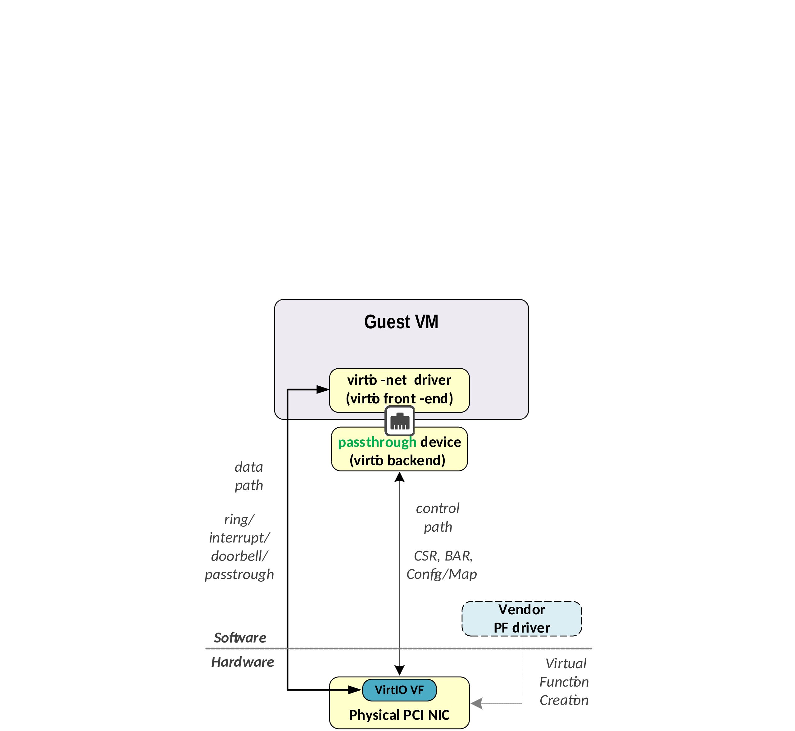]

virtio device passthrough

Virtio device passthrough can be implemented onto a NIC which is supporting or not SR-IOV.

Like other physical device assignment technics presented in this book, VFIO and IOMMU are used to present the physical device NIC into the guest VM user space.

Hence, such a virtio physical NIC can be used by a DPDK application running into a virtual instance.
But, like other virtio device passthrough has also the same limitations for SDN.
As the host operating system is totally by passed by this mechanism, we cannot interconnect instances using such NIC interface with a SDN virtual router or switch.

The main advantage of Virtio device passthrough is the flexibility it provides for a virtual instance to use transparently either a real physical interface or an emulated one.
It offers an Open public specification, which provide device fully independent of any specific vendor.

Virtio full HW offloading, can support live migration thanks to virtio, which is not possible to achieve without any specific implementation with SR-IOV.

But in order to be able to support such a feature, latest virtio specifications (1.1 version) must be implemented onto both QEMU and the NIC hardware used on the cloud infrastructure.

ifdef::word[image:../diagrams/extracted-media-chapter2cleaned4adoc.docx/media/image46.emf[image]]
ifndef::word[]

==== Virtio Datapath Acceleration

Like full hardware offloading, virtual Data Dath Acceleration (vDPA) aims to:

* standardize the physical data plane using the virtio ring layout
* present a standard virtio driver in the guest decoupled from any vendor implementation for the control path

vDPA is presenting a generic control plane through a software piece which provides an abstraction layer on top of physical NIC.

Like Virtio full hardware offloading, vDPA build a direct data path between the gest network interface and the physical NIC, using the virtio ring layout.
But for the control path a generic vDPA driver (mediation driver) is used to translate the vendor NIC driver/control-plane to the VirtIO control plane, in order to allow each NIC vendor to keep using its own driver.

It allows NIC vendors to support virtio ring layout at smaller effort keeping wire speed performance on the data plane.

ifdef::word[image:../diagrams/extracted-media-chapter2cleaned4adoc.docx/media/image47.emf[image]]
ifndef::word[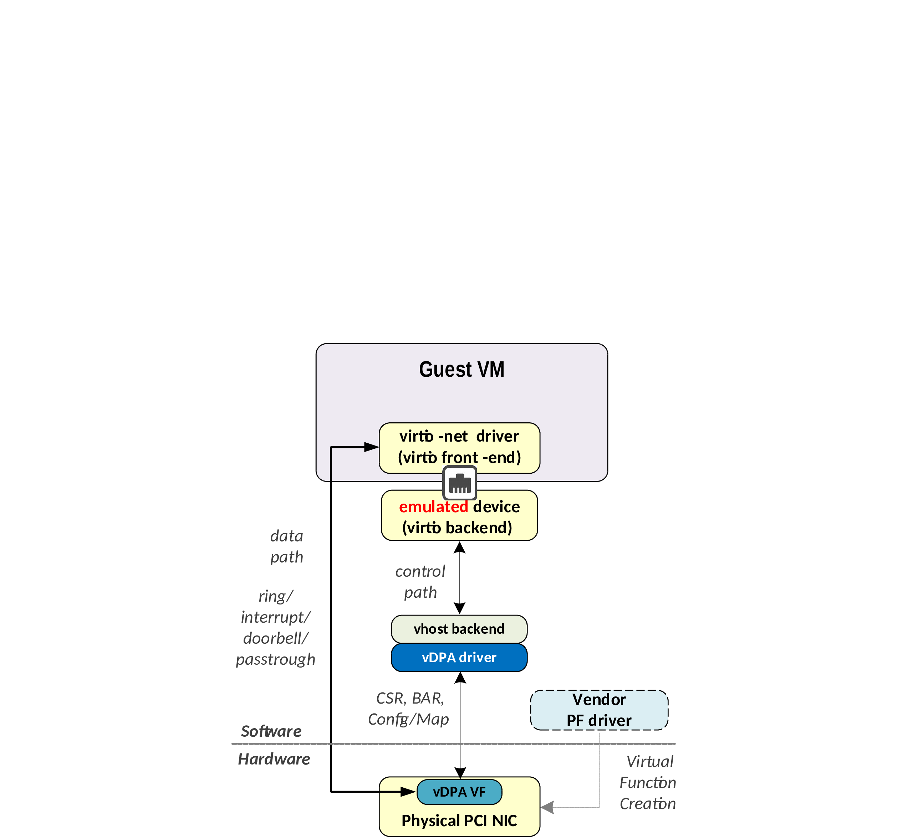]

virtio datapath acceleration

vDPA is requiring a vendor specific "mediation device driver" to be loaded in the host operating system.

ifdef::word[image:../diagrams/extracted-media-chapter2cleaned4adoc.docx/media/image48.emf[image]]
ifndef::word[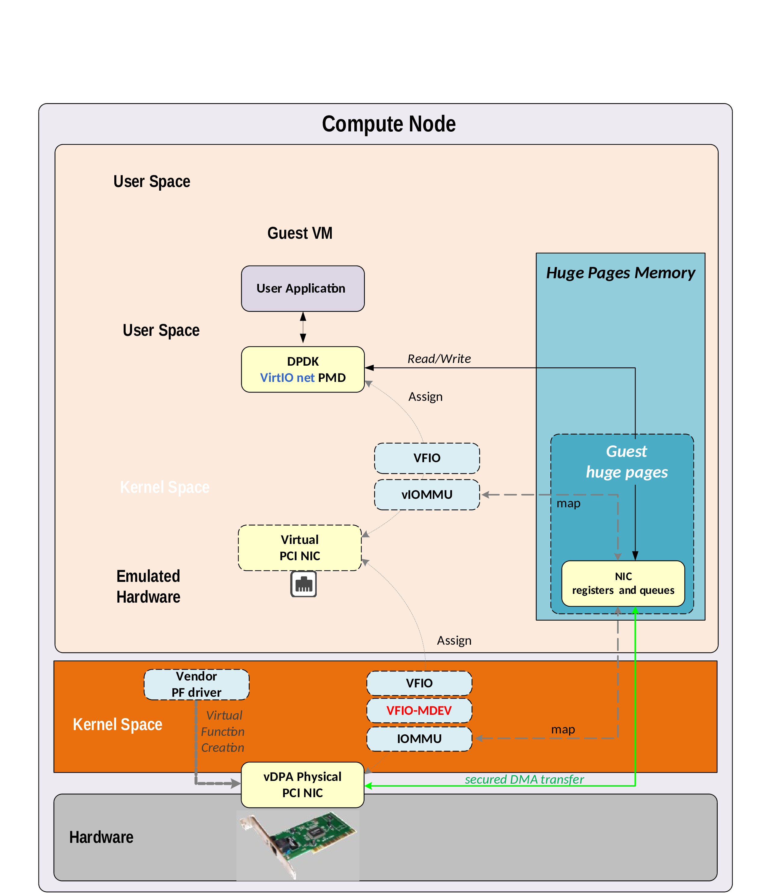]

==== Smart NIC

A NIC card generation commonly named "smart NIC" are highly customizable thanks to the last evolution provided by some new capabilities (FPGA, P4).

It makes possible to envisage SDN vSwitch/vRouter dataplane function to be moved into the NIC card keeping only the controle plane function into the host operating system.

For Contrail solution, this is made by offloading several Contrail vRouter tables including:

* Interface Tables
* Next Hop Tables
* Ingress Label Manager (ILM) Tables
* IPv4 FIB
* IPv6 FIB
* L2 Forwarding Tables
* Flow Tables

It allows to accelerate lookups and forwarding actions that are directly performed into the NIC.

ifdef::word[image:../diagrams/extracted-media-chapter2cleaned4adoc.docx/media/image49.emf[image]]
ifndef::word[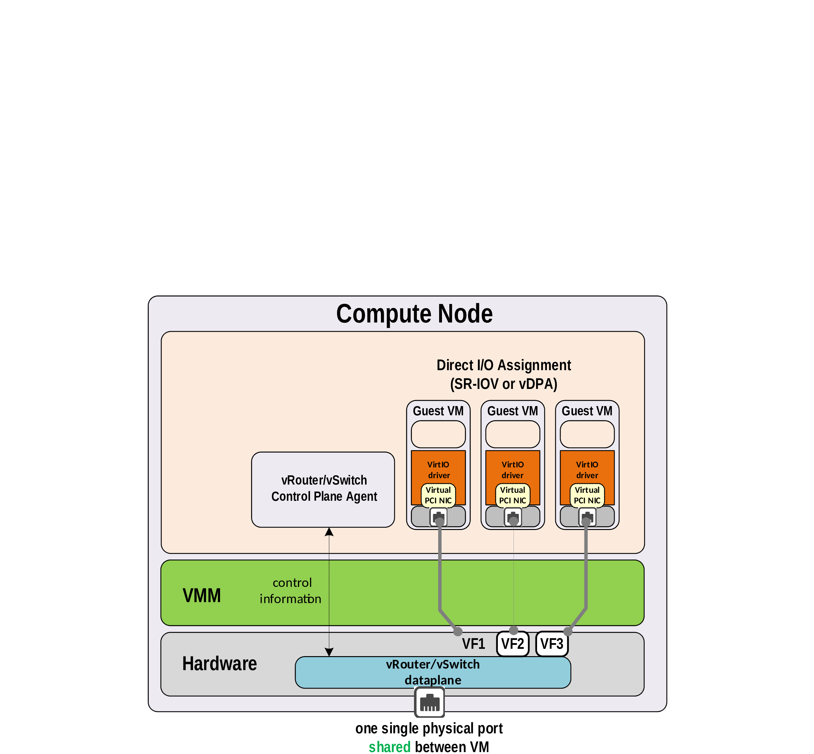]

SDN packet processing is fully done into the NIC card, no more host CPU processing is involved in packet processing.

Two implementations are proposed by Metronome:

SRIOV + SmartNIC:

image:../diagrams/extracted-media-chapter2cleaned4adoc.docx/media/image50.png[image,width=485,height=369]

vDPA + Smart NIC:

image:../diagrams/extracted-media-chapter2cleaned4adoc.docx/media/image51.png[image,width=482,height=383]

==== eBPF and XDP

Berkeley Packet Filter (BPF) was designed for capturing and filtering network packets that matched specific rules.
In last years extended BPF (eBPF) has been designed to take advantage of new hardware (64 bits usage for intance). An eBPF program is "attached" to a designated code path in the kernel.

eXpress Data Path (XDP), uses eBPF to achieve high-performance packet processing by running eBPF programs at the lowest level of the network stack, immediately after a packet is received.
XDP.

ifdef::word[image:../diagrams/extracted-media-chapter2cleaned4adoc.docx/media/image52.emf[image]]
ifndef::word[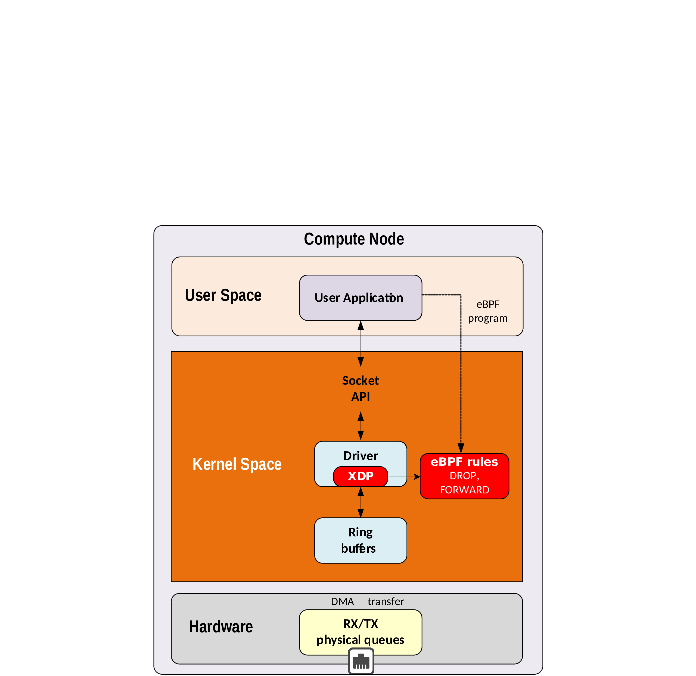]

XDP support is made available in the Linux Kernel since version 4.8, while eBPF is supported in the Linux Kernel since version 3.18.

XDP requires:

* MultiQ NICs
* Common protocol-generic offloads:
** TX/RX checksum offload
** Received Side Scaling
** Transport Segmentation offload (TSO)

XDP packet processor performs:

* In Kernel RX packets processing
* Process RX packets directly (without any additional memory allocation for software queue, nor socket buffer allocation)
* Assign one CPU to each RX queue.
This CPU can be configured into poll mode or interrupt mode.
* Trigger BPF program for packet processing

BFP programs:

* parse packets
* perform table lookup
* manage stateful filters
* manipulate packets (encapsulation, decapsulation, NAT, ...)

BFP program main actions are :

* Forward
* Forward after modification (NAT)
* Drop
* Normal receive (regular Linux packet processing with socket buffer and TCP/IP stack)
* Generic Receive Offload (coalesce several received packets of a same connection

XDP is also able to offload an eBPF program to a NIC card which supports it, reducing the CPU load.

ifdef::word[image:../diagrams/extracted-media-chapter2cleaned4adoc.docx/media/image53.emf[image]]
ifndef::word[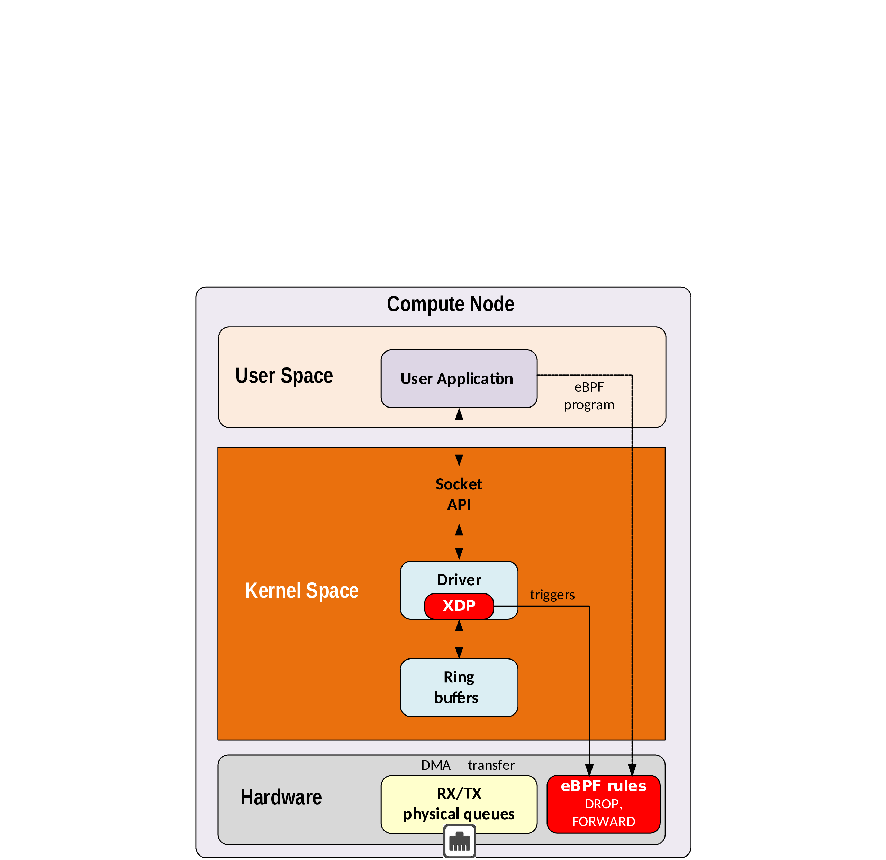]

XDP and eBPF does not require:

* to allocate large pages
* to allocate dedicated CPUs
* to choose packet polling or interrupt driven networking model
* user space to kernel space context switching to perform eBPF filtering
* allow packet processing offload when supported by used NIC card

PS: eBPF rules are also supported in DPDK application.

https://www.redhat.com/en/blog/using-express-data-path-xdp-red-hat-enterprise-linux-8

=== NIC virtualization solutions summary

We’ve seen lots of NIC virtualization models for virtual instances.
From a full software implementation like proposed by VirtIO to fully hardware assisted solution like proposed by SR-IOV.
Also, DPDK is providing the ability to move NIC packet processing from Kernel space to user space.

In the diagram below we are providing an overview of NIC virtualization solution:

* Fully software solutions are very flexible and fits well with SDN and Cloud feature expectation (Live migration, east-west traffic inside host computes)
* Hardware assisted solutions are very performant but fit less with expected virtualization flexibility.
Guest VM migration is poorly supported due to hardware dependencies.
These solutions fit well with application requiring a huge north-south traffic (from Guest WM to cloud outside).

ifdef::word[image:../diagrams/extracted-media-chapter2cleaned4adoc.docx/media/image54.emf[image]]
ifndef::word[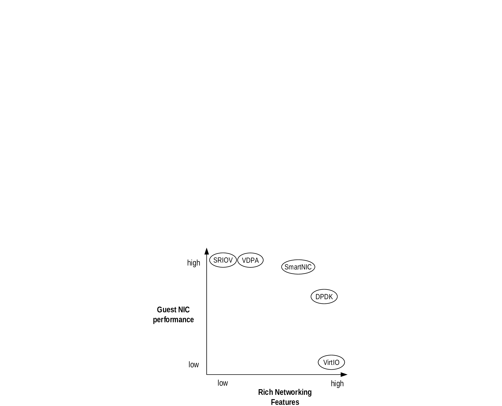]

In the middle, SmartNIC and DPDK are offering the best compromise for a SDN usage.
Smart NIC are proposing very high performance, but this is still not a fully mature solution (lots of implementations vendor specific, no agreed standard).

////
[cols=",,,,,,",options="header",]
|====
|Feature a|
vhost-net

virtio-net

a|
vhost-user

virtio-pmd

|SR-IOV |Virtio full HW offload |vDPA |Smartnic
|Performance |Low |high a|
very high

(wirespeed)

a|
very high

(wirespeed)

a|
very high

(wirespeed)

a|
very high

(wirespeed)

|data path hardware offloading |No |No |Yes |Yes |Yes |Yes
|control path hardware offloading |No |No |Yes |Yes |No |No
|Guest user NIC |N/A |Yes (DPDK) |Yes (DPDK) |Yes (DPDK) |Yes (DPDK) |Yes (DPDK)
|Guest Kernel NIC |Yes |No |Yes |Yes |Yes |Yes
|VirIO Standard |Yes |Yes |No |Yes |Yes |Yes
|SDN switching support |Yes |Yes |No |No |No |Yes
|Live Migration |Yes |Yes |No |Yes (*) |Yes (*) |Yes (*)
|====
////

image:https://user-images.githubusercontent.com/2038044/90983821-e327f080-e53e-11ea-9420-b50e388e5dba.png[image]
(*): depends on hardware and QEMU latest virtio specification support on the NIC card.
